# 🚀 Nền tảng bắt buộc cho AI/ML/Data Science

> **Mục tiêu**: Xây dựng nền tảng vững chắc về lập trình, toán học và công cụ cần thiết để trở thành chuyên gia AI/ML

## 📚 **1. Bảng ký hiệu (Notation)**

### **Programming & Data Structures:**
- **Variable**: $x, y, z$ (biến trong chương trình)
- **Function**: $f(x), g(x, y)$ (hàm số)
- **List**: $L = [x_1, x_2, \ldots, x_n]$ (danh sách)
- **Dictionary**: $D = \{k_1: v_1, k_2: v_2, \ldots\}$ (từ điển)
- **Set**: $S = \{x_1, x_2, \ldots, x_n\}$ (tập hợp)

### **Mathematics:**
- **Vector**: $\mathbf{x} = [x_1, x_2, \ldots, x_n]^T$
- **Matrix**: $\mathbf{A} \in \mathbb{R}^{m \times n}$
- **Scalar**: $a, b, c \in \mathbb{R}$
- **Function**: $f: \mathbb{R}^n \rightarrow \mathbb{R}$
- **Gradient**: $\nabla f(\mathbf{x}) = [\frac{\partial f}{\partial x_1}, \ldots, \frac{\partial f}{\partial x_n}]^T$

### **Statistics & Probability:**
- **Mean**: $\mu = \frac{1}{n}\sum_{i=1}^n x_i$
- **Variance**: $\sigma^2 = \frac{1}{n}\sum_{i=1}^n (x_i - \mu)^2$
- **Probability**: $P(A)$ (xác suất của sự kiện A)
- **Expectation**: $\mathbb{E}[X] = \sum_x x \cdot P(X=x)$

### **Database:**
- **Table**: $T(A_1, A_2, \ldots, A_n)$ (bảng với attributes)
- **Query**: $Q = \sigma_{condition}(T)$ (selection query)
- **Join**: $T_1 \bowtie_{condition} T_2$ (join operation)

## 📖 **2. Glossary (Định nghĩa cốt lõi)**

### **Programming Concepts:**
- **Algorithm**: Thuật toán - tập hợp các bước để giải quyết bài toán
- **Data Structure**: Cấu trúc dữ liệu - cách tổ chức và lưu trữ dữ liệu
- **Time Complexity**: Độ phức tạp thời gian - thời gian chạy của thuật toán
- **Space Complexity**: Độ phức tạp không gian - bộ nhớ cần thiết

### **Mathematics:**
- **Linear Algebra**: Đại số tuyến tính - nghiên cứu về vectors, matrices
- **Calculus**: Giải tích - nghiên cứu về derivatives, integrals
- **Statistics**: Thống kê - thu thập, phân tích và diễn giải dữ liệu
- **Probability**: Xác suất - nghiên cứu về uncertainty và randomness

### **Database:**
- **SQL**: Structured Query Language - ngôn ngữ truy vấn cơ sở dữ liệu
- **Index**: Chỉ mục - cấu trúc dữ liệu để tăng tốc truy vấn
- **Normalization**: Chuẩn hóa - quá trình tổ chức dữ liệu để giảm redundancy

### **Visualization:**
- **Chart**: Biểu đồ - cách biểu diễn dữ liệu trực quan
- **Dashboard**: Bảng điều khiển - tập hợp các biểu đồ và metrics
- **Storytelling**: Kể chuyện bằng dữ liệu - cách trình bày insights

## 📐 **3. Thẻ thuật toán - List Comprehension**

### **1. Bài toán & dữ liệu:**
- **Bài toán**: Tạo list mới từ iterable với điều kiện và transformation
- **Dữ liệu**: Iterable $I = \{x_1, x_2, \ldots, x_n\}$, condition $C(x)$, transformation $T(x)$
- **Ứng dụng**: Data processing, feature engineering, filtering

### **2. Mô hình & công thức:**
**List Comprehension:**
$$L = [T(x) \text{ for } x \text{ in } I \text{ if } C(x)]$$

**Generator Expression:**
$$G = (T(x) \text{ for } x \text{ in } I \text{ if } C(x))$$

Trong đó:
- $T(x)$: Transformation function
- $C(x)$: Condition function
- $I$: Input iterable

### **3. Loss & mục tiêu:**
- **Mục tiêu**: Tạo collection mới một cách concise và readable
- **Loss**: Không có loss, là data transformation

### **4. Tối ưu hoá & cập nhật:**
- **Algorithm**: Iterate through input và apply transformation
- **Cập nhật**: Không có parameter learning

### **5. Hyperparams:**
- **Input size**: $n$ (số phần tử trong iterable)
- **Condition complexity**: $O(C(x))$ (độ phức tạp của condition)
- **Transformation complexity**: $O(T(x))$ (độ phức tạp của transformation)

### **6. Độ phức tạp:**
- **Time**: $O(n \times (C(x) + T(x)))$
- **Space**: 
  - List comprehension: $O(n)$ (lưu toàn bộ result)
  - Generator: $O(1)$ (chỉ lưu iterator state)

### **7. Metrics đánh giá:**
- **Readability**: Code có dễ đọc không?
- **Performance**: Memory usage và execution time
- **Maintainability**: Code có dễ maintain không?

### **8. Ưu / Nhược:**
**Ưu điểm:**
- Concise và readable
- Pythonic style
- Memory efficient với generator

**Nhược điểm:**
- Có thể khó debug
- Không phù hợp cho complex logic
- Nested comprehension có thể khó đọc

### **9. Bẫy & mẹo:**
- **Bẫy**: Nested comprehension quá phức tạp → khó đọc
- **Bẫy**: Quên condition → tạo list không mong muốn
- **Mẹo**: Dùng generator cho large datasets
- **Mẹo**: Break complex logic thành multiple steps

### **10. Pseudocode:**
```python
def list_comprehension(iterable, condition, transform):
    result = []
    for item in iterable:
        if condition(item):
            result.append(transform(item))
    return result

def generator_expression(iterable, condition, transform):
    for item in iterable:
        if condition(item):
            yield transform(item)
```

### **11. Code mẫu:**
```python
# List comprehension - tạo list các số chẵn bình phương
squares = [x**2 for x in range(10) if x % 2 == 0]
# Kết quả: [0, 4, 16, 36, 64]

# Generator expression - tiết kiệm bộ nhớ, chỉ tính khi cần
squares_gen = (x**2 for x in range(10) if x % 2 == 0)
# Kết quả: generator object, không chiếm bộ nhớ

# Feature engineering với generator - tiết kiệm memory
def feature_generator(data_stream):
    """Tạo features từ data stream mà không load toàn bộ vào memory"""
    for batch in data_stream:
        features = [extract_feature(x) for x in batch]
        yield features

# Nested comprehension example
matrix = [[1, 2, 3], [4, 5, 6], [7, 8, 9]]
flattened = [item for row in matrix for item in row]
# Kết quả: [1, 2, 3, 4, 5, 6, 7, 8, 9]

# Dictionary comprehension
squares_dict = {x: x**2 for x in range(5)}
# Kết quả: {0: 0, 1: 1, 2: 4, 3: 9, 4: 16}
```

### **12. Checklist kiểm tra nhanh:**
- [ ] Comprehension có readable?
- [ ] Condition có đúng logic?
- [ ] Transformation có efficient?
- [ ] Memory usage có acceptable?
- [ ] Code có maintainable?

---

## 📋 Tổng quan nội dung

```mermaid
graph TD
    A[🎯 Nền tảng bắt buộc] --> B[🐍 Python Nâng cao]
    A --> C[📊 Toán học cơ bản]
    A --> D[🗄️ SQL & Database]
    A --> E[🎨 Trực quan hóa dữ liệu]
    A --> F[🔧 Git & CLI Tools]
    
    B --> B1[Cấu trúc dữ liệu & Algorithms]
    B --> B2[OOP & Design Patterns]
    B --> B3[Packaging & Testing]
    B --> B4[Performance & Optimization]
    
    C --> C1[Đại số tuyến tính]
    C --> C2[Giải tích & Tối ưu hóa]
    C --> C3[Xác suất & Thống kê]
    
    D --> D1[Queries & JOINs]
    D --> D2[Schema Design]
    D --> D3[Performance Tuning]
    
    E --> E1[Matplotlib/Seaborn]
    E --> E2[Plotly & Interactive]
    E --> E3[Storytelling & Dashboard]
    
    F --> F1[Version Control]
    F --> F2[Command Line]
    F --> F3[Automation Scripts]
```




**📁 [Xem file PNG trực tiếp](assets/foundations-overview.png)**

**📁 [Xem file PNG trực tiếp](assets/foundations-overview.png)**

**📁 [Xem file PNG trực tiếp](assets/foundations-overview.png)**

## 🧩 Chương trình 50/50 (Lý thuyết : Thực hành)

- Mục tiêu: 50% lý thuyết (Python advanced, Math, SQL, Visualization, Git/CLI), 50% thực hành (notebook/bài tập/mini-project)

| Mô-đun | Lý thuyết (50%) | Thực hành (50%) |
|---|---|---|
| Python | Structures, OOP, packaging/testing | Thư viện nhỏ + pytest + publish TestPyPI |
| Toán | LA/Calc/Stats cốt lõi | Bài tập PCA, CI, kiểm định |
| SQL | JOIN/CTE/Window & Indexing | Truy vấn tối ưu + explain |
| Viz | Nguyên tắc chọn biểu đồ | Dashboard Plotly đơn giản |
| Git/CLI | Branch/PR, shell tools | Repo + script tự động hoá |

Rubric (100đ/module): Lý thuyết 30 | Code 30 | Kết quả 30 | Báo cáo 10

---

## 🐍 1. Python Nâng cao

### 1.1 Cấu trúc dữ liệu và Algorithms

> **Tại sao cần học?** Python là ngôn ngữ chính trong AI/ML. Hiểu sâu về cấu trúc dữ liệu giúp tối ưu hiệu suất và viết code sạch hơn.

#### List comprehensions và Generator expressions

**List comprehension** - Cách viết ngắn gọn để tạo list từ iterable:
```python
# List comprehension - tạo list các số chẵn bình phương
squares = [x**2 for x in range(10) if x % 2 == 0]
# Kết quả: [0, 4, 16, 36, 64]

# Generator expression - tiết kiệm bộ nhớ, chỉ tính khi cần
squares_gen = (x**2 for x in range(10) if x % 2 == 0)
# Kết quả: generator object, không chiếm bộ nhớ
```

**Lý thuyết cơ bản:**
- **List comprehension**: Tạo toàn bộ list trong bộ nhớ ngay lập tức
- **Generator expression**: Tạo từng phần tử khi cần, tiết kiệm bộ nhớ

**Phân tích độ phức tạp:**
- **Time Complexity**: O(n) cho cả hai
- **Space Complexity**: 
  - List comprehension: O(n) - lưu toàn bộ list
  - Generator: O(1) - chỉ lưu iterator state

**Ứng dụng trong ML:**
```python
# Feature engineering với generator - tiết kiệm memory
def feature_generator(data_stream):
    """Tạo features từ data stream mà không load toàn bộ vào memory"""
    for batch in data_stream:
        features = [extract_feature(x) for x in batch]
        yield features

# Memory-efficient data processing
large_dataset = (process_row(row) for row in read_large_file())
```

**Best Practices:**
- Dùng list comprehension khi cần random access hoặc multiple iterations
- Dùng generator khi xử lý large datasets hoặc streaming data
- Kết hợp với `itertools.islice()` để pagination

#### itertools module - Bộ công cụ mạnh mẽ

```python
from itertools import combinations, permutations, product, chain

# Combinations - tổ hợp không lặp lại
list(combinations([1,2,3], 2))  
# Kết quả: [(1,2), (1,3), (2,3)]
# Công thức: C(n,r) = n!/(r!(n-r)!)

# Permutations - hoán vị có thứ tự
list(permutations([1,2,3], 2))  
# Kết quả: [(1,2), (1,3), (2,1), (2,3), (3,1), (3,2)]
# Công thức: P(n,r) = n!/(n-r)!

# Product - tích Descartes (tất cả tổ hợp có thể)
list(product([1,2], ['a','b']))  
# Kết quả: [(1,'a'), (1,'b'), (2,'a'), (2,'b')]
# Công thức: n1 × n2 × ... × nk
```

**Lý thuyết toán học:**
- **Combinations**: C(n,r) = n!/(r!(n-r)!) - số cách chọn r phần tử từ n phần tử không quan tâm thứ tự
- **Permutations**: P(n,r) = n!/(n-r)! - số cách sắp xếp r phần tử từ n phần tử có quan tâm thứ tự
- **Product**: n1 × n2 × ... × nk - tích Descartes của các tập hợp

**Phân tích độ phức tạp:**
```python
# Time complexity analysis
from time import time
import matplotlib.pyplot as plt

def benchmark_combinatorics():
    """Benchmark performance của các hàm itertools"""
    sizes = range(5, 21)
    times = {'combinations': [], 'permutations': [], 'product': []}
    
    for n in sizes:
        # Test combinations
        start = time()
        list(combinations(range(n), n//2))
        times['combinations'].append(time() - start)
        
        # Test permutations  
        start = time()
        list(permutations(range(n), n//2))
        times['permutations'].append(time() - start)
        
        # Test product
        start = time()
        list(product(range(n//2), repeat=2))
        times['product'].append(time() - start)
    
    return sizes, times

# Plot performance comparison
sizes, times = benchmark_combinatorics()
plt.figure(figsize=(10, 6))
for name, time_data in times.items():
    plt.plot(sizes, time_data, label=name, marker='o')
plt.xlabel('Input Size (n)')
plt.ylabel('Time (seconds)')
plt.title('Performance Comparison: itertools functions')
plt.legend()
plt.grid(True)
plt.show()
```

**Ứng dụng thực tế trong ML:**
- **Combinations**: 
  - Feature selection: C(n,k) combinations cho k features từ n total features
  - Subset selection: Tìm optimal feature subset
- **Permutations**: 
  - Hyperparameter tuning: P(n,k) orders cho k hyperparameters
  - Sequence modeling: Tạo training sequences
- **Product**: 
  - Grid search: Cartesian product của hyperparameter ranges
  - Cross-validation: Tất cả combinations của train/validation splits

**Memory Optimization:**
```python
# Lazy evaluation với generators
def lazy_feature_combinations(features, k):
    """Tạo feature combinations mà không load tất cả vào memory"""
    for combo in combinations(features, k):
        yield list(combo)

# Batch processing cho large datasets
def batch_combinations(items, k, batch_size=1000):
    """Process combinations theo batches để tránh memory overflow"""
    combo_gen = combinations(items, k)
    batch = []
    for combo in combo_gen:
        batch.append(combo)
        if len(batch) >= batch_size:
            yield batch
            batch = []
    if batch:  # Yield remaining items
        yield batch
```

#### OOP Patterns - Thiết kế hướng đối tượng

```python
from abc import ABC, abstractmethod
from dataclasses import dataclass
from typing import Protocol, Generic, TypeVar

# Abstract Base Class - lớp cơ sở trừu tượng
class DataProcessor(ABC):
    @abstractmethod
    def process(self, data: bytes) -> str:
        """Phương thức bắt buộc phải implement"""
        pass

# Protocol - typing cấu trúc (structural typing)
class Serializable(Protocol):
    def serialize(self) -> bytes: ...

# Generic types - kiểu dữ liệu tổng quát
T = TypeVar('T')  # Type variable
class Container(Generic[T]):
    def __init__(self, item: T):
        self.item = item
    
    def get_item(self) -> T:
        return self.item

# Dataclass - tự động tạo __init__, __repr__, etc.
@dataclass
class DataPoint:
    x: float
    y: float
    label: str = "unknown"
```

**Lý thuyết OOP và Type Systems:**

**1. Abstract Base Classes (ABC):**
- **Purpose**: Định nghĩa interface mà không implement
- **Benefits**: 
  - Enforce contract implementation
  - Polymorphism và dependency injection
  - Testability và mockability
- **Design Pattern**: Template Method Pattern

```python
from abc import ABC, abstractmethod
from typing import List, Dict, Any

class MLModel(ABC):
    """Abstract base class cho tất cả ML models"""
    
    @abstractmethod
    def fit(self, X: np.ndarray, y: np.ndarray) -> 'MLModel':
        """Train model - must be implemented by subclasses"""
        pass
    
    @abstractmethod
    def predict(self, X: np.ndarray) -> np.ndarray:
        """Make predictions - must be implemented by subclasses"""
        pass
    
    @abstractmethod
    def score(self, X: np.ndarray, y: np.ndarray) -> float:
        """Evaluate model performance - must be implemented by subclasses"""
        pass

# Concrete implementation
class LinearRegression(MLModel):
    def fit(self, X: np.ndarray, y: np.ndarray) -> 'LinearRegression':
        # Implementation here
        return self
    
    def predict(self, X: np.ndarray) -> np.ndarray:
        # Implementation here
        pass
    
    def score(self, X: np.ndarray, y: np.ndarray) -> float:
        # Implementation here
        pass
```

**2. Structural Typing với Protocol:**
- **Concept**: "Duck typing" với type checking
- **Benefits**: 
  - Flexible interfaces
  - No inheritance coupling
  - Runtime type safety

```python
from typing import Protocol, runtime_checkable

@runtime_checkable
class DataProcessor(Protocol):
    """Protocol cho data processing - structural typing"""
    def process(self, data: bytes) -> str: ...
    def validate(self, data: bytes) -> bool: ...

# Any class implementing these methods satisfies the protocol
class TextProcessor:
    def process(self, data: bytes) -> str:
        return data.decode('utf-8')
    
    def validate(self, data: bytes) -> bool:
        return len(data) > 0

# Type checker accepts this
def process_data(processor: DataProcessor, data: bytes) -> str:
    if processor.validate(data):
        return processor.process(data)
    raise ValueError("Invalid data")

# This works at runtime
text_proc = TextProcessor()
result = process_data(text_proc, b"Hello World")
```

**3. Generic Types và Type Variables:**
- **Purpose**: Type-safe generic programming
- **Benefits**: 
  - Reusable code với different types
  - Compile-time type checking
  - Better IDE support

```python
from typing import TypeVar, Generic, List, Dict, Union
from dataclasses import dataclass

# Type variables
T = TypeVar('T')  # Unbounded type variable
N = TypeVar('N', bound=Union[int, float])  # Bounded type variable
K = TypeVar('K')  # Key type
V = TypeVar('V')  # Value type

@dataclass
class DataContainer(Generic[T]):
    """Generic container cho any data type"""
    data: T
    metadata: Dict[str, Any]
    
    def get_data(self) -> T:
        return self.data
    
    def set_data(self, new_data: T) -> None:
        self.data = new_data

# Usage examples
int_container = DataContainer[int](data=42, metadata={"type": "integer"})
str_container = DataContainer[str](data="hello", metadata={"type": "string"})

# Generic collections
class FeatureStore(Generic[K, V]):
    """Generic feature store với key-value pairs"""
    
    def __init__(self):
        self._store: Dict[K, V] = {}
    
    def set_feature(self, key: K, value: V) -> None:
        self._store[key] = value
    
    def get_feature(self, key: K) -> V:
        return self._store[key]
    
    def get_all_features(self) -> Dict[K, V]:
        return self._store.copy()

# Usage với different types
feature_store = FeatureStore[str, np.ndarray]()
feature_store.set_feature("user_embedding", np.random.randn(128))
```

**4. Advanced Design Patterns:**
```python
from typing import Callable, Optional
from functools import wraps

# Decorator Pattern
def retry(max_attempts: int = 3, delay: float = 1.0):
    """Retry decorator cho unreliable operations"""
    def decorator(func: Callable) -> Callable:
        @wraps(func)
        def wrapper(*args, **kwargs):
            last_exception = None
            for attempt in range(max_attempts):
                try:
                    return func(*args, **kwargs)
                except Exception as e:
                    last_exception = e
                    if attempt < max_attempts - 1:
                        time.sleep(delay * (2 ** attempt))  # Exponential backoff
            raise last_exception
        return wrapper
    return decorator

# Factory Pattern
class ModelFactory:
    """Factory cho creating ML models"""
    
    _models: Dict[str, Type[MLModel]] = {}
    
    @classmethod
    def register(cls, name: str, model_class: Type[MLModel]) -> None:
        """Register a new model class"""
        cls._models[name] = model_class
    
    @classmethod
    def create(cls, name: str, **kwargs) -> MLModel:
        """Create model instance by name"""
        if name not in cls._models:
            raise ValueError(f"Unknown model: {name}")
        return cls._models[name](**kwargs)

# Register models
ModelFactory.register("linear", LinearRegression)
ModelFactory.register("random_forest", RandomForestClassifier)

# Create models
linear_model = ModelFactory.create("linear")
rf_model = ModelFactory.create("random_forest")
```

**5. Memory Management và Performance:**
```python
import weakref
from contextlib import contextmanager

class CacheManager:
    """Memory-efficient cache với weak references"""
    
    def __init__(self):
        self._cache = weakref.WeakValueDictionary()
    
    def get(self, key: str) -> Optional[Any]:
        return self._cache.get(key)
    
    def set(self, key: str, value: Any) -> None:
        self._cache[key] = value
    
    def clear(self) -> None:
        self._cache.clear()

# Context manager cho resource management
@contextmanager
def timed_operation(operation_name: str):
    """Context manager để measure operation time"""
    start_time = time.time()
    try:
        yield
    finally:
        elapsed = time.time() - start_time
        print(f"{operation_name} took {elapsed:.4f} seconds")

# Usage
with timed_operation("Model Training"):
    model.fit(X_train, y_train)
```

### 1.2 Packaging và Testing

> **Tại sao cần học?** Package management giúp chia sẻ code, dependency management. Testing đảm bảo code hoạt động đúng và dễ maintain.

#### pyproject.toml - Cấu hình package hiện đại

```toml
[build-system]
requires = ["setuptools>=61.0", "wheel"]
build-backend = "setuptools.build_meta"

[project]
name = "my-ai-package"
version = "0.1.0"
description = "AI/ML package for data analysis"
requires-python = ">=3.8"
dependencies = [
    "numpy>=1.21.0",      # Thư viện tính toán số học
    "pandas>=1.3.0",      # Thư viện xử lý dữ liệu
    "scikit-learn>=1.0",  # Thư viện machine learning
]

[project.optional-dependencies]
dev = [
    "pytest>=7.0.0",      # Framework testing
    "black>=22.0.0",      # Code formatter
    "mypy>=0.950",        # Type checker
    "flake8>=4.0.0",      # Linter
]

[tool.pytest.ini_options]
testpaths = ["tests"]           # Thư mục chứa tests
python_files = ["test_*.py"]    # Pattern tên file test
addopts = "-v --tb=short"       # Options mặc định
```

**Giải thích các phần:**
- **build-system**: Công cụ để build package
- **dependencies**: Các thư viện bắt buộc khi cài đặt
- **optional-dependencies**: Các thư viện chỉ cần cho development
- **tool.pytest.ini_options**: Cấu hình cho pytest

#### pytest patterns - Các mẫu testing hiệu quả

```python
import pytest
from unittest.mock import Mock, patch

# Fixtures - dữ liệu test được tái sử dụng
@pytest.fixture
def sample_data():
    """Tạo dữ liệu mẫu cho testing"""
    return {"a": 1, "b": 2, "c": 3}

@pytest.fixture
def mock_model():
    """Mock model để test mà không cần train thật"""
    model = Mock()
    model.predict.return_value = [0.1, 0.9, 0.3]
    return model

# Parametrized tests - test nhiều trường hợp cùng lúc
@pytest.mark.parametrize("input_data,expected", [
    ([1,2,3], 6),      # Test case 1: tổng các số dương
    ([0,0,0], 0),      # Test case 2: tổng các số 0
    ([-1,1], 0),       # Test case 3: tổng các số âm và dương
])
def test_sum_function(input_data, expected):
    """Test function tính tổng"""
    assert sum(input_data) == expected

# Mock và patch - giả lập external dependencies
def test_data_loading(mock_model):
    """Test việc load dữ liệu với mock model"""
    with patch('pandas.read_csv') as mock_read:
        mock_read.return_value = sample_data()
        # Test logic của bạn ở đây
        assert mock_model.predict.called
```

**Các khái niệm testing:**
- **Fixture**: Dữ liệu hoặc object được tái sử dụng trong nhiều test
- **Parametrized test**: Chạy cùng một test với nhiều bộ dữ liệu khác nhau
- **Mock**: Giả lập object để test mà không cần dependency thật
- **Patch**: Thay thế tạm thời một object trong quá trình test

### 1.3 Toán học cơ bản

> **Tại sao cần học?** Toán học là ngôn ngữ của AI/ML. Hiểu các khái niệm cơ bản giúp bạn không chỉ *sử dụng* các thư viện có sẵn mà còn *hiểu sâu* cách chúng hoạt động, từ đó có thể tùy chỉnh, tối ưu hóa và thậm chí phát triển các thuật toán mới.

#### Đại số tuyến tính

Đại số tuyến tính là nhánh toán học nghiên cứu về không gian vector và các phép biến đổi tuyến tính. Trong AI/ML, dữ liệu thường được biểu diễn dưới dạng vector và ma trận, và các thuật toán ML cốt lõi (như Neural Networks) thực chất là một chuỗi các phép biến đổi tuyến tính.

##### Vector

- **Vector là gì?** Một vector là một mảng các con số, biểu diễn một điểm trong không gian nhiều chiều. Mỗi con số trong vector đại diện cho một chiều (một thuộc tính hoặc feature).
    - Ví dụ: Vector `[tuổi, thu_nhập, số_năm_kinh_nghiệm]` có thể đại diện cho một ứng viên.
- **Biểu diễn trong code**:
    ```python
    import numpy as np
    # Vector biểu diễn một người dùng với 3 features
    user_vector = np.array([25, 50000, 3]) 
    ```

##### Các phép toán cơ bản trên Vector
- **Cộng Vector**: `v1 + v2` - Kết hợp thông tin. Ví dụ: cộng vector "vua" và vector "phụ nữ" có thể cho ra một vector gần với "nữ hoàng".
- **Nhân với số vô hướng (Scalar Multiplication)**: `c * v` - Scale (co giãn) một vector. Ví dụ: `2 * user_vector` làm tăng gấp đôi tất cả các thuộc tính.

##### Tích vô hướng (Dot Product)

- **Công thức**: `v1 · v2 = Σ(v1[i] * v2[i])`
- **Ý nghĩa trực quan**: Tích vô hướng đo lường mức độ "cùng hướng" (tương đồng) của hai vector.
    - Nếu `v1 · v2 > 0`: Hai vector cùng hướng.
    - Nếu `v1 · v2 < 0`: Hai vector ngược hướng.
    - Nếu `v1 · v2 = 0`: Hai vector vuông góc (trực giao), không có sự tương quan tuyến tính.
- **Ứng dụng trong ML**:
    - **Đo độ tương đồng**: Rất quan trọng trong các hệ thống gợi ý (recommendation systems) và tìm kiếm ngữ nghĩa (semantic search).
    - **Tính toán trong Neural Network**: Là phép toán cốt lõi trong mỗi neuron (tổng trọng số của các input).

```python
# Vector operations
v1 = np.array([1, 2, 3])  # Vector biểu diễn feature A
v2 = np.array([4, 5, 6])  # Vector biểu diễn feature B

# Tích vô hướng (Dot product)
dot_product = np.dot(v1, v2)  # 1*4 + 2*5 + 3*6 = 32
print(f"Tích vô hướng: {dot_product}")
# Giá trị dương lớn cho thấy 2 vector khá tương đồng về hướng.
```

##### Ma trận (Matrix)

- **Ma trận là gì?** Một ma trận là một mảng hai chiều các con số, có thể được xem như một tập hợp các vector.
- **Ứng dụng trong ML**:
    - **Biểu diễn dữ liệu**: Một ma trận có thể biểu diễn một tập dữ liệu, trong đó mỗi hàng là một mẫu dữ liệu (data point) và mỗi cột là một feature.
    - **Biến đổi tuyến tính (Linear Transformation)**: Một ma trận có thể "biến đổi" một vector từ không gian này sang không gian khác (xoay, co giãn, trượt). Đây là nền tảng của Neural Networks.
    - **Lưu trữ trọng số**: Trong Neural Networks, các trọng số (weights) của một layer được lưu trong một ma trận.

##### Phép nhân ma trận (Matrix Multiplication)

- **Công thức**: `C = A @ B` - Nhân ma trận A (kích thước `m x n`) với ma trận B (kích thước `n x p`) sẽ cho ra ma trận C (kích thước `m x p`).
- **Ý nghĩa trực quan**: Nhân một vector với một ma trận (`y = A @ x`) chính là áp dụng một phép biến đổi tuyến tính lên vector đó. Chuỗi các layer trong Neural Network thực chất là một chuỗi các phép nhân ma trận.
- **Ví dụ**:
    ```python
    # Ma trận A có thể đại diện cho trọng số của một layer trong neural network
    A = np.array([[1, 2], [3, 4]]) 
    # Vector x là input của layer đó
    x = np.array([5, 6])

    # Phép nhân ma trận A @ x biến đổi vector x
    transformed_x = A @ x  # (1*5 + 2*6, 3*5 + 4*6) = (17, 39)
    print(f"Vector x sau khi biến đổi bởi A: {transformed_x}")
    ```

##### Eigenvalues và Eigenvectors (Trị riêng và Vector riêng)

- **Ý nghĩa trực quan**: Khi một ma trận (phép biến đổi tuyến tính) tác động lên hầu hết các vector, nó sẽ làm thay đổi hướng của chúng. Tuy nhiên, có một số vector đặc biệt chỉ bị co giãn (dài ra hoặc ngắn lại) mà không đổi hướng.
    - **Eigenvector**: Là những vector không đổi hướng này. Chúng đại diện cho các "trục chính" của phép biến đổi.
    - **Eigenvalue**: Là hệ số co giãn tương ứng với mỗi eigenvector. Nó cho biết mức độ co giãn (quan trọng) của trục đó.
- **Ứng dụng trong ML**:
    - **PCA (Principal Component Analysis)**: Một thuật toán giảm chiều dữ liệu. PCA tìm các eigenvectors của ma trận hiệp phương sai (covariance matrix) để xác định các "thành phần chính" (các hướng có nhiều thông tin nhất) của dữ liệu. Các eigenvalue tương ứng cho biết tầm quan trọng của mỗi thành phần. Bằng cách giữ lại các thành phần có eigenvalue lớn nhất, ta có thể giảm chiều dữ liệu mà mất ít thông tin nhất.
    - **Phân tích độ ổn định của hệ thống**: Trong các hệ thống động, eigenvalues giúp xác định hệ thống có ổn định hay không.

```python
# Matrix operations
A = np.array([[1, 2], [3, 4]])
B = np.array([[5, 6], [7, 8]])

# Matrix multiplication
C = A @ B
print(f"Phép nhân ma trận A @ B:\n{C}")

# Eigenvalues và Eigenvectors
# Chỉ áp dụng cho ma trận vuông
eigenvalues, eigenvectors = np.linalg.eig(A)
print(f"\nEigenvalues của A: {eigenvalues}")
print(f"Eigenvectors của A:\n{eigenvectors}")

# Kiểm tra tính chất A @ v = λ * v
for i in range(len(eigenvalues)):
    v = eigenvectors[:, i]
    lambda_v = eigenvalues[i] * v
    Av = A @ v
    # So sánh xem Av và λv có tương đương không
    print(f"\nKiểm tra Eigenvector {i+1}:")
    print(f"A @ v = {Av}")
    print(f"λ * v = {lambda_v}")
    assert np.allclose(Av, lambda_v) # allclose dùng để so sánh float
```

**Giải thích khái niệm:**
- **Dot product (Tích vô hướng)**: Đo độ tương đồng về hướng và độ lớn giữa hai vector.
- **Matrix multiplication (Phép nhân ma trận)**: Áp dụng một chuỗi các phép biến đổi tuyến tính. Là trái tim của các mạng nơ-ron sâu.
- **Eigenvalues/Eigenvectors (Trị riêng/Vector riêng)**: Các "trục bất biến" của một phép biến đổi tuyến tính. Rất quan trọng trong các thuật toán giảm chiều dữ liệu như PCA và trong việc hiểu các thuộc tính của ma trận.

#### Xác suất và Thống kê

Xác suất và Thống kê cung cấp các công cụ để mô hình hóa sự không chắc chắn (uncertainty) và để rút ra kết luận từ dữ liệu.

-   **Xác suất (Probability)**: Bắt đầu với một mô hình (ví dụ: một đồng xu công bằng), và dự đoán dữ liệu (ví dụ: xác suất nhận được mặt ngửa là 50%).
-   **Thống kê (Statistics)**: Bắt đầu với dữ liệu (ví dụ: tung đồng xu 100 lần, nhận được 55 lần mặt ngửa), và suy luận về mô hình (ví dụ: liệu đồng xu có công bằng không?).

##### Các khái niệm xác suất cơ bản

-   **Xác suất có điều kiện (Conditional Probability)**: $P(A|B)$ - xác suất của sự kiện A xảy ra *biết rằng* sự kiện B đã xảy ra. Ví dụ: $P(\text{mưa}|\text{trời có mây})$.
-   **Định lý Bayes (Bayes' Theorem)**: Là nền tảng của suy luận thống kê và nhiều thuật toán ML. Nó cho phép chúng ta cập nhật "niềm tin" của mình về một giả thuyết khi có dữ liệu mới.
    $$ P(\text{Giả thuyết | Dữ liệu}) = \frac{P(\text{Dữ liệu | Giả thuyết}) \times P(\text{Giả thuyết})}{P(\text{Dữ liệu})} $$
    - $P(\text{Giả thuyết | Dữ liệu})$ (Posterior): Niềm tin vào giả thuyết *sau khi* thấy dữ liệu.
    - $P(\text{Dữ liệu | Giả thuyết})$ (Likelihood): Khả năng có được dữ liệu này nếu giả thuyết là đúng.
    - $P(\text{Giả thuyết})$ (Prior): Niềm tin vào giả thuyết *trước khi* thấy dữ liệu.

##### Phân phối chuẩn (Normal Distribution)

- **Là gì?**: Còn gọi là phân phối Gauss, có hình chuông đặc trưng. Rất nhiều hiện tượng trong tự nhiên tuân theo phân phối này (chiều cao, cân nặng, sai số đo lường).
- **Tại sao quan trọng?**: **Định lý giới hạn trung tâm (Central Limit Theorem)** nói rằng trung bình của một lượng lớn các biến ngẫu nhiên độc lập sẽ có phân phối xấp xỉ chuẩn, bất kể phân phối gốc của chúng là gì. Điều này làm cho phân phối chuẩn trở nên cực kỳ phổ biến trong thống kê.
- **Tham số**:
    - **μ (mu)**: Giá trị trung bình (mean), đỉnh của hình chuông.
    - **σ (sigma)**: Độ lệch chuẩn (standard deviation), đo độ "phân tán" hay "dẹt" của hình chuông.

```python
import scipy.stats as stats
import numpy as np

# Phân phối chuẩn (Normal distribution) với trung bình 0 và độ lệch chuẩn 1
# μ (mu) = mean, σ (sigma) = standard deviation
normal_dist = stats.norm(loc=0, scale=1)  # loc=μ, scale=σ

# Tính xác suất P(X < 1), tức là diện tích dưới đường cong bên trái của x=1
prob_less_than_1 = normal_dist.cdf(1)  # cdf: Cumulative Distribution Function
print(f"P(X < 1) trong phân phối chuẩn (0,1): {prob_less_than_1:.4f}")
# Khoảng 84.13% giá trị sẽ nhỏ hơn 1.
```

##### Khoảng tin cậy (Confidence Interval)

- **Ý nghĩa trực quan**: Thay vì ước lượng một tham số (ví dụ: chiều cao trung bình của người Việt Nam) bằng một con số duy nhất, ta đưa ra một *khoảng* và nói rằng ta "tin tưởng 95%" rằng giá trị thật nằm trong khoảng đó.
- **"Tin tưởng 95%" nghĩa là gì?**: Nếu ta lặp lại quy trình lấy mẫu và tính khoảng tin cậy này 100 lần, thì khoảng 95 trong số các khoảng tin cậy đó sẽ chứa giá trị thật của tham số. Nó không có nghĩa là có 95% xác suất giá trị thật nằm trong một khoảng tin cậy cụ thể.

```python
# Giả sử ta có một mẫu dữ liệu
data = np.random.normal(loc=170, scale=5, size=100) # Mẫu 100 người có chiều cao trung bình 170cm

# Tính khoảng tin cậy 95% cho giá trị trung bình
# Ta dùng t-distribution vì ta đang ước lượng từ một mẫu
confidence_interval = stats.t.interval(0.95, df=len(data)-1, 
                                     loc=np.mean(data), 
                                     scale=stats.sem(data)) # sem: Standard Error of the Mean

print(f"Chiều cao trung bình của mẫu: {np.mean(data):.2f} cm")
print(f"Khoảng tin cậy 95% cho chiều cao trung bình thật: [{confidence_interval[0]:.2f}, {confidence_interval[1]:.2f}] cm")
```

##### Kiểm định giả thuyết (Hypothesis Testing)
- **Mục đích**: Dùng dữ liệu từ mẫu để đưa ra quyết định về một giả thuyết nào đó về tổng thể.
- **Các bước cơ bản**:
    1.  **Phát biểu giả thuyết không (Null Hypothesis, H₀)**: Thường là giả thuyết "không có gì xảy ra" (ví dụ: thuốc mới không có tác dụng, hai nhóm là như nhau).
    2.  **Phát biểu giả thuyết đối (Alternative Hypothesis, H₁)**: Điều bạn muốn chứng minh (ví dụ: thuốc mới có tác dụng).
    3.  **Tính toán p-value**: Là xác suất quan sát được kết quả hiện tại (hoặc cực đoan hơn) *nếu giả thuyết không là đúng*.
    4.  **Kết luận**: Nếu p-value rất nhỏ (thường < 0.05), ta có bằng chứng để bác bỏ giả thuyết không và chấp nhận giả thuyết đối.

**Giải thích khái niệm:**
- **μ (mu)**: Giá trị trung bình của phân phối, thể hiện "trung tâm" của dữ liệu.
- **σ (sigma)**: Độ lệch chuẩn, đo độ phân tán của dữ liệu quanh giá trị trung bình.
- **Confidence interval (Khoảng tin cậy)**: Một khoảng ước lượng cho một tham số của tổng thể. Nó cho biết mức độ không chắc chắn của ước lượng.
- **Hypothesis Testing (Kiểm định giả thuyết)**: Một quy trình thống kê để quyết định xem có đủ bằng chứng trong một mẫu dữ liệu để suy ra một kết luận nào đó về tổng thể hay không.

#### Giải tích và Tối ưu hóa

> **Tại sao cần học?** Hầu hết các thuật toán học máy (đặc biệt là Deep Learning) đều là bài toán tối ưu hóa. Chúng ta cần tìm bộ tham số (weights) cho mô hình để hàm mất mát (loss function) là nhỏ nhất. Giải tích cung cấp công cụ để thực hiện việc này, đó là **đạo hàm** và **gradient**.

##### Đạo hàm (Derivative)
- **Ý nghĩa trực quan**: Đạo hàm của một hàm số tại một điểm cho biết "tốc độ thay đổi" hay "độ dốc" của hàm số tại điểm đó.
    - Nếu đạo hàm > 0: hàm số đang đi lên.
    - Nếu đạo hàm < 0: hàm số đang đi xuống.
    - Nếu đạo hàm = 0: hàm số đạt điểm cực trị (cực đại hoặc cực tiểu).

##### Gradient (勾配)
- **Gradient là gì?**: Trong không gian nhiều chiều, Gradient là một vector chứa tất cả các đạo hàm riêng (partial derivatives) của hàm số.
- **Ý nghĩa trực quan**: Vector Gradient tại một điểm luôn **chỉ về hướng dốc nhất** (hướng mà hàm số tăng nhanh nhất).
- **Ứng dụng**: Để tìm điểm cực tiểu của hàm mất mát, ta chỉ cần đi ngược lại hướng của gradient. Đây chính là ý tưởng cốt lõi của thuật toán **Gradient Descent**.

##### Tối ưu hóa với Gradient Descent
- **Tư tưởng**: Giống như bạn đang đứng trên một ngọn đồi trong sương mù và muốn đi xuống thung lũng (điểm thấp nhất). Bạn sẽ nhìn xuống chân mình, xem hướng nào là dốc nhất và bước một bước nhỏ theo hướng đó. Lặp lại quá trình này, bạn sẽ dần dần đi đến đáy thung lũng.
- **Công thức cập nhật**:
    $$ \theta_{\text{mới}} = \theta_{\text{cũ}} - \alpha \nabla L(\theta_{\text{cũ}}) $$
    - $\theta$: Tham số của mô hình (ví dụ: weights).
    - $L(\theta)$: Hàm mất mát.
    - $\nabla L(\theta)$: Gradient của hàm mất mát.
    - $\alpha$ (Learning Rate): "Kích thước bước chân" của bạn.
        - Nếu $\alpha$ quá lớn, bạn có thể "vượt" qua đáy thung lũng.
        - Nếu $\alpha$ quá nhỏ, bạn sẽ đi rất chậm.

```python
# Ví dụ minh họa Gradient Descent cho hàm f(x) = x^2
def gradient_descent_example():
    # Hàm số cần tối ưu
    f = lambda x: x**2
    # Đạo hàm của hàm số
    gradient = lambda x: 2*x

    # Khởi tạo giá trị ban đầu
    x_current = 10.0
    learning_rate = 0.1
    epochs = 50

    print("Bắt đầu Gradient Descent:")
    for i in range(epochs):
        grad = gradient(x_current)
        x_current = x_current - learning_rate * grad
        if (i+1) % 5 == 0:
            print(f"Epoch {i+1}: x = {x_current:.4f}, f(x) = {f(x_current):.4f}")

    print(f"\nGiá trị cực tiểu tìm được x = {x_current:.4f}")

gradient_descent_example()
```

### 1.4 SQL và Database

> **Tại sao cần học?** Hầu hết dữ liệu trong thế giới thực được lưu trữ trong các cơ sở dữ liệu quan hệ. SQL (Structured Query Language) là ngôn ngữ tiêu chuẩn để tương tác với chúng. Việc thành thạo SQL cho phép bạn trích xuất, tổng hợp và chuẩn bị dữ liệu một cách hiệu quả cho các mô hình machine learning.

#### Mô hình dữ liệu quan hệ
- **Bảng (Table)**: Dữ liệu được tổ chức thành các bảng, giống như các trang tính Excel. Ví dụ: bảng `users`, `products`, `orders`.
- **Cột (Column/Attribute)**: Mỗi cột đại diện cho một thuộc tính của dữ liệu. Ví dụ: trong bảng `users`, có thể có các cột `user_id`, `name`, `email`.
- **Hàng (Row/Record)**: Mỗi hàng đại diện cho một thực thể dữ liệu cụ thể. Ví dụ: một người dùng cụ thể.
- **Khóa chính (Primary Key)**: Một hoặc nhiều cột định danh duy nhất cho mỗi hàng trong bảng. Ví dụ: `user_id` trong bảng `users`.
- **Khóa ngoại (Foreign Key)**: Một cột trong một bảng tham chiếu đến khóa chính của một bảng khác, tạo ra mối quan hệ giữa hai bảng. Ví dụ: cột `user_id` trong bảng `orders` tham chiếu đến bảng `users`.

#### Các loại JOINs

JOINs được sử dụng để kết hợp dữ liệu từ hai hay nhiều bảng dựa trên một cột chung. Hãy tưởng tượng chúng như các phép toán trên tập hợp (biểu đồ Venn).

- **INNER JOIN**: Chỉ trả về các hàng có giá trị khớp ở cả hai bảng (phần giao của hai tập hợp).
    ```sql
    -- Lấy thông tin người dùng và các đơn hàng của họ
    SELECT u.name, o.order_id, o.amount
    FROM users u
    INNER JOIN orders o ON u.user_id = o.user_id;
    ```
- **LEFT JOIN (hoặc LEFT OUTER JOIN)**: Trả về tất cả các hàng từ bảng bên trái và các hàng khớp từ bảng bên phải. Nếu không có hàng khớp, các cột của bảng bên phải sẽ có giá trị `NULL`.
    ```sql
    -- Lấy tất cả người dùng, kể cả những người chưa có đơn hàng nào
    SELECT u.name, o.order_id
    FROM users u
    LEFT JOIN orders o ON u.user_id = o.user_id;
    ```
- **RIGHT JOIN (hoặc RIGHT OUTER JOIN)**: Ngược lại với `LEFT JOIN`. Trả về tất cả các hàng từ bảng bên phải.
- **FULL OUTER JOIN**: Trả về tất cả các hàng khi có sự trùng khớp ở một trong hai bảng. Nếu không có sự trùng khớp, các cột của bảng không khớp sẽ là `NULL`.

#### Common Table Expressions (CTEs)
- **CTE** (sử dụng mệnh đề `WITH`) cho phép bạn tạo một bảng tạm thời, có tên, mà bạn có thể tham chiếu trong câu lệnh `SELECT`, `INSERT`, `UPDATE`, hoặc `DELETE` tiếp theo.
- **Tại sao dùng?** Giúp chia nhỏ các truy vấn phức tạp thành các bước logic, dễ đọc và dễ bảo trì hơn.

```sql
-- Ví dụ: Tìm những người dùng có tổng chi tiêu trên 1000
WITH UserSpending AS (
    -- Bước 1: Tính tổng chi tiêu cho mỗi người dùng
    SELECT
        user_id,
        SUM(amount) AS total_spent
    FROM orders
    GROUP BY user_id
)
-- Bước 2: Lọc những người dùng có total_spent > 1000
SELECT
    u.name,
    us.total_spent
FROM users u
JOIN UserSpending us ON u.user_id = us.user_id
WHERE us.total_spent > 1000;
```

#### Window Functions

- **Là gì?** Window functions thực hiện các phép tính trên một tập hợp các hàng (một "cửa sổ") có liên quan đến hàng hiện tại. Không giống như `GROUP BY`, chúng không gộp các hàng lại mà trả về một giá trị cho mỗi hàng.
- **Cú pháp**: `FUNCTION() OVER (PARTITION BY ... ORDER BY ...)`
    - `PARTITION BY user_id`: Chia dữ liệu thành các "phân vùng" cho mỗi `user_id`. Phép tính sẽ được thực hiện riêng biệt trong mỗi phân vùng này.
    - `ORDER BY order_date`: Sắp xếp các hàng trong mỗi phân vùng theo `order_date`.
    - `ROWS BETWEEN 2 PRECEDING AND CURRENT ROW`: Định nghĩa "cửa sổ" là hàng hiện tại và 2 hàng trước nó.
- **Ứng dụng**:
    - Tính toán running total, moving average.
    - Xếp hạng (ranking) dữ liệu.
    - So sánh giá trị của hàng hiện tại với các hàng lân cận.

```sql
-- Ví dụ: Tính trung bình trượt 3 tháng gần nhất cho mỗi người dùng
SELECT 
    user_id,
    order_date,
    amount,
    -- Tính giá trị trung bình của cột 'amount'
    -- trên cửa sổ bao gồm hàng hiện tại và 2 hàng trước đó
    -- trong cùng một phân vùng user_id
    AVG(amount) OVER (
        PARTITION BY user_id 
        ORDER BY order_date 
        ROWS BETWEEN 2 PRECEDING AND CURRENT ROW
    ) as moving_avg_3_orders
FROM orders;
```

**Giải thích các khái niệm:**
- **JOINs**: Các phép nối bảng để kết hợp thông tin từ nhiều nguồn.
- **CTE (Common Table Expression)**: Giúp cấu trúc các truy vấn SQL phức tạp trở nên rõ ràng, dễ đọc hơn.
- **Window function**: Thực hiện các phép tính phức tạp trên một tập hợp các hàng mà không làm thay đổi số lượng hàng của kết quả. Rất hữu ích cho việc tạo feature trong ML.

### 1.5 Trực quan hóa dữ liệu

> **Tại sao cần học?** Trực quan hóa giúp hiểu dữ liệu, phát hiện pattern và truyền đạt kết quả hiệu quả.

#### Matplotlib và Seaborn

```python
import matplotlib.pyplot as plt
import seaborn as sns

# Tạo figure với subplots
fig, axes = plt.subplots(2, 2, figsize=(12, 10))

# Histogram - phân phối dữ liệu
axes[0,0].hist(data, bins=30, alpha=0.7, color='skyblue')
axes[0,0].set_title('Phân phối dữ liệu')
axes[0,0].set_xlabel('Giá trị')
axes[0,0].set_ylabel('Tần suất')

# Box plot - phân phối và outliers
sns.boxplot(data=data, ax=axes[0,1])
axes[0,1].set_title('Box Plot - Phát hiện outliers')

# Scatter plot - mối quan hệ giữa hai biến
axes[1,0].scatter(x, y, alpha=0.6)
axes[1,0].set_title('Mối quan hệ X vs Y')

# Heatmap - ma trận tương quan
correlation_matrix = data.corr()
sns.heatmap(correlation_matrix, annot=True, cmap='coolwarm', ax=axes[1,1])
axes[1,1].set_title('Ma trận tương quan')

plt.tight_layout()
plt.show()
```

**Giải thích các loại biểu đồ:**
- **Histogram**: Hiển thị phân phối tần suất của dữ liệu
- **Box plot**: Hiển thị median, quartiles và outliers
- **Scatter plot**: Hiển thị mối quan hệ giữa hai biến số
- **Heatmap**: Hiển thị ma trận tương quan giữa các biến

### 1.6 Git và CLI Tools

> **Tại sao cần học?** Version control giúp quản lý code, collaboration. CLI giúp automation và tương tác với hệ thống.

#### Git Workflow cơ bản

```bash
# Khởi tạo repository
git init
git remote add origin <repository_url>

# Workflow hàng ngày
git add .                    # Stage tất cả thay đổi
git commit -m "feat: add new ML model"  # Commit với message rõ ràng
git push origin main         # Push lên remote

# Branch management
git checkout -b feature/new-algorithm    # Tạo và chuyển sang branch mới
git merge feature/new-algorithm          # Merge branch vào main
```

**Giải thích Git concepts:**
- **Stage**: Chuẩn bị files để commit
- **Commit**: Lưu snapshot của code tại một thời điểm
- **Branch**: Nhánh phát triển riêng biệt
- **Merge**: Kết hợp code từ các branch

## 📚 Tài liệu tham khảo

### Python
- [Python Documentation](https://docs.python.org/3/) - Tài liệu chính thức
- [Real Python Tutorials](https://realpython.com/) - Hướng dẫn thực tế
- [Effective Python - Brett Slatkin](https://effectivepython.com/) - Best practices
- [Fluent Python - Luciano Ramalho](https://www.oreilly.com/library/view/fluent-python/9781491946237/) - Python nâng cao

### Toán học
- [Linear Algebra - Gilbert Strang](https://math.mit.edu/~gs/linearalgebra/) - Đại số tuyến tính
- [Probability and Statistics - DeGroot](https://www.pearson.com/en-us/subject-catalog/p/probability-and-statistics/P200000000968/9780134995472) - Xác suất thống kê

### SQL
- [SQL Tutorial - W3Schools](https://www.w3schools.com/sql/) - Học SQL cơ bản
- [SQL Performance Explained - Markus Winand](https://use-the-index-luke.com/) - Tối ưu hiệu suất SQL

### Visualization
- [Matplotlib Tutorial](https://matplotlib.org/stable/tutorials/index.html) - Hướng dẫn Matplotlib
- [Seaborn Gallery](https://seaborn.pydata.org/examples/index.html) - Ví dụ Seaborn

## 🎯 Bài tập thực hành

1. **Python**: Tạo package Python với testing đầy đủ
2. **Data Structures**: Implement các thuật toán sort và search
3. **SQL**: Thiết kế database schema cho e-commerce
4. **Visualization**: Tạo dashboard cho dataset mẫu
5. **Git**: Thực hành workflow với team

## 🚀 Bước tiếp theo

Sau khi hoàn thành nền tảng, bạn sẽ:
- Hiểu sâu về Python và các công cụ development
- Có kiến thức toán học cơ bản cho ML
- Biết cách quản lý dữ liệu với SQL
- Có thể tạo visualization chuyên nghiệp
- Sẵn sàng học Data Analysis và Machine Learning

---

*Chúc bạn học tập hiệu quả! 🎉*

