# 🚀 Nền tảng bắt buộc cho AI/ML/Data Science

> **Mục tiêu**: Xây dựng nền tảng vững chắc về lập trình, toán học và công cụ cần thiết để trở thành chuyên gia AI/ML

## 📋 Tổng quan nội dung

```mermaid
graph TD
    A[🎯 Nền tảng bắt buộc] --> B[🐍 Python Nâng cao]
    A --> C[📊 Toán học cơ bản]
    A --> D[🗄️ SQL & Database]
    A --> E[🎨 Trực quan hóa dữ liệu]
    A --> F[🔧 Git & CLI Tools]
    
    B --> B1[Cấu trúc dữ liệu & Algorithms]
    B --> B2[OOP & Design Patterns]
    B --> B3[Packaging & Testing]
    B --> B4[Performance & Optimization]
    
    C --> C1[Đại số tuyến tính]
    C --> C2[Giải tích & Tối ưu hóa]
    C --> C3[Xác suất & Thống kê]
    
    D --> D1[Queries & JOINs]
    D --> D2[Schema Design]
    D --> D3[Performance Tuning]
    
    E --> E1[Matplotlib/Seaborn]
    E --> E2[Plotly & Interactive]
    E --> E3[Storytelling & Dashboard]
    
    F --> F1[Version Control]
    F --> F2[Command Line]
    F --> F3[Automation Scripts]
```




**📁 [Xem file PNG trực tiếp](assets/foundations-overview.png)**

**📁 [Xem file PNG trực tiếp](assets/foundations-overview.png)**

**📁 [Xem file PNG trực tiếp](assets/foundations-overview.png)**

## 🧩 Chương trình 50/50 (Lý thuyết : Thực hành)

- Mục tiêu: 50% lý thuyết (Python advanced, Math, SQL, Visualization, Git/CLI), 50% thực hành (notebook/bài tập/mini-project)

| Mô-đun | Lý thuyết (50%) | Thực hành (50%) |
|---|---|---|
| Python | Structures, OOP, packaging/testing | Thư viện nhỏ + pytest + publish TestPyPI |
| Toán | LA/Calc/Stats cốt lõi | Bài tập PCA, CI, kiểm định |
| SQL | JOIN/CTE/Window & Indexing | Truy vấn tối ưu + explain |
| Viz | Nguyên tắc chọn biểu đồ | Dashboard Plotly đơn giản |
| Git/CLI | Branch/PR, shell tools | Repo + script tự động hoá |

Rubric (100đ/module): Lý thuyết 30 | Code 30 | Kết quả 30 | Báo cáo 10

---

## 🐍 1. Python Nâng cao

### 1.1 Cấu trúc dữ liệu và Algorithms

> **Tại sao cần học?** Python là ngôn ngữ chính trong AI/ML. Hiểu sâu về cấu trúc dữ liệu giúp tối ưu hiệu suất và viết code sạch hơn.

#### List comprehensions và Generator expressions

**List comprehension** - Cách viết ngắn gọn để tạo list từ iterable:
```python
# List comprehension - tạo list các số chẵn bình phương
squares = [x**2 for x in range(10) if x % 2 == 0]
# Kết quả: [0, 4, 16, 36, 64]

# Generator expression - tiết kiệm bộ nhớ, chỉ tính khi cần
squares_gen = (x**2 for x in range(10) if x % 2 == 0)
# Kết quả: generator object, không chiếm bộ nhớ
```

**Lý thuyết cơ bản:**
- **List comprehension**: Tạo toàn bộ list trong bộ nhớ ngay lập tức
- **Generator expression**: Tạo từng phần tử khi cần, tiết kiệm bộ nhớ

**Phân tích độ phức tạp:**
- **Time Complexity**: O(n) cho cả hai
- **Space Complexity**: 
  - List comprehension: O(n) - lưu toàn bộ list
  - Generator: O(1) - chỉ lưu iterator state

**Ứng dụng trong ML:**
```python
# Feature engineering với generator - tiết kiệm memory
def feature_generator(data_stream):
    """Tạo features từ data stream mà không load toàn bộ vào memory"""
    for batch in data_stream:
        features = [extract_feature(x) for x in batch]
        yield features

# Memory-efficient data processing
large_dataset = (process_row(row) for row in read_large_file())
```

**Best Practices:**
- Dùng list comprehension khi cần random access hoặc multiple iterations
- Dùng generator khi xử lý large datasets hoặc streaming data
- Kết hợp với `itertools.islice()` để pagination

#### itertools module - Bộ công cụ mạnh mẽ

```python
from itertools import combinations, permutations, product, chain

# Combinations - tổ hợp không lặp lại
list(combinations([1,2,3], 2))  
# Kết quả: [(1,2), (1,3), (2,3)]
# Công thức: C(n,r) = n!/(r!(n-r)!)

# Permutations - hoán vị có thứ tự
list(permutations([1,2,3], 2))  
# Kết quả: [(1,2), (1,3), (2,1), (2,3), (3,1), (3,2)]
# Công thức: P(n,r) = n!/(n-r)!

# Product - tích Descartes (tất cả tổ hợp có thể)
list(product([1,2], ['a','b']))  
# Kết quả: [(1,'a'), (1,'b'), (2,'a'), (2,'b')]
# Công thức: n1 × n2 × ... × nk
```

**Lý thuyết toán học:**
- **Combinations**: C(n,r) = n!/(r!(n-r)!) - số cách chọn r phần tử từ n phần tử không quan tâm thứ tự
- **Permutations**: P(n,r) = n!/(n-r)! - số cách sắp xếp r phần tử từ n phần tử có quan tâm thứ tự
- **Product**: n1 × n2 × ... × nk - tích Descartes của các tập hợp

**Phân tích độ phức tạp:**
```python
# Time complexity analysis
from time import time
import matplotlib.pyplot as plt

def benchmark_combinatorics():
    """Benchmark performance của các hàm itertools"""
    sizes = range(5, 21)
    times = {'combinations': [], 'permutations': [], 'product': []}
    
    for n in sizes:
        # Test combinations
        start = time()
        list(combinations(range(n), n//2))
        times['combinations'].append(time() - start)
        
        # Test permutations  
        start = time()
        list(permutations(range(n), n//2))
        times['permutations'].append(time() - start)
        
        # Test product
        start = time()
        list(product(range(n//2), repeat=2))
        times['product'].append(time() - start)
    
    return sizes, times

# Plot performance comparison
sizes, times = benchmark_combinatorics()
plt.figure(figsize=(10, 6))
for name, time_data in times.items():
    plt.plot(sizes, time_data, label=name, marker='o')
plt.xlabel('Input Size (n)')
plt.ylabel('Time (seconds)')
plt.title('Performance Comparison: itertools functions')
plt.legend()
plt.grid(True)
plt.show()
```

**Ứng dụng thực tế trong ML:**
- **Combinations**: 
  - Feature selection: C(n,k) combinations cho k features từ n total features
  - Subset selection: Tìm optimal feature subset
- **Permutations**: 
  - Hyperparameter tuning: P(n,k) orders cho k hyperparameters
  - Sequence modeling: Tạo training sequences
- **Product**: 
  - Grid search: Cartesian product của hyperparameter ranges
  - Cross-validation: Tất cả combinations của train/validation splits

**Memory Optimization:**
```python
# Lazy evaluation với generators
def lazy_feature_combinations(features, k):
    """Tạo feature combinations mà không load tất cả vào memory"""
    for combo in combinations(features, k):
        yield list(combo)

# Batch processing cho large datasets
def batch_combinations(items, k, batch_size=1000):
    """Process combinations theo batches để tránh memory overflow"""
    combo_gen = combinations(items, k)
    batch = []
    for combo in combo_gen:
        batch.append(combo)
        if len(batch) >= batch_size:
            yield batch
            batch = []
    if batch:  # Yield remaining items
        yield batch
```

#### OOP Patterns - Thiết kế hướng đối tượng

```python
from abc import ABC, abstractmethod
from dataclasses import dataclass
from typing import Protocol, Generic, TypeVar

# Abstract Base Class - lớp cơ sở trừu tượng
class DataProcessor(ABC):
    @abstractmethod
    def process(self, data: bytes) -> str:
        """Phương thức bắt buộc phải implement"""
        pass

# Protocol - typing cấu trúc (structural typing)
class Serializable(Protocol):
    def serialize(self) -> bytes: ...

# Generic types - kiểu dữ liệu tổng quát
T = TypeVar('T')  # Type variable
class Container(Generic[T]):
    def __init__(self, item: T):
        self.item = item
    
    def get_item(self) -> T:
        return self.item

# Dataclass - tự động tạo __init__, __repr__, etc.
@dataclass
class DataPoint:
    x: float
    y: float
    label: str = "unknown"
```

**Lý thuyết OOP và Type Systems:**

**1. Abstract Base Classes (ABC):**
- **Purpose**: Định nghĩa interface mà không implement
- **Benefits**: 
  - Enforce contract implementation
  - Polymorphism và dependency injection
  - Testability và mockability
- **Design Pattern**: Template Method Pattern

```python
from abc import ABC, abstractmethod
from typing import List, Dict, Any

class MLModel(ABC):
    """Abstract base class cho tất cả ML models"""
    
    @abstractmethod
    def fit(self, X: np.ndarray, y: np.ndarray) -> 'MLModel':
        """Train model - must be implemented by subclasses"""
        pass
    
    @abstractmethod
    def predict(self, X: np.ndarray) -> np.ndarray:
        """Make predictions - must be implemented by subclasses"""
        pass
    
    @abstractmethod
    def score(self, X: np.ndarray, y: np.ndarray) -> float:
        """Evaluate model performance - must be implemented by subclasses"""
        pass

# Concrete implementation
class LinearRegression(MLModel):
    def fit(self, X: np.ndarray, y: np.ndarray) -> 'LinearRegression':
        # Implementation here
        return self
    
    def predict(self, X: np.ndarray) -> np.ndarray:
        # Implementation here
        pass
    
    def score(self, X: np.ndarray, y: np.ndarray) -> float:
        # Implementation here
        pass
```

**2. Structural Typing với Protocol:**
- **Concept**: "Duck typing" với type checking
- **Benefits**: 
  - Flexible interfaces
  - No inheritance coupling
  - Runtime type safety

```python
from typing import Protocol, runtime_checkable

@runtime_checkable
class DataProcessor(Protocol):
    """Protocol cho data processing - structural typing"""
    def process(self, data: bytes) -> str: ...
    def validate(self, data: bytes) -> bool: ...

# Any class implementing these methods satisfies the protocol
class TextProcessor:
    def process(self, data: bytes) -> str:
        return data.decode('utf-8')
    
    def validate(self, data: bytes) -> bool:
        return len(data) > 0

# Type checker accepts this
def process_data(processor: DataProcessor, data: bytes) -> str:
    if processor.validate(data):
        return processor.process(data)
    raise ValueError("Invalid data")

# This works at runtime
text_proc = TextProcessor()
result = process_data(text_proc, b"Hello World")
```

**3. Generic Types và Type Variables:**
- **Purpose**: Type-safe generic programming
- **Benefits**: 
  - Reusable code với different types
  - Compile-time type checking
  - Better IDE support

```python
from typing import TypeVar, Generic, List, Dict, Union
from dataclasses import dataclass

# Type variables
T = TypeVar('T')  # Unbounded type variable
N = TypeVar('N', bound=Union[int, float])  # Bounded type variable
K = TypeVar('K')  # Key type
V = TypeVar('V')  # Value type

@dataclass
class DataContainer(Generic[T]):
    """Generic container cho any data type"""
    data: T
    metadata: Dict[str, Any]
    
    def get_data(self) -> T:
        return self.data
    
    def set_data(self, new_data: T) -> None:
        self.data = new_data

# Usage examples
int_container = DataContainer[int](data=42, metadata={"type": "integer"})
str_container = DataContainer[str](data="hello", metadata={"type": "string"})

# Generic collections
class FeatureStore(Generic[K, V]):
    """Generic feature store với key-value pairs"""
    
    def __init__(self):
        self._store: Dict[K, V] = {}
    
    def set_feature(self, key: K, value: V) -> None:
        self._store[key] = value
    
    def get_feature(self, key: K) -> V:
        return self._store[key]
    
    def get_all_features(self) -> Dict[K, V]:
        return self._store.copy()

# Usage với different types
feature_store = FeatureStore[str, np.ndarray]()
feature_store.set_feature("user_embedding", np.random.randn(128))
```

**4. Advanced Design Patterns:**
```python
from typing import Callable, Optional
from functools import wraps

# Decorator Pattern
def retry(max_attempts: int = 3, delay: float = 1.0):
    """Retry decorator cho unreliable operations"""
    def decorator(func: Callable) -> Callable:
        @wraps(func)
        def wrapper(*args, **kwargs):
            last_exception = None
            for attempt in range(max_attempts):
                try:
                    return func(*args, **kwargs)
                except Exception as e:
                    last_exception = e
                    if attempt < max_attempts - 1:
                        time.sleep(delay * (2 ** attempt))  # Exponential backoff
            raise last_exception
        return wrapper
    return decorator

# Factory Pattern
class ModelFactory:
    """Factory cho creating ML models"""
    
    _models: Dict[str, Type[MLModel]] = {}
    
    @classmethod
    def register(cls, name: str, model_class: Type[MLModel]) -> None:
        """Register a new model class"""
        cls._models[name] = model_class
    
    @classmethod
    def create(cls, name: str, **kwargs) -> MLModel:
        """Create model instance by name"""
        if name not in cls._models:
            raise ValueError(f"Unknown model: {name}")
        return cls._models[name](**kwargs)

# Register models
ModelFactory.register("linear", LinearRegression)
ModelFactory.register("random_forest", RandomForestClassifier)

# Create models
linear_model = ModelFactory.create("linear")
rf_model = ModelFactory.create("random_forest")
```

**5. Memory Management và Performance:**
```python
import weakref
from contextlib import contextmanager

class CacheManager:
    """Memory-efficient cache với weak references"""
    
    def __init__(self):
        self._cache = weakref.WeakValueDictionary()
    
    def get(self, key: str) -> Optional[Any]:
        return self._cache.get(key)
    
    def set(self, key: str, value: Any) -> None:
        self._cache[key] = value
    
    def clear(self) -> None:
        self._cache.clear()

# Context manager cho resource management
@contextmanager
def timed_operation(operation_name: str):
    """Context manager để measure operation time"""
    start_time = time.time()
    try:
        yield
    finally:
        elapsed = time.time() - start_time
        print(f"{operation_name} took {elapsed:.4f} seconds")

# Usage
with timed_operation("Model Training"):
    model.fit(X_train, y_train)
```

### 1.2 Packaging và Testing

> **Tại sao cần học?** Package management giúp chia sẻ code, dependency management. Testing đảm bảo code hoạt động đúng và dễ maintain.

#### pyproject.toml - Cấu hình package hiện đại

```toml
[build-system]
requires = ["setuptools>=61.0", "wheel"]
build-backend = "setuptools.build_meta"

[project]
name = "my-ai-package"
version = "0.1.0"
description = "AI/ML package for data analysis"
requires-python = ">=3.8"
dependencies = [
    "numpy>=1.21.0",      # Thư viện tính toán số học
    "pandas>=1.3.0",      # Thư viện xử lý dữ liệu
    "scikit-learn>=1.0",  # Thư viện machine learning
]

[project.optional-dependencies]
dev = [
    "pytest>=7.0.0",      # Framework testing
    "black>=22.0.0",      # Code formatter
    "mypy>=0.950",        # Type checker
    "flake8>=4.0.0",      # Linter
]

[tool.pytest.ini_options]
testpaths = ["tests"]           # Thư mục chứa tests
python_files = ["test_*.py"]    # Pattern tên file test
addopts = "-v --tb=short"       # Options mặc định
```

**Giải thích các phần:**
- **build-system**: Công cụ để build package
- **dependencies**: Các thư viện bắt buộc khi cài đặt
- **optional-dependencies**: Các thư viện chỉ cần cho development
- **tool.pytest.ini_options**: Cấu hình cho pytest

#### pytest patterns - Các mẫu testing hiệu quả

```python
import pytest
from unittest.mock import Mock, patch

# Fixtures - dữ liệu test được tái sử dụng
@pytest.fixture
def sample_data():
    """Tạo dữ liệu mẫu cho testing"""
    return {"a": 1, "b": 2, "c": 3}

@pytest.fixture
def mock_model():
    """Mock model để test mà không cần train thật"""
    model = Mock()
    model.predict.return_value = [0.1, 0.9, 0.3]
    return model

# Parametrized tests - test nhiều trường hợp cùng lúc
@pytest.mark.parametrize("input_data,expected", [
    ([1,2,3], 6),      # Test case 1: tổng các số dương
    ([0,0,0], 0),      # Test case 2: tổng các số 0
    ([-1,1], 0),       # Test case 3: tổng các số âm và dương
])
def test_sum_function(input_data, expected):
    """Test function tính tổng"""
    assert sum(input_data) == expected

# Mock và patch - giả lập external dependencies
def test_data_loading(mock_model):
    """Test việc load dữ liệu với mock model"""
    with patch('pandas.read_csv') as mock_read:
        mock_read.return_value = sample_data()
        # Test logic của bạn ở đây
        assert mock_model.predict.called
```

**Các khái niệm testing:**
- **Fixture**: Dữ liệu hoặc object được tái sử dụng trong nhiều test
- **Parametrized test**: Chạy cùng một test với nhiều bộ dữ liệu khác nhau
- **Mock**: Giả lập object để test mà không cần dependency thật
- **Patch**: Thay thế tạm thời một object trong quá trình test

### 1.3 Toán học cơ bản

> **Tại sao cần học?** Toán học là nền tảng của AI/ML. Hiểu các khái niệm cơ bản giúp hiểu sâu thuật toán và tối ưu hóa.

#### Đại số tuyến tính

```python
import numpy as np

# Vector operations
v1 = np.array([1, 2, 3])
v2 = np.array([4, 5, 6])

# Dot product (tích vô hướng)
dot_product = np.dot(v1, v2)  # 1×4 + 2×5 + 3×6 = 32

# Matrix operations
A = np.array([[1, 2], [3, 4]])
B = np.array([[5, 6], [7, 8]])

# Matrix multiplication
C = A @ B  # Hoặc np.matmul(A, B)

# Eigenvalues và Eigenvectors
eigenvalues, eigenvectors = np.linalg.eig(A)
```

**Giải thích khái niệm:**
- **Dot product**: Đo độ tương đồng giữa hai vector
- **Matrix multiplication**: Kết hợp thông tin từ hai ma trận
- **Eigenvalues/Eigenvectors**: Đặc trưng quan trọng của ma trận, dùng trong PCA

#### Xác suất và Thống kê

```python
import scipy.stats as stats

# Phân phối chuẩn (Normal distribution)
# μ (mu) = mean, σ (sigma) = standard deviation
normal_dist = stats.norm(loc=0, scale=1)  # loc=μ, scale=σ

# Xác suất P(X < x)
prob_less_than_1 = normal_dist.cdf(1)  # P(X < 1)

# Confidence interval (khoảng tin cậy)
# 95% confidence interval cho mean
confidence_interval = stats.t.interval(0.95, df=len(data)-1, 
                                     loc=np.mean(data), 
                                     scale=stats.sem(data))
```

**Giải thích khái niệm:**
- **μ (mu)**: Giá trị trung bình của phân phối
- **σ (sigma)**: Độ lệch chuẩn, đo độ phân tán của dữ liệu
- **Confidence interval**: Khoảng chứa tham số thật với xác suất tin cậy

### 1.4 SQL và Database

> **Tại sao cần học?** Hầu hết dữ liệu thực tế được lưu trong database. SQL giúp truy vấn và xử lý dữ liệu hiệu quả.

#### JOINs và Window Functions

```sql
-- INNER JOIN: Chỉ lấy dữ liệu có trong cả hai bảng
SELECT u.name, o.order_id, o.amount
FROM users u
INNER JOIN orders o ON u.user_id = o.user_id;

-- LEFT JOIN: Lấy tất cả từ bảng trái, NULL nếu không có trong bảng phải
SELECT u.name, o.order_id
FROM users u
LEFT JOIN orders o ON u.user_id = o.user_id;

-- Window function: Tính toán trên tập con dữ liệu
SELECT 
    user_id,
    order_date,
    amount,
    AVG(amount) OVER (
        PARTITION BY user_id 
        ORDER BY order_date 
        ROWS BETWEEN 2 PRECEDING AND CURRENT ROW
    ) as moving_avg_3_months
FROM orders;
```

**Giải thích JOINs:**
- **INNER JOIN**: Giao của hai bảng (chỉ dữ liệu chung)
- **LEFT JOIN**: Tất cả từ bảng trái + dữ liệu chung từ bảng phải
- **Window function**: Tính toán trên "cửa sổ" dữ liệu (ví dụ: moving average)

### 1.5 Trực quan hóa dữ liệu

> **Tại sao cần học?** Trực quan hóa giúp hiểu dữ liệu, phát hiện pattern và truyền đạt kết quả hiệu quả.

#### Matplotlib và Seaborn

```python
import matplotlib.pyplot as plt
import seaborn as sns

# Tạo figure với subplots
fig, axes = plt.subplots(2, 2, figsize=(12, 10))

# Histogram - phân phối dữ liệu
axes[0,0].hist(data, bins=30, alpha=0.7, color='skyblue')
axes[0,0].set_title('Phân phối dữ liệu')
axes[0,0].set_xlabel('Giá trị')
axes[0,0].set_ylabel('Tần suất')

# Box plot - phân phối và outliers
sns.boxplot(data=data, ax=axes[0,1])
axes[0,1].set_title('Box Plot - Phát hiện outliers')

# Scatter plot - mối quan hệ giữa hai biến
axes[1,0].scatter(x, y, alpha=0.6)
axes[1,0].set_title('Mối quan hệ X vs Y')

# Heatmap - ma trận tương quan
correlation_matrix = data.corr()
sns.heatmap(correlation_matrix, annot=True, cmap='coolwarm', ax=axes[1,1])
axes[1,1].set_title('Ma trận tương quan')

plt.tight_layout()
plt.show()
```

**Giải thích các loại biểu đồ:**
- **Histogram**: Hiển thị phân phối tần suất của dữ liệu
- **Box plot**: Hiển thị median, quartiles và outliers
- **Scatter plot**: Hiển thị mối quan hệ giữa hai biến số
- **Heatmap**: Hiển thị ma trận tương quan giữa các biến

### 1.6 Git và CLI Tools

> **Tại sao cần học?** Version control giúp quản lý code, collaboration. CLI giúp automation và tương tác với hệ thống.

#### Git Workflow cơ bản

```bash
# Khởi tạo repository
git init
git remote add origin <repository_url>

# Workflow hàng ngày
git add .                    # Stage tất cả thay đổi
git commit -m "feat: add new ML model"  # Commit với message rõ ràng
git push origin main         # Push lên remote

# Branch management
git checkout -b feature/new-algorithm    # Tạo và chuyển sang branch mới
git merge feature/new-algorithm          # Merge branch vào main
```

**Giải thích Git concepts:**
- **Stage**: Chuẩn bị files để commit
- **Commit**: Lưu snapshot của code tại một thời điểm
- **Branch**: Nhánh phát triển riêng biệt
- **Merge**: Kết hợp code từ các branch

## 📚 Tài liệu tham khảo

### Python
- [Python Documentation](https://docs.python.org/3/) - Tài liệu chính thức
- [Real Python Tutorials](https://realpython.com/) - Hướng dẫn thực tế
- [Effective Python - Brett Slatkin](https://effectivepython.com/) - Best practices
- [Fluent Python - Luciano Ramalho](https://www.oreilly.com/library/view/fluent-python/9781491946237/) - Python nâng cao

### Toán học
- [Linear Algebra - Gilbert Strang](https://math.mit.edu/~gs/linearalgebra/) - Đại số tuyến tính
- [Probability and Statistics - DeGroot](https://www.pearson.com/en-us/subject-catalog/p/probability-and-statistics/P200000000968/9780134995472) - Xác suất thống kê

### SQL
- [SQL Tutorial - W3Schools](https://www.w3schools.com/sql/) - Học SQL cơ bản
- [SQL Performance Explained - Markus Winand](https://use-the-index-luke.com/) - Tối ưu hiệu suất SQL

### Visualization
- [Matplotlib Tutorial](https://matplotlib.org/stable/tutorials/index.html) - Hướng dẫn Matplotlib
- [Seaborn Gallery](https://seaborn.pydata.org/examples/index.html) - Ví dụ Seaborn

## 🎯 Bài tập thực hành

1. **Python**: Tạo package Python với testing đầy đủ
2. **Data Structures**: Implement các thuật toán sort và search
3. **SQL**: Thiết kế database schema cho e-commerce
4. **Visualization**: Tạo dashboard cho dataset mẫu
5. **Git**: Thực hành workflow với team

## 🚀 Bước tiếp theo

Sau khi hoàn thành nền tảng, bạn sẽ:
- Hiểu sâu về Python và các công cụ development
- Có kiến thức toán học cơ bản cho ML
- Biết cách quản lý dữ liệu với SQL
- Có thể tạo visualization chuyên nghiệp
- Sẵn sàng học Data Analysis và Machine Learning

---

*Chúc bạn học tập hiệu quả! 🎉*

