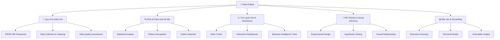

# 📊 Data Analyst (DA) - Phân tích dữ liệu chuyên nghiệp

> **Mục tiêu**: Trở thành chuyên gia phân tích dữ liệu, có khả năng khám phá insights, tạo báo cáo và hỗ trợ ra quyết định dựa trên dữ liệu

## 📚 **1. Bảng ký hiệu (Notation)**

### **Data Analysis:**
- **Dataset**: $\mathcal{D} = \{(\mathbf{x}_i, y_i)\}_{i=1}^n$ (tập dữ liệu)
- **Feature**: $\mathbf{x}_i = [x_{i1}, x_{i2}, \ldots, x_{id}]^T$ (vector đặc trưng)
- **Target**: $y_i$ (biến mục tiêu)
- **Sample**: $(\mathbf{x}_i, y_i)$ (mẫu dữ liệu)

### **Statistics:**
- **Mean**: $\bar{x} = \frac{1}{n}\sum_{i=1}^n x_i$
- **Median**: $\text{median}(X)$ (giá trị trung vị)
- **Standard Deviation**: $s = \sqrt{\frac{1}{n-1}\sum_{i=1}^n (x_i - \bar{x})^2}$
- **Correlation**: $\rho = \frac{\text{Cov}(X,Y)}{\sigma_X \sigma_Y}$

### **Hypothesis Testing:**
- **Null Hypothesis**: $H_0$ (giả thuyết không)
- **Alternative Hypothesis**: $H_1$ (giả thuyết đối)
- **P-value**: $P(\text{data}|H_0)$ (xác suất quan sát được dữ liệu nếu $H_0$ đúng)
- **Significance Level**: $\alpha$ (mức ý nghĩa, thường 0.05)

### **A/B Testing:**
- **Control Group**: $C$ (nhóm đối chứng)
- **Treatment Group**: $T$ (nhóm thử nghiệm)
- **Effect Size**: $\delta = \mu_T - \mu_C$ (hiệu ứng điều trị)
- **Confidence Interval**: $[\text{CI}_{\text{lower}}, \text{CI}_{\text{upper}}]$

## 📖 **2. Glossary (Định nghĩa cốt lõi)**

### **Data Analysis Process:**
- **CRISP-DM**: Cross-Industry Standard Process for Data Mining - quy trình chuẩn phân tích dữ liệu
- **EDA**: Exploratory Data Analysis - phân tích khám phá dữ liệu
- **Data Cleaning**: Làm sạch dữ liệu - loại bỏ lỗi và inconsistencies
- **Data Quality**: Chất lượng dữ liệu - độ chính xác, completeness, consistency

### **Statistical Concepts:**
- **Descriptive Statistics**: Thống kê mô tả - tóm tắt đặc điểm của dữ liệu
- **Inferential Statistics**: Thống kê suy luận - đưa ra kết luận về population từ sample
- **Hypothesis Testing**: Kiểm định giả thuyết - đánh giá tính hợp lý của giả thuyết
- **Confidence Interval**: Khoảng tin cậy - khoảng ước lượng cho parameter

### **Visualization:**
- **Chart**: Biểu đồ - cách biểu diễn dữ liệu trực quan
- **Dashboard**: Bảng điều khiển - tập hợp các biểu đồ và metrics
- **Storytelling**: Kể chuyện bằng dữ liệu - cách trình bày insights
- **BI Tools**: Business Intelligence Tools - công cụ phân tích kinh doanh

### **A/B Testing:**
- **Randomization**: Ngẫu nhiên hóa - phân bổ ngẫu nhiên vào các nhóm
- **Control Group**: Nhóm đối chứng - nhóm không nhận điều trị
- **Treatment Group**: Nhóm thử nghiệm - nhóm nhận điều trị
- **Statistical Power**: Năng lực thống kê - khả năng phát hiện effect thực sự

## 📐 **3. Thẻ thuật toán - CRISP-DM Framework**

### **1. Bài toán & dữ liệu:**
- **Bài toán**: Quy trình chuẩn để thực hiện dự án phân tích dữ liệu
- **Dữ liệu**: Business objectives, raw data, domain knowledge
- **Ứng dụng**: Data mining, business intelligence, analytics projects

### **2. Mô hình & công thức:**
**CRISP-DM Phases:**
$$\text{CRISP-DM} = \{\text{BU}, \text{DU}, \text{DP}, \text{M}, \text{E}, \text{D}\}$$

Trong đó:
- $\text{BU}$: Business Understanding
- $\text{DU}$: Data Understanding  
- $\text{DP}$: Data Preparation
- $\text{M}$: Modeling
- $\text{E}$: Evaluation
- $\text{D}$: Deployment

### **3. Loss & mục tiêu:**
- **Mục tiêu**: Tạo quy trình có cấu trúc để giải quyết business problems
- **Loss**: Không có loss riêng, là process framework

### **4. Tối ưu hoá & cập nhật:**
- **Algorithm**: Iterative process với feedback loops
- **Cập nhật**: Refine process dựa trên results

### **5. Hyperparams:**
- **Project scope**: Phạm vi dự án
- **Timeline**: Thời gian thực hiện
- **Resources**: Nguồn lực cần thiết
- **Success criteria**: Tiêu chí thành công

### **6. Độ phức tạp:**
- **Time**: $O(\text{project\_duration})$ (thời gian dự án)
- **Space**: $O(\text{data\_size})$ (dung lượng dữ liệu)

### **7. Metrics đánh giá:**
- **Project success**: Đạt được business objectives
- **Process efficiency**: Thời gian và resources sử dụng
- **Quality of insights**: Chất lượng insights thu được

### **8. Ưu / Nhược:**
**Ưu điểm:**
- Structured approach
- Industry standard
- Comprehensive coverage
- Iterative improvement

**Nhược điểm:**
- Can be rigid
- Time-consuming
- May not fit all projects
- Requires expertise

### **9. Bẫy & mẹo:**
- **Bẫy**: Skip phases → incomplete analysis
- **Bẫy**: No iteration → missed opportunities
- **Mẹo**: Adapt to project needs
- **Mẹo**: Document decisions và rationale

### **10. Pseudocode:**
```python
def crisp_dm_process(business_objectives, data):
    # Phase 1: Business Understanding
    business_goals = understand_business(business_objectives)
    success_criteria = define_success_criteria(business_goals)
    
    # Phase 2: Data Understanding
    data_overview = explore_data(data)
    data_quality = assess_data_quality(data)
    
    # Phase 3: Data Preparation
    cleaned_data = clean_data(data)
    prepared_data = prepare_features(cleaned_data)
    
    # Phase 4: Modeling
    models = build_models(prepared_data)
    best_model = select_best_model(models)
    
    # Phase 5: Evaluation
    results = evaluate_model(best_model, success_criteria)
    
    # Phase 6: Deployment
    deploy_solution(best_model, results)
    
    return results
```

### **11. Code mẫu:**
```python
class CRISPDMProcess:
    """CRISP-DM Framework Implementation"""
    
    def __init__(self):
        self.phases = ['Business Understanding', 'Data Understanding', 
                      'Data Preparation', 'Modeling', 'Evaluation', 'Deployment']
        self.current_phase = 0
        self.results = {}
    
    def business_understanding(self, business_objectives):
        """Phase 1: Business Understanding"""
        print("=== Phase 1: Business Understanding ===")
        
        # Define business objectives
        objectives = {
            'primary_goal': business_objectives.get('goal'),
            'success_metrics': business_objectives.get('metrics'),
            'constraints': business_objectives.get('constraints'),
            'timeline': business_objectives.get('timeline')
        }
        
        # Stakeholder analysis
        stakeholders = self.identify_stakeholders(business_objectives)
        
        # ROI calculation
        roi = self.calculate_roi(business_objectives)
        
        self.results['business_understanding'] = {
            'objectives': objectives,
            'stakeholders': stakeholders,
            'roi': roi
        }
        
        return objectives
    
    def data_understanding(self, data_sources):
        """Phase 2: Data Understanding"""
        print("=== Phase 2: Data Understanding ===")
        
        # Data collection
        raw_data = self.collect_data(data_sources)
        
        # Data description
        data_description = self.describe_data(raw_data)
        
        # Data exploration
        exploration_results = self.explore_data(raw_data)
        
        # Data quality assessment
        quality_report = self.assess_data_quality(raw_data)
        
        self.results['data_understanding'] = {
            'data_description': data_description,
            'exploration': exploration_results,
            'quality_report': quality_report
        }
        
        return raw_data
    
    def data_preparation(self, raw_data):
        """Phase 3: Data Preparation"""
        print("=== Phase 3: Data Preparation ===")
        
        # Data selection
        selected_data = self.select_data(raw_data)
        
        # Data cleaning
        cleaned_data = self.clean_data(selected_data)
        
        # Feature engineering
        engineered_data = self.engineer_features(cleaned_data)
        
        # Data integration
        integrated_data = self.integrate_data(engineered_data)
        
        # Data formatting
        formatted_data = self.format_data(integrated_data)
        
        self.results['data_preparation'] = {
            'cleaned_data': cleaned_data,
            'engineered_features': engineered_data,
            'final_dataset': formatted_data
        }
        
        return formatted_data
    
    def modeling(self, prepared_data):
        """Phase 4: Modeling"""
        print("=== Phase 4: Modeling ===")
        
        # Technique selection
        techniques = self.select_modeling_techniques(prepared_data)
        
        # Test design
        test_plan = self.design_tests(prepared_data)
        
        # Model building
        models = self.build_models(prepared_data, techniques)
        
        # Model assessment
        model_assessment = self.assess_models(models, test_plan)
        
        self.results['modeling'] = {
            'techniques_used': techniques,
            'models_built': models,
            'assessment': model_assessment
        }
        
        return models
    
    def evaluation(self, models, business_criteria):
        """Phase 5: Evaluation"""
        print("=== Phase 5: Evaluation ===")
        
        # Evaluate results
        evaluation_results = self.evaluate_results(models, business_criteria)
        
        # Review process
        process_review = self.review_process()
        
        # Determine next steps
        next_steps = self.determine_next_steps(evaluation_results)
        
        self.results['evaluation'] = {
            'results': evaluation_results,
            'process_review': process_review,
            'next_steps': next_steps
        }
        
        return evaluation_results
    
    def deployment(self, best_model, evaluation_results):
        """Phase 6: Deployment"""
        print("=== Phase 6: Deployment ===")
        
        # Deployment planning
        deployment_plan = self.plan_deployment(best_model)
        
        # Monitoring setup
        monitoring_setup = self.setup_monitoring(best_model)
        
        # Final report
        final_report = self.create_final_report(evaluation_results)
        
        self.results['deployment'] = {
            'plan': deployment_plan,
            'monitoring': monitoring_setup,
            'report': final_report
        }
        
        return final_report
```

### **12. Checklist kiểm tra nhanh:**
- [ ] Business objectives có rõ ràng?
- [ ] Data quality có acceptable?
- [ ] Modeling approach có phù hợp?
- [ ] Results có meet success criteria?
- [ ] Deployment plan có feasible?

---

# 📋 Tổng quan nội dung




**📁 [Xem file PNG trực tiếp](assets/data-analyst-overview.png)**

**📁 [Xem file PNG trực tiếp](assets/data-analyst-overview.png)**

## 🔄 1. Quy trình phân tích dữ liệu

### 1.1 CRISP-DM Framework

> **CRISP-DM** (Cross-Industry Standard Process for Data Mining) là quy trình chuẩn, được công nhận rộng rãi trong ngành để thực hiện các dự án khoa học dữ liệu. Hãy coi nó như một bản đồ chi tiết hướng dẫn bạn đi từ một câu hỏi kinh doanh mơ hồ đến một giải pháp dựa trên dữ liệu có thể triển khai.

**Tư duy cốt lõi**: CRISP-DM không phải là một con đường thẳng. Đây là một **quy trình lặp (iterative)**, nơi bạn thường xuyên quay lại các bước trước đó để tinh chỉnh và cải thiện.

**Ví dụ tương tự**: Hãy tưởng tượng bạn là một thám tử điều tra một vụ án phức tạp.
1.  **Hiểu vụ án (Business Understanding)**: Nạn nhân là ai? Động cơ có thể là gì?
2.  **Thu thập bằng chứng (Data Understanding)**: Khám nghiệm hiện trường, lấy lời khai nhân chứng, thu thập vật chứng.
3.  **Xử lý bằng chứng (Data Preparation)**: Làm sạch dấu vân tay, phân tích DNA, sắp xếp lời khai.
4.  **Xây dựng giả thuyết (Modeling)**: Đưa ra các giả thuyết về nghi phạm dựa trên bằng chứng.
5.  **Kiểm tra giả thuyết (Evaluation)**: Đối chiếu bằng chứng với giả thuyết, loại bỏ các giả thuyết yếu.
6.  **Kết luận và Bắt giữ (Deployment)**: Đưa ra kết luận cuối cùng và thực hiện hành động.
Trong quá trình này, bạn có thể phải quay lại hiện trường (Data Understanding) nếu có tình tiết mới.

```mermaid
flowchart TD
    A[💼 1. Business Understanding] <--> B[📊 2. Data Understanding]
    B --> C[🧹 3. Data Preparation]
    C <--> B
    C --> D[🤖 4. Modeling]
    D <--> C
    D --> E[✅ 5. Evaluation]
    E --> A
    E --> D
    E --> F[🚀 6. Deployment]
    
    A --> A1[Xác định mục tiêu kinh doanh]
    A --> A2[Đánh giá tình hình hiện tại]
    A --> A3[Xác định yếu tố thành công]
    
    B --> B1[Thu thập dữ liệu ban đầu]
    B --> B2[Mô tả dữ liệu]
    B --> B3[Khám phá dữ liệu (EDA)]
    B --> B4[Kiểm tra chất lượng dữ liệu]
    
    C --> C1[Lựa chọn dữ liệu]
    C --> C2[Làm sạch dữ liệu]
    C --> C3[Tạo features mới]
    C --> C4[Tích hợp dữ liệu]
    C --> C5[Định dạng dữ liệu]
    
    D --> D1[Lựa chọn kỹ thuật modeling]
    D --> D2[Thiết kế bộ test]
    D --> D3[Xây dựng mô hình]
    D --> D4[Đánh giá mô hình (kỹ thuật)]
    
    E --> E1[Đánh giá kết quả theo tiêu chí kinh doanh]
    E --> E2[Xem xét lại quy trình]
    E --> E3[Xác định bước tiếp theo]
    
    F --> F1[Lên kế hoạch triển khai]
    F --> F2[Giám sát và bảo trì]
    F --> F3[Báo cáo và tổng kết dự án]
```


**📁 [Xem file PNG trực tiếp](assets/crisp-dm-framework.png)**

**📁 [Xem file PNG trực tiếp](assets/crisp-dm-framework.png)**

#### Giải thích chi tiết các pha (với ví dụ "Dự đoán khách hàng rời bỏ mạng viễn thông")

##### 1. 💼 Business Understanding (Hiểu bài toán kinh doanh)
Đây là pha quan trọng nhất. Nếu hiểu sai bài toán, toàn bộ dự án sẽ đi sai hướng.

-   **Mục tiêu**: Chuyển một vấn đề kinh doanh thành một bài toán khoa học dữ liệu có thể giải quyết.
-   **Câu hỏi cần trả lời**:
    -   Bài toán kinh doanh thực sự là gì? (Ví dụ: "Tỷ lệ khách hàng rời bỏ (churn rate) đang tăng, ảnh hưởng đến doanh thu.")
    -   Mục tiêu của dự án là gì? (Ví dụ: "Giảm churn rate xuống 5% trong quý tới.")
    -   Làm thế nào để đo lường thành công? (Ví dụ: "Xây dựng mô hình dự đoán khách hàng sắp churn với độ chính xác > 80% để đội Chăm sóc khách hàng có thể can thiệp kịp thời.")
    -   Các ràng buộc là gì? (Ví dụ: Dữ liệu cá nhân nhạy cảm, thời gian triển khai dưới 3 tháng.)

##### 2. 📊 Data Understanding (Hiểu dữ liệu)
Pha này giống như lần đầu "làm quen" với dữ liệu của bạn.

-   **Mục tiêu**: Thu thập và khám phá dữ liệu ban đầu để hình thành các giả thuyết.
-   **Hành động**:
    -   **Thu thập dữ liệu**: Lấy dữ liệu từ các nguồn (database, file log, API).
    -   **Mô tả dữ liệu**: Bao nhiêu hàng, bao nhiêu cột? Kiểu dữ liệu của mỗi cột là gì?
    -   **Phân tích khám phá (EDA)**: Vẽ biểu đồ để xem phân phối của các biến, mối quan hệ giữa chúng.
    -   **Kiểm tra chất lượng**: Dữ liệu có bị thiếu (missing values) không? Có giá trị ngoại lai (outliers) không?
-   **Ví dụ (Dự đoán churn)**:
    -   Thu thập dữ liệu về lịch sử sử dụng (số phút gọi, data đã dùng), thông tin hợp đồng (loại gói cước, thời hạn), lịch sử thanh toán, các cuộc gọi hỗ trợ.
    -   Phát hiện cột `total_charges` có nhiều giá trị bị thiếu.
    -   Vẽ biểu đồ thấy rằng những khách hàng dùng gói cước theo tháng (month-to-month) có tỷ lệ churn cao hơn hẳn. Đây là một giả thuyết ban đầu!

##### 3. 🧹 Data Preparation (Chuẩn bị dữ liệu)
Đây là pha tốn nhiều thời gian nhất (thường chiếm 60-80% thời gian dự án).

-   **Mục tiêu**: Chuyển đổi dữ liệu thô thành một bộ dữ liệu sạch, sẵn sàng cho việc xây dựng mô hình.
-   **Hành động**:
    -   **Làm sạch**: Xử lý giá trị thiếu (ví dụ: điền giá trị trung bình), sửa lỗi dữ liệu.
    -   **Tạo Feature mới (Feature Engineering)**: Từ các cột có sẵn, tạo ra các cột mới có ý nghĩa hơn. Ví dụ: từ `total_charges` và `tenure` (thời gian sử dụng), tạo ra `average_monthly_charges`.
    -   **Chuyển đổi dữ liệu**: Mã hóa các biến phân loại (ví dụ: `gender` -> 0/1), chuẩn hóa các biến số.
-   **Ví dụ (Dự đoán churn)**:
    -   Điền giá trị `total_charges` bị thiếu bằng giá trị trung bình của những khách hàng có `tenure` tương tự.
    -   Tạo feature `has_called_support` (đã từng gọi hỗ trợ hay chưa).
    -   Mã hóa cột `contract_type` (Month-to-month, One year, Two year) thành các số.

##### 4. 🤖 Modeling (Xây dựng mô hình)
Đây là pha mà các thuật toán machine learning được áp dụng.

-   **Mục tiêu**: Lựa chọn và xây dựng các mô hình có khả năng dự đoán tốt nhất.
-   **Hành động**:
    -   **Chọn thuật toán**: Dựa vào bài toán (phân loại, hồi quy), chọn các thuật toán phù hợp (Logistic Regression, Random Forest, Gradient Boosting...).
    -   **Xây dựng mô hình**: Huấn luyện (train) các mô hình trên bộ dữ liệu đã chuẩn bị.
    -   **Tinh chỉnh tham số (Hyperparameter Tuning)**: Tối ưu hóa các tham số của mô hình để đạt hiệu suất cao nhất.
-   **Vòng lặp**: Nếu mô hình hoạt động không tốt, có thể bạn cần quay lại pha **Data Preparation** để tạo thêm feature mới hoặc xử lý dữ liệu khác đi.

##### 5. ✅ Evaluation (Đánh giá)
Pha này đánh giá xem mô hình hoạt động tốt đến đâu *theo góc độ kinh doanh*.

-   **Mục tiêu**: Đảm bảo mô hình đáp ứng được mục tiêu kinh doanh đã đề ra.
-   **Hành động**:
    -   **Đánh giá kỹ thuật**: Dùng các metric như Accuracy, Precision, Recall, F1-score...
    -   **Đánh giá kinh doanh**: Mô hình có giúp giảm churn rate không? Chi phí để giữ chân một khách hàng có nhỏ hơn lợi nhuận họ mang lại không? Mô hình có dễ giải thích cho ban lãnh đạo không?
-   **Vòng lặp**: Nếu kết quả đánh giá không đạt yêu cầu, bạn phải quay lại pha **Business Understanding** để xem lại mục tiêu, hoặc quay lại pha **Modeling** để thử thuật toán khác.

##### 6. 🚀 Deployment (Triển khai)
Đây là lúc đưa mô hình vào hoạt động thực tế.

-   **Mục tiêu**: Tích hợp mô hình vào hệ thống hiện tại để tạo ra giá trị.
-   **Hành động**:
    -   **Lên kế hoạch**: Triển khai dưới dạng API, batch job, hay ứng dụng web?
    -   **Giám sát (Monitoring)**: Theo dõi hiệu suất của mô hình theo thời gian. Dữ liệu thực tế có thay đổi không (data drift)? Hiệu suất mô hình có giảm không (model degradation)?
    -   **Bảo trì**: Huấn luyện lại (re-train) mô hình định kỳ với dữ liệu mới.
    -   **Báo cáo**: Tổng kết dự án và báo cáo kết quả cho các bên liên quan.

#### Các cạm bẫy thường gặp (Common Pitfalls)
-   **Business Understanding**: Không xác định rõ KPI. "Cải thiện trải nghiệm khách hàng" là một mục tiêu mơ hồ. "Giảm thời gian phản hồi chat bot xuống dưới 30 giây" là một KPI rõ ràng.
-   **Data Understanding**: Vội vàng xây dựng mô hình mà không khám phá kỹ dữ liệu, dẫn đến việc bỏ qua các insight quan trọng hoặc các vấn đề về chất lượng dữ liệu.
-   **Data Preparation**: Áp dụng các kỹ thuật xử lý một cách máy móc mà không hiểu tại sao. Ví dụ, luôn điền giá trị thiếu bằng trung bình mà không xem xét tại sao nó lại thiếu.
-   **Modeling**: "Overfitting" - xây dựng một mô hình quá phức tạp, hoạt động hoàn hảo trên dữ liệu training nhưng thất bại trên dữ liệu thực tế.
-   **Evaluation**: Chỉ tập trung vào các chỉ số kỹ thuật (như accuracy) mà quên mất mục tiêu kinh doanh. Một mô hình có accuracy 99% có thể vô dụng nếu nó không giúp công ty kiếm tiền.
-   **Deployment**: Coi việc triển khai là bước cuối cùng. Thực tế, đây là khởi đầu của một vòng đời mới, đòi hỏi giám sát và bảo trì liên tục.

#### Business Understanding - Hiểu vấn đề kinh doanh

**Lý thuyết cơ bản:**
- **CRISP-DM Phase 1**: Chuyển đổi business objectives thành data mining goals
- **Stakeholder Analysis**: Xác định tất cả parties có liên quan
- **ROI Calculation**: Return on Investment cho data mining project

**Framework chi tiết:**

**1. Business Objectives Mapping:**
```python
from dataclasses import dataclass
from typing import List, Dict, Any
from enum import Enum

class BusinessObjectiveType(Enum):
    REVENUE_INCREASE = "revenue_increase"
    COST_REDUCTION = "cost_reduction"
    CUSTOMER_SATISFACTION = "customer_satisfaction"
    OPERATIONAL_EFFICIENCY = "operational_efficiency"
    RISK_MITIGATION = "risk_mitigation"

@dataclass
class BusinessObjective:
    """Structured business objective"""
    id: str
    type: BusinessObjectiveType
    description: str
    target_value: float
    current_value: float
    unit: str
    timeline_months: int
    stakeholders: List[str]
    success_criteria: List[str]
    
    @property
    def improvement_needed(self) -> float:
        """Calculate improvement needed to reach target"""
        return self.target_value - self.current_value
    
    @property
    def improvement_percentage(self) -> float:
        """Calculate percentage improvement needed"""
        if self.current_value == 0:
            return float('inf')
        return (self.improvement_needed / self.current_value) * 100

# Example usage
revenue_obj = BusinessObjective(
    id="REV_001",
    type=BusinessObjectiveType.REVENUE_INCREASE,
    description="Increase quarterly revenue by 20%",
    target_value=1200000,  # $1.2M
    current_value=1000000,  # $1M
    unit="USD",
    timeline_months=3,
    stakeholders=["Sales Team", "Marketing", "Product"],
    success_criteria=["Q4 revenue >= $1.2M", "Monthly growth rate > 5%"]
)

print(f"Improvement needed: ${revenue_obj.improvement_needed:,.0f}")
print(f"Percentage improvement: {revenue_obj.improvement_percentage:.1f}%")
```

**2. Stakeholder Analysis Matrix:**
```python
import pandas as pd
import numpy as np

class StakeholderAnalysis:
    """Analyze stakeholder influence and interest"""
    
    def __init__(self):
        self.stakeholders = []
    
    def add_stakeholder(self, name: str, influence: int, interest: int, 
                       role: str, requirements: List[str]):
        """Add stakeholder with influence (1-5) and interest (1-5)"""
        self.stakeholders.append({
            'name': name,
            'influence': influence,  # 1=Low, 5=High
            'interest': interest,    # 1=Low, 5=High
            'role': role,
            'requirements': requirements
        })
    
    def get_stakeholder_matrix(self) -> pd.DataFrame:
        """Create stakeholder influence-interest matrix"""
        df = pd.DataFrame(self.stakeholders)
        
        # Categorize stakeholders
        def categorize_stakeholder(row):
            if row['influence'] >= 4 and row['interest'] >= 4:
                return "Key Player"
            elif row['influence'] >= 4 and row['interest'] < 4:
                return "Keep Satisfied"
            elif row['influence'] < 4 and row['interest'] >= 4:
                return "Keep Informed"
            else:
                return "Monitor"
        
        df['category'] = df.apply(categorize_stakeholder, axis=1)
        return df
    
    def get_communication_plan(self) -> Dict[str, List[str]]:
        """Generate communication plan based on stakeholder categories"""
        df = self.get_stakeholder_matrix()
        
        plan = {
            "Key Players": df[df['category'] == "Key Player"]['name'].tolist(),
            "Keep Satisfied": df[df['category'] == "Keep Satisfied"]['name'].tolist(),
            "Keep Informed": df[df['category'] == "Keep Informed"]['name'].tolist(),
            "Monitor": df[df['category'] == "Monitor"]['name'].tolist()
        }
        
        return plan

# Example usage
stakeholder_analysis = StakeholderAnalysis()
stakeholder_analysis.add_stakeholder("CEO", 5, 4, "Executive", ["Revenue growth", "ROI"])
stakeholder_analysis.add_stakeholder("Sales Manager", 4, 5, "Manager", ["Lead quality", "Conversion rates"])
stakeholder_analysis.add_stakeholder("Data Engineer", 3, 5, "Technical", ["Data quality", "Infrastructure"])

matrix = stakeholder_analysis.get_stakeholder_matrix()
communication_plan = stakeholder_analysis.get_communication_plan()
```

**3. ROI và Business Case Development:**
```python
from dataclasses import dataclass
from typing import List, Dict
import numpy as np

@dataclass
class BusinessCase:
    """Business case cho data mining project"""
    project_name: str
    duration_months: int
    team_size: int
    costs: Dict[str, float]
    benefits: Dict[str, float]
    risk_factors: List[str]
    
    def calculate_total_cost(self) -> float:
        """Calculate total project cost"""
        return sum(self.costs.values())
    
    def calculate_total_benefits(self) -> float:
        """Calculate total project benefits"""
        return sum(self.benefits.values())
    
    def calculate_roi(self) -> float:
        """Calculate Return on Investment"""
        total_cost = self.calculate_total_cost()
        if total_cost == 0:
            return float('inf')
        return ((self.calculate_total_benefits() - total_cost) / total_cost) * 100
    
    def calculate_payback_period(self) -> float:
        """Calculate payback period in months"""
        monthly_benefit = self.calculate_total_benefits() / self.duration_months
        if monthly_benefit <= 0:
            return float('inf')
        return self.calculate_total_cost() / monthly_benefit
    
    def get_risk_assessment(self) -> Dict[str, str]:
        """Assess project risks"""
        risk_levels = {
            "Low": "Project likely to succeed with minimal issues",
            "Medium": "Some challenges expected, manageable with proper planning",
            "High": "Significant risks, requires careful mitigation strategies"
        }
        
        # Simple risk scoring based on factors
        risk_score = len(self.risk_factors) * 0.2 + (self.duration_months / 12) * 0.3
        
        if risk_score < 0.5:
            risk_level = "Low"
        elif risk_score < 1.0:
            risk_level = "Medium"
        else:
            risk_level = "High"
        
        return {
            "risk_level": risk_level,
            "description": risk_levels[risk_level],
            "risk_score": risk_score
        }

# Example business case
business_case = BusinessCase(
    project_name="Customer Churn Prediction",
    duration_months=6,
    team_size=5,
    costs={
        "team_salary": 150000,      # 6 months * 5 people * $50K/year
        "infrastructure": 25000,    # Cloud costs, tools
        "external_consulting": 30000,  # Expert consultation
        "training": 15000           # Team training
    },
    benefits={
        "revenue_retention": 200000,  # Prevented churn
        "cost_reduction": 50000,      # Reduced acquisition costs
        "efficiency_gains": 75000     # Better targeting
    },
    risk_factors=[
        "Data quality issues",
        "Model performance below expectations",
        "Integration challenges with existing systems"
    ]
)

print(f"Total Cost: ${business_case.calculate_total_cost():,.0f}")
print(f"Total Benefits: ${business_case.calculate_total_benefits():,.0f}")
print(f"ROI: {business_case.calculate_roi():.1f}%")
print(f"Payback Period: {business_case.calculate_payback_period():.1f} months")
print(f"Risk Level: {business_case.get_risk_assessment()['risk_level']}")
```

**4. Success Metrics và KPIs:**
```python
class KPIFramework:
    """Framework cho defining và tracking KPIs"""
    
    def __init__(self):
        self.kpis = {}
    
    def add_kpi(self, name: str, current_value: float, target_value: float, 
                unit: str, frequency: str, owner: str):
        """Add KPI với baseline và target"""
        self.kpis[name] = {
            'current': current_value,
            'target': target_value,
            'unit': unit,
            'frequency': frequency,
            'owner': owner,
            'history': [current_value]
        }
    
    def update_kpi(self, name: str, new_value: float):
        """Update KPI value và track history"""
        if name in self.kpis:
            self.kpis[name]['current'] = new_value
            self.kpis[name]['history'].append(new_value)
    
    def get_kpi_status(self, name: str) -> Dict[str, Any]:
        """Get KPI status và progress"""
        if name not in self.kpis:
            return {}
        
        kpi = self.kpis[name]
        progress = ((kpi['current'] - kpi['history'][0]) / 
                   (kpi['target'] - kpi['history'][0])) * 100
        
        return {
            'name': name,
            'current': kpi['current'],
            'target': kpi['target'],
            'progress_percentage': progress,
            'status': 'On Track' if progress >= 0 else 'Behind',
            'unit': kpi['unit'],
            'owner': kpi['owner']
        }
    
    def get_all_kpis_status(self) -> List[Dict[str, Any]]:
        """Get status của tất cả KPIs"""
        return [self.get_kpi_status(name) for name in self.kpis.keys()]

# Example KPI framework
kpi_framework = KPIFramework()
kpi_framework.add_kpi("Conversion Rate", 2.5, 3.5, "%", "Weekly", "Marketing")
kpi_framework.add_kpi("Customer Acquisition Cost", 150, 120, "USD", "Monthly", "Sales")
kpi_framework.add_kpi("Customer Lifetime Value", 800, 1000, "USD", "Quarterly", "Product")

# Update KPIs
kpi_framework.update_kpi("Conversion Rate", 2.8)
kpi_framework.update_kpi("Customer Acquisition Cost", 140)

# Get status
all_status = kpi_framework.get_all_kpis_status()
for status in all_status:
    print(f"{status['name']}: {status['status']} ({status['progress_percentage']:.1f}%)")
```

**Tài liệu tham khảo chuyên sâu:**
- **CRISP-DM Official Guide**: [IBM CRISP-DM](https://www.ibm.com/docs/en/spss-modeler/SaaS?topic=dm-crisp-help-overview)
- **Business Analysis Body of Knowledge (BABOK)**: [IIBA BABOK](https://www.iiba.org/business-analysis-body-of-knowledge/)
- **Stakeholder Management**: [PMI Guide](https://www.pmi.org/pmbok-guide-standards)
- **ROI Analysis**: [Harvard Business Review - ROI](https://hbr.org/topic/roi)

#### Data Understanding - Hiểu dữ liệu

**Lý thuyết cơ bản:**
- **CRISP-DM Phase 2**: Systematic data collection và exploration
- **Data Lineage**: Tracking data origin và transformations
- **Data Schema Evolution**: Understanding structural changes over time
- **Data Volume, Velocity, Variety**: 3V framework cho big data

**Framework chi tiết:**

**1. Data Collection Strategy:**
```python
from dataclasses import dataclass
from typing import List, Dict, Any, Optional
from enum import Enum
import pandas as pd
import numpy as np
from datetime import datetime, timedelta

class DataSourceType(Enum):
    DATABASE = "database"
    API = "api"
    FILE = "file"
    STREAMING = "streaming"
    EXTERNAL = "external"

@dataclass
class DataSource:
    """Structured data source information"""
    name: str
    type: DataSourceType
    location: str
    format: str
    update_frequency: str
    last_updated: datetime
    reliability_score: float  # 0-1
    data_volume_gb: float
    schema_version: str
    
    def is_fresh(self, max_age_hours: int = 24) -> bool:
        """Check if data source is fresh"""
        return datetime.now() - self.last_updated < timedelta(hours=max_age_hours)
    
    def get_health_status(self) -> str:
        """Get data source health status"""
        if self.reliability_score >= 0.9:
            return "Excellent"
        elif self.reliability_score >= 0.7:
            return "Good"
        elif self.reliability_score >= 0.5:
            return "Fair"
        else:
            return "Poor"

class DataCollectionFramework:
    """Framework cho systematic data collection"""
    
    def __init__(self):
        self.sources: List[DataSource] = []
        self.collection_log: List[Dict[str, Any]] = []
    
    def add_source(self, source: DataSource) -> None:
        """Add data source to collection framework"""
        self.sources.append(source)
    
    def collect_data(self, source_name: str) -> Optional[pd.DataFrame]:
        """Collect data from specified source"""
        source = next((s for s in self.sources if s.name == source_name), None)
        if not source:
            raise ValueError(f"Source {source_name} not found")
        
        try:
            # Simulate data collection
            start_time = datetime.now()
            
            # Log collection attempt
            self.collection_log.append({
                'source': source_name,
                'timestamp': start_time,
                'status': 'started'
            })
            
            # Simulate data loading (replace with actual implementation)
            if source.type == DataSourceType.DATABASE:
                # Simulate database query
                data = pd.DataFrame({
                    'id': range(1000),
                    'value': np.random.randn(1000),
                    'timestamp': pd.date_range(start='2024-01-01', periods=1000, freq='H')
                })
            elif source.type == DataSourceType.API:
                # Simulate API call
                data = pd.DataFrame({
                    'id': range(500),
                    'metric': np.random.exponential(2, 500),
                    'category': np.random.choice(['A', 'B', 'C'], 500)
                })
            else:
                data = pd.DataFrame()
            
            # Log successful collection
            self.collection_log.append({
                'source': source_name,
                'timestamp': datetime.now(),
                'status': 'completed',
                'rows_collected': len(data)
            })
            
            return data
            
        except Exception as e:
            # Log error
            self.collection_log.append({
                'source': source_name,
                'timestamp': datetime.now(),
                'status': 'failed',
                'error': str(e)
            })
            return None
    
    def get_collection_summary(self) -> pd.DataFrame:
        """Get summary of all collection attempts"""
        return pd.DataFrame(self.collection_log)
    
    def get_source_health_report(self) -> pd.DataFrame:
        """Get health report for all data sources"""
        health_data = []
        for source in self.sources:
            health_data.append({
                'source_name': source.name,
                'type': source.type.value,
                'reliability_score': source.reliability_score,
                'health_status': source.get_health_status(),
                'is_fresh': source.is_fresh(),
                'last_updated': source.last_updated,
                'data_volume_gb': source.data_volume_gb
            })
        return pd.DataFrame(health_data)

# Example usage
collection_framework = DataCollectionFramework()

# Add data sources
db_source = DataSource(
    name="customer_database",
    type=DataSourceType.DATABASE,
    location="postgresql://localhost:5432/customers",
    format="relational",
    update_frequency="hourly",
    last_updated=datetime.now() - timedelta(hours=2),
    reliability_score=0.95,
    data_volume_gb=50.5,
    schema_version="2.1"
)

api_source = DataSource(
    name="analytics_api",
    type=DataSourceType.API,
    location="https://api.analytics.com/v1/metrics",
    format="json",
    update_frequency="real-time",
    last_updated=datetime.now() - timedelta(minutes=30),
    reliability_score=0.88,
    data_volume_gb=2.1,
    schema_version="1.0"
)

collection_framework.add_source(db_source)
collection_framework.add_source(api_source)

# Collect data
customer_data = collection_framework.collect_data("customer_database")
analytics_data = collection_framework.collect_data("analytics_api")

# Get reports
health_report = collection_framework.get_source_health_report()
collection_summary = collection_framework.get_collection_summary()
```

**2. Data Schema Analysis:**
```python
class SchemaAnalyzer:
    """Analyze data schema và detect changes"""
    
    def __init__(self):
        self.schema_history: List[Dict[str, Any]] = []
    
    def analyze_schema(self, df: pd.DataFrame, source_name: str) -> Dict[str, Any]:
        """Analyze current schema của dataframe"""
        schema_info = {
            'source_name': source_name,
            'timestamp': datetime.now(),
            'total_rows': len(df),
            'total_columns': len(df.columns),
            'columns': {}
        }
        
        for col in df.columns:
            col_info = {
                'dtype': str(df[col].dtype),
                'null_count': df[col].isnull().sum(),
                'null_percentage': (df[col].isnull().sum() / len(df)) * 100,
                'unique_count': df[col].nunique(),
                'unique_percentage': (df[col].nunique() / len(df)) * 100
            }
            
            # Add statistical info for numeric columns
            if np.issubdtype(df[col].dtype, np.number):
                col_info.update({
                    'min': df[col].min(),
                    'max': df[col].max(),
                    'mean': df[col].mean(),
                    'std': df[col].std(),
                    'median': df[col].median()
                })
            
            # Add sample values for categorical columns
            if col_info['unique_count'] < 20:
                col_info['sample_values'] = df[col].value_counts().head(5).to_dict()
            
            schema_info['columns'][col] = col_info
        
        # Store in history
        self.schema_history.append(schema_info)
        return schema_info
    
    def detect_schema_changes(self, current_schema: Dict[str, Any], 
                            previous_schema: Dict[str, Any]) -> Dict[str, Any]:
        """Detect changes between two schemas"""
        changes = {
            'new_columns': [],
            'removed_columns': [],
            'type_changes': [],
            'cardinality_changes': []
        }
        
        current_cols = set(current_schema['columns'].keys())
        previous_cols = set(previous_schema['columns'].keys())
        
        # Detect new and removed columns
        changes['new_columns'] = list(current_cols - previous_cols)
        changes['removed_columns'] = list(previous_cols - current_cols)
        
        # Detect type and cardinality changes
        common_cols = current_cols & previous_cols
        for col in common_cols:
            current_info = current_schema['columns'][col]
            previous_info = previous_schema['columns'][col]
            
            # Type changes
            if current_info['dtype'] != previous_info['dtype']:
                changes['type_changes'].append({
                    'column': col,
                    'old_type': previous_info['dtype'],
                    'new_type': current_info['dtype']
                })
            
            # Cardinality changes (significant changes in unique values)
            current_unique = current_info['unique_percentage']
            previous_unique = previous_info['unique_percentage']
            if abs(current_unique - previous_unique) > 10:  # 10% threshold
                changes['cardinality_changes'].append({
                    'column': col,
                    'old_unique_percentage': previous_unique,
                    'new_unique_percentage': current_unique,
                    'change': current_unique - previous_unique
                })
        
        return changes
    
    def get_schema_evolution_report(self) -> pd.DataFrame:
        """Get report of schema evolution over time"""
        if len(self.schema_history) < 2:
            return pd.DataFrame()
        
        evolution_data = []
        for i in range(1, len(self.schema_history)):
            current = self.schema_history[i]
            previous = self.schema_history[i-1]
            
            changes = self.detect_schema_changes(current, previous)
            
            evolution_data.append({
                'timestamp': current['timestamp'],
                'source_name': current['source_name'],
                'new_columns': len(changes['new_columns']),
                'removed_columns': len(changes['removed_columns']),
                'type_changes': len(changes['type_changes']),
                'cardinality_changes': len(changes['cardinality_changes']),
                'total_changes': sum(len(v) for v in changes.values())
            })
        
        return pd.DataFrame(evolution_data)

# Example usage
schema_analyzer = SchemaAnalyzer()

# Analyze schemas
if customer_data is not None:
    current_schema = schema_analyzer.analyze_schema(customer_data, "customer_database")
    print(f"Schema analyzed: {current_schema['total_columns']} columns, {current_schema['total_rows']} rows")

# Get evolution report
evolution_report = schema_analyzer.get_schema_evolution_report()
```

**3. Data Quality Assessment Framework:**
```python
class DataQualityFramework:
    """Comprehensive data quality assessment"""
    
    def __init__(self):
        self.quality_metrics = {}
        self.quality_history = []
    
    def assess_data_quality(self, df: pd.DataFrame, source_name: str) -> Dict[str, Any]:
        """Assess overall data quality"""
        quality_score = 0
        total_checks = 0
        
        # Completeness check
        completeness_score = self._check_completeness(df)
        quality_score += completeness_score
        total_checks += 1
        
        # Accuracy check
        accuracy_score = self._check_accuracy(df)
        quality_score += accuracy_score
        total_checks += 1
        
        # Consistency check
        consistency_score = self._check_consistency(df)
        quality_score += consistency_score
        total_checks += 1
        
        # Validity check
        validity_score = self._check_validity(df)
        quality_score += validity_score
        total_checks += 1
        
        # Timeliness check
        timeliness_score = self._check_timeliness(df)
        quality_score += timeliness_score
        total_checks += 1
        
        # Overall quality score
        overall_score = quality_score / total_checks
        
        quality_assessment = {
            'source_name': source_name,
            'timestamp': datetime.now(),
            'overall_score': overall_score,
            'completeness_score': completeness_score,
            'accuracy_score': accuracy_score,
            'consistency_score': consistency_score,
            'validity_score': validity_score,
            'timeliness_score': timeliness_score,
            'total_rows': len(df),
            'total_columns': len(df.columns)
        }
        
        # Store in history
        self.quality_history.append(quality_assessment)
        self.quality_metrics[source_name] = quality_assessment
        
        return quality_assessment
    
    def _check_completeness(self, df: pd.DataFrame) -> float:
        """Check data completeness (non-null values)"""
        total_cells = df.size
        null_cells = df.isnull().sum().sum()
        completeness = (total_cells - null_cells) / total_cells
        return completeness
    
    def _check_accuracy(self, df: pd.DataFrame) -> float:
        """Check data accuracy (basic sanity checks)"""
        accuracy_checks = 0
        total_checks = 0
        
        for col in df.columns:
            if np.issubdtype(df[col].dtype, np.number):
                # Check for extreme outliers (beyond 3 standard deviations)
                mean_val = df[col].mean()
                std_val = df[col].std()
                if std_val > 0:
                    outliers = df[col][(df[col] < mean_val - 3*std_val) | 
                                     (df[col] > mean_val + 3*std_val)]
                    outlier_ratio = len(outliers) / len(df[col])
                    if outlier_ratio < 0.01:  # Less than 1% outliers
                        accuracy_checks += 1
                    total_checks += 1
        
        return accuracy_checks / max(total_checks, 1)
    
    def _check_consistency(self, df: pd.DataFrame) -> float:
        """Check data consistency (format, patterns)"""
        consistency_checks = 0
        total_checks = 0
        
        for col in df.columns:
            # Check for consistent data types
            if df[col].dtype == 'object':
                # Check if all values follow similar patterns
                sample_values = df[col].dropna().head(100)
                if len(sample_values) > 0:
                    # Simple pattern consistency check
                    pattern_lengths = [len(str(v)) for v in sample_values]
                    if len(set(pattern_lengths)) <= 3:  # Similar lengths
                        consistency_checks += 1
                    total_checks += 1
        
        return consistency_checks / max(total_checks, 1)
    
    def _check_validity(self, df: pd.DataFrame) -> float:
        """Check data validity (within expected ranges)"""
        validity_checks = 0
        total_checks = 0
        
        for col in df.columns:
            if np.issubdtype(df[col].dtype, np.number):
                # Check if values are within reasonable bounds
                if df[col].min() >= 0 and df[col].max() < 1e12:  # Reasonable bounds
                    validity_checks += 1
                total_checks += 1
        
        return validity_checks / max(total_checks, 1)
    
    def _check_timeliness(self, df: pd.DataFrame) -> float:
        """Check data timeliness (if timestamp columns exist)"""
        timestamp_cols = [col for col in df.columns if 'time' in col.lower() or 'date' in col.lower()]
        
        if not timestamp_cols:
            return 0.5  # Neutral score if no timestamp columns
        
        timeliness_checks = 0
        total_checks = 0
        
        for col in timestamp_cols:
            try:
                # Convert to datetime if possible
                pd.to_datetime(df[col], errors='coerce')
                timeliness_checks += 1
                total_checks += 1
            except:
                pass
        
        return timeliness_checks / max(total_checks, 1)
    
    def get_quality_trends(self, source_name: str) -> pd.DataFrame:
        """Get quality trends over time for a specific source"""
        source_history = [q for q in self.quality_history if q['source_name'] == source_name]
        
        if len(source_history) < 2:
            return pd.DataFrame()
        
        trends_data = []
        for i in range(1, len(source_history)):
            current = source_history[i]
            previous = source_history[i-1]
            
            trends_data.append({
                'timestamp': current['timestamp'],
                'overall_change': current['overall_score'] - previous['overall_score'],
                'completeness_change': current['completeness_score'] - previous['completeness_score'],
                'accuracy_change': current['accuracy_score'] - previous['accuracy_score'],
                'consistency_change': current['consistency_score'] - previous['consistency_score'],
                'validity_change': current['validity_score'] - previous['validity_score'],
                'timeliness_change': current['timeliness_score'] - previous['timeliness_score']
            })
        
        return pd.DataFrame(trends_data)

# Example usage
quality_framework = DataQualityFramework()

# Assess data quality
if customer_data is not None:
    quality_assessment = quality_framework.assess_data_quality(customer_data, "customer_database")
    print(f"Data Quality Score: {quality_assessment['overall_score']:.3f}")

# Get quality trends
quality_trends = quality_framework.get_quality_trends("customer_database")
```

**Tài liệu tham khảo chuyên sâu:**
- **Data Quality Management**: [DAMA-DMBOK](https://www.dama.org/page/bodyofknowledge)
- **Data Lineage**: [Data Lineage Best Practices](https://www.databricks.com/blog/2020/08/26/data-lineage.html)
- **Schema Evolution**: [Schema Evolution in Data Lakes](https://delta.io/blog/2020-01-27-schema-evolution-in-data-lakes/)
- **Data Profiling**: [Great Expectations Documentation](https://docs.greatexpectations.io/)

#### Data Preparation - Chuẩn bị dữ liệu

**Mục tiêu**: Chuyển đổi dữ liệu thô thành dữ liệu sạch, có cấu trúc.

**Các bước thực hiện:**
1. **Lựa chọn dữ liệu**: Chọn features và records phù hợp
2. **Làm sạch dữ liệu**: Xử lý missing values, outliers, duplicates
3. **Xây dựng dữ liệu**: Feature engineering, transformations
4. **Tích hợp dữ liệu**: Merge, join multiple sources
5. **Định dạng dữ liệu**: Standardize formats, encoding

**Tỷ lệ thời gian trong dự án:**
```
Data Preparation: 60-80% thời gian
Modeling: 10-20% thời gian
Evaluation: 5-10% thời gian
```

## 🔍 2. Exploratory Data Analysis (EDA)

> **EDA** là quá trình "trò chuyện" với dữ liệu. Giống như một đầu bếp nếm thử từng nguyên liệu trước khi nấu, một data analyst phải "nếm" dữ liệu của mình để hiểu rõ hương vị, đặc tính, và những điểm bất thường của nó. Mục tiêu của EDA không phải là đưa ra kết luận cuối cùng, mà là để **đặt ra những câu hỏi đúng**, **hình thành các giả thuyết**, và **định hướng cho các bước xử lý và mô hình hóa tiếp theo**.

EDA là một nghệ thuật hơn là một khoa học cứng nhắc, bao gồm 3 trụ cột chính:
1.  **Phân tích chất lượng dữ liệu (Data Quality Assessment)**: Dữ liệu có sạch không?
2.  **Phân tích thống kê (Statistical Analysis)**: Dữ liệu nói lên điều gì?
3.  **Trực quan hóa (Visualization)**: Dữ liệu trông như thế nào?

### 2.1 Các loại phân tích trong EDA

Tùy thuộc vào số lượng biến bạn đang xem xét cùng một lúc, EDA có thể được chia thành:

1.  **Phân tích đơn biến (Univariate Analysis)**:
    *   **Mục tiêu**: Hiểu đặc điểm của **một biến duy nhất**.
    *   **Câu hỏi**: Phân phối của biến này như thế nào? Giá trị trung tâm là gì? Dữ liệu phân tán ra sao? Có giá trị ngoại lai không?
    *   **Công cụ**:
        *   **Biến số (Numeric)**:
            *   Thống kê mô tả (`describe()`).
            *   Biểu đồ Histogram, Box plot, KDE plot.
        *   **Biến phân loại (Categorical)**:
            *   Đếm tần suất (`value_counts()`).
            *   Biểu đồ Bar chart, Pie chart.

2.  **Phân tích hai biến (Bivariate Analysis)**:
    *   **Mục tiêu**: Khám phá mối quan hệ giữa **hai biến**.
    *   **Câu hỏi**: Hai biến này có tương quan với nhau không? Mối quan hệ đó là tuyến tính hay phi tuyến? Biến phân loại này ảnh hưởng đến biến số kia như thế nào?
    *   **Công cụ**:
        *   **Số vs. Số**: Biểu đồ Scatter plot, Heatmap của ma trận tương quan.
        *   **Phân loại vs. Số**: Biểu đồ Box plot (cho từng nhóm), Bar chart (của giá trị trung bình).
        *   **Phân loại vs. Phân loại**: Bảng chéo (Contingency Table), biểu đồ thanh chồng (Stacked Bar Chart).

3.  **Phân tích đa biến (Multivariate Analysis)**:
    *   **Mục tiêu**: Hiểu mối quan hệ phức tạp giữa **nhiều hơn hai biến**.
    *   **Công cụ**: Scatter plot với các chiều được mã hóa bằng màu sắc/kích thước (`hue`, `size` trong Seaborn), Pair plot, 3D plots.

### 2.2 Đánh giá chất lượng dữ liệu

#### Phân tích giá trị thiếu (Missing Values Analysis)

**Tại sao cần phân tích?**
-   Giá trị thiếu có thể làm sai lệch kết quả phân tích và làm hỏng mô hình.
-   **Lý do thiếu** cũng là một thông tin quan trọng. Dữ liệu có thể thiếu một cách ngẫu nhiên (MCAR), có liên quan đến các biến khác (MAR), hoặc thiếu một cách có hệ thống (MNAR). Hiểu được điều này giúp chọn phương pháp xử lý phù hợp.

```python
import pandas as pd
import numpy as np
import matplotlib.pyplot as plt
import seaborn as sns

def analyze_missing_values(df):
    """
    Phân tích toàn diện về giá trị thiếu trong DataFrame.
    """
    missing_data = df.isnull().sum()
    missing_percent = (missing_data / len(df)) * 100
    
    missing_summary = pd.DataFrame({
        'Missing Values': missing_data,
        'Missing Percentage': missing_percent
    }).sort_values('Missing Percentage', ascending=False)
    
    # Chỉ hiển thị các cột có giá trị thiếu
    missing_summary = missing_summary[missing_summary['Missing Values'] > 0]
    
    if missing_summary.empty:
        print("🎉 Không có giá trị thiếu trong dữ liệu.")
        return None

    # Trực quan hóa
    fig, axes = plt.subplots(1, 2, figsize=(18, 7))
    fig.suptitle("Phân Tích Giá Trị Thiếu", fontsize=16)
    
    # Bar chart
    sns.barplot(x=missing_summary.index, y=missing_summary['Missing Percentage'], ax=axes[0])
    axes[0].set_title('Tỷ lệ phần trăm giá trị thiếu theo cột')
    axes[0].set_xlabel('Các cột')
    axes[0].set_ylabel('Tỷ lệ (%)')
    axes[0].tick_params(axis='x', rotation=45)
    
    # Heatmap
    sns.heatmap(df.isnull(), cbar=False, yticklabels=False, cmap='viridis', ax=axes[1])
    axes[1].set_title('Bản đồ nhiệt của các vị trí thiếu')
    
    plt.tight_layout(rect=[0, 0, 1, 0.96])
    plt.show()
    
    return missing_summary

# Ví dụ sử dụng:
# giả sử df là DataFrame của bạn
# missing_info = analyze_missing_values(df)
# if missing_info is not None:
#     print(missing_info)
```

#### Phân tích kiểu dữ liệu (Data Type Analysis)

**Tại sao cần phân tích?**
-   Đảm bảo mỗi cột có kiểu dữ liệu đúng (số, chữ, ngày tháng).
-   Phát hiện các lỗi (ví dụ: cột `price` bị lưu dưới dạng `string` do có ký tự '$').
-   Tối ưu hóa bộ nhớ bằng cách chọn kiểu dữ liệu phù hợp (ví dụ: `int8` thay vì `int64` nếu giá trị nhỏ).

### 2.3 Phân tích thống kê (Statistical Analysis)

#### Thống kê mô tả (Descriptive Statistics)

**Mục đích**: Tóm tắt và mô tả các đặc điểm chính của dữ liệu bằng các con số.
-   **Thước đo xu hướng trung tâm (Measures of Central Tendency)**:
    -   **Mean (Trung bình)**: Tổng các giá trị chia cho số lượng. Nhạy cảm với giá trị ngoại lai.
    -   **Median (Trung vị)**: Giá trị ở giữa sau khi sắp xếp. Không bị ảnh hưởng bởi giá trị ngoại lai.
    -   **Mode**: Giá trị xuất hiện nhiều nhất.
-   **Thước đo độ phân tán (Measures of Dispersion)**:
    -   **Standard Deviation (Độ lệch chuẩn)**: Đo lường mức độ phân tán của dữ liệu so với giá trị trung bình.
    -   **Range (Khoảng giá trị)**: `max - min`.
    -   **IQR (Khoảng tứ phân vị)**: `Q3 - Q1`. Khoảng chứa 50% dữ liệu ở giữa, ít bị ảnh hưởng bởi outliers.

```python
def comprehensive_descriptive_analysis(df, numeric_cols=None):
    """
    Phân tích thống kê mô tả toàn diện cho các cột số.
    """
    if numeric_cols is None:
        numeric_cols = df.select_dtypes(include=[np.number]).columns.tolist()
    
    if not numeric_cols:
        print("Không tìm thấy cột số nào để phân tích.")
        return None

    print("📈 PHÂN TÍCH THỐNG KÊ MÔ TẢ")
    print("=" * 60)
    
    # 1. Các chỉ số thống kê cơ bản
    basic_stats = df[numeric_cols].describe()
    print(basic_stats)
    
    # ... (phần code còn lại để phân tích Skewness, Kurtosis và Outliers)
    
    return basic_stats

# Ví dụ:
# stats_result = comprehensive_descriptive_analysis(df)
```

#### Phân tích tương quan (Correlation Analysis)

**Mục đích**: Hiểu mối quan hệ **tuyến tính** giữa các biến số.
-   **Hệ số tương quan (Correlation Coefficient)**: Một giá trị từ -1 đến 1.
    -   **+1**: Tương quan dương hoàn hảo (biến này tăng thì biến kia tăng).
    -   **-1**: Tương quan âm hoàn hảo (biến này tăng thì biến kia giảm).
    -   **0**: Không có tương quan tuyến tính.

**Cạm bẫy quan trọng: Tương quan không có nghĩa là Nhân quả (Correlation does not imply causation)!**
-   Ví dụ: Doanh số bán kem và số vụ chết đuối có tương quan dương mạnh.
-   **Tương quan**: Cả hai đều tăng vào mùa hè.
-   **Nhân quả**: Không phải ăn kem gây ra chết đuối. Biến thứ ba (nhiệt độ mùa hè) là nguyên nhân chung gây ra cả hai.
-   Luôn đặt câu hỏi "Tại sao?" khi thấy một mối tương quan.

**Các phương pháp tính tương quan**:
-   **Pearson**: Đo lường mối quan hệ **tuyến tính**. Yêu cầu dữ liệu có phân phối gần chuẩn.
-   **Spearman**: Đo lường mối quan hệ **đơn điệu** (cứ tăng/giảm là được, không cần thẳng). Hoạt động trên thứ hạng của dữ liệu, do đó ít bị ảnh hưởng bởi outliers.

```python
def correlation_analysis(df, numeric_cols=None, method='pearson'):
    """
    Phân tích tương quan và trực quan hóa bằng heatmap.
    """
    if numeric_cols is None:
        numeric_cols = df.select_dtypes(include=[np.number]).columns.tolist()
        
    if len(numeric_cols) < 2:
        print("Cần ít nhất 2 cột số để phân tích tương quan.")
        return None

    corr_matrix = df[numeric_cols].corr(method=method)
    
    plt.figure(figsize=(12, 10))
    sns.heatmap(corr_matrix, annot=True, cmap='coolwarm', fmt=".2f", center=0)
    plt.title(f'Ma trận tương quan ({method.capitalize()})')
    plt.show()
    
    # Tìm các cặp có tương quan mạnh
    strong_corr = corr_matrix.abs().unstack().sort_values(ascending=False)
    strong_corr = strong_corr[strong_corr != 1.0] # Bỏ các cặp tự tương quan
    print("\nCác cặp tương quan mạnh nhất:")
    print(strong_corr.head(10))
    
    return corr_matrix

# Ví dụ:
# corr_result = correlation_analysis(df)
```
## 📈 3. Trực quan hóa dữ liệu

### 3.1 Dashboard Creation - Tạo Dashboard

> **Dashboard** là công cụ trực quan hóa dữ liệu để theo dõi KPIs và phát hiện trends.

#### Interactive Dashboard với Plotly

```python
import plotly.express as px
import plotly.graph_objects as go
from plotly.subplots import make_subplots
import dash
from dash import dcc, html
from dash.dependencies import Input, Output

def create_interactive_dashboard(df):
    """
    Tạo dashboard tương tác với Plotly Dash
    
    Parameters:
    df (pd.DataFrame): DataFrame chứa dữ liệu
    """
    app = dash.Dash(__name__)
    
    app.layout = html.Div([
        html.H1("📊 Data Analysis Dashboard", 
                style={'textAlign': 'center', 'color': '#2c3e50'}),
        
        # Filters
        html.Div([
            html.Label("Select Date Range:"),
            dcc.DatePickerRange(
                id='date-picker',
                start_date=df['date'].min(),
                end_date=df['date'].max(),
                display_format='YYYY-MM-DD'
            ),
            
            html.Label("Select Category:"),
            dcc.Dropdown(
                id='category-dropdown',
                options=[{'label': cat, 'value': cat} for cat in df['category'].unique()],
                value=df['category'].unique()[0],
                multi=True
            )
        ], style={'margin': '20px'}),
        
        # Charts
        html.Div([
            dcc.Graph(id='time-series-chart'),
            dcc.Graph(id='distribution-chart'),
            dcc.Graph(id='correlation-chart')
        ])
    ])
    
    # Callbacks
    @app.callback(
        Output('time-series-chart', 'figure'),
        [Input('date-picker', 'start_date'),
         Input('date-picker', 'end_date'),
         Input('category-dropdown', 'value')]
    )
    def update_time_series(start_date, end_date, categories):
        # Filter data
        filtered_df = df[
            (df['date'] >= start_date) & 
            (df['date'] <= end_date) & 
            (df['category'].isin(categories))
        ]
        
        # Create time series chart
        fig = px.line(filtered_df, x='date', y='value', color='category',
                     title='Time Series Analysis')
        fig.update_layout(height=400)
        return fig
    
    @app.callback(
        Output('distribution-chart', 'figure'),
        [Input('category-dropdown', 'value')]
    )
    def update_distribution(categories):
        filtered_df = df[df['category'].isin(categories)]
        
        fig = px.histogram(filtered_df, x='value', color='category',
                          title='Value Distribution by Category',
                          barmode='overlay')
        fig.update_layout(height=400)
        return fig
    
    @app.callback(
        Output('correlation-chart', 'figure'),
        [Input('category-dropdown', 'value')]
    )
    def update_correlation(categories):
        filtered_df = df[df['category'].isin(categories)]
        
        # Calculate correlation matrix
        numeric_cols = filtered_df.select_dtypes(include=[np.number]).columns
        corr_matrix = filtered_df[numeric_cols].corr()
        
        fig = px.imshow(corr_matrix, 
                       title='Correlation Matrix',
                       color_continuous_scale='RdBu',
                       aspect='auto')
        fig.update_layout(height=400)
        return fig
    
    return app

# Ví dụ sử dụng
# app = create_interactive_dashboard(df)
# app.run_server(debug=True, port=8050)
```

**Giải thích Dashboard components:**
- **Filters**: Cho phép người dùng lọc dữ liệu theo tiêu chí
- **Callbacks**: Cập nhật charts tự động khi filters thay đổi
- **Responsive Design**: Tự động điều chỉnh kích thước theo màn hình

## 🧪 4. A/B Testing và Causal Inference

### 4.1 Experimental Design - Thiết kế thí nghiệm

> **A/B Testing** là phương pháp so sánh hai phiên bản để xác định phiên bản nào hiệu quả hơn.

#### A/B Test Framework

```python
import scipy.stats as stats
from scipy.stats import chi2_contingency
import numpy as np

def design_ab_test(baseline_conversion, mde, alpha=0.05, power=0.8):
    """
    Tính toán sample size cần thiết cho A/B test
    
    Parameters:
    baseline_conversion (float): Tỷ lệ chuyển đổi cơ bản (0-1)
    mde (float): Minimum Detectable Effect (0-1)
    alpha (float): Significance level (Type I error)
    power (float): Statistical power (1 - Type II error)
    
    Returns:
    dict: Thông tin về sample size và test parameters
    """
    from statsmodels.stats.power import proportions_effect_size
    from statsmodels.stats.power import zt_ind_solve_power
    
    # Effect size
    effect_size = proportions_effect_size(baseline_conversion, 
                                        baseline_conversion + mde)
    
    # Sample size per group
    sample_size = zt_ind_solve_power(effect_size=effect_size,
                                    alpha=alpha,
                                    power=power,
                                    ratio=1.0)
    
    # Round up to nearest integer
    sample_size = int(np.ceil(sample_size))
    
    print("🧪 A/B TEST SAMPLE SIZE CALCULATION")
    print("=" * 50)
    print(f"Baseline Conversion Rate: {baseline_conversion:.3f} ({baseline_conversion*100:.1f}%)")
    print(f"Minimum Detectable Effect: {mde:.3f} ({mde*100:.1f}%)")
    print(f"Significance Level (α): {alpha:.3f}")
    print(f"Statistical Power: {power:.3f}")
    print(f"Effect Size: {effect_size:.3f}")
    print(f"Sample Size per Group: {sample_size:,}")
    print(f"Total Sample Size: {sample_size * 2:,}")
    
    return {
        'baseline_conversion': baseline_conversion,
        'mde': mde,
        'alpha': alpha,
        'power': power,
        'effect_size': effect_size,
        'sample_size_per_group': sample_size,
        'total_sample_size': sample_size * 2
    }

def analyze_ab_test_results(control_data, treatment_data, alpha=0.05):
    """
    Phân tích kết quả A/B test
    
    Parameters:
    control_data (array): Dữ liệu nhóm control
    treatment_data (array): Dữ liệu nhóm treatment
    alpha (float): Significance level
    
    Returns:
    dict: Kết quả phân tích thống kê
    """
    print("📊 A/B TEST RESULTS ANALYSIS")
    print("=" * 40)
    
    # Basic statistics
    control_mean = np.mean(control_data)
    treatment_mean = np.mean(treatment_data)
    control_std = np.std(control_data, ddof=1)
    treatment_std = np.std(treatment_data, ddof=1)
    
    print(f"Control Group:")
    print(f"  Mean: {control_mean:.4f}")
    print(f"  Std: {control_std:.4f}")
    print(f"  Sample Size: {len(control_data)}")
    
    print(f"\nTreatment Group:")
    print(f"  Mean: {treatment_mean:.4f}")
    print(f"  Std: {treatment_std:.4f}")
    print(f"  Sample Size: {len(treatment_data)}")
    
    # Effect size
    effect_size = (treatment_mean - control_mean) / control_mean
    print(f"\nEffect Size: {effect_size:.4f} ({effect_size*100:.2f}%)")
    
    # Statistical tests
    # 1. T-test (parametric)
    t_stat, p_value = stats.ttest_ind(control_data, treatment_data)
    
    # 2. Mann-Whitney U test (non-parametric)
    u_stat, u_p_value = stats.mannwhitneyu(control_data, treatment_data, 
                                          alternative='two-sided')
    
    print(f"\n📈 Statistical Tests:")
    print(f"T-test:")
    print(f"  t-statistic: {t_stat:.4f}")
    print(f"  p-value: {p_value:.6f}")
    print(f"  Significant: {'Yes' if p_value < alpha else 'No'}")
    
    print(f"\nMann-Whitney U test:")
    print(f"  U-statistic: {u_stat:.4f}")
    print(f"  p-value: {u_p_value:.6f}")
    print(f"  Significant: {'Yes' if u_p_value < alpha else 'No'}")
    
    # Confidence interval
    from scipy.stats import t
    n1, n2 = len(control_data), len(treatment_data)
    pooled_std = np.sqrt(((n1-1)*control_std**2 + (n2-1)*treatment_std**2) / (n1+n2-2))
    se = pooled_std * np.sqrt(1/n1 + 1/n2)
    t_critical = t.ppf(1 - alpha/2, n1 + n2 - 2)
    
    ci_lower = (treatment_mean - control_mean) - t_critical * se
    ci_upper = (treatment_mean - control_mean) + t_critical * se
    
    print(f"\n🎯 95% Confidence Interval for Difference:")
    print(f"  Lower bound: {ci_lower:.6f}")
    print(f"  Upper bound: {ci_upper:.6f}")
    
    # Decision
    print(f"\n✅ CONCLUSION:")
    if p_value < alpha:
        if treatment_mean > control_mean:
            print(f"  Treatment is significantly BETTER than control")
        else:
            print(f"  Treatment is significantly WORSE than control")
    else:
        print(f"  No significant difference between groups")
    
    return {
        'control_mean': control_mean,
        'treatment_mean': treatment_mean,
        'effect_size': effect_size,
        't_stat': t_stat,
        'p_value': p_value,
        'significant': p_value < alpha,
        'confidence_interval': (ci_lower, ci_upper)
    }

# Ví dụ sử dụng
# Sample size calculation
# sample_info = design_ab_test(baseline_conversion=0.05, mde=0.01)

# Analyze results
# results = analyze_ab_test_results(control_data, treatment_data)
```

**Giải thích các khái niệm A/B Testing:**
- **Baseline Conversion**: Tỷ lệ chuyển đổi hiện tại của nhóm control
- **MDE (Minimum Detectable Effect)**: Hiệu ứng tối thiểu có thể phát hiện
- **Alpha (α)**: Xác suất mắc lỗi Type I (reject null hypothesis khi nó đúng)
- **Power**: Xác suất phát hiện effect khi nó thực sự tồn tại
- **Effect Size**: Độ lớn của sự khác biệt giữa hai nhóm

## 📊 5. Báo cáo và Storytelling

### 5.1 Executive Summary Template

> **Executive Summary** là bản tóm tắt ngắn gọn dành cho cấp quản lý, tập trung vào insights và recommendations.

#### Template báo cáo chuyên nghiệp

```python
def create_executive_summary(data_insights, recommendations, kpis):
    """
    Tạo executive summary template
    
    Parameters:
    data_insights (list): Danh sách các insights chính
    recommendations (list): Danh sách recommendations
    kpis (dict): Dictionary chứa KPIs và values
    """
    
    summary = f"""
# 📋 EXECUTIVE SUMMARY
*Generated on: {pd.Timestamp.now().strftime('%Y-%m-%d %H:%M')}*

## 🎯 Key Findings

"""
    
    for i, insight in enumerate(data_insights, 1):
        summary += f"{i}. {insight}\n"
    
    summary += f"""
## 📊 Performance Metrics

"""
    
    for metric, value in kpis.items():
        if isinstance(value, float):
            summary += f"- **{metric}**: {value:.2f}\n"
        else:
            summary += f"- **{metric}**: {value}\n"
    
    summary += f"""
## 🚀 Strategic Recommendations

"""
    
    for i, rec in enumerate(recommendations, 1):
        summary += f"{i}. {rec}\n"
    
    summary += f"""
## ⏰ Next Steps

1. **Immediate (1-2 weeks)**: {recommendations[0] if recommendations else "Review findings"}
2. **Short-term (1-3 months)**: Implement key recommendations
3. **Long-term (3-6 months)**: Monitor and optimize based on results

---
*This report was generated automatically using data analysis tools.*
"""
    
    return summary

# Ví dụ sử dụng
# insights = [
#     "Customer retention rate increased by 15% after implementing new onboarding",
#     "Mobile users show 25% higher engagement than desktop users",
#     "Peak usage occurs between 7-9 PM on weekdays"
# ]
# 
# recommendations = [
#     "Optimize mobile experience for better user engagement",
#     "Implement targeted marketing campaigns during peak hours",
#     "Enhance onboarding process based on successful patterns"
# ]
# 
# kpis = {
#     "Customer Retention Rate": 0.85,
#     "Average Session Duration": 12.5,
#     "Conversion Rate": 0.034,
#     "Customer Satisfaction Score": 4.2
# }
# 
# executive_summary = create_executive_summary(insights, recommendations, kpis)
# print(executive_summary)
```

## 📚 Tài liệu tham khảo

### CRISP-DM và Quy trình
- [CRISP-DM Guide](https://www.datascience-pm.com/crisp-dm-2/) - Hướng dẫn chi tiết
- [Data Science Process](https://www.datascience-pm.com/) - Quy trình khoa học dữ liệu

### EDA và Visualization
- [Python Data Science Handbook](https://jakevdp.github.io/PythonDataScienceHandbook/) - Jake VanderPlas
- [Storytelling with Data](https://www.storytellingwithdata.com/) - Cole Nussbaumer Knaflic

### A/B Testing
- [A/B Testing Guide](https://www.optimizely.com/optimization-guidance/) - Optimizely
- [Statistical Methods in A/B Testing](https://www.evanmiller.org/ab-testing/) - Evan Miller

### Dashboard và BI
- [Plotly Dash Documentation](https://dash.plotly.com/) - Hướng dẫn Plotly Dash
- [Tableau Best Practices](https://help.tableau.com/) - Tableau guidelines

## 🎯 Bài tập thực hành

1. **Data Quality Assessment**: Phân tích dataset thực tế, xử lý missing values
2. **EDA Project**: Khám phá dataset, tạo báo cáo insights
3. **Dashboard Creation**: Xây dựng dashboard tương tác với Plotly Dash
4. **A/B Test Design**: Thiết kế và phân tích A/B test
5. **Executive Report**: Tạo báo cáo chuyên nghiệp cho stakeholders

## 🚀 Bước tiếp theo

Sau khi hoàn thành Data Analyst, bạn sẽ:
- Có khả năng phân tích dữ liệu một cách có hệ thống
- Biết cách tạo visualization và dashboard chuyên nghiệp
- Hiểu về A/B testing và causal inference
- Có thể tạo báo cáo insights cho business stakeholders
- Sẵn sàng học Machine Learning và Data Science

---

*Chúc bạn trở thành Data Analyst xuất sắc! 🎉*

## 🧩 Chương trình 50/50 (Lý thuyết : Thực hành)

- Mục tiêu: 50% thời lượng cho lý thuyết (khung phương pháp, khái niệm thống kê), 50% cho thực hành (notebook, dashboard, báo cáo)

| Mô-đun | Lý thuyết (50%) | Thực hành (50%) |
|---|---|---|
| CRISP-DM | Pha, deliverables, tiêu chí | Mapping project thật, checklist quy trình |
| EDA | Thống kê mô tả, phân phối, kiểm định | Notebook EDA chuẩn hoá + kết luận |
| Visualization | Nguyên tắc chọn biểu đồ, storytelling | Dashboard Plotly Dash/BI có filter |
| A/B Testing | Thiết kế thí nghiệm, power, chọn test | Phân tích A/B (t-test/MWU) + report |
| Reporting | Executive summary, narrative | 1-pager và deck trình bày |

Rubric (100đ/module): Lý thuyết 30 | Code/Notebook 30 | Kết quả đúng 30 | Báo cáo 10

---

