```mermaid
graph TD
    A[🎯 Data Analyst] --> B[🔄 Quy trình phân tích]
    A --> C[🔍 EDA & Khám phá dữ liệu]
    A --> D[📈 Trực quan hóa & Dashboard]
    A --> E[üß™ A/B Testing & Causal Inference]
    A --> F[üìä B√°o c√°o & Storytelling]
    
    B --> B1[CRISP-DM Framework]
    B --> B2[Data Collection & Cleaning]
    B --> B3[Data Quality Assessment]
    
    C --> C1[Statistical Analysis]
    C --> C2[Pattern Recognition]
    C --> C3[Outlier Detection]
    
    D --> D1[Static Charts]
    D --> D2[Interactive Dashboards]
    D --> D3[Business Intelligence Tools]
    
    E --> E1[Experimental Design]
    E --> E2[Hypothesis Testing]
    E --> E3[Causal Relationships]
    
    F --> F1[Executive Summary]
    F --> F2[Technical Details]
    F --> F3[Actionable Insights]
```

# 📊 Data Analyst (DA) - Phân tích dữ liệu chuyên nghiệp

> **Mục tiêu**: Trở thành chuyên gia phân tích dữ liệu, có khả năng khám phá insights, tạo báo cáo và hỗ trợ ra quyết định dựa trên dữ liệu

## 📋 Tổng quan nội dung




**📁 [Xem file PNG trực tiếp](assets/data-analyst-overview.png)**

**📁 [Xem file PNG trực tiếp](assets/data-analyst-overview.png)**

## 🔄 1. Quy trình phân tích dữ liệu

### 1.1 CRISP-DM Framework

> **CRISP-DM** (Cross-Industry Standard Process for Data Mining) là quy trình chuẩn trong ngành để thực hiện dự án phân tích dữ liệu.

```mermaid
flowchart TD
    A[💼 Business Understanding] --> B[📊 Data Understanding]
    B --> C[🧹 Data Preparation]
    C --> D[🤖 Modeling]
    D --> E[✅ Evaluation]
    E --> F[🚀 Deployment]
    
    A --> A1[Xác định mục tiêu kinh doanh]
    A --> A2[Đánh giá tình hình hiện tại]
    A --> A3[Xác định yếu tố thành công]
    
    B --> B1[Thu thập dữ liệu ban đầu]
    B --> B2[Mô tả dữ liệu]
    B --> B3[Khám phá dữ liệu]
    B --> B4[Kiểm tra chất lượng dữ liệu]
    
    C --> C1[Lựa chọn dữ liệu]
    C --> C2[Làm sạch dữ liệu]
    C --> C3[Xây dựng dữ liệu]
    C --> C4[Tích hợp dữ liệu]
    C --> C5[Định dạng dữ liệu]
    
    D --> D1[Lựa chọn kỹ thuật modeling]
    D --> D2[Thiết kế test]
    D --> D3[Xây dựng model]
    D --> D4[Đánh giá model]
    
    E --> E1[Đánh giá kết quả]
    E --> E2[Xem xét quy trình]
    E --> E3[Xác định bước tiếp theo]
    
    F --> F1[Triển khai kế hoạch]
    F --> F2[Giám sát và bảo trì]
    F --> F3[Báo cáo kết quả cuối cùng]
```




**📁 [Xem file PNG trực tiếp](assets/crisp-dm-framework.png)**

**📁 [Xem file PNG trực tiếp](assets/crisp-dm-framework.png)**

#### Business Understanding - Hiểu vấn đề kinh doanh

**Lý thuyết cơ bản:**
- **CRISP-DM Phase 1**: Chuyển đổi business objectives thành data mining goals
- **Stakeholder Analysis**: Xác định tất cả parties có liên quan
- **ROI Calculation**: Return on Investment cho data mining project

**Framework chi tiết:**

**1. Business Objectives Mapping:**
```python
from dataclasses import dataclass
from typing import List, Dict, Any
from enum import Enum

class BusinessObjectiveType(Enum):
    REVENUE_INCREASE = "revenue_increase"
    COST_REDUCTION = "cost_reduction"
    CUSTOMER_SATISFACTION = "customer_satisfaction"
    OPERATIONAL_EFFICIENCY = "operational_efficiency"
    RISK_MITIGATION = "risk_mitigation"

@dataclass
class BusinessObjective:
    """Structured business objective"""
    id: str
    type: BusinessObjectiveType
    description: str
    target_value: float
    current_value: float
    unit: str
    timeline_months: int
    stakeholders: List[str]
    success_criteria: List[str]
    
    @property
    def improvement_needed(self) -> float:
        """Calculate improvement needed to reach target"""
        return self.target_value - self.current_value
    
    @property
    def improvement_percentage(self) -> float:
        """Calculate percentage improvement needed"""
        if self.current_value == 0:
            return float('inf')
        return (self.improvement_needed / self.current_value) * 100

# Example usage
revenue_obj = BusinessObjective(
    id="REV_001",
    type=BusinessObjectiveType.REVENUE_INCREASE,
    description="Increase quarterly revenue by 20%",
    target_value=1200000,  # $1.2M
    current_value=1000000,  # $1M
    unit="USD",
    timeline_months=3,
    stakeholders=["Sales Team", "Marketing", "Product"],
    success_criteria=["Q4 revenue >= $1.2M", "Monthly growth rate > 5%"]
)

print(f"Improvement needed: ${revenue_obj.improvement_needed:,.0f}")
print(f"Percentage improvement: {revenue_obj.improvement_percentage:.1f}%")
```

**2. Stakeholder Analysis Matrix:**
```python
import pandas as pd
import numpy as np

class StakeholderAnalysis:
    """Analyze stakeholder influence and interest"""
    
    def __init__(self):
        self.stakeholders = []
    
    def add_stakeholder(self, name: str, influence: int, interest: int, 
                       role: str, requirements: List[str]):
        """Add stakeholder with influence (1-5) and interest (1-5)"""
        self.stakeholders.append({
            'name': name,
            'influence': influence,  # 1=Low, 5=High
            'interest': interest,    # 1=Low, 5=High
            'role': role,
            'requirements': requirements
        })
    
    def get_stakeholder_matrix(self) -> pd.DataFrame:
        """Create stakeholder influence-interest matrix"""
        df = pd.DataFrame(self.stakeholders)
        
        # Categorize stakeholders
        def categorize_stakeholder(row):
            if row['influence'] >= 4 and row['interest'] >= 4:
                return "Key Player"
            elif row['influence'] >= 4 and row['interest'] < 4:
                return "Keep Satisfied"
            elif row['influence'] < 4 and row['interest'] >= 4:
                return "Keep Informed"
            else:
                return "Monitor"
        
        df['category'] = df.apply(categorize_stakeholder, axis=1)
        return df
    
    def get_communication_plan(self) -> Dict[str, List[str]]:
        """Generate communication plan based on stakeholder categories"""
        df = self.get_stakeholder_matrix()
        
        plan = {
            "Key Players": df[df['category'] == "Key Player"]['name'].tolist(),
            "Keep Satisfied": df[df['category'] == "Keep Satisfied"]['name'].tolist(),
            "Keep Informed": df[df['category'] == "Keep Informed"]['name'].tolist(),
            "Monitor": df[df['category'] == "Monitor"]['name'].tolist()
        }
        
        return plan

# Example usage
stakeholder_analysis = StakeholderAnalysis()
stakeholder_analysis.add_stakeholder("CEO", 5, 4, "Executive", ["Revenue growth", "ROI"])
stakeholder_analysis.add_stakeholder("Sales Manager", 4, 5, "Manager", ["Lead quality", "Conversion rates"])
stakeholder_analysis.add_stakeholder("Data Engineer", 3, 5, "Technical", ["Data quality", "Infrastructure"])

matrix = stakeholder_analysis.get_stakeholder_matrix()
communication_plan = stakeholder_analysis.get_communication_plan()
```

**3. ROI và Business Case Development:**
```python
from dataclasses import dataclass
from typing import List, Dict
import numpy as np

@dataclass
class BusinessCase:
    """Business case cho data mining project"""
    project_name: str
    duration_months: int
    team_size: int
    costs: Dict[str, float]
    benefits: Dict[str, float]
    risk_factors: List[str]
    
    def calculate_total_cost(self) -> float:
        """Calculate total project cost"""
        return sum(self.costs.values())
    
    def calculate_total_benefits(self) -> float:
        """Calculate total project benefits"""
        return sum(self.benefits.values())
    
    def calculate_roi(self) -> float:
        """Calculate Return on Investment"""
        total_cost = self.calculate_total_cost()
        if total_cost == 0:
            return float('inf')
        return ((self.calculate_total_benefits() - total_cost) / total_cost) * 100
    
    def calculate_payback_period(self) -> float:
        """Calculate payback period in months"""
        monthly_benefit = self.calculate_total_benefits() / self.duration_months
        if monthly_benefit <= 0:
            return float('inf')
        return self.calculate_total_cost() / monthly_benefit
    
    def get_risk_assessment(self) -> Dict[str, str]:
        """Assess project risks"""
        risk_levels = {
            "Low": "Project likely to succeed with minimal issues",
            "Medium": "Some challenges expected, manageable with proper planning",
            "High": "Significant risks, requires careful mitigation strategies"
        }
        
        # Simple risk scoring based on factors
        risk_score = len(self.risk_factors) * 0.2 + (self.duration_months / 12) * 0.3
        
        if risk_score < 0.5:
            risk_level = "Low"
        elif risk_score < 1.0:
            risk_level = "Medium"
        else:
            risk_level = "High"
        
        return {
            "risk_level": risk_level,
            "description": risk_levels[risk_level],
            "risk_score": risk_score
        }

# Example business case
business_case = BusinessCase(
    project_name="Customer Churn Prediction",
    duration_months=6,
    team_size=5,
    costs={
        "team_salary": 150000,      # 6 months * 5 people * $50K/year
        "infrastructure": 25000,    # Cloud costs, tools
        "external_consulting": 30000,  # Expert consultation
        "training": 15000           # Team training
    },
    benefits={
        "revenue_retention": 200000,  # Prevented churn
        "cost_reduction": 50000,      # Reduced acquisition costs
        "efficiency_gains": 75000     # Better targeting
    },
    risk_factors=[
        "Data quality issues",
        "Model performance below expectations",
        "Integration challenges with existing systems"
    ]
)

print(f"Total Cost: ${business_case.calculate_total_cost():,.0f}")
print(f"Total Benefits: ${business_case.calculate_total_benefits():,.0f}")
print(f"ROI: {business_case.calculate_roi():.1f}%")
print(f"Payback Period: {business_case.calculate_payback_period():.1f} months")
print(f"Risk Level: {business_case.get_risk_assessment()['risk_level']}")
```

**4. Success Metrics và KPIs:**
```python
class KPIFramework:
    """Framework cho defining và tracking KPIs"""
    
    def __init__(self):
        self.kpis = {}
    
    def add_kpi(self, name: str, current_value: float, target_value: float, 
                unit: str, frequency: str, owner: str):
        """Add KPI với baseline và target"""
        self.kpis[name] = {
            'current': current_value,
            'target': target_value,
            'unit': unit,
            'frequency': frequency,
            'owner': owner,
            'history': [current_value]
        }
    
    def update_kpi(self, name: str, new_value: float):
        """Update KPI value và track history"""
        if name in self.kpis:
            self.kpis[name]['current'] = new_value
            self.kpis[name]['history'].append(new_value)
    
    def get_kpi_status(self, name: str) -> Dict[str, Any]:
        """Get KPI status và progress"""
        if name not in self.kpis:
            return {}
        
        kpi = self.kpis[name]
        progress = ((kpi['current'] - kpi['history'][0]) / 
                   (kpi['target'] - kpi['history'][0])) * 100
        
        return {
            'name': name,
            'current': kpi['current'],
            'target': kpi['target'],
            'progress_percentage': progress,
            'status': 'On Track' if progress >= 0 else 'Behind',
            'unit': kpi['unit'],
            'owner': kpi['owner']
        }
    
    def get_all_kpis_status(self) -> List[Dict[str, Any]]:
        """Get status của tất cả KPIs"""
        return [self.get_kpi_status(name) for name in self.kpis.keys()]

# Example KPI framework
kpi_framework = KPIFramework()
kpi_framework.add_kpi("Conversion Rate", 2.5, 3.5, "%", "Weekly", "Marketing")
kpi_framework.add_kpi("Customer Acquisition Cost", 150, 120, "USD", "Monthly", "Sales")
kpi_framework.add_kpi("Customer Lifetime Value", 800, 1000, "USD", "Quarterly", "Product")

# Update KPIs
kpi_framework.update_kpi("Conversion Rate", 2.8)
kpi_framework.update_kpi("Customer Acquisition Cost", 140)

# Get status
all_status = kpi_framework.get_all_kpis_status()
for status in all_status:
    print(f"{status['name']}: {status['status']} ({status['progress_percentage']:.1f}%)")
```

**Tài liệu tham khảo chuyên sâu:**
- **CRISP-DM Official Guide**: [IBM CRISP-DM](https://www.ibm.com/docs/en/spss-modeler/SaaS?topic=dm-crisp-help-overview)
- **Business Analysis Body of Knowledge (BABOK)**: [IIBA BABOK](https://www.iiba.org/business-analysis-body-of-knowledge/)
- **Stakeholder Management**: [PMI Guide](https://www.pmi.org/pmbok-guide-standards)
- **ROI Analysis**: [Harvard Business Review - ROI](https://hbr.org/topic/roi)

#### Data Understanding - Hiểu dữ liệu

**Lý thuyết cơ bản:**
- **CRISP-DM Phase 2**: Systematic data collection và exploration
- **Data Lineage**: Tracking data origin và transformations
- **Data Schema Evolution**: Understanding structural changes over time
- **Data Volume, Velocity, Variety**: 3V framework cho big data

**Framework chi tiết:**

**1. Data Collection Strategy:**
```python
from dataclasses import dataclass
from typing import List, Dict, Any, Optional
from enum import Enum
import pandas as pd
import numpy as np
from datetime import datetime, timedelta

class DataSourceType(Enum):
    DATABASE = "database"
    API = "api"
    FILE = "file"
    STREAMING = "streaming"
    EXTERNAL = "external"

@dataclass
class DataSource:
    """Structured data source information"""
    name: str
    type: DataSourceType
    location: str
    format: str
    update_frequency: str
    last_updated: datetime
    reliability_score: float  # 0-1
    data_volume_gb: float
    schema_version: str
    
    def is_fresh(self, max_age_hours: int = 24) -> bool:
        """Check if data source is fresh"""
        return datetime.now() - self.last_updated < timedelta(hours=max_age_hours)
    
    def get_health_status(self) -> str:
        """Get data source health status"""
        if self.reliability_score >= 0.9:
            return "Excellent"
        elif self.reliability_score >= 0.7:
            return "Good"
        elif self.reliability_score >= 0.5:
            return "Fair"
        else:
            return "Poor"

class DataCollectionFramework:
    """Framework cho systematic data collection"""
    
    def __init__(self):
        self.sources: List[DataSource] = []
        self.collection_log: List[Dict[str, Any]] = []
    
    def add_source(self, source: DataSource) -> None:
        """Add data source to collection framework"""
        self.sources.append(source)
    
    def collect_data(self, source_name: str) -> Optional[pd.DataFrame]:
        """Collect data from specified source"""
        source = next((s for s in self.sources if s.name == source_name), None)
        if not source:
            raise ValueError(f"Source {source_name} not found")
        
        try:
            # Simulate data collection
            start_time = datetime.now()
            
            # Log collection attempt
            self.collection_log.append({
                'source': source_name,
                'timestamp': start_time,
                'status': 'started'
            })
            
            # Simulate data loading (replace with actual implementation)
            if source.type == DataSourceType.DATABASE:
                # Simulate database query
                data = pd.DataFrame({
                    'id': range(1000),
                    'value': np.random.randn(1000),
                    'timestamp': pd.date_range(start='2024-01-01', periods=1000, freq='H')
                })
            elif source.type == DataSourceType.API:
                # Simulate API call
                data = pd.DataFrame({
                    'id': range(500),
                    'metric': np.random.exponential(2, 500),
                    'category': np.random.choice(['A', 'B', 'C'], 500)
                })
            else:
                data = pd.DataFrame()
            
            # Log successful collection
            self.collection_log.append({
                'source': source_name,
                'timestamp': datetime.now(),
                'status': 'completed',
                'rows_collected': len(data)
            })
            
            return data
            
        except Exception as e:
            # Log error
            self.collection_log.append({
                'source': source_name,
                'timestamp': datetime.now(),
                'status': 'failed',
                'error': str(e)
            })
            return None
    
    def get_collection_summary(self) -> pd.DataFrame:
        """Get summary of all collection attempts"""
        return pd.DataFrame(self.collection_log)
    
    def get_source_health_report(self) -> pd.DataFrame:
        """Get health report for all data sources"""
        health_data = []
        for source in self.sources:
            health_data.append({
                'source_name': source.name,
                'type': source.type.value,
                'reliability_score': source.reliability_score,
                'health_status': source.get_health_status(),
                'is_fresh': source.is_fresh(),
                'last_updated': source.last_updated,
                'data_volume_gb': source.data_volume_gb
            })
        return pd.DataFrame(health_data)

# Example usage
collection_framework = DataCollectionFramework()

# Add data sources
db_source = DataSource(
    name="customer_database",
    type=DataSourceType.DATABASE,
    location="postgresql://localhost:5432/customers",
    format="relational",
    update_frequency="hourly",
    last_updated=datetime.now() - timedelta(hours=2),
    reliability_score=0.95,
    data_volume_gb=50.5,
    schema_version="2.1"
)

api_source = DataSource(
    name="analytics_api",
    type=DataSourceType.API,
    location="https://api.analytics.com/v1/metrics",
    format="json",
    update_frequency="real-time",
    last_updated=datetime.now() - timedelta(minutes=30),
    reliability_score=0.88,
    data_volume_gb=2.1,
    schema_version="1.0"
)

collection_framework.add_source(db_source)
collection_framework.add_source(api_source)

# Collect data
customer_data = collection_framework.collect_data("customer_database")
analytics_data = collection_framework.collect_data("analytics_api")

# Get reports
health_report = collection_framework.get_source_health_report()
collection_summary = collection_framework.get_collection_summary()
```

**2. Data Schema Analysis:**
```python
class SchemaAnalyzer:
    """Analyze data schema và detect changes"""
    
    def __init__(self):
        self.schema_history: List[Dict[str, Any]] = []
    
    def analyze_schema(self, df: pd.DataFrame, source_name: str) -> Dict[str, Any]:
        """Analyze current schema của dataframe"""
        schema_info = {
            'source_name': source_name,
            'timestamp': datetime.now(),
            'total_rows': len(df),
            'total_columns': len(df.columns),
            'columns': {}
        }
        
        for col in df.columns:
            col_info = {
                'dtype': str(df[col].dtype),
                'null_count': df[col].isnull().sum(),
                'null_percentage': (df[col].isnull().sum() / len(df)) * 100,
                'unique_count': df[col].nunique(),
                'unique_percentage': (df[col].nunique() / len(df)) * 100
            }
            
            # Add statistical info for numeric columns
            if np.issubdtype(df[col].dtype, np.number):
                col_info.update({
                    'min': df[col].min(),
                    'max': df[col].max(),
                    'mean': df[col].mean(),
                    'std': df[col].std(),
                    'median': df[col].median()
                })
            
            # Add sample values for categorical columns
            if col_info['unique_count'] < 20:
                col_info['sample_values'] = df[col].value_counts().head(5).to_dict()
            
            schema_info['columns'][col] = col_info
        
        # Store in history
        self.schema_history.append(schema_info)
        return schema_info
    
    def detect_schema_changes(self, current_schema: Dict[str, Any], 
                            previous_schema: Dict[str, Any]) -> Dict[str, Any]:
        """Detect changes between two schemas"""
        changes = {
            'new_columns': [],
            'removed_columns': [],
            'type_changes': [],
            'cardinality_changes': []
        }
        
        current_cols = set(current_schema['columns'].keys())
        previous_cols = set(previous_schema['columns'].keys())
        
        # Detect new and removed columns
        changes['new_columns'] = list(current_cols - previous_cols)
        changes['removed_columns'] = list(previous_cols - current_cols)
        
        # Detect type and cardinality changes
        common_cols = current_cols & previous_cols
        for col in common_cols:
            current_info = current_schema['columns'][col]
            previous_info = previous_schema['columns'][col]
            
            # Type changes
            if current_info['dtype'] != previous_info['dtype']:
                changes['type_changes'].append({
                    'column': col,
                    'old_type': previous_info['dtype'],
                    'new_type': current_info['dtype']
                })
            
            # Cardinality changes (significant changes in unique values)
            current_unique = current_info['unique_percentage']
            previous_unique = previous_info['unique_percentage']
            if abs(current_unique - previous_unique) > 10:  # 10% threshold
                changes['cardinality_changes'].append({
                    'column': col,
                    'old_unique_percentage': previous_unique,
                    'new_unique_percentage': current_unique,
                    'change': current_unique - previous_unique
                })
        
        return changes
    
    def get_schema_evolution_report(self) -> pd.DataFrame:
        """Get report of schema evolution over time"""
        if len(self.schema_history) < 2:
            return pd.DataFrame()
        
        evolution_data = []
        for i in range(1, len(self.schema_history)):
            current = self.schema_history[i]
            previous = self.schema_history[i-1]
            
            changes = self.detect_schema_changes(current, previous)
            
            evolution_data.append({
                'timestamp': current['timestamp'],
                'source_name': current['source_name'],
                'new_columns': len(changes['new_columns']),
                'removed_columns': len(changes['removed_columns']),
                'type_changes': len(changes['type_changes']),
                'cardinality_changes': len(changes['cardinality_changes']),
                'total_changes': sum(len(v) for v in changes.values())
            })
        
        return pd.DataFrame(evolution_data)

# Example usage
schema_analyzer = SchemaAnalyzer()

# Analyze schemas
if customer_data is not None:
    current_schema = schema_analyzer.analyze_schema(customer_data, "customer_database")
    print(f"Schema analyzed: {current_schema['total_columns']} columns, {current_schema['total_rows']} rows")

# Get evolution report
evolution_report = schema_analyzer.get_schema_evolution_report()
```

**3. Data Quality Assessment Framework:**
```python
class DataQualityFramework:
    """Comprehensive data quality assessment"""
    
    def __init__(self):
        self.quality_metrics = {}
        self.quality_history = []
    
    def assess_data_quality(self, df: pd.DataFrame, source_name: str) -> Dict[str, Any]:
        """Assess overall data quality"""
        quality_score = 0
        total_checks = 0
        
        # Completeness check
        completeness_score = self._check_completeness(df)
        quality_score += completeness_score
        total_checks += 1
        
        # Accuracy check
        accuracy_score = self._check_accuracy(df)
        quality_score += accuracy_score
        total_checks += 1
        
        # Consistency check
        consistency_score = self._check_consistency(df)
        quality_score += consistency_score
        total_checks += 1
        
        # Validity check
        validity_score = self._check_validity(df)
        quality_score += validity_score
        total_checks += 1
        
        # Timeliness check
        timeliness_score = self._check_timeliness(df)
        quality_score += timeliness_score
        total_checks += 1
        
        # Overall quality score
        overall_score = quality_score / total_checks
        
        quality_assessment = {
            'source_name': source_name,
            'timestamp': datetime.now(),
            'overall_score': overall_score,
            'completeness_score': completeness_score,
            'accuracy_score': accuracy_score,
            'consistency_score': consistency_score,
            'validity_score': validity_score,
            'timeliness_score': timeliness_score,
            'total_rows': len(df),
            'total_columns': len(df.columns)
        }
        
        # Store in history
        self.quality_history.append(quality_assessment)
        self.quality_metrics[source_name] = quality_assessment
        
        return quality_assessment
    
    def _check_completeness(self, df: pd.DataFrame) -> float:
        """Check data completeness (non-null values)"""
        total_cells = df.size
        null_cells = df.isnull().sum().sum()
        completeness = (total_cells - null_cells) / total_cells
        return completeness
    
    def _check_accuracy(self, df: pd.DataFrame) -> float:
        """Check data accuracy (basic sanity checks)"""
        accuracy_checks = 0
        total_checks = 0
        
        for col in df.columns:
            if np.issubdtype(df[col].dtype, np.number):
                # Check for extreme outliers (beyond 3 standard deviations)
                mean_val = df[col].mean()
                std_val = df[col].std()
                if std_val > 0:
                    outliers = df[col][(df[col] < mean_val - 3*std_val) | 
                                     (df[col] > mean_val + 3*std_val)]
                    outlier_ratio = len(outliers) / len(df[col])
                    if outlier_ratio < 0.01:  # Less than 1% outliers
                        accuracy_checks += 1
                    total_checks += 1
        
        return accuracy_checks / max(total_checks, 1)
    
    def _check_consistency(self, df: pd.DataFrame) -> float:
        """Check data consistency (format, patterns)"""
        consistency_checks = 0
        total_checks = 0
        
        for col in df.columns:
            # Check for consistent data types
            if df[col].dtype == 'object':
                # Check if all values follow similar patterns
                sample_values = df[col].dropna().head(100)
                if len(sample_values) > 0:
                    # Simple pattern consistency check
                    pattern_lengths = [len(str(v)) for v in sample_values]
                    if len(set(pattern_lengths)) <= 3:  # Similar lengths
                        consistency_checks += 1
                    total_checks += 1
        
        return consistency_checks / max(total_checks, 1)
    
    def _check_validity(self, df: pd.DataFrame) -> float:
        """Check data validity (within expected ranges)"""
        validity_checks = 0
        total_checks = 0
        
        for col in df.columns:
            if np.issubdtype(df[col].dtype, np.number):
                # Check if values are within reasonable bounds
                if df[col].min() >= 0 and df[col].max() < 1e12:  # Reasonable bounds
                    validity_checks += 1
                total_checks += 1
        
        return validity_checks / max(total_checks, 1)
    
    def _check_timeliness(self, df: pd.DataFrame) -> float:
        """Check data timeliness (if timestamp columns exist)"""
        timestamp_cols = [col for col in df.columns if 'time' in col.lower() or 'date' in col.lower()]
        
        if not timestamp_cols:
            return 0.5  # Neutral score if no timestamp columns
        
        timeliness_checks = 0
        total_checks = 0
        
        for col in timestamp_cols:
            try:
                # Convert to datetime if possible
                pd.to_datetime(df[col], errors='coerce')
                timeliness_checks += 1
                total_checks += 1
            except:
                pass
        
        return timeliness_checks / max(total_checks, 1)
    
    def get_quality_trends(self, source_name: str) -> pd.DataFrame:
        """Get quality trends over time for a specific source"""
        source_history = [q for q in self.quality_history if q['source_name'] == source_name]
        
        if len(source_history) < 2:
            return pd.DataFrame()
        
        trends_data = []
        for i in range(1, len(source_history)):
            current = source_history[i]
            previous = source_history[i-1]
            
            trends_data.append({
                'timestamp': current['timestamp'],
                'overall_change': current['overall_score'] - previous['overall_score'],
                'completeness_change': current['completeness_score'] - previous['completeness_score'],
                'accuracy_change': current['accuracy_score'] - previous['accuracy_score'],
                'consistency_change': current['consistency_score'] - previous['consistency_score'],
                'validity_change': current['validity_score'] - previous['validity_score'],
                'timeliness_change': current['timeliness_score'] - previous['timeliness_score']
            })
        
        return pd.DataFrame(trends_data)

# Example usage
quality_framework = DataQualityFramework()

# Assess data quality
if customer_data is not None:
    quality_assessment = quality_framework.assess_data_quality(customer_data, "customer_database")
    print(f"Data Quality Score: {quality_assessment['overall_score']:.3f}")

# Get quality trends
quality_trends = quality_framework.get_quality_trends("customer_database")
```

**Tài liệu tham khảo chuyên sâu:**
- **Data Quality Management**: [DAMA-DMBOK](https://www.dama.org/page/bodyofknowledge)
- **Data Lineage**: [Data Lineage Best Practices](https://www.databricks.com/blog/2020/08/26/data-lineage.html)
- **Schema Evolution**: [Schema Evolution in Data Lakes](https://delta.io/blog/2020-01-27-schema-evolution-in-data-lakes/)
- **Data Profiling**: [Great Expectations Documentation](https://docs.greatexpectations.io/)

#### Data Preparation - Chuẩn bị dữ liệu

**Mục tiêu**: Chuyển đổi dữ liệu thô thành dữ liệu sạch, có cấu trúc.

**Các bước thực hiện:**
1. **Lựa chọn dữ liệu**: Chọn features và records phù hợp
2. **Làm sạch dữ liệu**: Xử lý missing values, outliers, duplicates
3. **Xây dựng dữ liệu**: Feature engineering, transformations
4. **Tích hợp dữ liệu**: Merge, join multiple sources
5. **Định dạng dữ liệu**: Standardize formats, encoding

**Tỷ lệ thời gian trong dự án:**
```
Data Preparation: 60-80% thời gian
Modeling: 10-20% thời gian
Evaluation: 5-10% thời gian
```

## 🔍 2. Exploratory Data Analysis (EDA)

### 2.1 Data Quality Assessment

> **EDA** là quá trình khám phá dữ liệu để hiểu cấu trúc, phát hiện patterns và chuẩn bị cho modeling.

#### Missing Values Analysis - Phân tích giá trị thiếu

**Tại sao cần phân tích missing values?**
- Missing values có thể làm sai lệch kết quả phân tích
- Cần hiểu pattern của missing data để xử lý phù hợp
- Missing completely at random (MCAR) vs Missing at random (MAR) vs Missing not at random (MNAR)

```python
import pandas as pd
import numpy as np
import matplotlib.pyplot as plt
import seaborn as sns

def analyze_missing_values(df):
    """
    Phân tích toàn diện về missing values trong dataframe
    
    Parameters:
    df (pd.DataFrame): DataFrame cần phân tích
    
    Returns:
    pd.DataFrame: Bảng tóm tắt missing values
    """
    # Tính toán missing values
    missing_data = df.isnull().sum()
    missing_percent = (missing_data / len(df)) * 100
    
    # Tạo bảng tóm tắt
    missing_summary = pd.DataFrame({
        'Missing Values': missing_data,
        'Missing Percentage': missing_percent
    }).sort_values('Missing Percentage', ascending=False)
    
    # Trực quan hóa missing values
    fig, axes = plt.subplots(1, 2, figsize=(15, 6))
    
    # Bar chart - tỷ lệ missing theo từng cột
    axes[0].bar(range(len(missing_summary)), missing_summary['Missing Percentage'])
    axes[0].set_title('Missing Values by Column (%)')
    axes[0].set_xlabel('Columns')
    axes[0].set_ylabel('Missing Percentage (%)')
    axes[0].set_xticks(range(len(missing_summary)))
    axes[0].set_xticklabels(missing_summary.index, rotation=45)
    
    # Heatmap - vị trí missing values
    sns.heatmap(df.isnull(), cbar=False, yticklabels=False, ax=axes[1])
    axes[1].set_title('Missing Values Heatmap')
    
    plt.tight_layout()
    plt.show()
    
    return missing_summary

# Ví dụ sử dụng
# missing_summary = analyze_missing_values(df)
# print(missing_summary)
```

**Giải thích các khái niệm:**
- **Missing Values**: Số lượng giá trị thiếu trong mỗi cột
- **Missing Percentage**: Tỷ lệ phần trăm giá trị thiếu
- **Heatmap**: Bản đồ nhiệt hiển thị vị trí missing values

#### Data Type Analysis - Phân tích kiểu dữ liệu

**Tại sao cần phân tích data types?**
- Chọn kiểu dữ liệu phù hợp tiết kiệm bộ nhớ
- Hiểu cấu trúc dữ liệu để xử lý đúng cách
- Phát hiện data type inconsistencies

```python
def analyze_data_types(df):
    """
    Phân tích kiểu dữ liệu và sử dụng bộ nhớ
    
    Parameters:
    df (pd.DataFrame): DataFrame cần phân tích
    
    Returns:
    dict: Thông tin về data types và memory usage
    """
    # Tóm tắt kiểu dữ liệu
    dtype_summary = df.dtypes.value_counts()
    
    # Sử dụng bộ nhớ
    memory_usage = df.memory_usage(deep=True)
    total_memory = memory_usage.sum()
    
    # Số lượng unique values per column
    unique_counts = df.nunique()
    
    # Tạo báo cáo
    print("📊 DATA TYPE ANALYSIS REPORT")
    print("=" * 50)
    
    print("\n🔍 Data Types Summary:")
    print(dtype_summary)
    
    print(f"\n💾 Memory Usage:")
    print(f"Total Memory: {total_memory / 1024**2:.2f} MB")
    print(f"Memory per Column:")
    for col, mem in memory_usage.items():
        print(f"  {col}: {mem / 1024:.2f} KB")
    
    print(f"\n🎯 Unique Values per Column:")
    for col, count in unique_counts.items():
        print(f"  {col}: {count} unique values")
    
    # Trực quan hóa
    fig, axes = plt.subplots(1, 2, figsize=(15, 6))
    
    # Memory usage by column
    memory_df = pd.DataFrame({
        'Column': memory_usage.index,
        'Memory (KB)': memory_usage.values / 1024
    }).sort_values('Memory (KB)', ascending=True)
    
    axes[0].barh(memory_df['Column'], memory_df['Memory (KB)'])
    axes[0].set_title('Memory Usage by Column')
    axes[0].set_xlabel('Memory (KB)')
    
    # Unique values distribution
    axes[1].bar(range(len(unique_counts)), unique_counts.values)
    axes[1].set_title('Unique Values by Column')
    axes[1].set_xlabel('Columns')
    axes[1].set_ylabel('Unique Count')
    axes[1].set_xticks(range(len(unique_counts)))
    axes[1].set_xticklabels(unique_counts.index, rotation=45)
    
    plt.tight_layout()
    plt.show()
    
    return {
        'dtype_summary': dtype_summary,
        'total_memory': total_memory,
        'unique_counts': unique_counts
    }

# Ví dụ sử dụng
# analysis_result = analyze_data_types(df)
```

**Giải thích các khái niệm:**
- **Memory Usage**: Lượng bộ nhớ sử dụng bởi DataFrame
- **Deep Memory**: Tính toán chính xác memory usage cho object types
- **Unique Values**: Số lượng giá trị khác nhau trong mỗi cột

### 2.2 Statistical Analysis - Phân tích thống kê

#### Descriptive Statistics - Thống kê mô tả

**Mục đích**: Tóm tắt và mô tả đặc điểm chính của dữ liệu.

```python
def comprehensive_descriptive_analysis(df, numeric_cols=None):
    """
    Phân tích thống kê mô tả toàn diện
    
    Parameters:
    df (pd.DataFrame): DataFrame cần phân tích
    numeric_cols (list): Danh sách cột số, nếu None sẽ tự động detect
    """
    if numeric_cols is None:
        numeric_cols = df.select_dtypes(include=[np.number]).columns.tolist()
    
    print("📈 COMPREHENSIVE DESCRIPTIVE ANALYSIS")
    print("=" * 60)
    
    # 1. Basic statistics
    print("\n🔢 Basic Statistics:")
    basic_stats = df[numeric_cols].describe()
    print(basic_stats)
    
    # 2. Skewness và Kurtosis
    print("\n📊 Distribution Shape:")
    for col in numeric_cols:
        skewness = df[col].skew()
        kurtosis = df[col].kurtosis()
        
        # Interpret skewness
        if abs(skewness) < 0.5:
            skew_interpretation = "Approximately symmetric"
        elif skewness > 0.5:
            skew_interpretation = "Right-skewed (positive skew)"
        else:
            skew_interpretation = "Left-skewed (negative skew)"
        
        # Interpret kurtosis
        if abs(kurtosis) < 2:
            kurt_interpretation = "Normal distribution"
        elif kurtosis > 2:
            kurt_interpretation = "Heavy tails (leptokurtic)"
        else:
            kurt_interpretation = "Light tails (platykurtic)"
        
        print(f"\n{col}:")
        print(f"  Skewness: {skewness:.3f} - {skew_interpretation}")
        print(f"  Kurtosis: {kurtosis:.3f} - {kurt_interpretation}")
    
    # 3. Outlier detection using IQR method
    print("\n🚨 Outlier Detection (IQR Method):")
    for col in numeric_cols:
        Q1 = df[col].quantile(0.25)
        Q3 = df[col].quantile(0.75)
        IQR = Q3 - Q1
        
        lower_bound = Q1 - 1.5 * IQR
        upper_bound = Q3 + 1.5 * IQR
        
        outliers = df[(df[col] < lower_bound) | (df[col] > upper_bound)][col]
        
        print(f"\n{col}:")
        print(f"  Q1: {Q1:.3f}, Q3: {Q3:.3f}, IQR: {IQR:.3f}")
        print(f"  Lower bound: {lower_bound:.3f}, Upper bound: {upper_bound:.3f}")
        print(f"  Outliers: {len(outliers)} values ({len(outliers)/len(df)*100:.2f}%)")
    
    # 4. Visualizations
    fig, axes = plt.subplots(2, 2, figsize=(15, 12))
    
    # Histogram với KDE
    for i, col in enumerate(numeric_cols[:4]):  # Chỉ vẽ 4 cột đầu
        row = i // 2
        col_idx = i % 2
        
        axes[row, col_idx].hist(df[col].dropna(), bins=30, alpha=0.7, density=True)
        axes[row, col_idx].set_title(f'Distribution of {col}')
        axes[row, col_idx].set_xlabel(col)
        axes[row, col_idx].set_ylabel('Density')
        
        # Add KDE
        from scipy.stats import gaussian_kde
        data = df[col].dropna()
        if len(data) > 1:
            kde = gaussian_kde(data)
            x_range = np.linspace(data.min(), data.max(), 100)
            axes[row, col_idx].plot(x_range, kde(x_range), 'r-', linewidth=2)
    
    plt.tight_layout()
    plt.show()
    
    return basic_stats

# Ví dụ sử dụng
# stats_result = comprehensive_descriptive_analysis(df)
```

**Giải thích các khái niệm thống kê:**
- **Skewness**: Độ lệch của phân phối (dương = lệch phải, âm = lệch trái)
- **Kurtosis**: Độ nhọn của phân phối (cao = nhọn, thấp = phẳng)
- **IQR**: Khoảng tứ phân vị (Q3 - Q1), dùng để phát hiện outliers
- **Outliers**: Giá trị bất thường, vượt quá 1.5 × IQR

#### Correlation Analysis - Phân tích tương quan

**Mục đích**: Hiểu mối quan hệ giữa các biến số.

```python
def correlation_analysis(df, numeric_cols=None, method='pearson'):
    """
    Phân tích tương quan toàn diện
    
    Parameters:
    df (pd.DataFrame): DataFrame cần phân tích
    numeric_cols (list): Danh sách cột số
    method (str): Phương pháp tương quan ('pearson', 'spearman', 'kendall')
    """
    if numeric_cols is None:
        numeric_cols = df.select_dtypes(include=[np.number]).columns.tolist()
    
    # Tính correlation matrix
    corr_matrix = df[numeric_cols].corr(method=method)
    
    print(f"🔗 CORRELATION ANALYSIS ({method.upper()})")
    print("=" * 50)
    
    # 1. Correlation matrix
    print("\n📊 Correlation Matrix:")
    print(corr_matrix.round(3))
    
    # 2. Strong correlations (|r| > 0.7)
    print(f"\n💪 Strong Correlations (|r| > 0.7):")
    strong_corr = []
    for i in range(len(corr_matrix.columns)):
        for j in range(i+1, len(corr_matrix.columns)):
            corr_val = corr_matrix.iloc[i, j]
            if abs(corr_val) > 0.7:
                strong_corr.append({
                    'var1': corr_matrix.columns[i],
                    'var2': corr_matrix.columns[j],
                    'correlation': corr_val
                })
    
    if strong_corr:
        for corr in strong_corr:
            print(f"  {corr['var1']} ↔ {corr['var2']}: {corr['correlation']:.3f}")
    else:
        print("  Không có tương quan mạnh")
    
    # 3. Visualizations
    fig, axes = plt.subplots(1, 2, figsize=(16, 6))
    
    # Heatmap
    sns.heatmap(corr_matrix, annot=True, cmap='coolwarm', center=0, 
                square=True, ax=axes[0])
    axes[0].set_title(f'Correlation Heatmap ({method.title()})')
    
    # Scatter plot matrix cho các cặp có tương quan cao
    if strong_corr:
        # Chọn 4 cặp có tương quan cao nhất
        top_corr = sorted(strong_corr, key=lambda x: abs(x['correlation']), reverse=True)[:4]
        
        for i, corr in enumerate(top_corr):
            row = i // 2
            col = i % 2
            if i < 4:  # Chỉ vẽ tối đa 4 plots
                axes[1].scatter(df[corr['var1']], df[corr['var2']], alpha=0.6)
                axes[1].set_xlabel(corr['var1'])
                axes[1].set_ylabel(corr['var2'])
                axes[1].set_title(f'Strongest Correlation: {corr["correlation"]:.3f}')
    
    plt.tight_layout()
    plt.show()
    
    return corr_matrix

# Ví dụ sử dụng
# corr_result = correlation_analysis(df, method='pearson')
```

**Giải thích các phương pháp tương quan:**
- **Pearson**: Tương quan tuyến tính, yêu cầu dữ liệu có phân phối chuẩn
- **Spearman**: Tương quan hạng, không yêu cầu phân phối chuẩn
- **Kendall**: Tương quan hạng, robust với outliers

## 📈 3. Trực quan hóa dữ liệu

### 3.1 Dashboard Creation - Tạo Dashboard

> **Dashboard** là công cụ trực quan hóa dữ liệu để theo dõi KPIs và phát hiện trends.

#### Interactive Dashboard với Plotly

```python
import plotly.express as px
import plotly.graph_objects as go
from plotly.subplots import make_subplots
import dash
from dash import dcc, html
from dash.dependencies import Input, Output

def create_interactive_dashboard(df):
    """
    Tạo dashboard tương tác với Plotly Dash
    
    Parameters:
    df (pd.DataFrame): DataFrame chứa dữ liệu
    """
    app = dash.Dash(__name__)
    
    app.layout = html.Div([
        html.H1("📊 Data Analysis Dashboard", 
                style={'textAlign': 'center', 'color': '#2c3e50'}),
        
        # Filters
        html.Div([
            html.Label("Select Date Range:"),
            dcc.DatePickerRange(
                id='date-picker',
                start_date=df['date'].min(),
                end_date=df['date'].max(),
                display_format='YYYY-MM-DD'
            ),
            
            html.Label("Select Category:"),
            dcc.Dropdown(
                id='category-dropdown',
                options=[{'label': cat, 'value': cat} for cat in df['category'].unique()],
                value=df['category'].unique()[0],
                multi=True
            )
        ], style={'margin': '20px'}),
        
        # Charts
        html.Div([
            dcc.Graph(id='time-series-chart'),
            dcc.Graph(id='distribution-chart'),
            dcc.Graph(id='correlation-chart')
        ])
    ])
    
    # Callbacks
    @app.callback(
        Output('time-series-chart', 'figure'),
        [Input('date-picker', 'start_date'),
         Input('date-picker', 'end_date'),
         Input('category-dropdown', 'value')]
    )
    def update_time_series(start_date, end_date, categories):
        # Filter data
        filtered_df = df[
            (df['date'] >= start_date) & 
            (df['date'] <= end_date) & 
            (df['category'].isin(categories))
        ]
        
        # Create time series chart
        fig = px.line(filtered_df, x='date', y='value', color='category',
                     title='Time Series Analysis')
        fig.update_layout(height=400)
        return fig
    
    @app.callback(
        Output('distribution-chart', 'figure'),
        [Input('category-dropdown', 'value')]
    )
    def update_distribution(categories):
        filtered_df = df[df['category'].isin(categories)]
        
        fig = px.histogram(filtered_df, x='value', color='category',
                          title='Value Distribution by Category',
                          barmode='overlay')
        fig.update_layout(height=400)
        return fig
    
    @app.callback(
        Output('correlation-chart', 'figure'),
        [Input('category-dropdown', 'value')]
    )
    def update_correlation(categories):
        filtered_df = df[df['category'].isin(categories)]
        
        # Calculate correlation matrix
        numeric_cols = filtered_df.select_dtypes(include=[np.number]).columns
        corr_matrix = filtered_df[numeric_cols].corr()
        
        fig = px.imshow(corr_matrix, 
                       title='Correlation Matrix',
                       color_continuous_scale='RdBu',
                       aspect='auto')
        fig.update_layout(height=400)
        return fig
    
    return app

# Ví dụ sử dụng
# app = create_interactive_dashboard(df)
# app.run_server(debug=True, port=8050)
```

**Giải thích Dashboard components:**
- **Filters**: Cho phép người dùng lọc dữ liệu theo tiêu chí
- **Callbacks**: Cập nhật charts tự động khi filters thay đổi
- **Responsive Design**: Tự động điều chỉnh kích thước theo màn hình

## 🧪 4. A/B Testing và Causal Inference

### 4.1 Experimental Design - Thiết kế thí nghiệm

> **A/B Testing** là phương pháp so sánh hai phiên bản để xác định phiên bản nào hiệu quả hơn.

#### A/B Test Framework

```python
import scipy.stats as stats
from scipy.stats import chi2_contingency
import numpy as np

def design_ab_test(baseline_conversion, mde, alpha=0.05, power=0.8):
    """
    Tính toán sample size cần thiết cho A/B test
    
    Parameters:
    baseline_conversion (float): Tỷ lệ chuyển đổi cơ bản (0-1)
    mde (float): Minimum Detectable Effect (0-1)
    alpha (float): Significance level (Type I error)
    power (float): Statistical power (1 - Type II error)
    
    Returns:
    dict: Thông tin về sample size và test parameters
    """
    from statsmodels.stats.power import proportions_effect_size
    from statsmodels.stats.power import zt_ind_solve_power
    
    # Effect size
    effect_size = proportions_effect_size(baseline_conversion, 
                                        baseline_conversion + mde)
    
    # Sample size per group
    sample_size = zt_ind_solve_power(effect_size=effect_size,
                                    alpha=alpha,
                                    power=power,
                                    ratio=1.0)
    
    # Round up to nearest integer
    sample_size = int(np.ceil(sample_size))
    
    print("🧪 A/B TEST SAMPLE SIZE CALCULATION")
    print("=" * 50)
    print(f"Baseline Conversion Rate: {baseline_conversion:.3f} ({baseline_conversion*100:.1f}%)")
    print(f"Minimum Detectable Effect: {mde:.3f} ({mde*100:.1f}%)")
    print(f"Significance Level (α): {alpha:.3f}")
    print(f"Statistical Power: {power:.3f}")
    print(f"Effect Size: {effect_size:.3f}")
    print(f"Sample Size per Group: {sample_size:,}")
    print(f"Total Sample Size: {sample_size * 2:,}")
    
    return {
        'baseline_conversion': baseline_conversion,
        'mde': mde,
        'alpha': alpha,
        'power': power,
        'effect_size': effect_size,
        'sample_size_per_group': sample_size,
        'total_sample_size': sample_size * 2
    }

def analyze_ab_test_results(control_data, treatment_data, alpha=0.05):
    """
    Phân tích kết quả A/B test
    
    Parameters:
    control_data (array): Dữ liệu nhóm control
    treatment_data (array): Dữ liệu nhóm treatment
    alpha (float): Significance level
    
    Returns:
    dict: Kết quả phân tích thống kê
    """
    print("📊 A/B TEST RESULTS ANALYSIS")
    print("=" * 40)
    
    # Basic statistics
    control_mean = np.mean(control_data)
    treatment_mean = np.mean(treatment_data)
    control_std = np.std(control_data, ddof=1)
    treatment_std = np.std(treatment_data, ddof=1)
    
    print(f"Control Group:")
    print(f"  Mean: {control_mean:.4f}")
    print(f"  Std: {control_std:.4f}")
    print(f"  Sample Size: {len(control_data)}")
    
    print(f"\nTreatment Group:")
    print(f"  Mean: {treatment_mean:.4f}")
    print(f"  Std: {treatment_std:.4f}")
    print(f"  Sample Size: {len(treatment_data)}")
    
    # Effect size
    effect_size = (treatment_mean - control_mean) / control_mean
    print(f"\nEffect Size: {effect_size:.4f} ({effect_size*100:.2f}%)")
    
    # Statistical tests
    # 1. T-test (parametric)
    t_stat, p_value = stats.ttest_ind(control_data, treatment_data)
    
    # 2. Mann-Whitney U test (non-parametric)
    u_stat, u_p_value = stats.mannwhitneyu(control_data, treatment_data, 
                                          alternative='two-sided')
    
    print(f"\n📈 Statistical Tests:")
    print(f"T-test:")
    print(f"  t-statistic: {t_stat:.4f}")
    print(f"  p-value: {p_value:.6f}")
    print(f"  Significant: {'Yes' if p_value < alpha else 'No'}")
    
    print(f"\nMann-Whitney U test:")
    print(f"  U-statistic: {u_stat:.4f}")
    print(f"  p-value: {u_p_value:.6f}")
    print(f"  Significant: {'Yes' if u_p_value < alpha else 'No'}")
    
    # Confidence interval
    from scipy.stats import t
    n1, n2 = len(control_data), len(treatment_data)
    pooled_std = np.sqrt(((n1-1)*control_std**2 + (n2-1)*treatment_std**2) / (n1+n2-2))
    se = pooled_std * np.sqrt(1/n1 + 1/n2)
    t_critical = t.ppf(1 - alpha/2, n1 + n2 - 2)
    
    ci_lower = (treatment_mean - control_mean) - t_critical * se
    ci_upper = (treatment_mean - control_mean) + t_critical * se
    
    print(f"\n🎯 95% Confidence Interval for Difference:")
    print(f"  Lower bound: {ci_lower:.6f}")
    print(f"  Upper bound: {ci_upper:.6f}")
    
    # Decision
    print(f"\n✅ CONCLUSION:")
    if p_value < alpha:
        if treatment_mean > control_mean:
            print(f"  Treatment is significantly BETTER than control")
        else:
            print(f"  Treatment is significantly WORSE than control")
    else:
        print(f"  No significant difference between groups")
    
    return {
        'control_mean': control_mean,
        'treatment_mean': treatment_mean,
        'effect_size': effect_size,
        't_stat': t_stat,
        'p_value': p_value,
        'significant': p_value < alpha,
        'confidence_interval': (ci_lower, ci_upper)
    }

# Ví dụ sử dụng
# Sample size calculation
# sample_info = design_ab_test(baseline_conversion=0.05, mde=0.01)

# Analyze results
# results = analyze_ab_test_results(control_data, treatment_data)
```

**Giải thích các khái niệm A/B Testing:**
- **Baseline Conversion**: Tỷ lệ chuyển đổi hiện tại của nhóm control
- **MDE (Minimum Detectable Effect)**: Hiệu ứng tối thiểu có thể phát hiện
- **Alpha (α)**: Xác suất mắc lỗi Type I (reject null hypothesis khi nó đúng)
- **Power**: Xác suất phát hiện effect khi nó thực sự tồn tại
- **Effect Size**: Độ lớn của sự khác biệt giữa hai nhóm

## 📊 5. Báo cáo và Storytelling

### 5.1 Executive Summary Template

> **Executive Summary** là bản tóm tắt ngắn gọn dành cho cấp quản lý, tập trung vào insights và recommendations.

#### Template báo cáo chuyên nghiệp

```python
def create_executive_summary(data_insights, recommendations, kpis):
    """
    Tạo executive summary template
    
    Parameters:
    data_insights (list): Danh sách các insights chính
    recommendations (list): Danh sách recommendations
    kpis (dict): Dictionary chứa KPIs và values
    """
    
    summary = f"""
# 📋 EXECUTIVE SUMMARY
*Generated on: {pd.Timestamp.now().strftime('%Y-%m-%d %H:%M')}*

## 🎯 Key Findings

"""
    
    for i, insight in enumerate(data_insights, 1):
        summary += f"{i}. {insight}\n"
    
    summary += f"""
## 📊 Performance Metrics

"""
    
    for metric, value in kpis.items():
        if isinstance(value, float):
            summary += f"- **{metric}**: {value:.2f}\n"
        else:
            summary += f"- **{metric}**: {value}\n"
    
    summary += f"""
## 🚀 Strategic Recommendations

"""
    
    for i, rec in enumerate(recommendations, 1):
        summary += f"{i}. {rec}\n"
    
    summary += f"""
## ⏰ Next Steps

1. **Immediate (1-2 weeks)**: {recommendations[0] if recommendations else "Review findings"}
2. **Short-term (1-3 months)**: Implement key recommendations
3. **Long-term (3-6 months)**: Monitor and optimize based on results

---
*This report was generated automatically using data analysis tools.*
"""
    
    return summary

# Ví dụ sử dụng
# insights = [
#     "Customer retention rate increased by 15% after implementing new onboarding",
#     "Mobile users show 25% higher engagement than desktop users",
#     "Peak usage occurs between 7-9 PM on weekdays"
# ]
# 
# recommendations = [
#     "Optimize mobile experience for better user engagement",
#     "Implement targeted marketing campaigns during peak hours",
#     "Enhance onboarding process based on successful patterns"
# ]
# 
# kpis = {
#     "Customer Retention Rate": 0.85,
#     "Average Session Duration": 12.5,
#     "Conversion Rate": 0.034,
#     "Customer Satisfaction Score": 4.2
# }
# 
# executive_summary = create_executive_summary(insights, recommendations, kpis)
# print(executive_summary)
```

## 📚 Tài liệu tham khảo

### CRISP-DM và Quy trình
- [CRISP-DM Guide](https://www.datascience-pm.com/crisp-dm-2/) - Hướng dẫn chi tiết
- [Data Science Process](https://www.datascience-pm.com/) - Quy trình khoa học dữ liệu

### EDA và Visualization
- [Python Data Science Handbook](https://jakevdp.github.io/PythonDataScienceHandbook/) - Jake VanderPlas
- [Storytelling with Data](https://www.storytellingwithdata.com/) - Cole Nussbaumer Knaflic

### A/B Testing
- [A/B Testing Guide](https://www.optimizely.com/optimization-guidance/) - Optimizely
- [Statistical Methods in A/B Testing](https://www.evanmiller.org/ab-testing/) - Evan Miller

### Dashboard và BI
- [Plotly Dash Documentation](https://dash.plotly.com/) - Hướng dẫn Plotly Dash
- [Tableau Best Practices](https://help.tableau.com/) - Tableau guidelines

## 🎯 Bài tập thực hành

1. **Data Quality Assessment**: Phân tích dataset thực tế, xử lý missing values
2. **EDA Project**: Khám phá dataset, tạo báo cáo insights
3. **Dashboard Creation**: Xây dựng dashboard tương tác với Plotly Dash
4. **A/B Test Design**: Thiết kế và phân tích A/B test
5. **Executive Report**: Tạo báo cáo chuyên nghiệp cho stakeholders

## 🚀 Bước tiếp theo

Sau khi hoàn thành Data Analyst, bạn sẽ:
- Có khả năng phân tích dữ liệu một cách có hệ thống
- Biết cách tạo visualization và dashboard chuyên nghiệp
- Hiểu về A/B testing và causal inference
- Có thể tạo báo cáo insights cho business stakeholders
- Sẵn sàng học Machine Learning và Data Science

---

*Chúc bạn trở thành Data Analyst xuất sắc! 🎉*

## 🧩 Chương trình 50/50 (Lý thuyết : Thực hành)

- Mục tiêu: 50% thời lượng cho lý thuyết (khung phương pháp, khái niệm thống kê), 50% cho thực hành (notebook, dashboard, báo cáo)

| Mô-đun | Lý thuyết (50%) | Thực hành (50%) |
|---|---|---|
| CRISP-DM | Pha, deliverables, tiêu chí | Mapping project thật, checklist quy trình |
| EDA | Thống kê mô tả, phân phối, kiểm định | Notebook EDA chuẩn hoá + kết luận |
| Visualization | Nguyên tắc chọn biểu đồ, storytelling | Dashboard Plotly Dash/BI có filter |
| A/B Testing | Thiết kế thí nghiệm, power, chọn test | Phân tích A/B (t-test/MWU) + report |
| Reporting | Executive summary, narrative | 1-pager và deck trình bày |

Rubric (100đ/module): Lý thuyết 30 | Code/Notebook 30 | Kết quả đúng 30 | Báo cáo 10

---

