# 🤖 Data Science / Machine Learning - Khoa học dữ liệu và học máy

> **Mục tiêu**: Trở thành chuyên gia Machine Learning, có khả năng xây dựng và triển khai các mô hình AI/ML trong thực tế

## 📋 Tổng quan nội dung

```mermaid
graph TD
    A[🎯 Data Science & ML] --> B[🔧 Feature Engineering]
    A --> C[📊 Supervised Learning]
    A --> D[🔍 Unsupervised Learning]
    A --> E[⚖️ Model Evaluation]
    A --> F[🚀 Model Deployment]
    
    B --> B1[Temporal Features]
    B --> B2[Categorical Encoding]
    B --> B3[Feature Selection]
    B --> B4[Data Preprocessing]
    
    C --> C1[Linear Models]
    C --> C2[Tree-based Models]
    C --> C3[Neural Networks]
    C --> C4[Ensemble Methods]
    
    D --> D1[Clustering]
    D --> D2[Dimensionality Reduction]
    D --> D3[Association Rules]
    
    E --> E1[Cross-validation]
    E --> E2[Performance Metrics]
    E --> E3[Model Interpretability]
    
    F --> F1[Model Serialization]
    F --> F2[API Development]
    F --> F3[Monitoring & Maintenance]
```




**📁 [Xem file PNG trực tiếp](assets/ds-ml-architecture.png)**

**📁 [Xem file PNG trực tiếp](assets/ds-ml-architecture.png)**

**📁 [Xem file PNG trực tiếp](assets/ds-ml-architecture.png)**

## 🔧 1. Feature Engineering và Preprocessing

### 1.1 Advanced Feature Engineering

> **Feature Engineering** là quá trình tạo ra các đặc trưng mới từ dữ liệu gốc để cải thiện hiệu suất của mô hình machine learning.

#### Temporal Features - Đặc trưng thời gian

**Lý thuyết cơ bản:**
- **Time Series Decomposition**: Trend + Seasonality + Residual
- **Cyclical Encoding**: Sinusoidal transformation để preserve circular relationships
- **Fourier Transform**: Decompose time series thành frequency components
- **Autocorrelation**: Measure temporal dependencies

**Mathematical Foundations:**

**1. Cyclical Encoding Theory:**
```python
import numpy as np
import matplotlib.pyplot as plt
from scipy import signal
from scipy.stats import pearsonr

class CyclicalEncodingTheory:
    """Theoretical framework cho cyclical encoding"""
    
    @staticmethod
    def explain_cyclical_encoding():
        """Explain why cyclical encoding is necessary"""
        print("""
        **Vấn đề với Linear Encoding:**
        - Tháng 1 = 1, Tháng 12 = 12
        - Khoảng cách: |12-1| = 11 (rất xa)
        - Thực tế: Tháng 12 và 1 liền kề nhau
        
        **Giải pháp: Cyclical Encoding:**
        - Tháng 1: (sin(2π×1/12), cos(2π×1/12)) = (0.5, 0.866)
        - Tháng 12: (sin(2π×12/12), cos(2π×12/12)) = (0, 1)
        - Khoảng cách Euclidean: √[(0.5-0)² + (0.866-1)²] = 0.5 (gần nhau)
        """)
    
    @staticmethod
    def demonstrate_cyclical_properties():
        """Demonstrate mathematical properties của cyclical encoding"""
        months = np.arange(1, 13)
        
        # Linear encoding
        linear_encoding = months
        
        # Cyclical encoding
        cyclical_sin = np.sin(2 * np.pi * months / 12)
        cyclical_cos = np.cos(2 * np.pi * months / 12)
        
        # Calculate distances
        def euclidean_distance(x1, y1, x2, y2):
            return np.sqrt((x1-x2)**2 + (y1-y2)**2)
        
        # Distance between consecutive months
        linear_distances = []
        cyclical_distances = []
        
        for i in range(len(months)-1):
            # Linear distance
            linear_dist = abs(linear_encoding[i+1] - linear_encoding[i])
            linear_distances.append(linear_dist)
            
            # Cyclical distance
            cyclical_dist = euclidean_distance(
                cyclical_sin[i], cyclical_cos[i],
                cyclical_sin[i+1], cyclical_cos[i+1]
            )
            cyclical_distances.append(cyclical_dist)
        
        # Special case: December to January
        linear_dist_dec_jan = abs(12 - 1)
        cyclical_dist_dec_jan = euclidean_distance(
            cyclical_sin[-1], cyclical_cos[-1],  # December
            cyclical_sin[0], cyclical_cos[0]     # January
        )
        
        print("**Distance Analysis:**")
        print(f"Linear encoding - consecutive months: {np.mean(linear_distances):.2f}")
        print(f"Cyclical encoding - consecutive months: {np.mean(cyclical_distances):.2f}")
        print(f"Linear encoding - Dec to Jan: {linear_dist_dec_jan}")
        print(f"Cyclical encoding - Dec to Jan: {cyclical_dist_dec_jan:.3f}")
        
        return {
            'months': months,
            'linear': linear_encoding,
            'cyclical_sin': cyclical_sin,
            'cyclical_cos': cyclical_cos,
            'linear_distances': linear_distances,
            'cyclical_distances': cyclical_distances
        }
    
    @staticmethod
    def fourier_analysis_example():
        """Demonstrate Fourier analysis cho time series"""
        # Generate synthetic time series with seasonality
        t = np.linspace(0, 100, 1000)
        signal_clean = (np.sin(2 * np.pi * t / 12) +  # Annual seasonality
                       np.sin(2 * np.pi * t / 4) +    # Quarterly seasonality
                       np.sin(2 * np.pi * t / 1))     # Monthly seasonality
        
        # Add noise
        signal_noisy = signal_clean + 0.1 * np.random.randn(len(t))
        
        # Perform FFT
        fft_result = np.fft.fft(signal_noisy)
        frequencies = np.fft.fftfreq(len(t), t[1] - t[0])
        
        # Find dominant frequencies
        power_spectrum = np.abs(fft_result)**2
        dominant_freq_idx = np.argsort(power_spectrum)[-5:]  # Top 5 frequencies
        
        print("**Fourier Analysis Results:**")
        print("Dominant frequencies (cycles per time unit):")
        for idx in reversed(dominant_freq_idx):
            if frequencies[idx] > 0:  # Only positive frequencies
                period = 1 / frequencies[idx]
                print(f"  Frequency: {frequencies[idx]:.3f}, Period: {period:.1f}")
        
        return {
            'time': t,
            'signal_clean': signal_clean,
            'signal_noisy': signal_noisy,
            'frequencies': frequencies,
            'power_spectrum': power_spectrum
        }
    
    @staticmethod
    def autocorrelation_analysis():
        """Demonstrate autocorrelation analysis"""
        # Generate time series with autocorrelation
        np.random.seed(42)
        n = 1000
        
        # AR(1) process: X_t = 0.8 * X_{t-1} + ε_t
        ar_process = np.zeros(n)
        for t in range(1, n):
            ar_process[t] = 0.8 * ar_process[t-1] + np.random.normal(0, 1)
        
        # Calculate autocorrelation
        def autocorr(x, max_lag=20):
            """Calculate autocorrelation function"""
            acf = []
            for lag in range(max_lag + 1):
                if lag == 0:
                    acf.append(1.0)
                else:
                    # Pearson correlation between X_t and X_{t-lag}
                    correlation = pearsonr(x[lag:], x[:-lag])[0]
                    acf.append(correlation)
            return acf
        
        acf_values = autocorr(ar_process)
        lags = range(len(acf_values))
        
        print("**Autocorrelation Analysis:**")
        print(f"AR(1) process with φ = 0.8")
        print(f"Expected ACF(1) ≈ 0.8")
        print(f"Actual ACF(1) = {acf_values[1]:.3f}")
        
        return {
            'ar_process': ar_process,
            'lags': lags,
            'acf_values': acf_values
        }

# Demonstrate theoretical concepts
theory = CyclicalEncodingTheory()
theory.explain_cyclical_encoding()

# Run demonstrations
cyclical_props = theory.demonstrate_cyclical_properties()
fourier_results = theory.fourier_analysis_example()
autocorr_results = theory.autocorrelation_analysis()

# Visualization
fig, axes = plt.subplots(2, 2, figsize=(15, 10))

# 1. Cyclical encoding visualization
axes[0,0].scatter(cyclical_props['cyclical_sin'], cyclical_props['cyclical_cos'], 
                  c=cyclical_props['months'], cmap='viridis')
axes[0,0].set_title('Cyclical Encoding: Months in 2D Space')
axes[0,0].set_xlabel('sin(2π×month/12)')
axes[0,0].set_ylabel('cos(2π×month/12)')
for i, month in enumerate(cyclical_props['months']):
    axes[0,0].annotate(month, (cyclical_props['cyclical_sin'][i], cyclical_props['cyclical_cos'][i]))

# 2. Fourier analysis
axes[0,1].plot(fourier_results['time'], fourier_results['signal_noisy'], alpha=0.7, label='Noisy Signal')
axes[0,1].plot(fourier_results['time'], fourier_results['signal_clean'], 'r-', label='Clean Signal')
axes[0,1].set_title('Time Series with Multiple Seasonalities')
axes[0,1].set_xlabel('Time')
axes[0,1].set_ylabel('Value')
axes[0,1].legend()

# 3. Power spectrum
axes[1,0].plot(fourier_results['frequencies'][:len(fourier_results['frequencies'])//2], 
                fourier_results['power_spectrum'][:len(fourier_results['power_spectrum'])//2])
axes[1,0].set_title('Power Spectrum')
axes[1,0].set_xlabel('Frequency')
axes[1,0].set_ylabel('Power')

# 4. Autocorrelation function
axes[1,1].stem(autocorr_results['lags'], autocorr_results['acf_values'])
axes[1,1].set_title('Autocorrelation Function (AR(1) process)')
axes[1,1].set_xlabel('Lag')
axes[1,1].set_ylabel('ACF')

plt.tight_layout()
plt.show()
```

**2. Advanced Temporal Feature Engineering:**
```python
class AdvancedTemporalFeatures:
    """Advanced temporal feature engineering techniques"""
    
    def __init__(self):
        self.feature_history = []
    
    def create_lag_features(self, df: pd.DataFrame, value_column: str, 
                           date_column: str, lags: List[int]) -> pd.DataFrame:
        """Create lag features với proper time alignment"""
        df = df.copy()
        df = df.sort_values(date_column).reset_index(drop=True)
        
        for lag in lags:
            df[f'{value_column}_lag_{lag}'] = df[value_column].shift(lag)
        
        return df
    
    def create_rolling_features(self, df: pd.DataFrame, value_column: str, 
                               windows: List[int], functions: List[str]) -> pd.DataFrame:
        """Create rolling window features"""
        df = df.copy()
        
        for window in windows:
            for func in functions:
                if func == 'mean':
                    df[f'{value_column}_rolling_mean_{window}'] = df[value_column].rolling(window).mean()
                elif func == 'std':
                    df[f'{value_column}_rolling_std_{window}'] = df[value_column].rolling(window).std()
                elif func == 'min':
                    df[f'{value_column}_rolling_min_{window}'] = df[value_column].rolling(window).min()
                elif func == 'max':
                    df[f'{value_column}_rolling_max_{window}'] = df[value_column].rolling(window).max()
                elif func == 'median':
                    df[f'{value_column}_rolling_median_{window}'] = df[value_column].rolling(window).median()
        
        return df
    
    def create_expanding_features(self, df: pd.DataFrame, value_column: str) -> pd.DataFrame:
        """Create expanding window features (cumulative)"""
        df = df.copy()
        
        df[f'{value_column}_expanding_mean'] = df[value_column].expanding().mean()
        df[f'{value_column}_expanding_std'] = df[value_column].expanding().std()
        df[f'{value_column}_expanding_min'] = df[value_column].expanding().min()
        df[f'{value_column}_expanding_max'] = df[value_column].expanding().max()
        
        return df
    
    def create_difference_features(self, df: pd.DataFrame, value_column: str, 
                                 differences: List[int]) -> pd.DataFrame:
        """Create difference features (stationarity)"""
        df = df.copy()
        
        for diff in differences:
            df[f'{value_column}_diff_{diff}'] = df[value_column].diff(diff)
        
        return df
    
    def create_seasonal_decomposition_features(self, df: pd.DataFrame, 
                                             value_column: str, 
                                             period: int) -> pd.DataFrame:
        """Create seasonal decomposition features"""
        from statsmodels.tsa.seasonal import seasonal_decompose
        
        df = df.copy()
        
        # Ensure data is sorted by time
        df = df.sort_values('date').reset_index(drop=True)
        
        # Perform seasonal decomposition
        decomposition = seasonal_decompose(df[value_column], period=period, extrapolate_trend='freq')
        
        # Add decomposition components
        df[f'{value_column}_trend'] = decomposition.trend
        df[f'{value_column}_seasonal'] = decomposition.seasonal
        df[f'{value_column}_residual'] = decomposition.resid
        
        return df
    
    def create_fourier_features(self, df: pd.DataFrame, date_column: str, 
                               periods: List[float]) -> pd.DataFrame:
        """Create Fourier features cho multiple seasonalities"""
        df = df.copy()
        df[date_column] = pd.to_datetime(df[date_column])
        
        # Convert to numeric for Fourier analysis
        time_numeric = (df[date_column] - df[date_column].min()).dt.total_seconds()
        
        for period in periods:
            # Create multiple frequency components
            for harmonic in range(1, 4):  # First 3 harmonics
                freq = 2 * np.pi * harmonic / period
                df[f'fourier_sin_{period}_{harmonic}'] = np.sin(freq * time_numeric)
                df[f'fourier_cos_{period}_{harmonic}'] = np.cos(freq * time_numeric)
        
        return df

# Example usage
temporal_features = AdvancedTemporalFeatures()

# Create sample time series data
dates = pd.date_range('2024-01-01', periods=1000, freq='D')
values = (np.sin(2 * np.pi * np.arange(1000) / 365) +  # Annual seasonality
          np.sin(2 * np.pi * np.arange(1000) / 30) +   # Monthly seasonality
          np.random.normal(0, 0.1, 1000))              # Noise

df = pd.DataFrame({
    'date': dates,
    'value': values
})

# Apply advanced temporal features
df_with_features = temporal_features.create_lag_features(df, 'value', 'date', [1, 7, 30])
df_with_features = temporal_features.create_rolling_features(df_with_features, 'value', [7, 30], ['mean', 'std'])
df_with_features = temporal_features.create_expanding_features(df_with_features, 'value')
df_with_features = temporal_features.create_difference_features(df_with_features, 'value', [1, 7])
df_with_features = temporal_features.create_seasonal_decomposition_features(df_with_features, 'value', 365)
df_with_features = temporal_features.create_fourier_features(df_with_features, 'date', [365, 30, 7])

print(f"Original columns: {len(df.columns)}")
print(f"After feature engineering: {len(df_with_features.columns)}")
print(f"New features created: {len(df_with_features.columns) - len(df.columns)}")
```

**3. Mathematical Validation và Feature Selection:**
```python
class TemporalFeatureValidation:
    """Validate temporal features using statistical methods"""
    
    @staticmethod
    def check_stationarity(series: pd.Series, significance_level: float = 0.05) -> Dict[str, Any]:
        """Check stationarity using Augmented Dickey-Fuller test"""
        from statsmodels.tsa.stattools import adfuller
        
        result = adfuller(series.dropna())
        
        is_stationary = result[1] < significance_level
        
        return {
            'is_stationary': is_stationary,
            'adf_statistic': result[0],
            'p_value': result[1],
            'critical_values': result[4],
            'significance_level': significance_level
        }
    
    @staticmethod
    def feature_importance_analysis(df: pd.DataFrame, target_column: str) -> pd.DataFrame:
        """Analyze feature importance using correlation và mutual information"""
        from sklearn.feature_selection import mutual_info_regression
        from sklearn.preprocessing import StandardScaler
        
        # Prepare data
        feature_cols = [col for col in df.columns if col != target_column and not col.startswith('date')]
        X = df[feature_cols].fillna(0)
        y = df[target_column].fillna(0)
        
        # Standardize features
        scaler = StandardScaler()
        X_scaled = scaler.fit_transform(X)
        
        # Calculate correlations
        correlations = []
        for col in feature_cols:
            corr = df[col].corr(df[target_column])
            correlations.append(abs(corr))
        
        # Calculate mutual information
        mi_scores = mutual_info_regression(X_scaled, y, random_state=42)
        
        # Create feature importance dataframe
        feature_importance = pd.DataFrame({
            'feature': feature_cols,
            'correlation_abs': correlations,
            'mutual_information': mi_scores,
            'importance_score': (np.array(correlations) + mi_scores) / 2
        }).sort_values('importance_score', ascending=False)
        
        return feature_importance
    
    @staticmethod
    def temporal_feature_correlation_analysis(df: pd.DataFrame, 
                                            feature_prefix: str) -> pd.DataFrame:
        """Analyze correlation between temporal features"""
        # Find all features with the given prefix
        temporal_features = [col for col in df.columns if col.startswith(feature_prefix)]
        
        if len(temporal_features) < 2:
            return pd.DataFrame()
        
        # Calculate correlation matrix
        correlation_matrix = df[temporal_features].corr()
        
        # Find highly correlated features
        high_corr_pairs = []
        for i in range(len(temporal_features)):
            for j in range(i+1, len(temporal_features)):
                corr_value = correlation_matrix.iloc[i, j]
                if abs(corr_value) > 0.8:  # High correlation threshold
                    high_corr_pairs.append({
                        'feature1': temporal_features[i],
                        'feature2': temporal_features[j],
                        'correlation': corr_value
                    })
        
        return pd.DataFrame(high_corr_pairs).sort_values('correlation', key=abs, ascending=False)

# Validate temporal features
validation = TemporalFeatureValidation()

# Check stationarity of original series
stationarity_result = validation.check_stationarity(df['value'])
print(f"Original series stationary: {stationarity_result['is_stationary']}")
print(f"ADF p-value: {stationarity_result['p_value']:.6f}")

# Check stationarity of differenced series
diff_series = df['value'].diff(1).dropna()
diff_stationarity = validation.check_stationarity(diff_series)
print(f"Differenced series stationary: {diff_stationarity['is_stationary']}")
print(f"ADF p-value: {diff_stationarity['p_value']:.6f}")

# Analyze feature importance
feature_importance = validation.feature_importance_analysis(df_with_features, 'value')
print("\nTop 10 most important temporal features:")
print(feature_importance.head(10))

# Analyze temporal feature correlations
temporal_correlations = validation.temporal_feature_correlation_analysis(df_with_features, 'value_rolling')
if not temporal_correlations.empty:
    print("\nHighly correlated rolling features:")
    print(temporal_correlations)
```

**Tài liệu tham khảo chuyên sâu:**
- **Time Series Analysis**: [Box & Jenkins - Time Series Analysis](https://www.wiley.com/en-us/Time+Series+Analysis:+Forecasting+and+Control,+5th+Edition-p-9781118675021)
- **Fourier Analysis**: [Fourier Analysis and Its Applications](https://www.springer.com/gp/book/9780387946009)
- **Autocorrelation**: [Time Series Analysis: Theory and Methods](https://link.springer.com/book/10.1007/978-1-4419-0320-4)
- **Feature Engineering**: [Feature Engineering for Machine Learning](https://www.oreilly.com/library/view/feature-engineering-for/9781491953235/)

```python
import pandas as pd
import numpy as np
from datetime import datetime, timedelta

def create_temporal_features(df, date_column):
    """
    Tạo đặc trưng thời gian toàn diện
    
    Parameters:
    df (pd.DataFrame): DataFrame cần xử lý
    date_column (str): Tên cột chứa ngày tháng
    
    Returns:
    pd.DataFrame: DataFrame với các đặc trưng thời gian mới
    """
    df = df.copy()
    df[date_column] = pd.to_datetime(df[date_column])
    
    # 1. Basic temporal features - Đặc trưng thời gian cơ bản
    df[f'{date_column}_year'] = df[date_column].dt.year          # Năm
    df[f'{date_column}_month'] = df[date_column].dt.month        # Tháng (1-12)
    df[f'{date_column}_day'] = df[date_column].dt.day            # Ngày trong tháng
    df[f'{date_column}_dayofweek'] = df[date_column].dt.dayofweek # Ngày trong tuần (0=Monday)
    df[f'{date_column}_quarter'] = df[date_column].dt.quarter     # Quý (1-4)
    df[f'{date_column}_is_month_end'] = df[date_column].dt.is_month_end.astype(int)    # Cuối tháng
    df[f'{date_column}_is_month_start'] = df[date_column].dt.is_month_start.astype(int) # Đầu tháng
    
    # 2. Cyclical encoding - Mã hóa tuần hoàn cho đặc trưng định kỳ
    # Giúp mô hình hiểu rằng tháng 12 và tháng 1 gần nhau
    df[f'{date_column}_month_sin'] = np.sin(2 * np.pi * df[f'{date_column}_month'] / 12)
    df[f'{date_column}_month_cos'] = np.cos(2 * np.pi * df[f'{date_column}_month'] / 12)
    
    # Giúp mô hình hiểu rằng thứ 7 và chủ nhật gần nhau
    df[f'{date_column}_dayofweek_sin'] = np.sin(2 * np.pi * df[f'{date_column}_dayofweek'] / 7)
    df[f'{date_column}_dayofweek_cos'] = np.cos(2 * np.pi * df[f'{date_column}_dayofweek'] / 7)
    
    # 3. Time since epoch - Thời gian từ epoch (1970-01-01)
    df[f'{date_column}_epoch'] = (df[date_column] - pd.Timestamp('1970-01-01')).dt.total_seconds()
    
    # 4. Business logic features - Đặc trưng logic nghiệp vụ
    df[f'{date_column}_is_weekend'] = df[f'{date_column}_dayofweek'].isin([5, 6]).astype(int)      # Cuối tuần
    df[f'{date_column}_is_business_day'] = df[f'{date_column}_dayofweek'].isin([0, 1, 2, 3, 4]).astype(int) # Ngày làm việc
    
    return df

# Ví dụ sử dụng
df = pd.DataFrame({
    'date': pd.date_range('2024-01-01', periods=100, freq='D'),
    'value': np.random.randn(100)
})
df = create_temporal_features(df, 'date')

print("📅 Temporal Features Created:")
print(f"Original columns: {list(df.columns[:2])}")
print(f"New temporal features: {list(df.columns[2:])}")
```

**Giải thích các khái niệm:**
- **Cyclical Encoding**: Chuyển đổi đặc trưng tuần hoàn thành sin/cos để mô hình hiểu tính liên tục
- **Epoch Time**: Số giây từ 1970-01-01, giúp mô hình hiểu khoảng cách thời gian
- **Business Logic**: Tạo đặc trưng dựa trên kiến thức nghiệp vụ (ví dụ: ngày cuối tuần)

#### Categorical Encoding - Mã hóa dữ liệu phân loại

**Tại sao cần categorical encoding?**
- Mô hình ML chỉ xử lý được dữ liệu số
- Các phương pháp encoding khác nhau phù hợp với từng loại dữ liệu
- Target encoding giúp capture thông tin về target variable

```python
from sklearn.preprocessing import LabelEncoder, OneHotEncoder
from sklearn.feature_extraction.text import TfidfVectorizer
import category_encoders as ce

class AdvancedCategoricalEncoder:
    """
    Bộ mã hóa dữ liệu phân loại nâng cao
    
    Hỗ trợ nhiều phương pháp encoding khác nhau:
    - Label Encoding: Cho dữ liệu có thứ tự
    - One-Hot Encoding: Cho dữ liệu không có thứ tự
    - Target Encoding: Cho dữ liệu có target variable
    - Count Encoding: Thay thế bằng tần suất xuất hiện
    - Hash Encoding: Cho dữ liệu có nhiều categories
    """
    
    def __init__(self):
        self.label_encoders = {}      # Lưu trữ label encoders
        self.onehot_encoders = {}     # Lưu trữ one-hot encoders
        self.target_encoders = {}     # Lưu trữ target encoders
        self.count_encoders = {}      # Lưu trữ count encoders
        self.hash_encoders = {}       # Lưu trữ hash encoders
    
    def label_encode(self, df, categorical_columns):
        """
        Label encoding cho categories có thứ tự
        
        Parameters:
        df (pd.DataFrame): DataFrame cần encode
        categorical_columns (list): Danh sách cột cần encode
        
        Returns:
        pd.DataFrame: DataFrame đã được encode
        """
        df_encoded = df.copy()
        
        for col in categorical_columns:
            if col not in self.label_encoders:
                # Fit encoder mới
                self.label_encoders[col] = LabelEncoder()
                df_encoded[col] = self.label_encoders[col].fit_transform(df[col])
            else:
                # Transform với encoder đã có
                df_encoded[col] = self.label_encoders[col].transform(df[col])
        
        return df_encoded
    
    def onehot_encode(self, df, categorical_columns, sparse=False):
        """
        One-hot encoding cho categories không có thứ tự
        
        Parameters:
        df (pd.DataFrame): DataFrame cần encode
        categorical_columns (list): Danh sách cột cần encode
        sparse (bool): Có sử dụng sparse matrix không
        
        Returns:
        pd.DataFrame: DataFrame đã được encode
        """
        df_encoded = df.copy()
        
        for col in categorical_columns:
            if col not in self.onehot_encoders:
                # Fit encoder mới
                self.onehot_encoders[col] = OneHotEncoder(sparse=sparse, drop='first')
                encoded = self.onehot_encoders[col].fit_transform(df[[col]])
                
                # Tạo tên cột mới
                if sparse:
                    feature_names = [f"{col}_{cat}" for cat in self.onehot_encoders[col].categories_[0][1:]]
                    encoded_df = pd.DataFrame(encoded.toarray(), columns=feature_names, index=df.index)
                else:
                    feature_names = [f"{col}_{cat}" for cat in self.onehot_encoders[col].categories_[0][1:]]
                    encoded_df = pd.DataFrame(encoded, columns=feature_names, index=df.index)
                
                # Thêm cột mới và xóa cột cũ
                df_encoded = pd.concat([df_encoded, encoded_df], axis=1)
                df_encoded.drop(col, axis=1, inplace=True)
        
        return df_encoded
    
    def target_encode(self, df, categorical_columns, target_column, cv_folds=5):
        """
        Target encoding với cross-validation để tránh data leakage
        
        Parameters:
        df (pd.DataFrame): DataFrame cần encode
        categorical_columns (list): Danh sách cột cần encode
        target_column (str): Tên cột target
        cv_folds (int): Số folds cho cross-validation
        
        Returns:
        pd.DataFrame: DataFrame đã được encode
        """
        df_encoded = df.copy()
        
        for col in categorical_columns:
            if col not in self.target_encoders:
                # Sử dụng TargetEncoder với cross-validation
                self.target_encoders[col] = ce.TargetEncoder(cols=[col], cv=cv_folds)
                df_encoded = self.target_encoders[col].fit_transform(df_encoded, df[target_column])
            else:
                # Transform với encoder đã có
                df_encoded = self.target_encoders[col].transform(df_encoded)
        
        return df_encoded
    
    def count_encode(self, df, categorical_columns):
        """
        Count encoding - thay thế category bằng tần suất xuất hiện
        
        Parameters:
        df (pd.DataFrame): DataFrame cần encode
        categorical_columns (list): Danh sách cột cần encode
        
        Returns:
        pd.DataFrame: DataFrame đã được encode
        """
        df_encoded = df.copy()
        
        for col in categorical_columns:
            if col not in self.count_encoders:
                # Tính tần suất xuất hiện
                value_counts = df[col].value_counts()
                self.count_encoders[col] = value_counts
                df_encoded[f'{col}_count'] = df[col].map(value_counts)
            else:
                # Sử dụng mapping đã có
                df_encoded[f'{col}_count'] = df[col].map(self.count_encoders[col])
        
        return df_encoded

# Ví dụ sử dụng
encoder = AdvancedCategoricalEncoder()

# Dữ liệu mẫu
sample_df = pd.DataFrame({
    'category': ['A', 'B', 'A', 'C', 'B'],
    'ordinal': ['Low', 'Medium', 'Low', 'High', 'Medium'],
    'target': [0, 1, 0, 1, 1]
})

print("📊 Original Data:")
print(sample_df)
print("\n" + "="*50)

# Label encoding cho ordinal data
df_labeled = encoder.label_encode(sample_df, ['ordinal'])
print("🏷️ Label Encoded (Ordinal):")
print(df_labeled[['ordinal', 'target']])

# One-hot encoding cho nominal data
df_onehot = encoder.onehot_encode(sample_df, ['category'])
print("\n🔥 One-Hot Encoded (Nominal):")
print(df_onehot)

# Target encoding
df_target = encoder.target_encode(sample_df, ['category'], 'target')
print("\n🎯 Target Encoded:")
print(df_target)

# Count encoding
df_count = encoder.count_encode(sample_df, ['category'])
print("\n🔢 Count Encoded:")
print(df_count)
```

**Giải thích các phương pháp encoding:**
- **Label Encoding**: Gán số cho mỗi category (0, 1, 2...), phù hợp cho dữ liệu có thứ tự
- **One-Hot Encoding**: Tạo cột riêng cho mỗi category (0/1), phù hợp cho dữ liệu không có thứ tự
- **Target Encoding**: Thay thế category bằng giá trị trung bình của target, có thể gây data leakage
- **Count Encoding**: Thay thế category bằng tần suất xuất hiện, giúp capture frequency information

### 1.2 Feature Selection - Lựa chọn đặc trưng

> **Feature Selection** là quá trình chọn ra những đặc trưng quan trọng nhất để cải thiện hiệu suất mô hình và giảm overfitting.

#### Statistical Methods - Phương pháp thống kê

```python
from sklearn.feature_selection import SelectKBest, f_classif, mutual_info_classif
from sklearn.feature_selection import SelectFromModel
from sklearn.ensemble import RandomForestClassifier
import numpy as np

def statistical_feature_selection(X, y, k=10, method='f_classif'):
    """
    Lựa chọn đặc trưng bằng phương pháp thống kê
    
    Parameters:
    X (pd.DataFrame): Features
    y (pd.Series): Target variable
    k (int): Số lượng features cần chọn
    method (str): Phương pháp lựa chọn ('f_classif', 'mutual_info_classif')
    
    Returns:
    tuple: (selected_features, feature_scores)
    """
    
    if method == 'f_classif':
        # F-test cho classification
        selector = SelectKBest(score_func=f_classif, k=k)
        selector.fit(X, y)
        
        # Lấy scores và p-values
        scores = selector.scores_
        p_values = selector.pvalues_
        
        # Tạo DataFrame với scores
        feature_scores = pd.DataFrame({
            'Feature': X.columns,
            'F_Score': scores,
            'P_Value': p_values
        }).sort_values('F_Score', ascending=False)
        
    elif method == 'mutual_info_classif':
        # Mutual Information cho classification
        selector = SelectKBest(score_func=mutual_info_classif, k=k)
        selector.fit(X, y)
        
        # Lấy scores
        scores = selector.scores_
        
        # Tạo DataFrame với scores
        feature_scores = pd.DataFrame({
            'Feature': X.columns,
            'MI_Score': scores
        }).sort_values('MI_Score', ascending=False)
    
    # Lấy features được chọn
    selected_features = feature_scores.head(k)['Feature'].tolist()
    
    return selected_features, feature_scores

def model_based_feature_selection(X, y, threshold='median'):
    """
    Lựa chọn đặc trưng dựa trên mô hình (Random Forest)
    
    Parameters:
    X (pd.DataFrame): Features
    y (pd.Series): Target variable
    threshold (str/float): Ngưỡng để lựa chọn features
    
    Returns:
    tuple: (selected_features, feature_importance)
    """
    
    # Sử dụng Random Forest để đánh giá feature importance
    rf = RandomForestClassifier(n_estimators=100, random_state=42)
    rf.fit(X, y)
    
    # Lấy feature importance
    feature_importance = pd.DataFrame({
        'Feature': X.columns,
        'Importance': rf.feature_importances_
    }).sort_values('Importance', ascending=False)
    
    # Lựa chọn features dựa trên threshold
    if threshold == 'median':
        threshold_value = feature_importance['Importance'].median()
    elif threshold == 'mean':
        threshold_value = feature_importance['Importance'].mean()
    else:
        threshold_value = threshold
    
    selected_features = feature_importance[feature_importance['Importance'] > threshold_value]['Feature'].tolist()
    
    return selected_features, feature_importance

# Ví dụ sử dụng
# Giả sử chúng ta có dữ liệu X và y
# selected_features, scores = statistical_feature_selection(X, y, k=5, method='f_classif')
# model_features, importance = model_based_feature_selection(X, y, threshold='median')
```

**Giải thích các phương pháp feature selection:**
- **F-test**: Đo lường sự khác biệt giữa các nhóm, p-value thấp = feature quan trọng
- **Mutual Information**: Đo lường mức độ phụ thuộc giữa feature và target
- **Model-based**: Sử dụng mô hình ML để đánh giá tầm quan trọng của features

## 📊 2. Supervised Learning - Học có giám sát

### 2.1 Linear Models - Mô hình tuyến tính

> **Linear Models** là các mô hình cơ bản giả định mối quan hệ tuyến tính giữa features và target.

#### Linear Regression với Regularization

```python
from sklearn.linear_model import LinearRegression, Ridge, Lasso, ElasticNet
from sklearn.preprocessing import StandardScaler
from sklearn.model_selection import train_test_split, cross_val_score
import matplotlib.pyplot as plt

def compare_linear_models(X, y, test_size=0.2, random_state=42):
    """
    So sánh các mô hình tuyến tính khác nhau
    
    Parameters:
    X (pd.DataFrame): Features
    y (pd.Series): Target variable
    test_size (float): Tỷ lệ dữ liệu test
    random_state (int): Random seed
    
    Returns:
    dict: Kết quả so sánh các mô hình
    """
    
    # Chia dữ liệu train/test
    X_train, X_test, y_train, y_test = train_test_split(
        X, y, test_size=test_size, random_state=random_state
    )
    
    # Chuẩn hóa dữ liệu
    scaler = StandardScaler()
    X_train_scaled = scaler.fit_transform(X_train)
    X_test_scaled = scaler.transform(X_test)
    
    # Định nghĩa các mô hình
    models = {
        'Linear Regression': LinearRegression(),
        'Ridge (L2)': Ridge(alpha=1.0),
        'Lasso (L1)': Lasso(alpha=1.0),
        'Elastic Net': ElasticNet(alpha=1.0, l1_ratio=0.5)
    }
    
    results = {}
    
    for name, model in models.items():
        # Train mô hình
        model.fit(X_train_scaled, y_train)
        
        # Dự đoán
        y_pred_train = model.predict(X_train_scaled)
        y_pred_test = model.predict(X_test_scaled)
        
        # Tính metrics
        from sklearn.metrics import r2_score, mean_squared_error, mean_absolute_error
        
        train_r2 = r2_score(y_train, y_pred_train)
        test_r2 = r2_score(y_test, y_pred_test)
        train_rmse = np.sqrt(mean_squared_error(y_train, y_pred_train))
        test_rmse = np.sqrt(mean_squared_error(y_test, y_pred_test))
        train_mae = mean_absolute_error(y_train, y_pred_train)
        test_mae = mean_absolute_error(y_test, y_pred_test)
        
        # Cross-validation score
        cv_scores = cross_val_score(model, X_train_scaled, y_train, cv=5, scoring='r2')
        
        results[name] = {
            'Train R²': train_r2,
            'Test R²': test_r2,
            'Train RMSE': train_rmse,
            'Test RMSE': test_rmse,
            'Train MAE': train_mae,
            'Test MAE': test_mae,
            'CV R² Mean': cv_scores.mean(),
            'CV R² Std': cv_scores.std()
        }
    
    # Tạo bảng so sánh
    comparison_df = pd.DataFrame(results).T
    comparison_df = comparison_df.round(4)
    
    print("📊 LINEAR MODELS COMPARISON")
    print("=" * 60)
    print(comparison_df)
    
    # So sánh coefficients
    print("\n🔍 COEFFICIENT COMPARISON")
    print("=" * 40)
    
    for name, model in models.items():
        if hasattr(model, 'coef_'):
            coef_df = pd.DataFrame({
                'Feature': X.columns,
                'Coefficient': model.coef_
            }).sort_values('Coefficient', key=abs, ascending=False)
            
            print(f"\n{name}:")
            print(coef_df.head())
    
    return results, models

# Ví dụ sử dụng
# results, models = compare_linear_models(X, y)
```

**Giải thích các loại regularization:**
- **Ridge (L2)**: Thêm penalty cho tổng bình phương coefficients, giúp giảm overfitting
- **Lasso (L1)**: Thêm penalty cho tổng tuyệt đối coefficients, có thể zero out một số coefficients
- **Elastic Net**: Kết hợp cả L1 và L2 regularization

### 2.2 Tree-based Models - Mô hình dựa trên cây

> **Tree-based Models** là các mô hình sử dụng cây quyết định để phân loại hoặc hồi quy.

#### Random Forest và Gradient Boosting

```python
from sklearn.ensemble import RandomForestRegressor, GradientBoostingRegressor
from sklearn.tree import plot_tree
import matplotlib.pyplot as plt

def analyze_tree_models(X, y, test_size=0.2, random_state=42):
    """
    Phân tích và so sánh các mô hình dựa trên cây
    
    Parameters:
    X (pd.DataFrame): Features
    y (pd.Series): Target variable
    test_size (float): Tỷ lệ dữ liệu test
    random_state (int): Random seed
    
    Returns:
    dict: Kết quả phân tích
    """
    
    # Chia dữ liệu
    X_train, X_test, y_train, y_test = train_test_split(
        X, y, test_size=test_size, random_state=random_state
    )
    
    # Định nghĩa các mô hình
    models = {
        'Random Forest': RandomForestRegressor(
            n_estimators=100, 
            max_depth=10, 
            random_state=random_state
        ),
        'Gradient Boosting': GradientBoostingRegressor(
            n_estimators=100,
            max_depth=6,
            learning_rate=0.1,
            random_state=random_state
        )
    }
    
    results = {}
    
    for name, model in models.items():
        print(f"\n🌳 Training {name}...")
        
        # Train mô hình
        model.fit(X_train, y_train)
        
        # Dự đoán
        y_pred_train = model.predict(X_train)
        y_pred_test = model.predict(X_test)
        
        # Tính metrics
        train_r2 = r2_score(y_train, y_pred_train)
        test_r2 = r2_score(y_test, y_pred_test)
        train_rmse = np.sqrt(mean_squared_error(y_train, y_pred_train))
        test_rmse = np.sqrt(mean_squared_error(y_test, y_pred_test))
        
        # Feature importance
        if hasattr(model, 'feature_importances_'):
            importance_df = pd.DataFrame({
                'Feature': X.columns,
                'Importance': model.feature_importances_
            }).sort_values('Importance', ascending=False)
        
        results[name] = {
            'Train R²': train_r2,
            'Test R²': test_r2,
            'Train RMSE': train_rmse,
            'Test RMSE': test_rmse,
            'Feature Importance': importance_df
        }
        
        print(f"✅ {name} completed!")
    
    # In kết quả
    print("\n📊 TREE MODELS COMPARISON")
    print("=" * 50)
    
    comparison_df = pd.DataFrame({
        'Model': list(results.keys()),
        'Train R²': [results[name]['Train R²'] for name in results.keys()],
        'Test R²': [results[name]['Test R²'] for name in results.keys()],
        'Train RMSE': [results[name]['Train RMSE'] for name in results.keys()],
        'Test RMSE': [results[name]['Test RMSE'] for name in results.keys()]
    }).round(4)
    
    print(comparison_df)
    
    # Feature importance comparison
    print("\n🔍 TOP 10 FEATURES BY IMPORTANCE")
    print("=" * 40)
    
    for name, result in results.items():
        print(f"\n{name}:")
        print(result['Feature Importance'].head(10))
    
    return results, models

# Ví dụ sử dụng
# tree_results, tree_models = analyze_tree_models(X, y)
```

**Giải thích các mô hình dựa trên cây:**
- **Random Forest**: Ensemble của nhiều cây quyết định, mỗi cây train trên subset khác nhau
- **Gradient Boosting**: Sequential training, mỗi cây mới sửa lỗi của các cây trước
- **Feature Importance**: Đo lường mức độ quan trọng của mỗi feature trong việc dự đoán

## ⚖️ 3. Model Evaluation - Đánh giá mô hình

### 3.1 Cross-validation Strategies - Chiến lược cross-validation

> **Cross-validation** là kỹ thuật đánh giá mô hình bằng cách chia dữ liệu thành nhiều folds và train/test nhiều lần.

#### Time Series Cross-validation

```python
from sklearn.model_selection import TimeSeriesSplit
from sklearn.metrics import mean_squared_error
import numpy as np

def time_series_cv_evaluation(model, X, y, n_splits=5):
    """
    Đánh giá mô hình với time series cross-validation
    
    Parameters:
    model: Mô hình cần đánh giá
    X (pd.DataFrame): Features
    y (pd.Series): Target variable
    n_splits (int): Số lượng splits
    
    Returns:
    dict: Kết quả đánh giá
    """
    
    # Time series split
    tscv = TimeSeriesSplit(n_splits=n_splits)
    
    cv_scores = []
    train_sizes = []
    
    print("⏰ TIME SERIES CROSS-VALIDATION")
    print("=" * 50)
    
    for fold, (train_idx, test_idx) in enumerate(tscv.split(X), 1):
        X_train, X_test = X.iloc[train_idx], X.iloc[test_idx]
        y_train, y_test = y.iloc[train_idx], y.iloc[test_idx]
        
        # Train mô hình
        model.fit(X_train, y_train)
        
        # Dự đoán
        y_pred = model.predict(X_test)
        
        # Tính metrics
        mse = mean_squared_error(y_test, y_pred)
        rmse = np.sqrt(mse)
        mae = mean_absolute_error(y_test, y_pred)
        
        cv_scores.append({
            'Fold': fold,
            'Train Size': len(train_idx),
            'Test Size': len(test_idx),
            'MSE': mse,
            'RMSE': rmse,
            'MAE': mae
        })
        
        train_sizes.append(len(train_idx))
        
        print(f"Fold {fold}: Train={len(train_idx)}, Test={len(test_idx)}, RMSE={rmse:.4f}")
    
    # Tóm tắt kết quả
    cv_df = pd.DataFrame(cv_scores)
    
    print(f"\n📊 CROSS-VALIDATION SUMMARY")
    print("=" * 40)
    print(f"Mean RMSE: {cv_df['RMSE'].mean():.4f} ± {cv_df['RMSE'].std():.4f}")
    print(f"Mean MAE: {cv_df['MAE'].mean():.4f} ± {cv_df['MAE'].std():.4f}")
    print(f"Min RMSE: {cv_df['RMSE'].min():.4f}")
    print(f"Max RMSE: {cv_df['RMSE'].max():.4f}")
    
    return cv_df

# Ví dụ sử dụng
# cv_results = time_series_cv_evaluation(model, X, y, n_splits=5)
```

**Giải thích Time Series CV:**
- **TimeSeriesSplit**: Chia dữ liệu theo thứ tự thời gian, không random
- **Forward Chaining**: Mỗi fold sử dụng dữ liệu quá khứ để train, tương lai để test
- **No Data Leakage**: Đảm bảo không có thông tin từ tương lai trong training

## 📚 Tài liệu tham khảo

### Feature Engineering
- [Feature Engineering for Machine Learning](https://www.oreilly.com/library/view/feature-engineering-for/9781491953235/) - Alice Zheng
- [Python Feature Engineering Cookbook](https://www.packtpub.com/product/python-feature-engineering-cookbook/9781789806311) - Soledad Galli

### Machine Learning
- [Introduction to Machine Learning with Python](https://www.oreilly.com/library/view/introduction-to-machine/9781449369880/) - Andreas Müller
- [Hands-On Machine Learning](https://www.oreilly.com/library/view/hands-on-machine-learning/9781492032632/) - Aurélien Géron

### Model Evaluation
- [Model Evaluation Metrics](https://scikit-learn.org/stable/modules/model_evaluation.html) - Scikit-learn Documentation
- [Cross-Validation Strategies](https://scikit-learn.org/stable/modules/cross_validation.html) - Scikit-learn Documentation

## 🎯 Bài tập thực hành

1. **Feature Engineering**: Tạo temporal features cho dataset thời gian
2. **Model Comparison**: So sánh hiệu suất các mô hình khác nhau
3. **Cross-validation**: Implement time series CV cho dữ liệu thời gian
4. **Feature Selection**: Áp dụng các phương pháp feature selection
5. **Model Deployment**: Triển khai mô hình ML vào production

## 🚀 Bước tiếp theo

Sau khi hoàn thành Machine Learning, bạn sẽ:
- Hiểu sâu về feature engineering và preprocessing
- Có thể so sánh và chọn mô hình ML phù hợp
- Biết cách đánh giá mô hình một cách chính xác
- Sẵn sàng học Deep Learning và MLOps

---

*Chúc bạn trở thành ML Engineer xuất sắc! 🎉*

## 🧩 Chương trình 50/50 (Lý thuyết : Thực hành)

- Mục tiêu: 50% lý thuyết (thuật toán, công thức, độ phức tạp, bias-variance), 50% thực hành (pipeline, huấn luyện, đánh giá, triển khai)

| Mô-đun | Lý thuyết (50%) | Thực hành (50%) |
|---|---|---|
| Feature Engineering | Tại sao/ khi nào, leakage, chọn đặc trưng | Pipeline FE + đánh giá ảnh hưởng |
| Supervised Learning | Loss/regularization, bias-variance | Train/validate, search hyper-params |
| Unsupervised | Khoảng cách, mục tiêu, đánh giá | Clustering + DR, silhouette/UMAP |
| Evaluation | Cross-val, metrics, ROC/PR | So sánh mô hình, error analysis |
| Deployment | Serialization, drift, monitoring | API FastAPI + checks/alerts |

Rubric (100đ/module): Lý thuyết 30 | Code 30 | Kết quả 30 | Báo cáo 10

---

