# 🤖 Data Science / Machine Learning - Khoa học dữ liệu và học máy

> **Mục tiêu**: Trở thành chuyên gia Machine Learning, có khả năng xây dựng và triển khai các mô hình AI/ML trong thực tế

## 📚 **1. Bảng ký hiệu (Notation)**

### **Machine Learning:**
- **Dataset**: $\mathcal{D} = \{(\mathbf{x}_i, y_i)\}_{i=1}^n$ (tập dữ liệu training)
- **Feature vector**: $\mathbf{x}_i = [x_{i1}, x_{i2}, \ldots, x_{id}]^T \in \mathbb{R}^d$
- **Target**: $y_i \in \mathbb{R}$ (regression) hoặc $y_i \in \{0,1\}$ (classification)
- **Model**: $f_\theta: \mathbb{R}^d \rightarrow \mathbb{R}$ với parameters $\theta$

### **Loss Functions:**
- **MSE**: $\mathcal{L}(\theta) = \frac{1}{n}\sum_{i=1}^n (y_i - f_\theta(\mathbf{x}_i))^2$
- **Cross-entropy**: $\mathcal{L}(\theta) = -\frac{1}{n}\sum_{i=1}^n [y_i \log(f_\theta(\mathbf{x}_i)) + (1-y_i)\log(1-f_\theta(\mathbf{x}_i))]$
- **Hinge loss**: $\mathcal{L}(\theta) = \frac{1}{n}\sum_{i=1}^n \max(0, 1 - y_i f_\theta(\mathbf{x}_i))$

### **Optimization:**
- **Gradient**: $\nabla_\theta \mathcal{L}(\theta) = [\frac{\partial \mathcal{L}}{\partial \theta_1}, \ldots, \frac{\partial \mathcal{L}}{\partial \theta_p}]^T$
- **Gradient descent**: $\theta_{t+1} = \theta_t - \alpha \nabla_\theta \mathcal{L}(\theta_t)$
- **Learning rate**: $\alpha$ (step size)

### **Evaluation Metrics:**
- **Accuracy**: $\text{Acc} = \frac{\text{Correct predictions}}{\text{Total predictions}}$
- **Precision**: $\text{Prec} = \frac{TP}{TP + FP}$
- **Recall**: $\text{Rec} = \frac{TP}{TP + FN}$
- **F1-score**: $\text{F1} = 2 \cdot \frac{\text{Prec} \cdot \text{Rec}}{\text{Prec} + \text{Rec}}$

### **Feature Engineering:**
- **Feature transformation**: $\phi: \mathbb{R}^d \rightarrow \mathbb{R}^{d'}$
- **Normalization**: $x' = \frac{x - \mu}{\sigma}$
- **Standardization**: $x' = \frac{x - \min(x)}{\max(x) - \min(x)}$

## 📖 **2. Glossary (Định nghĩa cốt lõi)**

### **Machine Learning Types:**
- **Supervised Learning**: Học có giám sát - học từ labeled data
- **Unsupervised Learning**: Học không giám sát - học patterns từ unlabeled data
- **Semi-supervised Learning**: Học bán giám sát - kết hợp labeled và unlabeled data
- **Reinforcement Learning**: Học tăng cường - học từ rewards và penalties

### **Model Components:**
- **Feature**: Đặc trưng - thuộc tính của dữ liệu
- **Label**: Nhãn - giá trị mục tiêu cần dự đoán
- **Parameter**: Tham số - giá trị được học trong quá trình training
- **Hyperparameter**: Siêu tham số - giá trị được set trước training

### **Training Concepts:**
- **Overfitting**: Quá khớp - model học quá chi tiết training data
- **Underfitting**: Thiếu khớp - model không học đủ từ training data
- **Bias**: Độ chệch - systematic error trong predictions
- **Variance**: Phương sai - sensitivity to fluctuations in training data

### **Evaluation Concepts:**
- **Cross-validation**: Kiểm định chéo - đánh giá model performance
- **Train/Test split**: Chia dữ liệu training/testing
- **Validation set**: Tập validation - dùng để tune hyperparameters
- **Generalization**: Khả năng tổng quát hóa - performance trên unseen data

## 📐 **3. Thẻ thuật toán - Linear Regression**

### **1. Bài toán & dữ liệu:**
- **Bài toán**: Dự đoán giá trị liên tục từ features
- **Dữ liệu**: $\mathcal{D} = \{(\mathbf{x}_i, y_i)\}_{i=1}^n$ với $y_i \in \mathbb{R}$
- **Ứng dụng**: Price prediction, demand forecasting, trend analysis

### **2. Mô hình & công thức:**
**Linear Model:**
$$f_\theta(\mathbf{x}) = \mathbf{x}^T \theta + b = \sum_{j=1}^d x_j \theta_j + b$$

**Loss Function (MSE):**
$$\mathcal{L}(\theta) = \frac{1}{n}\sum_{i=1}^n (y_i - f_\theta(\mathbf{x}_i))^2$$

**Closed-form Solution:**
$$\theta^* = (\mathbf{X}^T \mathbf{X})^{-1} \mathbf{X}^T \mathbf{y}$$

### **3. Loss & mục tiêu:**
- **Mục tiêu**: Minimize mean squared error
- **Loss**: $\mathcal{L}(\theta) = \frac{1}{n}\sum_{i=1}^n (y_i - f_\theta(\mathbf{x}_i))^2$

### **4. Tối ưu hoá & cập nhật:**
- **Algorithm**: Gradient descent hoặc closed-form solution
- **Cập nhật**: $\theta_{t+1} = \theta_t - \alpha \nabla_\theta \mathcal{L}(\theta_t)$

### **5. Hyperparams:**
- **Learning rate**: $\alpha$ (thường 0.01, 0.1)
- **Regularization**: $\lambda$ (L1/L2 regularization)
- **Max iterations**: Số epoch tối đa

### **6. Độ phức tạp:**
- **Time**: $O(nd^2)$ cho closed-form, $O(nd)$ cho gradient descent
- **Space**: $O(d)$ cho storing parameters

### **7. Metrics đánh giá:**
- **R²**: Coefficient of determination
- **RMSE**: Root Mean Square Error
- **MAE**: Mean Absolute Error
- **MAPE**: Mean Absolute Percentage Error

### **8. Ưu / Nhược:**
**Ưu điểm:**
- Interpretable và simple
- Fast training và inference
- Closed-form solution available
- Good baseline model

**Nhược điểm:**
- Assumes linear relationship
- Sensitive to outliers
- Limited expressiveness
- May underfit complex data

### **9. Bẫy & mẹo:**
- **Bẫy**: Multicollinearity → unstable estimates
- **Bẫy**: Outliers → biased estimates
- **Mẹo**: Scale features trước training
- **Mẹo**: Add regularization để prevent overfitting

### **10. Pseudocode:**
```python
def linear_regression(X, y, learning_rate=0.01, max_iter=1000):
    # Initialize parameters
    theta = np.zeros(X.shape[1])
    
    for iteration in range(max_iter):
        # Forward pass
        predictions = X @ theta
        
        # Compute gradients
        gradients = (2/n) * X.T @ (predictions - y)
        
        # Update parameters
        theta = theta - learning_rate * gradients
        
        # Check convergence
        if np.linalg.norm(gradients) < 1e-6:
            break
    
    return theta
```

### **11. Code mẫu:**
```python
import numpy as np
import matplotlib.pyplot as plt
from sklearn.linear_model import LinearRegression
from sklearn.metrics import mean_squared_error, r2_score

class LinearRegressionExample:
    """Linear Regression Implementation"""
    
    def __init__(self):
        self.model = LinearRegression()
        self.coefficients = None
        self.intercept = None
    
    def generate_sample_data(self, n_samples=100, noise=0.1):
        """Generate synthetic data for demonstration"""
        np.random.seed(42)
        
        # Generate features
        X = np.random.randn(n_samples, 2)
        
        # Generate target with linear relationship + noise
        true_coefficients = np.array([2.5, -1.8])
        true_intercept = 3.2
        y = X @ true_coefficients + true_intercept + noise * np.random.randn(n_samples)
        
        return X, y
    
    def fit_model(self, X, y):
        """Fit linear regression model"""
        self.model.fit(X, y)
        self.coefficients = self.model.coef_
        self.intercept = self.model.intercept_
        
        print(f"Fitted coefficients: {self.coefficients}")
        print(f"Fitted intercept: {self.intercept}")
    
    def evaluate_model(self, X, y):
        """Evaluate model performance"""
        predictions = self.model.predict(X)
        
        # Calculate metrics
        mse = mean_squared_error(y, predictions)
        rmse = np.sqrt(mse)
        r2 = r2_score(y, predictions)
        
        print(f"Mean Squared Error: {mse:.4f}")
        print(f"Root Mean Squared Error: {rmse:.4f}")
        print(f"R² Score: {r2:.4f}")
        
        return {
            'mse': mse,
            'rmse': rmse,
            'r2': r2,
            'predictions': predictions
        }
    
    def plot_results(self, X, y, predictions):
        """Plot actual vs predicted values"""
        plt.figure(figsize=(12, 4))
        
        # Plot 1: Actual vs Predicted
        plt.subplot(1, 2, 1)
        plt.scatter(y, predictions, alpha=0.6)
        plt.plot([y.min(), y.max()], [y.min(), y.max()], 'r--', lw=2)
        plt.xlabel('Actual Values')
        plt.ylabel('Predicted Values')
        plt.title('Actual vs Predicted')
        
        # Plot 2: Residuals
        plt.subplot(1, 2, 2)
        residuals = y - predictions
        plt.scatter(predictions, residuals, alpha=0.6)
        plt.axhline(y=0, color='r', linestyle='--')
        plt.xlabel('Predicted Values')
        plt.ylabel('Residuals')
        plt.title('Residual Plot')
        
        plt.tight_layout()
        plt.show()
    
    def demonstrate_feature_importance(self, feature_names=None):
        """Demonstrate feature importance"""
        if feature_names is None:
            feature_names = [f'Feature_{i}' for i in range(len(self.coefficients))]
        
        importance_df = pd.DataFrame({
            'Feature': feature_names,
            'Coefficient': self.coefficients,
            'Absolute_Coefficient': np.abs(self.coefficients)
        }).sort_values('Absolute_Coefficient', ascending=False)
        
        print("Feature Importance:")
        print(importance_df)
        
        # Plot feature importance
        plt.figure(figsize=(8, 6))
        plt.barh(importance_df['Feature'], importance_df['Coefficient'])
        plt.xlabel('Coefficient Value')
        plt.title('Feature Importance (Linear Regression)')
        plt.tight_layout()
        plt.show()
    
    def run_complete_example(self):
        """Run complete linear regression example"""
        print("=== Linear Regression Example ===\n")
        
        # Generate data
        X, y = self.generate_sample_data()
        print(f"Generated {X.shape[0]} samples with {X.shape[1]} features")
        
        # Split data
        from sklearn.model_selection import train_test_split
        X_train, X_test, y_train, y_test = train_test_split(
            X, y, test_size=0.2, random_state=42
        )
        
        # Fit model
        print("\n--- Fitting Model ---")
        self.fit_model(X_train, y_train)
        
        # Evaluate on training set
        print("\n--- Training Set Evaluation ---")
        train_metrics = self.evaluate_model(X_train, y_train)
        
        # Evaluate on test set
        print("\n--- Test Set Evaluation ---")
        test_metrics = self.evaluate_model(X_test, y_test)
        
        # Plot results
        print("\n--- Visualization ---")
        self.plot_results(X_test, y_test, test_metrics['predictions'])
        
        # Feature importance
        print("\n--- Feature Importance ---")
        self.demonstrate_feature_importance()
        
        return {
            'train_metrics': train_metrics,
            'test_metrics': test_metrics
        }
```

### **12. Checklist kiểm tra nhanh:**
- [ ] Data có được scale properly?
- [ ] Features có linear relationship với target?
- [ ] Outliers có được handle?
- [ ] Multicollinearity có được check?
- [ ] Model performance có acceptable?

---

# 🤖 Data Science / Machine Learning - Khoa học dữ liệu và học máy

> **Mục tiêu**: Trở thành chuyên gia Machine Learning, có khả năng xây dựng và triển khai các mô hình AI/ML trong thực tế

## 📋 Tổng quan nội dung

```mermaid
graph TD
    A[🎯 Data Science & ML] --> B[🔧 Feature Engineering]
    A --> C[📊 Supervised Learning]
    A --> D[🔍 Unsupervised Learning]
    A --> E[⚖️ Model Evaluation]
    A --> F[🚀 Model Deployment]
    
    B --> B1[Temporal Features]
    B --> B2[Categorical Encoding]
    B --> B3[Feature Selection]
    B --> B4[Data Preprocessing]
    
    C --> C1[Linear Models]
    C --> C2[Tree-based Models]
    C --> C3[Neural Networks]
    C --> C4[Ensemble Methods]
    
    D --> D1[Clustering]
    D --> D2[Dimensionality Reduction]
    D --> D3[Association Rules]
    
    E --> E1[Cross-validation]
    E --> E2[Performance Metrics]
    E --> E3[Model Interpretability]
    
    F --> F1[Model Serialization]
    F --> F2[API Development]
    F --> F3[Monitoring & Maintenance]
```




**📁 [Xem file PNG trực tiếp](assets/ds-ml-architecture.png)**

**📁 [Xem file PNG trực tiếp](assets/ds-ml-architecture.png)**

**📁 [Xem file PNG trực tiếp](assets/ds-ml-architecture.png)**

## 🔧 1. Feature Engineering và Preprocessing

> **"Coming up with features is difficult, time-consuming, requires expert knowledge. 'Applied machine learning' is basically feature engineering."** - Andrew Ng

**Feature Engineering** là nghệ thuật và khoa học của việc chuyển đổi dữ liệu thô thành các **đặc trưng (features)** phù hợp để cung cấp cho mô hình machine learning. Đây được coi là một trong những bước quan trọng nhất quyết định đến hiệu suất của mô hình. Nguyên tắc cốt lõi là **"Garbage In, Garbage Out"** - nếu bạn đưa vào mô hình những feature kém chất lượng, mô hình cũng sẽ cho ra kết quả kém chất lượng.

Mục tiêu của Feature Engineering là:
1.  **Cải thiện hiệu suất mô hình**: Cung cấp cho mô hình những tín hiệu (signals) rõ ràng hơn.
2.  **Giảm độ phức tạp**: Giúp mô hình học nhanh hơn và dễ diễn giải hơn.
3.  **Làm cho dữ liệu phù hợp với thuật toán**: Nhiều thuật toán yêu cầu input ở một định dạng cụ thể (ví dụ: dữ liệu số, đã được chuẩn hóa).

### 1.1 Kỹ thuật tạo Feature nâng cao (Advanced Feature Engineering)

#### Temporal Features - Đặc trưng thời gian
Khi làm việc với dữ liệu có yếu tố thời gian (time-series), việc trích xuất thông tin từ cột ngày tháng là cực kỳ quan trọng. Các mô hình tuyến tính hoặc cây quyết định không thể tự "hiểu" được tính chu kỳ của ngày trong tuần hay tháng trong năm nếu không có sự trợ giúp.

-   **Tại sao cần thiết?** Giúp mô hình nhận biết các quy luật có tính chu kỳ (ví dụ: doanh số tăng vào cuối tuần, giảm vào đầu tuần) và các xu hướng dài hạn.
-   **Cyclical Encoding**: Kỹ thuật này đặc biệt hữu ích. Thay vì mã hóa tháng 12 là `12` và tháng 1 là `1` (khiến mô hình nghĩ chúng ở rất xa nhau), ta dùng `sin` và `cos` để biểu diễn chúng trên một vòng tròn, thể hiện đúng bản chất tuần hoàn.

```python
import pandas as pd
import numpy as np

def create_temporal_features(df, date_column):
    """
    Tạo các đặc trưng thời gian toàn diện từ một cột ngày tháng.
    """
    df = df.copy()
    # Đảm bảo cột ngày tháng ở đúng định dạng datetime
    df[date_column] = pd.to_datetime(df[date_column])
    
    # 1. Các feature cơ bản
    df[f'{date_column}_year'] = df[date_column].dt.year
    df[f'{date_column}_month'] = df[date_column].dt.month
    df[f'{date_column}_day'] = df[date_column].dt.day
    df[f'{date_column}_dayofweek'] = df[date_column].dt.dayofweek # 0=Thứ 2, 6=Chủ Nhật
    df[f'{date_column}_dayofyear'] = df[date_column].dt.dayofyear
    df[f'{date_column}_weekofyear'] = df[date_column].dt.isocalendar().week.astype(int)
    df[f'{date_column}_quarter'] = df[date_column].dt.quarter
    
    # 2. Mã hóa tuần hoàn (Cyclical Encoding)
    # Giúp mô hình hiểu rằng tháng 12 và tháng 1 là liền kề
    df[f'{date_column}_month_sin'] = np.sin(2 * np.pi * df[f'{date_column}_month'] / 12)
    df[f'{date_column}_month_cos'] = np.cos(2 * np.pi * df[f'{date_column}_month'] / 12)
    # Tương tự cho ngày trong tuần
    df[f'{date_column}_dayofweek_sin'] = np.sin(2 * np.pi * df[f'{date_column}_dayofweek'] / 7)
    df[f'{date_column}_dayofweek_cos'] = np.cos(2 * np.pi * df[f'{date_column}_dayofweek'] / 7)
    
    # 3. Các feature dựa trên logic nghiệp vụ
    df[f'{date_column}_is_weekend'] = (df[f'{date_column}_dayofweek'] >= 5).astype(int)
    
    return df

# Ví dụ
df_demo = pd.DataFrame({'sales_date': pd.date_range('2023-01-01', periods=5, freq='D')})
df_featured = create_temporal_features(df_demo, 'sales_date')
print(df_featured.head())
```

#### Mã hóa dữ liệu phân loại (Categorical Encoding)

Các mô hình ML yêu cầu input là số. Do đó, chúng ta phải chuyển các biến phân loại (như "Thành phố", "Loại sản phẩm") thành dạng số.

##### So sánh các phương pháp Encoding
| Phương pháp | Ưu điểm | Nhược điểm | Khi nào dùng? |
| :--- | :--- | :--- | :--- |
| **One-Hot Encoding** | - Không tạo ra thứ tự giả. <br>- Dễ diễn giải. | - Tạo ra nhiều cột mới (curse of dimensionality). <br>- Gây vấn đề với các thuật toán dựa trên cây nếu có quá nhiều cột. | Khi số lượng categories ít (ví dụ: < 15). |
| **Label Encoding** | - Đơn giản, không làm tăng số chiều. | - Tạo ra một thứ tự giả (ví dụ: `Hà Nội`=0, `HCM`=1, `Đà Nẵng`=2 ngụ ý `ĐN > HCM > HN`). | Chỉ dùng cho các biến có thứ tự tự nhiên (ordinal variables), ví dụ: `['Low', 'Medium', 'High']`. **Tránh dùng cho biến không có thứ tự.** |
| **Target Encoding** | - Không tạo thêm cột. <br>- Mã hóa thông tin từ biến mục tiêu (target) vào feature. | - **Rất dễ gây data leakage và overfitting** nếu không cẩn thận. | Dùng cho biến có số lượng category lớn (high cardinality). Luôn phải kết hợp với cross-validation để giảm leakage. |
| **Frequency Encoding** | - Đơn giản. <br>- Nắm bắt được tần suất xuất hiện của category. | - Các category có cùng tần suất sẽ được mã hóa giống nhau. | Khi tần suất của category là một tín hiệu quan trọng. |

```python
import category_encoders as ce
from sklearn.preprocessing import LabelEncoder, OneHotEncoder

# Dữ liệu mẫu
data = pd.DataFrame({
    'city': ['Hanoi', 'HCM', 'Danang', 'Hanoi', 'HCM'],
    'quality': ['Good', 'Great', 'Good', 'Bad', 'Great'],
    'target': [1, 1, 0, 0, 1]
})

# 1. One-Hot Encoding
ohe = OneHotEncoder(sparse_output=False, handle_unknown='ignore')
city_ohe = ohe.fit_transform(data[['city']])
print("One-Hot Encoded City:\n", city_ohe)

# 2. Label Encoding (CHỈ DÙNG CHO BIẾN CÓ THỨ TỰ)
# Giả sử 'quality' có thứ tự: Bad < Good < Great
quality_map = {'Bad': 0, 'Good': 1, 'Great': 2}
data['quality_encoded'] = data['quality'].map(quality_map)
print("\nLabel Encoded Quality:\n", data[['quality', 'quality_encoded']])

# 3. Target Encoding (cẩn thận với data leakage)
target_encoder = ce.TargetEncoder(cols=['city'])
city_target_encoded = target_encoder.fit_transform(data['city'], data['target'])
print("\nTarget Encoded City:\n", city_target_encoded)
```

### 1.2 Chuẩn hóa và Lựa chọn Feature (Feature Scaling & Selection)

#### Chuẩn hóa Feature (Feature Scaling)
- **Tại sao cần?** Nhiều thuật toán ML (như Linear Regression, SVM, Neural Networks) rất nhạy cảm với sự khác biệt về thang đo của các feature. Ví dụ, một feature `tuổi` (0-100) và một feature `thu_nhập` (0-1,000,000,000) sẽ khiến mô hình "ưu tiên" `thu_nhập` hơn vì giá trị của nó lớn hơn nhiều. Feature scaling đưa tất cả các feature về cùng một thang đo.
- **Khi nào cần?** Hầu hết các thuật toán, **trừ các thuật toán dựa trên cây** (Decision Tree, Random Forest, Gradient Boosting) vì chúng không quan tâm đến độ lớn của feature, chỉ quan tâm đến điểm chia.

##### Các phương pháp Scaling
1.  **StandardScaler (Z-score Normalization)**:
    -   **Công thức**: $x' = \frac{x - \mu}{\sigma}$ (trừ đi trung bình và chia cho độ lệch chuẩn).
    -   **Kết quả**: Dữ liệu sẽ có trung bình là 0 và độ lệch chuẩn là 1.
    -   **Khi nào dùng?**: Phù hợp với hầu hết các trường hợp, đặc biệt khi dữ liệu có phân phối gần chuẩn. Nó không giới hạn giá trị trong một khoảng cụ thể.

2.  **MinMaxScaler (Normalization)**:
    -   **Công thức**: $x' = \frac{x - \min(x)}{\max(x) - \min(x)}$
    -   **Kết quả**: Dữ liệu sẽ được đưa về khoảng `[0, 1]`.
    -   **Khi nào dùng?**: Hữu ích cho các thuật toán yêu cầu dữ liệu trong một khoảng nhất định (ví dụ: Neural Networks với activation Sigmoid/Tanh). Tuy nhiên, nó rất nhạy cảm với outliers.

```python
from sklearn.preprocessing import StandardScaler, MinMaxScaler

data_to_scale = np.array([[100], [200], [500], [1000], [5000]], dtype=float)

# StandardScaler
scaler_std = StandardScaler()
scaled_std = scaler_std.fit_transform(data_to_scale)
print("StandardScaler (Z-score):\n", scaled_std.flatten())

# MinMaxScaler
scaler_minmax = MinMaxScaler()
scaled_minmax = scaler_minmax.fit_transform(data_to_scale)
print("\nMinMaxScaler:\n", scaled_minmax.flatten())
```

#### Lựa chọn Feature (Feature Selection)

> **Mục tiêu**: Chọn ra một tập hợp con các feature quan trọng nhất để cải thiện hiệu suất mô hình, giảm thời gian huấn luyện và tránh overfitting.

##### Các loại phương pháp Feature Selection
1.  **Filter Methods**:
    -   **Cách hoạt động**: Đánh giá và xếp hạng các feature dựa trên các bài kiểm tra thống kê (như tương quan, chi-square, mutual information) **trước khi** huấn luyện mô hình.
    -   **Ưu điểm**: Nhanh, không phụ thuộc vào mô hình.
    -   **Nhược điểm**: Có thể bỏ lỡ các mối quan hệ tương tác giữa các feature (ví dụ: feature A và B riêng lẻ thì yếu, nhưng kết hợp lại thì rất mạnh).
    -   **Ví dụ**: `SelectKBest` với `f_classif` hoặc `mutual_info_classif`.

2.  **Wrapper Methods**:
    -   **Cách hoạt động**: Sử dụng một mô hình ML để "bọc" và đánh giá các tập con feature khác nhau. Coi việc chọn feature như một bài toán tìm kiếm.
    -   **Ưu điểm**: Thường cho kết quả tốt hơn Filter methods vì xét đến tương tác feature.
    -   **Nhược điểm**: Rất tốn kém về mặt tính toán.
    -   **Ví dụ**: Recursive Feature Elimination (RFE).

3.  **Embedded Methods**:
    -   **Cách hoạt động**: Quá trình chọn feature được "nhúng" ngay trong quá trình huấn luyện mô hình.
    -   **Ưu điểm**: Hiệu quả hơn Wrapper methods, nắm bắt được tương tác feature.
    -   **Nhược điểm**: Phụ thuộc vào mô hình cụ thể.
    -   **Ví dụ**: **Lasso (L1) Regression** tự động "zero out" các feature không quan trọng. **Random Forest** cung cấp `feature_importances_`.

```python
from sklearn.feature_selection import SelectKBest, f_classif
from sklearn.feature_selection import RFE
from sklearn.linear_model import LogisticRegression
from sklearn.ensemble import RandomForestClassifier

# Giả sử X, y là dữ liệu của bạn

# 1. Filter Method
kbest = SelectKBest(score_func=f_classif, k=5)
X_kbest = kbest.fit_transform(X, y)
selected_indices_filter = kbest.get_support(indices=True)
print(f"Filter - 5 features tốt nhất: {selected_indices_filter}")

# 2. Wrapper Method
estimator = LogisticRegression(max_iter=1000)
rfe = RFE(estimator, n_features_to_select=5, step=1)
rfe.fit(X, y)
selected_indices_wrapper = rfe.get_support(indices=True)
print(f"Wrapper (RFE) - 5 features tốt nhất: {selected_indices_wrapper}")

# 3. Embedded Method
rf = RandomForestClassifier(n_estimators=100, random_state=42)
rf.fit(X, y)
importances = rf.feature_importances_
# Sắp xếp và lấy 5 features quan trọng nhất
selected_indices_embedded = np.argsort(importances)[::-1][:5]
print(f"Embedded (RF) - 5 features tốt nhất: {selected_indices_embedded}")
```
## 📊 2. Supervised Learning - Học có giám sát

> **Tư tưởng cốt lõi**: Học có giám sát (Supervised Learning) giống như việc một học sinh học bài với một người thầy có đáp án. Chúng ta cung cấp cho mô hình một tập dữ liệu đã được **gán nhãn (labeled)**, bao gồm cả "câu hỏi" (input features, **X**) và "câu trả lời đúng" (output target, **y**). Mục tiêu của mô hình là học ra một **hàm ánh xạ `f`** sao cho `f(X)` có thể dự đoán `y` một cách chính xác nhất có thể, ngay cả với những "câu hỏi" mới mà nó chưa từng thấy.

Supervised Learning bao gồm 2 loại bài toán chính:
1.  **Regression (Hồi quy)**: Dự đoán một giá trị liên tục.
    -   *Ví dụ*: Dự đoán giá nhà, nhiệt độ ngày mai.
2.  **Classification (Phân loại)**: Dự đoán một nhãn phân loại (category).
    -   *Ví dụ*: Email là spam hay không spam, một bức ảnh chứa chó hay mèo.

### 2.1 Linear Models - Mô hình tuyến tính

> **Linear Models** là nhóm mô hình đơn giản nhất, giả định rằng mối quan hệ giữa các input feature và output target là một đường thẳng (hoặc một siêu phẳng trong không gian nhiều chiều). Chúng rất nhanh, dễ diễn giải và là một baseline tuyệt vời cho bất kỳ bài toán nào.

#### Linear Regression và Regularization

Trong Linear Regression, chúng ta cố gắng tìm các hệ số (coefficients) để tối thiểu hóa tổng bình phương lỗi. Tuy nhiên, nếu mô hình quá phức tạp hoặc có quá nhiều feature, nó có thể bị **overfitting**: học thuộc lòng dữ liệu training nhưng hoạt động kém trên dữ liệu mới. **Regularization** là một kỹ thuật để chống lại overfitting bằng cách "phạt" các mô hình có hệ số quá lớn, buộc chúng phải đơn giản hơn.

##### Đánh đổi Bias-Variance (Bias-Variance Tradeoff)
-   **Bias (Độ chệch)**: Sai số do các giả định đơn giản hóa của mô hình. Mô hình có bias cao có thể **underfit** (không nắm bắt được quy luật của dữ liệu).
-   **Variance (Phương sai)**: Mức độ thay đổi của dự đoán nếu ta huấn luyện mô hình trên các tập dữ liệu training khác nhau. Mô hình có variance cao thường **overfit** (quá nhạy cảm với nhiễu trong dữ liệu training).
-   **Mục tiêu**: Tìm điểm cân bằng giữa Bias và Variance. Regularization giúp giảm Variance kosztem (tại chi phí của) việc tăng một chút Bias.

##### Các loại Regularization
1.  **Ridge Regression (L2 Regularization)**:
    -   **Cách hoạt động**: Thêm vào hàm mất mát một thành phần bằng tổng bình phương của các hệ số (`alpha * Σ(coefficient²)`).
    -   **Tác dụng**: "Co" các hệ số về gần 0, nhưng không bao giờ bằng 0. Nó làm cho mô hình ít nhạy cảm hơn với các feature riêng lẻ, giúp giảm variance và chống overfitting.
    -   **Khi dùng**: Khi bạn có nhiều feature và tin rằng hầu hết chúng đều có ích.

2.  **Lasso Regression (L1 Regularization)**:
    -   **Cách hoạt động**: Thêm vào hàm mất mát một thành phần bằng tổng giá trị tuyệt đối của các hệ số (`alpha * Σ|coefficient|`).
    -   **Tác dụng**: Có khả năng đưa một số hệ số về **chính xác bằng 0**. Điều này đồng nghĩa với việc nó tự động **lựa chọn feature (feature selection)**, loại bỏ các feature không quan trọng.
    -   **Khi dùng**: Khi bạn nghi ngờ rằng chỉ một vài feature là thực sự quan trọng.

3.  **Elastic Net**:
    -   **Cách hoạt động**: Kết hợp cả hai loại L1 và L2.
    -   **Tác dụng**: Tận dụng ưu điểm của cả hai: vừa có thể loại bỏ feature không cần thiết (như Lasso), vừa xử lý tốt khi các feature có tương quan cao với nhau (như Ridge).

```python
from sklearn.linear_model import LinearRegression, Ridge, Lasso, ElasticNet
from sklearn.preprocessing import StandardScaler
from sklearn.model_selection import train_test_split
import pandas as pd

def compare_linear_models(X, y):
    X_train, X_test, y_train, y_test = train_test_split(X, y, test_size=0.2, random_state=42)
    scaler = StandardScaler()
    X_train_scaled = scaler.fit_transform(X_train)
    
    models = {
        'Linear Regression': LinearRegression(),
        'Ridge (L2)': Ridge(alpha=1.0),
        'Lasso (L1)': Lasso(alpha=0.1),
        'Elastic Net': ElasticNet(alpha=0.1, l1_ratio=0.5)
    }
    
    for name, model in models.items():
        model.fit(X_train_scaled, y_train)
        print(f"\n--- {name} ---")
        if hasattr(model, 'coef_'):
            # Đếm số feature bị loại bỏ (hệ số bằng 0)
            zero_coeffs = np.sum(np.abs(model.coef_) < 1e-6)
            print(f"Hệ số: {model.coef_[:3]}...") # In 3 hệ số đầu
            print(f"Số feature bị loại bỏ: {zero_coeffs}")

# Ví dụ sử dụng (yêu cầu có X và y từ dữ liệu thực tế)
# compare_linear_models(X, y)
```

### 2.2 Tree-based Models - Mô hình dựa trên cây

> **Tree-based Models** phân chia không gian feature thành các vùng nhỏ hơn bằng một chuỗi các quy tắc "if-then-else" đơn giản, giống như một cây quyết định. Chúng mạnh mẽ, dễ diễn giải và không yêu cầu feature scaling.

#### Decision Trees (Cây quyết định)
-   **Cách hoạt động**: Tại mỗi nút (node), cây tìm ra một feature và một ngưỡng chia (split point) để phân tách dữ liệu sao cho các nhóm con trở nên "thuần khiết" nhất có thể.
-   **Độ "thuần khiết" (Impurity)**: Thường được đo bằng **Gini Impurity** hoặc **Entropy**. Mục tiêu là giảm độ "bất định" sau mỗi lần chia.
-   **Vấn đề**: Một cây quyết định đơn lẻ rất dễ bị **overfitting**. Nó có thể tạo ra một cây rất sâu và phức tạp để phân loại hoàn hảo dữ liệu training.

#### Random Forest (Rừng ngẫu nhiên)
-   **Tư tưởng**: "Trí tuệ tập thể". Thay vì chỉ dựa vào một cây quyết định, Random Forest xây dựng một "khu rừng" gồm nhiều cây quyết định khác nhau và lấy kết quả trung bình (hồi quy) hoặc bỏ phiếu đa số (phân loại).
-   **Tại sao hiệu quả?**: Nó sử dụng hai kỹ thuật chính để giảm overfitting và variance:
    1.  **Bagging (Bootstrap Aggregating)**: Mỗi cây được huấn luyện trên một mẫu ngẫu nhiên *có lặp lại* (bootstrap sample) từ dữ liệu gốc. Điều này đảm bảo các cây trong rừng là khác nhau.
    2.  **Feature Randomness**: Tại mỗi lần chia node, mỗi cây chỉ được phép xem xét một tập con ngẫu nhiên các feature. Điều này ngăn các cây trở nên quá giống nhau nếu có một vài feature rất mạnh.
-   **Kết quả**: Tạo ra một mô hình mạnh mẽ, ít bị overfitting hơn nhiều so với một cây quyết định đơn lẻ.

#### Gradient Boosting
-   **Tư tưởng**: "Học từ lỗi sai". Gradient Boosting cũng xây dựng nhiều cây, nhưng theo một cách **tuần tự (sequentially)**.
-   **Cách hoạt động**:
    1.  Bắt đầu với một mô hình rất đơn giản (ví dụ: dự đoán giá trị trung bình của tất cả target).
    2.  Xây dựng một cây quyết định mới để **dự đoán phần lỗi (residuals)** của mô hình trước đó.
    3.  Thêm dự đoán của cây mới này vào mô hình tổng thể (với một learning rate nhỏ).
    4.  Lặp lại quá trình, mỗi cây mới tập trung vào việc sửa những lỗi mà các cây trước đó vẫn còn mắc phải.
-   **Kết quả**: Thường cho hiệu suất rất cao, là một trong những thuật toán hàng đầu trong các cuộc thi Kaggle. Tuy nhiên, nó nhạy cảm hơn với hyperparameter và có thể bị overfitting nếu số lượng cây quá lớn.

```python
from sklearn.ensemble import RandomForestRegressor, GradientBoostingRegressor
from sklearn.model_selection import train_test_split
from sklearn.metrics import r2_score, mean_squared_error
import pandas as pd
import numpy as np

def analyze_tree_models(X, y):
    X_train, X_test, y_train, y_test = train_test_split(X, y, test_size=0.2, random_state=42)

    models = {
        'Random Forest': RandomForestRegressor(n_estimators=100, max_depth=10, random_state=42),
        'Gradient Boosting': GradientBoostingRegressor(n_estimators=100, max_depth=5, learning_rate=0.1, random_state=42)
    }
    
    for name, model in models.items():
        print(f"\n--- Training {name} ---")
        model.fit(X_train, y_train)
        y_pred = model.predict(X_test)
        
        r2 = r2_score(y_test, y_pred)
        rmse = np.sqrt(mean_squared_error(y_test, y_pred))
        
        print(f"Test R²: {r2:.4f}")
        print(f"Test RMSE: {rmse:.4f}")

        if hasattr(model, 'feature_importances_'):
            importance_df = pd.DataFrame({
                'Feature': X.columns,
                'Importance': model.feature_importances_
            }).sort_values('Importance', ascending=False)
            print("Top 5 Features:\n", importance_df.head())

# Ví dụ sử dụng
# analyze_tree_models(X, y)
```

**Giải thích các mô hình dựa trên cây:**
- **Random Forest**: Một tập hợp các cây quyết định độc lập, giảm variance và overfitting thông qua bagging và feature randomness.
- **Gradient Boosting**: Một chuỗi các cây quyết định, trong đó mỗi cây học cách sửa lỗi của cây trước đó, tạo ra một mô hình mạnh mẽ từ nhiều mô hình yếu.
- **Feature Importance**: Cả hai mô hình đều cung cấp một thước đo về tầm quan trọng của mỗi feature, giúp diễn giải mô hình.

## ⚖️ 3. Model Evaluation - Đánh giá mô hình

### 3.1 Cross-validation Strategies - Chiến lược cross-validation

> **Cross-validation** là kỹ thuật đánh giá mô hình bằng cách chia dữ liệu thành nhiều folds và train/test nhiều lần.

#### Time Series Cross-validation

```python
from sklearn.model_selection import TimeSeriesSplit
from sklearn.metrics import mean_squared_error, mean_absolute_error
import numpy as np
import pandas as pd

def time_series_cv_evaluation(model, X, y, n_splits=5):
    """
    Đánh giá mô hình với time series cross-validation
    """
    tscv = TimeSeriesSplit(n_splits=n_splits)
    
    cv_scores = []
    
    print("⏰ TIME SERIES CROSS-VALIDATION")
    print("=" * 50)
    
    for fold, (train_idx, test_idx) in enumerate(tscv.split(X), 1):
        X_train, X_test = X.iloc[train_idx], X.iloc[test_idx]
        y_train, y_test = y.iloc[train_idx], y.iloc[test_idx]
        
        # Train mô hình
        model.fit(X_train, y_train)
        
        # Dự đoán
        y_pred = model.predict(X_test)
        
        # Tính metrics
        rmse = np.sqrt(mean_squared_error(y_test, y_pred))
        mae = mean_absolute_error(y_test, y_pred)
        
        cv_scores.append({
            'Fold': fold,
            'Train Size': len(train_idx),
            'Test Size': len(test_idx),
            'RMSE': rmse,
            'MAE': mae
        })
        
        print(f"Fold {fold}: Train={len(train_idx)}, Test={len(test_idx)}, RMSE={rmse:.4f}, MAE={mae:.4f}")
    
    cv_df = pd.DataFrame(cv_scores)
    
    print(f"\n📊 CROSS-VALIDATION SUMMARY")
    print("=" * 40)
    print(f"Mean RMSE: {cv_df['RMSE'].mean():.4f} ± {cv_df['RMSE'].std():.4f}")
    print(f"Mean MAE: {cv_df['MAE'].mean():.4f} ± {cv_df['MAE'].std():.4f}")
    
    return cv_df

# Ví dụ sử dụng
# Để chạy ví dụ này, bạn cần có một model đã huấn luyện và dữ liệu X, y.
# from sklearn.linear_model import LinearRegression
# model = LinearRegression()
# # Tạo dữ liệu giả với cột thời gian để dùng TimeSeriesSplit
# X_dummy = pd.DataFrame(np.random.rand(100, 3), columns=['f1', 'f2', 'f3'])
# y_dummy = pd.Series(np.random.rand(100))
# cv_results = time_series_cv_evaluation(model, X_dummy, y_dummy, n_splits=5)
```

**Giải thích Time Series CV:**
-   **TimeSeriesSplit**: Một chiến lược chia dữ liệu theo trình tự thời gian, đảm bảo rằng dữ liệu huấn luyện luôn xảy ra *trước* dữ liệu kiểm tra.
-   **Forward Chaining**: Mỗi fold sử dụng dữ liệu quá khứ để huấn luyện và dữ liệu tương lai để kiểm tra.
-   **No Data Leakage**: Ngăn chặn rò rỉ thông tin từ tương lai vào quá khứ, điều cực kỳ quan trọng trong dự báo chuỗi thời gian.

---

## 🔍 4. Unsupervised Learning - Học không giám sát

> **Tư tưởng cốt lõi**: Trong học không giám sát, mô hình được cung cấp **dữ liệu không có nhãn (unlabeled data)** và nhiệm vụ của nó là tìm kiếm các **cấu trúc tiềm ẩn**, các **mô hình (patterns)** hoặc các **mối quan hệ** bên trong dữ liệu đó. Giống như bạn đang nhìn vào một đám đông và cố gắng tìm ra các nhóm người có vẻ giống nhau mà không ai nói cho bạn biết họ là ai hay thuộc nhóm nào.

Các tác vụ chính của học không giám sát bao gồm:
1.  **Clustering (Phân cụm)**: Nhóm các điểm dữ liệu tương tự nhau thành các cụm.
2.  **Dimensionality Reduction (Giảm chiều dữ liệu)**: Biến đổi dữ liệu từ không gian nhiều chiều sang không gian ít chiều hơn mà vẫn giữ được càng nhiều thông tin càng tốt.
3.  **Anomaly Detection (Phát hiện bất thường)**: Tìm kiếm các điểm dữ liệu khác biệt đáng kể so với phần lớn dữ liệu.

### 4.1 Phân cụm (Clustering)

#### K-Means Clustering

-   **Tư tưởng**: Một trong những thuật toán phân cụm đơn giản và phổ biến nhất. Nó cố gắng chia dữ liệu thành $K$ cụm, trong đó mỗi điểm dữ liệu thuộc về cụm có tâm (centroid) gần nó nhất.
-   **Cách hoạt động**:
    1.  **Khởi tạo**: Chọn ngẫu nhiên $K$ điểm làm tâm cụm ban đầu.
    2.  **Gán**: Mỗi điểm dữ liệu được gán vào cụm có tâm gần nhất.
    3.  **Cập nhật**: Tâm cụm mới được tính toán bằng cách lấy trung bình tất cả các điểm dữ liệu đã được gán vào cụm đó.
    4.  **Lặp lại**: Các bước 2 và 3 được lặp lại cho đến khi các tâm cụm không thay đổi đáng kể hoặc đạt đến số lần lặp tối đa.
-   **Ưu điểm**: Đơn giản, nhanh, dễ hiểu và dễ thực hiện.
-   **Nhược điểm**:
    -   Cần xác định trước số lượng cụm $K$.
    -   Nhạy cảm với việc khởi tạo tâm cụm ban đầu.
    -   Chỉ tìm được các cụm có hình dạng cầu (spherical clusters).
    -   Nhạy cảm với outliers.
-   **Cách chọn $K$**:
    -   **Elbow Method**: Vẽ đồ thị tổng bình phương khoảng cách từ mỗi điểm đến tâm cụm của nó (SSE) theo số lượng cụm $K$. Chọn $K$ tại "điểm khuỷu tay" nơi độ dốc của đường cong giảm đáng kể.
    -   **Silhouette Score**: Đo lường mức độ tương tự của một đối tượng với cụm của chính nó so với các cụm khác. Điểm cao hơn (gần 1) cho thấy cụm rõ ràng.

```python
from sklearn.cluster import KMeans
from sklearn.datasets import make_blobs
import matplotlib.pyplot as plt
import numpy as np

# Tạo dữ liệu giả
X, y_true = make_blobs(n_samples=300, centers=4, cluster_std=0.60, random_state=0)

# Huấn luyện K-Means
kmeans = KMeans(n_clusters=4, random_state=0, n_init=10) # n_init để chạy nhiều lần khởi tạo
kmeans.fit(X)
y_kmeans = kmeans.predict(X)

# Trực quan hóa kết quả
plt.figure(figsize=(8, 6))
plt.scatter(X[:, 0], X[:, 1], c=y_kmeans, s=50, cmap='viridis')
centers = kmeans.cluster_centers_
plt.scatter(centers[:, 0], centers[:, 1], c='red', s=200, alpha=0.7, marker='X', label='Tâm cụm')
plt.title("K-Means Clustering")
plt.xlabel("Feature 1")
plt.ylabel("Feature 2")
plt.legend()
plt.show()
```

#### DBSCAN (Density-Based Spatial Clustering of Applications with Noise)

-   **Tư tưởng**: Thay vì xác định cụm bằng tâm cụm, DBSCAN định nghĩa cụm dựa trên **mật độ** các điểm dữ liệu. Các điểm được nhóm lại nếu chúng đủ gần nhau và nằm trong một vùng có mật độ đủ lớn.
-   **Các khái niệm**:
    -   **Core Point (Điểm lõi)**: Một điểm có ít nhất `min_samples` (ngưỡng mật độ) điểm khác nằm trong bán kính `eps` của nó.
    -   **Border Point (Điểm biên)**: Một điểm nằm trong bán kính `eps` của một điểm lõi nhưng không phải là điểm lõi.
    -   **Noise Point (Điểm nhiễu)**: Một điểm không phải là điểm lõi và cũng không phải là điểm biên.
-   **Cách hoạt động**:
    1.  Chọn một điểm ngẫu nhiên chưa được ghé thăm.
    2.  Nếu điểm này là Core Point, bắt đầu một cụm mới và tìm tất cả các điểm có thể đạt được từ nó.
    3.  Nếu không, đánh dấu nó là Noise.
    4.  Lặp lại cho đến khi tất cả các điểm được ghé thăm.
-   **Ưu điểm**:
    -   Có thể tìm các cụm có hình dạng tùy ý.
    -   Không yêu cầu xác định trước số lượng cụm $K$.
    -   Có thể phát hiện và xử lý tốt các điểm nhiễu (outliers).
-   **Nhược điểm**:
    -   Khó xác định các tham số `eps` và `min_samples`, đặc biệt với dữ liệu có mật độ khác nhau.
    -   Gặp khó khăn với các cụm có mật độ thay đổi hoặc khi các cụm có mật độ tương tự nhau.

```python
from sklearn.cluster import DBSCAN
from sklearn.datasets import make_moons
import matplotlib.pyplot as plt
import numpy as np

# Tạo dữ liệu giả với hình dạng phức tạp
X, y_true = make_moons(n_samples=200, noise=0.05, random_state=0)

# Huấn luyện DBSCAN
dbscan = DBSCAN(eps=0.3, min_samples=5) # eps: bán kính, min_samples: ngưỡng mật độ
dbscan.fit(X)
y_dbscan = dbscan.labels_ # -1 cho các điểm nhiễu

# Trực quan hóa kết quả
plt.figure(figsize=(8, 6))
plt.scatter(X[:, 0], X[:, 1], c=y_dbscan, s=50, cmap='viridis')
plt.title("DBSCAN Clustering")
plt.xlabel("Feature 1")
plt.ylabel("Feature 2")
plt.show()
```

### 4.2 Giảm chiều dữ liệu (Dimensionality Reduction)

-   **Tại sao cần?** Khi có quá nhiều feature (số chiều cao), dữ liệu trở nên rất thưa thớt, khó trực quan hóa và huấn luyện mô hình (gọi là **"lời nguyền của số chiều" - Curse of Dimensionality**). Giảm chiều giúp giải quyết vấn đề này.

#### Phân tích thành phần chính (Principal Component Analysis - PCA)

-   **Tư tưởng**: PCA tìm các hướng (Principal Components) trong dữ liệu mà ở đó phương sai (variance) là lớn nhất. Nó chiếu dữ liệu lên các hướng này, tạo ra một biểu diễn mới có số chiều thấp hơn mà vẫn giữ được càng nhiều thông tin càng tốt.
-   **Kết nối lý thuyết**: PCA dựa trên các khái niệm từ **Đại số tuyến tính** (đặc biệt là **Eigenvalues** và **Eigenvectors** - xem docs/01-foundations.md).
    -   **Eigenvector**: Chính là các hướng (Principal Components) mà PCA tìm thấy.
    -   **Eigenvalue**: Cho biết lượng phương sai (thông tin) mà mỗi Principal Component nắm giữ.
-   **Các bước chính**:
    1.  **Center the data**: Trừ đi giá trị trung bình từ mỗi feature.
    2.  **Tính ma trận hiệp phương sai (Covariance Matrix)**: Mô tả mối quan hệ giữa các cặp feature.
    3.  **Tính Eigenvalues và Eigenvectors** của ma trận hiệp phương sai.
    4.  **Sắp xếp**: Sắp xếp các Eigenvector theo thứ tự giảm dần của Eigenvalue (Eigenvector có Eigenvalue lớn nhất là Principal Component 1, v.v.).
    5.  **Chọn số chiều**: Chọn $k$ Eigenvector hàng đầu (tương ứng với $k$ Eigenvalue lớn nhất) để tạo thành một ma trận chiếu (projection matrix).
    6.  **Chiếu dữ liệu**: Nhân dữ liệu gốc với ma trận chiếu để có được biểu diễn dữ liệu trong không gian $k$ chiều mới.
-   **Ứng dụng**:
    -   **Trực quan hóa**: Giảm dữ liệu về 2 hoặc 3 chiều để có thể vẽ biểu đồ.
    -   **Khử nhiễu (Noise Reduction)**: Các Principal Component có Eigenvalue nhỏ thường chứa nhiễu.
    -   **Tăng tốc mô hình**: Giảm số chiều input cho các mô hình ML.

```python
from sklearn.decomposition import PCA
from sklearn.datasets import load_iris
import matplotlib.pyplot as plt
import numpy as np

# Tải bộ dữ liệu Iris
iris = load_iris()
X = iris.data
y = iris.target
feature_names = iris.feature_names

# Huấn luyện PCA để giảm về 2 chiều
pca = PCA(n_components=2)
X_pca = pca.fit_transform(X)

print(f"Dữ liệu gốc có {X.shape[1]} chiều.")
print(f"Dữ liệu sau PCA có {X_pca.shape[1]} chiều.")
print(f"Tỷ lệ phương sai được giải thích bởi mỗi thành phần chính: {pca.explained_variance_ratio_}")
print(f"Tổng tỷ lệ phương sai được giải thích bởi 2 thành phần chính: {pca.explained_variance_ratio_.sum():.2f}")

# Trực quan hóa dữ liệu sau PCA
plt.figure(figsize=(8, 6))
plt.scatter(X_pca[:, 0], X_pca[:, 1], c=y, cmap='viridis', s=50, alpha=0.8)
plt.xlabel("Principal Component 1")
plt.ylabel("Principal Component 2")
plt.title("PCA của bộ dữ liệu Iris")
plt.colorbar(label="Loài hoa")
plt.show()

# Diễn giải các thành phần chính
print("\nCác thành phần chính (Principal Components) là sự kết hợp tuyến tính của các feature gốc:")
for i, pc in enumerate(pca.components_):
    print(f"  PC{i+1}: " + " + ".join([f"{val:.2f} * {name}" for val, name in zip(pc, feature_names)]))
```

## 📚 Tài liệu tham khảo

### Unsupervised Learning
- [K-Means Clustering](https://scikit-learn.org/stable/modules/clustering.html#k-means) - Scikit-learn documentation
- [DBSCAN Clustering](https://scikit-learn.org/stable/modules/clustering.html#dbscan) - Scikit-learn documentation
- [PCA (Principal Component Analysis)](https://scikit-learn.org/stable/modules/decomposition.html#pca) - Scikit-learn documentation
- [An Introduction to Statistical Learning](https://www.statlearning.com/) - James, Witten, Hastie, Tibshirani

## 🎯 Bài tập thực hành

1.  **Phân cụm khách hàng**: Áp dụng K-Means và DBSCAN để phân cụm khách hàng dựa trên hành vi mua sắm (ví dụ: bộ dữ liệu mua hàng trực tuyến của UCI). So sánh kết quả và phân tích ưu nhược điểm của từng thuật toán.
2.  **Giảm chiều dữ liệu và Trực quan hóa**: Sử dụng PCA để giảm chiều dữ liệu của một bộ dữ liệu có nhiều feature (ví dụ: bộ dữ liệu Wine) xuống 2 hoặc 3 chiều để trực quan hóa. Phân tích xem các thành phần chính đại diện cho thông tin gì của dữ liệu gốc.
3.  **Xác định số cụm tối ưu**: Áp dụng Elbow Method và Silhouette Score để tìm số lượng cụm tối ưu cho một bộ dữ liệu (ví dụ: khách hàng, hoặc dữ liệu hình học giả).

## 🚀 Bước tiếp theo

Sau khi hoàn thành Unsupervised Learning, bạn sẽ:
-   Hiểu rõ các phương pháp phân cụm và giảm chiều dữ liệu.
-   Có khả năng tìm kiếm cấu trúc tiềm ẩn trong dữ liệu không nhãn.
-   Sẵn sàng áp dụng các kỹ thuật này để tiền xử lý dữ liệu và khám phá insight.

## 📚 Tài liệu tham khảo

### Feature Engineering
- [Feature Engineering for Machine Learning](https://www.oreilly.com/library/view/feature-engineering-for/9781491953235/) - Alice Zheng
- [Python Feature Engineering Cookbook](https://www.packtpub.com/product/python-feature-engineering-cookbook/9781789806311) - Soledad Galli

### Machine Learning
- [Introduction to Machine Learning with Python](https://www.oreilly.com/library/view/introduction-to-machine/9781449369880/) - Andreas Müller
- [Hands-On Machine Learning](https://www.oreilly.com/library/view/hands-on-machine-learning/9781492032632/) - Aurélien Géron

### Model Evaluation
- [Model Evaluation Metrics](https://scikit-learn.org/stable/modules/model_evaluation.html) - Scikit-learn Documentation
- [Cross-Validation Strategies](https://scikit-learn.org/stable/modules/cross_validation.html) - Scikit-learn Documentation

## 🎯 Bài tập thực hành

1. **Feature Engineering**: Tạo temporal features cho dataset thời gian
2. **Model Comparison**: So sánh hiệu suất các mô hình khác nhau
3. **Cross-validation**: Implement time series CV cho dữ liệu thời gian
4. **Feature Selection**: Áp dụng các phương pháp feature selection
5. **Model Deployment**: Triển khai mô hình ML vào production

## 🚀 Bước tiếp theo

Sau khi hoàn thành Machine Learning, bạn sẽ:
- Hiểu sâu về feature engineering và preprocessing
- Có thể so sánh và chọn mô hình ML phù hợp
- Biết cách đánh giá mô hình một cách chính xác
- Sẵn sàng học Deep Learning và MLOps

---

*Chúc bạn trở thành ML Engineer xuất sắc! 🎉*

## 🧩 Chương trình 50/50 (Lý thuyết : Thực hành)

- Mục tiêu: 50% lý thuyết (thuật toán, công thức, độ phức tạp, bias-variance), 50% thực hành (pipeline, huấn luyện, đánh giá, triển khai)

| Mô-đun | Lý thuyết (50%) | Thực hành (50%) |
|---|---|---|
| Feature Engineering | Tại sao/ khi nào, leakage, chọn đặc trưng | Pipeline FE + đánh giá ảnh hưởng |
| Supervised Learning | Loss/regularization, bias-variance | Train/validate, search hyper-params |
| Unsupervised | Khoảng cách, mục tiêu, đánh giá | Clustering + DR, silhouette/UMAP |
| Evaluation | Cross-val, metrics, ROC/PR | So sánh mô hình, error analysis |
| Deployment | Serialization, drift, monitoring | API FastAPI + checks/alerts |

Rubric (100đ/module): Lý thuyết 30 | Code 30 | Kết quả 30 | Báo cáo 10

---

