# 📈 Time Series (TS) - Phân tích chuỗi thời gian

> **Mục tiêu**: Trở thành chuyên gia Time Series Analysis, có khả năng xây dựng mô hình dự báo chính xác cho dữ liệu chuỗi thời gian

## 📋 Tổng quan nội dung

```mermaid
graph TD
    A[📈 Time Series Analysis] --> B[🔍 Exploratory Analysis]
    A --> C[📊 Statistical Models]
    A --> D[🤖 Machine Learning]
    A --> E[🧠 Deep Learning]
    A --> F[📈 Forecasting]
    A --> G[🔬 Backtesting]
    
    B --> B1[Data Visualization]
    B --> B2[Seasonality Detection]
    B --> B3[Trend Analysis]
    B --> B4[Stationarity Tests]
    
    C --> C1[ARIMA Models]
    C --> C2[Exponential Smoothing]
    C --> C3[SARIMA/SARIMAX]
    C --> C4[VAR Models]
    
    D --> D1[Feature Engineering]
    D --> D2[Random Forest]
    D --> D3[Gradient Boosting]
    D --> D4[Support Vector Regression]
    
    E --> E1[LSTM Networks]
    E --> E2[GRU Networks]
    E --> E3[Transformer Models]
    E --> E4[Temporal Convolutional Networks]
    
    F --> F1[Point Forecasts]
    F --> F2[Interval Forecasts]
    F --> F3[Probabilistic Forecasts]
    F --> F4[Ensemble Methods]
    
    G --> G1[Walk-Forward Analysis]
    G --> G2[Performance Metrics]
    G --> G3[Cross-Validation]
    G --> G4[Risk Assessment]
```




**📁 [Xem file PNG trực tiếp](assets/time-series-analysis.png)**

**📁 [Xem file PNG trực tiếp](assets/time-series-analysis.png)**

**📁 [Xem file PNG trực tiếp](assets/time-series-analysis.png)**

## 🔍 1. Exploratory Analysis - Phân tích khám phá

### 1.1 Data Visualization - Trực quan hóa dữ liệu

> **Data Visualization** là bước đầu tiên để hiểu cấu trúc và đặc điểm của dữ liệu chuỗi thời gian.

#### Time Series Plot - Biểu đồ chuỗi thời gian

**Lý thuyết cơ bản:**
- **Time Series Decomposition**: Y(t) = Trend(t) + Seasonal(t) + Cyclical(t) + Noise(t)
- **Additive vs Multiplicative Models**: Linear vs exponential relationships
- **Autocorrelation Function (ACF)**: Measure temporal dependencies
- **Partial Autocorrelation Function (PACF)**: Direct correlations controlling for intermediate lags

**Mathematical Foundations:**

**1. Time Series Decomposition Theory:**
```python
import numpy as np
import matplotlib.pyplot as plt
import pandas as pd
from scipy import stats
from statsmodels.tsa.seasonal import seasonal_decompose
from statsmodels.tsa.stattools import adfuller, kpss
from statsmodels.graphics.tsaplots import plot_acf, plot_pacf

class TimeSeriesDecompositionTheory:
    """Theoretical framework cho time series decomposition"""
    
    @staticmethod
    def explain_decomposition_models():
        """Explain additive vs multiplicative decomposition"""
        print("""
        **Time Series Decomposition Models:**
        
        1. Additive Model: Y(t) = Trend(t) + Seasonal(t) + Cyclical(t) + Noise(t)
           - Components are independent
           - Seasonal amplitude is constant
           - Suitable for: Linear trends, constant seasonality
        
        2. Multiplicative Model: Y(t) = Trend(t) × Seasonal(t) × Cyclical(t) × Noise(t)
           - Components interact multiplicatively
           - Seasonal amplitude grows with trend
           - Suitable for: Exponential trends, growing seasonality
        
        3. Mixed Model: Y(t) = Trend(t) × Seasonal(t) + Cyclical(t) + Noise(t)
           - Combines both approaches
           - More flexible for complex patterns
        """)
    
    @staticmethod
    def generate_synthetic_series(n_points: int = 1000, 
                                 trend_strength: float = 0.1,
                                 seasonal_strength: float = 2.0,
                                 noise_level: float = 0.5,
                                 multiplicative: bool = False) -> Dict[str, np.ndarray]:
        """Generate synthetic time series với known components"""
        
        # Time index
        t = np.arange(n_points)
        
        # Trend component: linear + polynomial
        trend = trend_strength * t + 0.001 * t**2
        
        # Seasonal component: multiple frequencies
        seasonal = (seasonal_strength * np.sin(2 * np.pi * t / 12) +  # Annual
                   seasonal_strength * 0.5 * np.sin(2 * np.pi * t / 4) +   # Quarterly
                   seasonal_strength * 0.3 * np.sin(2 * np.pi * t / 1))    # Monthly
        
        # Cyclical component: long-term cycles
        cyclical = 0.5 * np.sin(2 * np.pi * t / 100) + 0.3 * np.sin(2 * np.pi * t / 50)
        
        # Noise component: white noise + heteroscedasticity
        noise = noise_level * np.random.randn(n_points)
        if multiplicative:
            # Heteroscedastic noise (variance grows with trend)
            noise = noise * (1 + 0.1 * np.abs(trend))
        
        # Combine components
        if multiplicative:
            # Multiplicative model
            trend_comp = 1 + trend / 100  # Normalize trend
            seasonal_comp = 1 + seasonal / 10  # Normalize seasonal
            cyclical_comp = 1 + cyclical / 10  # Normalize cyclical
            noise_comp = 1 + noise / 10  # Normalize noise
            
            # Combine multiplicatively
            series = trend_comp * seasonal_comp * cyclical_comp * noise_comp
        else:
            # Additive model
            series = trend + seasonal + cyclical + noise
        
        return {
            'time': t,
            'series': series,
            'trend': trend,
            'seasonal': seasonal,
            'cyclical': cyclical,
            'noise': noise,
            'model_type': 'multiplicative' if multiplicative else 'additive'
        }
    
    @staticmethod
    def perform_decomposition_analysis(series_data: Dict[str, np.ndarray]) -> Dict[str, Any]:
        """Perform comprehensive decomposition analysis"""
        
        # Convert to pandas series for statsmodels
        ts = pd.Series(series_data['series'], 
                      index=pd.date_range('2024-01-01', periods=len(series_data['series']), freq='D'))
        
        # Perform decomposition
        decomposition = seasonal_decompose(ts, period=12, extrapolate_trend='freq')
        
        # Calculate component statistics
        trend_stats = {
            'mean': np.mean(decomposition.trend.dropna()),
            'std': np.std(decomposition.trend.dropna()),
            'trend_strength': np.corrcoef(ts.dropna(), decomposition.trend.dropna())[0, 1]**2
        }
        
        seasonal_stats = {
            'mean': np.mean(decomposition.seasonal.dropna()),
            'std': np.std(decomposition.seasonal.dropna()),
            'seasonal_strength': np.var(decomposition.seasonal.dropna()) / np.var(ts.dropna())
        }
        
        residual_stats = {
            'mean': np.mean(decomposition.resid.dropna()),
            'std': np.std(decomposition.resid.dropna()),
            'skewness': stats.skew(decomposition.resid.dropna()),
            'kurtosis': stats.kurtosis(decomposition.resid.dropna())
        }
        
        # Test for white noise in residuals
        residual_series = decomposition.resid.dropna()
        white_noise_test = adfuller(residual_series)
        
        return {
            'decomposition': decomposition,
            'trend_stats': trend_stats,
            'seasonal_stats': seasonal_stats,
            'residual_stats': residual_stats,
            'white_noise_test': {
                'adf_statistic': white_noise_test[0],
                'p_value': white_noise_test[1],
                'is_white_noise': white_noise_test[1] < 0.05
            }
        }
    
    @staticmethod
    def compare_decomposition_models():
        """Compare additive vs multiplicative decomposition"""
        
        # Generate both types of series
        additive_series = TimeSeriesDecompositionTheory.generate_synthetic_series(
            n_points=1000, multiplicative=False
        )
        multiplicative_series = TimeSeriesDecompositionTheory.generate_synthetic_series(
            n_points=1000, multiplicative=True
        )
        
        # Analyze both
        additive_analysis = TimeSeriesDecompositionTheory.perform_decomposition_analysis(additive_series)
        multiplicative_analysis = TimeSeriesDecompositionTheory.perform_decomposition_analysis(multiplicative_series)
        
        # Compare results
        comparison = {
            'additive': {
                'trend_strength': additive_analysis['trend_stats']['trend_strength'],
                'seasonal_strength': additive_analysis['seasonal_stats']['seasonal_strength'],
                'residual_std': additive_analysis['residual_stats']['std'],
                'white_noise': additive_analysis['white_noise_test']['is_white_noise']
            },
            'multiplicative': {
                'trend_strength': multiplicative_analysis['trend_stats']['trend_strength'],
                'seasonal_strength': multiplicative_analysis['seasonal_stats']['seasonal_strength'],
                'residual_std': multiplicative_analysis['residual_stats']['std'],
                'white_noise': multiplicative_analysis['white_noise_test']['is_white_noise']
            }
        }
        
        print("**Decomposition Model Comparison:**")
        print(f"Additive Model:")
        print(f"  Trend Strength: {comparison['additive']['trend_strength']:.3f}")
        print(f"  Seasonal Strength: {comparison['additive']['seasonal_strength']:.3f}")
        print(f"  Residual Std: {comparison['additive']['residual_std']:.3f}")
        print(f"  White Noise Residuals: {comparison['additive']['white_noise']}")
        
        print(f"\nMultiplicative Model:")
        print(f"  Trend Strength: {comparison['multiplicative']['trend_strength']:.3f}")
        print(f"  Seasonal Strength: {comparison['multiplicative']['seasonal_strength']:.3f}")
        print(f"  Residual Std: {comparison['multiplicative']['residual_std']:.3f}")
        print(f"  White Noise Residuals: {comparison['multiplicative']['white_noise']}")
        
        return {
            'additive_series': additive_series,
            'multiplicative_series': multiplicative_series,
            'additive_analysis': additive_analysis,
            'multiplicative_analysis': multiplicative_analysis,
            'comparison': comparison
        }

# Demonstrate decomposition theory
theory = TimeSeriesDecompositionTheory()
theory.explain_decomposition_models()

# Generate and analyze synthetic series
decomposition_results = theory.compare_decomposition_models()

# Visualization
fig, axes = plt.subplots(3, 2, figsize=(15, 12))

# Additive model
axes[0,0].plot(decomposition_results['additive_series']['time'], 
               decomposition_results['additive_series']['series'])
axes[0,0].set_title('Additive Time Series')
axes[0,0].set_xlabel('Time')
axes[0,0].set_ylabel('Value')

axes[1,0].plot(decomposition_results['additive_analysis']['decomposition'].trend)
axes[1,0].set_title('Additive - Trend Component')

axes[2,0].plot(decomposition_results['additive_analysis']['decomposition'].seasonal)
axes[2,0].set_title('Additive - Seasonal Component')

# Multiplicative model
axes[0,1].plot(decomposition_results['multiplicative_series']['time'], 
               decomposition_results['multiplicative_series']['series'])
axes[0,1].set_title('Multiplicative Time Series')
axes[0,1].set_xlabel('Time')
axes[0,1].set_ylabel('Value')

axes[1,1].plot(decomposition_results['multiplicative_analysis']['decomposition'].trend)
axes[1,1].set_title('Multiplicative - Trend Component')

axes[2,1].plot(decomposition_results['multiplicative_analysis']['decomposition'].seasonal)
axes[2,1].set_title('Multiplicative - Seasonal Component')

plt.tight_layout()
plt.show()
```

**2. Autocorrelation Analysis Theory:**
```python
class AutocorrelationTheory:
    """Theoretical framework cho autocorrelation analysis"""
    
    @staticmethod
    def explain_autocorrelation():
        """Explain autocorrelation concepts"""
        print("""
        **Autocorrelation Function (ACF):**
        - Measures correlation between observations at different time lags
        - ACF(k) = Corr(Y_t, Y_{t-k})
        - Range: [-1, 1], where 1 = perfect positive correlation
        
        **Partial Autocorrelation Function (PACF):**
        - Measures direct correlation between Y_t and Y_{t-k}
        - Controls for intermediate lags (Y_{t-1}, Y_{t-2}, ..., Y_{t-k+1})
        - Useful for identifying AR order in ARIMA models
        
        **Interpretation:**
        - ACF: Shows total correlation (direct + indirect)
        - PACF: Shows only direct correlation
        - AR(p) process: ACF tails off, PACF cuts off at lag p
        - MA(q) process: ACF cuts off at lag q, PACF tails off
        """)
    
    @staticmethod
    def generate_ar_process(phi: float, n: int = 1000) -> Dict[str, np.ndarray]:
        """Generate AR(1) process: X_t = φX_{t-1} + ε_t"""
        np.random.seed(42)
        
        # Initialize
        x = np.zeros(n)
        x[0] = np.random.normal(0, 1)
        
        # Generate AR(1) process
        for t in range(1, n):
            x[t] = phi * x[t-1] + np.random.normal(0, 1)
        
        # Calculate theoretical ACF
        theoretical_acf = [phi**k for k in range(21)]
        
        return {
            'series': x,
            'phi': phi,
            'theoretical_acf': theoretical_acf
        }
    
    @staticmethod
    def generate_ma_process(theta: float, n: int = 1000) -> Dict[str, np.ndarray]:
        """Generate MA(1) process: X_t = ε_t + θε_{t-1}"""
        np.random.seed(42)
        
        # Generate white noise
        epsilon = np.random.normal(0, 1, n+1)
        
        # Generate MA(1) process
        x = np.zeros(n)
        for t in range(n):
            x[t] = epsilon[t] + theta * epsilon[t-1]
        
        # Calculate theoretical ACF
        theoretical_acf = [1, theta/(1 + theta**2)] + [0] * 19
        
        return {
            'series': x,
            'theta': theta,
            'theoretical_acf': theoretical_acf
        }
    
    @staticmethod
    def analyze_autocorrelation(series: np.ndarray, max_lag: int = 20) -> Dict[str, Any]:
        """Analyze autocorrelation patterns"""
        
        # Calculate empirical ACF
        def calculate_acf(x, max_lag):
            n = len(x)
            acf = []
            for lag in range(max_lag + 1):
                if lag == 0:
                    acf.append(1.0)
                else:
                    # Calculate correlation coefficient
                    numerator = np.sum((x[lag:] - np.mean(x)) * (x[:-lag] - np.mean(x)))
                    denominator = np.sqrt(np.sum((x - np.mean(x))**2) * np.sum((x - np.mean(x))**2))
                    if denominator != 0:
                        acf.append(numerator / denominator)
                    else:
                        acf.append(0)
            return acf
        
        # Calculate empirical PACF
        def calculate_pacf(x, max_lag):
            from scipy.linalg import toeplitz, solve
            
            n = len(x)
            acf = calculate_acf(x, max_lag)
            
            # Solve Yule-Walker equations for PACF
            pacf = [1.0]  # PACF(0) = 1
            
            for k in range(1, max_lag + 1):
                # Create Toeplitz matrix
                R = toeplitz(acf[:k])
                r = acf[1:k+1]
                
                # Solve R * phi = r
                try:
                    phi = solve(R, r)
                    pacf.append(phi[-1])
                except:
                    pacf.append(0)
            
            return pacf
        
        empirical_acf = calculate_acf(series, max_lag)
        empirical_pacf = calculate_pacf(series, max_lag)
        
        # Test for white noise (Ljung-Box test approximation)
        def ljung_box_test(acf, n, max_lag):
            """Approximate Ljung-Box test statistic"""
            Q = n * (n + 2) * sum([acf[k]**2 / (n - k - 1) for k in range(1, max_lag + 1)])
            return Q
        
        Q_statistic = ljung_box_test(empirical_acf, len(series), max_lag)
        
        return {
            'empirical_acf': empirical_acf,
            'empirical_pacf': empirical_pacf,
            'ljung_box_statistic': Q_statistic,
            'max_lag': max_lag
        }

# Demonstrate autocorrelation theory
autocorr_theory = AutocorrelationTheory()
autocorr_theory.explain_autocorrelation()

# Generate AR and MA processes
ar_process = autocorr_theory.generate_ar_process(phi=0.8)
ma_process = autocorr_theory.generate_ma_process(theta=0.6)

# Analyze autocorrelation
ar_analysis = autocorr_theory.analyze_autocorrelation(ar_process['series'])
ma_analysis = autocorr_theory.analyze_autocorrelation(ma_process['series'])

# Visualization
fig, axes = plt.subplots(2, 3, figsize=(15, 10))

# AR(1) process
axes[0,0].plot(ar_process['series'])
axes[0,0].set_title(f'AR(1) Process (φ={ar_process["phi"]})')
axes[0,0].set_xlabel('Time')
axes[0,0].set_ylabel('Value')

axes[0,1].stem(range(len(ar_analysis['empirical_acf'])), ar_analysis['empirical_acf'])
axes[0,1].set_title('Empirical ACF')
axes[0,1].set_xlabel('Lag')
axes[0,1].set_ylabel('ACF')

axes[0,2].stem(range(len(ar_analysis['empirical_pacf'])), ar_analysis['empirical_pacf'])
axes[0,2].set_title('Empirical PACF')
axes[0,2].set_xlabel('Lag')
axes[0,2].set_ylabel('PACF')

# MA(1) process
axes[1,0].plot(ma_process['series'])
axes[1,0].set_title(f'MA(1) Process (θ={ma_process["theta"]})')
axes[1,0].set_xlabel('Time')
axes[1,0].set_ylabel('Value')

axes[1,1].stem(range(len(ma_analysis['empirical_acf'])), ma_analysis['empirical_acf'])
axes[1,1].set_title('Empirical ACF')
axes[1,1].set_xlabel('Lag')
axes[1,1].set_ylabel('ACF')

axes[1,2].stem(range(len(ma_analysis['empirical_pacf'])), ma_analysis['empirical_pacf'])
axes[1,2].set_title('Empirical PACF')
axes[1,2].set_xlabel('Lag')
axes[1,2].set_ylabel('PACF')

plt.tight_layout()
plt.show()

print(f"AR(1) Ljung-Box Q-statistic: {ar_analysis['ljung_box_statistic']:.2f}")
print(f"MA(1) Ljung-Box Q-statistic: {ma_analysis['ljung_box_statistic']:.2f}")
```

**3. Stationarity Theory và Testing:**
```python
class StationarityTheory:
    """Theoretical framework cho stationarity testing"""
    
    @staticmethod
    def explain_stationarity():
        """Explain stationarity concepts"""
        print("""
        **Stationarity Types:**
        
        1. Strict Stationarity:
           - Joint distribution of (X_t1, X_t2, ..., X_tk) = (X_{t1+h}, X_{t2+h}, ..., X_{tk+h})
           - For all k, t1, t2, ..., tk, h
        
        2. Weak Stationarity (Second-order):
           - E[X_t] = μ (constant mean)
           - Var[X_t] = σ² (constant variance)
           - Cov[X_t, X_{t+h}] = γ(h) (autocovariance depends only on lag h)
        
        **Why Stationarity Matters:**
        - Many time series models assume stationarity
        - Non-stationary series can lead to spurious correlations
        - Differencing can often make series stationary
        """)
    
    @staticmethod
    def generate_stationary_vs_nonstationary():
        """Generate examples of stationary vs non-stationary series"""
        
        np.random.seed(42)
        n = 1000
        
        # Stationary series: AR(1) with |φ| < 1
        stationary_ar = np.zeros(n)
        stationary_ar[0] = np.random.normal(0, 1)
        for t in range(1, n):
            stationary_ar[t] = 0.5 * stationary_ar[t-1] + np.random.normal(0, 1)
        
        # Non-stationary series: Random walk
        random_walk = np.cumsum(np.random.normal(0, 1, n))
        
        # Non-stationary series: Trend
        trend_series = 0.1 * np.arange(n) + np.random.normal(0, 1, n)
        
        # Non-stationary series: Heteroscedastic
        heteroscedastic = np.random.normal(0, 1, n) * (1 + 0.01 * np.arange(n))
        
        return {
            'stationary_ar': stationary_ar,
            'random_walk': random_walk,
            'trend_series': trend_series,
            'heteroscedastic': heteroscedastic
        }
    
    @staticmethod
    def comprehensive_stationarity_testing(series_dict: Dict[str, np.ndarray]) -> Dict[str, Dict[str, Any]]:
        """Perform comprehensive stationarity testing"""
        
        results = {}
        
        for name, series in series_dict.items():
            # ADF test
            adf_result = adfuller(series)
            
            # KPSS test
            kpss_result = kpss(series)
            
            # Visual inspection: rolling statistics
            rolling_mean = pd.Series(series).rolling(window=50).mean()
            rolling_std = pd.Series(series).rolling(window=50).std()
            
            # Variance stability test (Levene's test on segments)
            n_segments = 4
            segment_length = len(series) // n_segments
            segments = [series[i*segment_length:(i+1)*segment_length] for i in range(n_segments)]
            
            try:
                levene_stat, levene_p = stats.levene(*segments)
                variance_stable = levene_p > 0.05
            except:
                variance_stable = True  # Default if test fails
            
            results[name] = {
                'adf': {
                    'statistic': adf_result[0],
                    'p_value': adf_result[1],
                    'is_stationary': adf_result[1] < 0.05
                },
                'kpss': {
                    'statistic': kpss_result[0],
                    'p_value': kpss_result[1],
                    'is_stationary': kpss_result[1] > 0.05
                },
                'rolling_stats': {
                    'mean_stable': np.std(rolling_mean.dropna()) < 0.1 * np.std(series),
                    'std_stable': np.std(rolling_std.dropna()) < 0.1 * np.std(series)
                },
                'variance_stable': variance_stable,
                'overall_assessment': 'stationary' if (
                    adf_result[1] < 0.05 and kpss_result[1] > 0.05 and
                    np.std(rolling_mean.dropna()) < 0.1 * np.std(series) and
                    variance_stable
                ) else 'non-stationary'
            }
        
        return results

# Demonstrate stationarity theory
stationarity_theory = StationarityTheory()
stationarity_theory.explain_stationarity()

# Generate test series
test_series = stationarity_theory.generate_stationary_vs_nonstationary()

# Test stationarity
stationarity_results = stationarity_theory.comprehensive_stationarity_testing(test_series)

# Display results
print("\n**Stationarity Test Results:**")
for name, result in stationarity_results.items():
    print(f"\n{name}:")
    print(f"  ADF p-value: {result['adf']['p_value']:.6f} (stationary: {result['adf']['is_stationary']})")
    print(f"  KPSS p-value: {result['kpss']['p_value']:.6f} (stationary: {result['kpss']['is_stationary']})")
    print(f"  Rolling mean stable: {result['rolling_stats']['mean_stable']}")
    print(f"  Rolling std stable: {result['rolling_stats']['std_stable']}")
    print(f"  Variance stable: {result['variance_stable']}")
    print(f"  Overall: {result['overall_assessment']}")

# Visualization
fig, axes = plt.subplots(2, 2, figsize=(15, 10))

for i, (name, series) in enumerate(test_series.items()):
    row = i // 2
    col = i % 2
    
    # Time series plot
    axes[row, col].plot(series)
    axes[row, col].set_title(f'{name} (Stationary: {stationarity_results[name]["overall_assessment"]})')
    axes[row, col].set_xlabel('Time')
    axes[row, col].set_ylabel('Value')
    
    # Add rolling statistics
    rolling_mean = pd.Series(series).rolling(window=50).mean()
    rolling_std = pd.Series(series).rolling(window=50).std()
    
    axes[row, col].plot(rolling_mean, 'r-', label='Rolling Mean', linewidth=2)
    axes[row, col].plot(rolling_std, 'g-', label='Rolling Std', linewidth=2)
    axes[row, col].legend()

plt.tight_layout()
plt.show()
```

**Tài liệu tham khảo chuyên sâu:**
- **Time Series Analysis**: [Box & Jenkins - Time Series Analysis](https://www.wiley.com/en-us/Time+Series+Analysis:+Forecasting+and+Control,+5th+Edition-p-9781118675021)
- **Stationarity Testing**: [Unit Root Tests in Time Series](https://www.jstor.org/stable/1912937)
- **Autocorrelation Theory**: [Time Series Analysis: Theory and Methods](https://link.springer.com/book/10.1007/978-1-4419-0320-4)
- **Decomposition Methods**: [STL: A Seasonal-Trend Decomposition](https://www.jstor.org/stable/1269676)

```python
import pandas as pd
import numpy as np
import matplotlib.pyplot as plt
import seaborn as sns
from datetime import datetime, timedelta

class TimeSeriesExplorer:
    """
    Class để khám phá và phân tích dữ liệu chuỗi thời gian
    
    Features:
    - Data visualization
    - Seasonality detection
    - Trend analysis
    - Stationarity testing
    """
    
    def __init__(self, data: pd.DataFrame, time_column: str, value_column: str):
        """
        Khởi tạo Time Series Explorer
        
        Parameters:
        data (pd.DataFrame): DataFrame chứa dữ liệu
        time_column (str): Tên cột thời gian
        value_column (str): Tên cột giá trị
        """
        self.data = data.copy()
        self.time_column = time_column
        self.value_column = value_column
        
        # Convert time column to datetime
        self.data[time_column] = pd.to_datetime(self.data[time_column])
        
        # Sort by time
        self.data = self.data.sort_values(time_column).reset_index(drop=True)
        
        # Set time column as index
        self.data.set_index(time_column, inplace=True)
        
        print(f"📊 Time Series Explorer initialized")
        print(f"📅 Time range: {self.data.index.min()} to {self.data.index.max()}")
        print(f"📈 Data points: {len(self.data)}")
        print(f"🔢 Value range: {self.data[value_column].min():.2f} to {self.data[value_column].max():.2f}")
    
    def plot_time_series(self, figsize=(15, 10), show_components=True):
        """
        Vẽ biểu đồ chuỗi thời gian với các thành phần
        
        Parameters:
        figsize (tuple): Kích thước figure
        show_components (bool): Có hiển thị các thành phần không
        """
        
        fig, axes = plt.subplots(2, 2, figsize=figsize)
        
        # 1. Raw Time Series
        axes[0, 0].plot(self.data.index, self.data[self.value_column], linewidth=1)
        axes[0, 0].set_title('Raw Time Series Data')
        axes[0, 0].set_xlabel('Time')
        axes[0, 0].set_ylabel('Value')
        axes[0, 0].grid(True, alpha=0.3)
        
        # 2. Rolling Statistics
        window_size = min(30, len(self.data) // 10)  # Adaptive window size
        
        rolling_mean = self.data[self.value_column].rolling(window=window_size).mean()
        rolling_std = self.data[self.value_column].rolling(window=window_size).std()
        
        axes[0, 1].plot(self.data.index, self.data[self.value_column], alpha=0.6, label='Original')
        axes[0, 1].plot(self.data.index, rolling_mean, linewidth=2, label=f'Rolling Mean ({window_size})')
        axes[0, 1].fill_between(self.data.index, 
                               rolling_mean - rolling_std, 
                               rolling_mean + rolling_std, 
                               alpha=0.3, label='Rolling Std')
        axes[0, 1].set_title('Rolling Statistics')
        axes[0, 1].set_xlabel('Time')
        axes[0, 1].set_ylabel('Value')
        axes[0, 1].legend()
        axes[0, 1].grid(True, alpha=0.3)
        
        # 3. Distribution
        axes[1, 0].hist(self.data[self.value_column], bins=50, alpha=0.7, edgecolor='black')
        axes[1, 0].set_title('Value Distribution')
        axes[1, 0].set_xlabel('Value')
        axes[1, 0].set_ylabel('Frequency')
        axes[1, 0].grid(True, alpha=0.3)
        
        # 4. Box Plot by Time Period
        if show_components:
            # Extract time components
            self.data['year'] = self.data.index.year
            self.data['month'] = self.data.index.month
            self.data['day_of_week'] = self.data.index.dayofweek
            
            # Monthly box plot
            monthly_data = [self.data[self.data['month'] == month][self.value_column].values 
                           for month in range(1, 13)]
            month_labels = ['Jan', 'Feb', 'Mar', 'Apr', 'May', 'Jun',
                           'Jul', 'Aug', 'Sep', 'Oct', 'Nov', 'Dec']
            
            axes[1, 1].boxplot(monthly_data, labels=month_labels)
            axes[1, 1].set_title('Monthly Distribution')
            axes[1, 1].set_xlabel('Month')
            axes[1, 1].set_ylabel('Value')
            axes[1, 1].grid(True, alpha=0.3)
        
        plt.tight_layout()
        plt.show()
        
        return fig, axes
    
    def detect_seasonality(self, max_lag=50):
        """
        Phát hiện tính chu kỳ trong dữ liệu
        
        Parameters:
        max_lag (int): Độ trễ tối đa để kiểm tra
        
        Returns:
        dict: Thông tin về seasonality
        """
        
        from scipy import stats
        
        # Calculate autocorrelation
        autocorr = []
        lags = range(1, min(max_lag, len(self.data) // 2))
        
        for lag in lags:
            # Pearson correlation between original series and lagged series
            corr = np.corrcoef(self.data[self.value_column][lag:], 
                              self.data[self.value_column][:-lag])[0, 1]
            autocorr.append(corr)
        
        # Find significant peaks
        autocorr = np.array(autocorr)
        threshold = 1.96 / np.sqrt(len(self.data))  # 95% confidence interval
        
        significant_lags = np.where(np.abs(autocorr) > threshold)[0] + 1
        
        # Plot autocorrelation
        plt.figure(figsize=(12, 6))
        
        plt.subplot(1, 2, 1)
        plt.plot(lags, autocorr, 'b-', linewidth=1)
        plt.axhline(y=threshold, color='r', linestyle='--', alpha=0.7, label='95% CI')
        plt.axhline(y=-threshold, color='r', linestyle='--', alpha=0.7)
        plt.axhline(y=0, color='k', linestyle='-', alpha=0.3)
        plt.fill_between(lags, threshold, -threshold, alpha=0.2, color='red')
        plt.xlabel('Lag')
        plt.ylabel('Autocorrelation')
        plt.title('Autocorrelation Function (ACF)')
        plt.legend()
        plt.grid(True, alpha=0.3)
        
        # Highlight significant lags
        if len(significant_lags) > 0:
            plt.plot(significant_lags, autocorr[significant_lags-1], 'ro', markersize=8, label='Significant')
            plt.legend()
        
        # Partial autocorrelation
        from statsmodels.tsa.stattools import pacf
        pacf_values = pacf(self.data[self.value_column], nlags=max_lag)
        
        plt.subplot(1, 2, 2)
        plt.plot(range(len(pacf_values)), pacf_values, 'g-', linewidth=1)
        plt.axhline(y=threshold, color='r', linestyle='--', alpha=0.7, label='95% CI')
        plt.axhline(y=-threshold, color='r', linestyle='--', alpha=0.7)
        plt.axhline(y=0, color='k', linestyle='-', alpha=0.3)
        plt.fill_between(range(len(pacf_values)), threshold, -threshold, alpha=0.2, color='red')
        plt.xlabel('Lag')
        plt.ylabel('Partial Autocorrelation')
        plt.title('Partial Autocorrelation Function (PACF)')
        plt.legend()
        plt.grid(True, alpha=0.3)
        
        plt.tight_layout()
        plt.show()
        
        # Analyze seasonality
        seasonality_info = {
            'significant_lags': significant_lags.tolist(),
            'strongest_correlation': float(np.max(np.abs(autocorr))),
            'strongest_lag': int(significant_lags[np.argmax(np.abs(autocorr[significant_lags-1]))]) if len(significant_lags) > 0 else None,
            'autocorrelation': autocorr.tolist(),
            'lags': list(lags)
        }
        
        print(f"🔍 Seasonality Analysis:")
        print(f"  Significant lags: {seasonality_info['significant_lags']}")
        print(f"  Strongest correlation: {seasonality_info['strongest_correlation']:.4f}")
        print(f"  Strongest lag: {seasonality_info['strongest_lag']}")
        
        return seasonality_info
    
    def test_stationarity(self):
        """
        Kiểm tra tính dừng của chuỗi thời gian
        
        Returns:
        dict: Kết quả các test stationarity
        """
        
        from statsmodels.tsa.stattools import adfuller, kpss
        
        # Augmented Dickey-Fuller test
        adf_result = adfuller(self.data[self.value_column])
        
        # KPSS test
        kpss_result = kpss(self.data[self.value_column])
        
        # Results
        stationarity_results = {
            'adf_statistic': adf_result[0],
            'adf_pvalue': adf_result[1],
            'adf_critical_values': adf_result[4],
            'adf_stationary': adf_result[1] < 0.05,
            'kpss_statistic': kpss_result[0],
            'kpss_pvalue': kpss_result[1],
            'kpss_critical_values': kpss_result[3],
            'kpss_stationary': kpss_result[1] > 0.05
        }
        
        print(f"📊 Stationarity Tests:")
        print(f"  ADF Test:")
        print(f"    Statistic: {stationarity_results['adf_statistic']:.4f}")
        print(f"    P-value: {stationarity_results['adf_pvalue']:.4f}")
        print(f"    Stationary: {'Yes' if stationarity_results['adf_stationary'] else 'No'}")
        print(f"  KPSS Test:")
        print(f"    Statistic: {stationarity_results['kpss_statistic']:.4f}")
        print(f"    P-value: {stationarity_results['kpss_pvalue']:.4f}")
        print(f"    Stationary: {'Yes' if stationarity_results['kpss_stationary'] else 'No'}")
        
        # Overall stationarity
        overall_stationary = stationarity_results['adf_stationary'] and stationarity_results['kpss_stationary']
        print(f"  Overall Stationary: {'Yes' if overall_stationary else 'No'}")
        
        return stationarity_results

# Ví dụ sử dụng
def demonstrate_time_series_exploration():
    """
    Minh họa cách sử dụng Time Series Explorer
    """
    
    print("🔍 TIME SERIES EXPLORATION DEMONSTRATION")
    print("=" * 50)
    
    # Tạo dữ liệu mẫu với trend, seasonality và noise
    np.random.seed(42)
    
    # Time range
    start_date = datetime(2020, 1, 1)
    end_date = datetime(2023, 12, 31)
    dates = pd.date_range(start=start_date, end=end_date, freq='D')
    
    # Generate synthetic time series
    n_days = len(dates)
    
    # Trend component (linear increase)
    trend = np.linspace(100, 150, n_days)
    
    # Seasonality component (yearly + monthly)
    yearly_season = 20 * np.sin(2 * np.pi * np.arange(n_days) / 365.25)
    monthly_season = 10 * np.sin(2 * np.pi * np.arange(n_days) / 30.44)
    
    # Noise component
    noise = np.random.normal(0, 5, n_days)
    
    # Combine components
    values = trend + yearly_season + monthly_season + noise
    
    # Create DataFrame
    data = pd.DataFrame({
        'date': dates,
        'value': values
    })
    
    print(f"📅 Generated synthetic time series:")
    print(f"  Start date: {start_date.date()}")
    print(f"  End date: {end_date.date()}")
    print(f"  Total days: {n_days}")
    print(f"  Components: Trend + Yearly Season + Monthly Season + Noise")
    
    # Initialize explorer
    explorer = TimeSeriesExplorer(data, 'date', 'value')
    
    # Plot time series
    print(f"\n📊 Plotting time series...")
    explorer.plot_time_series()
    
    # Detect seasonality
    print(f"\n🔍 Detecting seasonality...")
    seasonality_info = explorer.detect_seasonality()
    
    # Test stationarity
    print(f"\n📊 Testing stationarity...")
    stationarity_results = explorer.test_stationarity()
    
    return explorer, seasonality_info, stationarity_results

# Ví dụ sử dụng
# explorer, seasonality_info, stationarity_results = demonstrate_time_series_exploration()
```

**Giải thích các khái niệm:**
- **Trend**: Xu hướng dài hạn của dữ liệu (tăng, giảm, ổn định)
- **Seasonality**: Tính chu kỳ theo thời gian (ngày, tuần, tháng, năm)
- **Autocorrelation**: Mối tương quan giữa giá trị hiện tại và giá trị trong quá khứ
- **Stationarity**: Tính chất của chuỗi thời gian có mean và variance không đổi theo thời gian

## 📊 2. Statistical Models - Mô hình thống kê

### 2.1 ARIMA Models - Mô hình ARIMA

> **ARIMA (AutoRegressive Integrated Moving Average)** là mô hình cổ điển cho dự báo chuỗi thời gian.

#### ARIMA Components - Các thành phần ARIMA

**Công thức ARIMA(p,d,q)**:
```
ARIMA(p,d,q): (1-φ₁B-φ₂B²-...-φₚBᵖ)(1-B)ᵈYₜ = (1-θ₁B-θ₂B²-...-θᵩBᵩ)εₜ
```

**Giải thích ký hiệu:**
- **p**: Bậc của AR (AutoRegressive) - số lags của Y
- **d**: Bậc của differencing - số lần lấy sai phân
- **q**: Bậc của MA (Moving Average) - số lags của error terms
- **φᵢ**: AR coefficients
- **θᵢ**: MA coefficients
- **B**: Backshift operator (BYₜ = Yₜ₋₁)
- **εₜ**: Error terms (white noise)

**Các trường hợp đặc biệt**:
- **AR(p)**: ARIMA(p,0,0) - Chỉ có AR component
- **MA(q)**: ARIMA(0,0,q) - Chỉ có MA component
- **ARMA(p,q)**: ARIMA(p,0,q) - Không có differencing

#### Implementation ARIMA

```python
import pandas as pd
import numpy as np
from statsmodels.tsa.arima.model import ARIMA
from statsmodels.tsa.stattools import adfuller
from statsmodels.graphics.tsaplots import plot_acf, plot_pacf
import matplotlib.pyplot as plt

class ARIMAModel:
    """
    Class để xây dựng và sử dụng mô hình ARIMA
    
    Features:
    - Model identification
    - Parameter estimation
    - Forecasting
    - Model diagnostics
    """
    
    def __init__(self, data: pd.Series):
        """
        Khởi tạo ARIMA Model
        
        Parameters:
        data (pd.Series): Time series data
        """
        self.data = data
        self.model = None
        self.fitted_model = None
        self.order = None
        
        print(f"📊 ARIMA Model initialized")
        print(f"📈 Data length: {len(data)}")
        print(f"📅 Data range: {data.index.min()} to {data.index.max()}")
    
    def identify_order(self, max_p=5, max_d=2, max_q=5):
        """
        Xác định order (p,d,q) tối ưu cho ARIMA
        
        Parameters:
        max_p (int): Bậc tối đa của AR
        max_d (int): Bậc tối đa của differencing
        max_q (int): Bậc tối đa của MA
        
        Returns:
        tuple: (p, d, q) tối ưu
        """
        
        from statsmodels.tsa.arima.model import ARIMA
        from statsmodels.tsa.stattools import adfuller
        
        best_aic = float('inf')
        best_order = None
        best_d = 0
        
        print(f"🔍 Identifying optimal ARIMA order...")
        print(f"  Testing p: 0 to {max_p}")
        print(f"  Testing d: 0 to {max_d}")
        print(f"  Testing q: 0 to {max_q}")
        
        # Test different d values
        for d in range(max_d + 1):
            if d == 0:
                diff_data = self.data
            else:
                diff_data = self.data.diff(d).dropna()
            
            # Test stationarity
            try:
                adf_result = adfuller(diff_data)
                if adf_result[1] < 0.05:  # Stationary
                    print(f"  d={d}: Stationary (ADF p-value: {adf_result[1]:.4f})")
                    
                    # Test different p and q combinations
                    for p in range(max_p + 1):
                        for q in range(max_q + 1):
                            try:
                                # Fit ARIMA model
                                model = ARIMA(diff_data, order=(p, 0, q))
                                fitted_model = model.fit()
                                
                                # Check AIC
                                if fitted_model.aic < best_aic:
                                    best_aic = fitted_model.aic
                                    best_order = (p, d, q)
                                    best_d = d
                                
                            except:
                                continue
                    
                    break  # Found stationary series
                else:
                    print(f"  d={d}: Not stationary (ADF p-value: {adf_result[1]:.4f})")
                    
            except:
                continue
        
        if best_order is None:
            print(f"⚠️ Could not find optimal order, using (1,1,1)")
            best_order = (1, 1, 1)
        else:
            print(f"✅ Optimal order found: {best_order}")
            print(f"  AIC: {best_aic:.2f}")
        
        self.order = best_order
        return best_order
    
    def fit_model(self, order=None):
        """
        Fit ARIMA model với order đã cho
        
        Parameters:
        order (tuple): (p, d, q) order, nếu None sẽ dùng order đã identify
        
        Returns:
        fitted ARIMA model
        """
        
        if order is None:
            if self.order is None:
                self.identify_order()
            order = self.order
        
        print(f"🔧 Fitting ARIMA{order} model...")
        
        try:
            # Fit model
            self.model = ARIMA(self.data, order=order)
            self.fitted_model = self.model.fit()
            
            print(f"✅ Model fitted successfully!")
            print(f"  AIC: {self.fitted_model.aic:.2f}")
            print(f"  BIC: {self.fitted_model.bic:.2f}")
            print(f"  Log-Likelihood: {self.fitted_model.llf:.2f}")
            
            return self.fitted_model
            
        except Exception as e:
            print(f"❌ Failed to fit model: {e}")
            raise
    
    def forecast(self, steps=12, return_conf_int=True):
        """
        Dự báo tương lai
        
        Parameters:
        steps (int): Số bước dự báo
        return_conf_int (bool): Có trả về confidence interval không
        
        Returns:
        Forecast results
        """
        
        if self.fitted_model is None:
            raise ValueError("Model must be fitted before forecasting")
        
        print(f"🔮 Forecasting {steps} steps ahead...")
        
        # Make forecast
        forecast_result = self.fitted_model.forecast(steps=steps)
        
        if return_conf_int:
            conf_int = self.fitted_model.get_forecast(steps=steps).conf_int()
            
            # Create forecast DataFrame
            forecast_df = pd.DataFrame({
                'forecast': forecast_result,
                'lower_ci': conf_int.iloc[:, 0],
                'upper_ci': conf_int.iloc[:, 1]
            })
            
            print(f"✅ Forecast completed!")
            print(f"  Forecast range: {forecast_df['forecast'].min():.2f} to {forecast_df['forecast'].max():.2f}")
            
            return forecast_df
        else:
            return forecast_result
    
    def plot_diagnostics(self, figsize=(15, 10)):
        """
        Vẽ diagnostic plots cho ARIMA model
        
        Parameters:
        figsize (tuple): Kích thước figure
        """
        
        if self.fitted_model is None:
            raise ValueError("Model must be fitted before diagnostics")
        
        # Get residuals
        residuals = self.fitted_model.resid
        
        fig, axes = plt.subplots(2, 2, figsize=figsize)
        
        # 1. Residuals over time
        axes[0, 0].plot(residuals.index, residuals, 'b-', linewidth=1)
        axes[0, 0].axhline(y=0, color='r', linestyle='--', alpha=0.7)
        axes[0, 0].set_title('Residuals Over Time')
        axes[0, 0].set_xlabel('Time')
        axes[0, 0].set_ylabel('Residuals')
        axes[0, 0].grid(True, alpha=0.3)
        
        # 2. Residuals histogram
        axes[0, 1].hist(residuals, bins=30, alpha=0.7, edgecolor='black')
        axes[0, 1].set_title('Residuals Distribution')
        axes[0, 1].set_xlabel('Residuals')
        axes[0, 1].set_ylabel('Frequency')
        axes[0, 1].grid(True, alpha=0.3)
        
        # 3. ACF of residuals
        plot_acf(residuals, ax=axes[1, 0], lags=40)
        axes[1, 0].set_title('ACF of Residuals')
        
        # 4. PACF of residuals
        plot_pacf(residuals, ax=axes[1, 1], lags=40)
        axes[1, 1].set_title('PACF of Residuals')
        
        plt.tight_layout()
        plt.show()
        
        # Statistical tests
        from statsmodels.stats.diagnostic import acorr_ljungbox
        
        # Ljung-Box test for autocorrelation
        lb_test = acorr_ljungbox(residuals, lags=10, return_df=True)
        
        print(f"📊 Model Diagnostics:")
        print(f"  Residuals mean: {residuals.mean():.4f}")
        print(f"  Residuals std: {residuals.std():.4f}")
        print(f"  Ljung-Box test p-value: {lb_test['lb_pvalue'].iloc[-1]:.4f}")
        
        return fig, axes

# Ví dụ sử dụng
def demonstrate_arima():
    """
    Minh họa cách sử dụng ARIMA model
    """
    
    print("📊 ARIMA MODEL DEMONSTRATION")
    print("=" * 50)
    
    # Tạo dữ liệu mẫu
    np.random.seed(42)
    
    # Generate AR(1) process
    n = 500
    phi = 0.7
    errors = np.random.normal(0, 1, n)
    
    # AR(1) process: Y_t = φY_{t-1} + ε_t
    y = np.zeros(n)
    y[0] = errors[0]
    for t in range(1, n):
        y[t] = phi * y[t-1] + errors[t]
    
    # Create time series
    dates = pd.date_range('2020-01-01', periods=n, freq='D')
    data = pd.Series(y, index=dates)
    
    print(f"📈 Generated AR(1) process:")
    print(f"  φ (AR coefficient): {phi}")
    print(f"  Length: {n}")
    print(f"  Theoretical mean: 0")
    print(f"  Theoretical variance: {1/(1-phi**2):.2f}")
    
    # Initialize ARIMA model
    arima_model = ARIMAModel(data)
    
    # Identify optimal order
    optimal_order = arima_model.identify_order()
    
    # Fit model
    fitted_model = arima_model.fit_model()
    
    # Make forecast
    forecast_result = arima_model.forecast(steps=30)
    
    # Plot diagnostics
    arima_model.plot_diagnostics()
    
    # Plot original data and forecast
    plt.figure(figsize=(15, 6))
    
    # Original data
    plt.plot(data.index, data.values, 'b-', alpha=0.7, label='Original Data')
    
    # Forecast
    forecast_index = pd.date_range(data.index[-1] + pd.Timedelta(days=1), periods=30, freq='D')
    plt.plot(forecast_index, forecast_result['forecast'], 'r-', linewidth=2, label='Forecast')
    
    # Confidence intervals
    plt.fill_between(forecast_index, 
                    forecast_result['lower_ci'], 
                    forecast_result['upper_ci'], 
                    alpha=0.3, color='red', label='95% Confidence Interval')
    
    plt.title('ARIMA Forecast')
    plt.xlabel('Time')
    plt.ylabel('Value')
    plt.legend()
    plt.grid(True, alpha=0.3)
    plt.show()
    
    return arima_model, forecast_result

# Ví dụ sử dụng
# arima_model, forecast_result = demonstrate_arima()
```

**Giải thích các khái niệm:**
- **AR (AutoRegressive)**: Mô hình sử dụng giá trị quá khứ để dự đoán tương lai
- **MA (Moving Average)**: Mô hình sử dụng error terms quá khứ
- **Differencing**: Lấy sai phân để làm cho chuỗi thời gian stationary
- **AIC/BIC**: Các tiêu chí để chọn model tối ưu (càng thấp càng tốt)

## 📚 Tài liệu tham khảo

### Time Series Fundamentals
- [Time Series Analysis: Forecasting and Control](https://www.wiley.com/en-us/Time+Series+Analysis%3A+Forecasting+and+Control%2C+5th+Edition-p-9781118675021) - Box, Jenkins, Reinsel
- [Forecasting: Principles and Practice](https://otexts.com/fpp3/) - Rob J Hyndman

### Statistical Models
- [ARIMA Models](https://otexts.com/fpp3/arima.html) - FPP3 Chapter 9
- [Seasonal ARIMA](https://otexts.com/fpp3/seasonal-arima.html) - FPP3 Chapter 10

### Machine Learning for Time Series
- [Time Series Forecasting with Python](https://machinelearningmastery.com/time-series-forecasting-python/) - Jason Brownlee
- [Deep Learning for Time Series](https://arxiv.org/abs/2003.13439) - Review paper

## 🎯 Bài tập thực hành

1. **Exploratory Analysis**: Phân tích dữ liệu chuỗi thời gian thực tế
2. **ARIMA Modeling**: Xây dựng mô hình ARIMA cho dữ liệu có trend và seasonality
3. **Forecasting**: So sánh hiệu suất dự báo giữa các mô hình khác nhau
4. **Backtesting**: Implement walk-forward analysis cho model validation
5. **Feature Engineering**: Tạo features cho machine learning models

## 🚀 Bước tiếp theo

Sau khi hoàn thành Time Series cơ bản, bạn sẽ:
- Hiểu sâu về cấu trúc dữ liệu chuỗi thời gian
- Có thể xây dựng mô hình dự báo chính xác
- Biết cách validate và backtest models
- Sẵn sàng học advanced techniques như deep learning và ensemble methods

---

*Chúc bạn trở thành Time Series Analyst xuất sắc! 🎉*

## 🧩 Chương trình 50/50 (Lý thuyết : Thực hành)

- Mục tiêu: 50% lý thuyết (tính dừng, ACF/PACF, ARIMA/ETS lý thuyết, backtesting), 50% thực hành (notebook phân tích, xác định p,d,q, backtest, forecast)

| Mô-đun | Lý thuyết (50%) | Thực hành (50%) |
|---|---|---|
| Exploratory | Thành phần TS, seasonality, stationarity | Plot/Decompose, test ADF/KPSS |
| ARIMA/ETS | Mô hình và giả định, nhận dạng thứ tự | Identify order, fit/diagnose |
| ML/DL for TS | Feature set, leakage, windowing | RF/GB + LSTM/TCN train/val |
| Forecasting | Điểm/khoảng/xác suất, calibration | Walk-forward backtest, evaluate |
| Risk | CV theo thời gian, leakage kiểm soát | Báo cáo rủi ro & sensitivity |

Rubric (100đ/module): Lý thuyết 30 | Code 30 | Kết quả 30 | Báo cáo 10

---

