# 📈 Time Series (TS) - Phân tích chuỗi thời gian

> **Mục tiêu**: Trở thành chuyên gia Time Series Analysis, có khả năng xây dựng mô hình dự báo chính xác cho dữ liệu chuỗi thời gian

## 📚 **1. Bảng ký hiệu (Notation)**

### **Time Series:**
- **Time series**: $Y_t = \{y_1, y_2, \ldots, y_T\}$ (chuỗi giá trị theo thời gian)
- **Time index**: $t \in \{1, 2, \ldots, T\}$ (chỉ số thời gian)
- **Lag**: $Y_{t-k}$ (giá trị tại thời điểm $t-k$)
- **Forecast horizon**: $h$ (độ dài dự báo)

### **Decomposition:**
- **Additive model**: $Y_t = T_t + S_t + C_t + \epsilon_t$
- **Multiplicative model**: $Y_t = T_t \times S_t \times C_t \times \epsilon_t$
- **Trend**: $T_t$ (xu hướng dài hạn)
- **Seasonal**: $S_t$ (tính mùa vụ)
- **Cyclical**: $C_t$ (chu kỳ)
- **Noise**: $\epsilon_t$ (nhiễu ngẫu nhiên)

### **Autocorrelation:**
- **ACF**: $\rho_k = \frac{\text{Cov}(Y_t, Y_{t-k})}{\sqrt{\text{Var}(Y_t) \text{Var}(Y_{t-k})}}}$
- **PACF**: $\phi_{kk}$ (partial autocorrelation)
- **Lag**: $k$ (độ trễ)

### **Stationarity:**
- **Weak stationarity**: $\mathbb{E}[Y_t] = \mu$, $\text{Var}(Y_t) = \sigma^2$, $\text{Cov}(Y_t, Y_{t-k}) = \gamma_k$
- **Unit root**: $Y_t = Y_{t-1} + \epsilon_t$ (random walk)
- **Difference operator**: $\Delta Y_t = Y_t - Y_{t-1}$

### **ARIMA Models:**
- **AR(p)**: $Y_t = c + \sum_{i=1}^p \phi_i Y_{t-i} + \epsilon_t$
- **MA(q)**: $Y_t = \mu + \sum_{i=1}^q \theta_i \epsilon_{t-i} + \epsilon_t$
- **ARIMA(p,d,q)**: $\Delta^d Y_t = c + \sum_{i=1}^p \phi_i \Delta^d Y_{t-i} + \sum_{i=1}^q \theta_i \epsilon_{t-i} + \epsilon_t$

## 📖 **2. Glossary (Định nghĩa cốt lõi)**

### **Time Series Concepts:**
- **Time Series**: Chuỗi thời gian - dữ liệu được thu thập theo thời gian
- **Forecasting**: Dự báo - dự đoán giá trị tương lai
- **Trend**: Xu hướng - pattern dài hạn trong dữ liệu
- **Seasonality**: Tính mùa vụ - pattern lặp lại theo chu kỳ

### **Statistical Properties:**
- **Stationarity**: Tính dừng - statistical properties không thay đổi theo thời gian
- **Autocorrelation**: Tự tương quan - correlation giữa observations tại các thời điểm khác nhau
- **White Noise**: Nhiễu trắng - random process với mean 0 và constant variance
- **Unit Root**: Căn đơn vị - characteristic root bằng 1

### **Model Types:**
- **ARIMA**: AutoRegressive Integrated Moving Average - mô hình thống kê cổ điển
- **SARIMA**: Seasonal ARIMA - ARIMA với seasonal components
- **Exponential Smoothing**: Làm mượt mũ - phương pháp dự báo đơn giản
- **VAR**: Vector Autoregression - mô hình cho multiple time series

### **Evaluation Metrics:**
- **MAE**: Mean Absolute Error - lỗi tuyệt đối trung bình
- **RMSE**: Root Mean Square Error - căn bậc hai của lỗi bình phương trung bình
- **MAPE**: Mean Absolute Percentage Error - lỗi phần trăm tuyệt đối trung bình
- **MASE**: Mean Absolute Scaled Error - lỗi tuyệt đối chuẩn hóa trung bình

## 📐 **3. Thẻ thuật toán - ARIMA Model**

### **1. Bài toán & dữ liệu:**
- **Bài toán**: Dự báo giá trị tương lai của time series
- **Dữ liệu**: $Y_t = \{y_1, y_2, \ldots, y_T\}$ (univariate time series)
- **Ứng dụng**: Sales forecasting, stock price prediction, demand planning

### **2. Mô hình & công thức:**
**ARIMA(p,d,q) Model:**
$$\Delta^d Y_t = c + \sum_{i=1}^p \phi_i \Delta^d Y_{t-i} + \sum_{i=1}^q \theta_i \epsilon_{t-i} + \epsilon_t$$

**AR(p) Component:**
$$Y_t = c + \sum_{i=1}^p \phi_i Y_{t-i} + \epsilon_t$$

**MA(q) Component:**
$$Y_t = \mu + \sum_{i=1}^q \theta_i \epsilon_{t-i} + \epsilon_t$$

Trong đó:
- $p$: Order của AR component
- $d$: Degree of differencing
- $q$: Order của MA component
- $\phi_i$: AR parameters
- $\theta_i$: MA parameters
- $\epsilon_t$: White noise

### **3. Loss & mục tiêu:**
- **Mục tiêu**: Minimize forecast error
- **Loss**: $\mathcal{L} = \frac{1}{T} \sum_{t=1}^T (Y_t - \hat{Y}_t)^2$

### **4. Tối ưu hoá & cập nhật:**
- **Algorithm**: Maximum likelihood estimation
- **Cập nhật**: $\hat{\phi}, \hat{\theta} = \arg\max_{\phi,\theta} \mathcal{L}(\phi,\theta)$

### **5. Hyperparams:**
- **p**: AR order (thường 0-5)
- **d**: Differencing order (thường 0-2)
- **q**: MA order (thường 0-5)

### **6. Độ phức tạp:**
- **Time**: $O(T \times \max(p,q)^2)$ cho fitting
- **Space**: $O(T)$ cho storing time series

### **7. Metrics đánh giá:**
- **AIC**: Akaike Information Criterion
- **BIC**: Bayesian Information Criterion
- **RMSE**: Root Mean Square Error
- **MAE**: Mean Absolute Error

### **8. Ưu / Nhược:**
**Ưu điểm:**
- Interpretable parameters
- Handles trend và seasonality
- Well-established theory
- Good for short-term forecasts

**Nhược điểm:**
- Assumes linear relationships
- Limited to univariate data
- Requires stationarity
- May not capture complex patterns

### **9. Bẫy & mẹo:**
- **Bẫy**: Over-differencing → loss of information
- **Bẫy**: Wrong order selection → poor performance
- **Mẹo**: Use AIC/BIC để select orders
- **Mẹo**: Check residuals for white noise

### **10. Pseudocode:**
```python
def fit_arima(time_series, p, d, q):
    # Check stationarity
    if not is_stationary(time_series):
        time_series = difference(time_series, d)
    
    # Fit ARIMA model
    model = ARIMA(time_series, order=(p, d, q))
    fitted_model = model.fit()
    
    # Check residuals
    residuals = fitted_model.resid
    if not is_white_noise(residuals):
        # Try different orders
        return fit_arima_auto(time_series)
    
    return fitted_model

def forecast_arima(model, steps):
    # Generate forecasts
    forecast = model.forecast(steps=steps)
    return forecast
```

### **11. Code mẫu:**
```python
import numpy as np
import pandas as pd
import matplotlib.pyplot as plt
from statsmodels.tsa.arima.model import ARIMA
from statsmodels.tsa.stattools import adfuller
from statsmodels.graphics.tsaplots import plot_acf, plot_pacf
from sklearn.metrics import mean_squared_error, mean_absolute_error

class ARIMAModel:
    """ARIMA Model Implementation"""
    
    def __init__(self):
        self.model = None
        self.fitted_model = None
        self.forecast = None
    
    def generate_sample_data(self, n_samples=200, trend=0.1, seasonality=0.5, noise=0.1):
        """Generate synthetic time series data"""
        np.random.seed(42)
        
        # Time index
        t = np.arange(n_samples)
        
        # Components
        trend_component = trend * t
        seasonal_component = seasonality * np.sin(2 * np.pi * t / 12)  # 12-period seasonality
        noise_component = noise * np.random.randn(n_samples)
        
        # Combine components
        y = trend_component + seasonal_component + noise_component
        
        # Create time series
        dates = pd.date_range('2020-01-01', periods=n_samples, freq='D')
        ts = pd.Series(y, index=dates)
        
        return ts
    
    def check_stationarity(self, time_series):
        """Check if time series is stationary"""
        # Augmented Dickey-Fuller test
        adf_result = adfuller(time_series)
        
        print("Augmented Dickey-Fuller Test:")
        print(f"ADF Statistic: {adf_result[0]:.4f}")
        print(f"p-value: {adf_result[1]:.4f}")
        print(f"Critical values: {adf_result[4]}")
        
        is_stationary = adf_result[1] < 0.05
        print(f"Series is {'stationary' if is_stationary else 'non-stationary'}")
        
        return is_stationary
    
    def plot_time_series(self, time_series, title="Time Series"):
        """Plot time series with components"""
        plt.figure(figsize=(15, 10))
        
        # Original time series
        plt.subplot(3, 1, 1)
        plt.plot(time_series.index, time_series.values)
        plt.title(f"{title} - Original Data")
        plt.xlabel("Time")
        plt.ylabel("Value")
        
        # ACF plot
        plt.subplot(3, 1, 2)
        plot_acf(time_series, lags=40, ax=plt.gca())
        plt.title("Autocorrelation Function (ACF)")
        
        # PACF plot
        plt.subplot(3, 1, 3)
        plot_pacf(time_series, lags=40, ax=plt.gca())
        plt.title("Partial Autocorrelation Function (PACF)")
        
        plt.tight_layout()
        plt.show()
    
    def fit_arima(self, time_series, order=(1, 1, 1)):
        """Fit ARIMA model"""
        print(f"Fitting ARIMA{order} model...")
        
        # Fit model
        self.model = ARIMA(time_series, order=order)
        self.fitted_model = self.model.fit()
        
        # Print summary
        print(self.fitted_model.summary())
        
        return self.fitted_model
    
    def diagnose_model(self, fitted_model):
        """Diagnose ARIMA model residuals"""
        residuals = fitted_model.resid
        
        plt.figure(figsize=(15, 10))
        
        # Residuals plot
        plt.subplot(3, 2, 1)
        plt.plot(residuals.index, residuals.values)
        plt.title("Residuals")
        plt.xlabel("Time")
        plt.ylabel("Residual")
        
        # Residuals histogram
        plt.subplot(3, 2, 2)
        plt.hist(residuals, bins=30, alpha=0.7)
        plt.title("Residuals Distribution")
        plt.xlabel("Residual")
        plt.ylabel("Frequency")
        
        # Q-Q plot
        plt.subplot(3, 2, 3)
        from scipy import stats
        stats.probplot(residuals, dist="norm", plot=plt)
        plt.title("Q-Q Plot")
        
        # ACF of residuals
        plt.subplot(3, 2, 4)
        plot_acf(residuals, lags=20, ax=plt.gca())
        plt.title("ACF of Residuals")
        
        # PACF of residuals
        plt.subplot(3, 2, 5)
        plot_pacf(residuals, lags=20, ax=plt.gca())
        plt.title("PACF of Residuals")
        
        # Ljung-Box test
        plt.subplot(3, 2, 6)
        from statsmodels.stats.diagnostic import acorr_ljungbox
        lb_test = acorr_ljungbox(residuals, lags=10, return_df=True)
        plt.plot(lb_test.index, lb_test['lb_pvalue'])
        plt.axhline(y=0.05, color='r', linestyle='--')
        plt.title("Ljung-Box Test p-values")
        plt.xlabel("Lag")
        plt.ylabel("p-value")
        
        plt.tight_layout()
        plt.show()
        
        # Check if residuals are white noise
        is_white_noise = all(lb_test['lb_pvalue'] > 0.05)
        print(f"Residuals are {'white noise' if is_white_noise else 'not white noise'}")
        
        return is_white_noise
    
    def forecast_arima(self, fitted_model, steps=30):
        """Generate forecasts"""
        # Generate forecast
        forecast = fitted_model.forecast(steps=steps)
        
        # Get confidence intervals
        forecast_ci = fitted_model.get_forecast(steps=steps).conf_int()
        
        self.forecast = {
            'forecast': forecast,
            'lower_ci': forecast_ci.iloc[:, 0],
            'upper_ci': forecast_ci.iloc[:, 1]
        }
        
        return self.forecast
    
    def plot_forecast(self, time_series, forecast, title="ARIMA Forecast"):
        """Plot time series with forecast"""
        plt.figure(figsize=(15, 8))
        
        # Plot historical data
        plt.plot(time_series.index, time_series.values, label='Historical Data', color='blue')
        
        # Plot forecast
        forecast_index = pd.date_range(time_series.index[-1], periods=len(forecast['forecast'])+1, freq='D')[1:]
        plt.plot(forecast_index, forecast['forecast'], label='Forecast', color='red')
        
        # Plot confidence intervals
        plt.fill_between(forecast_index, 
                        forecast['lower_ci'], 
                        forecast['upper_ci'], 
                        alpha=0.3, color='red', label='95% Confidence Interval')
        
        plt.title(title)
        plt.xlabel("Time")
        plt.ylabel("Value")
        plt.legend()
        plt.grid(True, alpha=0.3)
        plt.show()
    
    def evaluate_forecast(self, actual, forecast):
        """Evaluate forecast performance"""
        # Calculate metrics
        mse = mean_squared_error(actual, forecast)
        rmse = np.sqrt(mse)
        mae = mean_absolute_error(actual, forecast)
        mape = np.mean(np.abs((actual - forecast) / actual)) * 100
        
        print("Forecast Evaluation Metrics:")
        print(f"MSE: {mse:.4f}")
        print(f"RMSE: {rmse:.4f}")
        print(f"MAE: {mae:.4f}")
        print(f"MAPE: {mape:.2f}%")
        
        return {
            'mse': mse,
            'rmse': rmse,
            'mae': mae,
            'mape': mape
        }
    
    def run_complete_example(self):
        """Run complete ARIMA example"""
        print("=== ARIMA Model Example ===\n")
        
        # Generate data
        ts = self.generate_sample_data()
        print(f"Generated time series with {len(ts)} observations")
        
        # Check stationarity
        print("\n--- Stationarity Check ---")
        is_stationary = self.check_stationarity(ts)
        
        # Plot time series
        print("\n--- Time Series Analysis ---")
        self.plot_time_series(ts, "Sample Time Series")
        
        # Split data
        train_size = int(len(ts) * 0.8)
        train_ts = ts[:train_size]
        test_ts = ts[train_size:]
        
        print(f"\nTraining set: {len(train_ts)} observations")
        print(f"Test set: {len(test_ts)} observations")
        
        # Fit ARIMA model
        print("\n--- Model Fitting ---")
        fitted_model = self.fit_arima(train_ts, order=(1, 1, 1))
        
        # Diagnose model
        print("\n--- Model Diagnosis ---")
        is_good_model = self.diagnose_model(fitted_model)
        
        # Generate forecast
        print("\n--- Forecasting ---")
        forecast = self.forecast_arima(fitted_model, steps=len(test_ts))
        
        # Plot forecast
        print("\n--- Forecast Visualization ---")
        self.plot_forecast(train_ts, forecast, "ARIMA(1,1,1) Forecast")
        
        # Evaluate forecast
        print("\n--- Forecast Evaluation ---")
        metrics = self.evaluate_forecast(test_ts.values, forecast['forecast'])
        
        return {
            'model': fitted_model,
            'forecast': forecast,
            'metrics': metrics,
            'is_good_model': is_good_model
        }
```

### **12. Checklist kiểm tra nhanh:**
- [ ] Data có stationary?
- [ ] ACF/PACF có suggest appropriate orders?
- [ ] Residuals có white noise?
- [ ] Forecast có reasonable?
- [ ] Model performance có acceptable?

---

# 📈 Time Series (TS) - Phân tích chuỗi thời gian

> **Mục tiêu**: Trở thành chuyên gia Time Series Analysis, có khả năng xây dựng mô hình dự báo chính xác cho dữ liệu chuỗi thời gian

## 📋 Tổng quan nội dung

```mermaid
graph TD
    A[📈 Time Series Analysis] --> B[🔍 Exploratory Analysis]
    A --> C[📊 Statistical Models]
    A --> D[🤖 Machine Learning]
    A --> E[🧠 Deep Learning]
    A --> F[📈 Forecasting]
    A --> G[🔬 Backtesting]
    
    B --> B1[Data Visualization]
    B --> B2[Seasonality Detection]
    B --> B3[Trend Analysis]
    B --> B4[Stationarity Tests]
    
    C --> C1[ARIMA Models]
    C --> C2[Exponential Smoothing]
    C --> C3[SARIMA/SARIMAX]
    C --> C4[VAR Models]
    
    D --> D1[Feature Engineering]
    D --> D2[Random Forest]
    D --> D3[Gradient Boosting]
    D --> D4[Support Vector Regression]
    
    E --> E1[LSTM Networks]
    E --> E2[GRU Networks]
    E --> E3[Transformer Models]
    E --> E4[Temporal Convolutional Networks]
    
    F --> F1[Point Forecasts]
    F --> F2[Interval Forecasts]
    F --> F3[Probabilistic Forecasts]
    F --> F4[Ensemble Methods]
    
    G --> G1[Walk-Forward Analysis]
    G --> G2[Performance Metrics]
    G --> G3[Cross-Validation]
    G --> G4[Risk Assessment]
```




**📁 [Xem file PNG trực tiếp](assets/time-series-analysis.png)**

**📁 [Xem file PNG trực tiếp](assets/time-series-analysis.png)**

**📁 [Xem file PNG trực tiếp](assets/time-series-analysis.png)**

## 🔍 1. Exploratory Analysis - Phân tích khám phá

### 1.1 Data Visualization - Trực quan hóa dữ liệu

> **Data Visualization** là bước đầu tiên để hiểu cấu trúc và đặc điểm của dữ liệu chuỗi thời gian.

#### Time Series Plot - Biểu đồ chuỗi thời gian

**Lý thuyết cơ bản:**
- **Time Series Decomposition**: Y(t) = Trend(t) + Seasonal(t) + Cyclical(t) + Noise(t)
- **Additive vs Multiplicative Models**: Linear vs exponential relationships
- **Autocorrelation Function (ACF)**: Measure temporal dependencies
- **Partial Autocorrelation Function (PACF)**: Direct correlations controlling for intermediate lags

**Mathematical Foundations:**

**1. Time Series Decomposition Theory:**
```python
import numpy as np
import matplotlib.pyplot as plt
import pandas as pd
from scipy import stats
from statsmodels.tsa.seasonal import seasonal_decompose
from statsmodels.tsa.stattools import adfuller, kpss
from statsmodels.graphics.tsaplots import plot_acf, plot_pacf

class TimeSeriesDecompositionTheory:
    """Theoretical framework cho time series decomposition"""
    
    @staticmethod
    def explain_decomposition_models():
        """Explain additive vs multiplicative decomposition"""
        print("""
        **Time Series Decomposition Models:**
        
        1. Additive Model: Y(t) = Trend(t) + Seasonal(t) + Cyclical(t) + Noise(t)
           - Components are independent
           - Seasonal amplitude is constant
           - Suitable for: Linear trends, constant seasonality
        
        2. Multiplicative Model: Y(t) = Trend(t) × Seasonal(t) × Cyclical(t) × Noise(t)
           - Components interact multiplicatively
           - Seasonal amplitude grows with trend
           - Suitable for: Exponential trends, growing seasonality
        
        3. Mixed Model: Y(t) = Trend(t) × Seasonal(t) + Cyclical(t) + Noise(t)
           - Combines both approaches
           - More flexible for complex patterns
        """)
    
    @staticmethod
    def generate_synthetic_series(n_points: int = 1000, 
                                 trend_strength: float = 0.1,
                                 seasonal_strength: float = 2.0,
                                 noise_level: float = 0.5,
                                 multiplicative: bool = False) -> Dict[str, np.ndarray]:
        """Generate synthetic time series với known components"""
        
        # Time index
        t = np.arange(n_points)
        
        # Trend component: linear + polynomial
        trend = trend_strength * t + 0.001 * t**2
        
        # Seasonal component: multiple frequencies
        seasonal = (seasonal_strength * np.sin(2 * np.pi * t / 12) +  # Annual
                   seasonal_strength * 0.5 * np.sin(2 * np.pi * t / 4) +   # Quarterly
                   seasonal_strength * 0.3 * np.sin(2 * np.pi * t / 1))    # Monthly
        
        # Cyclical component: long-term cycles
        cyclical = 0.5 * np.sin(2 * np.pi * t / 100) + 0.3 * np.sin(2 * np.pi * t / 50)
        
        # Noise component: white noise + heteroscedasticity
        noise = noise_level * np.random.randn(n_points)
        if multiplicative:
            # Heteroscedastic noise (variance grows with trend)
            noise = noise * (1 + 0.1 * np.abs(trend))
        
        # Combine components
        if multiplicative:
            # Multiplicative model
            trend_comp = 1 + trend / 100  # Normalize trend
            seasonal_comp = 1 + seasonal / 10  # Normalize seasonal
            cyclical_comp = 1 + cyclical / 10  # Normalize cyclical
            noise_comp = 1 + noise / 10  # Normalize noise
            
            # Combine multiplicatively
            series = trend_comp * seasonal_comp * cyclical_comp * noise_comp
        else:
            # Additive model
            series = trend + seasonal + cyclical + noise
        
        return {
            'time': t,
            'series': series,
            'trend': trend,
            'seasonal': seasonal,
            'cyclical': cyclical,
            'noise': noise,
            'model_type': 'multiplicative' if multiplicative else 'additive'
        }
    
    @staticmethod
    def perform_decomposition_analysis(series_data: Dict[str, np.ndarray]) -> Dict[str, Any]:
        """Perform comprehensive decomposition analysis"""
        
        # Convert to pandas series for statsmodels
        ts = pd.Series(series_data['series'], 
                      index=pd.date_range('2024-01-01', periods=len(series_data['series']), freq='D'))
        
        # Perform decomposition
        decomposition = seasonal_decompose(ts, period=12, extrapolate_trend='freq')
        
        # Calculate component statistics
        trend_stats = {
            'mean': np.mean(decomposition.trend.dropna()),
            'std': np.std(decomposition.trend.dropna()),
            'trend_strength': np.corrcoef(ts.dropna(), decomposition.trend.dropna())[0, 1]**2
        }
        
        seasonal_stats = {
            'mean': np.mean(decomposition.seasonal.dropna()),
            'std': np.std(decomposition.seasonal.dropna()),
            'seasonal_strength': np.var(decomposition.seasonal.dropna()) / np.var(ts.dropna())
        }
        
        residual_stats = {
            'mean': np.mean(decomposition.resid.dropna()),
            'std': np.std(decomposition.resid.dropna()),
            'skewness': stats.skew(decomposition.resid.dropna()),
            'kurtosis': stats.kurtosis(decomposition.resid.dropna())
        }
        
        # Test for white noise in residuals
        residual_series = decomposition.resid.dropna()
        white_noise_test = adfuller(residual_series)
        
        return {
            'decomposition': decomposition,
            'trend_stats': trend_stats,
            'seasonal_stats': seasonal_stats,
            'residual_stats': residual_stats,
            'white_noise_test': {
                'adf_statistic': white_noise_test[0],
                'p_value': white_noise_test[1],
                'is_white_noise': white_noise_test[1] < 0.05
            }
        }
    
    @staticmethod
    def compare_decomposition_models():
        """Compare additive vs multiplicative decomposition"""
        
        # Generate both types of series
        additive_series = TimeSeriesDecompositionTheory.generate_synthetic_series(
            n_points=1000, multiplicative=False
        )
        multiplicative_series = TimeSeriesDecompositionTheory.generate_synthetic_series(
            n_points=1000, multiplicative=True
        )
        
        # Analyze both
        additive_analysis = TimeSeriesDecompositionTheory.perform_decomposition_analysis(additive_series)
        multiplicative_analysis = TimeSeriesDecompositionTheory.perform_decomposition_analysis(multiplicative_series)
        
        # Compare results
        comparison = {
            'additive': {
                'trend_strength': additive_analysis['trend_stats']['trend_strength'],
                'seasonal_strength': additive_analysis['seasonal_stats']['seasonal_strength'],
                'residual_std': additive_analysis['residual_stats']['std'],
                'white_noise': additive_analysis['white_noise_test']['is_white_noise']
            },
            'multiplicative': {
                'trend_strength': multiplicative_analysis['trend_stats']['trend_strength'],
                'seasonal_strength': multiplicative_analysis['seasonal_stats']['seasonal_strength'],
                'residual_std': multiplicative_analysis['residual_stats']['std'],
                'white_noise': multiplicative_analysis['white_noise_test']['is_white_noise']
            }
        }
        
        print("**Decomposition Model Comparison:**")
        print(f"Additive Model:")
        print(f"  Trend Strength: {comparison['additive']['trend_strength']:.3f}")
        print(f"  Seasonal Strength: {comparison['additive']['seasonal_strength']:.3f}")
        print(f"  Residual Std: {comparison['additive']['residual_std']:.3f}")
        print(f"  White Noise Residuals: {comparison['additive']['white_noise']}")
        
        print(f"\nMultiplicative Model:")
        print(f"  Trend Strength: {comparison['multiplicative']['trend_strength']:.3f}")
        print(f"  Seasonal Strength: {comparison['multiplicative']['seasonal_strength']:.3f}")
        print(f"  Residual Std: {comparison['multiplicative']['residual_std']:.3f}")
        print(f"  White Noise Residuals: {comparison['multiplicative']['white_noise']}")
        
        return {
            'additive_series': additive_series,
            'multiplicative_series': multiplicative_series,
            'additive_analysis': additive_analysis,
            'multiplicative_analysis': multiplicative_analysis,
            'comparison': comparison
        }

# Demonstrate decomposition theory
theory = TimeSeriesDecompositionTheory()
theory.explain_decomposition_models()

# Generate and analyze synthetic series
decomposition_results = theory.compare_decomposition_models()

# Visualization
fig, axes = plt.subplots(3, 2, figsize=(15, 12))

# Additive model
axes[0,0].plot(decomposition_results['additive_series']['time'], 
               decomposition_results['additive_series']['series'])
axes[0,0].set_title('Additive Time Series')
axes[0,0].set_xlabel('Time')
axes[0,0].set_ylabel('Value')

axes[1,0].plot(decomposition_results['additive_analysis']['decomposition'].trend)
axes[1,0].set_title('Additive - Trend Component')

axes[2,0].plot(decomposition_results['additive_analysis']['decomposition'].seasonal)
axes[2,0].set_title('Additive - Seasonal Component')

# Multiplicative model
axes[0,1].plot(decomposition_results['multiplicative_series']['time'], 
               decomposition_results['multiplicative_series']['series'])
axes[0,1].set_title('Multiplicative Time Series')
axes[0,1].set_xlabel('Time')
axes[0,1].set_ylabel('Value')

axes[1,1].plot(decomposition_results['multiplicative_analysis']['decomposition'].trend)
axes[1,1].set_title('Multiplicative - Trend Component')

axes[2,1].plot(decomposition_results['multiplicative_analysis']['decomposition'].seasonal)
axes[2,1].set_title('Multiplicative - Seasonal Component')

plt.tight_layout()
plt.show()
```

**2. Autocorrelation Analysis Theory:**
```python
class AutocorrelationTheory:
    """Theoretical framework cho autocorrelation analysis"""
    
    @staticmethod
    def explain_autocorrelation():
        """Explain autocorrelation concepts"""
        print("""
        **Autocorrelation Function (ACF):**
        - Measures correlation between observations at different time lags
        - ACF(k) = Corr(Y_t, Y_{t-k})
        - Range: [-1, 1], where 1 = perfect positive correlation
        
        **Partial Autocorrelation Function (PACF):**
        - Measures direct correlation between Y_t and Y_{t-k}
        - Controls for intermediate lags (Y_{t-1}, Y_{t-2}, ..., Y_{t-k+1})
        - Useful for identifying AR order in ARIMA models
        
        **Interpretation:**
        - ACF: Shows total correlation (direct + indirect)
        - PACF: Shows only direct correlation
        - AR(p) process: ACF tails off, PACF cuts off at lag p
        - MA(q) process: ACF cuts off at lag q, PACF tails off
        """)
    
    @staticmethod
    def generate_ar_process(phi: float, n: int = 1000) -> Dict[str, np.ndarray]:
        """Generate AR(1) process: X_t = φX_{t-1} + ε_t"""
        np.random.seed(42)
        
        # Initialize
        x = np.zeros(n)
        x[0] = np.random.normal(0, 1)
        
        # Generate AR(1) process
        for t in range(1, n):
            x[t] = phi * x[t-1] + np.random.normal(0, 1)
        
        # Calculate theoretical ACF
        theoretical_acf = [phi**k for k in range(21)]
        
        return {
            'series': x,
            'phi': phi,
            'theoretical_acf': theoretical_acf
        }
    
    @staticmethod
    def generate_ma_process(theta: float, n: int = 1000) -> Dict[str, np.ndarray]:
        """Generate MA(1) process: X_t = ε_t + θε_{t-1}"""
        np.random.seed(42)
        
        # Generate white noise
        epsilon = np.random.normal(0, 1, n+1)
        
        # Generate MA(1) process
        x = np.zeros(n)
        for t in range(n):
            x[t] = epsilon[t] + theta * epsilon[t-1]
        
        # Calculate theoretical ACF
        theoretical_acf = [1, theta/(1 + theta**2)] + [0] * 19
        
        return {
            'series': x,
            'theta': theta,
            'theoretical_acf': theoretical_acf
        }
    
    @staticmethod
    def analyze_autocorrelation(series: np.ndarray, max_lag: int = 20) -> Dict[str, Any]:
        """Analyze autocorrelation patterns"""
        
        # Calculate empirical ACF
        def calculate_acf(x, max_lag):
            n = len(x)
            acf = []
            for lag in range(max_lag + 1):
                if lag == 0:
                    acf.append(1.0)
                else:
                    # Calculate correlation coefficient
                    numerator = np.sum((x[lag:] - np.mean(x)) * (x[:-lag] - np.mean(x)))
                    denominator = np.sqrt(np.sum((x - np.mean(x))**2) * np.sum((x - np.mean(x))**2))
                    if denominator != 0:
                        acf.append(numerator / denominator)
                    else:
                        acf.append(0)
            return acf
        
        # Calculate empirical PACF
        def calculate_pacf(x, max_lag):
            from scipy.linalg import toeplitz, solve
            
            n = len(x)
            acf = calculate_acf(x, max_lag)
            
            # Solve Yule-Walker equations for PACF
            pacf = [1.0]  # PACF(0) = 1
            
            for k in range(1, max_lag + 1):
                # Create Toeplitz matrix
                R = toeplitz(acf[:k])
                r = acf[1:k+1]
                
                # Solve R * phi = r
                try:
                    phi = solve(R, r)
                    pacf.append(phi[-1])
                except:
                    pacf.append(0)
            
            return pacf
        
        empirical_acf = calculate_acf(series, max_lag)
        empirical_pacf = calculate_pacf(series, max_lag)
        
        # Test for white noise (Ljung-Box test approximation)
        def ljung_box_test(acf, n, max_lag):
            """Approximate Ljung-Box test statistic"""
            Q = n * (n + 2) * sum([acf[k]**2 / (n - k - 1) for k in range(1, max_lag + 1)])
            return Q
        
        Q_statistic = ljung_box_test(empirical_acf, len(series), max_lag)
        
        return {
            'empirical_acf': empirical_acf,
            'empirical_pacf': empirical_pacf,
            'ljung_box_statistic': Q_statistic,
            'max_lag': max_lag
        }

# Demonstrate autocorrelation theory
autocorr_theory = AutocorrelationTheory()
autocorr_theory.explain_autocorrelation()

# Generate AR and MA processes
ar_process = autocorr_theory.generate_ar_process(phi=0.8)
ma_process = autocorr_theory.generate_ma_process(theta=0.6)

# Analyze autocorrelation
ar_analysis = autocorr_theory.analyze_autocorrelation(ar_process['series'])
ma_analysis = autocorr_theory.analyze_autocorrelation(ma_process['series'])

# Visualization
fig, axes = plt.subplots(2, 3, figsize=(15, 10))

# AR(1) process
axes[0,0].plot(ar_process['series'])
axes[0,0].set_title(f'AR(1) Process (φ={ar_process["phi"]})')
axes[0,0].set_xlabel('Time')
axes[0,0].set_ylabel('Value')

axes[0,1].stem(range(len(ar_analysis['empirical_acf'])), ar_analysis['empirical_acf'])
axes[0,1].set_title('Empirical ACF')
axes[0,1].set_xlabel('Lag')
axes[0,1].set_ylabel('ACF')

axes[0,2].stem(range(len(ar_analysis['empirical_pacf'])), ar_analysis['empirical_pacf'])
axes[0,2].set_title('Empirical PACF')
axes[0,2].set_xlabel('Lag')
axes[0,2].set_ylabel('PACF')

# MA(1) process
axes[1,0].plot(ma_process['series'])
axes[1,0].set_title(f'MA(1) Process (θ={ma_process["theta"]})')
axes[1,0].set_xlabel('Time')
axes[1,0].set_ylabel('Value')

axes[1,1].stem(range(len(ma_analysis['empirical_acf'])), ma_analysis['empirical_acf'])
axes[1,1].set_title('Empirical ACF')
axes[1,1].set_xlabel('Lag')
axes[1,1].set_ylabel('ACF')

axes[1,2].stem(range(len(ma_analysis['empirical_pacf'])), ma_analysis['empirical_pacf'])
axes[1,2].set_title('Empirical PACF')
axes[1,2].set_xlabel('Lag')
axes[1,2].set_ylabel('PACF')

plt.tight_layout()
plt.show()

print(f"AR(1) Ljung-Box Q-statistic: {ar_analysis['ljung_box_statistic']:.2f}")
print(f"MA(1) Ljung-Box Q-statistic: {ma_analysis['ljung_box_statistic']:.2f}")
```

**3. Stationarity Theory và Testing:**
```python
class StationarityTheory:
    """Theoretical framework cho stationarity testing"""
    
    @staticmethod
    def explain_stationarity():
        """Explain stationarity concepts"""
        print("""
        **Stationarity Types:**
        
        1. Strict Stationarity:
           - Joint distribution of (X_t1, X_t2, ..., X_tk) = (X_{t1+h}, X_{t2+h}, ..., X_{tk+h})
           - For all k, t1, t2, ..., tk, h
        
        2. Weak Stationarity (Second-order):
           - E[X_t] = μ (constant mean)
           - Var[X_t] = σ² (constant variance)
           - Cov[X_t, X_{t+h}] = γ(h) (autocovariance depends only on lag h)
        
        **Why Stationarity Matters:**
        - Many time series models assume stationarity
        - Non-stationary series can lead to spurious correlations
        - Differencing can often make series stationary
        """)
    
    @staticmethod
    def generate_stationary_vs_nonstationary():
        """Generate examples of stationary vs non-stationary series"""
        
        np.random.seed(42)
        n = 1000
        
        # Stationary series: AR(1) with |φ| < 1
        stationary_ar = np.zeros(n)
        stationary_ar[0] = np.random.normal(0, 1)
        for t in range(1, n):
            stationary_ar[t] = 0.5 * stationary_ar[t-1] + np.random.normal(0, 1)
        
        # Non-stationary series: Random walk
        random_walk = np.cumsum(np.random.normal(0, 1, n))
        
        # Non-stationary series: Trend
        trend_series = 0.1 * np.arange(n) + np.random.normal(0, 1, n)
        
        # Non-stationary series: Heteroscedastic
        heteroscedastic = np.random.normal(0, 1, n) * (1 + 0.01 * np.arange(n))
        
        return {
            'stationary_ar': stationary_ar,
            'random_walk': random_walk,
            'trend_series': trend_series,
            'heteroscedastic': heteroscedastic
        }
    
    @staticmethod
    def comprehensive_stationarity_testing(series_dict: Dict[str, np.ndarray]) -> Dict[str, Dict[str, Any]]:
        """Perform comprehensive stationarity testing"""
        
        results = {}
        
        for name, series in series_dict.items():
            # ADF test
            adf_result = adfuller(series)
            
            # KPSS test
            kpss_result = kpss(series)
            
            # Visual inspection: rolling statistics
            rolling_mean = pd.Series(series).rolling(window=50).mean()
            rolling_std = pd.Series(series).rolling(window=50).std()
            
            # Variance stability test (Levene's test on segments)
            n_segments = 4
            segment_length = len(series) // n_segments
            segments = [series[i*segment_length:(i+1)*segment_length] for i in range(n_segments)]
            
            try:
                levene_stat, levene_p = stats.levene(*segments)
                variance_stable = levene_p > 0.05
            except:
                variance_stable = True  # Default if test fails
            
            results[name] = {
                'adf': {
                    'statistic': adf_result[0],
                    'p_value': adf_result[1],
                    'is_stationary': adf_result[1] < 0.05
                },
                'kpss': {
                    'statistic': kpss_result[0],
                    'p_value': kpss_result[1],
                    'is_stationary': kpss_result[1] > 0.05
                },
                'rolling_stats': {
                    'mean_stable': np.std(rolling_mean.dropna()) < 0.1 * np.std(series),
                    'std_stable': np.std(rolling_std.dropna()) < 0.1 * np.std(series)
                },
                'variance_stable': variance_stable,
                'overall_assessment': 'stationary' if (
                    adf_result[1] < 0.05 and kpss_result[1] > 0.05 and
                    np.std(rolling_mean.dropna()) < 0.1 * np.std(series) and
                    variance_stable
                ) else 'non-stationary'
            }
        
        return results

# Demonstrate stationarity theory
stationarity_theory = StationarityTheory()
stationarity_theory.explain_stationarity()

# Generate test series
test_series = stationarity_theory.generate_stationary_vs_nonstationary()

# Test stationarity
stationarity_results = stationarity_theory.comprehensive_stationarity_testing(test_series)

# Display results
print("\n**Stationarity Test Results:**")
for name, result in stationarity_results.items():
    print(f"\n{name}:")
    print(f"  ADF p-value: {result['adf']['p_value']:.6f} (stationary: {result['adf']['is_stationary']})")
    print(f"  KPSS p-value: {result['kpss']['p_value']:.6f} (stationary: {result['kpss']['is_stationary']})")
    print(f"  Rolling mean stable: {result['rolling_stats']['mean_stable']}")
    print(f"  Rolling std stable: {result['rolling_stats']['std_stable']}")
    print(f"  Variance stable: {result['variance_stable']}")
    print(f"  Overall: {result['overall_assessment']}")

# Visualization
fig, axes = plt.subplots(2, 2, figsize=(15, 10))

for i, (name, series) in enumerate(test_series.items()):
    row = i // 2
    col = i % 2
    
    # Time series plot
    axes[row, col].plot(series)
    axes[row, col].set_title(f'{name} (Stationary: {stationarity_results[name]["overall_assessment"]})')
    axes[row, col].set_xlabel('Time')
    axes[row, col].set_ylabel('Value')
    
    # Add rolling statistics
    rolling_mean = pd.Series(series).rolling(window=50).mean()
    rolling_std = pd.Series(series).rolling(window=50).std()
    
    axes[row, col].plot(rolling_mean, 'r-', label='Rolling Mean', linewidth=2)
    axes[row, col].plot(rolling_std, 'g-', label='Rolling Std', linewidth=2)
    axes[row, col].legend()

plt.tight_layout()
plt.show()
```

**Tài liệu tham khảo chuyên sâu:**
- **Time Series Analysis**: [Box & Jenkins - Time Series Analysis](https://www.wiley.com/en-us/Time+Series+Analysis:+Forecasting+and+Control,+5th+Edition-p-9781118675021)
- **Stationarity Testing**: [Unit Root Tests in Time Series](https://www.jstor.org/stable/1912937)
- **Autocorrelation Theory**: [Time Series Analysis: Theory and Methods](https://link.springer.com/book/10.1007/978-1-4419-0320-4)
- **Decomposition Methods**: [STL: A Seasonal-Trend Decomposition](https://www.jstor.org/stable/1269676)

```python
import pandas as pd
import numpy as np
import matplotlib.pyplot as plt
import seaborn as sns
from datetime import datetime, timedelta

class TimeSeriesExplorer:
    """
    Class để khám phá và phân tích dữ liệu chuỗi thời gian
    
    Features:
    - Data visualization
    - Seasonality detection
    - Trend analysis
    - Stationarity testing
    """
    
    def __init__(self, data: pd.DataFrame, time_column: str, value_column: str):
        """
        Khởi tạo Time Series Explorer
        
        Parameters:
        data (pd.DataFrame): DataFrame chứa dữ liệu
        time_column (str): Tên cột thời gian
        value_column (str): Tên cột giá trị
        """
        self.data = data.copy()
        self.time_column = time_column
        self.value_column = value_column
        
        # Convert time column to datetime
        self.data[time_column] = pd.to_datetime(self.data[time_column])
        
        # Sort by time
        self.data = self.data.sort_values(time_column).reset_index(drop=True)
        
        # Set time column as index
        self.data.set_index(time_column, inplace=True)
        
        print(f"📊 Time Series Explorer initialized")
        print(f"📅 Time range: {self.data.index.min()} to {self.data.index.max()}")
        print(f"📈 Data points: {len(self.data)}")
        print(f"🔢 Value range: {self.data[value_column].min():.2f} to {self.data[value_column].max():.2f}")
    
    def plot_time_series(self, figsize=(15, 10), show_components=True):
        """
        Vẽ biểu đồ chuỗi thời gian với các thành phần
        
        Parameters:
        figsize (tuple): Kích thước figure
        show_components (bool): Có hiển thị các thành phần không
        """
        
        fig, axes = plt.subplots(2, 2, figsize=figsize)
        
        # 1. Raw Time Series
        axes[0, 0].plot(self.data.index, self.data[self.value_column], linewidth=1)
        axes[0, 0].set_title('Raw Time Series Data')
        axes[0, 0].set_xlabel('Time')
        axes[0, 0].set_ylabel('Value')
        axes[0, 0].grid(True, alpha=0.3)
        
        # 2. Rolling Statistics
        window_size = min(30, len(self.data) // 10)  # Adaptive window size
        
        rolling_mean = self.data[self.value_column].rolling(window=window_size).mean()
        rolling_std = self.data[self.value_column].rolling(window=window_size).std()
        
        axes[0, 1].plot(self.data.index, self.data[self.value_column], alpha=0.6, label='Original')
        axes[0, 1].plot(self.data.index, rolling_mean, linewidth=2, label=f'Rolling Mean ({window_size})')
        axes[0, 1].fill_between(self.data.index, 
                               rolling_mean - rolling_std, 
                               rolling_mean + rolling_std, 
                               alpha=0.3, label='Rolling Std')
        axes[0, 1].set_title('Rolling Statistics')
        axes[0, 1].set_xlabel('Time')
        axes[0, 1].set_ylabel('Value')
        axes[0, 1].legend()
        axes[0, 1].grid(True, alpha=0.3)
        
        # 3. Distribution
        axes[1, 0].hist(self.data[self.value_column], bins=50, alpha=0.7, edgecolor='black')
        axes[1, 0].set_title('Value Distribution')
        axes[1, 0].set_xlabel('Value')
        axes[1, 0].set_ylabel('Frequency')
        axes[1, 0].grid(True, alpha=0.3)
        
        # 4. Box Plot by Time Period
        if show_components:
            # Extract time components
            self.data['year'] = self.data.index.year
            self.data['month'] = self.data.index.month
            self.data['day_of_week'] = self.data.index.dayofweek
            
            # Monthly box plot
            monthly_data = [self.data[self.data['month'] == month][self.value_column].values 
                           for month in range(1, 13)]
            month_labels = ['Jan', 'Feb', 'Mar', 'Apr', 'May', 'Jun',
                           'Jul', 'Aug', 'Sep', 'Oct', 'Nov', 'Dec']
            
            axes[1, 1].boxplot(monthly_data, labels=month_labels)
            axes[1, 1].set_title('Monthly Distribution')
            axes[1, 1].set_xlabel('Month')
            axes[1, 1].set_ylabel('Value')
            axes[1, 1].grid(True, alpha=0.3)
        
        plt.tight_layout()
        plt.show()
        
        return fig, axes
    
    def detect_seasonality(self, max_lag=50):
        """
        Phát hiện tính chu kỳ trong dữ liệu
        
        Parameters:
        max_lag (int): Độ trễ tối đa để kiểm tra
        
        Returns:
        dict: Thông tin về seasonality
        """
        
        from scipy import stats
        
        # Calculate autocorrelation
        autocorr = []
        lags = range(1, min(max_lag, len(self.data) // 2))
        
        for lag in lags:
            # Pearson correlation between original series and lagged series
            corr = np.corrcoef(self.data[self.value_column][lag:], 
                              self.data[self.value_column][:-lag])[0, 1]
            autocorr.append(corr)
        
        # Find significant peaks
        autocorr = np.array(autocorr)
        threshold = 1.96 / np.sqrt(len(self.data))  # 95% confidence interval
        
        significant_lags = np.where(np.abs(autocorr) > threshold)[0] + 1
        
        # Plot autocorrelation
        plt.figure(figsize=(12, 6))
        
        plt.subplot(1, 2, 1)
        plt.plot(lags, autocorr, 'b-', linewidth=1)
        plt.axhline(y=threshold, color='r', linestyle='--', alpha=0.7, label='95% CI')
        plt.axhline(y=-threshold, color='r', linestyle='--', alpha=0.7)
        plt.axhline(y=0, color='k', linestyle='-', alpha=0.3)
        plt.fill_between(lags, threshold, -threshold, alpha=0.2, color='red')
        plt.xlabel('Lag')
        plt.ylabel('Autocorrelation')
        plt.title('Autocorrelation Function (ACF)')
        plt.legend()
        plt.grid(True, alpha=0.3)
        
        # Highlight significant lags
        if len(significant_lags) > 0:
            plt.plot(significant_lags, autocorr[significant_lags-1], 'ro', markersize=8, label='Significant')
            plt.legend()
        
        # Partial autocorrelation
        from statsmodels.tsa.stattools import pacf
        pacf_values = pacf(self.data[self.value_column], nlags=max_lag)
        
        plt.subplot(1, 2, 2)
        plt.plot(range(len(pacf_values)), pacf_values, 'g-', linewidth=1)
        plt.axhline(y=threshold, color='r', linestyle='--', alpha=0.7, label='95% CI')
        plt.axhline(y=-threshold, color='r', linestyle='--', alpha=0.7)
        plt.axhline(y=0, color='k', linestyle='-', alpha=0.3)
        plt.fill_between(range(len(pacf_values)), threshold, -threshold, alpha=0.2, color='red')
        plt.xlabel('Lag')
        plt.ylabel('Partial Autocorrelation')
        plt.title('Partial Autocorrelation Function (PACF)')
        plt.legend()
        plt.grid(True, alpha=0.3)
        
        plt.tight_layout()
        plt.show()
        
        # Analyze seasonality
        seasonality_info = {
            'significant_lags': significant_lags.tolist(),
            'strongest_correlation': float(np.max(np.abs(autocorr))),
            'strongest_lag': int(significant_lags[np.argmax(np.abs(autocorr[significant_lags-1]))]) if len(significant_lags) > 0 else None,
            'autocorrelation': autocorr.tolist(),
            'lags': list(lags)
        }
        
        print(f"🔍 Seasonality Analysis:")
        print(f"  Significant lags: {seasonality_info['significant_lags']}")
        print(f"  Strongest correlation: {seasonality_info['strongest_correlation']:.4f}")
        print(f"  Strongest lag: {seasonality_info['strongest_lag']}")
        
        return seasonality_info
    
    def test_stationarity(self):
        """
        Kiểm tra tính dừng của chuỗi thời gian
        
        Returns:
        dict: Kết quả các test stationarity
        """
        
        from statsmodels.tsa.stattools import adfuller, kpss
        
        # Augmented Dickey-Fuller test
        adf_result = adfuller(self.data[self.value_column])
        
        # KPSS test
        kpss_result = kpss(self.data[self.value_column])
        
        # Results
        stationarity_results = {
            'adf_statistic': adf_result[0],
            'adf_pvalue': adf_result[1],
            'adf_critical_values': adf_result[4],
            'adf_stationary': adf_result[1] < 0.05,
            'kpss_statistic': kpss_result[0],
            'kpss_pvalue': kpss_result[1],
            'kpss_critical_values': kpss_result[3],
            'kpss_stationary': kpss_result[1] > 0.05
        }
        
        print(f"📊 Stationarity Tests:")
        print(f"  ADF Test:")
        print(f"    Statistic: {stationarity_results['adf_statistic']:.4f}")
        print(f"    P-value: {stationarity_results['adf_pvalue']:.4f}")
        print(f"    Stationary: {'Yes' if stationarity_results['adf_stationary'] else 'No'}")
        print(f"  KPSS Test:")
        print(f"    Statistic: {stationarity_results['kpss_statistic']:.4f}")
        print(f"    P-value: {stationarity_results['kpss_pvalue']:.4f}")
        print(f"    Stationary: {'Yes' if stationarity_results['kpss_stationary'] else 'No'}")
        
        # Overall stationarity
        overall_stationary = stationarity_results['adf_stationary'] and stationarity_results['kpss_stationary']
        print(f"  Overall Stationary: {'Yes' if overall_stationary else 'No'}")
        
        return stationarity_results

# Ví dụ sử dụng
def demonstrate_time_series_exploration():
    """
    Minh họa cách sử dụng Time Series Explorer
    """
    
    print("🔍 TIME SERIES EXPLORATION DEMONSTRATION")
    print("=" * 50)
    
    # Tạo dữ liệu mẫu với trend, seasonality và noise
    np.random.seed(42)
    
    # Time range
    start_date = datetime(2020, 1, 1)
    end_date = datetime(2023, 12, 31)
    dates = pd.date_range(start=start_date, end=end_date, freq='D')
    
    # Generate synthetic time series
    n_days = len(dates)
    
    # Trend component (linear increase)
    trend = np.linspace(100, 150, n_days)
    
    # Seasonality component (yearly + monthly)
    yearly_season = 20 * np.sin(2 * np.pi * np.arange(n_days) / 365.25)
    monthly_season = 10 * np.sin(2 * np.pi * np.arange(n_days) / 30.44)
    
    # Noise component
    noise = np.random.normal(0, 5, n_days)
    
    # Combine components
    values = trend + yearly_season + monthly_season + noise
    
    # Create DataFrame
    data = pd.DataFrame({
        'date': dates,
        'value': values
    })
    
    print(f"📅 Generated synthetic time series:")
    print(f"  Start date: {start_date.date()}")
    print(f"  End date: {end_date.date()}")
    print(f"  Total days: {n_days}")
    print(f"  Components: Trend + Yearly Season + Monthly Season + Noise")
    
    # Initialize explorer
    explorer = TimeSeriesExplorer(data, 'date', 'value')
    
    # Plot time series
    print(f"\n📊 Plotting time series...")
    explorer.plot_time_series()
    
    # Detect seasonality
    print(f"\n🔍 Detecting seasonality...")
    seasonality_info = explorer.detect_seasonality()
    
    # Test stationarity
    print(f"\n📊 Testing stationarity...")
    stationarity_results = explorer.test_stationarity()
    
    return explorer, seasonality_info, stationarity_results

# Ví dụ sử dụng
# explorer, seasonality_info, stationarity_results = demonstrate_time_series_exploration()
```

**Giải thích các khái niệm:**
- **Trend**: Xu hướng dài hạn của dữ liệu (tăng, giảm, ổn định)
- **Seasonality**: Tính chu kỳ theo thời gian (ngày, tuần, tháng, năm)
- **Autocorrelation**: Mối tương quan giữa giá trị hiện tại và giá trị trong quá khứ
- **Stationarity**: Tính chất của chuỗi thời gian có mean và variance không đổi theo thời gian

## 📊 2. Statistical Models - Mô hình thống kê

### 2.1 ARIMA Models - Mô hình ARIMA

> **ARIMA (AutoRegressive Integrated Moving Average)** là một trong những mô hình thống kê mạnh mẽ và phổ biến nhất để dự báo chuỗi thời gian. Tên của nó đã mô tả ba thành phần cốt lõi: AR, I, và MA.

#### Giải mã ARIMA(p, d, q)

Hãy coi ARIMA như một công thức nấu ăn với 3 thành phần chính:

1.  **AR (AutoRegressive) - Tự hồi quy (p)**:
    *   **Tư tưởng**: "Tương lai sẽ giống như quá khứ." Mô hình giả định rằng giá trị hiện tại của chuỗi có thể được dự đoán bằng một tổ hợp tuyến tính của các giá trị trước đó.
    *   **Ví dụ**: Dự đoán nhiệt độ hôm nay (`Yt`) dựa trên nhiệt độ của vài ngày trước (`Yt-1`, `Yt-2`,...).
    *   **Tham số `p`**: Là số lượng giá trị quá khứ (lags) được sử dụng để dự đoán. `AR(2)` có nghĩa là mô hình sử dụng giá trị của 2 ngày trước đó.

2.  **I (Integrated) - Tích hợp (d)**:
    *   **Tư tưởng**: "Làm cho dữ liệu ổn định trước khi dự báo." Nhiều chuỗi thời gian có xu hướng (trend) tăng hoặc giảm, khiến chúng không "dừng" (non-stationary). Các mô hình như ARIMA hoạt động tốt nhất trên dữ liệu dừng (stationary - có nghĩa là trung bình và phương sai không đổi theo thời gian).
    *   **Cách hoạt động**: Lấy **sai phân (differencing)** của chuỗi thời gian. Thay vì dự đoán giá trị thực tế, ta dự đoán sự thay đổi của giá trị so với thời điểm trước.
    *   **Tham số `d`**: Là số lần lấy sai phân cần thiết để chuỗi trở nên dừng.
        *   `d=0`: Dữ liệu đã dừng.
        *   `d=1`: Lấy sai phân bậc 1 (`Y't = Yt - Yt-1`).
        *   `d=2`: Lấy sai phân bậc 2 (hiếm gặp).

3.  **MA (Moving Average) - Trung bình trượt (q)**:
    *   **Tư tưởng**: "Mô hình có thể học từ những lỗi dự đoán trong quá khứ." Mô hình giả định rằng giá trị hiện tại phụ thuộc vào sai số dự đoán (prediction errors) của các thời điểm trước đó.
    *   **Ví dụ**: Nếu mô hình liên tục dự đoán thấp hơn thực tế trong vài ngày qua, thành phần MA sẽ giúp điều chỉnh dự đoán tiếp theo lên cao hơn. Nó giúp mô hình đối phó với các "cú sốc" (shocks) ngẫu nhiên.
    *   **Tham số `q`**: Là số lượng sai số quá khứ được sử dụng trong mô hình. `MA(1)` có nghĩa là dự đoán hiện tại có tính đến sai số của dự đoán ngay trước đó.

Kết hợp lại, **ARIMA(p, d, q)** là một mô hình áp dụng `AR(p)` và `MA(q)` trên dữ liệu đã được lấy sai phân `d` lần.

#### Làm thế nào để chọn (p, d, q)? Quy trình Box-Jenkins

1.  **Xác định `d` (Differencing)**:
    *   Vẽ biểu đồ chuỗi thời gian. Nếu có xu hướng rõ ràng, bạn cần lấy sai phân.
    *   Sử dụng các kiểm định thống kê như **ADF Test (Augmented Dickey-Fuller)**. Nếu p-value > 0.05, chuỗi không dừng và bạn cần lấy sai phân (tăng `d` lên 1) rồi kiểm tra lại. Lặp lại cho đến khi chuỗi dừng.

2.  **Xác định `p` và `q` (AR và MA orders)**:
    *   Sau khi chuỗi đã dừng (đã xác định `d`), vẽ biểu đồ **ACF (Autocorrelation Function)** và **PACF (Partial Autocorrelation Function)**.
    *   **ACF**: Đo lường mối tương quan của chuỗi với các phiên bản trễ (lagged versions) của chính nó.
    *   **PACF**: Cũng đo lường tương quan nhưng loại bỏ ảnh hưởng của các độ trễ ngắn hơn.
    *   **Quy tắc nhận dạng**:

| Mô hình | Đồ thị ACF | Đồ thị PACF |
| :--- | :--- | :--- |
| **AR(p)** | Giảm dần hoặc theo hình sin | **Cắt đột ngột** sau lag `p` |
| **MA(q)** | **Cắt đột ngột** sau lag `q` | Giảm dần hoặc theo hình sin |
| **ARMA(p,q)**| Giảm dần | Giảm dần |

    *   *"Cắt đột ngột" (cuts off)*: Các vạch tương quan giảm xuống vùng không đáng kể (vùng màu xanh) một cách đột ngột.
    *   *"Giảm dần" (tails off)*: Các vạch tương quan giảm từ từ.

3.  **Huấn luyện và Đánh giá**:
    *   Thử một vài bộ `(p, d, q)` tiềm năng.
    *   Chọn mô hình có chỉ số **AIC (Akaike Information Criterion)** hoặc **BIC (Bayesian Information Criterion)** thấp nhất. Các chỉ số này cân bằng giữa độ phức tạp của mô hình và độ phù hợp với dữ liệu.
    *   Kiểm tra phần dư (residuals) của mô hình tốt nhất. Phần dư phải giống như nhiễu trắng (white noise), nghĩa là không còn quy luật nào có thể khai thác được.

#### Mở rộng: SARIMA cho dữ liệu có tính mùa vụ
-   Khi chuỗi thời gian của bạn có tính mùa vụ rõ rệt (ví dụ: doanh số bán lẻ tăng vào cuối năm), mô hình **SARIMA (Seasonal ARIMA)** là lựa chọn tốt hơn.
-   **Ký hiệu**: `SARIMA(p,d,q)(P,D,Q)m`
    -   `(p,d,q)`: Các thành phần không theo mùa (giống ARIMA).
    -   `(P,D,Q)`: Các thành phần **theo mùa**. `P` là bậc AR mùa, `D` là số lần sai phân mùa, `Q` là bậc MA mùa.
    -   `m`: Độ dài của một chu kỳ mùa (ví dụ: `m=12` cho dữ liệu hàng tháng, `m=7` cho dữ liệu hàng ngày).

#### Implementation ARIMA

```python
import pandas as pd
import numpy as np
from statsmodels.tsa.arima.model import ARIMA
from statsmodels.tsa.stattools import adfuller
from statsmodels.graphics.tsaplots import plot_acf, plot_pacf
import matplotlib.pyplot as plt

class ARIMAModel:
    """
    Class để xây dựng và sử dụng mô hình ARIMA
    
    Features:
    - Model identification
    - Parameter estimation
    - Forecasting
    - Model diagnostics
    """
    
    def __init__(self, data: pd.Series):
        """
        Khởi tạo ARIMA Model
        
        Parameters:
        data (pd.Series): Time series data
        """
        self.data = data
        self.model = None
        self.fitted_model = None
        self.order = None
        
        print(f"📊 ARIMA Model initialized")
        print(f"📈 Data length: {len(data)}")
        print(f"📅 Data range: {data.index.min()} to {data.index.max()}")
    
    def identify_order(self, max_p=5, max_d=2, max_q=5):
        """
        Xác định order (p,d,q) tối ưu cho ARIMA
        
        Parameters:
        max_p (int): Bậc tối đa của AR
        max_d (int): Bậc tối đa của differencing
        max_q (int): Bậc tối đa của MA
        
        Returns:
        tuple: (p, d, q) tối ưu
        """
        
        from statsmodels.tsa.arima.model import ARIMA
        from statsmodels.tsa.stattools import adfuller
        
        best_aic = float('inf')
        best_order = None
        best_d = 0
        
        print(f"🔍 Identifying optimal ARIMA order...")
        print(f"  Testing p: 0 to {max_p}")
        print(f"  Testing d: 0 to {max_d}")
        print(f"  Testing q: 0 to {max_q}")
        
        # Test different d values
        for d in range(max_d + 1):
            if d == 0:
                diff_data = self.data
            else:
                diff_data = self.data.diff(d).dropna()
            
            # Test stationarity
            try:
                adf_result = adfuller(diff_data)
                if adf_result[1] < 0.05:  # Stationary
                    print(f"  d={d}: Stationary (ADF p-value: {adf_result[1]:.4f})")
                    
                    # Test different p and q combinations
                    for p in range(max_p + 1):
                        for q in range(max_q + 1):
                            try:
                                # Fit ARIMA model
                                model = ARIMA(diff_data, order=(p, 0, q))
                                fitted_model = model.fit()
                                
                                # Check AIC
                                if fitted_model.aic < best_aic:
                                    best_aic = fitted_model.aic
                                    best_order = (p, d, q)
                                    best_d = d
                                
                            except:
                                continue
                    
                    break  # Found stationary series
                else:
                    print(f"  d={d}: Not stationary (ADF p-value: {adf_result[1]:.4f})")
                    
            except:
                continue
        
        if best_order is None:
            print(f"⚠️ Could not find optimal order, using (1,1,1)")
            best_order = (1, 1, 1)
        else:
            print(f"✅ Optimal order found: {best_order}")
            print(f"  AIC: {best_aic:.2f}")
        
        self.order = best_order
        return best_order
    
    def fit_model(self, order=None):
        """
        Fit ARIMA model với order đã cho
        
        Parameters:
        order (tuple): (p, d, q) order, nếu None sẽ dùng order đã identify
        
        Returns:
        fitted ARIMA model
        """
        
        if order is None:
            if self.order is None:
                self.identify_order()
            order = self.order
        
        print(f"🔧 Fitting ARIMA{order} model...")
        
        try:
            # Fit model
            self.model = ARIMA(self.data, order=order)
            self.fitted_model = self.model.fit()
            
            print(f"✅ Model fitted successfully!")
            print(f"  AIC: {self.fitted_model.aic:.2f}")
            print(f"  BIC: {self.fitted_model.bic:.2f}")
            print(f"  Log-Likelihood: {self.fitted_model.llf:.2f}")
            
            return self.fitted_model
            
        except Exception as e:
            print(f"❌ Failed to fit model: {e}")
            raise
    
    def forecast(self, steps=12, return_conf_int=True):
        """
        Dự báo tương lai
        
        Parameters:
        steps (int): Số bước dự báo
        return_conf_int (bool): Có trả về confidence interval không
        
        Returns:
        Forecast results
        """
        
        if self.fitted_model is None:
            raise ValueError("Model must be fitted before forecasting")
        
        print(f"🔮 Forecasting {steps} steps ahead...")
        
        # Make forecast
        forecast_result = self.fitted_model.forecast(steps=steps)
        
        if return_conf_int:
            conf_int = self.fitted_model.get_forecast(steps=steps).conf_int()
            
            # Create forecast DataFrame
            forecast_df = pd.DataFrame({
                'forecast': forecast_result,
                'lower_ci': conf_int.iloc[:, 0],
                'upper_ci': conf_int.iloc[:, 1]
            })
            
            print(f"✅ Forecast completed!")
            print(f"  Forecast range: {forecast_df['forecast'].min():.2f} to {forecast_df['forecast'].max():.2f}")
            
            return forecast_df
        else:
            return forecast_result
    
    def plot_diagnostics(self, figsize=(15, 10)):
        """
        Vẽ diagnostic plots cho ARIMA model
        
        Parameters:
        figsize (tuple): Kích thước figure
        """
        
        if self.fitted_model is None:
            raise ValueError("Model must be fitted before diagnostics")
        
        # Get residuals
        residuals = self.fitted_model.resid
        
        fig, axes = plt.subplots(2, 2, figsize=figsize)
        
        # 1. Residuals over time
        axes[0, 0].plot(residuals.index, residuals, 'b-', linewidth=1)
        axes[0, 0].axhline(y=0, color='r', linestyle='--', alpha=0.7)
        axes[0, 0].set_title('Residuals Over Time')
        axes[0, 0].set_xlabel('Time')
        axes[0, 0].set_ylabel('Residuals')
        axes[0, 0].grid(True, alpha=0.3)
        
        # 2. Residuals histogram
        axes[0, 1].hist(residuals, bins=30, alpha=0.7, edgecolor='black')
        axes[0, 1].set_title('Residuals Distribution')
        axes[0, 1].set_xlabel('Residuals')
        axes[0, 1].set_ylabel('Frequency')
        axes[0, 1].grid(True, alpha=0.3)
        
        # 3. ACF of residuals
        plot_acf(residuals, ax=axes[1, 0], lags=40)
        axes[1, 0].set_title('ACF of Residuals')
        
        # 4. PACF of residuals
        plot_pacf(residuals, ax=axes[1, 1], lags=40)
        axes[1, 1].set_title('PACF of Residuals')
        
        plt.tight_layout()
        plt.show()
        
        # Statistical tests
        from statsmodels.stats.diagnostic import acorr_ljungbox
        
        # Ljung-Box test for autocorrelation
        lb_test = acorr_ljungbox(residuals, lags=10, return_df=True)
        
        print(f"📊 Model Diagnostics:")
        print(f"  Residuals mean: {residuals.mean():.4f}")
        print(f"  Residuals std: {residuals.std():.4f}")
        print(f"  Ljung-Box test p-value: {lb_test['lb_pvalue'].iloc[-1]:.4f}")
        
        return fig, axes

# Ví dụ sử dụng
def demonstrate_arima():
    """
    Minh họa cách sử dụng ARIMA model
    """
    
    print("📊 ARIMA MODEL DEMONSTRATION")
    print("=" * 50)
    
    # Tạo dữ liệu mẫu
    np.random.seed(42)
    
    # Generate AR(1) process
    n = 500
    phi = 0.7
    errors = np.random.normal(0, 1, n)
    
    # AR(1) process: Y_t = φY_{t-1} + ε_t
    y = np.zeros(n)
    y[0] = errors[0]
    for t in range(1, n):
        y[t] = phi * y[t-1] + errors[t]
    
    # Create time series
    dates = pd.date_range('2020-01-01', periods=n, freq='D')
    data = pd.Series(y, index=dates)
    
    print(f"📈 Generated AR(1) process:")
    print(f"  φ (AR coefficient): {phi}")
    print(f"  Length: {n}")
    print(f"  Theoretical mean: 0")
    print(f"  Theoretical variance: {1/(1-phi**2):.2f}")
    
    # Initialize ARIMA model
    arima_model = ARIMAModel(data)
    
    # Identify optimal order
    optimal_order = arima_model.identify_order()
    
    # Fit model
    fitted_model = arima_model.fit_model()
    
    # Make forecast
    forecast_result = arima_model.forecast(steps=30)
    
    # Plot diagnostics
    arima_model.plot_diagnostics()
    
    # Plot original data and forecast
    plt.figure(figsize=(15, 6))
    
    # Original data
    plt.plot(data.index, data.values, 'b-', alpha=0.7, label='Original Data')
    
    # Forecast
    forecast_index = pd.date_range(data.index[-1] + pd.Timedelta(days=1), periods=30, freq='D')
    plt.plot(forecast_index, forecast_result['forecast'], 'r-', linewidth=2, label='Forecast')
    
    # Confidence intervals
    plt.fill_between(forecast_index, 
                    forecast_result['lower_ci'], 
                    forecast_result['upper_ci'], 
                    alpha=0.3, color='red', label='95% Confidence Interval')
    
    plt.title('ARIMA Forecast')
    plt.xlabel('Time')
    plt.ylabel('Value')
    plt.legend()
    plt.grid(True, alpha=0.3)
    plt.show()
    
    return arima_model, forecast_result

# Ví dụ sử dụng
# arima_model, forecast_result = demonstrate_arima()
```

**Giải thích các khái niệm:**
- **AR (AutoRegressive)**: Mô hình sử dụng giá trị quá khứ để dự đoán tương lai
- **MA (Moving Average)**: Mô hình sử dụng error terms quá khứ
- **Differencing**: Lấy sai phân để làm cho chuỗi thời gian stationary
- **AIC/BIC**: Các tiêu chí để chọn model tối ưu (càng thấp càng tốt)

## 📚 Tài liệu tham khảo

### Time Series Fundamentals
- [Time Series Analysis: Forecasting and Control](https://www.wiley.com/en-us/Time+Series+Analysis%3A+Forecasting+and+Control%2C+5th+Edition-p-9781118675021) - Box, Jenkins, Reinsel
- [Forecasting: Principles and Practice](https://otexts.com/fpp3/) - Rob J Hyndman

### Statistical Models
- [ARIMA Models](https://otexts.com/fpp3/arima.html) - FPP3 Chapter 9
- [Seasonal ARIMA](https://otexts.com/fpp3/seasonal-arima.html) - FPP3 Chapter 10

### Machine Learning for Time Series
- [Time Series Forecasting with Python](https://machinelearningmastery.com/time-series-forecasting-python/) - Jason Brownlee
- [Deep Learning for Time Series](https://arxiv.org/abs/2003.13439) - Review paper

## 🎯 Bài tập thực hành

1. **Exploratory Analysis**: Phân tích dữ liệu chuỗi thời gian thực tế
2. **ARIMA Modeling**: Xây dựng mô hình ARIMA cho dữ liệu có trend và seasonality
3. **Forecasting**: So sánh hiệu suất dự báo giữa các mô hình khác nhau
4. **Backtesting**: Implement walk-forward analysis cho model validation
5. **Feature Engineering**: Tạo features cho machine learning models

## 🚀 Bước tiếp theo

Sau khi hoàn thành Time Series cơ bản, bạn sẽ:
- Hiểu sâu về cấu trúc dữ liệu chuỗi thời gian
- Có thể xây dựng mô hình dự báo chính xác
- Biết cách validate và backtest models
- Sẵn sàng học advanced techniques như deep learning và ensemble methods

---

*Chúc bạn trở thành Time Series Analyst xuất sắc! 🎉*

## 🧩 Chương trình 50/50 (Lý thuyết : Thực hành)

- Mục tiêu: 50% lý thuyết (tính dừng, ACF/PACF, ARIMA/ETS lý thuyết, backtesting), 50% thực hành (notebook phân tích, xác định p,d,q, backtest, forecast)

| Mô-đun | Lý thuyết (50%) | Thực hành (50%) |
|---|---|---|
| Exploratory | Thành phần TS, seasonality, stationarity | Plot/Decompose, test ADF/KPSS |
| ARIMA/ETS | Mô hình và giả định, nhận dạng thứ tự | Identify order, fit/diagnose |
| ML/DL for TS | Feature set, leakage, windowing | RF/GB + LSTM/TCN train/val |
| Forecasting | Điểm/khoảng/xác suất, calibration | Walk-forward backtest, evaluate |
| Risk | CV theo thời gian, leakage kiểm soát | Báo cáo rủi ro & sensitivity |

Rubric (100đ/module): Lý thuyết 30 | Code 30 | Kết quả 30 | Báo cáo 10

---

