# 🧠 Deep Learning (DL) - Học sâu và mạng nơ-ron

> **Mục tiêu**: Trở thành chuyên gia Deep Learning, hiểu sâu về lý thuyết mạng nơ-ron và có khả năng xây dựng các mô hình DL phức tạp

## 📚 **1. Bảng ký hiệu (Notation)**

### **Neural Networks:**
- **Input**: $\mathbf{x} \in \mathbb{R}^d$ (vector đầu vào)
- **Weight matrix**: $\mathbf{W}^{(l)} \in \mathbb{R}^{n_{l-1} \times n_l}$ (ma trận trọng số layer $l$)
- **Bias**: $\mathbf{b}^{(l)} \in \mathbb{R}^{n_l}$ (bias vector layer $l$)
- **Activation**: $\mathbf{a}^{(l)} = \sigma(\mathbf{z}^{(l)})$ (activation output layer $l$)
- **Pre-activation**: $\mathbf{z}^{(l)} = \mathbf{W}^{(l)} \mathbf{a}^{(l-1)} + \mathbf{b}^{(l)}$

### **Forward Pass:**
- **Layer output**: $\mathbf{a}^{(l)} = \sigma(\mathbf{W}^{(l)} \mathbf{a}^{(l-1)} + \mathbf{b}^{(l)})$
- **Network output**: $f_\theta(\mathbf{x}) = \mathbf{a}^{(L)}$
- **Parameters**: $\theta = \{\mathbf{W}^{(l)}, \mathbf{b}^{(l)}\}_{l=1}^L$

### **Backpropagation:**
- **Loss gradient**: $\frac{\partial \mathcal{L}}{\partial \mathbf{W}^{(l)}}$
- **Error signal**: $\delta^{(l)} = \frac{\partial \mathcal{L}}{\partial \mathbf{z}^{(l)}}$
- **Weight update**: $\mathbf{W}^{(l)} \leftarrow \mathbf{W}^{(l)} - \alpha \frac{\partial \mathcal{L}}{\partial \mathbf{W}^{(l)}}$

### **Activation Functions:**
- **ReLU**: $\sigma(x) = \max(0, x)$
- **Sigmoid**: $\sigma(x) = \frac{1}{1 + e^{-x}}$
- **Tanh**: $\sigma(x) = \frac{e^x - e^{-x}}{e^x + e^{-x}}$
- **Softmax**: $\sigma(\mathbf{x})_i = \frac{e^{x_i}}{\sum_j e^{x_j}}$

### **Loss Functions:**
- **Cross-entropy**: $\mathcal{L} = -\sum_i y_i \log(\hat{y}_i)$
- **MSE**: $\mathcal{L} = \frac{1}{n}\sum_i (y_i - \hat{y}_i)^2$
- **Binary cross-entropy**: $\mathcal{L} = -[y \log(\hat{y}) + (1-y)\log(1-\hat{y})]$

## 📖 **2. Glossary (Định nghĩa cốt lõi)**

### **Neural Network Components:**
- **Neuron**: Đơn vị cơ bản của neural network - nhận input, tính weighted sum, apply activation
- **Layer**: Tập hợp các neurons cùng level - input layer, hidden layers, output layer
- **Weight**: Tham số học được - strength của connection giữa neurons
- **Bias**: Tham số offset - giúp shift activation function

### **Training Concepts:**
- **Forward Pass**: Tính output từ input qua network
- **Backward Pass**: Tính gradients từ output về input
- **Backpropagation**: Algorithm để tính gradients efficiently
- **Gradient Descent**: Optimization algorithm để update parameters

### **Activation Functions:**
- **Linear**: $f(x) = x$ - không có non-linearity
- **Non-linear**: ReLU, Sigmoid, Tanh - introduce non-linearity
- **Saturation**: Sigmoid/Tanh có thể saturate → vanishing gradients
- **Sparsity**: ReLU có thể create sparse representations

### **Optimization:**
- **Learning Rate**: Step size trong gradient descent
- **Momentum**: Accumulate gradients để accelerate convergence
- **Adaptive Learning**: Adam, RMSprop - adjust learning rate automatically
- **Regularization**: Techniques để prevent overfitting

## 📐 **3. Thẻ thuật toán - Backpropagation**

### **1. Bài toán & dữ liệu:**
- **Bài toán**: Tính gradients của loss function với respect to network parameters
- **Dữ liệu**: Neural network với parameters $\theta$, loss function $\mathcal{L}$
- **Ứng dụng**: Training neural networks, gradient-based optimization

### **2. Mô hình & công thức:**
**Forward Pass:**
$$\mathbf{z}^{(l)} = \mathbf{W}^{(l)} \mathbf{a}^{(l-1)} + \mathbf{b}^{(l)}$$
$$\mathbf{a}^{(l)} = \sigma(\mathbf{z}^{(l)})$$

**Backward Pass:**
$$\delta^{(l)} = \frac{\partial \mathcal{L}}{\partial \mathbf{z}^{(l)}} = \frac{\partial \mathcal{L}}{\partial \mathbf{a}^{(l)}} \odot \sigma'(\mathbf{z}^{(l)})$$

**Weight Gradients:**
$$\frac{\partial \mathcal{L}}{\partial \mathbf{W}^{(l)}} = \delta^{(l)} (\mathbf{a}^{(l-1)})^T$$
$$\frac{\partial \mathcal{L}}{\partial \mathbf{b}^{(l)}} = \delta^{(l)}$$

### **3. Loss & mục tiêu:**
- **Mục tiêu**: Compute gradients efficiently để update parameters
- **Loss**: $\mathcal{L}(\theta)$ - loss function cần minimize

### **4. Tối ưu hoá & cập nhật:**
- **Algorithm**: Chain rule application
- **Cập nhật**: $\theta \leftarrow \theta - \alpha \nabla_\theta \mathcal{L}(\theta)$

### **5. Hyperparams:**
- **Learning rate**: $\alpha$ (step size)
- **Batch size**: Number of samples per update
- **Number of epochs**: Training iterations

### **6. Độ phức tạp:**
- **Time**: $O(L \times n^2)$ với $L$ layers, $n$ neurons per layer
- **Space**: $O(L \times n^2)$ cho storing activations và gradients

### **7. Metrics đánh giá:**
- **Gradient norm**: $\|\nabla_\theta \mathcal{L}\|$
- **Training loss**: $\mathcal{L}(\theta)$
- **Validation accuracy**: Performance on validation set
- **Convergence speed**: Rate of loss decrease

### **8. Ưu / Nhược:**
**Ưu điểm:**
- Computationally efficient
- Automatic differentiation
- Scales to large networks
- Well-established theory

**Nhược điểm:**
- Vanishing/exploding gradients
- Local minima
- Requires careful initialization
- Sensitive to hyperparameters

### **9. Bẫy & mẹo:**
- **Bẫy**: Vanishing gradients → use ReLU, proper initialization
- **Bẫy**: Exploding gradients → gradient clipping
- **Mẹo**: Use batch normalization
- **Mẹo**: Monitor gradient norms

### **10. Pseudocode:**
```python
def backpropagation(network, x, y, loss_function):
    # Forward pass
    activations = forward_pass(network, x)
    
    # Compute loss
    loss = loss_function(activations[-1], y)
    
    # Initialize gradients
    gradients = {}
    
    # Backward pass
    delta = compute_output_gradient(activations[-1], y, loss_function)
    
    for layer in reversed(network.layers):
        # Compute weight gradients
        gradients[layer.weights] = delta @ activations[layer-1].T
        gradients[layer.bias] = delta
        
        # Compute error signal for next layer
        if layer > 0:
            delta = layer.weights.T @ delta * layer.activation_derivative(activations[layer])
    
    return gradients
```

### **11. Code mẫu:**
```python
import numpy as np
import matplotlib.pyplot as plt

class NeuralNetwork:
    """Simple Neural Network with Backpropagation"""
    
    def __init__(self, layer_sizes, activation='relu'):
        self.layer_sizes = layer_sizes
        self.activation = activation
        self.weights = []
        self.biases = []
        self.initialize_parameters()
    
    def initialize_parameters(self):
        """Initialize weights and biases"""
        for i in range(len(self.layer_sizes) - 1):
            # He initialization for ReLU
            if self.activation == 'relu':
                w = np.random.randn(self.layer_sizes[i+1], self.layer_sizes[i]) * np.sqrt(2.0 / self.layer_sizes[i])
            else:
                w = np.random.randn(self.layer_sizes[i+1], self.layer_sizes[i]) * 0.01
            
            b = np.zeros((self.layer_sizes[i+1], 1))
            
            self.weights.append(w)
            self.biases.append(b)
    
    def activation_function(self, z, derivative=False):
        """Activation function"""
        if self.activation == 'relu':
            if derivative:
                return np.where(z > 0, 1, 0)
            return np.maximum(0, z)
        elif self.activation == 'sigmoid':
            if derivative:
                s = 1 / (1 + np.exp(-z))
                return s * (1 - s)
            return 1 / (1 + np.exp(-z))
        elif self.activation == 'tanh':
            if derivative:
                return 1 - np.tanh(z)**2
            return np.tanh(z)
    
    def forward_pass(self, X):
        """Forward pass through the network"""
        activations = [X]
        z_values = []
        
        for i in range(len(self.weights)):
            z = np.dot(self.weights[i], activations[-1]) + self.biases[i]
            z_values.append(z)
            a = self.activation_function(z)
            activations.append(a)
        
        return activations, z_values
    
    def compute_loss(self, y_pred, y_true):
        """Compute cross-entropy loss"""
        m = y_true.shape[1]
        loss = -np.sum(y_true * np.log(y_pred + 1e-15)) / m
        return loss
    
    def compute_loss_gradient(self, y_pred, y_true):
        """Compute gradient of loss with respect to output"""
        return y_pred - y_true
    
    def backward_pass(self, X, y_true, activations, z_values):
        """Backward pass to compute gradients"""
        m = X.shape[1]
        num_layers = len(self.weights)
        
        # Initialize gradients
        weight_gradients = [np.zeros_like(w) for w in self.weights]
        bias_gradients = [np.zeros_like(b) for b in self.biases]
        
        # Compute output gradient
        delta = self.compute_loss_gradient(activations[-1], y_true)
        
        # Backpropagate through layers
        for layer in range(num_layers - 1, -1, -1):
            # Compute gradients for current layer
            weight_gradients[layer] = np.dot(delta, activations[layer].T) / m
            bias_gradients[layer] = np.sum(delta, axis=1, keepdims=True) / m
            
            # Compute delta for previous layer
            if layer > 0:
                delta = np.dot(self.weights[layer].T, delta) * self.activation_function(z_values[layer-1], derivative=True)
        
        return weight_gradients, bias_gradients
    
    def update_parameters(self, weight_gradients, bias_gradients, learning_rate):
        """Update parameters using gradients"""
        for i in range(len(self.weights)):
            self.weights[i] -= learning_rate * weight_gradients[i]
            self.biases[i] -= learning_rate * bias_gradients[i]
    
    def train(self, X, y, learning_rate=0.01, epochs=1000, batch_size=32):
        """Train the neural network"""
        losses = []
        
        for epoch in range(epochs):
            # Mini-batch training
            for i in range(0, X.shape[1], batch_size):
                X_batch = X[:, i:i+batch_size]
                y_batch = y[:, i:i+batch_size]
                
                # Forward pass
                activations, z_values = self.forward_pass(X_batch)
                
                # Backward pass
                weight_gradients, bias_gradients = self.backward_pass(X_batch, y_batch, activations, z_values)
                
                # Update parameters
                self.update_parameters(weight_gradients, bias_gradients, learning_rate)
            
            # Compute loss for monitoring
            if epoch % 100 == 0:
                activations, _ = self.forward_pass(X)
                loss = self.compute_loss(activations[-1], y)
                losses.append(loss)
                print(f"Epoch {epoch}, Loss: {loss:.4f}")
        
        return losses
    
    def predict(self, X):
        """Make predictions"""
        activations, _ = self.forward_pass(X)
        return activations[-1]
    
    def evaluate(self, X, y):
        """Evaluate model performance"""
        predictions = self.predict(X)
        loss = self.compute_loss(predictions, y)
        
        # For classification
        if y.shape[0] == 1:  # Binary classification
            predictions_binary = (predictions > 0.5).astype(int)
            accuracy = np.mean(predictions_binary == y)
        else:  # Multi-class classification
            predictions_class = np.argmax(predictions, axis=0)
            y_class = np.argmax(y, axis=0)
            accuracy = np.mean(predictions_class == y_class)
        
        return loss, accuracy

# Example usage
def demonstrate_backpropagation():
    """Demonstrate backpropagation with XOR problem"""
    print("=== Backpropagation Demonstration (XOR Problem) ===\n")
    
    # XOR data
    X = np.array([[0, 0, 1, 1],
                  [0, 1, 0, 1]])
    y = np.array([[0, 1, 1, 0]])
    
    # Create neural network
    nn = NeuralNetwork([2, 4, 1], activation='sigmoid')
    
    # Train network
    losses = nn.train(X, y, learning_rate=0.1, epochs=5000)
    
    # Evaluate
    loss, accuracy = nn.evaluate(X, y)
    print(f"\nFinal Loss: {loss:.4f}")
    print(f"Accuracy: {accuracy:.4f}")
    
    # Make predictions
    predictions = nn.predict(X)
    print("\nPredictions:")
    for i in range(X.shape[1]):
        print(f"Input: {X[:, i]}, Target: {y[0, i]:.0f}, Prediction: {predictions[0, i]:.4f}")
    
    # Plot training loss
    plt.figure(figsize=(10, 6))
    plt.plot(range(0, 5000, 100), losses)
    plt.title('Training Loss Over Time')
    plt.xlabel('Epoch')
    plt.ylabel('Loss')
    plt.grid(True)
    plt.show()
    
    return nn, losses
```

### **12. Checklist kiểm tra nhanh:**
- [ ] Gradients có được compute correctly?
- [ ] Parameters có được update properly?
- [ ] Loss có decrease over time?
- [ ] Network có converge?
- [ ] Performance có acceptable?

---

# 🧠 Deep Learning (DL) - Học sâu và mạng nơ-ron

> **Mục tiêu**: Trở thành chuyên gia Deep Learning, hiểu sâu về lý thuyết mạng nơ-ron và có khả năng xây dựng các mô hình DL phức tạp

## 📋 Tổng quan nội dung

```mermaid
graph TD
    A[🧠 Deep Learning] --> B[🔬 Neural Network Theory]
    A --> C[⚡ Optimization & Training]
    A --> D[🏗️ Architecture Design]
    A --> E[🖼️ Computer Vision]
    A --> F[📝 Natural Language Processing]
    A --> G[🚀 Advanced Techniques]
    
    B --> B1[Universal Approximation]
    B --> B2[Backpropagation]
    B --> B3[Activation Functions]
    B --> B4[Loss Functions]
    
    C --> C1[Initialization Strategies]
    C --> C2[Batch Normalization]
    C --> C3[Optimization Algorithms]
    C --> C4[Regularization]
    
    D --> D1[Feedforward Networks]
    D --> D2[Convolutional Networks]
    D --> D3[Recurrent Networks]
    D --> D4[Transformer Architecture]
    
    E --> E1[Image Classification]
    E --> E2[Object Detection]
    E --> E3[Image Segmentation]
    E --> E4[Style Transfer]
    
    F --> F1[Text Classification]
    F --> F2[Sequence Modeling]
    F --> F3[Language Models]
    F --> F4[Attention Mechanisms]
    
    G --> G1[Transfer Learning]
    G --> G2[Few-shot Learning]
    G --> G3[Meta Learning]
    G --> G4[Neural Architecture Search]
```




**📁 [Xem file PNG trực tiếp](assets/deep-learning-architecture.png)**

**📁 [Xem file PNG trực tiếp](assets/deep-learning-architecture.png)**

**📁 [Xem file PNG trực tiếp](assets/deep-learning-architecture.png)**

## 🧩 Chương trình 50/50 (Lý thuyết : Thực hành)

- Mục tiêu: 50% lý thuyết (định lý, công thức tối ưu hóa, đặc tính kiến trúc), 50% thực hành (thực nghiệm có kiểm soát, so sánh, báo cáo)

| Mô-đun | Lý thuyết (50%) | Thực hành (50%) |
|---|---|---|
| NN Theory | UAT, Backprop, Activation/Loss | Thử activation/loss khác nhau |
| Optimization | Init, BN, AdamW/SGD, LR schedule | So sánh hội tụ/overfit/regularize |
| Architectures | CNN/RNN/Transformer fundamentals | Train các bài toán nhỏ (CIFAR/IMDB) |
| Advanced | Transfer/Few-shot/NAS | Fine-tune + report, ablation |

Rubric (100đ/module): Lý thuyết 30 | Code 30 | Kết quả 30 | Báo cáo 10

---

## 🔬 1. Neural Network Theory - Lý thuyết mạng nơ-ron

### 1.1 Universal Approximation Theorem - Định lý xấp xỉ phổ quát

> **Universal Approximation Theorem** là định lý cơ bản trong Deep Learning, chứng minh rằng neural networks có thể xấp xỉ bất kỳ hàm liên tục nào.

#### Định lý và Ý nghĩa

**Lý thuyết cơ bản:**
- **Universal Approximation Theorem (UAT)**: Neural networks với một hidden layer có thể xấp xỉ bất kỳ hàm liên tục nào
- **Stone-Weierstrass Theorem**: Mọi hàm liên tục trên compact set có thể xấp xỉ bởi đa thức
- **Density Properties**: Neural networks tạo ra class of functions dense trong space of continuous functions

**Mathematical Foundations:**

**1. Formal Statement của UAT:**
```python
import numpy as np
import matplotlib.pyplot as plt
import torch
import torch.nn as nn
from scipy.special import expit
from typing import Callable, List, Tuple

class UniversalApproximationTheory:
    """Theoretical framework cho Universal Approximation Theorem"""
    
    @staticmethod
    def formal_statement():
        """Formal mathematical statement của UAT"""
        print("""
        **Universal Approximation Theorem (Cybenko, 1989):**
        
        Let σ be any continuous sigmoidal function. Then finite sums of the form:
        
            G(x) = Σᵢ αᵢ σ(wᵢᵀx + bᵢ)
        
        are dense in C([0,1]ⁿ).
        
        **Mathematical Meaning:**
        - For any continuous function f: [0,1]ⁿ → ℝ
        - For any ε > 0
        - There exists a neural network G(x) such that:
            |f(x) - G(x)| < ε for all x ∈ [0,1]ⁿ
        
        **Key Components:**
        - σ: Activation function (sigmoidal)
        - wᵢ: Weight vectors
        - bᵢ: Bias terms
        - αᵢ: Output weights
        - Dense: Can approximate any function arbitrarily well
        """)
    
    @staticmethod
    def prove_uat_for_simple_case():
        """Prove UAT cho simple case: 1D continuous function"""
        print("""
        **Proof Sketch cho 1D Case:**
        
        1. **Step 1: Function Approximation by Step Functions**
           - Any continuous function on [0,1] can be approximated by step functions
           - Step functions can be written as linear combinations of indicator functions
        
        2. **Step 2: Indicator Functions by Neural Networks**
           - Indicator function I[a,b](x) can be approximated by:
             σ(wx + b) - σ(wx + b') where w → ∞
           - This creates a "step" at x = -b/w
        
        3. **Step 3: Linear Combination**
           - Any step function = Σᵢ αᵢ I[aᵢ,bᵢ](x)
           - Can be approximated by Σᵢ αᵢ σ(wᵢx + bᵢ)
        
        4. **Step 4: Arbitrary Precision**
           - By increasing number of neurons, can achieve arbitrary precision
           - Error bound: |f(x) - G(x)| < ε for all x
        """)
    
    @staticmethod
    def demonstrate_approximation_capability():
        """Demonstrate neural network approximation capability"""
        
        # Target function: f(x) = sin(2πx) + 0.5*sin(4πx)
        def target_function(x):
            return np.sin(2 * np.pi * x) + 0.5 * np.sin(4 * np.pi * x)
        
        # Generate training data
        x_train = np.linspace(0, 1, 1000).reshape(-1, 1)
        y_train = target_function(x_train)
        
        # Neural network architecture
        class ApproximationNetwork(nn.Module):
            def __init__(self, hidden_size: int):
                super().__init__()
                self.hidden = nn.Linear(1, hidden_size)
                self.output = nn.Linear(hidden_size, 1)
                self.activation = nn.Tanh()  # Sigmoidal activation
                
            def forward(self, x):
                x = self.activation(self.hidden(x))
                x = self.output(x)
                return x
        
        # Train networks with different hidden sizes
        hidden_sizes = [5, 10, 20, 50]
        trained_networks = []
        training_errors = []
        
        for hidden_size in hidden_sizes:
            # Initialize network
            net = ApproximationNetwork(hidden_size)
            criterion = nn.MSELoss()
            optimizer = torch.optim.Adam(net.parameters(), lr=0.01)
            
            # Training loop
            x_tensor = torch.FloatTensor(x_train)
            y_tensor = torch.FloatTensor(y_train)
            
            for epoch in range(5000):
                optimizer.zero_grad()
                outputs = net(x_tensor)
                loss = criterion(outputs, y_tensor)
                loss.backward()
                optimizer.step()
                
                if epoch % 1000 == 0:
                    print(f"Hidden size {hidden_size}, Epoch {epoch}, Loss: {loss.item():.6f}")
            
            # Evaluate
            with torch.no_grad():
                y_pred = net(x_tensor).numpy().flatten()
                mse = np.mean((y_train - y_pred)**2)
                training_errors.append(mse)
                trained_networks.append(net)
            
            print(f"Hidden size {hidden_size}, Final MSE: {mse:.6f}")
        
        # Visualization
        fig, axes = plt.subplots(2, 2, figsize=(15, 10))
        
        for i, (hidden_size, net, error) in enumerate(zip(hidden_sizes, trained_networks, training_errors)):
            row = i // 2
            col = i % 2
            
            # Plot original vs approximated
            with torch.no_grad():
                y_pred = net(torch.FloatTensor(x_train)).numpy().flatten()
            
            axes[row, col].plot(x_train, y_train, 'b-', label='Target Function', linewidth=2)
            axes[row, col].plot(x_train, y_pred, 'r--', label=f'NN (hidden={hidden_size})', linewidth=2)
            axes[row, col].set_title(f'Approximation with {hidden_size} Hidden Neurons\nMSE: {error:.6f}')
            axes[row, col].set_xlabel('x')
            axes[row, col].set_ylabel('f(x)')
            axes[row, col].legend()
            axes[row, col].grid(True)
        
        plt.tight_layout()
        plt.show()
        
        # Error analysis
        print("\n**Approximation Error Analysis:**")
        for hidden_size, error in zip(hidden_sizes, training_errors):
            print(f"Hidden size {hidden_size}: MSE = {error:.6f}")
        
        return {
            'hidden_sizes': hidden_sizes,
            'training_errors': training_errors,
            'networks': trained_networks
        }
    
    @staticmethod
    def analyze_approximation_properties():
        """Analyze mathematical properties của neural network approximation"""
        
        print("""
        **Mathematical Properties của Neural Network Approximation:**
        
        1. **Density Property:**
           - Neural networks form a dense subset in C([0,1]ⁿ)
           - Can approximate any continuous function arbitrarily well
        
        2. **Approximation Rate:**
           - Error decreases as number of neurons increases
           - Rate depends on smoothness of target function
        
        3. **Curse of Dimensionality:**
           - Number of neurons needed grows exponentially with input dimension
           - Practical limitation for high-dimensional problems
        
        4. **Activation Function Requirements:**
           - Must be sigmoidal (bounded, non-constant, monotonically increasing)
           - Examples: tanh, sigmoid, ReLU (with proper scaling)
        
        5. **Weight Initialization:**
           - Weights must be properly initialized for good approximation
           - Random initialization often sufficient for large networks
        """)
        
        # Demonstrate curse of dimensionality
        dimensions = [1, 2, 3, 5, 10]
        neurons_needed = []
        
        for dim in dimensions:
            # Rough estimate: neurons needed scales exponentially
            neurons_needed.append(int(10 * (2**dim)))
        
        print("\n**Curse of Dimensionality Analysis:**")
        for dim, neurons in zip(dimensions, neurons_needed):
            print(f"Input dimension {dim}: Estimated neurons needed = {neurons}")
        
        # Visualization
        plt.figure(figsize=(10, 6))
        plt.plot(dimensions, neurons_needed, 'bo-', linewidth=2, markersize=8)
        plt.xlabel('Input Dimension')
        plt.ylabel('Estimated Neurons Needed')
        plt.title('Curse of Dimensionality: Neurons vs Input Dimension')
        plt.grid(True)
        plt.yscale('log')
        plt.show()

# Demonstrate UAT theory
uat_theory = UniversalApproximationTheory()
uat_theory.formal_statement()
uat_theory.prove_uat_for_simple_case()

# Demonstrate approximation capability
approximation_results = uat_theory.demonstrate_approximation_capability()

# Analyze properties
uat_theory.analyze_approximation_properties()
```

**2. Backpropagation Theory:**
```python
class BackpropagationTheory:
    """Theoretical framework cho backpropagation algorithm"""
    
    @staticmethod
    def explain_backpropagation():
        """Explain backpropagation mathematically"""
        print("""
        **Backpropagation Algorithm:**
        
        **Forward Pass:**
        - Input: x, weights W, biases b
        - Hidden layers: hᵢ = σ(Wᵢh_{i-1} + bᵢ)
        - Output: ŷ = σ(Wₖh_{k-1} + bₖ)
        
        **Backward Pass (Chain Rule):**
        - Loss: L(ŷ, y)
        - Gradient w.r.t. output: ∂L/∂ŷ
        - Gradient w.r.t. weights: ∂L/∂Wᵢ = ∂L/∂hᵢ × ∂hᵢ/∂Wᵢ
        - Gradient w.r.t. hidden: ∂L/∂hᵢ = Σⱼ ∂L/∂h_{i+1} × ∂h_{i+1}/∂hᵢ
        
        **Mathematical Formulation:**
        - ∂L/∂Wᵢ = ∂L/∂ŷ × ∏_{j=i+1}^k ∂hⱼ/∂h_{j-1} × ∂hᵢ/∂Wᵢ
        - This is the chain rule applied recursively
        """)
    
    @staticmethod
    def demonstrate_chain_rule():
        """Demonstrate chain rule in backpropagation"""
        
        # Simple example: f(x) = sin(x²)
        def f(x):
            return np.sin(x**2)
        
        def df_dx(x):
            # Chain rule: d/dx[sin(x²)] = cos(x²) × 2x
            return np.cos(x**2) * 2 * x
        
        # Generate data
        x_values = np.linspace(-2, 2, 100)
        y_values = f(x_values)
        dy_dx_values = df_dx(x_values)
        
        # Visualization
        fig, (ax1, ax2) = plt.subplots(1, 2, figsize=(15, 5))
        
        # Function plot
        ax1.plot(x_values, y_values, 'b-', linewidth=2, label='f(x) = sin(x²)')
        ax1.set_xlabel('x')
        ax1.set_ylabel('f(x)')
        ax1.set_title('Function: f(x) = sin(x²)')
        ax1.grid(True)
        ax1.legend()
        
        # Derivative plot
        ax2.plot(x_values, dy_dx_values, 'r-', linewidth=2, label="f'(x) = 2x cos(x²)")
        ax2.set_xlabel('x')
        ax2.set_ylabel("f'(x)")
        ax2.set_title('Derivative using Chain Rule')
        ax2.grid(True)
        ax2.legend()
        
        plt.tight_layout()
        plt.show()
        
        # Numerical verification
        def numerical_derivative(f, x, h=1e-6):
            return (f(x + h) - f(x - h)) / (2 * h)
        
        test_points = [-1.5, -0.5, 0, 0.5, 1.5]
        print("\n**Numerical Verification of Chain Rule:**")
        print("x\t\tAnalytical\t\tNumerical\t\tDifference")
        print("-" * 70)
        
        for x in test_points:
            analytical = df_dx(x)
            numerical = numerical_derivative(f, x)
            diff = abs(analytical - numerical)
            print(f"{x:6.1f}\t\t{analytical:10.6f}\t\t{numerical:10.6f}\t\t{diff:10.6f}")
    
    @staticmethod
    def implement_backpropagation():
        """Implement backpropagation manually cho simple network"""
        
        class SimpleNeuralNetwork:
            def __init__(self, input_size: int, hidden_size: int, output_size: int):
                # Initialize weights and biases
                self.W1 = np.random.randn(input_size, hidden_size) * 0.01
                self.b1 = np.zeros((1, hidden_size))
                self.W2 = np.random.randn(hidden_size, output_size) * 0.01
                self.b2 = np.zeros((1, output_size))
                
                # Learning rate
                self.lr = 0.1
            
            def sigmoid(self, x):
                return 1 / (1 + np.exp(-x))
            
            def sigmoid_derivative(self, x):
                return x * (1 - x)
            
            def forward(self, X):
                # Forward pass
                self.z1 = np.dot(X, self.W1) + self.b1
                self.a1 = self.sigmoid(self.z1)
                self.z2 = np.dot(self.a1, self.W2) + self.b2
                self.a2 = self.sigmoid(self.z2)
                return self.a2
            
            def backward(self, X, y, output):
                # Backward pass
                self.error = y - output
                self.delta2 = self.error * self.sigmoid_derivative(output)
                
                self.error_hidden = np.dot(self.delta2, self.W2.T)
                self.delta1 = self.error_hidden * self.sigmoid_derivative(self.a1)
                
                # Update weights and biases
                self.W2 += self.lr * np.dot(self.a1.T, self.delta2)
                self.b2 += self.lr * np.sum(self.delta2, axis=0, keepdims=True)
                self.W1 += self.lr * np.dot(X.T, self.delta1)
                self.b1 += self.lr * np.sum(self.delta1, axis=0, keepdims=True)
            
            def train(self, X, y, epochs):
                losses = []
                for epoch in range(epochs):
                    # Forward pass
                    output = self.forward(X)
                    
                    # Backward pass
                    self.backward(X, y, output)
                    
                    # Calculate loss
                    loss = np.mean(np.square(y - output))
                    losses.append(loss)
                    
                    if epoch % 1000 == 0:
                        print(f"Epoch {epoch}, Loss: {loss:.6f}")
                
                return losses
        
        # Generate simple dataset
        X = np.array([[0, 0], [0, 1], [1, 0], [1, 1]])
        y = np.array([[0], [1], [1], [0]])  # XOR problem
        
        # Train network
        nn = SimpleNeuralNetwork(2, 4, 1)
        losses = nn.train(X, y, epochs=10000)
        
        # Test network
        predictions = nn.forward(X)
        print("\n**XOR Problem Results:**")
        print("Input\t\tTarget\t\tPrediction")
        print("-" * 40)
        for i in range(len(X)):
            print(f"{X[i]}\t\t{y[i][0]}\t\t{predictions[i][0]:.4f}")
        
        # Plot training loss
        plt.figure(figsize=(10, 6))
        plt.plot(losses)
        plt.xlabel('Epoch')
        plt.ylabel('Loss')
        plt.title('Training Loss over Epochs')
        plt.grid(True)
        plt.yscale('log')
        plt.show()
        
        return nn, losses

# Demonstrate backpropagation theory
backprop_theory = BackpropagationTheory()
backprop_theory.explain_backpropagation()
backprop_theory.demonstrate_chain_rule()

# Implement and test backpropagation
trained_nn, training_losses = backprop_theory.implement_backpropagation()
```

**3. Activation Functions Theory:**
```python
class ActivationFunctionTheory:
    """Theoretical analysis của activation functions"""
    
    @staticmethod
    def analyze_activation_functions():
        """Analyze mathematical properties của activation functions"""
        
        # Define activation functions
        def sigmoid(x):
            return 1 / (1 + np.exp(-x))
        
        def tanh(x):
            return np.tanh(x)
        
        def relu(x):
            return np.maximum(0, x)
        
        def leaky_relu(x, alpha=0.01):
            return np.where(x > 0, x, alpha * x)
        
        def swish(x, beta=1.0):
            return x * sigmoid(beta * x)
        
        # Generate data
        x = np.linspace(-5, 5, 1000)
        
        # Calculate function values and derivatives
        functions = {
            'Sigmoid': sigmoid,
            'Tanh': tanh,
            'ReLU': relu,
            'Leaky ReLU': lambda x: leaky_relu(x),
            'Swish': lambda x: swish(x)
        }
        
        # Calculate derivatives numerically
        def numerical_derivative(f, x, h=1e-6):
            return (f(x + h) - f(x - h)) / (2 * h)
        
        # Visualization
        fig, axes = plt.subplots(2, 3, figsize=(18, 10))
        
        for i, (name, func) in enumerate(functions.items()):
            row = i // 3
            col = i % 3
            
            # Function plot
            y = func(x)
            axes[row, col].plot(x, y, 'b-', linewidth=2, label=name)
            
            # Derivative plot
            dy_dx = numerical_derivative(func, x)
            axes[row, col].plot(x, dy_dx, 'r--', linewidth=2, label=f"{name}'")
            
            axes[row, col].set_title(f'{name} Function and Derivative')
            axes[row, col].set_xlabel('x')
            axes[row, col].set_ylabel('y')
            axes[row, col].grid(True)
            axes[row, col].legend()
            axes[row, col].set_xlim(-5, 5)
            axes[row, col].set_ylim(-2, 2)
        
        # Remove extra subplot
        axes[1, 2].remove()
        
        plt.tight_layout()
        plt.show()
        
        # Mathematical analysis
        print("""
        **Activation Function Analysis:**
        
        1. **Sigmoid:**
           - Range: (0, 1)
           - Derivative: σ'(x) = σ(x)(1-σ(x))
           - Issues: Vanishing gradient for large |x|
        
        2. **Tanh:**
           - Range: (-1, 1)
           - Derivative: tanh'(x) = 1 - tanh²(x)
           - Better than sigmoid: zero-centered
        
        3. **ReLU:**
           - Range: [0, ∞)
           - Derivative: 1 if x > 0, 0 if x ≤ 0
           - Issues: Dying ReLU problem
        
        4. **Leaky ReLU:**
           - Range: (-∞, ∞)
           - Derivative: 1 if x > 0, α if x ≤ 0
           - Solves dying ReLU problem
        
        5. **Swish:**
           - Range: (-∞, ∞)
           - Derivative: σ(βx) + βxσ(βx)(1-σ(βx))
           - Smooth, non-monotonic
        """)
        
        # Demonstrate vanishing gradient problem
        def demonstrate_vanishing_gradient():
            """Demonstrate vanishing gradient problem"""
            
            # Create deep network with sigmoid
            def sigmoid_network(x, weights):
                """Forward pass through network with sigmoid"""
                current = x
                for w in weights:
                    current = sigmoid(np.dot(current, w))
                return current
            
            # Test with different weight magnitudes
            x_input = np.array([1.0])
            weight_scenarios = [
                [np.array([[0.1]]), np.array([[0.1]]), np.array([[0.1]])],  # Small weights
                [np.array([[1.0]]), np.array([[1.0]]), np.array([[1.0]])],  # Medium weights
                [np.array([[5.0]]), np.array([[5.0]]), np.array([[5.0]])]   # Large weights
            ]
            
            print("\n**Vanishing Gradient Demonstration:**")
            print("Weight Magnitude\tOutput\t\tGradient Magnitude")
            print("-" * 60)
            
            for i, weights in enumerate(weight_scenarios):
                output = sigmoid_network(x_input, weights)
                
                # Calculate gradient magnitude (simplified)
                grad_magnitude = np.prod([sigmoid(np.dot(x_input, w)) * (1 - sigmoid(np.dot(x_input, w))) 
                                        for w in weights])
                
                weight_mag = np.mean([np.mean(np.abs(w)) for w in weights])
                print(f"{weight_mag:15.1f}\t{output[0]:10.6f}\t{grad_magnitude:15.6f}")
        
        demonstrate_vanishing_gradient()

# Demonstrate activation function theory
activation_theory = ActivationFunctionTheory()
activation_theory.analyze_activation_functions()
```

**Tài liệu tham khảo chuyên sâu:**
- **Universal Approximation**: [Approximation by Superpositions of a Sigmoidal Function](https://www.sciencedirect.com/science/article/abs/pii/0893608089900148)
- **Backpropagation**: [Learning representations by back-propagating errors](https://www.nature.com/articles/323533a0)
- **Activation Functions**: [Deep Learning with Rectified Linear Units](https://arxiv.org/abs/1803.08375)
- **Neural Network Theory**: [Neural Networks and Learning Machines](https://www.pearson.com/us/higher-education/program/Haykin-Neural-Networks-and-Learning-Machines-3rd-Edition/PGM263675.html)

#### Ví dụ minh họa

```python
import torch
import torch.nn as nn
import matplotlib.pyplot as plt
import numpy as np

def demonstrate_universal_approximation():
    """
    Minh họa Universal Approximation Theorem
    Tạo neural network xấp xỉ hàm sin(x)
    """
    
    # Tạo dữ liệu
    x = torch.linspace(0, 2*np.pi, 1000).reshape(-1, 1)
    y_true = torch.sin(x)
    
    # Neural network với 1 hidden layer
    class UniversalApproximator(nn.Module):
        def __init__(self, hidden_size=50):
            super().__init__()
            self.hidden = nn.Linear(1, hidden_size)
            self.output = nn.Linear(hidden_size, 1)
            self.activation = nn.Tanh()  # Tanh activation
            
        def forward(self, x):
            x = self.activation(self.hidden(x))
            x = self.output(x)
            return x
    
    # Khởi tạo mô hình
    model = UniversalApproximator(hidden_size=50)
    criterion = nn.MSELoss()
    optimizer = torch.optim.Adam(model.parameters(), lr=0.01)
    
    # Training
    losses = []
    for epoch in range(5000):
        optimizer.zero_grad()
        y_pred = model(x)
        loss = criterion(y_pred, y_true)
        loss.backward()
        optimizer.step()
        
        if epoch % 500 == 0:
            losses.append(loss.item())
            print(f"Epoch {epoch}, Loss: {loss.item():.6f}")
    
    # Đánh giá kết quả
    with torch.no_grad():
        y_pred = model(x)
        final_loss = criterion(y_pred, y_true)
        print(f"\n🎯 Final Loss: {final_loss.item():.6f}")
        
        # Tính độ chính xác
        mae = torch.mean(torch.abs(y_pred - y_true))
        print(f"📊 Mean Absolute Error: {mae.item():.6f}")
    
    # Visualization
    plt.figure(figsize=(12, 5))
    
    plt.subplot(1, 2, 1)
    plt.plot(x.numpy(), y_true.numpy(), 'b-', label='True: sin(x)', linewidth=2)
    plt.plot(x.numpy(), y_pred.numpy(), 'r--', label='NN Approximation', linewidth=2)
    plt.xlabel('x')
    plt.ylabel('y')
    plt.title('Universal Approximation: sin(x)')
    plt.legend()
    plt.grid(True, alpha=0.3)
    
    plt.subplot(1, 2, 2)
    plt.plot(losses)
    plt.xlabel('Epoch (x500)')
    plt.ylabel('Loss')
    plt.title('Training Loss')
    plt.grid(True, alpha=0.3)
    
    plt.tight_layout()
    plt.show()
    
    return model, final_loss.item()

# Ví dụ sử dụng
# model, final_loss = demonstrate_universal_approximation()
```

**Giải thích kết quả:**
- **Loss**: Độ lỗi giữa dự đoán và giá trị thật, càng thấp càng tốt
- **MAE**: Mean Absolute Error - sai số tuyệt đối trung bình
- **Hidden Size**: Số nơ-ron trong hidden layer, càng nhiều càng có khả năng xấp xỉ phức tạp

### 1.2 Backpropagation - Lan truyền ngược

> **Backpropagation** (lan truyền ngược) là thuật toán cốt lõi, là "phép màu" giúp cho mạng nơ-ron có thể học được. Về bản chất, nó là một cách thông minh để áp dụng **quy tắc chuỗi (Chain Rule)** trong giải tích để tính toán gradient (độ dốc) của hàm mất mát theo từng tham số (trọng số và bias) trong mạng.

#### Tư duy trực quan
1.  **Forward Pass (Lan truyền xuôi)**: Bạn đưa dữ liệu vào mạng, tính toán qua từng layer để ra được một dự đoán (output).
2.  **Tính lỗi (Compute Loss)**: Bạn so sánh dự đoán này với "đáp án" đúng (ground truth) để tính ra một con số thể hiện "mức độ sai" của mạng, gọi là **loss**.
3.  **Backward Pass (Lan truyền ngược)**:
    *   Bắt đầu từ con số `loss` ở cuối mạng, backpropagation "lan truyền" lỗi này ngược về các layer phía trước.
    *   Tại mỗi layer, nó tự hỏi: "Layer này đã 'đóng góp' vào cái lỗi cuối cùng này như thế nào?"
    *   Dựa trên sự "đóng góp" đó, nó tính toán gradient cho các tham số của layer đó. Gradient này cho biết: "Để giảm `loss`, ta nên điều chỉnh tham số này theo hướng nào (tăng hay giảm) và với mức độ bao nhiêu?"
4.  **Cập nhật trọng số (Update Weights)**: Dùng các gradient đã tính được để cập nhật lại tất cả các tham số trong mạng theo thuật toán Gradient Descent (hoặc các biến thể của nó).

Về cơ bản, Backpropagation là quy trình "quy trách nhiệm" cho từng tham số về cái lỗi tổng thể.

#### Chain Rule và Gradient Flow

Quy tắc chuỗi cho phép chúng ta tính đạo hàm của một hàm hợp. Ví dụ, nếu `L` là hàm của `a`, và `a` là hàm của `z`, và `z` là hàm của `w`, thì:
$$ \frac{\partial L}{\partial w} = \frac{\partial L}{\partial a} \cdot \frac{\partial a}{\partial z} \cdot \frac{\partial z}{\partial w} $$

Backpropagation áp dụng quy tắc này một cách có hệ thống từ layer cuối cùng ngược về layer đầu tiên.

**Luồng tính toán gradient (Gradient Flow):**

1.  **Gradient của Loss theo Output của mạng ($\frac{\partial L}{\partial \hat{y}}$)**: Bước đầu tiên, dễ tính.
2.  **Gradient tại layer cuối cùng**:
    -   $\frac{\partial L}{\partial z^{(L)}} = \frac{\partial L}{\partial a^{(L)}} \odot \sigma'(z^{(L)})$ (với $a^{(L)} = \hat{y}$)
    -   $\frac{\partial L}{\partial W^{(L)}} = \frac{\partial L}{\partial z^{(L)}} \cdot (a^{(L-1)})^T$
3.  **Lan truyền ngược ra sau**:
    -   $\frac{\partial L}{\partial a^{(L-1)}} = (W^{(L)})^T \cdot \frac{\partial L}{\partial z^{(L)}}$
    -   Sau đó, lặp lại quy trình tính $\frac{\partial L}{\partial z^{(L-1)}}$ và $\frac{\partial L}{\partial W^{(L-1)}}$ và tiếp tục lan truyền ngược.

#### Ví dụ cụ thể bằng số
Hãy xem một mạng nơ-ron cực kỳ đơn giản: 1 input, 1 hidden neuron, 1 output neuron.
-   Input `x = 2`
-   Target `y = 1`
-   Weights `w1 = 0.5`, `w2 = 0.8`
-   Biases `b1 = 0.1`, `b2 = 0.2`
-   Activation function: Sigmoid, $\sigma(z) = 1 / (1 + e^{-z})$
-   Loss function: Mean Squared Error, $L = \frac{1}{2}(\hat{y} - y)^2$

**1. Forward Pass:**
-   $z_1 = w_1 \cdot x + b_1 = 0.5 \cdot 2 + 0.1 = 1.1$
-   $a_1 = \sigma(z_1) = \sigma(1.1) \approx 0.75$
-   $z_2 = w_2 \cdot a_1 + b_2 = 0.8 \cdot 0.75 + 0.2 = 0.8$
-   $\hat{y} = a_2 = \sigma(z_2) = \sigma(0.8) \approx 0.69$
-   $L = \frac{1}{2}(0.69 - 1)^2 \approx 0.048$

**2. Backward Pass (tính gradient cho `w2`):**
-   Ta cần $\frac{\partial L}{\partial w_2}$. Áp dụng chain rule:
    $$ \frac{\partial L}{\partial w_2} = \frac{\partial L}{\partial \hat{y}} \cdot \frac{\partial \hat{y}}{\partial z_2} \cdot \frac{\partial z_2}{\partial w_2} $$
-   Tính từng thành phần:
    -   $\frac{\partial L}{\partial \hat{y}} = (\hat{y} - y) = 0.69 - 1 = -0.31$
    -   $\frac{\partial \hat{y}}{\partial z_2} = \sigma'(z_2) = \sigma(z_2)(1 - \sigma(z_2)) = 0.69 \cdot (1 - 0.69) \approx 0.21$
    -   $\frac{\partial z_2}{\partial w_2} = a_1 = 0.75$
-   Kết hợp lại:
    -   $\frac{\partial L}{\partial w_2} = -0.31 \cdot 0.21 \cdot 0.75 \approx -0.049$

**3. Cập nhật `w2`:**
-   Giả sử learning rate `α = 0.1`.
-   $w_{2, \text{new}} = w_{2, \text{old}} - \alpha \cdot \frac{\partial L}{\partial w_2} = 0.8 - 0.1 \cdot (-0.049) \approx 0.8049$
-   Trọng số `w2` đã được cập nhật một chút để giảm loss. Quá trình này được lặp lại cho tất cả các tham số khác (`w1`, `b1`, `b2`) và cho hàng nghìn, hàng triệu mẫu dữ liệu.

#### Implementation với PyTorch
PyTorch tự động hóa hoàn toàn quá trình này với `autograd`.

```python
import torch
import torch.nn as nn

# Dữ liệu và mô hình giống ví dụ trên
x = torch.tensor([2.0])
y = torch.tensor([1.0])

w1 = torch.tensor([0.5], requires_grad=True)
b1 = torch.tensor([0.1], requires_grad=True)
w2 = torch.tensor([0.8], requires_grad=True)
b2 = torch.tensor([0.2], requires_grad=True)

# 1. Forward Pass
z1 = w1 * x + b1
a1 = torch.sigmoid(z1)
z2 = w2 * a1 + b2
y_hat = torch.sigmoid(z2)
loss = 0.5 * (y_hat - y)**2

print(f"Dự đoán y_hat: {y_hat.item():.4f}")
print(f"Loss ban đầu: {loss.item():.4f}")

# 2. Backward Pass
loss.backward() # PyTorch tự động tính tất cả gradient!

# In ra gradient
print(f"\nGradient của loss theo w2 (tính tay ≈ -0.049): {w2.grad.item():.4f}")
print(f"Gradient của loss theo b2: {b2.grad.item():.4f}")
print(f"Gradient của loss theo w1: {w1.grad.item():.4f}")
print(f"Gradient của loss theo b1: {b1.grad.item():.4f}")

# 3. Cập nhật trọng số (thủ công)
lr = 0.1
with torch.no_grad(): # Tắt theo dõi gradient khi cập nhật
    w2 -= lr * w2.grad
    b2 -= lr * b2.grad
    w1 -= lr * w1.grad
    b1 -= lr * b1.grad

    # Reset gradients cho lần lặp tiếp theo
    w2.grad.zero_()
    b2.grad.zero_()
    w1.grad.zero_()
    b1.grad.zero_()

print(f"\nw2 mới sau 1 bước cập nhật: {w2.item():.4f}")
```
**Giải thích khái niệm:**
- **Forward Pass**: Tính toán "xuôi" từ input đến output để ra dự đoán.
- **Backward Pass**: Tính toán "ngược" từ loss về input để tính gradient cho mỗi tham số.
- **Chain Rule**: Công cụ giải tích cốt lõi cho phép "bẻ nhỏ" đạo hàm của một hàm phức tạp thành tích của các đạo hàm đơn giản hơn.
- **Gradient**: Vector chỉ hướng và độ lớn của sự thay đổi lớn nhất của hàm số, là kim chỉ nam cho việc cập nhật trọng số.

## ⚡ 2. Optimization trong Deep Learning

Tối ưu hóa là quá trình điều chỉnh các tham số của mô hình (trọng số và bias) để giảm thiểu hàm mất mát. Đây là trái tim của quá trình training.

### 2.1 Initialization Strategies - Chiến lược khởi tạo

> **Tại sao quan trọng?** Việc khởi tạo trọng số ban đầu có ảnh hưởng rất lớn đến quá trình hội tụ của mô hình. Khởi tạo sai cách có thể dẫn đến hiện tượng **vanishing gradients** (gradient quá nhỏ) hoặc **exploding gradients** (gradient quá lớn), khiến mô hình không học được.

#### Xavier/Glorot Initialization
- **Tư tưởng**: Giữ cho phương sai (variance) của các activation và gradient không đổi qua các layer.
- **Công thức**: Lấy mẫu từ phân phối chuẩn với mean=0 và variance = $2 / (n_{in} + n_{out})$.
- **Khi nào dùng**: Hiệu quả với các activation function đối xứng quanh 0 như `tanh` hoặc `sigmoid`.

#### He Initialization
- **Tư tưởng**: Tương tự Xavier, nhưng được điều chỉnh cho `ReLU` activation.
- **Lý do**: `ReLU` "giết chết" một nửa số neuron (cho output bằng 0), làm giảm phương sai của output. He initialization bù lại bằng cách nhân đôi phương sai.
- **Công thức**: Lấy mẫu từ phân phối chuẩn với mean=0 và variance = $2 / n_{in}$.
- **Khi nào dùng**: Hầu hết các mạng hiện đại sử dụng `ReLU` hoặc các biến thể của nó, do đó He Initialization là lựa chọn mặc định phổ biến.

### 2.2 Batch Normalization - Chuẩn hóa theo batch

> **Vấn đề (Internal Covariate Shift)**: Trong quá trình training, phân phối của output từ mỗi layer thay đổi liên tục khi các trọng số của layer trước đó được cập nhật. Điều này làm cho các layer sau phải liên tục thích ứng với một "mục tiêu di động", làm chậm quá trình học.

**Lý thuyết Batch Normalization**:
- **Cách hoạt động**: Tại mỗi mini-batch, Batch Normalization chuẩn hóa output của một layer để chúng có **mean=0 và variance=1**. Sau đó, nó dùng hai tham số có thể học được là **gamma ($\gamma$)** và **beta ($\beta$)** để scale và shift lại phân phối này.
    ```
    μ_B = (1/m)Σᵢ xᵢ
    σ²_B = (1/m)Σᵢ(xᵢ - μ_B)²
    x̂ᵢ = (xᵢ - μ_B) / √(σ²_B + ε)
    yᵢ = γx̂ᵢ + β  # γ và β là tham số học được
    ```
- **Lợi ích**:
    - **Ổn định hóa quá trình training**: Giảm Internal Covariate Shift.
    - **Tăng tốc độ hội tụ**: Cho phép sử dụng learning rate cao hơn.
    - **Regularization**: Có tác dụng điều chuẩn nhẹ, đôi khi có thể thay thế Dropout.

### 2.3 Các thuật toán tối ưu hóa (Optimization Algorithms)

Gradient Descent là nền tảng, nhưng có nhiều biến thể để cải thiện tốc độ và sự ổn định.

#### Batch vs. Stochastic vs. Mini-batch Gradient Descent

1.  **Batch Gradient Descent**:
    -   **Cách hoạt động**: Tính toán gradient trên **toàn bộ** tập dữ liệu training rồi mới cập nhật trọng số.
    -   **Ưu điểm**: Hướng đi đến cực tiểu rất ổn định và trực tiếp.
    -   **Nhược điểm**: Cực kỳ chậm và tốn bộ nhớ với các tập dữ liệu lớn. Không khả thi trong thực tế cho deep learning.

2.  **Stochastic Gradient Descent (SGD)**:
    -   **Cách hoạt động**: Tính toán gradient và cập nhật trọng số cho **từng mẫu dữ liệu một**.
    -   **Ưu điểm**: Nhanh, tốn ít bộ nhớ, có thể "nhảy" ra khỏi các điểm cực tiểu cục bộ (local minima) không tốt nhờ sự "nhiễu" của nó.
    -   **Nhược điểm**: Quá trình hội tụ rất "ồn ào" và không ổn định.

3.  **Mini-batch Gradient Descent**:
    -   **Cách hoạt động**: Thỏa hiệp giữa hai phương pháp trên. Tính toán gradient và cập nhật trọng số trên một **batch nhỏ** (ví dụ: 32, 64, 128 mẫu) dữ liệu.
    -   **Ưu điểm**: Tận dụng được cả lợi thế của hai phương pháp: hội tụ ổn định hơn SGD và hiệu quả về mặt tính toán hơn Batch GD.
    -   **Thực tế**: Đây là phương pháp được sử dụng phổ biến nhất trong deep learning. Khi người ta nói "SGD", họ thường ngụ ý là "Mini-batch SGD".

#### Các Optimizer nâng cao

-   **Momentum**:
    -   **Tư tưởng**: Thêm "đà" (momentum) vào quá trình cập nhật. Giống như một quả bóng lăn xuống dốc, nó tích lũy vận tốc và có xu hướng tiếp tục di chuyển theo hướng cũ.
    -   **Tác dụng**: Giúp vượt qua các vùng "phẳng" (plateaus) và các điểm cực tiểu cục bộ (local minima) nông, tăng tốc độ hội tụ.

-   **Adam (Adaptive Moment Estimation)**:
    -   **Tư tưởng**: Kết hợp ý tưởng của Momentum và RMSprop (một thuật toán khác cũng điều chỉnh learning rate). Nó duy trì cả "momentum" và một learning rate riêng cho từng tham số.
    -   **Tác dụng**: Thường hội tụ rất nhanh và hoạt động tốt trên nhiều loại bài toán khác nhau. Là một trong những optimizer phổ biến và an toàn nhất để bắt đầu.

### 2.4 Các kỹ thuật Regularization khác
Regularization là bất kỳ kỹ thuật nào được thêm vào quá trình học để ngăn chặn overfitting.

#### Dropout
-   **Tư tưởng**: "Đừng bỏ tất cả trứng vào một giỏ".
-   **Cách hoạt động**: Trong mỗi lượt training, "tắt" (đặt output bằng 0) một cách ngẫu nhiên một tỷ lệ các neuron trong một layer.
-   **Tại sao hiệu quả?**:
    -   Nó buộc mạng phải học các **biểu diễn dư thừa (redundant representations)**. Mạng không thể phụ thuộc vào một vài neuron cụ thể nào đó, vì chúng có thể bị "tắt" bất cứ lúc nào.
    -   Có thể xem Dropout như việc huấn luyện một **tập hợp (ensemble)** khổng lồ các mạng nơ-ron nhỏ hơn, khác nhau trên cùng một lúc, rồi lấy trung bình kết quả.
-   **Lưu ý**: Dropout chỉ được áp dụng trong quá trình **training**. Khi **testing/inference**, tất cả các neuron đều được sử dụng.

#### Early Stopping
-   **Tư tưởng**: "Dừng lại khi mọi thứ bắt đầu tệ đi."
-   **Cách hoạt động**:
    1.  Trong quá trình training, theo dõi loss/metric trên một tập dữ liệu riêng gọi là **validation set**.
    2.  Lưu lại trạng thái (checkpoint) của mô hình mỗi khi hiệu suất trên validation set được cải thiện.
    3.  Nếu hiệu suất trên validation set không cải thiện (thậm chí tệ đi) trong một số epoch nhất định (gọi là `patience`), hãy dừng việc training lại.
    4.  Mô hình tốt nhất của bạn là mô hình đã được lưu ở checkpoint cuối cùng.
-   **Tại sao hiệu quả?**: Là một cách cực kỳ đơn giản và hiệu quả để ngăn overfitting. Khi training loss tiếp tục giảm nhưng validation loss bắt đầu tăng, đó là dấu hiệu rõ ràng của overfitting, và Early Stopping giúp ta dừng lại ngay tại thời điểm đó.

## 🏗️ 3. Kiến trúc mạng (Network Architectures)

Việc lựa chọn kiến trúc mạng phù hợp là rất quan trọng vì mỗi loại kiến trúc được tối ưu hóa cho một dạng dữ liệu và bài toán cụ thể.

### 3.1 Convolutional Neural Networks (CNNs) - Mạng nơ-ron tích chập

-   **Dạng dữ liệu**: Chủ yếu dùng cho **dữ liệu dạng lưới (grid-like data)** như hình ảnh (2D), video (3D: không gian + thời gian).
-   **Tư tưởng cốt lõi**: CNN tận dụng cấu trúc không gian cục bộ của dữ liệu bằng cách sử dụng các bộ lọc (filters) nhỏ để quét qua dữ liệu. Điều này giúp phát hiện các mẫu (patterns) cục bộ (như cạnh, góc, hình dạng) và tái sử dụng các bộ lọc đó trên toàn bộ ảnh.
-   **Các thành phần chính**:
    1.  **Convolutional Layer**: Áp dụng các bộ lọc (kernels) để tạo ra các feature map.
    2.  **Pooling Layer**: Giảm kích thước không gian của feature map (Max Pooling, Average Pooling) để giảm số lượng tham số và chống overfitting.
    3.  **Fully Connected Layer**: Các layer dense truyền thống ở cuối mạng để thực hiện phân loại hoặc hồi quy.

#### Các kiến trúc CNN nổi bật
1.  **VGG (Visual Geometry Group)**:
    -   **Đặc điểm**: Nổi tiếng với sự đơn giản nhưng hiệu quả. VGG chủ yếu sử dụng các khối tích chập 3x3 nhỏ (small 3x3 convolutional filters) lặp đi lặp lại.
    -   **Ý tưởng**: Chứng minh rằng độ sâu của mạng (stacking many small convolutional layers) quan trọng hơn kích thước bộ lọc lớn.
2.  **Inception (GoogLeNet)**:
    -   **Đặc điểm**: Giới thiệu "Inception module", một khối xây dựng mà thực hiện nhiều loại tích chập (ví dụ: 1x1, 3x3, 5x5) và pooling song song.
    -   **Ý tưởng**: Cho phép mô hình tự động chọn các bộ lọc có kích thước phù hợp nhất ở mỗi cấp độ trừu tượng, đồng thời giảm chi phí tính toán thông qua tích chập 1x1.
3.  **ResNet (Residual Network)**:
    -   **Đặc điểm**: Giới thiệu **kết nối dư (Residual Connections)** hoặc "skip connections".
    -   **Ý tưởng**: Cho phép xây dựng các mạng cực kỳ sâu (hàng trăm layer) mà không gặp vấn đề vanishing gradients. Về cơ bản, một layer học `F(x)` (phần dư) thay vì `H(x)` (mapping đầy đủ), và `H(x) = x + F(x)`. Điều này giúp tối ưu hóa dễ dàng hơn vì `F(x)` thường dễ học hơn `H(x)`.

### 3.2 Recurrent Neural Networks (RNNs) - Mạng nơ-ron hồi quy

-   **Dạng dữ liệu**: Tối ưu cho **dữ liệu tuần tự (sequential data)** như văn bản, chuỗi thời gian, âm thanh.
-   **Tư tưởng cốt lõi**: RNN có một "bộ nhớ" bên trong (state ẩn) cho phép nó xử lý thông tin từ các bước thời gian trước đó và sử dụng nó để ảnh hưởng đến output hiện tại.
-   **Vấn đề Vanishing/Exploding Gradients**: Trong các RNN truyền thống, gradient có thể trở nên quá nhỏ (vanishing) hoặc quá lớn (exploding) khi lan truyền qua các chuỗi dài, khiến mô hình khó học được các phụ thuộc dài hạn.

#### LSTM (Long Short-Term Memory) và GRU (Gated Recurrent Unit)
Đây là các biến thể của RNN được thiết kế đặc biệt để giải quyết vấn đề Vanishing Gradients và học được các phụ thuộc dài hạn.
1.  **LSTM**:
    -   **Ý tưởng**: Sử dụng các "cổng" (gates) để kiểm soát dòng thông tin vào/ra khỏi "trạng thái ô nhớ" (cell state).
    -   **Gates**:
        -   **Forget Gate**: Quyết định thông tin nào từ cell state cũ sẽ bị quên.
        -   **Input Gate**: Quyết định thông tin nào mới sẽ được thêm vào cell state.
        -   **Output Gate**: Quyết định thông tin nào từ cell state sẽ được sử dụng để tính hidden state và output.
    -   Các cổng này được điều khiển bởi các phép toán sigmoid và phép nhân element-wise.
2.  **GRU**:
    -   **Ý tưởng**: Là một phiên bản đơn giản hơn của LSTM, với ít cổng hơn (chỉ có Update Gate và Reset Gate).
    -   **Ưu điểm**: Huấn luyện nhanh hơn LSTM một chút, nhưng thường cho hiệu suất tương đương.

### 3.3 Transformer Architecture

-   **Dạng dữ liệu**: Cũng dùng cho **dữ liệu tuần tự**, đặc biệt là văn bản.
-   **Tư tưởng cốt lõi**: Hoàn toàn bỏ qua kiến trúc hồi quy và chỉ dựa vào cơ chế **Self-Attention** để xử lý các phụ thuộc dài hạn trong chuỗi.
-   **Đặc điểm**: Có thể xử lý các phần của chuỗi song song (parallelization), giúp tăng tốc độ training đáng kể.

(Để biết thêm chi tiết về Transformer, vui lòng tham khảo tài liệu `06-llms.md`).

## 📚 Tài liệu tham khảo

### Lý thuyết Neural Networks
- [Deep Learning - Ian Goodfellow](https://www.deeplearningbook.org/) - Sách giáo khoa cơ bản
- [Neural Networks and Deep Learning - Michael Nielsen](http://neuralnetworksanddeeplearning.com/) - Hướng dẫn trực tuyến

### Optimization và Training
- [Understanding the difficulty of training deep feedforward neural networks](https://proceedings.mlr.press/v9/glorot10a.html) - Xavier/Glorot paper
- [Delving Deep into Rectifiers](https://arxiv.org/abs/1502.01852) - He initialization paper
- [Batch Normalization: Accelerating Deep Network Training](https://arxiv.org/abs/1502.03167) - BatchNorm paper

### Kiến trúc mạng
- [Very Deep Convolutional Networks for Large-Scale Image Recognition (VGG)](https://arxiv.org/abs/1409.1556)
- [Going Deeper with Convolutions (Inception/GoogLeNet)](https://arxiv.org/abs/1409.4842)
- [Deep Residual Learning for Image Recognition (ResNet)](https://arxiv.org/abs/1512.03385)
- [Long Short-Term Memory (LSTM)](https://www.bioinf.jku.at/publications/older/2604.pdf)
- [Learning Phrase Representations using RNN Encoder-Decoder for Statistical Machine Translation (GRU)](https://arxiv.org/abs/1406.1078)

### Implementation
- [PyTorch Tutorials](https://pytorch.org/tutorials/) - Hướng dẫn PyTorch chính thức
- [PyTorch Documentation](https://pytorch.org/docs/stable/) - Tài liệu PyTorch

## 🎯 Bài tập thực hành

1.  **Universal Approximation**: Implement neural network xấp xỉ các hàm phức tạp.
2.  **Backpropagation**: Tự implement backpropagation từ đầu.
3.  **Initialization**: So sánh hiệu quả các phương pháp initialization.
4.  **Batch Normalization**: Implement BatchNorm từ đầu và so sánh với PyTorch.
5.  **Kiến trúc CNN**: Xây dựng và huấn luyện một mô hình VGG hoặc ResNet đơn giản cho bộ dữ liệu CIFAR-10.
6.  **Kiến trúc RNN**: Xây dựng và huấn luyện một mô hình LSTM hoặc GRU cho bài toán phân loại chuỗi (ví dụ: phân loại sentiment cho văn bản ngắn).

## 🚀 Bước tiếp theo

Sau khi hoàn thành Deep Learning cơ bản, bạn sẽ:
-   Hiểu sâu về lý thuyết neural networks.
-   Biết cách tối ưu hóa training process.
-   Có thể thiết kế kiến trúc mạng phù hợp cho các bài toán khác nhau.
-   Sẵn sàng học các ứng dụng cụ thể trong Computer Vision và NLP.

---

*Chúc bạn trở thành Deep Learning Engineer xuất sắc! 🎉*

