# 🧠 Deep Learning (DL) - Học sâu và mạng nơ-ron

> **Mục tiêu**: Trở thành chuyên gia Deep Learning, hiểu sâu về lý thuyết mạng nơ-ron và có khả năng xây dựng các mô hình DL phức tạp

## 📚 **1. Bảng ký hiệu (Notation)**

### **Neural Networks:**
- **Input**: $\mathbf{x} \in \mathbb{R}^d$ (vector đầu vào)
- **Weight matrix**: $\mathbf{W}^{(l)} \in \mathbb{R}^{n_{l-1} \times n_l}$ (ma trận trọng số layer $l$)
- **Bias**: $\mathbf{b}^{(l)} \in \mathbb{R}^{n_l}$ (bias vector layer $l$)
- **Activation**: $\mathbf{a}^{(l)} = \sigma(\mathbf{z}^{(l)})$ (activation output layer $l$)
- **Pre-activation**: $\mathbf{z}^{(l)} = \mathbf{W}^{(l)} \mathbf{a}^{(l-1)} + \mathbf{b}^{(l)}$

### **Forward Pass:**
- **Layer output**: $\mathbf{a}^{(l)} = \sigma(\mathbf{W}^{(l)} \mathbf{a}^{(l-1)} + \mathbf{b}^{(l)})$
- **Network output**: $f_\theta(\mathbf{x}) = \mathbf{a}^{(L)}$
- **Parameters**: $\theta = \{\mathbf{W}^{(l)}, \mathbf{b}^{(l)}\}_{l=1}^L$

### **Backpropagation:**
- **Loss gradient**: $\frac{\partial \mathcal{L}}{\partial \mathbf{W}^{(l)}}$
- **Error signal**: $\delta^{(l)} = \frac{\partial \mathcal{L}}{\partial \mathbf{z}^{(l)}}$
- **Weight update**: $\mathbf{W}^{(l)} \leftarrow \mathbf{W}^{(l)} - \alpha \frac{\partial \mathcal{L}}{\partial \mathbf{W}^{(l)}}$

### **Activation Functions:**
- **ReLU**: $\sigma(x) = \max(0, x)$
- **Sigmoid**: $\sigma(x) = \frac{1}{1 + e^{-x}}$
- **Tanh**: $\sigma(x) = \frac{e^x - e^{-x}}{e^x + e^{-x}}$
- **Softmax**: $\sigma(\mathbf{x})_i = \frac{e^{x_i}}{\sum_j e^{x_j}}$

### **Loss Functions:**
- **Cross-entropy**: $\mathcal{L} = -\sum_i y_i \log(\hat{y}_i)$
- **MSE**: $\mathcal{L} = \frac{1}{n}\sum_i (y_i - \hat{y}_i)^2$
- **Binary cross-entropy**: $\mathcal{L} = -[y \log(\hat{y}) + (1-y)\log(1-\hat{y})]$

## 📖 **2. Glossary (Định nghĩa cốt lõi)**

### **Neural Network Components:**
- **Neuron**: Đơn vị cơ bản của neural network - nhận input, tính weighted sum, apply activation
- **Layer**: Tập hợp các neurons cùng level - input layer, hidden layers, output layer
- **Weight**: Tham số học được - strength của connection giữa neurons
- **Bias**: Tham số offset - giúp shift activation function

### **Training Concepts:**
- **Forward Pass**: Tính output từ input qua network
- **Backward Pass**: Tính gradients từ output về input
- **Backpropagation**: Algorithm để tính gradients efficiently
- **Gradient Descent**: Optimization algorithm để update parameters

### **Activation Functions:**
- **Linear**: $f(x) = x$ - không có non-linearity
- **Non-linear**: ReLU, Sigmoid, Tanh - introduce non-linearity
- **Saturation**: Sigmoid/Tanh có thể saturate → vanishing gradients
- **Sparsity**: ReLU có thể create sparse representations

### **Optimization:**
- **Learning Rate**: Step size trong gradient descent
- **Momentum**: Accumulate gradients để accelerate convergence
- **Adaptive Learning**: Adam, RMSprop - adjust learning rate automatically
- **Regularization**: Techniques để prevent overfitting

## 📐 **3. Thẻ thuật toán - Backpropagation**

### **1. Bài toán & dữ liệu:**
- **Bài toán**: Tính gradients của loss function với respect to network parameters
- **Dữ liệu**: Neural network với parameters $\theta$, loss function $\mathcal{L}$
- **Ứng dụng**: Training neural networks, gradient-based optimization

### **2. Mô hình & công thức:**
**Forward Pass:**
$$\mathbf{z}^{(l)} = \mathbf{W}^{(l)} \mathbf{a}^{(l-1)} + \mathbf{b}^{(l)}$$
$$\mathbf{a}^{(l)} = \sigma(\mathbf{z}^{(l)})$$

**Backward Pass:**
$$\delta^{(l)} = \frac{\partial \mathcal{L}}{\partial \mathbf{z}^{(l)}} = \frac{\partial \mathcal{L}}{\partial \mathbf{a}^{(l)}} \odot \sigma'(\mathbf{z}^{(l)})$$

**Weight Gradients:**
$$\frac{\partial \mathcal{L}}{\partial \mathbf{W}^{(l)}} = \delta^{(l)} (\mathbf{a}^{(l-1)})^T$$
$$\frac{\partial \mathcal{L}}{\partial \mathbf{b}^{(l)}} = \delta^{(l)}$$

### **3. Loss & mục tiêu:**
- **Mục tiêu**: Compute gradients efficiently để update parameters
- **Loss**: $\mathcal{L}(\theta)$ - loss function cần minimize

### **4. Tối ưu hoá & cập nhật:**
- **Algorithm**: Chain rule application
- **Cập nhật**: $\theta \leftarrow \theta - \alpha \nabla_\theta \mathcal{L}(\theta)$

### **5. Hyperparams:**
- **Learning rate**: $\alpha$ (step size)
- **Batch size**: Number of samples per update
- **Number of epochs**: Training iterations

### **6. Độ phức tạp:**
- **Time**: $O(L \times n^2)$ với $L$ layers, $n$ neurons per layer
- **Space**: $O(L \times n^2)$ cho storing activations và gradients

### **7. Metrics đánh giá:**
- **Gradient norm**: $\|\nabla_\theta \mathcal{L}\|$
- **Training loss**: $\mathcal{L}(\theta)$
- **Validation accuracy**: Performance on validation set
- **Convergence speed**: Rate of loss decrease

### **8. Ưu / Nhược:**
**Ưu điểm:**
- Computationally efficient
- Automatic differentiation
- Scales to large networks
- Well-established theory

**Nhược điểm:**
- Vanishing/exploding gradients
- Local minima
- Requires careful initialization
- Sensitive to hyperparameters

### **9. Bẫy & mẹo:**
- **Bẫy**: Vanishing gradients → use ReLU, proper initialization
- **Bẫy**: Exploding gradients → gradient clipping
- **Mẹo**: Use batch normalization
- **Mẹo**: Monitor gradient norms

### **10. Pseudocode:**
```python
def backpropagation(network, x, y, loss_function):
    # Forward pass
    activations = forward_pass(network, x)
    
    # Compute loss
    loss = loss_function(activations[-1], y)
    
    # Initialize gradients
    gradients = {}
    
    # Backward pass
    delta = compute_output_gradient(activations[-1], y, loss_function)
    
    for layer in reversed(network.layers):
        # Compute weight gradients
        gradients[layer.weights] = delta @ activations[layer-1].T
        gradients[layer.bias] = delta
        
        # Compute error signal for next layer
        if layer > 0:
            delta = layer.weights.T @ delta * layer.activation_derivative(activations[layer])
    
    return gradients
```

### **11. Code mẫu:**
```python
import numpy as np
import matplotlib.pyplot as plt

class NeuralNetwork:
    """Simple Neural Network with Backpropagation"""
    
    def __init__(self, layer_sizes, activation='relu'):
        self.layer_sizes = layer_sizes
        self.activation = activation
        self.weights = []
        self.biases = []
        self.initialize_parameters()
    
    def initialize_parameters(self):
        """Initialize weights and biases"""
        for i in range(len(self.layer_sizes) - 1):
            # He initialization for ReLU
            if self.activation == 'relu':
                w = np.random.randn(self.layer_sizes[i+1], self.layer_sizes[i]) * np.sqrt(2.0 / self.layer_sizes[i])
            else:
                w = np.random.randn(self.layer_sizes[i+1], self.layer_sizes[i]) * 0.01
            
            b = np.zeros((self.layer_sizes[i+1], 1))
            
            self.weights.append(w)
            self.biases.append(b)
    
    def activation_function(self, z, derivative=False):
        """Activation function"""
        if self.activation == 'relu':
            if derivative:
                return np.where(z > 0, 1, 0)
            return np.maximum(0, z)
        elif self.activation == 'sigmoid':
            if derivative:
                s = 1 / (1 + np.exp(-z))
                return s * (1 - s)
            return 1 / (1 + np.exp(-z))
        elif self.activation == 'tanh':
            if derivative:
                return 1 - np.tanh(z)**2
            return np.tanh(z)
    
    def forward_pass(self, X):
        """Forward pass through the network"""
        activations = [X]
        z_values = []
        
        for i in range(len(self.weights)):
            z = np.dot(self.weights[i], activations[-1]) + self.biases[i]
            z_values.append(z)
            a = self.activation_function(z)
            activations.append(a)
        
        return activations, z_values
    
    def compute_loss(self, y_pred, y_true):
        """Compute cross-entropy loss"""
        m = y_true.shape[1]
        loss = -np.sum(y_true * np.log(y_pred + 1e-15)) / m
        return loss
    
    def compute_loss_gradient(self, y_pred, y_true):
        """Compute gradient of loss with respect to output"""
        return y_pred - y_true
    
    def backward_pass(self, X, y_true, activations, z_values):
        """Backward pass to compute gradients"""
        m = X.shape[1]
        num_layers = len(self.weights)
        
        # Initialize gradients
        weight_gradients = [np.zeros_like(w) for w in self.weights]
        bias_gradients = [np.zeros_like(b) for b in self.biases]
        
        # Compute output gradient
        delta = self.compute_loss_gradient(activations[-1], y_true)
        
        # Backpropagate through layers
        for layer in range(num_layers - 1, -1, -1):
            # Compute gradients for current layer
            weight_gradients[layer] = np.dot(delta, activations[layer].T) / m
            bias_gradients[layer] = np.sum(delta, axis=1, keepdims=True) / m
            
            # Compute delta for previous layer
            if layer > 0:
                delta = np.dot(self.weights[layer].T, delta) * self.activation_function(z_values[layer-1], derivative=True)
        
        return weight_gradients, bias_gradients
    
    def update_parameters(self, weight_gradients, bias_gradients, learning_rate):
        """Update parameters using gradients"""
        for i in range(len(self.weights)):
            self.weights[i] -= learning_rate * weight_gradients[i]
            self.biases[i] -= learning_rate * bias_gradients[i]
    
    def train(self, X, y, learning_rate=0.01, epochs=1000, batch_size=32):
        """Train the neural network"""
        losses = []
        
        for epoch in range(epochs):
            # Mini-batch training
            for i in range(0, X.shape[1], batch_size):
                X_batch = X[:, i:i+batch_size]
                y_batch = y[:, i:i+batch_size]
                
                # Forward pass
                activations, z_values = self.forward_pass(X_batch)
                
                # Backward pass
                weight_gradients, bias_gradients = self.backward_pass(X_batch, y_batch, activations, z_values)
                
                # Update parameters
                self.update_parameters(weight_gradients, bias_gradients, learning_rate)
            
            # Compute loss for monitoring
            if epoch % 100 == 0:
                activations, _ = self.forward_pass(X)
                loss = self.compute_loss(activations[-1], y)
                losses.append(loss)
                print(f"Epoch {epoch}, Loss: {loss:.4f}")
        
        return losses
    
    def predict(self, X):
        """Make predictions"""
        activations, _ = self.forward_pass(X)
        return activations[-1]
    
    def evaluate(self, X, y):
        """Evaluate model performance"""
        predictions = self.predict(X)
        loss = self.compute_loss(predictions, y)
        
        # For classification
        if y.shape[0] == 1:  # Binary classification
            predictions_binary = (predictions > 0.5).astype(int)
            accuracy = np.mean(predictions_binary == y)
        else:  # Multi-class classification
            predictions_class = np.argmax(predictions, axis=0)
            y_class = np.argmax(y, axis=0)
            accuracy = np.mean(predictions_class == y_class)
        
        return loss, accuracy

# Example usage
def demonstrate_backpropagation():
    """Demonstrate backpropagation with XOR problem"""
    print("=== Backpropagation Demonstration (XOR Problem) ===\n")
    
    # XOR data
    X = np.array([[0, 0, 1, 1],
                  [0, 1, 0, 1]])
    y = np.array([[0, 1, 1, 0]])
    
    # Create neural network
    nn = NeuralNetwork([2, 4, 1], activation='sigmoid')
    
    # Train network
    losses = nn.train(X, y, learning_rate=0.1, epochs=5000)
    
    # Evaluate
    loss, accuracy = nn.evaluate(X, y)
    print(f"\nFinal Loss: {loss:.4f}")
    print(f"Accuracy: {accuracy:.4f}")
    
    # Make predictions
    predictions = nn.predict(X)
    print("\nPredictions:")
    for i in range(X.shape[1]):
        print(f"Input: {X[:, i]}, Target: {y[0, i]:.0f}, Prediction: {predictions[0, i]:.4f}")
    
    # Plot training loss
    plt.figure(figsize=(10, 6))
    plt.plot(range(0, 5000, 100), losses)
    plt.title('Training Loss Over Time')
    plt.xlabel('Epoch')
    plt.ylabel('Loss')
    plt.grid(True)
    plt.show()
    
    return nn, losses
```

### **12. Checklist kiểm tra nhanh:**
- [ ] Gradients có được compute correctly?
- [ ] Parameters có được update properly?
- [ ] Loss có decrease over time?
- [ ] Network có converge?
- [ ] Performance có acceptable?

---

# 🧠 Deep Learning (DL) - Học sâu và mạng nơ-ron

> **Mục tiêu**: Trở thành chuyên gia Deep Learning, hiểu sâu về lý thuyết mạng nơ-ron và có khả năng xây dựng các mô hình DL phức tạp

## 📋 Tổng quan nội dung

```mermaid
graph TD
    A[🧠 Deep Learning] --> B[🔬 Neural Network Theory]
    A --> C[⚡ Optimization & Training]
    A --> D[🏗️ Architecture Design]
    A --> E[🖼️ Computer Vision]
    A --> F[📝 Natural Language Processing]
    A --> G[🚀 Advanced Techniques]
    
    B --> B1[Universal Approximation]
    B --> B2[Backpropagation]
    B --> B3[Activation Functions]
    B --> B4[Loss Functions]
    
    C --> C1[Initialization Strategies]
    C --> C2[Batch Normalization]
    C --> C3[Optimization Algorithms]
    C --> C4[Regularization]
    
    D --> D1[Feedforward Networks]
    D --> D2[Convolutional Networks]
    D --> D3[Recurrent Networks]
    D --> D4[Transformer Architecture]
    
    E --> E1[Image Classification]
    E --> E2[Object Detection]
    E --> E3[Image Segmentation]
    E --> E4[Style Transfer]
    
    F --> F1[Text Classification]
    F --> F2[Sequence Modeling]
    F --> F3[Language Models]
    F --> F4[Attention Mechanisms]
    
    G --> G1[Transfer Learning]
    G --> G2[Few-shot Learning]
    G --> G3[Meta Learning]
    G --> G4[Neural Architecture Search]
```




**📁 [Xem file PNG trực tiếp](assets/deep-learning-architecture.png)**

**📁 [Xem file PNG trực tiếp](assets/deep-learning-architecture.png)**

**📁 [Xem file PNG trực tiếp](assets/deep-learning-architecture.png)**

## 🧩 Chương trình 50/50 (Lý thuyết : Thực hành)

- Mục tiêu: 50% lý thuyết (định lý, công thức tối ưu hóa, đặc tính kiến trúc), 50% thực hành (thực nghiệm có kiểm soát, so sánh, báo cáo)

| Mô-đun | Lý thuyết (50%) | Thực hành (50%) |
|---|---|---|
| NN Theory | UAT, Backprop, Activation/Loss | Thử activation/loss khác nhau |
| Optimization | Init, BN, AdamW/SGD, LR schedule | So sánh hội tụ/overfit/regularize |
| Architectures | CNN/RNN/Transformer fundamentals | Train các bài toán nhỏ (CIFAR/IMDB) |
| Advanced | Transfer/Few-shot/NAS | Fine-tune + report, ablation |

Rubric (100đ/module): Lý thuyết 30 | Code 30 | Kết quả 30 | Báo cáo 10

---

## 🔬 1. Neural Network Theory - Lý thuyết mạng nơ-ron

### 1.1 Universal Approximation Theorem - Định lý xấp xỉ phổ quát

> **Universal Approximation Theorem** là định lý cơ bản trong Deep Learning, chứng minh rằng neural networks có thể xấp xỉ bất kỳ hàm liên tục nào.

#### Định lý và Ý nghĩa

**Lý thuyết cơ bản:**
- **Universal Approximation Theorem (UAT)**: Neural networks với một hidden layer có thể xấp xỉ bất kỳ hàm liên tục nào
- **Stone-Weierstrass Theorem**: Mọi hàm liên tục trên compact set có thể xấp xỉ bởi đa thức
- **Density Properties**: Neural networks tạo ra class of functions dense trong space of continuous functions

**Mathematical Foundations:**

**1. Formal Statement của UAT:**
```python
import numpy as np
import matplotlib.pyplot as plt
import torch
import torch.nn as nn
from scipy.special import expit
from typing import Callable, List, Tuple

class UniversalApproximationTheory:
    """Theoretical framework cho Universal Approximation Theorem"""
    
    @staticmethod
    def formal_statement():
        """Formal mathematical statement của UAT"""
        print("""
        **Universal Approximation Theorem (Cybenko, 1989):**
        
        Let σ be any continuous sigmoidal function. Then finite sums of the form:
        
            G(x) = Σᵢ αᵢ σ(wᵢᵀx + bᵢ)
        
        are dense in C([0,1]ⁿ).
        
        **Mathematical Meaning:**
        - For any continuous function f: [0,1]ⁿ → ℝ
        - For any ε > 0
        - There exists a neural network G(x) such that:
            |f(x) - G(x)| < ε for all x ∈ [0,1]ⁿ
        
        **Key Components:**
        - σ: Activation function (sigmoidal)
        - wᵢ: Weight vectors
        - bᵢ: Bias terms
        - αᵢ: Output weights
        - Dense: Can approximate any function arbitrarily well
        """)
    
    @staticmethod
    def prove_uat_for_simple_case():
        """Prove UAT cho simple case: 1D continuous function"""
        print("""
        **Proof Sketch cho 1D Case:**
        
        1. **Step 1: Function Approximation by Step Functions**
           - Any continuous function on [0,1] can be approximated by step functions
           - Step functions can be written as linear combinations of indicator functions
        
        2. **Step 2: Indicator Functions by Neural Networks**
           - Indicator function I[a,b](x) can be approximated by:
             σ(wx + b) - σ(wx + b') where w → ∞
           - This creates a "step" at x = -b/w
        
        3. **Step 3: Linear Combination**
           - Any step function = Σᵢ αᵢ I[aᵢ,bᵢ](x)
           - Can be approximated by Σᵢ αᵢ σ(wᵢx + bᵢ)
        
        4. **Step 4: Arbitrary Precision**
           - By increasing number of neurons, can achieve arbitrary precision
           - Error bound: |f(x) - G(x)| < ε for all x
        """)
    
    @staticmethod
    def demonstrate_approximation_capability():
        """Demonstrate neural network approximation capability"""
        
        # Target function: f(x) = sin(2πx) + 0.5*sin(4πx)
        def target_function(x):
            return np.sin(2 * np.pi * x) + 0.5 * np.sin(4 * np.pi * x)
        
        # Generate training data
        x_train = np.linspace(0, 1, 1000).reshape(-1, 1)
        y_train = target_function(x_train)
        
        # Neural network architecture
        class ApproximationNetwork(nn.Module):
            def __init__(self, hidden_size: int):
                super().__init__()
                self.hidden = nn.Linear(1, hidden_size)
                self.output = nn.Linear(hidden_size, 1)
                self.activation = nn.Tanh()  # Sigmoidal activation
                
            def forward(self, x):
                x = self.activation(self.hidden(x))
                x = self.output(x)
                return x
        
        # Train networks with different hidden sizes
        hidden_sizes = [5, 10, 20, 50]
        trained_networks = []
        training_errors = []
        
        for hidden_size in hidden_sizes:
            # Initialize network
            net = ApproximationNetwork(hidden_size)
            criterion = nn.MSELoss()
            optimizer = torch.optim.Adam(net.parameters(), lr=0.01)
            
            # Training loop
            x_tensor = torch.FloatTensor(x_train)
            y_tensor = torch.FloatTensor(y_train)
            
            for epoch in range(5000):
                optimizer.zero_grad()
                outputs = net(x_tensor)
                loss = criterion(outputs, y_tensor)
                loss.backward()
                optimizer.step()
                
                if epoch % 1000 == 0:
                    print(f"Hidden size {hidden_size}, Epoch {epoch}, Loss: {loss.item():.6f}")
            
            # Evaluate
            with torch.no_grad():
                y_pred = net(x_tensor).numpy().flatten()
                mse = np.mean((y_train - y_pred)**2)
                training_errors.append(mse)
                trained_networks.append(net)
            
            print(f"Hidden size {hidden_size}, Final MSE: {mse:.6f}")
        
        # Visualization
        fig, axes = plt.subplots(2, 2, figsize=(15, 10))
        
        for i, (hidden_size, net, error) in enumerate(zip(hidden_sizes, trained_networks, training_errors)):
            row = i // 2
            col = i % 2
            
            # Plot original vs approximated
            with torch.no_grad():
                y_pred = net(torch.FloatTensor(x_train)).numpy().flatten()
            
            axes[row, col].plot(x_train, y_train, 'b-', label='Target Function', linewidth=2)
            axes[row, col].plot(x_train, y_pred, 'r--', label=f'NN (hidden={hidden_size})', linewidth=2)
            axes[row, col].set_title(f'Approximation with {hidden_size} Hidden Neurons\nMSE: {error:.6f}')
            axes[row, col].set_xlabel('x')
            axes[row, col].set_ylabel('f(x)')
            axes[row, col].legend()
            axes[row, col].grid(True)
        
        plt.tight_layout()
        plt.show()
        
        # Error analysis
        print("\n**Approximation Error Analysis:**")
        for hidden_size, error in zip(hidden_sizes, training_errors):
            print(f"Hidden size {hidden_size}: MSE = {error:.6f}")
        
        return {
            'hidden_sizes': hidden_sizes,
            'training_errors': training_errors,
            'networks': trained_networks
        }
    
    @staticmethod
    def analyze_approximation_properties():
        """Analyze mathematical properties của neural network approximation"""
        
        print("""
        **Mathematical Properties của Neural Network Approximation:**
        
        1. **Density Property:**
           - Neural networks form a dense subset in C([0,1]ⁿ)
           - Can approximate any continuous function arbitrarily well
        
        2. **Approximation Rate:**
           - Error decreases as number of neurons increases
           - Rate depends on smoothness of target function
        
        3. **Curse of Dimensionality:**
           - Number of neurons needed grows exponentially with input dimension
           - Practical limitation for high-dimensional problems
        
        4. **Activation Function Requirements:**
           - Must be sigmoidal (bounded, non-constant, monotonically increasing)
           - Examples: tanh, sigmoid, ReLU (with proper scaling)
        
        5. **Weight Initialization:**
           - Weights must be properly initialized for good approximation
           - Random initialization often sufficient for large networks
        """)
        
        # Demonstrate curse of dimensionality
        dimensions = [1, 2, 3, 5, 10]
        neurons_needed = []
        
        for dim in dimensions:
            # Rough estimate: neurons needed scales exponentially
            neurons_needed.append(int(10 * (2**dim)))
        
        print("\n**Curse of Dimensionality Analysis:**")
        for dim, neurons in zip(dimensions, neurons_needed):
            print(f"Input dimension {dim}: Estimated neurons needed = {neurons}")
        
        # Visualization
        plt.figure(figsize=(10, 6))
        plt.plot(dimensions, neurons_needed, 'bo-', linewidth=2, markersize=8)
        plt.xlabel('Input Dimension')
        plt.ylabel('Estimated Neurons Needed')
        plt.title('Curse of Dimensionality: Neurons vs Input Dimension')
        plt.grid(True)
        plt.yscale('log')
        plt.show()

# Demonstrate UAT theory
uat_theory = UniversalApproximationTheory()
uat_theory.formal_statement()
uat_theory.prove_uat_for_simple_case()

# Demonstrate approximation capability
approximation_results = uat_theory.demonstrate_approximation_capability()

# Analyze properties
uat_theory.analyze_approximation_properties()
```

**2. Backpropagation Theory:**
```python
class BackpropagationTheory:
    """Theoretical framework cho backpropagation algorithm"""
    
    @staticmethod
    def explain_backpropagation():
        """Explain backpropagation mathematically"""
        print("""
        **Backpropagation Algorithm:**
        
        **Forward Pass:**
        - Input: x, weights W, biases b
        - Hidden layers: hᵢ = σ(Wᵢh_{i-1} + bᵢ)
        - Output: ŷ = σ(Wₖh_{k-1} + bₖ)
        
        **Backward Pass (Chain Rule):**
        - Loss: L(ŷ, y)
        - Gradient w.r.t. output: ∂L/∂ŷ
        - Gradient w.r.t. weights: ∂L/∂Wᵢ = ∂L/∂hᵢ × ∂hᵢ/∂Wᵢ
        - Gradient w.r.t. hidden: ∂L/∂hᵢ = Σⱼ ∂L/∂h_{i+1} × ∂h_{i+1}/∂hᵢ
        
        **Mathematical Formulation:**
        - ∂L/∂Wᵢ = ∂L/∂ŷ × ∏_{j=i+1}^k ∂hⱼ/∂h_{j-1} × ∂hᵢ/∂Wᵢ
        - This is the chain rule applied recursively
        """)
    
    @staticmethod
    def demonstrate_chain_rule():
        """Demonstrate chain rule in backpropagation"""
        
        # Simple example: f(x) = sin(x²)
        def f(x):
            return np.sin(x**2)
        
        def df_dx(x):
            # Chain rule: d/dx[sin(x²)] = cos(x²) × 2x
            return np.cos(x**2) * 2 * x
        
        # Generate data
        x_values = np.linspace(-2, 2, 100)
        y_values = f(x_values)
        dy_dx_values = df_dx(x_values)
        
        # Visualization
        fig, (ax1, ax2) = plt.subplots(1, 2, figsize=(15, 5))
        
        # Function plot
        ax1.plot(x_values, y_values, 'b-', linewidth=2, label='f(x) = sin(x²)')
        ax1.set_xlabel('x')
        ax1.set_ylabel('f(x)')
        ax1.set_title('Function: f(x) = sin(x²)')
        ax1.grid(True)
        ax1.legend()
        
        # Derivative plot
        ax2.plot(x_values, dy_dx_values, 'r-', linewidth=2, label="f'(x) = 2x cos(x²)")
        ax2.set_xlabel('x')
        ax2.set_ylabel("f'(x)")
        ax2.set_title('Derivative using Chain Rule')
        ax2.grid(True)
        ax2.legend()
        
        plt.tight_layout()
        plt.show()
        
        # Numerical verification
        def numerical_derivative(f, x, h=1e-6):
            return (f(x + h) - f(x - h)) / (2 * h)
        
        test_points = [-1.5, -0.5, 0, 0.5, 1.5]
        print("\n**Numerical Verification of Chain Rule:**")
        print("x\t\tAnalytical\t\tNumerical\t\tDifference")
        print("-" * 70)
        
        for x in test_points:
            analytical = df_dx(x)
            numerical = numerical_derivative(f, x)
            diff = abs(analytical - numerical)
            print(f"{x:6.1f}\t\t{analytical:10.6f}\t\t{numerical:10.6f}\t\t{diff:10.6f}")
    
    @staticmethod
    def implement_backpropagation():
        """Implement backpropagation manually cho simple network"""
        
        class SimpleNeuralNetwork:
            def __init__(self, input_size: int, hidden_size: int, output_size: int):
                # Initialize weights and biases
                self.W1 = np.random.randn(input_size, hidden_size) * 0.01
                self.b1 = np.zeros((1, hidden_size))
                self.W2 = np.random.randn(hidden_size, output_size) * 0.01
                self.b2 = np.zeros((1, output_size))
                
                # Learning rate
                self.lr = 0.1
            
            def sigmoid(self, x):
                return 1 / (1 + np.exp(-x))
            
            def sigmoid_derivative(self, x):
                return x * (1 - x)
            
            def forward(self, X):
                # Forward pass
                self.z1 = np.dot(X, self.W1) + self.b1
                self.a1 = self.sigmoid(self.z1)
                self.z2 = np.dot(self.a1, self.W2) + self.b2
                self.a2 = self.sigmoid(self.z2)
                return self.a2
            
            def backward(self, X, y, output):
                # Backward pass
                self.error = y - output
                self.delta2 = self.error * self.sigmoid_derivative(output)
                
                self.error_hidden = np.dot(self.delta2, self.W2.T)
                self.delta1 = self.error_hidden * self.sigmoid_derivative(self.a1)
                
                # Update weights and biases
                self.W2 += self.lr * np.dot(self.a1.T, self.delta2)
                self.b2 += self.lr * np.sum(self.delta2, axis=0, keepdims=True)
                self.W1 += self.lr * np.dot(X.T, self.delta1)
                self.b1 += self.lr * np.sum(self.delta1, axis=0, keepdims=True)
            
            def train(self, X, y, epochs):
                losses = []
                for epoch in range(epochs):
                    # Forward pass
                    output = self.forward(X)
                    
                    # Backward pass
                    self.backward(X, y, output)
                    
                    # Calculate loss
                    loss = np.mean(np.square(y - output))
                    losses.append(loss)
                    
                    if epoch % 1000 == 0:
                        print(f"Epoch {epoch}, Loss: {loss:.6f}")
                
                return losses
        
        # Generate simple dataset
        X = np.array([[0, 0], [0, 1], [1, 0], [1, 1]])
        y = np.array([[0], [1], [1], [0]])  # XOR problem
        
        # Train network
        nn = SimpleNeuralNetwork(2, 4, 1)
        losses = nn.train(X, y, epochs=10000)
        
        # Test network
        predictions = nn.forward(X)
        print("\n**XOR Problem Results:**")
        print("Input\t\tTarget\t\tPrediction")
        print("-" * 40)
        for i in range(len(X)):
            print(f"{X[i]}\t\t{y[i][0]}\t\t{predictions[i][0]:.4f}")
        
        # Plot training loss
        plt.figure(figsize=(10, 6))
        plt.plot(losses)
        plt.xlabel('Epoch')
        plt.ylabel('Loss')
        plt.title('Training Loss over Epochs')
        plt.grid(True)
        plt.yscale('log')
        plt.show()
        
        return nn, losses

# Demonstrate backpropagation theory
backprop_theory = BackpropagationTheory()
backprop_theory.explain_backpropagation()
backprop_theory.demonstrate_chain_rule()

# Implement and test backpropagation
trained_nn, training_losses = backprop_theory.implement_backpropagation()
```

**3. Activation Functions Theory:**
```python
class ActivationFunctionTheory:
    """Theoretical analysis của activation functions"""
    
    @staticmethod
    def analyze_activation_functions():
        """Analyze mathematical properties của activation functions"""
        
        # Define activation functions
        def sigmoid(x):
            return 1 / (1 + np.exp(-x))
        
        def tanh(x):
            return np.tanh(x)
        
        def relu(x):
            return np.maximum(0, x)
        
        def leaky_relu(x, alpha=0.01):
            return np.where(x > 0, x, alpha * x)
        
        def swish(x, beta=1.0):
            return x * sigmoid(beta * x)
        
        # Generate data
        x = np.linspace(-5, 5, 1000)
        
        # Calculate function values and derivatives
        functions = {
            'Sigmoid': sigmoid,
            'Tanh': tanh,
            'ReLU': relu,
            'Leaky ReLU': lambda x: leaky_relu(x),
            'Swish': lambda x: swish(x)
        }
        
        # Calculate derivatives numerically
        def numerical_derivative(f, x, h=1e-6):
            return (f(x + h) - f(x - h)) / (2 * h)
        
        # Visualization
        fig, axes = plt.subplots(2, 3, figsize=(18, 10))
        
        for i, (name, func) in enumerate(functions.items()):
            row = i // 3
            col = i % 3
            
            # Function plot
            y = func(x)
            axes[row, col].plot(x, y, 'b-', linewidth=2, label=name)
            
            # Derivative plot
            dy_dx = numerical_derivative(func, x)
            axes[row, col].plot(x, dy_dx, 'r--', linewidth=2, label=f"{name}'")
            
            axes[row, col].set_title(f'{name} Function and Derivative')
            axes[row, col].set_xlabel('x')
            axes[row, col].set_ylabel('y')
            axes[row, col].grid(True)
            axes[row, col].legend()
            axes[row, col].set_xlim(-5, 5)
            axes[row, col].set_ylim(-2, 2)
        
        # Remove extra subplot
        axes[1, 2].remove()
        
        plt.tight_layout()
        plt.show()
        
        # Mathematical analysis
        print("""
        **Activation Function Analysis:**
        
        1. **Sigmoid:**
           - Range: (0, 1)
           - Derivative: σ'(x) = σ(x)(1-σ(x))
           - Issues: Vanishing gradient for large |x|
        
        2. **Tanh:**
           - Range: (-1, 1)
           - Derivative: tanh'(x) = 1 - tanh²(x)
           - Better than sigmoid: zero-centered
        
        3. **ReLU:**
           - Range: [0, ∞)
           - Derivative: 1 if x > 0, 0 if x ≤ 0
           - Issues: Dying ReLU problem
        
        4. **Leaky ReLU:**
           - Range: (-∞, ∞)
           - Derivative: 1 if x > 0, α if x ≤ 0
           - Solves dying ReLU problem
        
        5. **Swish:**
           - Range: (-∞, ∞)
           - Derivative: σ(βx) + βxσ(βx)(1-σ(βx))
           - Smooth, non-monotonic
        """)
        
        # Demonstrate vanishing gradient problem
        def demonstrate_vanishing_gradient():
            """Demonstrate vanishing gradient problem"""
            
            # Create deep network with sigmoid
            def sigmoid_network(x, weights):
                """Forward pass through network with sigmoid"""
                current = x
                for w in weights:
                    current = sigmoid(np.dot(current, w))
                return current
            
            # Test with different weight magnitudes
            x_input = np.array([1.0])
            weight_scenarios = [
                [np.array([[0.1]]), np.array([[0.1]]), np.array([[0.1]])],  # Small weights
                [np.array([[1.0]]), np.array([[1.0]]), np.array([[1.0]])],  # Medium weights
                [np.array([[5.0]]), np.array([[5.0]]), np.array([[5.0]])]   # Large weights
            ]
            
            print("\n**Vanishing Gradient Demonstration:**")
            print("Weight Magnitude\tOutput\t\tGradient Magnitude")
            print("-" * 60)
            
            for i, weights in enumerate(weight_scenarios):
                output = sigmoid_network(x_input, weights)
                
                # Calculate gradient magnitude (simplified)
                grad_magnitude = np.prod([sigmoid(np.dot(x_input, w)) * (1 - sigmoid(np.dot(x_input, w))) 
                                        for w in weights])
                
                weight_mag = np.mean([np.mean(np.abs(w)) for w in weights])
                print(f"{weight_mag:15.1f}\t{output[0]:10.6f}\t{grad_magnitude:15.6f}")
        
        demonstrate_vanishing_gradient()

# Demonstrate activation function theory
activation_theory = ActivationFunctionTheory()
activation_theory.analyze_activation_functions()
```

**Tài liệu tham khảo chuyên sâu:**
- **Universal Approximation**: [Approximation by Superpositions of a Sigmoidal Function](https://www.sciencedirect.com/science/article/abs/pii/0893608089900148)
- **Backpropagation**: [Learning representations by back-propagating errors](https://www.nature.com/articles/323533a0)
- **Activation Functions**: [Deep Learning with Rectified Linear Units](https://arxiv.org/abs/1803.08375)
- **Neural Network Theory**: [Neural Networks and Learning Machines](https://www.pearson.com/us/higher-education/program/Haykin-Neural-Networks-and-Learning-Machines-3rd-Edition/PGM263675.html)

#### Ví dụ minh họa

```python
import torch
import torch.nn as nn
import matplotlib.pyplot as plt
import numpy as np

def demonstrate_universal_approximation():
    """
    Minh họa Universal Approximation Theorem
    Tạo neural network xấp xỉ hàm sin(x)
    """
    
    # Tạo dữ liệu
    x = torch.linspace(0, 2*np.pi, 1000).reshape(-1, 1)
    y_true = torch.sin(x)
    
    # Neural network với 1 hidden layer
    class UniversalApproximator(nn.Module):
        def __init__(self, hidden_size=50):
            super().__init__()
            self.hidden = nn.Linear(1, hidden_size)
            self.output = nn.Linear(hidden_size, 1)
            self.activation = nn.Tanh()  # Tanh activation
            
        def forward(self, x):
            x = self.activation(self.hidden(x))
            x = self.output(x)
            return x
    
    # Khởi tạo mô hình
    model = UniversalApproximator(hidden_size=50)
    criterion = nn.MSELoss()
    optimizer = torch.optim.Adam(model.parameters(), lr=0.01)
    
    # Training
    losses = []
    for epoch in range(5000):
        optimizer.zero_grad()
        y_pred = model(x)
        loss = criterion(y_pred, y_true)
        loss.backward()
        optimizer.step()
        
        if epoch % 500 == 0:
            losses.append(loss.item())
            print(f"Epoch {epoch}, Loss: {loss.item():.6f}")
    
    # Đánh giá kết quả
    with torch.no_grad():
        y_pred = model(x)
        final_loss = criterion(y_pred, y_true)
        print(f"\n🎯 Final Loss: {final_loss.item():.6f}")
        
        # Tính độ chính xác
        mae = torch.mean(torch.abs(y_pred - y_true))
        print(f"📊 Mean Absolute Error: {mae.item():.6f}")
    
    # Visualization
    plt.figure(figsize=(12, 5))
    
    plt.subplot(1, 2, 1)
    plt.plot(x.numpy(), y_true.numpy(), 'b-', label='True: sin(x)', linewidth=2)
    plt.plot(x.numpy(), y_pred.numpy(), 'r--', label='NN Approximation', linewidth=2)
    plt.xlabel('x')
    plt.ylabel('y')
    plt.title('Universal Approximation: sin(x)')
    plt.legend()
    plt.grid(True, alpha=0.3)
    
    plt.subplot(1, 2, 2)
    plt.plot(losses)
    plt.xlabel('Epoch (x500)')
    plt.ylabel('Loss')
    plt.title('Training Loss')
    plt.grid(True, alpha=0.3)
    
    plt.tight_layout()
    plt.show()
    
    return model, final_loss.item()

# Ví dụ sử dụng
# model, final_loss = demonstrate_universal_approximation()
```

**Giải thích kết quả:**
- **Loss**: Độ lỗi giữa dự đoán và giá trị thật, càng thấp càng tốt
- **MAE**: Mean Absolute Error - sai số tuyệt đối trung bình
- **Hidden Size**: Số nơ-ron trong hidden layer, càng nhiều càng có khả năng xấp xỉ phức tạp

### 1.2 Backpropagation - Lan truyền ngược

> **Backpropagation** là thuật toán cơ bản để tính gradient của loss function theo các tham số của neural network.

#### Chain Rule và Gradient Flow

**Chain rule trong backpropagation**:
```
∂L/∂wᵢⱼ = ∂L/∂aⱼ × ∂aⱼ/∂zⱼ × ∂zⱼ/∂wᵢⱼ
```

**Giải thích các ký hiệu:**
- **∂L/∂wᵢⱼ**: Gradient của loss theo weight wᵢⱼ
- **∂L/∂aⱼ**: Gradient của loss theo activation aⱼ
- **∂aⱼ/∂zⱼ**: Gradient của activation theo pre-activation zⱼ
- **∂zⱼ/∂wᵢⱼ**: Gradient của pre-activation theo weight wᵢⱼ

**Trong đó:**
- **aⱼ = σ(zⱼ)**: Activation output của nơ-ron j
- **zⱼ = Σᵢ wᵢⱼaᵢ**: Pre-activation (tổng có trọng số của inputs)
- **σ**: Activation function (ReLU, Tanh, Sigmoid, etc.)

**Gradient flow tổng quát**:
```
∂L/∂θ = (∂L/∂ŷ) × (∂ŷ/∂θ)
```

**Giải thích:**
- **θ**: Tất cả tham số của mạng
- **ŷ**: Dự đoán của mạng
- **∂L/∂ŷ**: Gradient của loss theo output

#### Implementation với PyTorch

```python
import torch
import torch.nn as nn

class SimpleNN(nn.Module):
    """
    Neural network đơn giản để minh họa backpropagation
    
    Architecture:
    Input (10) → Hidden (20) → Output (1)
    """
    
    def __init__(self):
        super().__init__()
        self.fc1 = nn.Linear(10, 20)      # Fully connected layer 1
        self.fc2 = nn.Linear(20, 1)       # Fully connected layer 2
        self.relu = nn.ReLU()             # Activation function
        
    def forward(self, x):
        """
        Forward pass: tính output từ input
        
        Parameters:
        x (torch.Tensor): Input tensor shape (batch_size, 10)
        
        Returns:
        torch.Tensor: Output tensor shape (batch_size, 1)
        """
        # Layer 1: input → hidden
        x = self.fc1(x)        # Linear transformation: x @ W1 + b1
        x = self.relu(x)       # Non-linear activation: max(0, x)
        
        # Layer 2: hidden → output
        x = self.fc2(x)        # Linear transformation: x @ W2 + b2
        
        return x

def demonstrate_backpropagation():
    """
    Minh họa quá trình backpropagation
    """
    
    # Khởi tạo mô hình
    model = SimpleNN()
    
    # Tạo dữ liệu mẫu
    batch_size = 32
    x = torch.randn(batch_size, 10)    # Input: 32 samples, 10 features
    y = torch.randn(batch_size, 1)     # Target: 32 samples, 1 output
    
    print("🔍 MODEL ARCHITECTURE:")
    print(f"Input shape: {x.shape}")
    print(f"Target shape: {y.shape}")
    print(f"Model parameters: {sum(p.numel() for p in model.parameters())}")
    
    # Forward pass
    print("\n➡️ FORWARD PASS:")
    y_pred = model(x)
    print(f"Prediction shape: {y_pred.shape}")
    print(f"Prediction range: [{y_pred.min().item():.4f}, {y_pred.max().item():.4f}]")
    
    # Loss calculation
    criterion = nn.MSELoss()
    loss = criterion(y_pred, y)
    print(f"Initial Loss: {loss.item():.6f}")
    
    # Backward pass (automatic differentiation)
    print("\n⬅️ BACKWARD PASS:")
    print("Computing gradients...")
    loss.backward()  # Automatic backpropagation
    
    # Kiểm tra gradients
    print("\n📊 GRADIENTS ANALYSIS:")
    for name, param in model.named_parameters():
        if param.grad is not None:
            grad_norm = param.grad.norm().item()
            param_norm = param.norm().item()
            print(f"{name}:")
            print(f"  Parameter norm: {param_norm:.4f}")
            print(f"  Gradient norm: {grad_norm:.4f}")
            print(f"  Gradient/Parameter ratio: {grad_norm/param_norm:.4f}")
    
    # Gradient clipping (tránh gradient explosion)
    torch.nn.utils.clip_grad_norm_(model.parameters(), max_norm=1.0)
    print("\n✂️ GRADIENT CLIPPING APPLIED (max_norm=1.0)")
    
    return model, loss

# Ví dụ sử dụng
# model, loss = demonstrate_backpropagation()
```

**Giải thích các khái niệm:**
- **Forward Pass**: Tính output từ input qua các layer
- **Backward Pass**: Tính gradient của loss theo các tham số
- **Gradient Norm**: Độ lớn của gradient vector
- **Gradient Clipping**: Kỹ thuật tránh gradient explosion

## ⚡ 2. Optimization trong Deep Learning

### 2.1 Initialization Strategies - Chiến lược khởi tạo

> **Weight Initialization** là yếu tố quan trọng ảnh hưởng đến hiệu suất training của neural network.

#### Xavier/Glorot Initialization

**Công thức Xavier/Glorot**:
```
Wᵢⱼ ~ N(0, 2/(n_in + n_out))
```

**Giải thích ký hiệu:**
- **Wᵢⱼ**: Weight từ nơ-ron i đến nơ-ron j
- **N(μ, σ²)**: Phân phối chuẩn với mean μ và variance σ²
- **n_in**: Số nơ-ron input của layer
- **n_out**: Số nơ-ron output của layer

**Lý do sử dụng**:
- Giữ variance của activations ổn định qua các layer
- Tránh vanishing/exploding gradients
- Đặc biệt hiệu quả với activation functions như Tanh, Sigmoid

#### He Initialization

**Công thức He Initialization**:
```
Wᵢⱼ ~ N(0, 2/n_in)
```

**Khi nào sử dụng**:
- Đặc biệt hiệu quả với ReLU activation function
- ReLU có xu hướng "kill" một nửa nơ-ron (output = 0)
- He initialization bù đắp cho việc này

**So sánh với Xavier**:
- Xavier: σ² = 2/(n_in + n_out)
- He: σ² = 2/n_in
- He thường có variance cao hơn, phù hợp với ReLU

#### Implementation chi tiết

```python
import torch
import torch.nn as nn
import torch.nn.init as init
import matplotlib.pyplot as plt
import numpy as np

class BetterNN(nn.Module):
    """
    Neural network với các chiến lược initialization khác nhau
    """
    
    def __init__(self, init_method='xavier'):
        super().__init__()
        self.fc1 = nn.Linear(784, 256)    # Input layer → Hidden layer 1
        self.fc2 = nn.Linear(256, 128)    # Hidden layer 1 → Hidden layer 2
        self.fc3 = nn.Linear(128, 10)     # Hidden layer 2 → Output layer
        
        # Apply initialization strategy
        self.apply_initialization(init_method)
        
    def apply_initialization(self, method):
        """
        Áp dụng chiến lược initialization khác nhau
        
        Parameters:
        method (str): 'xavier', 'he', 'normal', 'uniform'
        """
        
        if method == 'xavier':
            # Xavier/Glorot initialization
            init.xavier_uniform_(self.fc1.weight)
            init.xavier_uniform_(self.fc2.weight)
            init.xavier_uniform_(self.fc3.weight)
            print("✅ Applied Xavier/Glorot initialization")
            
        elif method == 'he':
            # He initialization
            init.kaiming_uniform_(self.fc1.weight, nonlinearity='relu')
            init.kaiming_uniform_(self.fc2.weight, nonlinearity='relu')
            init.kaiming_uniform_(self.fc3.weight, nonlinearity='relu')
            print("✅ Applied He initialization")
            
        elif method == 'normal':
            # Normal initialization
            init.normal_(self.fc1.weight, mean=0, std=0.1)
            init.normal_(self.fc2.weight, mean=0, std=0.1)
            init.normal_(self.fc3.weight, mean=0, std=0.1)
            print("✅ Applied Normal initialization")
            
        elif method == 'uniform':
            # Uniform initialization
            init.uniform_(self.fc1.weight, a=-0.1, b=0.1)
            init.uniform_(self.fc2.weight, a=-0.1, b=0.1)
            init.uniform_(self.fc3.weight, a=-0.1, b=0.1)
            print("✅ Applied Uniform initialization")
        
        # Initialize biases to zero (best practice)
        init.zeros_(self.fc1.bias)
        init.zeros_(self.fc2.bias)
        init.zeros_(self.fc3.bias)
        print("✅ Initialized biases to zero")
    
    def forward(self, x):
        """Forward pass"""
        x = torch.relu(self.fc1(x))
        x = torch.relu(self.fc2(x))
        x = self.fc3(x)
        return x

def compare_initialization_methods():
    """
    So sánh hiệu quả của các phương pháp initialization
    """
    
    methods = ['xavier', 'he', 'normal', 'uniform']
    results = {}
    
    print("🔬 COMPARING INITIALIZATION METHODS")
    print("=" * 50)
    
    for method in methods:
        print(f"\n📊 Testing {method.upper()} initialization...")
        
        # Tạo mô hình với method cụ thể
        model = BetterNN(init_method=method)
        
        # Tạo dữ liệu mẫu
        x = torch.randn(100, 784)
        
        # Forward pass
        with torch.no_grad():
            y = model(x)
            
            # Tính statistics
            activations = []
            for layer in [model.fc1, model.fc2, model.fc3]:
                if hasattr(layer, 'weight'):
                    activations.append(layer.weight.data.numpy().flatten())
            
            # Tính variance của activations
            variances = [np.var(act) for act in activations]
            
            results[method] = {
                'output_range': [y.min().item(), y.max().item()],
                'layer_variances': variances,
                'total_params': sum(p.numel() for p in model.parameters())
            }
            
            print(f"  Output range: [{y.min().item():.4f}, {y.max().item():.4f}]")
            print(f"  Layer variances: {[f'{v:.4f}' for v in variances]}")
    
    # Visualization
    plt.figure(figsize=(15, 5))
    
    # Output range comparison
    plt.subplot(1, 3, 1)
    output_ranges = [results[m]['output_range'] for m in methods]
    ranges = [r[1] - r[0] for r in output_ranges]
    plt.bar(methods, ranges)
    plt.title('Output Range Comparison')
    plt.ylabel('Range (max - min)')
    plt.xticks(rotation=45)
    
    # Layer variance comparison
    plt.subplot(1, 3, 2)
    for i, method in enumerate(methods):
        variances = results[method]['layer_variances']
        plt.plot(range(1, len(variances)+1), variances, 
                marker='o', label=method.upper())
    plt.title('Layer Variance Comparison')
    plt.xlabel('Layer')
    plt.ylabel('Variance')
    plt.legend()
    plt.grid(True, alpha=0.3)
    
    # Parameter count
    plt.subplot(1, 3, 3)
    param_counts = [results[m]['total_params'] for m in methods]
    plt.bar(methods, param_counts)
    plt.title('Total Parameters')
    plt.ylabel('Number of Parameters')
    plt.xticks(rotation=45)
    
    plt.tight_layout()
    plt.show()
    
    return results

# Ví dụ sử dụng
# results = compare_initialization_methods()
```

**Giải thích kết quả:**
- **Output Range**: Khoảng giá trị output, càng ổn định càng tốt
- **Layer Variance**: Variance của weights trong mỗi layer
- **Parameter Count**: Tổng số tham số của mô hình

### 2.2 Batch Normalization - Chuẩn hóa theo batch

> **Batch Normalization** là kỹ thuật chuẩn hóa dữ liệu trong quá trình training để ổn định hóa training và tăng tốc độ hội tụ.

#### Lý thuyết Batch Normalization

**Forward pass**:
```
μ_B = (1/m)Σᵢ xᵢ
σ²_B = (1/m)Σᵢ(xᵢ - μ_B)²
x̂ᵢ = (xᵢ - μ_B) / √(σ²_B + ε)
yᵢ = γx̂ᵢ + β
```

**Giải thích các ký hiệu:**
- **μ_B**: Mean của batch
- **σ²_B**: Variance của batch
- **m**: Batch size
- **xᵢ**: Input thứ i trong batch
- **x̂ᵢ**: Input đã được normalize
- **ε**: Small constant (1e-8) để tránh division by zero
- **γ, β**: Learnable parameters (scale và shift)
- **yᵢ**: Output cuối cùng

**Lợi ích của Batch Normalization**:
- Giảm internal covariate shift
- Cho phép sử dụng learning rate cao hơn
- Giảm dependency vào initialization
- Hoạt động như một form of regularization

#### Implementation chi tiết

```python
import torch
import torch.nn as nn
import torch.nn.functional as F
import matplotlib.pyplot as plt
import numpy as np

class BatchNormNetwork(nn.Module):
    """
    Neural network với và không có Batch Normalization
    """
    
    def __init__(self, use_batch_norm=True):
        super().__init__()
        self.use_batch_norm = use_batch_norm
        
        # Layers
        self.fc1 = nn.Linear(784, 256)
        self.fc2 = nn.Linear(256, 128)
        self.fc3 = nn.Linear(128, 10)
        
        # Batch Normalization layers
        if use_batch_norm:
            self.bn1 = nn.BatchNorm1d(256)
            self.bn2 = nn.BatchNorm1d(128)
        
        # Dropout for regularization
        self.dropout = nn.Dropout(0.5)
        
    def forward(self, x):
        """Forward pass với optional batch normalization"""
        
        # Layer 1
        x = self.fc1(x)
        if self.use_batch_norm:
            x = self.bn1(x)
        x = F.relu(x)
        x = self.dropout(x)
        
        # Layer 2
        x = self.fc2(x)
        if self.use_batch_norm:
            x = self.bn2(x)
        x = F.relu(x)
        x = self.dropout(x)
        
        # Output layer
        x = self.fc3(x)
        
        return x

def demonstrate_batch_normalization():
    """
    Minh họa hiệu quả của Batch Normalization
    """
    
    print("🔬 BATCH NORMALIZATION DEMONSTRATION")
    print("=" * 50)
    
    # Tạo dữ liệu mẫu
    batch_size = 32
    x = torch.randn(batch_size, 784)
    
    # Mô hình không có Batch Norm
    model_no_bn = BatchNormNetwork(use_batch_norm=False)
    print("\n📊 Model WITHOUT Batch Normalization:")
    
    with torch.no_grad():
        y_no_bn = model_no_bn(x)
        print(f"  Output shape: {y_no_bn.shape}")
        print(f"  Output mean: {y_no_bn.mean().item():.4f}")
        print(f"  Output std: {y_no_bn.std().item():.4f}")
        print(f"  Output range: [{y_no_bn.min().item():.4f}, {y_no_bn.max().item():.4f}]")
    
    # Mô hình có Batch Norm
    model_with_bn = BatchNormNetwork(use_batch_norm=True)
    print("\n📊 Model WITH Batch Normalization:")
    
    with torch.no_grad():
        y_with_bn = model_with_bn(x)
        print(f"  Output shape: {y_with_bn.shape}")
        print(f"  Output mean: {y_with_bn.mean().item():.4f}")
        print(f"  Output std: {y_with_bn.std().item():.4f}")
        print(f"  Output range: [{y_with_bn.min().item():.4f}, {y_with_bn.max().item():.4f}]")
    
    # So sánh distribution
    plt.figure(figsize=(15, 5))
    
    # Histogram comparison
    plt.subplot(1, 3, 1)
    plt.hist(y_no_bn.numpy().flatten(), bins=50, alpha=0.7, label='No BN', density=True)
    plt.hist(y_with_bn.numpy().flatten(), bins=50, alpha=0.7, label='With BN', density=True)
    plt.xlabel('Output Values')
    plt.ylabel('Density')
    plt.title('Output Distribution Comparison')
    plt.legend()
    plt.grid(True, alpha=0.3)
    
    # Layer-wise activation comparison
    plt.subplot(1, 3, 2)
    layers = ['Input', 'Hidden 1', 'Hidden 2', 'Output']
    
    # Simulate activations through layers
    activations_no_bn = []
    activations_with_bn = []
    
    # Input
    activations_no_bn.append(x.numpy().flatten())
    activations_with_bn.append(x.numpy().flatten())
    
    # Hidden layers (simplified)
    with torch.no_grad():
        # No BN model
        h1_no_bn = F.relu(model_no_bn.fc1(x))
        h2_no_bn = F.relu(model_no_bn.fc2(h1_no_bn)
        activations_no_bn.extend([h1_no_bn.numpy().flatten(), h2_no_bn.numpy().flatten()])
        
        # With BN model
        h1_with_bn = F.relu(model_with_bn.bn1(model_with_bn.fc1(x)))
        h2_with_bn = F.relu(model_with_bn.bn2(model_with_bn.fc2(h1_with_bn)))
        activations_with_bn.extend([h1_with_bn.numpy().flatten(), h2_with_bn.numpy().flatten()])
    
    # Plot activation statistics
    means_no_bn = [np.mean(act) for act in activations_no_bn]
    means_with_bn = [np.mean(act) for act in activations_with_bn]
    
    x_pos = np.arange(len(layers))
    width = 0.35
    
    plt.bar(x_pos - width/2, means_no_bn, width, label='No BN', alpha=0.7)
    plt.bar(x_pos + width/2, means_with_bn, width, label='With BN', alpha=0.7)
    plt.xlabel('Layers')
    plt.ylabel('Mean Activation')
    plt.title('Mean Activation by Layer')
    plt.xticks(x_pos, layers)
    plt.legend()
    plt.grid(True, alpha=0.3)
    
    # Variance comparison
    plt.subplot(1, 3, 3)
    vars_no_bn = [np.var(act) for act in activations_no_bn]
    vars_with_bn = [np.var(act) for act in activations_with_bn]
    
    plt.bar(x_pos - width/2, vars_no_bn, width, label='No BN', alpha=0.7)
    plt.bar(x_pos + width/2, vars_with_bn, width, label='With BN', alpha=0.7)
    plt.xlabel('Layers')
    plt.ylabel('Variance')
    plt.title('Activation Variance by Layer')
    plt.xticks(x_pos, layers)
    plt.legend()
    plt.grid(True, alpha=0.3)
    
    plt.tight_layout()
    plt.show()
    
    return model_no_bn, model_with_bn

# Ví dụ sử dụng
# model_no_bn, model_with_bn = demonstrate_batch_normalization()
```

**Giải thích kết quả:**
- **Output Distribution**: Phân phối output có BN thường ổn định hơn
- **Mean Activation**: Mean của activations qua các layer
- **Activation Variance**: Variance của activations, BN giúp ổn định

## 📚 Tài liệu tham khảo

### Lý thuyết Neural Networks
- [Deep Learning - Ian Goodfellow](https://www.deeplearningbook.org/) - Sách giáo khoa cơ bản
- [Neural Networks and Deep Learning - Michael Nielsen](http://neuralnetworksanddeeplearning.com/) - Hướng dẫn trực tuyến

### Optimization và Training
- [Understanding the difficulty of training deep feedforward neural networks](https://proceedings.mlr.press/v9/glorot10a.html) - Xavier/Glorot paper
- [Delving Deep into Rectifiers](https://arxiv.org/abs/1502.01852) - He initialization paper
- [Batch Normalization: Accelerating Deep Network Training](https://arxiv.org/abs/1502.03167) - BatchNorm paper

### Implementation
- [PyTorch Tutorials](https://pytorch.org/tutorials/) - Hướng dẫn PyTorch chính thức
- [PyTorch Documentation](https://pytorch.org/docs/stable/) - Tài liệu PyTorch

## 🎯 Bài tập thực hành

1. **Universal Approximation**: Implement neural network xấp xỉ các hàm phức tạp
2. **Backpropagation**: Tự implement backpropagation từ đầu
3. **Initialization**: So sánh hiệu quả các phương pháp initialization
4. **Batch Normalization**: Implement BatchNorm từ đầu và so sánh với PyTorch
5. **Architecture Design**: Thiết kế neural network cho các bài toán cụ thể

## 🚀 Bước tiếp theo

Sau khi hoàn thành Deep Learning cơ bản, bạn sẽ:
- Hiểu sâu về lý thuyết neural networks
- Biết cách tối ưu hóa training process
- Có thể thiết kế kiến trúc mạng phù hợp
- Sẵn sàng học Computer Vision và NLP

---

*Chúc bạn trở thành Deep Learning Engineer xuất sắc! 🎉*

