# 🤖 LLMs và ứng dụng - Large Language Models

> **Mục tiêu**: Trở thành chuyên gia LLMs, hiểu sâu về kiến trúc Transformer, fine-tuning và triển khai các ứng dụng AI thực tế

## 📋 Tổng quan nội dung

```mermaid
graph TD
    A[🤖 Large Language Models] --> B[🔬 Language Modeling Theory]
    A --> C[🎯 Supervised Fine-tuning]
    A --> D[🔄 Reinforcement Learning]
    A --> E[🔍 RAG & Vector Search]
    A --> F[🚀 Model Deployment]
    A --> G[⚡ Optimization & Quantization]
    
    B --> B1[Autoregressive Models]
    B --> B2[Scaling Laws]
    B --> B3[Attention Mechanisms]
    B --> B4[Transformer Architecture]
    
    C --> C1[Data Preparation]
    C --> C2[Instruction Tuning]
    C --> C3[LoRA & PEFT]
    C --> C4[Evaluation Metrics]
    
    D --> D1[RLHF Framework]
    D --> D2[PPO Algorithm]
    D --> D3[Reward Modeling]
    D --> D4[Human Feedback]
    
    E --> E1[Vector Databases]
    E --> E2[Retrieval Methods]
    E --> E3[Reranking]
    E --> E4[Hybrid Search]
    
    F --> F1[Model Serving]
    F --> F2[API Development]
    F --> F3[Monitoring & Scaling]
    F --> F4[Cost Optimization]
    
    G --> G1[Quantization 8/4-bit]
    G --> G2[Pruning & Distillation]
    G --> G3[Model Compression]
    G --> G4[Hardware Optimization]
```




**📁 [Xem file PNG trực tiếp](assets/llms-architecture.png)**

**📁 [Xem file PNG trực tiếp](assets/llms-architecture.png)**

**📁 [Xem file PNG trực tiếp](assets/llms-architecture.png)**

## 🧩 Chương trình 50/50 (Lý thuyết : Thực hành)

- Mục tiêu: 50% lý thuyết (nguyên lý mô hình hoá ngôn ngữ, Attention/Transformer, Scaling laws), 50% thực hành (fine-tune nhỏ, RAG, đánh giá, triển khai)

| Mô-đun | Lý thuyết (50%) | Thực hành (50%) |
|---|---|---|
| Language Modeling | Phân rã xác suất, perplexity, CE loss | Train tiny LM, đo perplexity |
| Scaling & Attention | Chinchilla, attention/positional | Thử head/dim nhỏ, so sánh loss |
| SFT & PEFT | Data quality, objectives, LoRA | Fine-tune instruction nhỏ |
| RAG | Retrieval, rerank, hybrid | Build RAG + đánh giá quality |
| Serving | vLLM, quantization | Triển khai + benchmark chi phí |

Rubric (100đ/module): Lý thuyết 30 | Code 30 | Kết quả 30 | Báo cáo 10

---

## 🔬 1. Language Modeling Theory - Lý thuyết mô hình ngôn ngữ

### 1.1 Autoregressive Models - Mô hình tự hồi quy

> **Autoregressive Models** là các mô hình ngôn ngữ dự đoán từ tiếp theo dựa trên các từ đã xuất hiện trước đó.

#### Probability Decomposition - Phân rã xác suất

**Lý thuyết cơ bản:**
- **Chain Rule of Probability**: P(A,B) = P(A|B)P(B)
- **Markov Property**: P(xᵢ|x₁,...,xᵢ₋₁) ≈ P(xᵢ|xᵢ₋ₖ,...,xᵢ₋₁) for k < i
- **Conditional Independence**: Words are conditionally independent given context
- **Entropy and Information Theory**: Measure of uncertainty in language

**Mathematical Foundations:**

**1. Chain Rule Derivation:**
```python
import numpy as np
import matplotlib.pyplot as plt
from typing import List, Dict, Tuple
import math

class LanguageModelingTheory:
    """Theoretical framework cho language modeling"""
    
    @staticmethod
    def explain_chain_rule():
        """Explain chain rule of probability mathematically"""
        print("""
        **Chain Rule of Probability:**
        
        For any sequence of events x₁, x₂, ..., xₙ:
        
        P(x₁, x₂, ..., xₙ) = P(x₁) × P(x₂|x₁) × P(x₃|x₁,x₂) × ... × P(xₙ|x₁,x₂,...,xₙ₋₁)
        
        **Mathematical Proof:**
        
        By definition of conditional probability:
        P(A|B) = P(A,B) / P(B)
        
        Therefore: P(A,B) = P(A|B) × P(B)
        
        Applying recursively:
        P(x₁,x₂,x₃) = P(x₃|x₁,x₂) × P(x₁,x₂)
                    = P(x₃|x₁,x₂) × P(x₂|x₁) × P(x₁)
        
        **Generalization:**
        P(x₁,...,xₙ) = Πᵢ₌₁ⁿ P(xᵢ|x₁,...,xᵢ₋₁)
        
        This is the foundation of autoregressive language modeling.
        """)
    
    @staticmethod
    def demonstrate_chain_rule():
        """Demonstrate chain rule with concrete examples"""
        
        # Example: Simple language model with 3 words
        vocabulary = ['the', 'cat', 'sat', 'on', 'mat']
        
        # Define conditional probabilities (simplified)
        # P(word|context) - in practice, these come from training data
        conditional_probs = {
            'the': {'': 0.3},  # Start of sentence
            'cat': {'the': 0.4, 'on': 0.1},
            'sat': {'cat': 0.6, 'the': 0.1},
            'on': {'sat': 0.3, 'cat': 0.2},
            'mat': {'on': 0.5, 'sat': 0.1}
        }
        
        # Calculate probability of sequence "the cat sat on mat"
        sequence = ['the', 'cat', 'sat', 'on', 'mat']
        
        print("**Chain Rule Demonstration:**")
        print(f"Sequence: {' '.join(sequence)}")
        print("\nCalculating P(the, cat, sat, on, mat):")
        
        total_prob = 1.0
        context = ""
        
        for i, word in enumerate(sequence):
            if context in conditional_probs[word]:
                prob = conditional_probs[word][context]
            else:
                prob = 0.01  # Small probability for unseen contexts
            
            print(f"P({word}|{context if context else 'START'}) = {prob:.3f}")
            total_prob *= prob
            context = word
        
        print(f"\nTotal probability: {total_prob:.6f}")
        print(f"Log probability: {math.log(total_prob):.6f}")
        
        # Demonstrate with different sequences
        sequences = [
            ['the', 'cat', 'sat'],
            ['the', 'cat', 'sat', 'on'],
            ['the', 'cat', 'sat', 'on', 'mat']
        ]
        
        print("\n**Probability Comparison:**")
        print("Sequence\t\tProbability\tLog Probability")
        print("-" * 50)
        
        for seq in sequences:
            prob = 1.0
            context = ""
            
            for word in seq:
                if context in conditional_probs[word]:
                    prob *= conditional_probs[word][context]
                else:
                    prob *= 0.01
                context = word
            
            log_prob = math.log(prob)
            print(f"{' '.join(seq):15}\t{prob:.6f}\t{log_prob:.6f}")
        
        return {
            'vocabulary': vocabulary,
            'conditional_probs': conditional_probs,
            'sequences': sequences
        }
    
    @staticmethod
    def analyze_markov_property():
        """Analyze Markov property in language modeling"""
        
        print("""
        **Markov Property in Language Modeling:**
        
        **Definition:**
        A sequence has the k-th order Markov property if:
        P(xᵢ|x₁,...,xᵢ₋₁) = P(xᵢ|xᵢ₋ₖ,...,xᵢ₋₁)
        
        **Implications:**
        - Only the last k words matter for predicting the next word
        - Reduces computational complexity from O(n) to O(k)
        - Trade-off between context length and model size
        
        **Examples:**
        - k=1 (First-order): P(xᵢ|xᵢ₋₁) - only previous word matters
        - k=2 (Second-order): P(xᵢ|xᵢ₋₂,xᵢ₋₁) - last 2 words matter
        - k=∞ (Full context): P(xᵢ|x₁,...,xᵢ₋₁) - all previous words matter
        """)
        
        # Demonstrate Markov property with n-gram models
        def create_ngram_model(text: str, n: int) -> Dict[str, Dict[str, float]]:
            """Create n-gram language model"""
            words = text.split()
            ngrams = {}
            
            for i in range(len(words) - n + 1):
                context = ' '.join(words[i:i+n-1])
                next_word = words[i+n-1]
                
                if context not in ngrams:
                    ngrams[context] = {}
                
                if next_word not in ngrams[context]:
                    ngrams[context][next_word] = 0
                
                ngrams[context][next_word] += 1
            
            # Convert counts to probabilities
            for context in ngrams:
                total = sum(ngrams[context].values())
                for word in ngrams[context]:
                    ngrams[context][word] /= total
            
            return ngrams
        
        # Sample text
        sample_text = "the cat sat on the mat the cat ran fast the dog barked loud"
        
        # Create different order n-gram models
        unigram_model = create_ngram_model(sample_text, 1)
        bigram_model = create_ngram_model(sample_text, 2)
        trigram_model = create_ngram_model(sample_text, 3)
        
        print("\n**N-gram Model Comparison:**")
        print(f"Sample text: {sample_text}")
        
        print("\n**Unigram Model (k=0):**")
        for word, prob in unigram_model[''].items():
            print(f"  P({word}) = {prob:.3f}")
        
        print("\n**Bigram Model (k=1):**")
        for context, probs in bigram_model.items():
            print(f"  Context: '{context}'")
            for word, prob in probs.items():
                print(f"    P({word}|{context}) = {prob:.3f}")
        
        print("\n**Trigram Model (k=2):**")
        for context, probs in trigram_model.items():
            print(f"  Context: '{context}'")
            for word, prob in probs.items():
                print(f"    P({word}|{context}) = {prob:.3f}")
        
        return {
            'unigram': unigram_model,
            'bigram': bigram_model,
            'trigram': trigram_model
        }
    
    @staticmethod
    def entropy_analysis():
        """Analyze entropy and information theory in language modeling"""
        
        print("""
        **Entropy and Information Theory:**
        
        **Entropy H(X):**
        - Measures uncertainty in a random variable
        - H(X) = -Σᵢ P(xᵢ) log₂ P(xᵢ)
        - Higher entropy = more uncertainty
        
        **Cross-entropy H(P,Q):**
        - Measures difference between true distribution P and predicted Q
        - H(P,Q) = -Σᵢ P(xᵢ) log₂ Q(xᵢ)
        - Used as loss function in language modeling
        
        **Perplexity:**
        - Perplexity = 2^H(P,Q)
        - Lower perplexity = better model
        - Perplexity = 1 means perfect prediction
        """)
        
        # Demonstrate entropy calculation
        def calculate_entropy(probabilities: List[float]) -> float:
            """Calculate entropy of probability distribution"""
            entropy = 0.0
            for p in probabilities:
                if p > 0:
                    entropy -= p * math.log2(p)
            return entropy
        
        def calculate_cross_entropy(true_probs: List[float], pred_probs: List[float]) -> float:
            """Calculate cross-entropy between true and predicted distributions"""
            cross_entropy = 0.0
            for p_true, p_pred in zip(true_probs, pred_probs):
                if p_true > 0 and p_pred > 0:
                    cross_entropy -= p_true * math.log2(p_pred)
            return cross_entropy
        
        # Example: Different probability distributions
        distributions = {
            'Uniform': [0.25, 0.25, 0.25, 0.25],
            'Skewed': [0.7, 0.2, 0.08, 0.02],
            'Deterministic': [1.0, 0.0, 0.0, 0.0]
        }
        
        print("\n**Entropy Analysis:**")
        print("Distribution\tEntropy\tPerplexity")
        print("-" * 40)
        
        for name, probs in distributions.items():
            entropy = calculate_entropy(probs)
            perplexity = 2**entropy
            print(f"{name:15}\t{entropy:.3f}\t{perplexity:.3f}")
        
        # Demonstrate cross-entropy
        true_dist = [0.5, 0.3, 0.2]
        perfect_pred = [0.5, 0.3, 0.2]
        poor_pred = [0.1, 0.1, 0.8]
        
        print("\n**Cross-Entropy Analysis:**")
        print("Prediction\tCross-Entropy\tPerplexity")
        print("-" * 45)
        
        for name, pred in [('Perfect', perfect_pred), ('Poor', poor_pred)]:
            cross_ent = calculate_cross_entropy(true_dist, pred)
            perplexity = 2**cross_ent
            print(f"{name:15}\t{cross_ent:.3f}\t\t{perplexity:.3f}")
        
        return distributions

# Demonstrate language modeling theory
lm_theory = LanguageModelingTheory()
lm_theory.explain_chain_rule()

# Demonstrate chain rule
chain_rule_results = lm_theory.demonstrate_chain_rule()

# Analyze Markov property
markov_results = lm_theory.analyze_markov_property()

# Analyze entropy
entropy_results = lm_theory.entropy_analysis()
```

**2. Scaling Laws Theory:**
```python
class ScalingLawsTheory:
    """Theoretical framework cho scaling laws in language models"""
    
    @staticmethod
    def explain_scaling_laws():
        """Explain scaling laws mathematically"""
        print("""
        **Scaling Laws in Language Models:**
        
        **Chinchilla Scaling Laws (Hoffmann et al., 2022):**
        
        For optimal performance, models should follow:
        
        N_opt = 20 × D_opt
        
        Where:
        - N_opt: Optimal number of parameters
        - D_opt: Optimal number of training tokens
        
        **Loss Scaling:**
        
        L(N,D) = L_∞ + A × (N^α × D^β)^(-1)
        
        Where:
        - L_∞: Irreducible loss (Bayes error)
        - A: Scaling coefficient
        - α, β: Scaling exponents (typically α ≈ 0.5, β ≈ 0.5)
        - N: Number of parameters
        - D: Number of training tokens
        
        **Compute Optimal Scaling:**
        
        C_opt = 6 × N_opt × D_opt
        
        Where C_opt is the optimal compute budget.
        """)
    
    @staticmethod
    def demonstrate_scaling_effects():
        """Demonstrate scaling effects with simulations"""
        
        # Parameters for scaling law simulation
        L_inf = 1.0  # Irreducible loss
        A = 100.0    # Scaling coefficient
        alpha = 0.5  # Parameter scaling exponent
        beta = 0.5   # Data scaling exponent
        
        def scaling_law(N: float, D: float) -> float:
            """Calculate loss according to scaling law"""
            return L_inf + A * (N**alpha * D**beta)**(-1)
        
        # Generate scaling data
        N_values = np.logspace(6, 9, 50)  # 1M to 1B parameters
        D_values = np.logspace(7, 10, 50)  # 10M to 10B tokens
        
        # Create meshgrid for 3D plotting
        N_mesh, D_mesh = np.meshgrid(N_values, D_values)
        L_mesh = scaling_law(N_mesh, D_mesh)
        
        # Find optimal scaling line
        optimal_ratio = 20  # N_opt = 20 × D_opt
        D_opt = np.logspace(7, 10, 100)
        N_opt = optimal_ratio * D_opt
        L_opt = scaling_law(N_opt, D_opt)
        
        # Visualization
        fig = plt.figure(figsize=(15, 10))
        
        # 3D surface plot
        ax1 = fig.add_subplot(2, 2, 1, projection='3d')
        surface = ax1.plot_surface(np.log10(N_mesh), np.log10(D_mesh), L_mesh, 
                                 cmap='viridis', alpha=0.8)
        ax1.plot(np.log10(N_opt), np.log10(D_opt), L_opt, 'r-', linewidth=3, label='Optimal Scaling')
        ax1.set_xlabel('log₁₀(Parameters)')
        ax1.set_ylabel('log₁₀(Tokens)')
        ax1.set_zlabel('Loss')
        ax1.set_title('Scaling Law Surface')
        ax1.legend()
        
        # 2D contour plot
        ax2 = fig.add_subplot(2, 2, 2)
        contour = ax2.contour(np.log10(N_mesh), np.log10(D_mesh), L_mesh, levels=20)
        ax2.plot(np.log10(N_opt), np.log10(D_opt), 'r-', linewidth=3, label='Optimal Scaling')
        ax2.clabel(contour, inline=True, fontsize=8)
        ax2.set_xlabel('log₁₀(Parameters)')
        ax2.set_ylabel('log₁₀(Tokens)')
        ax2.set_title('Loss Contours')
        ax2.legend()
        
        # Loss vs Parameters (fixed data)
        ax3 = fig.add_subplot(2, 2, 3)
        fixed_D = 1e9  # 1B tokens
        L_vs_N = scaling_law(N_values, fixed_D)
        ax3.loglog(N_values, L_vs_N, 'b-', linewidth=2, label=f'D = {fixed_D:.0e}')
        ax3.set_xlabel('Parameters (N)')
        ax3.set_ylabel('Loss')
        ax3.set_title('Loss vs Parameters (Fixed Data)')
        ax3.grid(True)
        ax3.legend()
        
        # Loss vs Data (fixed parameters)
        ax4 = fig.add_subplot(2, 2, 4)
        fixed_N = 1e8  # 100M parameters
        L_vs_D = scaling_law(fixed_N, D_values)
        ax4.loglog(D_values, L_vs_D, 'g-', linewidth=2, label=f'N = {fixed_N:.0e}')
        ax4.set_xlabel('Training Tokens (D)')
        ax4.set_ylabel('Loss')
        ax4.set_title('Loss vs Data (Fixed Parameters)')
        ax4.grid(True)
        ax4.legend()
        
        plt.tight_layout()
        plt.show()
        
        # Analyze optimal scaling
        print("\n**Optimal Scaling Analysis:**")
        print("D (tokens)\tN (parameters)\tRatio\tLoss")
        print("-" * 50)
        
        for i in range(0, len(D_opt), 20):
            print(f"{D_opt[i]:.1e}\t{N_opt[i]:.1e}\t{N_opt[i]/D_opt[i]:.1f}\t{L_opt[i]:.4f}")
        
        return {
            'N_values': N_values,
            'D_values': D_values,
            'L_mesh': L_mesh,
            'N_opt': N_opt,
            'D_opt': D_opt,
            'L_opt': L_opt
        }
    
    @staticmethod
    def analyze_compute_efficiency():
        """Analyze compute efficiency of different scaling strategies"""
        
        print("""
        **Compute Efficiency Analysis:**
        
        **Compute Budget:**
        C = 6 × N × D (approximate FLOPs)
        
        **Efficiency Strategies:**
        1. **Chinchilla Optimal**: N = 20D (balanced)
        2. **Parameter-Heavy**: N >> 20D (over-parameterized)
        3. **Data-Heavy**: N << 20D (under-parameterized)
        """)
        
        # Define different scaling strategies
        D_base = 1e9  # 1B tokens
        
        strategies = {
            'Chinchilla Optimal': 20,
            'Parameter-Heavy (2x)': 40,
            'Parameter-Heavy (5x)': 100,
            'Data-Heavy (0.5x)': 10,
            'Data-Heavy (0.2x)': 4
        }
        
        # Calculate compute and loss for each strategy
        results = {}
        
        for name, ratio in strategies.items():
            N = ratio * D_base
            D = D_base
            C = 6 * N * D
            L = 1.0 + 100.0 * (N**0.5 * D**0.5)**(-1)
            
            results[name] = {
                'N': N,
                'D': D,
                'C': C,
                'L': L,
                'ratio': ratio
            }
        
        # Display results
        print("\n**Scaling Strategy Comparison:**")
        print("Strategy\t\tN\t\tD\t\tC\t\tLoss\tRatio")
        print("-" * 80)
        
        for name, result in results.items():
            print(f"{name:20}\t{result['N']:.1e}\t{result['D']:.1e}\t{result['C']:.1e}\t{result['L']:.4f}\t{result['ratio']:.1f}")
        
        # Find most efficient strategy
        best_strategy = min(results.keys(), key=lambda x: results[x]['L'])
        print(f"\n**Most Efficient Strategy:** {best_strategy}")
        print(f"Loss: {results[best_strategy]['L']:.4f}")
        
        return results

# Demonstrate scaling laws theory
scaling_theory = ScalingLawsTheory()
scaling_theory.explain_scaling_laws()

# Demonstrate scaling effects
scaling_results = scaling_theory.demonstrate_scaling_effects()

# Analyze compute efficiency
efficiency_results = scaling_theory.analyze_compute_efficiency()
```

**3. Attention Mechanism Theory:**
```python
class AttentionMechanismTheory:
    """Theoretical framework cho attention mechanisms"""
    
    @staticmethod
    def explain_attention_mathematics():
        """Explain attention mechanism mathematically"""
        print("""
        **Attention Mechanism Mathematics:**
        
        **Query-Key-Value Framework:**
        
        Attention(Q,K,V) = softmax(QK^T/√d_k)V
        
        Where:
        - Q: Query matrix (n_queries × d_k)
        - K: Key matrix (n_keys × d_k)
        - V: Value matrix (n_keys × d_v)
        - d_k: Key dimension
        - √d_k: Scaling factor (prevents softmax saturation)
        
        **Multi-Head Attention:**
        
        MultiHead(Q,K,V) = Concat(head₁,...,headₕ)W^O
        
        Where each head is:
        headᵢ = Attention(QWᵢ^Q, KWᵢ^K, VWᵢ^V)
        
        **Positional Encoding:**
        
        PE(pos,2i) = sin(pos/10000^(2i/d_model))
        PE(pos,2i+1) = cos(pos/10000^(2i/d_model))
        
        This provides position information to the model.
        """)
    
    @staticmethod
    def implement_attention_mechanism():
        """Implement attention mechanism step by step"""
        
        import torch
        import torch.nn.functional as F
        
        class AttentionImplementation:
            def __init__(self, d_model: int, d_k: int, d_v: int):
                self.d_model = d_model
                self.d_k = d_k
                self.d_v = d_v
                
                # Linear projections
                self.W_q = torch.randn(d_model, d_k)
                self.W_k = torch.randn(d_model, d_k)
                self.W_v = torch.randn(d_model, d_v)
                self.W_o = torch.randn(d_v, d_model)
            
            def scaled_dot_product_attention(self, Q: torch.Tensor, K: torch.Tensor, V: torch.Tensor) -> torch.Tensor:
                """Compute scaled dot-product attention"""
                
                # Step 1: Compute attention scores
                scores = torch.matmul(Q, K.transpose(-2, -1))
                
                # Step 2: Scale scores
                scores = scores / math.sqrt(self.d_k)
                
                # Step 3: Apply softmax
                attention_weights = F.softmax(scores, dim=-1)
                
                # Step 4: Apply attention to values
                output = torch.matmul(attention_weights, V)
                
                return output, attention_weights
            
            def forward(self, x: torch.Tensor) -> torch.Tensor:
                """Forward pass through attention mechanism"""
                
                # Project inputs to Q, K, V
                Q = torch.matmul(x, self.W_q)
                K = torch.matmul(x, self.W_k)
                V = torch.matmul(x, self.W_v)
                
                # Apply attention
                attention_output, attention_weights = self.scaled_dot_product_attention(Q, K, V)
                
                # Project output
                output = torch.matmul(attention_output, self.W_o)
                
                return output, attention_weights
        
        # Test attention mechanism
        d_model, d_k, d_v = 64, 32, 32
        seq_len = 10
        
        attention = AttentionImplementation(d_model, d_k, d_v)
        
        # Create input sequence
        x = torch.randn(seq_len, d_model)
        
        # Apply attention
        output, weights = attention.forward(x)
        
        print(f"Input shape: {x.shape}")
        print(f"Output shape: {output.shape}")
        print(f"Attention weights shape: {weights.shape}")
        
        # Visualize attention weights
        plt.figure(figsize=(10, 8))
        plt.imshow(weights.detach().numpy(), cmap='viridis')
        plt.colorbar()
        plt.title('Attention Weights Matrix')
        plt.xlabel('Key Position')
        plt.ylabel('Query Position')
        plt.show()
        
        return attention, x, output, weights

# Demonstrate attention theory
attention_theory = AttentionMechanismTheory()
attention_theory.explain_attention_mathematics()

# Implement attention mechanism
attention_model, input_seq, output_seq, attention_weights = attention_theory.implement_attention_mechanism()
```

**Tài liệu tham khảo chuyên sâu:**
- **Language Modeling**: [A Neural Probabilistic Language Model](https://www.jmlr.org/papers/volume3/bengio03a/bengio03a.pdf)
- **Scaling Laws**: [Training Compute-Optimal Large Language Models](https://arxiv.org/abs/2203.15556)
- **Attention Mechanisms**: [Attention Is All You Need](https://arxiv.org/abs/1706.03762)
- **Information Theory**: [Elements of Information Theory](https://www.wiley.com/en-us/Elements+of+Information+Theory,+2nd+Edition-p-9780471241959)

#### Perplexity - Độ phức tạp

**Công thức tính perplexity**:
```
Perplexity = exp(-(1/n)Σᵢ log P(xᵢ|x₁,...,xᵢ₋₁))
```

**Giải thích ký hiệu:**
- **Perplexity**: Độ phức tạp của mô hình (càng thấp càng tốt)
- **exp()**: Hàm mũ tự nhiên
- **n**: Số lượng từ trong chuỗi
- **log P(xᵢ|x₁,...,xᵢ₋₁)**: Logarit của xác suất dự đoán

**Ý nghĩa của Perplexity**:
- **Perplexity = 1**: Mô hình dự đoán hoàn hảo
- **Perplexity = 2**: Mô hình dự đoán như random guessing
- **Perplexity càng thấp**: Mô hình càng hiểu ngôn ngữ tốt

#### Cross-entropy Loss - Hàm mất mát entropy chéo

**Công thức cross-entropy loss**:
```
L = -(1/n)Σᵢ log P(xᵢ|x₁,...,xᵢ₋₁)
```

**Giải thích ký hiệu:**
- **L**: Loss value (giá trị mất mát)
- **n**: Số lượng từ trong batch
- **log P(xᵢ|x₁,...,xᵢ₋₁)**: Logarit của xác suất dự đoán đúng

**Mối quan hệ với Perplexity**:
```
Perplexity = exp(L)
```

**Ý nghĩa thực tế**:
- Loss càng thấp, mô hình càng dự đoán chính xác
- Perplexity càng thấp, mô hình càng hiểu ngôn ngữ tốt
- Cả hai metric đều đo lường chất lượng của language model

#### Implementation chi tiết

```python
import torch
import torch.nn as nn
import torch.nn.functional as F
import numpy as np

class SimpleLanguageModel(nn.Module):
    """
    Language model đơn giản sử dụng LSTM
    
    Architecture:
    Embedding → LSTM → Linear → Softmax
    """
    
    def __init__(self, vocab_size, embed_dim, hidden_dim, num_layers=1):
        super().__init__()
        self.vocab_size = vocab_size
        self.embed_dim = embed_dim
        self.hidden_dim = hidden_dim
        self.num_layers = num_layers
        
        # Embedding layer: chuyển từ indices thành vectors
        self.embedding = nn.Embedding(vocab_size, embed_dim)
        
        # LSTM layer: xử lý chuỗi tuần tự
        self.lstm = nn.LSTM(
            embed_dim, 
            hidden_dim, 
            num_layers=num_layers, 
            batch_first=True,
            dropout=0.1 if num_layers > 1 else 0
        )
        
        # Output layer: dự đoán từ tiếp theo
        self.fc = nn.Linear(hidden_dim, vocab_size)
        
        # Dropout để tránh overfitting
        self.dropout = nn.Dropout(0.1)
    
    def forward(self, x, hidden=None):
        """
        Forward pass của language model
        
        Parameters:
        x (torch.Tensor): Input sequence shape (batch_size, seq_len)
        hidden (tuple): Hidden state từ LSTM (optional)
        
        Returns:
        tuple: (output, hidden_state)
        """
        batch_size, seq_len = x.size()
        
        # 1. Embedding: chuyển từ indices thành vectors
        embedded = self.embedding(x)  # (batch_size, seq_len, embed_dim)
        embedded = self.dropout(embedded)
        
        # 2. LSTM: xử lý chuỗi tuần tự
        lstm_out, hidden = self.lstm(embedded, hidden)
        # lstm_out: (batch_size, seq_len, hidden_dim)
        # hidden: (h_n, c_n) với h_n, c_n: (num_layers, batch_size, hidden_dim)
        
        # 3. Linear transformation: dự đoán từ tiếp theo
        output = self.fc(lstm_out)  # (batch_size, seq_len, vocab_size)
        
        return output, hidden
    
    def generate(self, start_tokens, max_length, temperature=1.0, top_k=50):
        """
        Generate text từ start tokens
        
        Parameters:
        start_tokens (list): Danh sách tokens bắt đầu
        max_length (int): Độ dài tối đa của text được generate
        temperature (float): Điều chỉnh randomness (càng thấp càng deterministic)
        top_k (int): Chỉ xem xét top-k tokens có xác suất cao nhất
        
        Returns:
        list: Generated tokens
        """
        self.eval()
        generated = start_tokens.copy()
        
        with torch.no_grad():
            # Chuyển start tokens thành tensor
            x = torch.tensor([start_tokens], dtype=torch.long)
            
            for _ in range(max_length - len(start_tokens)):
                # Forward pass
                output, _ = self.forward(x)
                
                # Lấy logits của token cuối cùng
                logits = output[0, -1, :]  # (vocab_size,)
                
                # Apply temperature
                logits = logits / temperature
                
                # Top-k sampling
                if top_k > 0:
                    top_k_logits, top_k_indices = torch.topk(logits, top_k)
                    logits = torch.full_like(logits, float('-inf'))
                    logits[top_k_indices] = top_k_logits
                
                # Softmax để có xác suất
                probs = F.softmax(logits, dim=-1)
                
                # Sample từ distribution
                next_token = torch.multinomial(probs, 1).item()
                
                # Thêm token mới vào sequence
                generated.append(next_token)
                x = torch.cat([x, torch.tensor([[next_token]], dtype=torch.long)], dim=1)
        
        return generated

def train_step(model, optimizer, criterion, data, target):
    """
    Training step cho language model
    
    Parameters:
    model: Language model
    optimizer: Optimizer (Adam, SGD, etc.)
    criterion: Loss function (CrossEntropyLoss)
    data (torch.Tensor): Input sequence
    target (torch.Tensor): Target sequence
    
    Returns:
    float: Loss value
    """
    # Zero gradients
    optimizer.zero_grad()
    
    # Forward pass
    output, _ = model(data)
    
    # Reshape output và target cho loss calculation
    # output: (batch_size, seq_len, vocab_size) → (batch_size * seq_len, vocab_size)
    # target: (batch_size, seq_len) → (batch_size * seq_len)
    output_reshaped = output.view(-1, output.size(-1))
    target_reshaped = target.view(-1)
    
    # Calculate loss
    loss = criterion(output_reshaped, target_reshaped)
    
    # Backward pass
    loss.backward()
    
    # Gradient clipping để tránh gradient explosion
    torch.nn.utils.clip_grad_norm_(model.parameters(), max_norm=1.0)
    
    # Update parameters
    optimizer.step()
    
    return loss.item()

def calculate_perplexity(model, data_loader, criterion):
    """
    Tính perplexity của model trên dataset
    
    Parameters:
    model: Language model
    data_loader: DataLoader chứa test data
    criterion: Loss function
    
    Returns:
    float: Perplexity value
    """
    model.eval()
    total_loss = 0
    total_tokens = 0
    
    with torch.no_grad():
        for batch_idx, (data, target) in enumerate(data_loader):
            output, _ = model(data)
            
            # Reshape cho loss calculation
            output_reshaped = output.view(-1, output.size(-1))
            target_reshaped = target.view(-1)
            
            # Calculate loss
            loss = criterion(output_reshaped, target_reshaped)
            
            # Accumulate loss và count tokens
            total_loss += loss.item() * target_reshaped.size(0)
            total_tokens += target_reshaped.size(0)
    
    # Tính average loss
    avg_loss = total_loss / total_tokens
    
    # Tính perplexity
    perplexity = np.exp(avg_loss)
    
    return perplexity, avg_loss

# Ví dụ sử dụng
def demonstrate_language_model():
    """
    Minh họa cách sử dụng language model
    """
    
    # Hyperparameters
    vocab_size = 10000
    embed_dim = 256
    hidden_dim = 512
    num_layers = 2
    
    # Khởi tạo model
    model = SimpleLanguageModel(vocab_size, embed_dim, hidden_dim, num_layers)
    
    print("🤖 LANGUAGE MODEL DEMONSTRATION")
    print("=" * 50)
    print(f"Vocabulary size: {vocab_size:,}")
    print(f"Embedding dimension: {embed_dim}")
    print(f"Hidden dimension: {hidden_dim}")
    print(f"Number of LSTM layers: {num_layers}")
    print(f"Total parameters: {sum(p.numel() for p in model.parameters()):,}")
    
    # Tạo dữ liệu mẫu
    batch_size = 4
    seq_len = 10
    
    # Random data (trong thực tế sẽ là text đã được tokenize)
    data = torch.randint(0, vocab_size, (batch_size, seq_len))
    target = torch.randint(0, vocab_size, (batch_size, seq_len))
    
    print(f"\n📊 Sample Data:")
    print(f"Input shape: {data.shape}")
    print(f"Target shape: {target.shape}")
    
    # Test forward pass
    print(f"\n➡️ Forward Pass Test:")
    output, hidden = model(data)
    print(f"Output shape: {output.shape}")
    print(f"Hidden state shape: {hidden[0].shape}")  # h_n shape
    
    # Test training step
    print(f"\n🎯 Training Step Test:")
    optimizer = torch.optim.Adam(model.parameters(), lr=0.001)
    criterion = nn.CrossEntropyLoss()
    
    loss = train_step(model, optimizer, criterion, data, target)
    print(f"Training loss: {loss:.4f}")
    
    # Test text generation
    print(f"\n✍️ Text Generation Test:")
    start_tokens = [1, 2, 3]  # Start tokens
    generated = model.generate(start_tokens, max_length=10, temperature=0.8)
    print(f"Generated tokens: {generated}")
    
    return model

# Ví dụ sử dụng
# model = demonstrate_language_model()
```

**Giải thích các khái niệm:**
- **Embedding**: Chuyển đổi từ indices thành vectors có ý nghĩa
- **LSTM**: Long Short-Term Memory, xử lý chuỗi tuần tự
- **Hidden State**: Trạng thái ẩn của LSTM, chứa thông tin từ quá khứ
- **Top-k Sampling**: Chỉ xem xét k tokens có xác suất cao nhất khi generate

### 1.2 Scaling Laws - Quy luật mở rộng

> **Scaling Laws** là các quy luật toán học mô tả mối quan hệ giữa kích thước mô hình, lượng dữ liệu training và hiệu suất.

#### Chinchilla Scaling - Quy luật Chinchilla

**Công thức Chinchilla**:
```
Optimal model size: N = 20D
Optimal training tokens: D = 1.4 × 10⁶
```

**Giải thích ký hiệu:**
- **N**: Số lượng parameters của mô hình
- **D**: Số lượng training tokens (từ)
- **20**: Hệ số tỷ lệ tối ưu
- **1.4 × 10⁶**: Số tokens tối ưu cho training

**Ý nghĩa thực tế**:
- Mô hình càng lớn cần càng nhiều dữ liệu training
- Tỷ lệ 20:1 giữa parameters và tokens là tối ưu
- Over-parameterization (mô hình quá lớn) không hiệu quả

#### Performance Scaling - Mở rộng hiệu suất

**Công thức tổng quát**:
```
Loss = A + B/N^α + C/D^β
```

**Giải thích ký hiệu:**
- **Loss**: Hàm mất mát của mô hình
- **A**: Loss cơ bản không thể giảm được
- **B/N^α**: Thành phần phụ thuộc vào kích thước mô hình
- **C/D^β**: Thành phần phụ thuộc vào lượng dữ liệu
- **α, β**: Các hệ số mũ (thường α ≈ 0.1, β ≈ 0.5)

**Ý nghĩa thực tế**:
- Loss giảm khi tăng kích thước mô hình hoặc dữ liệu
- Có giới hạn về hiệu suất có thể đạt được
- Cần cân bằng giữa model size và data size

#### Empirical Findings - Những phát hiện thực nghiệm

**Các nguyên lý quan trọng**:

1. **Model size và training data phải cân bằng**
   - Mô hình lớn cần nhiều dữ liệu
   - Mô hình nhỏ với nhiều dữ liệu có thể overfit

2. **Over-parameterization không hiệu quả**
   - Tăng parameters quá mức không cải thiện hiệu suất
   - Tốn kém về compute và memory

3. **Data quality quan trọng hơn quantity**
   - 1M tokens chất lượng cao tốt hơn 10M tokens chất lượng thấp
   - Cần tập trung vào việc làm sạch và chuẩn hóa dữ liệu

#### Implementation và Visualization

```python
import matplotlib.pyplot as plt
import numpy as np

def demonstrate_scaling_laws():
    """
    Minh họa scaling laws trong language models
    """
    
    print("📊 SCALING LAWS DEMONSTRATION")
    print("=" * 50)
    
    # Parameters cho scaling laws
    A = 1.0      # Base loss
    B = 1000     # Model size coefficient
    C = 500      # Data size coefficient
    alpha = 0.1  # Model size exponent
    beta = 0.5   # Data size exponent
    
    # Tạo data cho visualization
    model_sizes = np.logspace(6, 9, 100)  # 1M to 1B parameters
    data_sizes = np.logspace(5, 7, 100)   # 100K to 10M tokens
    
    # Tính loss theo model size (với data size cố định)
    fixed_data_size = 1e6  # 1M tokens
    loss_vs_model = A + B / (model_sizes ** alpha) + C / (fixed_data_size ** beta)
    
    # Tính loss theo data size (với model size cố định)
    fixed_model_size = 1e8  # 100M parameters
    loss_vs_data = A + B / (fixed_model_size ** alpha) + C / (data_sizes ** beta)
    
    # Chinchilla optimal line
    optimal_model_sizes = np.logspace(6, 9, 50)
    optimal_data_sizes = optimal_model_sizes / 20
    
    # Visualization
    fig, axes = plt.subplots(2, 2, figsize=(15, 12))
    
    # 1. Loss vs Model Size
    axes[0, 0].loglog(model_sizes, loss_vs_model, 'b-', linewidth=2)
    axes[0, 0].set_xlabel('Model Size (Parameters)')
    axes[0, 0].set_ylabel('Loss')
    axes[0, 0].set_title('Loss vs Model Size (Fixed Data: 1M tokens)')
    axes[0, 0].grid(True, alpha=0.3)
    
    # 2. Loss vs Data Size
    axes[0, 1].loglog(data_sizes, loss_vs_data, 'r-', linewidth=2)
    axes[0, 1].set_xlabel('Data Size (Tokens)')
    axes[0, 1].set_ylabel('Loss')
    axes[0, 1].set_title('Loss vs Data Size (Fixed Model: 100M parameters)')
    axes[0, 1].grid(True, alpha=0.3)
    
    # 3. Chinchilla Optimal Line
    axes[1, 0].loglog(optimal_model_sizes, optimal_data_sizes, 'g-', linewidth=2, label='Optimal N=20D')
    axes[1, 0].set_xlabel('Model Size (Parameters)')
    axes[1, 0].set_ylabel('Data Size (Tokens)')
    axes[1, 0].set_title('Chinchilla Optimal Scaling (N=20D)')
    axes[1, 0].grid(True, alpha=0.3)
    axes[1, 0].legend()
    
    # 4. 3D Surface Plot
    X, Y = np.meshgrid(model_sizes, data_sizes)
    Z = A + B / (X ** alpha) + C / (Y ** beta)
    
    surf = axes[1, 1].contourf(np.log10(X), np.log10(Y), Z, levels=20, cmap='viridis')
    axes[1, 1].set_xlabel('log10(Model Size)')
    axes[1, 1].set_ylabel('log10(Data Size)')
    axes[1, 1].set_title('Loss Surface (Model Size vs Data Size)')
    plt.colorbar(surf, ax=axes[1, 1], label='Loss')
    
    plt.tight_layout()
    plt.show()
    
    # Tính toán ví dụ cụ thể
    print(f"\n🔍 SCALING ANALYSIS:")
    print(f"Base loss (A): {A:.2f}")
    print(f"Model size coefficient (B): {B:,}")
    print(f"Data size coefficient (C): {C:,}")
    print(f"Alpha (model size exponent): {alpha}")
    print(f"Beta (data size exponent): {beta}")
    
    # Ví dụ với model 100M parameters
    model_size_example = 1e8
    data_size_example = 1e6
    
    loss_example = A + B / (model_size_example ** alpha) + C / (data_size_example ** beta)
    
    print(f"\n📊 EXAMPLE CALCULATION:")
    print(f"Model size: {model_size_example:,} parameters")
    print(f"Data size: {data_size_example:,} tokens")
    print(f"Calculated loss: {loss_example:.4f}")
    
    # Chinchilla optimal cho model size này
    optimal_data = model_size_example / 20
    print(f"Chinchilla optimal data size: {optimal_data:,.0f} tokens")
    
    return {
        'model_sizes': model_sizes,
        'data_sizes': data_sizes,
        'loss_vs_model': loss_vs_model,
        'loss_vs_data': loss_vs_data
    }

# Ví dụ sử dụng
# scaling_data = demonstrate_scaling_laws()
```

**Giải thích kết quả:**
- **Loss vs Model Size**: Loss giảm khi tăng kích thước mô hình, nhưng có giới hạn
- **Loss vs Data Size**: Loss giảm khi tăng dữ liệu training
- **Chinchilla Optimal**: Đường thẳng N=20D cho thấy tỷ lệ tối ưu
- **Loss Surface**: Bề mặt 3D cho thấy mối quan hệ giữa cả hai yếu tố

## 📚 Tài liệu tham khảo

### Lý thuyết Language Modeling
- [Language Models are Unsupervised Multitask Learners](https://cdn.openai.com/better-language-models/language_models_are_unsupervised_multitask_learners.pdf) - GPT-2 paper
- [Scaling Laws for Neural Language Models](https://arxiv.org/abs/2001.08361) - Scaling laws paper

### Scaling và Optimization
- [Chinchilla: Training Compute-Optimal Large Language Models](https://arxiv.org/abs/2203.15556) - Chinchilla paper
- [Scaling Laws for Neural Language Models](https://arxiv.org/abs/2001.08361) - Original scaling laws

### Implementation
- [Hugging Face Transformers](https://huggingface.co/docs/transformers/) - Thư viện transformers
- [PyTorch Language Modeling Tutorial](https://pytorch.org/tutorials/beginner/transformer_tutorial.html) - PyTorch tutorial

## 🎯 Bài tập thực hành

1. **Language Model**: Implement language model đơn giản với LSTM/Transformer
2. **Scaling Analysis**: Phân tích scaling laws trên dataset thực tế
3. **Text Generation**: Tạo text generation pipeline với temperature và top-k sampling
4. **Perplexity Calculation**: Tính perplexity trên test set
5. **Model Optimization**: Tối ưu hóa hyperparameters cho language model

## 🚀 Bước tiếp theo

Sau khi hoàn thành LLMs cơ bản, bạn sẽ:
- Hiểu sâu về kiến trúc Transformer và attention mechanisms
- Biết cách fine-tune LLMs cho các tác vụ cụ thể
- Có thể triển khai RAG và vector search
- Sẵn sàng học advanced techniques như RLHF và model compression

---

*Chúc bạn trở thành LLM Engineer xuất sắc! 🎉*

