# 🤖 LLMs và ứng dụng - Large Language Models

> **Mục tiêu**: Trở thành chuyên gia LLMs, hiểu sâu về kiến trúc Transformer, fine-tuning và triển khai các ứng dụng AI thực tế

## 📚 **1. Bảng ký hiệu (Notation)**

### **Language Modeling:**
- **Vocabulary**: $\mathcal{V} = \{w_1, w_2, \ldots, w_V\}$ (tập từ vựng)
- **Sequence**: $\mathbf{x} = (x_1, x_2, \ldots, x_T)$ (chuỗi tokens)
- **Context**: $\mathbf{x}_{<t} = (x_1, x_2, \ldots, x_{t-1})$ (context trước token $t$)
- **Probability**: $P(x_t | \mathbf{x}_{<t})$ (xác suất token $t$ given context)

### **Transformer Architecture:**
- **Input embedding**: $\mathbf{E} \in \mathbb{R}^{V \times d}$ (embedding matrix)
- **Positional encoding**: $\mathbf{P} \in \mathbb{R}^{T \times d}$ (positional encoding)
- **Query/Key/Value**: $\mathbf{Q}, \mathbf{K}, \mathbf{V} \in \mathbb{R}^{T \times d_k}$
- **Attention weights**: $\mathbf{A} = \text{softmax}(\frac{\mathbf{Q}\mathbf{K}^T}{\sqrt{d_k}})$

### **Attention Mechanism:**
- **Scaled Dot-Product**: $\text{Attention}(\mathbf{Q}, \mathbf{K}, \mathbf{V}) = \text{softmax}(\frac{\mathbf{Q}\mathbf{K}^T}{\sqrt{d_k}})\mathbf{V}$
- **Multi-Head**: $\text{MultiHead}(\mathbf{Q}, \mathbf{K}, \mathbf{V}) = \text{Concat}(\text{head}_1, \ldots, \text{head}_h)\mathbf{W}^O$
- **Head**: $\text{head}_i = \text{Attention}(\mathbf{Q}\mathbf{W}_i^Q, \mathbf{K}\mathbf{W}_i^K, \mathbf{V}\mathbf{W}_i^V)$

### **Training & Loss:**
- **Cross-entropy loss**: $\mathcal{L} = -\sum_{t=1}^T \log P(x_t | \mathbf{x}_{<t})$
- **Perplexity**: $\text{PP} = \exp(\frac{1}{T}\sum_{t=1}^T \log P(x_t | \mathbf{x}_{<t}))$
- **Learning rate**: $\alpha$ (step size)
- **Batch size**: $B$ (số sequences per update)

### **Fine-tuning:**
- **LoRA**: $\mathbf{W} = \mathbf{W}_0 + \mathbf{B}\mathbf{A}$ với $\mathbf{B} \in \mathbb{R}^{d \times r}, \mathbf{A} \in \mathbb{R}^{r \times d}$
- **Adapter**: $\mathbf{h}' = \mathbf{h} + \text{Adapter}(\mathbf{h})$
- **Prefix tuning**: $\mathbf{h}' = \text{LM}([\mathbf{P}_1, \ldots, \mathbf{P}_k, \mathbf{x}])$

## 📖 **2. Glossary (Định nghĩa cốt lõi)**

### **Language Modeling:**
- **Autoregressive**: Tự hồi quy - dự đoán token tiếp theo dựa trên context
- **Perplexity**: Độ bối rối - measure của model uncertainty
- **Tokenization**: Phân đoạn - chuyển text thành tokens
- **Vocabulary**: Từ vựng - tập hợp tất cả tokens có thể

### **Kiến trúc Transformer (Transformer Architecture)**

Kiến trúc Transformer, được giới thiệu trong bài báo "Attention Is All You Need", đã tạo ra một cuộc cách mạng trong xử lý ngôn ngữ tự nhiên. Cốt lõi của nó là cơ chế **Self-Attention**, cho phép mô hình cân nhắc tầm quan trọng của các từ khác nhau trong một câu khi xử lý một từ cụ thể.

Một khối Transformer (Transformer Block) tiêu chuẩn bao gồm các thành phần chính sau:

1.  **Multi-Head Self-Attention (Tự chú ý đa đầu)**:
    *   **Nhiệm vụ**: "Nhìn" vào các từ khác trong câu để hiểu rõ hơn ngữ cảnh của một từ.
    *   **Tư duy trực quan**: Khi bạn đọc câu "The cat sat on the mat, it was asleep", để hiểu "it" ám chỉ con gì, bạn cần "chú ý" đến "cat". Self-attention làm điều tương tự. "Multi-head" có nghĩa là mô hình làm điều này từ nhiều "góc nhìn" khác nhau cùng một lúc (ví dụ: một "đầu" có thể tập trung vào quan hệ cú pháp, một "đầu" khác tập trung vào quan hệ ngữ nghĩa).
    *   Đây là thành phần giúp Transformer xử lý các mối quan hệ xa trong câu, một điểm yếu của các mô hình RNN/LSTM trước đó.

2.  **Add & Norm (Residual Connection và Layer Normalization)**:
    *   **Nhiệm vụ**: Giúp việc huấn luyện các mạng rất sâu trở nên khả thi.
    *   **Add (Residual Connection)**: Tạo một "đường tắt" cho gradient, cho phép nó chảy ngược qua các layer một cách dễ dàng hơn, tránh hiện tượng vanishing gradients. Về cơ bản, output của một sub-layer là `x + SubLayer(x)`.
    *   **Norm (Layer Normalization)**: Chuẩn hóa output của mỗi layer để giữ cho phân phối dữ liệu ổn định trong suốt quá trình training, giúp tăng tốc độ và sự ổn định của việc học.

3.  **Feed-Forward Network (Mạng truyền thẳng)**:
    *   **Nhiệm vụ**: Xử lý và "tiêu hóa" thông tin đã được tổng hợp từ cơ chế attention.
    *   **Tư duy trực quan**: Sau khi attention đã thu thập tất cả ngữ cảnh cần thiết cho mỗi từ, Feed-Forward network là một mạng nơ-ron đơn giản (gồm 2 lớp tuyến tính) hoạt động trên từng từ một cách độc lập để xử lý thông tin đó và tạo ra một biểu diễn mới, phong phú hơn.

Một khối Transformer đầy đủ sẽ trông như thế này: `Input -> Multi-Head Attention -> Add & Norm -> Feed-Forward Network -> Add & Norm -> Output`. Các mô hình LLM lớn chỉ đơn giản là xếp chồng rất nhiều các khối này lên nhau.

- **Positional Encoding**: Mã hóa vị trí - Vì self-attention không có khái niệm về thứ tự từ, ta cần "thêm" thông tin vị trí vào các embedding đầu vào.
- **Self-Attention**: Tự chú ý - Cơ chế cho phép các token trong một chuỗi tương tác và cân nhắc tầm quan trọng của nhau.
- **Feed-Forward**: Mạng truyền thẳng - Một mạng nơ-ron nhỏ được áp dụng cho từng vị trí một cách độc lập.
- **Layer Normalization**: Chuẩn hóa lớp - Ổn định hóa quá trình huấn luyện bằng cách chuẩn hóa các activation.

### **Kỹ thuật Huấn luyện và Tinh chỉnh (Training & Fine-tuning)**

- **Pre-training (Tiền huấn luyện)**: Giai đoạn mô hình học các kiến thức tổng quát về ngôn ngữ từ một kho dữ liệu văn bản khổng lồ (ví dụ: toàn bộ Internet). Đây là bước tốn kém nhất, thường chỉ được thực hiện bởi các công ty lớn.
- **Fine-tuning (Tinh chỉnh)**: Quá trình điều chỉnh một mô hình đã được pre-trained để nó hoạt động tốt trên một tác vụ hoặc một bộ dữ liệu cụ thể.
- **Instruction Tuning (Tinh chỉnh theo chỉ dẫn)**: Một dạng fine-tuning đặc biệt, trong đó mô hình được huấn luyện trên một bộ dữ liệu gồm các cặp `(chỉ dẫn, câu trả lời mong muốn)`. Kỹ thuật này giúp mô hình học cách "làm theo mệnh lệnh" và là nền tảng cho các chatbot như ChatGPT.

#### Parameter-Efficient Fine-Tuning (PEFT) - Tinh chỉnh hiệu quả tham số

-   **Vấn đề**: Fine-tuning toàn bộ một mô hình có hàng tỷ tham số (full fine-tuning) đòi hỏi rất nhiều tài nguyên phần cứng (GPU memory) và thời gian.
-   **Giải pháp (PEFT)**: Thay vì cập nhật tất cả các trọng số của mô hình, các phương pháp PEFT chỉ cập nhật một phần nhỏ các tham số, hoặc thêm vào một số lượng nhỏ các tham số mới có thể huấn luyện.
-   **Lợi ích**:
    -   Giảm đáng kể yêu cầu về bộ nhớ và tính toán.
    -   Giảm nguy cơ "catastrophic forgetting" (mô hình quên mất kiến thức đã học trong pre-training).
    -   Dễ dàng quản lý nhiều phiên bản fine-tune cho các tác vụ khác nhau.

#### LoRA (Low-Rank Adaptation) - Một phương pháp PEFT phổ biến

-   **Tư tưởng**: Sự thay đổi trọng số của một mô hình lớn trong quá trình fine-tuning có thể được xấp xỉ bằng một ma trận có **hạng thấp (low-rank)**.
-   **Cách hoạt động**:
    1.  Giữ nguyên ma trận trọng số lớn `W` của mô hình gốc (frozen).
    2.  Thay vì cập nhật `W`, LoRA học hai ma trận nhỏ hơn nhiều là `A` và `B`.
    3.  Sự thay đổi của trọng số (`ΔW`) được tính bằng tích của hai ma trận này: `ΔW = B @ A`.
    4.  Khi inference, kết quả được tính bằng: `output = W @ x + (B @ A) @ x`.
-   **Ví dụ tương tự**: Hãy tưởng tượng `W` là một bức ảnh chân dung có độ phân giải cực cao. Full fine-tuning giống như việc vẽ lại toàn bộ bức ảnh. LoRA giống như việc chỉ vẽ những nét thay đổi (nếp nhăn, cảm xúc) trên một lớp giấy mờ (layer) riêng, sau đó đặt lớp giấy mờ đó lên trên bức ảnh gốc. Chúng ta chỉ cần lưu lại lớp giấy mờ thay vì một bức ảnh mới hoàn toàn.
-   `r` (rank): Là một hyperparameter quan trọng trong LoRA, quyết định kích thước của hai ma trận `A` và `B`. `r` càng nhỏ, số lượng tham số cần huấn luyện càng ít.

#### RLHF (Reinforcement Learning from Human Feedback) - Học tăng cường từ phản hồi của con người

Đây là quy trình 3 bước giúp "căn chỉnh" (align) hành vi của LLM với sở thích và mong muốn của con người, làm cho nó trở nên hữu ích và an toàn hơn.

1.  **Bước 1: Supervised Fine-Tuning (SFT)**
    *   Thu thập một bộ dữ liệu chất lượng cao gồm các cặp `(prompt, response)` do con người viết.
    *   Fine-tune mô hình ngôn ngữ cơ sở (base model) trên bộ dữ liệu này.
    *   **Kết quả**: Một mô hình SFT có khả năng trả lời các prompt theo phong cách mong muốn.

2.  **Bước 2: Huấn luyện Reward Model (Mô hình phần thưởng)**
    *   Cho mô hình SFT tạo ra nhiều câu trả lời khác nhau cho cùng một prompt.
    *   Con người (labelers) sẽ xếp hạng các câu trả lời này từ tốt nhất đến tệ nhất.
    *   Dùng dữ liệu xếp hạng này để huấn luyện một mô hình riêng, gọi là **Reward Model**.
    *   **Nhiệm vụ của Reward Model**: Nhận vào một cặp `(prompt, response)` và trả về một điểm số (reward) thể hiện mức độ "tốt" của câu trả lời theo tiêu chí của con người.

3.  **Bước 3: Tối ưu hóa bằng Reinforcement Learning (RL)**
    *   Sử dụng thuật toán RL (thường là **PPO - Proximal Policy Optimization**) để tiếp tục fine-tune mô hình SFT.
    *   Trong vòng lặp này:
        *   Mô hình nhận một prompt và tạo ra một câu trả lời.
        *   **Reward Model** sẽ "chấm điểm" câu trả lời đó.
        *   Điểm số này được dùng làm "phần thưởng" để cập nhật các trọng số của mô hình LLM.
    *   **Mục tiêu**: Tối đa hóa điểm thưởng từ Reward Model, từ đó khiến LLM tạo ra các câu trả lời mà con người ưa thích hơn.

**Kết quả cuối cùng**: Một mô hình đã được "căn chỉnh", vừa có kiến thức từ pre-training, vừa có khả năng tuân theo chỉ dẫn từ SFT, và quan trọng nhất là hành xử theo cách con người mong đợi nhờ RLHF.

### **Deployment:**
- **Model Serving**: Phục vụ mô hình - serve model cho inference
- **Quantization**: Lượng tử hóa - reduce model precision để save memory
- **Pruning**: Cắt tỉa - remove unnecessary weights
- **Distillation**: Chưng cất - transfer knowledge từ large model sang small model

## 📐 **3. Thẻ thuật toán - Self-Attention**

### **1. Bài toán & dữ liệu:**
- **Bài toán**: Compute attention weights cho sequence để capture dependencies
- **Dữ liệu**: Input sequence $\mathbf{X} \in \mathbb{R}^{T \times d}$ (sequence length $T$, dimension $d$)
- **Ứng dụng**: Language modeling, sequence modeling, transformer architecture

### **2. Mô hình & công thức:**
**Self-Attention:**
$$\text{Attention}(\mathbf{Q}, \mathbf{K}, \mathbf{V}) = \text{softmax}(\frac{\mathbf{Q}\mathbf{K}^T}{\sqrt{d_k}})\mathbf{V}$$

**Query/Key/Value Computation:**
$$\mathbf{Q} = \mathbf{X}\mathbf{W}_Q, \quad \mathbf{K} = \mathbf{X}\mathbf{W}_K, \quad \mathbf{V} = \mathbf{X}\mathbf{W}_V$$

**Multi-Head Attention:**
$$\text{MultiHead}(\mathbf{Q}, \mathbf{K}, \mathbf{V}) = \text{Concat}(\text{head}_1, \ldots, \text{head}_h)\mathbf{W}^O$$

Trong đó:
- $\mathbf{W}_Q, \mathbf{W}_K, \mathbf{W}_V \in \mathbb{R}^{d \times d_k}$: Query/Key/Value projection matrices
- $\mathbf{W}^O \in \mathbb{R}^{hd_k \times d}$: Output projection matrix
- $h$: Number of attention heads
- $d_k = d/h$: Dimension per head

### **3. Loss & mục tiêu:**
- **Mục tiêu**: Capture long-range dependencies trong sequence
- **Loss**: Không có loss riêng, là component của transformer

### **4. Tối ưu hoá & cập nhật:**
- **Algorithm**: Matrix multiplication và softmax
- **Cập nhật**: Không có parameter learning riêng

### **5. Hyperparams:**
- **Number of heads**: $h$ (thường 8, 16, 32)
- **Head dimension**: $d_k = d/h$
- **Sequence length**: $T$ (context window size)

### **6. Độ phức tạp:**
- **Time**: $O(T^2 \times d)$ cho attention computation
- **Space**: $O(T^2)$ cho attention matrix storage

### **7. Metrics đánh giá:**
- **Attention weights**: Distribution và sparsity
- **Gradient flow**: Vanishing/exploding gradients
- **Memory usage**: Memory consumption
- **Computation speed**: Time per forward pass

### **8. Ưu / Nhược:**
**Ưu điểm:**
- Captures long-range dependencies
- Parallelizable computation
- Interpretable attention weights
- Scalable architecture

**Nhược điểm:**
- Quadratic complexity $O(T^2)$
- Memory intensive
- May not capture all dependencies
- Position information needed

### **9. Bẫy & mẹo:**
- **Bẫy**: Quadratic complexity → memory issues với long sequences
- **Bẫy**: Attention collapse → all tokens attend to same position
- **Mẹo**: Use relative positional encoding
- **Mẹo**: Implement attention caching cho inference

### **10. Pseudocode:**
```python
def self_attention(X, W_Q, W_K, W_V, W_O, d_k):
    # Compute Q, K, V
    Q = X @ W_Q
    K = X @ W_K
    V = X @ W_V
    
    # Compute attention scores
    scores = Q @ K.T / np.sqrt(d_k)
    attention_weights = softmax(scores)
    
    # Apply attention to values
    output = attention_weights @ V
    
    # Apply output projection
    output = output @ W_O
    
    return output, attention_weights

def multi_head_attention(X, num_heads, d_model):
    d_k = d_model // num_heads
    outputs = []
    attention_weights = []
    
    for head in range(num_heads):
        # Get head-specific parameters
        W_Q = get_head_weights('Q', head, d_k)
        W_K = get_head_weights('K', head, d_k)
        W_V = get_head_weights('V', head, d_k)
        W_O = get_head_weights('O', head, d_k)
        
        # Compute attention for this head
        output, weights = self_attention(X, W_Q, W_K, W_V, W_O, d_k)
        outputs.append(output)
        attention_weights.append(weights)
    
    # Concatenate outputs
    concatenated = np.concatenate(outputs, axis=-1)
    
    return concatenated, attention_weights
```

### **11. Code mẫu:**
```python
import numpy as np
import matplotlib.pyplot as plt
import torch
import torch.nn as nn
import torch.nn.functional as F

class SelfAttention(nn.Module):
    """Self-Attention Implementation"""
    
    def __init__(self, d_model, num_heads, dropout=0.1):
        super().__init__()
        self.d_model = d_model
        self.num_heads = num_heads
        self.d_k = d_model // num_heads
        
        # Linear projections
        self.W_Q = nn.Linear(d_model, d_model)
        self.W_K = nn.Linear(d_model, d_model)
        self.W_V = nn.Linear(d_model, d_model)
        self.W_O = nn.Linear(d_model, d_model)
        
        self.dropout = nn.Dropout(dropout)
        
    def forward(self, x, mask=None):
        batch_size, seq_len, d_model = x.size()
        
        # Linear projections and reshape
        Q = self.W_Q(x).view(batch_size, seq_len, self.num_heads, self.d_k).transpose(1, 2)
        K = self.W_K(x).view(batch_size, seq_len, self.num_heads, self.d_k).transpose(1, 2)
        V = self.W_V(x).view(batch_size, seq_len, self.num_heads, self.d_k).transpose(1, 2)
        
        # Compute attention scores
        scores = torch.matmul(Q, K.transpose(-2, -1)) / np.sqrt(self.d_k)
        
        # Apply mask if provided
        if mask is not None:
            scores = scores.masked_fill(mask == 0, -1e9)
        
        # Apply softmax
        attention_weights = F.softmax(scores, dim=-1)
        attention_weights = self.dropout(attention_weights)
        
        # Apply attention to values
        output = torch.matmul(attention_weights, V)
        
        # Reshape and apply output projection
        output = output.transpose(1, 2).contiguous().view(
            batch_size, seq_len, d_model
        )
        output = self.W_O(output)
        
        return output, attention_weights

class TransformerBlock(nn.Module):
    """Transformer Block with Self-Attention"""
    
    def __init__(self, d_model, num_heads, d_ff, dropout=0.1):
        super().__init__()
        self.attention = SelfAttention(d_model, num_heads, dropout)
        self.norm1 = nn.LayerNorm(d_model)
        self.norm2 = nn.LayerNorm(d_model)
        
        self.feed_forward = nn.Sequential(
            nn.Linear(d_model, d_ff),
            nn.ReLU(),
            nn.Dropout(dropout),
            nn.Linear(d_ff, d_model),
            nn.Dropout(dropout)
        )
        
    def forward(self, x, mask=None):
        # Self-attention with residual connection
        attn_output, attention_weights = self.attention(x, mask)
        x = self.norm1(x + attn_output)
        
        # Feed-forward with residual connection
        ff_output = self.feed_forward(x)
        x = self.norm2(x + ff_output)
        
        return x, attention_weights

class SimpleTransformer(nn.Module):
    """Simple Transformer for Language Modeling"""
    
    def __init__(self, vocab_size, d_model, num_heads, num_layers, max_seq_len, dropout=0.1):
        super().__init__()
        self.d_model = d_model
        self.vocab_size = vocab_size
        
        # Embeddings
        self.token_embedding = nn.Embedding(vocab_size, d_model)
        self.position_embedding = nn.Embedding(max_seq_len, d_model)
        
        # Transformer blocks
        self.transformer_blocks = nn.ModuleList([
            TransformerBlock(d_model, num_heads, d_model * 4, dropout)
            for _ in range(num_layers)
        ])
        
        # Output projection
        self.output_projection = nn.Linear(d_model, vocab_size)
        self.dropout = nn.Dropout(dropout)
        
    def forward(self, x, mask=None):
        batch_size, seq_len = x.size()
        
        # Create position indices
        positions = torch.arange(seq_len, device=x.device).unsqueeze(0).expand(batch_size, -1)
        
        # Get embeddings
        token_emb = self.token_embedding(x)
        pos_emb = self.position_embedding(positions)
        
        # Combine embeddings
        x = token_emb + pos_emb
        x = self.dropout(x)
        
        # Pass through transformer blocks
        attention_weights = []
        for block in self.transformer_blocks:
            x, attn_weights = block(x, mask)
            attention_weights.append(attn_weights)
        
        # Output projection
        output = self.output_projection(x)
        
        return output, attention_weights

def demonstrate_attention():
    """Demonstrate self-attention mechanism"""
    print("=== Self-Attention Demonstration ===\n")
    
    # Model parameters
    vocab_size = 1000
    d_model = 128
    num_heads = 8
    num_layers = 4
    max_seq_len = 50
    
    # Create model
    model = SimpleTransformer(vocab_size, d_model, num_heads, num_layers, max_seq_len)
    
    # Create sample input
    batch_size = 2
    seq_len = 10
    x = torch.randint(0, vocab_size, (batch_size, seq_len))
    
    print(f"Input shape: {x.shape}")
    print(f"Vocabulary size: {vocab_size}")
    print(f"Model dimension: {d_model}")
    print(f"Number of heads: {num_heads}")
    
    # Forward pass
    output, attention_weights = model(x)
    
    print(f"\nOutput shape: {output.shape}")
    print(f"Number of attention layers: {len(attention_weights)}")
    print(f"Attention weights shape per layer: {attention_weights[0].shape}")
    
    # Analyze attention weights
    print("\n--- Attention Analysis ---")
    
    # Get attention weights from first layer, first head
    first_layer_attention = attention_weights[0][0, 0]  # [seq_len, seq_len]
    
    print(f"Attention matrix shape: {first_layer_attention.shape}")
    print(f"Attention matrix sum per row: {first_layer_attention.sum(dim=-1)}")
    
    # Visualize attention weights
    plt.figure(figsize=(10, 8))
    plt.imshow(first_layer_attention.detach().numpy(), cmap='Blues')
    plt.colorbar()
    plt.title('Self-Attention Weights (Layer 1, Head 1)')
    plt.xlabel('Key Position')
    plt.ylabel('Query Position')
    plt.show()
    
    # Compute perplexity
    logits = output.view(-1, vocab_size)
    targets = x.view(-1)
    loss = F.cross_entropy(logits, targets)
    perplexity = torch.exp(loss)
    
    print(f"\nLoss: {loss.item():.4f}")
    print(f"Perplexity: {perplexity.item():.4f}")
    
    return model, attention_weights

def analyze_attention_patterns(attention_weights, layer_idx=0, head_idx=0):
    """Analyze attention patterns"""
    attention = attention_weights[layer_idx][0, head_idx]  # [seq_len, seq_len]
    
    plt.figure(figsize=(15, 5))
    
    # Plot attention matrix
    plt.subplot(1, 3, 1)
    plt.imshow(attention.detach().numpy(), cmap='Blues')
    plt.title(f'Attention Matrix (Layer {layer_idx+1}, Head {head_idx+1})')
    plt.xlabel('Key Position')
    plt.ylabel('Query Position')
    
    # Plot attention distribution
    plt.subplot(1, 3, 2)
    attention_flat = attention.detach().numpy().flatten()
    plt.hist(attention_flat, bins=50, alpha=0.7)
    plt.title('Attention Weight Distribution')
    plt.xlabel('Attention Weight')
    plt.ylabel('Frequency')
    
    # Plot average attention per position
    plt.subplot(1, 3, 3)
    avg_attention = attention.mean(dim=0).detach().numpy()
    plt.bar(range(len(avg_attention)), avg_attention)
    plt.title('Average Attention per Position')
    plt.xlabel('Position')
    plt.ylabel('Average Attention')
    
    plt.tight_layout()
    plt.show()
```

### **12. Checklist kiểm tra nhanh:**
- [ ] Attention weights có sum to 1?
- [ ] Multi-head có capture different patterns?
- [ ] Positional encoding có work properly?
- [ ] Memory usage có acceptable?
- [ ] Attention có capture dependencies?

---

# 🤖 LLMs và ứng dụng - Large Language Models

> **Mục tiêu**: Trở thành chuyên gia LLMs, hiểu sâu về kiến trúc Transformer, fine-tuning và triển khai các ứng dụng AI thực tế

## 📋 Tổng quan nội dung

```mermaid
graph TD
    A[🤖 Large Language Models] --> B[🔬 Language Modeling Theory]
    A --> C[🎯 Supervised Fine-tuning]
    A --> D[🔄 Reinforcement Learning]
    A --> E[🔍 RAG & Vector Search]
    A --> F[🚀 Model Deployment]
    A --> G[⚡ Optimization & Quantization]
    
    B --> B1[Autoregressive Models]
    B --> B2[Scaling Laws]
    B --> B3[Attention Mechanisms]
    B --> B4[Transformer Architecture]
    
    C --> C1[Data Preparation]
    C --> C2[Instruction Tuning]
    C --> C3[LoRA & PEFT]
    C --> C4[Evaluation Metrics]
    
    D --> D1[RLHF Framework]
    D --> D2[PPO Algorithm]
    D --> D3[Reward Modeling]
    D --> D4[Human Feedback]
    
    E --> E1[Vector Databases]
    E --> E2[Retrieval Methods]
    E --> E3[Reranking]
    E --> E4[Hybrid Search]
    
    F --> F1[Model Serving]
    F --> F2[API Development]
    F --> F3[Monitoring & Scaling]
    F --> F4[Cost Optimization]
    
    G --> G1[Quantization 8/4-bit]
    G --> G2[Pruning & Distillation]
    G --> G3[Model Compression]
    G --> G4[Hardware Optimization]
```




**📁 [Xem file PNG trực tiếp](assets/llms-architecture.png)**

**📁 [Xem file PNG trực tiếp](assets/llms-architecture.png)**

**📁 [Xem file PNG trực tiếp](assets/llms-architecture.png)**

## 🧩 Chương trình 50/50 (Lý thuyết : Thực hành)

- Mục tiêu: 50% lý thuyết (nguyên lý mô hình hoá ngôn ngữ, Attention/Transformer, Scaling laws), 50% thực hành (fine-tune nhỏ, RAG, đánh giá, triển khai)

| Mô-đun | Lý thuyết (50%) | Thực hành (50%) |
|---|---|---|
| Language Modeling | Phân rã xác suất, perplexity, CE loss | Train tiny LM, đo perplexity |
| Scaling & Attention | Chinchilla, attention/positional | Thử head/dim nhỏ, so sánh loss |
| SFT & PEFT | Data quality, objectives, LoRA | Fine-tune instruction nhỏ |
| RAG | Retrieval, rerank, hybrid | Build RAG + đánh giá quality |
| Serving | vLLM, quantization | Triển khai + benchmark chi phí |

Rubric (100đ/module): Lý thuyết 30 | Code 30 | Kết quả 30 | Báo cáo 10

---

## 🔬 1. Language Modeling Theory - Lý thuyết mô hình ngôn ngữ

### 1.1 Autoregressive Models - Mô hình tự hồi quy

> **Autoregressive Models** là các mô hình ngôn ngữ dự đoán từ tiếp theo dựa trên các từ đã xuất hiện trước đó.

#### Probability Decomposition - Phân rã xác suất

**Lý thuyết cơ bản:**
- **Chain Rule of Probability**: P(A,B) = P(A|B)P(B)
- **Markov Property**: P(xᵢ|x₁,...,xᵢ₋₁) ≈ P(xᵢ|xᵢ₋ₖ,...,xᵢ₋₁) for k < i
- **Conditional Independence**: Words are conditionally independent given context
- **Entropy and Information Theory**: Measure of uncertainty in language

**Mathematical Foundations:**

**1. Chain Rule Derivation:**
```python
import numpy as np
import matplotlib.pyplot as plt
from typing import List, Dict, Tuple
import math

class LanguageModelingTheory:
    """Theoretical framework cho language modeling"""
    
    @staticmethod
    def explain_chain_rule():
        """Explain chain rule of probability mathematically"""
        print("""
        **Chain Rule of Probability:**
        
        For any sequence of events x₁, x₂, ..., xₙ:
        
        P(x₁, x₂, ..., xₙ) = P(x₁) × P(x₂|x₁) × P(x₃|x₁,x₂) × ... × P(xₙ|x₁,x₂,...,xₙ₋₁)
        
        **Mathematical Proof:**
        
        By definition of conditional probability:
        P(A|B) = P(A,B) / P(B)
        
        Therefore: P(A,B) = P(A|B) × P(B)
        
        Applying recursively:
        P(x₁,x₂,x₃) = P(x₃|x₁,x₂) × P(x₁,x₂)
                    = P(x₃|x₁,x₂) × P(x₂|x₁) × P(x₁)
        
        **Generalization:**
        P(x₁,...,xₙ) = Πᵢ₌₁ⁿ P(xᵢ|x₁,...,xᵢ₋₁)
        
        This is the foundation of autoregressive language modeling.
        """)
    
    @staticmethod
    def demonstrate_chain_rule():
        """Demonstrate chain rule with concrete examples"""
        
        # Example: Simple language model with 3 words
        vocabulary = ['the', 'cat', 'sat', 'on', 'mat']
        
        # Define conditional probabilities (simplified)
        # P(word|context) - in practice, these come from training data
        conditional_probs = {
            'the': {'': 0.3},  # Start of sentence
            'cat': {'the': 0.4, 'on': 0.1},
            'sat': {'cat': 0.6, 'the': 0.1},
            'on': {'sat': 0.3, 'cat': 0.2},
            'mat': {'on': 0.5, 'sat': 0.1}
        }
        
        # Calculate probability of sequence "the cat sat on mat"
        sequence = ['the', 'cat', 'sat', 'on', 'mat']
        
        print("**Chain Rule Demonstration:**")
        print(f"Sequence: {' '.join(sequence)}")
        print("\nCalculating P(the, cat, sat, on, mat):")
        
        total_prob = 1.0
        context = ""
        
        for i, word in enumerate(sequence):
            if context in conditional_probs[word]:
                prob = conditional_probs[word][context]
            else:
                prob = 0.01  # Small probability for unseen contexts
            
            print(f"P({word}|{context if context else 'START'}) = {prob:.3f}")
            total_prob *= prob
            context = word
        
        print(f"\nTotal probability: {total_prob:.6f}")
        print(f"Log probability: {math.log(total_prob):.6f}")
        
        # Demonstrate with different sequences
        sequences = [
            ['the', 'cat', 'sat'],
            ['the', 'cat', 'sat', 'on'],
            ['the', 'cat', 'sat', 'on', 'mat']
        ]
        
        print("\n**Probability Comparison:**")
        print("Sequence\t\tProbability\tLog Probability")
        print("-" * 50)
        
        for seq in sequences:
            prob = 1.0
            context = ""
            
            for word in seq:
                if context in conditional_probs[word]:
                    prob *= conditional_probs[word][context]
                else:
                    prob *= 0.01
                context = word
            
            log_prob = math.log(prob)
            print(f"{' '.join(seq):15}\t{prob:.6f}\t{log_prob:.6f}")
        
        return {
            'vocabulary': vocabulary,
            'conditional_probs': conditional_probs,
            'sequences': sequences
        }
    
    @staticmethod
    def analyze_markov_property():
        """Analyze Markov property in language modeling"""
        
        print("""
        **Markov Property in Language Modeling:**
        
        **Definition:**
        A sequence has the k-th order Markov property if:
        P(xᵢ|x₁,...,xᵢ₋₁) = P(xᵢ|xᵢ₋ₖ,...,xᵢ₋₁)
        
        **Implications:**
        - Only the last k words matter for predicting the next word
        - Reduces computational complexity from O(n) to O(k)
        - Trade-off between context length and model size
        
        **Examples:**
        - k=1 (First-order): P(xᵢ|xᵢ₋₁) - only previous word matters
        - k=2 (Second-order): P(xᵢ|xᵢ₋₂,xᵢ₋₁) - last 2 words matter
        - k=∞ (Full context): P(xᵢ|x₁,...,xᵢ₋₁) - all previous words matter
        """)
        
        # Demonstrate Markov property with n-gram models
        def create_ngram_model(text: str, n: int) -> Dict[str, Dict[str, float]]:
            """Create n-gram language model"""
            words = text.split()
            ngrams = {}
            
            for i in range(len(words) - n + 1):
                context = ' '.join(words[i:i+n-1])
                next_word = words[i+n-1]
                
                if context not in ngrams:
                    ngrams[context] = {}
                
                if next_word not in ngrams[context]:
                    ngrams[context][next_word] = 0
                
                ngrams[context][next_word] += 1
            
            # Convert counts to probabilities
            for context in ngrams:
                total = sum(ngrams[context].values())
                for word in ngrams[context]:
                    ngrams[context][word] /= total
            
            return ngrams
        
        # Sample text
        sample_text = "the cat sat on the mat the cat ran fast the dog barked loud"
        
        # Create different order n-gram models
        unigram_model = create_ngram_model(sample_text, 1)
        bigram_model = create_ngram_model(sample_text, 2)
        trigram_model = create_ngram_model(sample_text, 3)
        
        print("\n**N-gram Model Comparison:**")
        print(f"Sample text: {sample_text}")
        
        print("\n**Unigram Model (k=0):**")
        for word, prob in unigram_model[''].items():
            print(f"  P({word}) = {prob:.3f}")
        
        print("\n**Bigram Model (k=1):**")
        for context, probs in bigram_model.items():
            print(f"  Context: '{context}'")
            for word, prob in probs.items():
                print(f"    P({word}|{context}) = {prob:.3f}")
        
        print("\n**Trigram Model (k=2):**")
        for context, probs in trigram_model.items():
            print(f"  Context: '{context}'")
            for word, prob in probs.items():
                print(f"    P({word}|{context}) = {prob:.3f}")
        
        return {
            'unigram': unigram_model,
            'bigram': bigram_model,
            'trigram': trigram_model
        }
    
    @staticmethod
    def entropy_analysis():
        """Analyze entropy and information theory in language modeling"""
        
        print("""
        **Entropy and Information Theory:**
        
        **Entropy H(X):**
        - Measures uncertainty in a random variable
        - H(X) = -Σᵢ P(xᵢ) log₂ P(xᵢ)
        - Higher entropy = more uncertainty
        
        **Cross-entropy H(P,Q):**
        - Measures difference between true distribution P and predicted Q
        - H(P,Q) = -Σᵢ P(xᵢ) log₂ Q(xᵢ)
        - Used as loss function in language modeling
        
        **Perplexity:**
        - Perplexity = 2^H(P,Q)
        - Lower perplexity = better model
        - Perplexity = 1 means perfect prediction
        """)
        
        # Demonstrate entropy calculation
        def calculate_entropy(probabilities: List[float]) -> float:
            """Calculate entropy of probability distribution"""
            entropy = 0.0
            for p in probabilities:
                if p > 0:
                    entropy -= p * math.log2(p)
            return entropy
        
        def calculate_cross_entropy(true_probs: List[float], pred_probs: List[float]) -> float:
            """Calculate cross-entropy between true and predicted distributions"""
            cross_entropy = 0.0
            for p_true, p_pred in zip(true_probs, pred_probs):
                if p_true > 0 and p_pred > 0:
                    cross_entropy -= p_true * math.log2(p_pred)
            return cross_entropy
        
        # Example: Different probability distributions
        distributions = {
            'Uniform': [0.25, 0.25, 0.25, 0.25],
            'Skewed': [0.7, 0.2, 0.08, 0.02],
            'Deterministic': [1.0, 0.0, 0.0, 0.0]
        }
        
        print("\n**Entropy Analysis:**")
        print("Distribution\tEntropy\tPerplexity")
        print("-" * 40)
        
        for name, probs in distributions.items():
            entropy = calculate_entropy(probs)
            perplexity = 2**entropy
            print(f"{name:15}\t{entropy:.3f}\t{perplexity:.3f}")
        
        # Demonstrate cross-entropy
        true_dist = [0.5, 0.3, 0.2]
        perfect_pred = [0.5, 0.3, 0.2]
        poor_pred = [0.1, 0.1, 0.8]
        
        print("\n**Cross-Entropy Analysis:**")
        print("Prediction\tCross-Entropy\tPerplexity")
        print("-" * 45)
        
        for name, pred in [('Perfect', perfect_pred), ('Poor', poor_pred)]:
            cross_ent = calculate_cross_entropy(true_dist, pred)
            perplexity = 2**cross_ent
            print(f"{name:15}\t{cross_ent:.3f}\t\t{perplexity:.3f}")
        
        return distributions

# Demonstrate language modeling theory
lm_theory = LanguageModelingTheory()
lm_theory.explain_chain_rule()

# Demonstrate chain rule
chain_rule_results = lm_theory.demonstrate_chain_rule()

# Analyze Markov property
markov_results = lm_theory.analyze_markov_property()

# Analyze entropy
entropy_results = lm_theory.entropy_analysis()
```

**2. Scaling Laws Theory:**
```python
class ScalingLawsTheory:
    """Theoretical framework cho scaling laws in language models"""
    
    @staticmethod
    def explain_scaling_laws():
        """Explain scaling laws mathematically"""
        print("""
        **Scaling Laws in Language Models:**
        
        **Chinchilla Scaling Laws (Hoffmann et al., 2022):**
        
        For optimal performance, models should follow:
        
        N_opt = 20 × D_opt
        
        Where:
        - N_opt: Optimal number of parameters
        - D_opt: Optimal number of training tokens
        
        **Loss Scaling:**
        
        L(N,D) = L_∞ + A × (N^α × D^β)^(-1)
        
        Where:
        - L_∞: Irreducible loss (Bayes error)
        - A: Scaling coefficient
        - α, β: Scaling exponents (typically α ≈ 0.5, β ≈ 0.5)
        - N: Number of parameters
        - D: Number of training tokens
        
        **Compute Optimal Scaling:**
        
        C_opt = 6 × N_opt × D_opt
        
        Where C_opt is the optimal compute budget.
        """)
    
    @staticmethod
    def demonstrate_scaling_effects():
        """Demonstrate scaling effects with simulations"""
        
        # Parameters for scaling law simulation
        L_inf = 1.0  # Irreducible loss
        A = 100.0    # Scaling coefficient
        alpha = 0.5  # Parameter scaling exponent
        beta = 0.5   # Data scaling exponent
        
        def scaling_law(N: float, D: float) -> float:
            """Calculate loss according to scaling law"""
            return L_inf + A * (N**alpha * D**beta)**(-1)
        
        # Generate scaling data
        N_values = np.logspace(6, 9, 50)  # 1M to 1B parameters
        D_values = np.logspace(7, 10, 50)  # 10M to 10B tokens
        
        # Create meshgrid for 3D plotting
        N_mesh, D_mesh = np.meshgrid(N_values, D_values)
        L_mesh = scaling_law(N_mesh, D_mesh)
        
        # Find optimal scaling line
        optimal_ratio = 20  # N_opt = 20 × D_opt
        D_opt = np.logspace(7, 10, 100)
        N_opt = optimal_ratio * D_opt
        L_opt = scaling_law(N_opt, D_opt)
        
        # Visualization
        fig = plt.figure(figsize=(15, 10))
        
        # 3D surface plot
        ax1 = fig.add_subplot(2, 2, 1, projection='3d')
        surface = ax1.plot_surface(np.log10(N_mesh), np.log10(D_mesh), L_mesh, 
                                 cmap='viridis', alpha=0.8)
        ax1.plot(np.log10(N_opt), np.log10(D_opt), L_opt, 'r-', linewidth=3, label='Optimal Scaling')
        ax1.set_xlabel('log₁₀(Parameters)')
        ax1.set_ylabel('log₁₀(Tokens)')
        ax1.set_zlabel('Loss')
        ax1.set_title('Scaling Law Surface')
        ax1.legend()
        
        # 2D contour plot
        ax2 = fig.add_subplot(2, 2, 2)
        contour = ax2.contour(np.log10(N_mesh), np.log10(D_mesh), L_mesh, levels=20)
        ax2.plot(np.log10(N_opt), np.log10(D_opt), 'r-', linewidth=3, label='Optimal Scaling')
        ax2.clabel(contour, inline=True, fontsize=8)
        ax2.set_xlabel('log₁₀(Parameters)')
        ax2.set_ylabel('log₁₀(Tokens)')
        ax2.set_title('Loss Contours')
        ax2.legend()
        
        # Loss vs Parameters (fixed data)
        ax3 = fig.add_subplot(2, 2, 3)
        fixed_D = 1e9  # 1B tokens
        L_vs_N = scaling_law(N_values, fixed_D)
        ax3.loglog(N_values, L_vs_N, 'b-', linewidth=2, label=f'D = {fixed_D:.0e}')
        ax3.set_xlabel('Parameters (N)')
        ax3.set_ylabel('Loss')
        ax3.set_title('Loss vs Parameters (Fixed Data)')
        ax3.grid(True)
        ax3.legend()
        
        # Loss vs Data (fixed parameters)
        ax4 = fig.add_subplot(2, 2, 4)
        fixed_N = 1e8  # 100M parameters
        L_vs_D = scaling_law(fixed_N, D_values)
        ax4.loglog(D_values, L_vs_D, 'g-', linewidth=2, label=f'N = {fixed_N:.0e}')
        ax4.set_xlabel('Training Tokens (D)')
        ax4.set_ylabel('Loss')
        ax4.set_title('Loss vs Data (Fixed Parameters)')
        ax4.grid(True)
        ax4.legend()
        
        plt.tight_layout()
        plt.show()
        
        # Analyze optimal scaling
        print("\n**Optimal Scaling Analysis:**")
        print("D (tokens)\tN (parameters)\tRatio\tLoss")
        print("-" * 50)
        
        for i in range(0, len(D_opt), 20):
            print(f"{D_opt[i]:.1e}\t{N_opt[i]:.1e}\t{N_opt[i]/D_opt[i]:.1f}\t{L_opt[i]:.4f}")
        
        return {
            'N_values': N_values,
            'D_values': D_values,
            'L_mesh': L_mesh,
            'N_opt': N_opt,
            'D_opt': D_opt,
            'L_opt': L_opt
        }
    
    @staticmethod
    def analyze_compute_efficiency():
        """Analyze compute efficiency of different scaling strategies"""
        
        print("""
        **Compute Efficiency Analysis:**
        
        **Compute Budget:**
        C = 6 × N × D (approximate FLOPs)
        
        **Efficiency Strategies:**
        1. **Chinchilla Optimal**: N = 20D (balanced)
        2. **Parameter-Heavy**: N >> 20D (over-parameterized)
        3. **Data-Heavy**: N << 20D (under-parameterized)
        """)
        
        # Define different scaling strategies
        D_base = 1e9  # 1B tokens
        
        strategies = {
            'Chinchilla Optimal': 20,
            'Parameter-Heavy (2x)': 40,
            'Parameter-Heavy (5x)': 100,
            'Data-Heavy (0.5x)': 10,
            'Data-Heavy (0.2x)': 4
        }
        
        # Calculate compute and loss for each strategy
        results = {}
        
        for name, ratio in strategies.items():
            N = ratio * D_base
            D = D_base
            C = 6 * N * D
            L = 1.0 + 100.0 * (N**0.5 * D**0.5)**(-1)
            
            results[name] = {
                'N': N,
                'D': D,
                'C': C,
                'L': L,
                'ratio': ratio
            }
        
        # Display results
        print("\n**Scaling Strategy Comparison:**")
        print("Strategy\t\tN\t\tD\t\tC\t\tLoss\tRatio")
        print("-" * 80)
        
        for name, result in results.items():
            print(f"{name:20}\t{result['N']:.1e}\t{result['D']:.1e}\t{result['C']:.1e}\t{result['L']:.4f}\t{result['ratio']:.1f}")
        
        # Find most efficient strategy
        best_strategy = min(results.keys(), key=lambda x: results[x]['L'])
        print(f"\n**Most Efficient Strategy:** {best_strategy}")
        print(f"Loss: {results[best_strategy]['L']:.4f}")
        
        return results

# Demonstrate scaling laws theory
scaling_theory = ScalingLawsTheory()
scaling_theory.explain_scaling_laws()

# Demonstrate scaling effects
scaling_results = scaling_theory.demonstrate_scaling_effects()

# Analyze compute efficiency
efficiency_results = scaling_theory.analyze_compute_efficiency()
```

**3. Attention Mechanism Theory:**
```python
class AttentionMechanismTheory:
    """Theoretical framework cho attention mechanisms"""
    
    @staticmethod
    def explain_attention_mathematics():
        """Explain attention mechanism mathematically"""
        print("""
        **Attention Mechanism Mathematics:**
        
        **Query-Key-Value Framework:**
        
        Attention(Q,K,V) = softmax(QK^T/√d_k)V
        
        Where:
        - Q: Query matrix (n_queries × d_k)
        - K: Key matrix (n_keys × d_k)
        - V: Value matrix (n_keys × d_v)
        - d_k: Key dimension
        - √d_k: Scaling factor (prevents softmax saturation)
        
        **Multi-Head Attention:**
        
        MultiHead(Q,K,V) = Concat(head₁,...,headₕ)W^O
        
        Where each head is:
        headᵢ = Attention(QWᵢ^Q, KWᵢ^K, VWᵢ^V)
        
        **Positional Encoding:**
        
        PE(pos,2i) = sin(pos/10000^(2i/d_model))
        PE(pos,2i+1) = cos(pos/10000^(2i/d_model))
        
        This provides position information to the model.
        """)
    
    @staticmethod
    def implement_attention_mechanism():
        """Implement attention mechanism step by step"""
        
        import torch
        import torch.nn.functional as F
        
        class AttentionImplementation:
            def __init__(self, d_model: int, d_k: int, d_v: int):
                self.d_model = d_model
                self.d_k = d_k
                self.d_v = d_v
                
                # Linear projections
                self.W_q = torch.randn(d_model, d_k)
                self.W_k = torch.randn(d_model, d_k)
                self.W_v = torch.randn(d_model, d_v)
                self.W_o = torch.randn(d_v, d_model)
            
            def scaled_dot_product_attention(self, Q: torch.Tensor, K: torch.Tensor, V: torch.Tensor) -> torch.Tensor:
                """Compute scaled dot-product attention"""
                
                # Step 1: Compute attention scores
                scores = torch.matmul(Q, K.transpose(-2, -1))
                
                # Step 2: Scale scores
                scores = scores / math.sqrt(self.d_k)
                
                # Step 3: Apply softmax
                attention_weights = F.softmax(scores, dim=-1)
                
                # Step 4: Apply attention to values
                output = torch.matmul(attention_weights, V)
                
                return output, attention_weights
            
            def forward(self, x: torch.Tensor) -> torch.Tensor:
                """Forward pass through attention mechanism"""
                
                # Project inputs to Q, K, V
                Q = torch.matmul(x, self.W_q)
                K = torch.matmul(x, self.W_k)
                V = torch.matmul(x, self.W_v)
                
                # Apply attention
                attention_output, attention_weights = self.scaled_dot_product_attention(Q, K, V)
                
                # Project output
                output = torch.matmul(attention_output, self.W_o)
                
                return output, attention_weights
        
        # Test attention mechanism
        d_model, d_k, d_v = 64, 32, 32
        seq_len = 10
        
        attention = AttentionImplementation(d_model, d_k, d_v)
        
        # Create input sequence
        x = torch.randn(seq_len, d_model)
        
        # Apply attention
        output, weights = attention.forward(x)
        
        print(f"Input shape: {x.shape}")
        print(f"Output shape: {output.shape}")
        print(f"Attention weights shape: {weights.shape}")
        
        # Visualize attention weights
        plt.figure(figsize=(10, 8))
        plt.imshow(weights.detach().numpy(), cmap='viridis')
        plt.colorbar()
        plt.title('Attention Weights Matrix')
        plt.xlabel('Key Position')
        plt.ylabel('Query Position')
        plt.show()
        
        return attention, x, output, weights

# Demonstrate attention theory
attention_theory = AttentionMechanismTheory()
attention_theory.explain_attention_mathematics()

# Implement attention mechanism
attention_model, input_seq, output_seq, attention_weights = attention_theory.implement_attention_mechanism()
```

**Tài liệu tham khảo chuyên sâu:**
- **Language Modeling**: [A Neural Probabilistic Language Model](https://www.jmlr.org/papers/volume3/bengio03a/bengio03a.pdf)
- **Scaling Laws**: [Training Compute-Optimal Large Language Models](https://arxiv.org/abs/2203.15556)
- **Attention Mechanisms**: [Attention Is All You Need](https://arxiv.org/abs/1706.03762)
- **Information Theory**: [Elements of Information Theory](https://www.wiley.com/en-us/Elements+of+Information+Theory,+2nd+Edition-p-9780471241959)

#### Perplexity - Độ phức tạp

**Công thức tính perplexity**:
```
Perplexity = exp(-(1/n)Σᵢ log P(xᵢ|x₁,...,xᵢ₋₁))
```

**Giải thích ký hiệu:**
- **Perplexity**: Độ phức tạp của mô hình (càng thấp càng tốt)
- **exp()**: Hàm mũ tự nhiên
- **n**: Số lượng từ trong chuỗi
- **log P(xᵢ|x₁,...,xᵢ₋₁)**: Logarit của xác suất dự đoán

**Ý nghĩa của Perplexity**:
- **Perplexity = 1**: Mô hình dự đoán hoàn hảo
- **Perplexity = 2**: Mô hình dự đoán như random guessing
- **Perplexity càng thấp**: Mô hình càng hiểu ngôn ngữ tốt

#### Cross-entropy Loss - Hàm mất mát entropy chéo

**Công thức cross-entropy loss**:
```
L = -(1/n)Σᵢ log P(xᵢ|x₁,...,xᵢ₋₁)
```

**Giải thích ký hiệu:**
- **L**: Loss value (giá trị mất mát)
- **n**: Số lượng từ trong batch
- **log P(xᵢ|x₁,...,xᵢ₋₁)**: Logarit của xác suất dự đoán đúng

**Mối quan hệ với Perplexity**:
```
Perplexity = exp(L)
```

**Ý nghĩa thực tế**:
- Loss càng thấp, mô hình càng dự đoán chính xác
- Perplexity càng thấp, mô hình càng hiểu ngôn ngữ tốt
- Cả hai metric đều đo lường chất lượng của language model

#### Implementation chi tiết

```python
import torch
import torch.nn as nn
import torch.nn.functional as F
import numpy as np

class SimpleLanguageModel(nn.Module):
    """
    Language model đơn giản sử dụng LSTM
    
    Architecture:
    Embedding → LSTM → Linear → Softmax
    """
    
    def __init__(self, vocab_size, embed_dim, hidden_dim, num_layers=1):
        super().__init__()
        self.vocab_size = vocab_size
        self.embed_dim = embed_dim
        self.hidden_dim = hidden_dim
        self.num_layers = num_layers
        
        # Embedding layer: chuyển từ indices thành vectors
        self.embedding = nn.Embedding(vocab_size, embed_dim)
        
        # LSTM layer: xử lý chuỗi tuần tự
        self.lstm = nn.LSTM(
            embed_dim, 
            hidden_dim, 
            num_layers=num_layers, 
            batch_first=True,
            dropout=0.1 if num_layers > 1 else 0
        )
        
        # Output layer: dự đoán từ tiếp theo
        self.fc = nn.Linear(hidden_dim, vocab_size)
        
        # Dropout để tránh overfitting
        self.dropout = nn.Dropout(0.1)
    
    def forward(self, x, hidden=None):
        """
        Forward pass của language model
        
        Parameters:
        x (torch.Tensor): Input sequence shape (batch_size, seq_len)
        hidden (tuple): Hidden state từ LSTM (optional)
        
        Returns:
        tuple: (output, hidden_state)
        """
        batch_size, seq_len = x.size()
        
        # 1. Embedding: chuyển từ indices thành vectors
        embedded = self.embedding(x)  # (batch_size, seq_len, embed_dim)
        embedded = self.dropout(embedded)
        
        # 2. LSTM: xử lý chuỗi tuần tự
        lstm_out, hidden = self.lstm(embedded, hidden)
        # lstm_out: (batch_size, seq_len, hidden_dim)
        # hidden: (h_n, c_n) với h_n, c_n: (num_layers, batch_size, hidden_dim)
        
        # 3. Linear transformation: dự đoán từ tiếp theo
        output = self.fc(lstm_out)  # (batch_size, seq_len, vocab_size)
        
        return output, hidden
    
    def generate(self, start_tokens, max_length, temperature=1.0, top_k=50):
        """
        Generate text từ start tokens
        
        Parameters:
        start_tokens (list): Danh sách tokens bắt đầu
        max_length (int): Độ dài tối đa của text được generate
        temperature (float): Điều chỉnh randomness (càng thấp càng deterministic)
        top_k (int): Chỉ xem xét top-k tokens có xác suất cao nhất
        
        Returns:
        list: Generated tokens
        """
        self.eval()
        generated = start_tokens.copy()
        
        with torch.no_grad():
            # Chuyển start tokens thành tensor
            x = torch.tensor([start_tokens], dtype=torch.long)
            
            for _ in range(max_length - len(start_tokens)):
                # Forward pass
                output, _ = self.forward(x)
                
                # Lấy logits của token cuối cùng
                logits = output[0, -1, :]  # (vocab_size,)
                
                # Apply temperature
                logits = logits / temperature
                
                # Top-k sampling
                if top_k > 0:
                    top_k_logits, top_k_indices = torch.topk(logits, top_k)
                    logits = torch.full_like(logits, float('-inf'))
                    logits[top_k_indices] = top_k_logits
                
                # Softmax để có xác suất
                probs = F.softmax(logits, dim=-1)
                
                # Sample từ distribution
                next_token = torch.multinomial(probs, 1).item()
                
                # Thêm token mới vào sequence
                generated.append(next_token)
                x = torch.cat([x, torch.tensor([[next_token]], dtype=torch.long)], dim=1)
        
        return generated

def train_step(model, optimizer, criterion, data, target):
    """
    Training step cho language model
    
    Parameters:
    model: Language model
    optimizer: Optimizer (Adam, SGD, etc.)
    criterion: Loss function (CrossEntropyLoss)
    data (torch.Tensor): Input sequence
    target (torch.Tensor): Target sequence
    
    Returns:
    float: Loss value
    """
    # Zero gradients
    optimizer.zero_grad()
    
    # Forward pass
    output, _ = model(data)
    
    # Reshape output và target cho loss calculation
    # output: (batch_size, seq_len, vocab_size) → (batch_size * seq_len, vocab_size)
    # target: (batch_size, seq_len) → (batch_size * seq_len)
    output_reshaped = output.view(-1, output.size(-1))
    target_reshaped = target.view(-1)
    
    # Calculate loss
    loss = criterion(output_reshaped, target_reshaped)
    
    # Backward pass
    loss.backward()
    
    # Gradient clipping để tránh gradient explosion
    torch.nn.utils.clip_grad_norm_(model.parameters(), max_norm=1.0)
    
    # Update parameters
    optimizer.step()
    
    return loss.item()

def calculate_perplexity(model, data_loader, criterion):
    """
    Tính perplexity của model trên dataset
    
    Parameters:
    model: Language model
    data_loader: DataLoader chứa test data
    criterion: Loss function
    
    Returns:
    float: Perplexity value
    """
    model.eval()
    total_loss = 0
    total_tokens = 0
    
    with torch.no_grad():
        for batch_idx, (data, target) in enumerate(data_loader):
            output, _ = model(data)
            
            # Reshape cho loss calculation
            output_reshaped = output.view(-1, output.size(-1))
            target_reshaped = target.view(-1)
            
            # Calculate loss
            loss = criterion(output_reshaped, target_reshaped)
            
            # Accumulate loss và count tokens
            total_loss += loss.item() * target_reshaped.size(0)
            total_tokens += target_reshaped.size(0)
    
    # Tính average loss
    avg_loss = total_loss / total_tokens
    
    # Tính perplexity
    perplexity = np.exp(avg_loss)
    
    return perplexity, avg_loss

# Ví dụ sử dụng
def demonstrate_language_model():
    """
    Minh họa cách sử dụng language model
    """
    
    # Hyperparameters
    vocab_size = 10000
    embed_dim = 256
    hidden_dim = 512
    num_layers = 2
    
    # Khởi tạo model
    model = SimpleLanguageModel(vocab_size, embed_dim, hidden_dim, num_layers)
    
    print("🤖 LANGUAGE MODEL DEMONSTRATION")
    print("=" * 50)
    print(f"Vocabulary size: {vocab_size:,}")
    print(f"Embedding dimension: {embed_dim}")
    print(f"Hidden dimension: {hidden_dim}")
    print(f"Number of LSTM layers: {num_layers}")
    print(f"Total parameters: {sum(p.numel() for p in model.parameters()):,}")
    
    # Tạo dữ liệu mẫu
    batch_size = 4
    seq_len = 10
    
    # Random data (trong thực tế sẽ là text đã được tokenize)
    data = torch.randint(0, vocab_size, (batch_size, seq_len))
    target = torch.randint(0, vocab_size, (batch_size, seq_len))
    
    print(f"\n📊 Sample Data:")
    print(f"Input shape: {data.shape}")
    print(f"Target shape: {target.shape}")
    
    # Test forward pass
    print(f"\n➡️ Forward Pass Test:")
    output, hidden = model(data)
    print(f"Output shape: {output.shape}")
    print(f"Hidden state shape: {hidden[0].shape}")  # h_n shape
    
    # Test training step
    print(f"\n🎯 Training Step Test:")
    optimizer = torch.optim.Adam(model.parameters(), lr=0.001)
    criterion = nn.CrossEntropyLoss()
    
    loss = train_step(model, optimizer, criterion, data, target)
    print(f"Training loss: {loss:.4f}")
    
    # Test text generation
    print(f"\n✍️ Text Generation Test:")
    start_tokens = [1, 2, 3]  # Start tokens
    generated = model.generate(start_tokens, max_length=10, temperature=0.8)
    print(f"Generated tokens: {generated}")
    
    return model

# Ví dụ sử dụng
# model = demonstrate_language_model()
```

**Giải thích các khái niệm:**
- **Embedding**: Chuyển đổi từ indices thành vectors có ý nghĩa
- **LSTM**: Long Short-Term Memory, xử lý chuỗi tuần tự
- **Hidden State**: Trạng thái ẩn của LSTM, chứa thông tin từ quá khứ
- **Top-k Sampling**: Chỉ xem xét k tokens có xác suất cao nhất khi generate

### 1.2 Scaling Laws - Quy luật mở rộng

> **Scaling Laws** là các quy luật toán học mô tả mối quan hệ giữa kích thước mô hình, lượng dữ liệu training và hiệu suất.

#### Chinchilla Scaling - Quy luật Chinchilla

**Công thức Chinchilla**:
```
Optimal model size: N = 20D
Optimal training tokens: D = 1.4 × 10⁶
```

**Giải thích ký hiệu:**
- **N**: Số lượng parameters của mô hình
- **D**: Số lượng training tokens (từ)
- **20**: Hệ số tỷ lệ tối ưu
- **1.4 × 10⁶**: Số tokens tối ưu cho training

**Ý nghĩa thực tế**:
- Mô hình càng lớn cần càng nhiều dữ liệu training
- Tỷ lệ 20:1 giữa parameters và tokens là tối ưu
- Over-parameterization (mô hình quá lớn) không hiệu quả

#### Performance Scaling - Mở rộng hiệu suất

**Công thức tổng quát**:
```
Loss = A + B/N^α + C/D^β
```

**Giải thích ký hiệu:**
- **Loss**: Hàm mất mát của mô hình
- **A**: Loss cơ bản không thể giảm được
- **B/N^α**: Thành phần phụ thuộc vào kích thước mô hình
- **C/D^β**: Thành phần phụ thuộc vào lượng dữ liệu
- **α, β**: Các hệ số mũ (thường α ≈ 0.1, β ≈ 0.5)

**Ý nghĩa thực tế**:
- Loss giảm khi tăng kích thước mô hình hoặc dữ liệu
- Có giới hạn về hiệu suất có thể đạt được
- Cần cân bằng giữa model size và data size

#### Empirical Findings - Những phát hiện thực nghiệm

**Các nguyên lý quan trọng**:

1. **Model size và training data phải cân bằng**
   - Mô hình lớn cần nhiều dữ liệu
   - Mô hình nhỏ với nhiều dữ liệu có thể overfit

2. **Over-parameterization không hiệu quả**
   - Tăng parameters quá mức không cải thiện hiệu suất
   - Tốn kém về compute và memory

3. **Data quality quan trọng hơn quantity**
   - 1M tokens chất lượng cao tốt hơn 10M tokens chất lượng thấp
   - Cần tập trung vào việc làm sạch và chuẩn hóa dữ liệu

#### Implementation và Visualization

```python
import matplotlib.pyplot as plt
import numpy as np

def demonstrate_scaling_laws():
    """
    Minh họa scaling laws trong language models
    """
    
    print("📊 SCALING LAWS DEMONSTRATION")
    print("=" * 50)
    
    # Parameters cho scaling laws
    A = 1.0      # Base loss
    B = 1000     # Model size coefficient
    C = 500      # Data size coefficient
    alpha = 0.1  # Model size exponent
    beta = 0.5   # Data size exponent
    
    # Tạo data cho visualization
    model_sizes = np.logspace(6, 9, 100)  # 1M to 1B parameters
    data_sizes = np.logspace(5, 7, 100)   # 100K to 10M tokens
    
    # Tính loss theo model size (với data size cố định)
    fixed_data_size = 1e6  # 1M tokens
    loss_vs_model = A + B / (model_sizes ** alpha) + C / (fixed_data_size ** beta)
    
    # Tính loss theo data size (với model size cố định)
    fixed_model_size = 1e8  # 100M parameters
    loss_vs_data = A + B / (fixed_model_size ** alpha) + C / (data_sizes ** beta)
    
    # Chinchilla optimal line
    optimal_model_sizes = np.logspace(6, 9, 50)
    optimal_data_sizes = optimal_model_sizes / 20
    
    # Visualization
    fig, axes = plt.subplots(2, 2, figsize=(15, 12))
    
    # 1. Loss vs Model Size
    axes[0, 0].loglog(model_sizes, loss_vs_model, 'b-', linewidth=2)
    axes[0, 0].set_xlabel('Model Size (Parameters)')
    axes[0, 0].set_ylabel('Loss')
    axes[0, 0].set_title('Loss vs Model Size (Fixed Data: 1M tokens)')
    axes[0, 0].grid(True, alpha=0.3)
    
    # 2. Loss vs Data Size
    axes[0, 1].loglog(data_sizes, loss_vs_data, 'r-', linewidth=2)
    axes[0, 1].set_xlabel('Data Size (Tokens)')
    axes[0, 1].set_ylabel('Loss')
    axes[0, 1].set_title('Loss vs Data Size (Fixed Model: 100M parameters)')
    axes[0, 1].grid(True, alpha=0.3)
    
    # 3. Chinchilla Optimal Line
    axes[1, 0].loglog(optimal_model_sizes, optimal_data_sizes, 'g-', linewidth=2, label='Optimal N=20D')
    axes[1, 0].set_xlabel('Model Size (Parameters)')
    axes[1, 0].set_ylabel('Data Size (Tokens)')
    axes[1, 0].set_title('Chinchilla Optimal Scaling (N=20D)')
    axes[1, 0].grid(True, alpha=0.3)
    axes[1, 0].legend()
    
    # 4. 3D Surface Plot
    X, Y = np.meshgrid(model_sizes, data_sizes)
    Z = A + B / (X ** alpha) + C / (Y ** beta)
    
    surf = axes[1, 1].contourf(np.log10(X), np.log10(Y), Z, levels=20, cmap='viridis')
    axes[1, 1].set_xlabel('log10(Model Size)')
    axes[1, 1].set_ylabel('log10(Data Size)')
    axes[1, 1].set_title('Loss Surface (Model Size vs Data Size)')
    plt.colorbar(surf, ax=axes[1, 1], label='Loss')
    
    plt.tight_layout()
    plt.show()
    
    # Tính toán ví dụ cụ thể
    print(f"\n🔍 SCALING ANALYSIS:")
    print(f"Base loss (A): {A:.2f}")
    print(f"Model size coefficient (B): {B:,}")
    print(f"Data size coefficient (C): {C:,}")
    print(f"Alpha (model size exponent): {alpha}")
    print(f"Beta (data size exponent): {beta}")
    
    # Ví dụ với model 100M parameters
    model_size_example = 1e8
    data_size_example = 1e6
    
    loss_example = A + B / (model_size_example ** alpha) + C / (data_size_example ** beta)
    
    print(f"\n📊 EXAMPLE CALCULATION:")
    print(f"Model size: {model_size_example:,} parameters")
    print(f"Data size: {data_size_example:,} tokens")
    print(f"Calculated loss: {loss_example:.4f}")
    
    # Chinchilla optimal cho model size này
    optimal_data = model_size_example / 20
    print(f"Chinchilla optimal data size: {optimal_data:,.0f} tokens")
    
    return {
        'model_sizes': model_sizes,
        'data_sizes': data_sizes,
        'loss_vs_model': loss_vs_model,
        'loss_vs_data': loss_vs_data
    }

# Ví dụ sử dụng
# scaling_data = demonstrate_scaling_laws()
```

**Giải thích kết quả:**
- **Loss vs Model Size**: Loss giảm khi tăng kích thước mô hình, nhưng có giới hạn
- **Loss vs Data Size**: Loss giảm khi tăng dữ liệu training
- **Chinchilla Optimal**: Đường thẳng N=20D cho thấy tỷ lệ tối ưu
- **Loss Surface**: Bề mặt 3D cho thấy mối quan hệ giữa cả hai yếu tố

## 📚 Tài liệu tham khảo

### Lý thuyết Language Modeling
- [Language Models are Unsupervised Multitask Learners](https://cdn.openai.com/better-language-models/language_models_are_unsupervised_multitask_learners.pdf) - GPT-2 paper
- [Scaling Laws for Neural Language Models](https://arxiv.org/abs/2001.08361) - Scaling laws paper

### Scaling và Optimization
- [Chinchilla: Training Compute-Optimal Large Language Models](https://arxiv.org/abs/2203.15556) - Chinchilla paper
- [Scaling Laws for Neural Language Models](https://arxiv.org/abs/2001.08361) - Original scaling laws

### Implementation
- [Hugging Face Transformers](https://huggingface.co/docs/transformers/) - Thư viện transformers
- [PyTorch Language Modeling Tutorial](https://pytorch.org/tutorials/beginner/transformer_tutorial.html) - PyTorch tutorial

## 🎯 Bài tập thực hành

1. **Language Model**: Implement language model đơn giản với LSTM/Transformer
2. **Scaling Analysis**: Phân tích scaling laws trên dataset thực tế
3. **Text Generation**: Tạo text generation pipeline với temperature và top-k sampling
4. **Perplexity Calculation**: Tính perplexity trên test set
5. **Model Optimization**: Tối ưu hóa hyperparameters cho language model

## 🚀 Bước tiếp theo

Sau khi hoàn thành LLMs cơ bản, bạn sẽ:
- Hiểu sâu về kiến trúc Transformer và attention mechanisms
- Biết cách fine-tune LLMs cho các tác vụ cụ thể
- Có thể triển khai RAG và vector search
- Sẵn sàng học advanced techniques như RLHF và model compression

---

*Chúc bạn trở thành LLM Engineer xuất sắc! 🎉*

