# 🚀 MLOps - Machine Learning Operations

> **Mục tiêu**: Trở thành chuyên gia MLOps, có khả năng xây dựng và vận hành hệ thống ML production end-to-end

## 📋 Tổng quan nội dung

```mermaid
graph TD
    A[🚀 MLOps] --> B[🔧 Model Development]
    A --> C[📊 Model Serving & Deployment]
    A --> D[🔄 CI/CD & Pipelines]
    A --> E[📈 Monitoring & Observability]
    A --> F[🛡️ Security & Governance]
    A --> G[⚡ Performance & Scaling]
    
    B --> B1[Experiment Tracking]
    B --> B2[Model Registry]
    B --> B3[Data Versioning]
    B --> G4[Feature Stores]
    
    C --> C1[REST APIs]
    C --> C2[Model Serving]
    C --> C3[Containerization]
    C --> C4[Orchestration]
    
    D --> D1[GitOps]
    D --> D2[Automated Testing]
    D --> D3[Deployment Strategies]
    D --> D4[Rollback Mechanisms]
    
    E --> E1[Model Performance]
    E --> E2[Data Drift Detection]
    E --> E3[Infrastructure Monitoring]
    E --> E4[Alerting Systems]
    
    F --> F1[Access Control]
    F --> F2[Data Privacy]
    F --> F3[Compliance]
    F --> F4[Audit Logging]
    
    G --> G1[Load Balancing]
    G --> G2[Auto-scaling]
    G --> G3[Resource Optimization]
    G --> G4[Cost Management]
```




**📁 [Xem file PNG trực tiếp](assets/mlops-overview.png)**

**📁 [Xem file PNG trực tiếp](assets/mlops-overview.png)**

**📁 [Xem file PNG trực tiếp](assets/mlops-overview.png)**

## 🧩 Chương trình 50/50 (Lý thuyết : Thực hành)

- Mục tiêu: 50% lý thuyết (kiến trúc hệ thống, tiêu chuẩn vận hành/safety, chiến lược triển khai), 50% thực hành (triển khai pipeline/serving/monitoring có kiểm thử)

| Mô-đun | Lý thuyết (50%) | Thực hành (50%) |
|---|---|---|
| Experiment & Registry | Nguyên tắc tracking/versioning | Thiết lập MLflow + registry flow |
| Serving & Deployment | Kiến trúc REST/batch/stream | FastAPI + container + autoscale demo |
| CI/CD & Pipelines | GitOps, tests, rollback | GH Actions pipeline + smoke tests |
| Monitoring & Drift | Metrics, drift, alerting | Evidently + Grafana dashboards |
| Security & Cost | AuthZ, PII, cost control | Policy checks + cost report |

Rubric (100đ/module): Lý thuyết 30 | Code 30 | Kết quả 30 | Báo cáo 10

---

## 🔧 1. Model Development - Phát triển mô hình

### 1.1 Experiment Tracking - Theo dõi thí nghiệm

> **Experiment Tracking** là quá trình ghi lại tất cả các thí nghiệm ML để có thể tái tạo và so sánh kết quả.

#### MLflow Integration - Tích hợp MLflow

**Lý thuyết cơ bản:**
- **Experiment Lifecycle Management**: Systematic approach to ML experimentation
- **Reproducibility Framework**: Ensuring consistent results across environments
- **Model Lineage Tracking**: Complete audit trail from data to deployment
- **Artifact Management**: Versioned storage of models, data, and metadata

**System Architecture Theory:**

**1. Experiment Management Architecture:**
```python
import mlflow
import mlflow.sklearn
from sklearn.ensemble import RandomForestRegressor
from sklearn.metrics import mean_squared_error, r2_score
import pandas as pd
import numpy as np
from typing import Dict, Any, List, Optional
import json
import hashlib
from datetime import datetime
import logging

class MLExperimentArchitecture:
    """Theoretical framework cho ML experiment architecture"""
    
    @staticmethod
    def explain_experiment_architecture():
        """Explain the architecture of ML experiment systems"""
        print("""
        **ML Experiment Architecture Components:**
        
        1. **Experiment Store:**
           - Centralized storage for experiment metadata
           - Supports multiple ML frameworks
           - Enables experiment comparison and analysis
        
        2. **Artifact Store:**
           - Versioned storage for models, data, and outputs
           - Supports multiple storage backends (local, S3, GCS)
           - Ensures reproducibility and traceability
        
        3. **Model Registry:**
           - Manages model lifecycle (development → staging → production)
           - Supports model versioning and rollback
           - Enables A/B testing and gradual rollout
        
        4. **Tracking Server:**
           - RESTful API for experiment logging
           - Supports distributed training and team collaboration
           - Provides web UI for experiment visualization
        
        **Design Principles:**
        - **Separation of Concerns**: Tracking, storage, and serving are decoupled
        - **Extensibility**: Plugin architecture for custom functionality
        - **Scalability**: Horizontal scaling for high-throughput experiments
        - **Security**: Role-based access control and audit logging
        """)
    
    @staticmethod
    def demonstrate_reproducibility_framework():
        """Demonstrate reproducibility framework"""
        
        class ReproducibilityFramework:
            """Framework for ensuring ML experiment reproducibility"""
            
            def __init__(self):
                self.experiment_config = {}
                self.environment_snapshot = {}
                self.data_snapshot = {}
            
            def capture_environment(self) -> Dict[str, Any]:
                """Capture complete environment state"""
                import sys
                import platform
                import subprocess
                
                # System information
                self.environment_snapshot = {
                    'python_version': sys.version,
                    'platform': platform.platform(),
                    'architecture': platform.architecture(),
                    'processor': platform.processor(),
                    'timestamp': datetime.now().isoformat()
                }
                
                # Package versions
                try:
                    import pkg_resources
                    installed_packages = {d.project_name: d.version 
                                       for d in pkg_resources.working_set}
                    self.environment_snapshot['packages'] = installed_packages
                except:
                    self.environment_snapshot['packages'] = 'Unable to capture'
                
                # GPU information
                try:
                    import torch
                    if torch.cuda.is_available():
                        self.environment_snapshot['gpu'] = {
                            'count': torch.cuda.device_count(),
                            'names': [torch.cuda.get_device_name(i) for i in range(torch.cuda.device_count())]
                        }
                    else:
                        self.environment_snapshot['gpu'] = 'No GPU available'
                except:
                    self.environment_snapshot['gpu'] = 'Unable to capture'
                
                return self.environment_snapshot
            
            def capture_data_snapshot(self, data: pd.DataFrame, description: str) -> str:
                """Capture data snapshot for reproducibility"""
                
                # Create data hash
                data_hash = hashlib.md5(data.to_string().encode()).hexdigest()
                
                # Store data metadata
                self.data_snapshot[description] = {
                    'hash': data_hash,
                    'shape': data.shape,
                    'columns': list(data.columns),
                    'dtypes': data.dtypes.to_dict(),
                    'memory_usage': data.memory_usage(deep=True).sum(),
                    'null_counts': data.isnull().sum().to_dict(),
                    'timestamp': datetime.now().isoformat()
                }
                
                return data_hash
            
            def create_experiment_config(self, **kwargs) -> Dict[str, Any]:
                """Create experiment configuration"""
                
                self.experiment_config = {
                    'experiment_id': kwargs.get('experiment_id', 'default'),
                    'run_name': kwargs.get('run_name', f'run_{datetime.now().strftime("%Y%m%d_%H%M%S")}'),
                    'parameters': kwargs.get('parameters', {}),
                    'tags': kwargs.get('tags', {}),
                    'environment': self.environment_snapshot,
                    'data_snapshots': self.data_snapshot,
                    'timestamp': datetime.now().isoformat()
                }
                
                return self.experiment_config
            
            def save_experiment_state(self, filepath: str):
                """Save complete experiment state"""
                
                experiment_state = {
                    'config': self.experiment_config,
                    'environment': self.environment_snapshot,
                    'data_snapshots': self.data_snapshot
                }
                
                with open(filepath, 'w') as f:
                    json.dump(experiment_state, f, indent=2, default=str)
                
                print(f"Experiment state saved to {filepath}")
            
            def load_experiment_state(self, filepath: str) -> Dict[str, Any]:
                """Load experiment state from file"""
                
                with open(filepath, 'r') as f:
                    experiment_state = json.load(f)
                
                self.experiment_config = experiment_state['config']
                self.environment_snapshot = experiment_state['environment']
                self.data_snapshots = experiment_state['data_snapshots']
                
                return experiment_state
        
        # Demonstrate reproducibility framework
        framework = ReproducibilityFramework()
        
        # Capture environment
        env_info = framework.capture_environment()
        print("**Environment Snapshot:**")
        for key, value in env_info.items():
            if key != 'packages':  # Skip packages for brevity
                print(f"  {key}: {value}")
        
        # Create sample data
        sample_data = pd.DataFrame({
            'feature1': np.random.randn(1000),
            'feature2': np.random.randn(1000),
            'target': np.random.randn(1000)
        })
        
        # Capture data snapshot
        data_hash = framework.capture_data_snapshot(sample_data, 'training_data')
        print(f"\n**Data Snapshot:**")
        print(f"  Hash: {data_hash}")
        print(f"  Shape: {sample_data.shape}")
        
        # Create experiment config
        config = framework.create_experiment_config(
            experiment_id='reproducibility_demo',
            run_name='demo_run',
            parameters={'learning_rate': 0.01, 'epochs': 100},
            tags={'project': 'demo', 'team': 'research'}
        )
        
        print(f"\n**Experiment Config:**")
        print(f"  Experiment ID: {config['experiment_id']}")
        print(f"  Run Name: {config['run_name']}")
        print(f"  Parameters: {config['parameters']}")
        
        # Save experiment state
        framework.save_experiment_state('experiment_state.json')
        
        return framework, config
    
    @staticmethod
    def demonstrate_model_lineage():
        """Demonstrate model lineage tracking"""
        
        class ModelLineageTracker:
            """Track complete model lineage from data to deployment"""
            
            def __init__(self):
                self.lineage = {
                    'data_versions': [],
                    'feature_engineering': [],
                    'model_training': [],
                    'evaluation': [],
                    'deployment': []
                }
            
            def track_data_version(self, data_source: str, version: str, 
                                 hash: str, metadata: Dict[str, Any]):
                """Track data version used in training"""
                
                self.lineage['data_versions'].append({
                    'source': data_source,
                    'version': version,
                    'hash': hash,
                    'metadata': metadata,
                    'timestamp': datetime.now().isoformat()
                })
            
            def track_feature_engineering(self, features: List[str], 
                                       transformations: List[str],
                                       parameters: Dict[str, Any]):
                """Track feature engineering steps"""
                
                self.lineage['feature_engineering'].append({
                    'features': features,
                    'transformations': transformations,
                    'parameters': parameters,
                    'timestamp': datetime.now().isoformat()
                })
            
            def track_model_training(self, model_type: str, hyperparameters: Dict[str, Any],
                                  training_metrics: Dict[str, float], model_hash: str):
                """Track model training details"""
                
                self.lineage['model_training'].append({
                    'model_type': model_type,
                    'hyperparameters': hyperparameters,
                    'training_metrics': training_metrics,
                    'model_hash': model_hash,
                    'timestamp': datetime.now().isoformat()
                })
            
            def track_evaluation(self, test_metrics: Dict[str, float],
                              validation_split: float, evaluation_data_hash: str):
                """Track model evaluation"""
                
                self.lineage['evaluation'].append({
                    'test_metrics': test_metrics,
                    'validation_split': validation_split,
                    'evaluation_data_hash': evaluation_data_hash,
                    'timestamp': datetime.now().isoformat()
                })
            
            def track_deployment(self, deployment_id: str, environment: str,
                               serving_config: Dict[str, Any], model_version: str):
                """Track model deployment"""
                
                self.lineage['deployment'].append({
                    'deployment_id': deployment_id,
                    'environment': environment,
                    'serving_config': serving_config,
                    'model_version': model_version,
                    'timestamp': datetime.now().isoformat()
                })
            
            def get_lineage_summary(self) -> Dict[str, Any]:
                """Get summary of model lineage"""
                
                summary = {}
                for stage, items in self.lineage.items():
                    if items:
                        summary[stage] = {
                            'count': len(items),
                            'latest': items[-1],
                            'first': items[0]
                        }
                    else:
                        summary[stage] = {'count': 0}
                
                return summary
            
            def export_lineage(self, filepath: str):
                """Export complete lineage to file"""
                
                with open(filepath, 'w') as f:
                    json.dump(self.lineage, f, indent=2, default=str)
                
                print(f"Model lineage exported to {filepath}")
        
        # Demonstrate model lineage tracking
        lineage_tracker = ModelLineageTracker()
        
        # Track data version
        lineage_tracker.track_data_version(
            data_source='customer_database',
            version='v2.1.0',
            hash='abc123def456',
            metadata={'rows': 10000, 'columns': 50, 'last_updated': '2024-01-01'}
        )
        
        # Track feature engineering
        lineage_tracker.track_feature_engineering(
            features=['age', 'income', 'purchase_history'],
            transformations=['normalization', 'one_hot_encoding'],
            parameters={'normalization_method': 'z_score', 'encoding_method': 'one_hot'}
        )
        
        # Track model training
        lineage_tracker.track_model_training(
            model_type='RandomForest',
            hyperparameters={'n_estimators': 100, 'max_depth': 10},
            training_metrics={'accuracy': 0.85, 'f1_score': 0.83},
            model_hash='model_xyz789'
        )
        
        # Track evaluation
        lineage_tracker.track_evaluation(
            test_metrics={'accuracy': 0.82, 'f1_score': 0.80},
            validation_split=0.2,
            evaluation_data_hash='eval_data_456'
        )
        
        # Track deployment
        lineage_tracker.track_deployment(
            deployment_id='deploy_001',
            environment='production',
            serving_config={'replicas': 3, 'cpu': '2', 'memory': '4Gi'},
            model_version='v1.0.0'
        )
        
        # Get lineage summary
        summary = lineage_tracker.get_lineage_summary()
        print("\n**Model Lineage Summary:**")
        for stage, info in summary.items():
            if info['count'] > 0:
                print(f"  {stage}: {info['count']} entries")
                print(f"    Latest: {info['latest']['timestamp']}")
        
        # Export lineage
        lineage_tracker.export_lineage('model_lineage.json')
        
        return lineage_tracker, summary

# Demonstrate ML experiment architecture
architecture = MLExperimentArchitecture()
architecture.explain_experiment_architecture()

# Demonstrate reproducibility framework
reproducibility_framework, config = architecture.demonstrate_reproducibility_framework()

# Demonstrate model lineage
lineage_tracker, lineage_summary = architecture.demonstrate_model_lineage()
```

**2. System Reliability Theory:**
```python
class SystemReliabilityTheory:
    """Theoretical framework cho system reliability in MLOps"""
    
    @staticmethod
    def explain_reliability_engineering():
        """Explain reliability engineering concepts"""
        print("""
        **System Reliability Engineering (SRE):**
        
        **Key Principles:**
        1. **Service Level Objectives (SLOs)**: Target reliability metrics
        2. **Service Level Indicators (SLIs)**: Measurable reliability indicators
        3. **Error Budgets**: Acceptable failure rate for innovation
        4. **Blameless Postmortems**: Learning from failures
        
        **Reliability Metrics:**
        - **Availability**: Uptime / Total Time
        - **Latency**: Response time percentiles (p50, p95, p99)
        - **Throughput**: Requests processed per second
        - **Error Rate**: Failed requests / Total requests
        
        **Design Patterns:**
        - **Circuit Breaker**: Prevent cascade failures
        - **Retry with Exponential Backoff**: Handle transient failures
        - **Bulkhead**: Isolate failures to specific components
        - **Graceful Degradation**: Maintain service with reduced functionality
        """)
    
    @staticmethod
    def demonstrate_reliability_patterns():
        """Demonstrate reliability patterns implementation"""
        
        import time
        import random
        from functools import wraps
        from typing import Callable, Any
        
        class CircuitBreaker:
            """Circuit breaker pattern implementation"""
            
            def __init__(self, failure_threshold: int = 5, recovery_timeout: int = 60):
                self.failure_threshold = failure_threshold
                self.recovery_timeout = recovery_timeout
                self.failure_count = 0
                self.last_failure_time = None
                self.state = 'CLOSED'  # CLOSED, OPEN, HALF_OPEN
            
            def call(self, func: Callable, *args, **kwargs) -> Any:
                """Execute function with circuit breaker protection"""
                
                if self.state == 'OPEN':
                    if time.time() - self.last_failure_time > self.recovery_timeout:
                        self.state = 'HALF_OPEN'
                    else:
                        raise Exception("Circuit breaker is OPEN")
                
                try:
                    result = func(*args, **kwargs)
                    if self.state == 'HALF_OPEN':
                        self.state = 'CLOSED'
                        self.failure_count = 0
                    return result
                
                except Exception as e:
                    self.failure_count += 1
                    self.last_failure_time = time.time()
                    
                    if self.failure_count >= self.failure_threshold:
                        self.state = 'OPEN'
                    
                    raise e
            
            def get_status(self) -> Dict[str, Any]:
                """Get current circuit breaker status"""
                return {
                    'state': self.state,
                    'failure_count': self.failure_count,
                    'last_failure_time': self.last_failure_time,
                    'failure_threshold': self.failure_threshold
                }
        
        class RetryWithBackoff:
            """Retry pattern with exponential backoff"""
            
            def __init__(self, max_retries: int = 3, base_delay: float = 1.0):
                self.max_retries = max_retries
                self.base_delay = base_delay
            
            def call(self, func: Callable, *args, **kwargs) -> Any:
                """Execute function with retry logic"""
                
                last_exception = None
                
                for attempt in range(self.max_retries + 1):
                    try:
                        return func(*args, **kwargs)
                    
                    except Exception as e:
                        last_exception = e
                        
                        if attempt < self.max_retries:
                            delay = self.base_delay * (2 ** attempt) + random.uniform(0, 0.1)
                            time.sleep(delay)
                        else:
                            break
                
                raise last_exception
        
        class Bulkhead:
            """Bulkhead pattern for resource isolation"""
            
            def __init__(self, max_concurrent: int = 10):
                self.max_concurrent = max_concurrent
                self.current_requests = 0
                self.semaphore = threading.Semaphore(max_concurrent)
            
            def call(self, func: Callable, *args, **kwargs) -> Any:
                """Execute function with bulkhead protection"""
                
                if not self.semaphore.acquire(blocking=False):
                    raise Exception("Bulkhead capacity exceeded")
                
                try:
                    self.current_requests += 1
                    return func(*args, **kwargs)
                finally:
                    self.current_requests -= 1
                    self.semaphore.release()
            
            def get_status(self) -> Dict[str, Any]:
                """Get current bulkhead status"""
                return {
                    'max_concurrent': self.max_concurrent,
                    'current_requests': self.current_requests,
                    'available_capacity': self.max_concurrent - self.current_requests
                }
        
        # Demonstrate reliability patterns
        def unreliable_service(x: int) -> int:
            """Simulate unreliable service"""
            if random.random() < 0.3:  # 30% failure rate
                raise Exception("Service temporarily unavailable")
            return x * 2
        
        print("**Reliability Patterns Demonstration:**")
        
        # Circuit Breaker
        print("\n1. Circuit Breaker Pattern:")
        cb = CircuitBreaker(failure_threshold=3, recovery_timeout=5)
        
        for i in range(10):
            try:
                result = cb.call(unreliable_service, i)
                print(f"  Call {i}: Success = {result}")
            except Exception as e:
                print(f"  Call {i}: Failed = {e}")
            
            print(f"  Status: {cb.get_status()}")
        
        # Retry with Backoff
        print("\n2. Retry with Exponential Backoff:")
        retry = RetryWithBackoff(max_retries=3, base_delay=0.1)
        
        for i in range(5):
            try:
                result = retry.call(unreliable_service, i)
                print(f"  Call {i}: Success = {result}")
            except Exception as e:
                print(f"  Call {i}: Failed after retries = {e}")
        
        return cb, retry
    
    @staticmethod
    def calculate_reliability_metrics():
        """Calculate and analyze reliability metrics"""
        
        import numpy as np
        
        class ReliabilityMetrics:
            """Calculate various reliability metrics"""
            
            @staticmethod
            def calculate_availability(uptime: float, downtime: float) -> float:
                """Calculate system availability"""
                total_time = uptime + downtime
                return uptime / total_time if total_time > 0 else 0.0
            
            @staticmethod
            def calculate_mttf(failure_times: List[float]) -> float:
                """Calculate Mean Time To Failure"""
                if not failure_times:
                    return float('inf')
                return np.mean(failure_times)
            
            @staticmethod
            def calculate_mttr(repair_times: List[float]) -> float:
                """Calculate Mean Time To Repair"""
                if not repair_times:
                    return 0.0
                return np.mean(repair_times)
            
            @staticmethod
            def calculate_availability_from_mttf_mttr(mttf: float, mttr: float) -> float:
                """Calculate availability from MTTF and MTTR"""
                return mttf / (mttf + mttr) if (mttf + mttr) > 0 else 0.0
            
            @staticmethod
            def calculate_error_budget(availability_target: float, 
                                    current_availability: float) -> float:
                """Calculate error budget"""
                return max(0, availability_target - current_availability)
        
        # Example reliability calculations
        print("**Reliability Metrics Calculation:**")
        
        # Availability calculation
        uptime = 95.0  # hours
        downtime = 5.0  # hours
        availability = ReliabilityMetrics.calculate_availability(uptime, downtime)
        print(f"Availability: {availability:.4f} ({availability*100:.2f}%)")
        
        # MTTF and MTTR calculation
        failure_times = [100, 120, 80, 150, 90]  # hours between failures
        repair_times = [2, 3, 1, 4, 2]  # hours to repair
        
        mttf = ReliabilityMetrics.calculate_mttf(failure_times)
        mttr = ReliabilityMetrics.calculate_mttr(repair_times)
        
        print(f"MTTF: {mttf:.2f} hours")
        print(f"MTTR: {mttr:.2f} hours")
        
        # Availability from MTTF/MTTR
        calculated_availability = ReliabilityMetrics.calculate_availability_from_mttf_mttr(mttf, mttr)
        print(f"Calculated Availability: {calculated_availability:.4f} ({calculated_availability*100:.2f}%)")
        
        # Error budget calculation
        target_availability = 0.99  # 99% target
        error_budget = ReliabilityMetrics.calculate_error_budget(target_availability, calculated_availability)
        print(f"Error Budget: {error_budget:.4f} ({error_budget*100:.2f}%)")
        
        return {
            'availability': availability,
            'mttf': mttf,
            'mttr': mttr,
            'calculated_availability': calculated_availability,
            'error_budget': error_budget
        }

# Demonstrate system reliability theory
reliability_theory = SystemReliabilityTheory()
reliability_theory.explain_reliability_engineering()

# Demonstrate reliability patterns
circuit_breaker, retry_pattern = reliability_theory.demonstrate_reliability_patterns()

# Calculate reliability metrics
reliability_metrics = reliability_theory.calculate_reliability_metrics()
```

**3. Production Deployment Theory:**
```python
class ProductionDeploymentTheory:
    """Theoretical framework cho production deployment strategies"""
    
    @staticmethod
    def explain_deployment_strategies():
        """Explain different deployment strategies"""
        print("""
        **Production Deployment Strategies:**
        
        1. **Blue-Green Deployment:**
           - Two identical environments (Blue and Green)
           - Switch traffic from one to another
           - Zero downtime, instant rollback
        
        2. **Canary Deployment:**
           - Gradual rollout to small user subset
           - Monitor performance and rollback if issues
           - Risk mitigation and gradual validation
        
        3. **Rolling Deployment:**
           - Update instances one by one
           - Maintain service availability
           - Slower but safer than blue-green
        
        4. **A/B Testing Deployment:**
           - Route traffic between different versions
           - Compare performance metrics
           - Data-driven deployment decisions
        
        **Deployment Considerations:**
        - **Rollback Strategy**: How to quickly revert changes
        - **Health Checks**: Verify service health before traffic switch
        - **Traffic Management**: Load balancer configuration
        - **Monitoring**: Real-time performance tracking
        """)
    
    @staticmethod
    def implement_deployment_strategies():
        """Implement deployment strategies"""
        
        import threading
        import time
        from enum import Enum
        
        class DeploymentState(Enum):
            DEPLOYING = "deploying"
            ACTIVE = "active"
            ROLLING_BACK = "rolling_back"
            FAILED = "failed"
        
        class BlueGreenDeployment:
            """Blue-Green deployment implementation"""
            
            def __init__(self, service_name: str):
                self.service_name = service_name
                self.blue_version = "v1.0.0"
                self.green_version = "v2.0.0"
                self.active_environment = "blue"
                self.deployment_state = DeploymentState.ACTIVE
                self.health_checks = {}
            
            def deploy_new_version(self, new_version: str) -> bool:
                """Deploy new version to inactive environment"""
                
                self.deployment_state = DeploymentState.DEPLOYING
                
                # Simulate deployment process
                print(f"Deploying {new_version} to {'green' if self.active_environment == 'blue' else 'blue'}")
                time.sleep(2)  # Simulate deployment time
                
                # Update version
                if self.active_environment == "blue":
                    self.green_version = new_version
                else:
                    self.blue_version = new_version
                
                # Run health checks
                if self.run_health_checks():
                    self.deployment_state = DeploymentState.ACTIVE
                    return True
                else:
                    self.deployment_state = DeploymentState.FAILED
                    return False
            
            def switch_traffic(self) -> bool:
                """Switch traffic to new environment"""
                
                if self.deployment_state != DeploymentState.ACTIVE:
                    print("Cannot switch traffic: deployment not ready")
                    return False
                
                # Switch active environment
                self.active_environment = "green" if self.active_environment == "blue" else "blue"
                
                print(f"Traffic switched to {self.active_environment} environment")
                print(f"Active version: {self.get_active_version()}")
                
                return True
            
            def rollback(self) -> bool:
                """Rollback to previous version"""
                
                self.deployment_state = DeploymentState.ROLLING_BACK
                print("Rolling back deployment...")
                
                # Switch back to previous environment
                self.active_environment = "green" if self.active_environment == "blue" else "blue"
                
                self.deployment_state = DeploymentState.ACTIVE
                print(f"Rollback complete. Active version: {self.get_active_version()}")
                
                return True
            
            def run_health_checks(self) -> bool:
                """Run health checks on deployed environment"""
                
                # Simulate health checks
                health_status = {
                    'response_time': random.uniform(50, 200),  # ms
                    'error_rate': random.uniform(0, 0.05),    # 0-5%
                    'cpu_usage': random.uniform(20, 80),      # %
                    'memory_usage': random.uniform(30, 70)    # %
                }
                
                # Check if health checks pass
                health_passed = (
                    health_status['response_time'] < 300 and
                    health_status['error_rate'] < 0.1 and
                    health_status['cpu_usage'] < 90 and
                    health_status['memory_usage'] < 90
                )
                
                self.health_checks = health_status
                
                print(f"Health checks: {'PASSED' if health_passed else 'FAILED'}")
                for metric, value in health_status.items():
                    print(f"  {metric}: {value:.2f}")
                
                return health_passed
            
            def get_active_version(self) -> str:
                """Get currently active version"""
                return self.blue_version if self.active_environment == "blue" else self.green_version
            
            def get_status(self) -> Dict[str, Any]:
                """Get deployment status"""
                return {
                    'service_name': self.service_name,
                    'active_environment': self.active_environment,
                    'active_version': self.get_active_version(),
                    'blue_version': self.blue_version,
                    'green_version': self.green_version,
                    'deployment_state': self.deployment_state.value,
                    'health_checks': self.health_checks
                }
        
        class CanaryDeployment:
            """Canary deployment implementation"""
            
            def __init__(self, service_name: str, total_instances: int = 10):
                self.service_name = service_name
                self.total_instances = total_instances
                self.canary_instances = 0
                self.canary_version = None
                self.stable_version = "v1.0.0"
                self.deployment_state = DeploymentState.ACTIVE
                self.performance_metrics = {}
            
            def deploy_canary(self, new_version: str, canary_percentage: float = 0.1) -> bool:
                """Deploy canary version to small percentage of instances"""
                
                self.deployment_state = DeploymentState.DEPLOYING
                self.canary_version = new_version
                self.canary_instances = max(1, int(self.total_instances * canary_percentage))
                
                print(f"Deploying canary version {new_version} to {self.canary_instances}/{self.total_instances} instances")
                time.sleep(1)  # Simulate deployment
                
                self.deployment_state = DeploymentState.ACTIVE
                return True
            
            def expand_canary(self, new_percentage: float) -> bool:
                """Expand canary deployment to more instances"""
                
                if not self.canary_version:
                    print("No canary version deployed")
                    return False
                
                new_canary_instances = max(1, int(self.total_instances * new_percentage))
                
                if new_canary_instances > self.canary_instances:
                    print(f"Expanding canary from {self.canary_instances} to {new_canary_instances} instances")
                    self.canary_instances = new_canary_instances
                    time.sleep(1)  # Simulate expansion
                    return True
                
                return False
            
            def promote_canary(self) -> bool:
                """Promote canary to stable version"""
                
                if not self.canary_version:
                    print("No canary version to promote")
                    return False
                
                print(f"Promoting canary version {self.canary_version} to stable")
                
                self.stable_version = self.canary_version
                self.canary_instances = 0
                self.canary_version = None
                
                return True
            
            def rollback_canary(self) -> bool:
                """Rollback canary deployment"""
                
                if not self.canary_version:
                    print("No canary version to rollback")
                    return False
                
                print(f"Rolling back canary version {self.canary_version}")
                
                self.canary_instances = 0
                self.canary_version = None
                
                return True
            
            def get_status(self) -> Dict[str, Any]:
                """Get canary deployment status"""
                return {
                    'service_name': self.service_name,
                    'stable_version': self.stable_version,
                    'canary_version': self.canary_version,
                    'total_instances': self.total_instances,
                    'canary_instances': self.canary_instances,
                    'canary_percentage': self.canary_instances / self.total_instances if self.total_instances > 0 else 0,
                    'deployment_state': self.deployment_state.value
                }
        
        # Demonstrate deployment strategies
        print("**Deployment Strategies Demonstration:**")
        
        # Blue-Green Deployment
        print("\n1. Blue-Green Deployment:")
        bg_deployment = BlueGreenDeployment("user-service")
        
        print(f"Initial status: {bg_deployment.get_status()}")
        
        # Deploy new version
        success = bg_deployment.deploy_new_version("v2.0.0")
        if success:
            bg_deployment.switch_traffic()
            print(f"After switch: {bg_deployment.get_status()}")
        
        # Canary Deployment
        print("\n2. Canary Deployment:")
        canary_deployment = CanaryDeployment("recommendation-service", total_instances=20)
        
        print(f"Initial status: {canary_deployment.get_status()}")
        
        # Deploy canary
        canary_deployment.deploy_canary("v2.0.0", canary_percentage=0.1)
        print(f"After canary deployment: {canary_deployment.get_status()}")
        
        # Expand canary
        canary_deployment.expand_canary(0.3)
        print(f"After expansion: {canary_deployment.get_status()}")
        
        # Promote canary
        canary_deployment.promote_canary()
        print(f"After promotion: {canary_deployment.get_status()}")
        
        return bg_deployment, canary_deployment

# Demonstrate production deployment theory
deployment_theory = ProductionDeploymentTheory()
deployment_theory.explain_deployment_strategies()

# Implement deployment strategies
blue_green_deployment, canary_deployment = deployment_theory.implement_deployment_strategies()
```

**Tài liệu tham khảo chuyên sâu:**
- **MLOps Architecture**: [MLOps: Continuous Delivery for Machine Learning](https://cloud.google.com/architecture/mlops-continuous-delivery-and-automation-pipelines-in-machine-learning)
- **System Reliability**: [Site Reliability Engineering](https://sre.google/sre-book/table-of-contents/)
- **Deployment Strategies**: [Kubernetes Deployment Strategies](https://kubernetes.io/docs/concepts/workloads/controllers/deployment/)
- **Production ML**: [Machine Learning Engineering](https://www.oreilly.com/library/view/machine-learning-engineering/9781491954520/)

```python
import mlflow
import mlflow.sklearn
from sklearn.ensemble import RandomForestRegressor
from sklearn.metrics import mean_squared_error, r2_score
import pandas as pd
import numpy as np

class MLExperimentTracker:
    """
    Class để quản lý experiments với MLflow
    
    Features:
    - Track experiments và runs
    - Log parameters, metrics, và artifacts
    - Model versioning
    - Reproducibility
    """
    
    def __init__(self, experiment_name: str, tracking_uri: str = None):
        """
        Khởi tạo experiment tracker
        
        Parameters:
        experiment_name (str): Tên experiment
        tracking_uri (str): URI của MLflow tracking server
        """
        if tracking_uri:
            mlflow.set_tracking_uri(tracking_uri)
        
        # Tạo hoặc set experiment
        mlflow.set_experiment(experiment_name)
        self.experiment_name = experiment_name
        
        print(f"🔬 MLflow Experiment: {experiment_name}")
        print(f"📊 Tracking URI: {mlflow.get_tracking_uri()}")
    
    def run_experiment(self, 
                      X_train, y_train, 
                      X_val, y_val,
                      model_params: dict,
                      run_name: str = None):
        """
        Chạy experiment với MLflow tracking
        
        Parameters:
        X_train, y_train: Training data
        X_val, y_val: Validation data
        model_params (dict): Hyperparameters của model
        run_name (str): Tên của run
        
        Returns:
        dict: Kết quả experiment
        """
        
        with mlflow.start_run(run_name=run_name) as run:
            print(f"🚀 Starting experiment run: {run.info.run_id}")
            
            # Log parameters
            mlflow.log_params(model_params)
            print(f"📝 Logged parameters: {model_params}")
            
            # Log dataset info
            mlflow.log_params({
                "train_samples": len(X_train),
                "val_samples": len(X_val),
                "features": X_train.shape[1]
            })
            
            # Train model
            model = RandomForestRegressor(**model_params, random_state=42)
            model.fit(X_train, y_train)
            
            # Make predictions
            y_train_pred = model.predict(X_train)
            y_val_pred = model.predict(X_val)
            
            # Calculate metrics
            train_rmse = np.sqrt(mean_squared_error(y_train, y_train_pred))
            val_rmse = np.sqrt(mean_squared_error(y_val, y_val_pred))
            train_r2 = r2_score(y_train, y_train_pred)
            val_r2 = r2_score(y_val, y_val_pred)
            
            # Log metrics
            metrics = {
                "train_rmse": train_rmse,
                "val_rmse": val_rmse,
                "train_r2": train_r2,
                "val_r2": val_r2
            }
            mlflow.log_metrics(metrics)
            
            print(f"📊 Logged metrics:")
            for metric, value in metrics.items():
                print(f"  {metric}: {value:.4f}")
            
            # Log model
            mlflow.sklearn.log_model(model, "model")
            
            # Log feature importance plot
            if hasattr(model, 'feature_importances_'):
                self._log_feature_importance(model, X_train.columns)
            
            # Log validation predictions
            self._log_predictions(y_val, y_val_pred, "validation_predictions.csv")
            
            print(f"✅ Experiment completed successfully!")
            print(f"🔗 MLflow Run URL: {mlflow.get_tracking_uri()}/#/experiments/{run.info.experiment_id}/runs/{run.info.run_id}")
            
            return {
                "run_id": run.info.run_id,
                "metrics": metrics,
                "model": model
            }
    
    def _log_feature_importance(self, model, feature_names):
        """Log feature importance plot"""
        import matplotlib.pyplot as plt
        
        # Create feature importance plot
        plt.figure(figsize=(10, 6))
        importances = model.feature_importances_
        indices = np.argsort(importances)[::-1]
        
        plt.title("Feature Importances")
        plt.bar(range(len(importances)), importances[indices])
        plt.xticks(range(len(importances)), [feature_names[i] for i in indices], rotation=45)
        plt.tight_layout()
        
        # Save và log plot
        plt.savefig("feature_importance.png")
        mlflow.log_artifact("feature_importance.png")
        plt.close()
    
    def _log_predictions(self, y_true, y_pred, filename):
        """Log predictions comparison"""
        df = pd.DataFrame({
            'actual': y_true,
            'predicted': y_pred,
            'error': y_true - y_pred
        })
        df.to_csv(filename, index=False)
        mlflow.log_artifact(filename)
    
    def compare_experiments(self, run_ids: list):
        """
        So sánh multiple experiments
        
        Parameters:
        run_ids (list): Danh sách run IDs cần so sánh
        
        Returns:
        pd.DataFrame: Bảng so sánh metrics
        """
        
        print(f"🔍 Comparing {len(run_ids)} experiments...")
        
        comparison_data = []
        
        for run_id in run_ids:
            # Load run data
            run = mlflow.get_run(run_id)
            
            # Extract metrics và parameters
            metrics = run.data.metrics
            params = run.data.params
            
            # Combine data
            run_data = {**params, **metrics}
            run_data['run_id'] = run_id
            run_data['status'] = run.info.status
            
            comparison_data.append(run_data)
        
        # Create comparison DataFrame
        comparison_df = pd.DataFrame(comparison_data)
        
        # Sort by validation R² (descending)
        if 'val_r2' in comparison_df.columns:
            comparison_df = comparison_df.sort_values('val_r2', ascending=False)
        
        print(f"📊 Experiment Comparison:")
        print(comparison_df.to_string(index=False))
        
        return comparison_df
    
    def get_best_model(self, metric: str = "val_r2", maximize: bool = True):
        """
        Lấy model tốt nhất dựa trên metric
        
        Parameters:
        metric (str): Tên metric để so sánh
        maximize (bool): True nếu metric càng cao càng tốt
        
        Returns:
        tuple: (run_id, model, metrics)
        """
        
        # Get all runs from current experiment
        experiment = mlflow.get_experiment_by_name(self.experiment_name)
        runs = mlflow.search_runs(experiment.experiment_id)
        
        if runs.empty:
            print("❌ No runs found in experiment")
            return None, None, None
        
        # Find best run
        if maximize:
            best_run = runs.loc[runs[metric].idxmax()]
        else:
            best_run = runs.loc[runs[metric].idxmin()]
        
        best_run_id = best_run['run_id']
        
        print(f"🏆 Best model found:")
        print(f"  Run ID: {best_run_id}")
        print(f"  {metric}: {best_run[metric]:.4f}")
        
        # Load best model
        model = mlflow.sklearn.load_model(f"runs:/{best_run_id}/model")
        
        return best_run_id, model, best_run

# Ví dụ sử dụng
def demonstrate_experiment_tracking():
    """
    Minh họa cách sử dụng experiment tracking
    """
    
    print("🔬 EXPERIMENT TRACKING DEMONSTRATION")
    print("=" * 50)
    
    # Tạo dữ liệu mẫu
    np.random.seed(42)
    n_samples = 1000
    n_features = 10
    
    X = np.random.randn(n_samples, n_features)
    y = 2 * X[:, 0] + 1.5 * X[:, 1] + 0.5 * X[:, 2] + np.random.randn(n_samples) * 0.1
    
    # Split data
    split_idx = int(0.8 * n_samples)
    X_train, X_val = X[:split_idx], X[split_idx:]
    y_train, y_val = y[:split_idx], y[split_idx:]
    
    # Khởi tạo tracker
    tracker = MLExperimentTracker("demo_experiment")
    
    # Chạy multiple experiments với different hyperparameters
    experiments = [
        {"n_estimators": 100, "max_depth": 10, "min_samples_split": 2},
        {"n_estimators": 200, "max_depth": 15, "min_samples_split": 5},
        {"n_estimators": 150, "max_depth": 12, "min_samples_split": 3},
    ]
    
    run_ids = []
    
    for i, params in enumerate(experiments):
        print(f"\n🧪 Running experiment {i+1}/{len(experiments)}...")
        result = tracker.run_experiment(
            X_train, y_train, X_val, y_val,
            params,
            run_name=f"experiment_{i+1}"
        )
        run_ids.append(result["run_id"])
    
    # So sánh experiments
    print(f"\n📊 COMPARING EXPERIMENTS")
    print("=" * 40)
    comparison = tracker.compare_experiments(run_ids)
    
    # Lấy model tốt nhất
    print(f"\n🏆 GETTING BEST MODEL")
    print("=" * 30)
    best_run_id, best_model, best_metrics = tracker.get_best_model()
    
    if best_model is not None:
        print(f"Best model loaded successfully!")
        print(f"Model type: {type(best_model).__name__}")
        print(f"Number of trees: {best_model.n_estimators}")
    
    return tracker, comparison

# Ví dụ sử dụng
# tracker, comparison = demonstrate_experiment_tracking()
```

**Giải thích các khái niệm:**
- **Experiment**: Một lần chạy model với bộ hyperparameters cụ thể
- **Run**: Instance cụ thể của experiment trong MLflow
- **Metrics**: Các chỉ số đánh giá model (RMSE, R², etc.)
- **Artifacts**: Files được tạo ra trong quá trình training (plots, predictions, etc.)

### 1.2 Model Registry - Đăng ký mô hình

> **Model Registry** là hệ thống quản lý lifecycle của các mô hình ML, từ development đến production.

#### MLflow Model Registry

**Các giai đoạn model lifecycle**:
1. **None**: Model mới được tạo
2. **Staging**: Model đang được test
3. **Production**: Model đang được sử dụng trong production
4. **Archived**: Model cũ không còn sử dụng

```python
import mlflow
from mlflow.tracking import MlflowClient
import pandas as pd

class ModelRegistryManager:
    """
    Quản lý Model Registry với MLflow
    
    Features:
    - Model versioning
    - Stage transitions
    - Model deployment
    - Performance tracking
    """
    
    def __init__(self, registry_uri: str = None):
        """
        Khởi tạo Model Registry Manager
        
        Parameters:
        registry_uri (str): URI của MLflow Model Registry
        """
        if registry_uri:
            mlflow.set_registry_uri(registry_uri)
        
        self.client = MlflowClient()
        print(f"🏗️ MLflow Model Registry initialized")
        print(f"📊 Registry URI: {mlflow.get_registry_uri()}")
    
    def register_model(self, 
                      model_name: str, 
                      model_path: str, 
                      description: str = None):
        """
        Đăng ký model vào registry
        
        Parameters:
        model_name (str): Tên model
        model_path (str): Đường dẫn đến model artifact
        description (str): Mô tả model
        
        Returns:
        str: Model version
        """
        
        try:
            # Đăng ký model
            model_details = mlflow.register_model(
                model_uri=model_path,
                name=model_name
            )
            
            # Thêm description nếu có
            if description:
                self.client.update_registered_model(
                    name=model_name,
                    description=description
                )
            
            print(f"✅ Model '{model_name}' registered successfully!")
            print(f"📝 Version: {model_details.version}")
            print(f"🔗 Model URI: {model_details.model_uri}")
            
            return model_details.version
            
        except Exception as e:
            print(f"❌ Failed to register model: {e}")
            raise
    
    def transition_model_stage(self, 
                             model_name: str, 
                             version: int, 
                             stage: str,
                             archive_existing_versions: bool = True):
        """
        Chuyển đổi stage của model
        
        Parameters:
        model_name (str): Tên model
        version (int): Version của model
        stage (str): Stage mới (Staging, Production, Archived)
        archive_existing_versions (bool): Có archive các version cũ không
        """
        
        try:
            # Transition model stage
            self.client.transition_model_version_stage(
                name=model_name,
                version=version,
                stage=stage,
                archive_existing_versions=archive_existing_versions
            )
            
            print(f"🔄 Model '{model_name}' v{version} moved to '{stage}' stage")
            
            # Log stage transition
            if stage == "Production":
                print(f"🚀 Model is now in PRODUCTION!")
            elif stage == "Staging":
                print(f"🧪 Model is now in STAGING for testing")
            elif stage == "Archived":
                print(f"📦 Model has been ARCHIVED")
                
        except Exception as e:
            print(f"❌ Failed to transition model stage: {e}")
            raise
    
    def get_model_versions(self, model_name: str):
        """
        Lấy danh sách tất cả versions của model
        
        Parameters:
        model_name (str): Tên model
        
        Returns:
        list: Danh sách model versions
        """
        
        try:
            versions = self.client.search_model_versions(f"name='{model_name}'")
            
            print(f"📋 Model versions for '{model_name}':")
            print("=" * 50)
            
            version_data = []
            for version in versions:
                version_info = {
                    'version': version.version,
                    'stage': version.current_stage,
                    'status': version.status,
                    'created_at': version.creation_timestamp,
                    'last_updated': version.last_updated_timestamp
                }
                version_data.append(version_info)
                
                print(f"Version {version.version}:")
                print(f"  Stage: {version.current_stage}")
                print(f"  Status: {version.status}")
                print(f"  Created: {pd.to_datetime(version.creation_timestamp, unit='ms')}")
                print(f"  Updated: {pd.to_datetime(version.last_updated_timestamp, unit='ms')}")
                print()
            
            return version_data
            
        except Exception as e:
            print(f"❌ Failed to get model versions: {e}")
            return []
    
    def load_model(self, model_name: str, stage: str = "Production"):
        """
        Load model từ registry theo stage
        
        Parameters:
        model_name (str): Tên model
        stage (str): Stage của model (Production, Staging, etc.)
        
        Returns:
        model: Loaded model
        """
        
        try:
            # Load model từ registry
            model_uri = f"models:/{model_name}/{stage}"
            model = mlflow.sklearn.load_model(model_uri)
            
            print(f"✅ Model '{model_name}' loaded from '{stage}' stage")
            print(f"🔗 Model URI: {model_uri}")
            
            return model
            
        except Exception as e:
            print(f"❌ Failed to load model: {e}")
            raise
    
    def delete_model_version(self, model_name: str, version: int):
        """
        Xóa model version
        
        Parameters:
        model_name (str): Tên model
        version (int): Version cần xóa
        """
        
        try:
            self.client.delete_model_version(
                name=model_name,
                version=version
            )
            
            print(f"🗑️ Model '{model_name}' v{version} deleted successfully")
            
        except Exception as e:
            print(f"❌ Failed to delete model version: {e}")
            raise
    
    def get_production_model_info(self, model_name: str):
        """
        Lấy thông tin model đang trong production
        
        Parameters:
        model_name (str): Tên model
        
        Returns:
        dict: Thông tin production model
        """
        
        try:
            # Tìm production model
            production_models = self.client.search_model_versions(
                f"name='{model_name}' AND stage='Production'"
            )
            
            if not production_models:
                print(f"❌ No production model found for '{model_name}'")
                return None
            
            production_model = production_models[0]
            
            model_info = {
                'name': production_model.name,
                'version': production_model.version,
                'stage': production_model.current_stage,
                'status': production_model.status,
                'model_uri': production_model.model_uri,
                'created_at': production_model.creation_timestamp,
                'last_updated': production_model.last_updated_timestamp
            }
            
            print(f"🏭 Production Model Info for '{model_name}':")
            print("=" * 50)
            for key, value in model_info.items():
                if key in ['created_at', 'last_updated']:
                    value = pd.to_datetime(value, unit='ms')
                print(f"{key}: {value}")
            
            return model_info
            
        except Exception as e:
            print(f"❌ Failed to get production model info: {e}")
            return None

# Ví dụ sử dụng
def demonstrate_model_registry():
    """
    Minh họa cách sử dụng Model Registry
    """
    
    print("🏗️ MODEL REGISTRY DEMONSTRATION")
    print("=" * 50)
    
    # Khởi tạo registry manager
    registry = ModelRegistryManager()
    
    # Giả sử chúng ta có model đã được train và log
    # Trong thực tế, bạn sẽ có model_path từ MLflow run
    
    # Ví dụ: Đăng ký model
    # model_version = registry.register_model(
    #     model_name="house_price_predictor",
    #     model_path="runs:/<run_id>/model",
    #     description="Random Forest model for house price prediction"
    # )
    
    # Chuyển model sang Staging
    # registry.transition_model_stage(
    #     model_name="house_price_predictor",
    #     version=1,
    #     stage="Staging"
    # )
    
    # Test model trong Staging
    # staging_model = registry.load_model(
    #     model_name="house_price_predictor",
    #     stage="Staging"
    # )
    
    # Nếu test thành công, chuyển sang Production
    # registry.transition_model_stage(
    #     model_name="house_price_predictor",
    #     version=1,
    #     stage="Production"
    # )
    
    # Load production model
    # production_model = registry.load_model(
    #     model_name="house_price_predictor",
    #     stage="Production"
    # )
    
    print("📝 Note: Uncomment code above to run actual examples")
    
    return registry

# Ví dụ sử dụng
# registry = demonstrate_model_registry()
```

**Giải thích các khái niệm:**
- **Model Version**: Phiên bản cụ thể của model
- **Stage**: Trạng thái của model (Staging, Production, Archived)
- **Model URI**: Đường dẫn đến model artifact
- **Transition**: Quá trình chuyển đổi giữa các stages

## 📊 2. Model Serving & Deployment - Phục vụ và triển khai mô hình

### 2.1 Model Serving Architecture - Kiến trúc phục vụ mô hình

> **Model Serving** là quá trình triển khai mô hình ML để có thể nhận requests và trả về predictions.

#### REST API với FastAPI

**Kiến trúc cơ bản**:
```
Client Request → FastAPI → Model Service → Model → Response
```

**Các thành phần chính**:
- **API Gateway**: FastAPI application
- **Model Service**: Class quản lý model loading và prediction
- **Model Registry**: Hệ thống quản lý model versions
- **Caching**: Redis để cache predictions
- **Monitoring**: Logging và metrics collection

```python
from fastapi import FastAPI, HTTPException, BackgroundTasks
from fastapi.middleware.cors import CORSMiddleware
from pydantic import BaseModel, Field
import joblib
import numpy as np
import pandas as pd
import logging
import time
from datetime import datetime
import redis
import json
from typing import List, Dict, Any, Optional
import uvicorn

# Configure logging
logging.basicConfig(level=logging.INFO)
logger = logging.getLogger(__name__)

class PredictionRequest(BaseModel):
    """
    Schema cho prediction request
    
    Fields:
    - features: List các features cần thiết cho model
    - model_version: Version của model (optional)
    - request_id: ID duy nhất của request (optional)
    """
    features: List[float] = Field(..., description="Model features")
    model_version: Optional[str] = Field("latest", description="Model version to use")
    request_id: Optional[str] = Field(None, description="Unique request identifier")

class PredictionResponse(BaseModel):
    """
    Schema cho prediction response
    
    Fields:
    - prediction: Kết quả dự đoán
    - confidence: Độ tin cậy của prediction
    - model_version: Version của model được sử dụng
    - request_id: ID của request
    - timestamp: Thời gian xử lý
    - processing_time: Thời gian xử lý (seconds)
    """
    prediction: float
    confidence: float
    model_version: str
    request_id: str
    timestamp: datetime
    processing_time: float

class ModelService:
    """
    Service class để quản lý model loading và prediction
    
    Features:
    - Model loading và caching
    - Prediction với error handling
    - Model metadata tracking
    - Redis caching integration
    """
    
    def __init__(self, model_path: str, redis_host: str = "localhost", redis_port: int = 6379):
        """
        Khởi tạo Model Service
        
        Parameters:
        model_path (str): Đường dẫn đến model file
        redis_host (str): Host của Redis server
        redis_port (int): Port của Redis server
        """
        self.model_path = model_path
        self.model = None
        self.model_version = None
        self.model_metadata = {}
        
        # Redis client cho caching
        try:
            self.redis_client = redis.Redis(
                host=redis_host, 
                port=redis_port, 
                decode_responses=True
            )
            self.redis_client.ping()  # Test connection
            logger.info(f"✅ Redis connected successfully to {redis_host}:{redis_port}")
        except Exception as e:
            logger.warning(f"⚠️ Redis connection failed: {e}. Caching will be disabled.")
            self.redis_client = None
        
        # Load model
        self.load_model()
    
    def load_model(self):
        """Load model từ disk"""
        try:
            self.model = joblib.load(self.model_path)
            
            # Extract model metadata
            if hasattr(self.model, 'metadata'):
                self.model_metadata = self.model.metadata
            else:
                self.model_metadata = {
                    'version': 'unknown',
                    'last_updated': datetime.now().isoformat(),
                    'model_type': type(self.model).__name__
                }
            
            self.model_version = self.model_metadata.get('version', 'unknown')
            
            logger.info(f"✅ Model loaded successfully")
            logger.info(f"📊 Model type: {type(self.model).__name__}")
            logger.info(f"🔢 Features: {getattr(self.model, 'n_features_in_', 'unknown')}")
            logger.info(f"📝 Version: {self.model_version}")
            
        except Exception as e:
            logger.error(f"❌ Failed to load model: {e}")
            raise
    
    def predict(self, features: List[float]) -> Dict[str, Any]:
        """
        Thực hiện prediction
        
        Parameters:
        features (List[float]): List các features
        
        Returns:
        Dict[str, Any]: Kết quả prediction với metadata
        """
        try:
            start_time = time.time()
            
            # Validate input
            if not features:
                raise ValueError("Features list cannot be empty")
            
            # Convert features to numpy array và reshape
            features_array = np.array(features).reshape(1, -1)
            
            # Validate feature count
            expected_features = getattr(self.model, 'n_features_in_', None)
            if expected_features and features_array.shape[1] != expected_features:
                raise ValueError(f"Expected {expected_features} features, got {features_array.shape[1]}")
            
            # Make prediction
            prediction = self.model.predict(features_array)[0]
            
            # Get prediction confidence/probability nếu có
            confidence = 1.0
            if hasattr(self.model, 'predict_proba'):
                proba = self.model.predict_proba(features_array)
                confidence = float(np.max(proba))
            elif hasattr(self.model, 'predict_proba'):
                # For regression models with uncertainty
                confidence = 0.95  # Default confidence
            
            processing_time = time.time() - start_time
            
            result = {
                'prediction': float(prediction),
                'confidence': float(confidence),
                'processing_time': processing_time,
                'features_count': len(features),
                'model_version': self.model_version
            }
            
            logger.info(f"✅ Prediction successful")
            logger.info(f"🎯 Prediction: {result['prediction']:.4f}")
            logger.info(f"📊 Confidence: {result['confidence']:.4f}")
            logger.info(f"⏱️ Processing time: {result['processing_time']:.4f}s")
            
            return result
        
        except Exception as e:
            logger.error(f"❌ Prediction failed: {e}")
            raise
    
    def get_model_info(self) -> Dict[str, Any]:
        """Lấy thông tin model và metadata"""
        return {
            'version': self.model_version,
            'model_type': type(self.model).__name__,
            'features_count': getattr(self.model, 'n_features_in_', 'unknown'),
            'last_updated': self.model_metadata.get('last_updated', 'unknown'),
            'model_path': self.model_path,
            'redis_connected': self.redis_client is not None
        }
    
    def cache_prediction(self, features: List[float], result: Dict[str, Any], ttl: int = 3600):
        """
        Cache prediction result trong Redis
        
        Parameters:
        features (List[float]): Input features
        result (Dict[str, Any]): Prediction result
        ttl (int): Time to live (seconds)
        """
        if self.redis_client is None:
            return
        
        try:
            # Create cache key từ features
            features_str = json.dumps(features, sort_keys=True)
            cache_key = f"prediction:{hash(features_str)}"
            
            # Cache result
            self.redis_client.setex(
                cache_key,
                ttl,
                json.dumps(result)
            )
            
            logger.info(f"💾 Prediction cached with key: {cache_key}")
            
        except Exception as e:
            logger.warning(f"⚠️ Failed to cache prediction: {e}")
    
    def get_cached_prediction(self, features: List[float]) -> Optional[Dict[str, Any]]:
        """
        Lấy cached prediction từ Redis
        
        Parameters:
        features (List[float]): Input features
        
        Returns:
        Optional[Dict[str, Any]]: Cached result hoặc None
        """
        if self.redis_client is None:
            return None
        
        try:
            # Create cache key
            features_str = json.dumps(features, sort_keys=True)
            cache_key = f"prediction:{hash(features_str)}"
            
            # Get cached result
            cached_result = self.redis_client.get(cache_key)
            
            if cached_result:
                result = json.loads(cached_result)
                result['cached'] = True
                logger.info(f"💾 Cache hit for key: {cache_key}")
                return result
            
            return None
            
        except Exception as e:
            logger.warning(f"⚠️ Failed to get cached prediction: {e}")
            return None

# Ví dụ sử dụng
def demonstrate_model_service():
    """
    Minh họa cách sử dụng Model Service
    """
    
    print("🔧 MODEL SERVICE DEMONSTRATION")
    print("=" * 50)
    
    # Khởi tạo model service
    # Trong thực tế, bạn sẽ có model_path thực tế
    # service = ModelService("path/to/your/model.pkl")
    
    print("📝 Note: Model service requires actual model file")
    print("To test with real model:")
    print("1. Train a model và save với joblib")
    print("2. Update model_path trong ModelService")
    print("3. Run demonstrate_model_service()")
    
    return None

# Ví dụ sử dụng
# service = demonstrate_model_service()
```

**Giải thích các khái niệm:**
- **Model Service**: Class quản lý việc load và sử dụng model
- **Caching**: Lưu trữ tạm thời kết quả để tăng tốc độ
- **TTL**: Time To Live - thời gian cache tồn tại
- **Feature Validation**: Kiểm tra số lượng và định dạng features

## 📚 Tài liệu tham khảo

### MLOps Fundamentals
- [MLOps: Continuous Delivery for Machine Learning](https://cloud.google.com/architecture/mlops-continuous-delivery-and-automation-pipelines-in-machine-learning) - Google Cloud
- [The MLOps Community](https://mlops.community/) - Community resources

### Tools và Frameworks
- [MLflow Documentation](https://mlflow.org/docs/latest/index.html) - MLflow official docs
- [FastAPI Documentation](https://fastapi.tiangolo.com/) - FastAPI official docs
- [Redis Documentation](https://redis.io/documentation) - Redis official docs

### Best Practices
- [MLOps Best Practices](https://www.databricks.com/blog/2020/12/22/mlops-best-practices.html) - Databricks
- [Production ML Systems](https://www.oreilly.com/library/view/production-machine-learning/9781098106668/) - O'Reilly

## 🎯 Bài tập thực hành

1. **Experiment Tracking**: Setup MLflow và track multiple experiments
2. **Model Registry**: Implement model versioning và stage management
3. **Model Serving**: Tạo REST API với FastAPI cho model deployment
4. **Caching**: Implement Redis caching cho predictions
5. **Monitoring**: Setup logging và metrics collection

## 🚀 Bước tiếp theo

Sau khi hoàn thành MLOps cơ bản, bạn sẽ:
- Hiểu sâu về ML lifecycle management
- Có thể triển khai model serving systems
- Biết cách implement CI/CD cho ML
- Sẵn sàng học advanced MLOps như Kubernetes deployment và distributed training

---

*Chúc bạn trở thành MLOps Engineer xuất sắc! 🎉*

