# 🚀 Dự án thực hành - Portfolio Building

> **Mục tiêu**: Xây dựng portfolio chuyên nghiệp thông qua các dự án thực tế, áp dụng kiến thức AI/ML vào giải quyết vấn đề thực tế

## 📋 Tổng quan dự án

```mermaid
graph TD
    A[🚀 Portfolio Building] --> B[📊 Data Analysis Projects]
    A --> C[🤖 Machine Learning Projects]
    A --> D[🧠 Deep Learning Projects]
    A --> E[📈 Time Series Projects]
    A --> F[🤖 LLM Applications]
    A --> G[🚀 MLOps Projects]
    
    B --> B1[Exploratory Data Analysis]
    B --> B2[Business Intelligence Dashboard]
    B --> B3[A/B Testing Analysis]
    B --> B4[Customer Segmentation]
    
    C --> C1[Predictive Modeling]
    C --> C2[Recommendation System]
    C --> C3[Anomaly Detection]
    C --> C4[Classification Models]
    
    D --> D1[Computer Vision]
    D --> D2[Natural Language Processing]
    D --> D3[Audio Processing]
    D --> D4[Generative AI]
    
    E --> E1[Sales Forecasting]
    E --> E2[Stock Price Prediction]
    E --> E3[Energy Consumption]
    E --> E4[Weather Prediction]
    
    F --> F1[Chatbot Development]
    F --> F2[Document Q&A System]
    F --> F3[Code Generation]
    F --> F4[Content Summarization]
    
    G --> G1[Model Deployment]
    G --> G2[ML Pipeline Automation]
    G --> G3[Model Monitoring]
    G --> G4[CI/CD for ML]
```

**📁 [Xem file PNG trực tiếp](assets/portfolio-projects.png)**

**📁 [Xem file PNG trực tiếp](assets/portfolio-projects.png)**

**📁 [Xem file PNG trực tiếp](assets/portfolio-projects.png)**

## 🎯 **Dự án theo cấp độ**

### 🌱 **Cấp độ 1: Data Analysis (Beginner)**

#### Nền tảng lý thuyết cần nắm
Trước khi bắt đầu các dự án này, hãy đảm bảo bạn đã quen thuộc với các khái niệm sau (từ các tài liệu trước):
-   **Quy trình CRISP-DM**: Đặc biệt là 3 pha đầu: Business Understanding, Data Understanding, và Data Preparation.
-   **Thống kê mô tả**: Mean, median, standard deviation. Biết cách dùng `df.describe()` và diễn giải kết quả.
-   **Trực quan hóa dữ liệu**: Biết khi nào nên dùng biểu đồ cột (bar chart), biểu đồ đường (line chart), biểu đồ phân tán (scatter plot), và biểu đồ hộp (box plot).
-   **Thao tác dữ liệu với Pandas**: Lọc, nhóm (`groupby`), tổng hợp (`agg`), và xử lý giá trị thiếu.

---

#### **1.1 Exploratory Data Analysis - Phân tích dữ liệu tàu Titanic**
> **Mục tiêu**: Áp dụng quy trình EDA một cách có hệ thống để khám phá một bộ dữ liệu kinh điển, từ đó rút ra các insight và giả thuyết ban đầu.

-   **Dataset**: [Titanic - Machine Learning from Disaster](https://www.kaggle.com/c/titanic)
-   **Problem Framing**:
    -   **Bối cảnh kinh doanh**: Công ty vận tải White Star Line muốn hiểu các yếu tố nào đã ảnh hưởng đến tỷ lệ sống sót trong thảm họa Titanic để cải thiện các quy định an toàn cho các chuyến đi trong tương lai.
    -   **Bài toán phân tích**: Phân tích các đặc điểm của hành khách (tuổi, giới tính, hạng vé,...) để tìm ra các nhóm có tỷ lệ sống sót cao hoặc thấp bất thường.
-   **Key Challenges**:
    -   **Dữ liệu thiếu**: Cột `Age`, `Cabin`, và `Embarked` có nhiều giá trị bị thiếu. Cần có chiến lược xử lý phù hợp (ví dụ: điền tuổi bằng giá trị trung vị theo giới tính và hạng vé).
    -   **Feature Engineering**: Cột `Name` chứa thông tin về danh xưng (Mr., Mrs., Miss., Master) có thể hữu ích. Cần trích xuất thông tin này.
-   **Success Metrics**:
    -   **Phân tích**: Tìm ra ít nhất 3-5 giả thuyết có ý nghĩa và được chứng minh bằng biểu đồ (ví dụ: "Phụ nữ ở khoang hạng nhất có tỷ lệ sống sót cao nhất").
    -   **Trình bày**: Một bản trình bày (notebook hoặc slide) rõ ràng, logic, có khả năng kể một "câu chuyện" về những gì đã xảy ra dựa trên dữ liệu.
-   **Theoretical Connections**:
    -   **Data Understanding & Preparation**: Áp dụng trực tiếp các bước 2 và 3 của CRISP-DM.
    -   **Univariate & Bivariate Analysis**: Phân tích phân phối của `Age` (univariate) và mối quan hệ giữa `Pclass` và `Survived` (bivariate).
-   **Deliverables**:
    -   Jupyter notebook ghi lại toàn bộ quá trình phân tích.
    -   Một bản báo cáo tóm tắt các insight chính và các đề xuất (nếu có).

---

#### **1.2 Business Intelligence Dashboard - Phân tích dữ liệu bán hàng**
> **Mục tiêu**: Đóng vai một Business Intelligence Analyst, xây dựng một dashboard tương tác để giúp giám đốc kinh doanh theo dõi hiệu suất và đưa ra quyết định.

-   **Dataset**: [Sample Sales Data](https://www.kaggle.com/datasets/kyanyoga/sample-sales-data)
-   **Problem Framing**:
    -   **Bối cảnh kinh doanh**: Một công ty bán lẻ toàn cầu cần một công cụ để theo dõi các chỉ số hiệu suất kinh doanh (KPIs) theo thời gian thực ở các khu vực và dòng sản phẩm khác nhau.
    -   **Bài toán phân tích**: Xây dựng một dashboard cho phép các nhà quản lý lọc dữ liệu theo thời gian, khu vực, sản phẩm và xem các KPI chính như doanh thu, lợi nhuận, số lượng đơn hàng.
-   **Key Challenges**:
    -   **Thiết kế KPI**: Xác định các KPI thực sự quan trọng đối với doanh nghiệp (ví dụ: Doanh thu, Lợi nhuận, Tỷ lệ tăng trưởng so với tháng trước, Sản phẩm bán chạy nhất).
    -   **Thiết kế Dashboard**: Bố cục dashboard phải logic, dễ hiểu và không gây quá tải thông tin. Biểu đồ phải được chọn phù hợp với loại dữ liệu.
-   **Success Metrics**:
    -   **Tương tác**: Dashboard cho phép người dùng tự khám phá dữ liệu thông qua các bộ lọc (filters).
    -   **Rõ ràng**: Các KPI chính được làm nổi bật và dễ đọc. Các biểu đồ có tiêu đề và nhãn trục rõ ràng.
    -   **Insightful**: Dashboard không chỉ hiển thị dữ liệu mà còn giúp người dùng phát hiện ra các xu hướng hoặc điểm bất thường (ví dụ: một dòng sản phẩm bất ngờ sụt giảm doanh số).
-   **Theoretical Connections**:
    -   **Visualization Principles**: Áp dụng các nguyên tắc về việc chọn đúng loại biểu đồ cho đúng mục đích.
    -   **Data Storytelling**: Sắp xếp các thành phần trong dashboard để kể một câu chuyện về hiệu suất kinh doanh.
-   **Deliverables**:
    -   Một ứng dụng web dashboard (sử dụng Plotly Dash, Streamlit, hoặc Tableau).
    -   Một bản trình bày ngắn giải thích cách sử dụng dashboard và các insight chính có thể rút ra.

### 🌿 **Cấp độ 2: Machine Learning (Intermediate)**

#### Nền tảng lý thuyết cần nắm
-   **Feature Engineering**: Các kỹ thuật xử lý và tạo feature mới, đặc biệt là `Temporal Features` và `Categorical Encoding`.
-   **Feature Selection**: Hiểu và áp dụng được các phương pháp Filter, Wrapper, và Embedded.
-   **Supervised Learning**:
    -   Hiểu rõ **Bias-Variance Tradeoff**.
    -   Nắm được cách hoạt động và khi nào nên dùng **Linear Models** với **Regularization** (Ridge, Lasso).
    -   Hiểu được nguyên lý của **Ensemble Methods**, đặc biệt là **Random Forest** (Bagging) và **Gradient Boosting** (Boosting).
-   **Model Evaluation**:
    -   Sử dụng các metric phù hợp cho bài toán hồi quy (RMSE, R², MAE) và phân loại (Accuracy, Precision, Recall, F1-score).
    -   Hiểu và áp dụng **Cross-Validation**.

---

#### **2.1 Predictive Modeling - Dự đoán giá nhà**
> **Mục tiêu**: Xây dựng một pipeline machine learning hoàn chỉnh cho bài toán hồi quy, từ feature engineering phức tạp, so sánh nhiều mô hình, đến diễn giải kết quả.

-   **Dataset**: [House Prices: Advanced Regression Techniques](https://www.kaggle.com/c/house-prices-advanced-regression-techniques)
-   **Problem Framing**:
    -   **Bối cảnh kinh doanh**: Một công ty bất động sản muốn xây dựng một công cụ định giá nhà tự động để giúp các chuyên viên tư vấn và khách hàng có được ước tính nhanh chóng và chính xác.
    -   **Bài toán ML**: Xây dựng một mô hình **hồi quy (regression)** để dự đoán `SalePrice` dựa trên 79 thuộc tính khác của ngôi nhà.
-   **Key Challenges**:
    -   **Dữ liệu phức tạp**: Bộ dữ liệu chứa hỗn hợp nhiều kiểu dữ liệu (số, phân loại có thứ tự, phân loại không có thứ tự).
    -   **Số lượng Feature lớn**: Cần áp dụng các kỹ thuật Feature Selection để chọn ra những feature quan trọng nhất.
    -   **Feature Engineering**: Nhiều feature cần được biến đổi (ví dụ: `YearBuilt` thành `HouseAge`) hoặc kết hợp để tạo ra tín hiệu tốt hơn cho mô hình.
    -   **Model Interpretability**: Cần giải thích được cho người dùng tại sao mô hình lại đưa ra một mức giá cụ thể (ví dụ: "giá cao hơn vì có diện tích lớn và ở khu vực trung tâm").
-   **Success Metrics**:
    -   **Kỹ thuật**: **Root Mean Squared Logarithmic Error (RMSLE)** trên tập test (đây là metric chính của cuộc thi trên Kaggle). R² score cũng là một metric tốt để đo mức độ giải thích của mô hình.
    -   **Kinh doanh**: Tỷ lệ phần trăm các dự đoán nằm trong khoảng ±15% so với giá bán thực tế.
-   **Theoretical Connections**:
    -   **Feature Engineering**: Áp dụng tất cả các kỹ thuật đã học, từ xử lý giá trị thiếu, mã hóa biến phân loại, đến tạo feature tương tác.
    -   **Regularization**: Sử dụng Ridge và Lasso để xem chúng xử lý số lượng lớn các feature như thế nào. Lasso có thể giúp lựa chọn feature.
    -   **Ensemble Methods**: So sánh sức mạnh của Random Forest và Gradient Boosting.
    -   **Model Interpretation**: Dùng `feature_importances_` từ các mô hình cây hoặc SHAP để giải thích dự đoán.
-   **Deliverables**:
    -   Một pipeline xử lý dữ liệu và huấn luyện mô hình có thể tái sử dụng.
    -   Notebook so sánh hiệu suất của ít nhất 3-4 mô hình khác nhau.
    -   Báo cáo diễn giải mô hình, chỉ ra các feature quan trọng nhất ảnh hưởng đến giá nhà.
    -   (Nâng cao) Một API đơn giản (dùng FastAPI) để nhận thông tin một ngôi nhà và trả về giá dự đoán.

---

#### **2.2 Recommendation System - Gợi ý phim**
> **Mục tiêu**: Xây dựng một hệ thống gợi ý phim đơn giản, tìm hiểu các phương pháp lọc cộng tác và lọc dựa trên nội dung.

-   **Dataset**: [MovieLens Latest Datasets (small)](https://grouplens.org/datasets/movielens/)
-   **Problem Framing**:
    -   **Bối cảnh kinh doanh**: Một nền tảng streaming phim (như Netflix) muốn tăng mức độ gắn kết của người dùng (user engagement) bằng cách gợi ý những bộ phim mà họ có khả năng sẽ thích.
    -   **Bài toán ML**: Dựa trên lịch sử xem và đánh giá phim của người dùng, dự đoán rating mà một người dùng sẽ cho một bộ phim họ chưa xem, và gợi ý những phim có rating dự đoán cao nhất.
-   **Key Challenges**:
    -   **Data Sparsity (Dữ liệu thưa thớt)**: Ma trận user-item (người dùng - phim) rất thưa thớt vì mỗi người dùng chỉ xem/đánh giá một phần rất nhỏ trong tổng số phim.
    -   **Cold Start Problem**: Làm thế nào để gợi ý cho một **người dùng mới** (chưa có lịch sử) hoặc gợi ý một **bộ phim mới** (chưa có ai đánh giá)?
    -   **Scalability**: Làm thế nào để hệ thống hoạt động hiệu quả với hàng triệu người dùng và hàng triệu bộ phim?
-   **Success Metrics**:
    -   **Kỹ thuật (Offline)**: Precision@k, Recall@k, NDCG@k. Các metric này đo lường mức độ liên quan của top `k` phim được gợi ý.
    -   **Kinh doanh (Online)**: Tỷ lệ click vào phim được gợi ý (Click-Through Rate), thời gian xem phim tăng lên, tỷ lệ người dùng quay lại.
-   **Theoretical Connections**:
    -   **Đại số tuyến tính**: Nền tảng của **Collaborative Filtering** thông qua các kỹ thuật **Matrix Factorization** (phân rã ma trận) như SVD. Ý tưởng là phân rã ma trận user-item thành hai ma trận nhỏ hơn: user-latent features và item-latent features.
    -   **Đo lường độ tương đồng**: Sử dụng Cosine Similarity hoặc Dot Product để tìm những người dùng/phim tương tự nhau.
-   **Deliverables**:
    -   Notebook phân tích ma trận user-item.
    -   Implementation của thuật toán Collaborative Filtering (ví dụ: dùng SVD hoặc các thư viện như `surprise`).
    -   (Nâng cao) Implementation của Content-Based Filtering (dựa trên thể loại, diễn viên) để giải quyết Cold Start problem.
    -   (Nâng cao) Một ứng dụng web đơn giản cho phép nhập user ID và nhận về danh sách phim được gợi ý.

### 🌳 **Cấp độ 3: Deep Learning (Advanced)**

#### Nền tảng lý thuyết cần nắm
-   **Neural Network Fundamentals**: Hiểu rõ cách hoạt động của Backpropagation, các hàm activation, và các thuật toán tối ưu hóa như Adam.
-   **Regularization**: Nắm vững Dropout và Batch Normalization.
-   **CNN Architectures**: Hiểu các thành phần cốt lõi: Convolution, Pooling, và ý tưởng đằng sau các kiến trúc sâu như ResNet (Residual Connections).
-   **Transfer Learning**: Hiểu khái niệm "fine-tuning" và tại sao nó hiệu quả.
-   **NLP Concepts**: Hiểu về Word Embeddings và kiến trúc Transformer ở mức độ cao.

---

#### **3.1 Computer Vision - Phân loại ảnh**
> **Mục tiêu**: Xây dựng và huấn luyện một mạng nơ-ron tích chập (CNN) hiện đại, áp dụng các kỹ thuật tiên tiến như data augmentation và transfer learning.

-   **Dataset**: [CIFAR-10](https://www.cs.toronto.edu/~kriz/cifar.html) (khởi đầu tốt) hoặc [ImageNet](http://www.image-net.org/) (thử thách lớn hơn).
-   **Problem Framing**:
    -   **Bối cảnh kinh doanh**: Một công ty muốn tự động phân loại hàng nghìn bức ảnh sản phẩm vào các danh mục khác nhau để quản lý kho hàng.
    -   **Bài toán ML**: Xây dựng một mô hình **phân loại đa lớp (multi-class classification)** có khả năng nhận một bức ảnh và dự đoán nó thuộc về lớp nào trong N lớp cho trước (ví dụ: 10 lớp trong CIFAR-10).
-   **Key Challenges**:
    -   **Computational Cost**: Huấn luyện các mô hình CNN sâu đòi hỏi tài nguyên GPU đáng kể.
    -   **Overfitting**: Với hàng triệu tham số, các mô hình deep learning rất dễ overfitting, đòi hỏi các kỹ thuật regularization mạnh mẽ.
    -   **Data Augmentation**: Cần thiết kế một pipeline tăng cường dữ liệu (xoay, lật, thay đổi màu sắc,...) hiệu quả để giúp mô hình tổng quát hóa tốt hơn.
-   **Success Metrics**:
    -   **Kỹ thuật**: **Top-1 Accuracy** (dự đoán đúng ngay lớp có xác suất cao nhất) và **Top-5 Accuracy** (lớp đúng nằm trong top 5 dự đoán) trên tập test. Theo dõi learning curves (train/val loss) để phát hiện overfitting.
    -   **Kinh doanh**: Tốc độ xử lý ảnh (inferences per second) và độ chính xác trên dữ liệu thực tế của công ty.
-   **Theoretical Connections**:
    -   **CNNs**: Áp dụng kiến thức về các lớp `Conv2d`, `MaxPool2d`, `BatchNorm2d`.
    -   **Architectures**: Xây dựng một kiến trúc tùy chỉnh hoặc sử dụng lại các kiến trúc nổi tiếng như **ResNet**.
    -   **Optimization & Regularization**: Sử dụng `AdamW`, `learning rate scheduling`, và `Dropout` để huấn luyện mô hình hiệu quả.
-   **Deliverables**:
    -   Code huấn luyện mô hình, bao gồm cả data augmentation pipeline.
    -   So sánh hiệu suất giữa việc huấn luyện từ đầu (from scratch) và sử dụng **Transfer Learning** (fine-tuning một mô hình đã được pre-trained trên ImageNet).
    -   Một API đơn giản để nhận một ảnh và trả về lớp dự đoán cùng xác suất.

---

#### **3.2 Natural Language Processing - Phân tích cảm xúc**
> **Mục tiêu**: Fine-tune một mô hình Transformer (như BERT) cho bài toán phân tích cảm xúc, một tác vụ NLP kinh điển.

-   **Dataset**: [IMDB Movie Reviews](https://www.kaggle.com/datasets/lakshmi25npathi/imdb-dataset-of-50k-movie-reviews)
-   **Problem Framing**:
    -   **Bối cảnh kinh doanh**: Một chuỗi rạp chiếu phim muốn tự động phân tích hàng nghìn bình luận của khán giả trên mạng xã hội để đánh giá phản ứng của công chúng đối với một bộ phim mới.
    -   **Bài toán ML**: Xây dựng một mô hình **phân loại văn bản (text classification)** để xác định một bình luận là "tích cực" (positive) hay "tiêu cực" (negative).
-   **Key Challenges**:
    -   **Hiểu ngữ cảnh**: Mô hình cần hiểu được các mối quan hệ phức tạp và xa trong câu chữ.
    -   **Sự tinh tế của ngôn ngữ**: Xử lý các hiện tượng như mỉa mai, châm biếm, phủ định.
    -   **Tài nguyên**: Fine-tuning các mô hình Transformer lớn vẫn đòi hỏi GPU.
-   **Success Metrics**:
    -   **Kỹ thuật**: **F1-score** là một metric tốt cho bài toán này, vì nó cân bằng giữa Precision và Recall. Accuracy cũng quan trọng.
    -   **Kinh doanh**: Mức độ tương đồng giữa kết quả phân loại của mô hình và đánh giá của con người.
-   **Theoretical Connections**:
    -   **Embeddings**: Hiểu cách văn bản được chuyển thành vector.
    -   **Transformer & Attention**: Tận dụng sức mạnh của kiến trúc Transformer (mà BERT dựa trên) để hiểu ngữ cảnh.
    -   **Fine-tuning**: Áp dụng kiến thức về việc điều chỉnh một mô hình pre-trained cho một tác vụ cụ thể.
-   **Deliverables**:
    -   Một pipeline hoàn chỉnh từ tiền xử lý văn bản (tokenization) đến fine-tuning mô hình.
    -   Đánh giá mô hình trên tập test và phân tích các trường hợp dự đoán sai.
    -   Một công cụ demo thời gian thực (ví dụ: web app) cho phép người dùng nhập một câu và nhận về phân tích cảm xúc.

### 🚀 **Cấp độ 4: Production & MLOps (Expert)**

#### Nền tảng lý thuyết cần nắm
-   **MLOps Principles**: Hiểu rõ vòng đời của một hệ thống ML, bao gồm development, deployment, và monitoring.
-   **CI/CD/CT**: Hiểu khái niệm Tích hợp liên tục, Giao hàng liên tục, và đặc biệt là **Huấn luyện liên tục**.
-   **Containerization & Orchestration**: Nắm vững Docker để đóng gói ứng dụng và Kubernetes (ở mức độ khái niệm) để điều phối.
-   **Model Monitoring**: Hiểu các khái niệm về **Data Drift** (phân phối của dữ liệu đầu vào thay đổi) và **Concept Drift** (mối quan hệ giữa input và output thay đổi).
-   **Infrastructure as Code (IaC)**: Có khái niệm về việc quản lý hạ tầng bằng code (ví dụ: Terraform, Ansible).

---

#### **4.1 End-to-End ML Pipeline - Xây dựng Pipeline ML hoàn chỉnh**
> **Mục tiêu**: Thiết kế và triển khai một hệ thống tự động hóa toàn bộ vòng đời ML, từ thu thập dữ liệu, huấn luyện, đánh giá, đến triển khai và giám sát.

-   **Problem Framing**:
    -   **Bối cảnh kinh doanh**: Một công ty muốn tự động cập nhật mô hình dự đoán churn của họ mỗi tuần với dữ liệu mới mà không cần sự can thiệp thủ công của data scientist, đồng thời đảm bảo chất lượng của mô hình mới trước khi triển khai.
    -   **Bài toán MLOps**: Xây dựng một pipeline tự động, đáng tin cậy, có khả năng: 1) Kích hoạt khi có dữ liệu mới, 2) Huấn luyện lại mô hình, 3) Đánh giá và so sánh với mô hình production hiện tại, 4) Tự động "thăng hạng" mô hình mới nếu tốt hơn, và 5) Triển khai mô hình mới mà không gây gián đoạn dịch vụ.
-   **Key Challenges**:
    -   **Tích hợp công cụ**: Kết nối nhiều công cụ khác nhau một cách liền mạch (ví dụ: Airflow cho lập lịch, MLflow cho experiment tracking, Docker cho đóng gói, Kubernetes cho điều phối, Prometheus/Grafana cho giám sát).
    -   **Tự động hóa kiểm thử**: Viết các bài test không chỉ cho code, mà còn cho dữ liệu (data validation) và cho mô hình (model evaluation).
    -   **Quản lý hạ tầng**: Quản lý tài nguyên tính toán (CPU/GPU) cho các bước khác nhau của pipeline.
-   **Success Metrics**:
    -   **Tần suất triển khai (Deployment Frequency)**: Có thể triển khai mô hình mới một cách an toàn nhanh như thế nào?
    -   **Thời gian thay đổi (Lead Time for Changes)**: Mất bao lâu từ lúc code một thay đổi đến lúc nó được chạy trên production?
    -   **Tỷ lệ lỗi thay đổi (Change Failure Rate)**: Bao nhiêu phần trăm các lần triển khai gây ra lỗi?
    -   **Thời gian khôi phục dịch vụ (Time to Restore Service)**: Mất bao lâu để rollback về phiên bản ổn định trước đó nếu có lỗi?
-   **Theoretical Connections**:
    -   **Experiment Tracking & Model Registry**: Là trái tim của pipeline, lưu trữ mọi thông tin và hiện vật.
    -   **CI/CD/CT**: Áp dụng toàn bộ chu trình này.
    -   **Model Serving & Monitoring**: Giai đoạn cuối của pipeline, và cũng là nguồn trigger cho một chu trình mới.
-   **Deliverables**:
    -   Mã nguồn cho toàn bộ pipeline, được quản lý bằng Git.
    -   Một file cấu hình pipeline (ví dụ: `dag.py` cho Airflow, `.github/workflows/main.yml` cho GitHub Actions).
    -   Tài liệu kiến trúc hệ thống.
    -   Một dashboard giám sát (monitoring) hiển thị hiệu suất của mô hình và sức khỏe của hệ thống.

## 📊 **Rubric chấm điểm**

### **Cấp độ 1: Data Analysis (100 điểm)**

| Tiêu chí | Điểm | Mô tả |
|----------|------|-------|
| **Data Understanding** | 20 | Hiểu rõ dữ liệu, business context |
| **Data Cleaning** | 20 | Xử lý missing values, outliers, data quality |
| **Exploratory Analysis** | 25 | Visualization, statistical analysis, insights |
| **Business Insights** | 20 | Rút ra insights có ý nghĩa business |
| **Documentation** | 15 | Code comments, README, presentation |

### **Cấp độ 2: Machine Learning (100 điểm)**

| Tiêu chí | Điểm | Mô tả |
|----------|------|-------|
| **Feature Engineering** | 20 | Tạo features có ý nghĩa, data preprocessing |
| **Model Selection** | 20 | So sánh multiple models, hyperparameter tuning |
| **Model Performance** | 25 | Metrics, cross-validation, error analysis |
| **Model Interpretation** | 20 | SHAP, feature importance, business logic |
| **Code Quality** | 15 | Clean code, modular design, testing |

### **Cấp độ 3: Deep Learning (100 điểm)**

| Tiêu chí | Điểm | Mô tả |
|----------|------|-------|
| **Architecture Design** | 20 | Network design, layer choices, activation functions |
| **Training Process** | 20 | Loss function, optimizer, learning rate scheduling |
| **Data Augmentation** | 15 | Preprocessing, augmentation techniques |
| **Model Performance** | 25 | Accuracy, loss curves, overfitting prevention |
| **Technical Implementation** | 20 | PyTorch/TensorFlow, GPU utilization, memory management |

### **Cấp độ 4: Production & MLOps (100 điểm)**

| Tiêu chí | Điểm | Mô tả |
|----------|------|-------|
| **System Architecture** | 25 | Scalable design, microservices, API design |
| **Automation** | 20 | CI/CD, automated training, deployment |
| **Monitoring** | 20 | Model performance, data drift, alerting |
| **Security & Reliability** | 20 | Authentication, error handling, testing |
| **Documentation** | 15 | API docs, deployment guide, troubleshooting |

## 🎯 **Hướng dẫn thực hiện**

### **1. Planning Phase (1-2 tuần)**
- Chọn dự án phù hợp với skill level
- Phân tích requirements và deliverables
- Thiết kế architecture và timeline
- Setup development environment

### **2. Development Phase (2-4 tuần)**
- Implement core functionality
- Test và debug
- Optimize performance
- Document code

### **3. Evaluation Phase (1 tuần)**
- Self-assessment theo rubric
- Peer review
- Mentor feedback
- Iterate và improve

### **4. Presentation Phase (1 tuần)**
- Prepare demo
- Create presentation slides
- Practice presentation
- Present to stakeholders

## 📚 **Tài liệu tham khảo**

### **Project Templates**
- [Cookiecutter Data Science](https://drivendata.github.io/cookiecutter-data-science/)
- [MLOps Template](https://github.com/zenml-io/zenml)
- [FastAPI Template](https://github.com/tiangolo/full-stack-fastapi-postgresql)

### **Best Practices**
- [Google ML Guide](https://developers.google.com/machine-learning/guides)
- [Microsoft ML Best Practices](https://docs.microsoft.com/en-us/azure/machine-learning/concept-model-management-and-deployment)
- [AWS ML Best Practices](https://aws.amazon.com/machine-learning/ml-best-practices/)

### **Tools & Platforms**
- **Version Control**: Git, GitHub
- **Code Quality**: Black, Flake8, Pylint
- **Testing**: Pytest, Hypothesis
- **CI/CD**: GitHub Actions, GitLab CI
- **Deployment**: Docker, Kubernetes, Cloud platforms

## 🎯 **Bài tập thực hành**

### **Exercise 1: Portfolio Planning**
1. Chọn 3 dự án phù hợp với skill level hiện tại
2. Tạo timeline cho mỗi dự án
3. Xác định learning objectives
4. Plan deliverables và milestones

### **Exercise 2: Project Setup**
1. Setup development environment
2. Create project structure
3. Initialize Git repository
4. Setup CI/CD pipeline

### **Exercise 3: MVP Development**
1. Implement core functionality
2. Create basic tests
3. Setup monitoring
4. Deploy to staging environment

## 🚀 **Bước tiếp theo**

### **Immediate Actions**
1. **Chọn dự án đầu tiên** dựa trên skill level
2. **Setup development environment** với tools cần thiết
3. **Create project plan** với timeline cụ thể
4. **Start coding** với MVP approach

### **Short-term Goals (1-2 tháng)**
- Hoàn thành 1-2 dự án cơ bản
- Build portfolio website
- Practice presentation skills
- Get feedback từ mentors

### **Long-term Goals (3-6 tháng)**
- Complete 3-5 projects across different domains
- Deploy projects to production
- Contribute to open source
- Build professional network

---

## 💡 **Lời khuyên từ chuyên gia**

> **"Start small, think big"** - Bắt đầu với dự án đơn giản nhưng có vision lớn

> **"Code is read much more than it is written"** - Viết code dễ đọc, dễ maintain

> **"Fail fast, learn faster"** - Thử nghiệm, thất bại và học hỏi nhanh chóng

> **"Documentation is a love letter to your future self"** - Viết docs tốt cho chính mình

---

*Chúc bạn thành công với các dự án thực hành! 🎉*

## 🧩 Chương trình 50/50 (Lý thuyết : Thực hành)

- Mục tiêu: 50% lý thuyết (mục tiêu dự án, tiêu chí thành công, thiết kế thí nghiệm, đánh giá), 50% thực hành (xây dựng dự án end-to-end)

| Giai đoạn | Lý thuyết (50%) | Thực hành (50%) |
|---|---|---|
| Planning | Problem framing, KPI, scope | Project brief + timeline |
| Development | Thiết kế kiến trúc, chuẩn dữ liệu | Data pipeline + model + UI |
| Evaluation | Metric/benchmark, A/B design | Báo cáo kết quả + slide |
| Presentation | Storytelling, demo plan | Live demo + README hoàn chỉnh |

Rubric (100đ/dự án): Lý thuyết 30 | Code 30 | Kết quả 30 | Trình bày 10

---

