# 🚀 Dự án thực hành - Portfolio Building

> **Mục tiêu**: Xây dựng portfolio chuyên nghiệp thông qua các dự án thực tế, áp dụng kiến thức AI/ML vào giải quyết vấn đề thực tế

## 📋 Tổng quan dự án

```mermaid
graph TD
    A[üöÄ Portfolio Building] --> B[üìä Data Analysis Projects]
    A --> C[🤖 Machine Learning Projects]
    A --> D[🧠 Deep Learning Projects]
    A --> E[üìà Time Series Projects]
    A --> F[🤖 LLM Applications]
    A --> G[üöÄ MLOps Projects]
    
    B --> B1[Exploratory Data Analysis]
    B --> B2[Business Intelligence Dashboard]
    B --> B3[A/B Testing Analysis]
    B --> B4[Customer Segmentation]
    
    C --> C1[Predictive Modeling]
    C --> C2[Recommendation System]
    C --> C3[Anomaly Detection]
    C --> C4[Classification Models]
    
    D --> D1[Computer Vision]
    D --> D2[Natural Language Processing]
    D --> D3[Audio Processing]
    D --> D4[Generative AI]
    
    E --> E1[Sales Forecasting]
    E --> E2[Stock Price Prediction]
    E --> E3[Energy Consumption]
    E --> E4[Weather Prediction]
    
    F --> F1[Chatbot Development]
    F --> F2[Document Q&A System]
    F --> F3[Code Generation]
    F --> F4[Content Summarization]
    
    G --> G1[Model Deployment]
    G --> G2[ML Pipeline Automation]
    G --> G3[Model Monitoring]
    G --> G4[CI/CD for ML]
```




**📁 [Xem file PNG trực tiếp](assets/portfolio-projects.png)**

**📁 [Xem file PNG trực tiếp](assets/portfolio-projects.png)**

**📁 [Xem file PNG trực tiếp](assets/portfolio-projects.png)**

## 🎯 **Dự án theo cấp độ**

### 🌱 **Cấp độ 1: Data Analysis (Beginner)**

#### **1.1 Exploratory Data Analysis - Titanic Dataset**
> **Mục tiêu**: Thực hành EDA cơ bản, data cleaning và visualization

**Dataset**: [Titanic Survival Prediction](https://www.kaggle.com/c/titanic)

**Deliverables**:
- Jupyter notebook với EDA chi tiết
- Data cleaning report
- Visualization dashboard (Plotly)
- Statistical analysis summary
- Business insights report

**Kỹ năng áp dụng**:
- Pandas data manipulation
- Matplotlib/Seaborn visualization
- Statistical analysis
- Data storytelling

**Code Example**:
```python
import pandas as pd
import plotly.express as px
import plotly.graph_objects as go
from plotly.subplots import make_subplots

class TitanicAnalyzer:
    def __init__(self, data_path):
        self.df = pd.read_csv(data_path)
        self.insights = []
    
    def explore_data(self):
        """Khám phá dữ liệu cơ bản"""
        print("=== TỔNG QUAN DỮ LIỆU ===")
        print(f"Shape: {self.df.shape}")
        print(f"Columns: {list(self.df.columns)}")
        print(f"Missing values:\n{self.df.isnull().sum()}")
        
        # Thống kê mô tả
        print("\n=== THỐNG KÊ MÔ TẢ ===")
        print(self.df.describe())
        
        return self.df.info()
    
    def analyze_survival_by_features(self):
        """Phân tích tỷ lệ sống sót theo các đặc điểm"""
        features = ['Sex', 'Pclass', 'Embarked', 'AgeGroup']
        
        fig = make_subplots(
            rows=2, cols=2,
            subplot_titles=[f'Survival by {f}' for f in features],
            specs=[[{"type": "bar"}, {"type": "bar"}],
                   [{"type": "bar"}, {"type": "bar"}]]
        )
        
        for i, feature in enumerate(features):
            if feature == 'AgeGroup':
                self.df[feature] = pd.cut(self.df['Age'], 
                                        bins=[0, 18, 35, 50, 100], 
                                        labels=['Child', 'Young', 'Adult', 'Senior'])
            
            survival_rate = self.df.groupby(feature)['Survived'].mean()
            
            fig.add_trace(
                go.Bar(x=survival_rate.index, y=survival_rate.values,
                      name=feature, showlegend=False),
                row=i//2 + 1, col=i%2 + 1
            )
        
        fig.update_layout(height=600, title_text="Tỷ lệ sống sót theo đặc điểm")
        fig.show()
        
        return fig
    
    def generate_insights(self):
        """Tạo insights từ dữ liệu"""
        insights = []
        
        # Insight 1: Tỷ lệ sống sót theo giới tính
        male_survival = self.df[self.df['Sex'] == 'male']['Survived'].mean()
        female_survival = self.df[self.df['Sex'] == 'female']['Survived'].mean()
        insights.append(f"Phụ nữ có tỷ lệ sống sót cao hơn nam giới: {female_survival:.1%} vs {male_survival:.1%}")
        
        # Insight 2: Tỷ lệ sống sót theo hạng vé
        class_survival = self.df.groupby('Pclass')['Survived'].mean()
        insights.append(f"Hạng vé 1 có tỷ lệ sống sót cao nhất: {class_survival[1]:.1%}")
        
        # Insight 3: Tỷ lệ sống sót theo độ tuổi
        age_survival = self.df.groupby('AgeGroup')['Survived'].mean()
        insights.append(f"Trẻ em có tỷ lệ sống sót cao: {age_survival['Child']:.1%}")
        
        return insights

# Sử dụng
analyzer = TitanicAnalyzer('titanic.csv')
analyzer.explore_data()
analyzer.analyze_survival_by_features()
insights = analyzer.generate_insights()
print("\n=== INSIGHTS CHÍNH ===")
for insight in insights:
    print(f"• {insight}")
```

#### **1.2 Business Intelligence Dashboard - Sales Data**
> **Mục tiêu**: Xây dựng dashboard tương tác cho business intelligence

**Dataset**: [Sample Sales Data](https://www.kaggle.com/datasets/kyanyoga/sample-sales-data)

**Deliverables**:
- Interactive Plotly Dash dashboard
- Sales performance metrics
- Regional analysis
- Product performance analysis
- Executive summary report

### 🌿 **Cấp độ 2: Machine Learning (Intermediate)**

#### **2.1 Predictive Modeling - House Price Prediction**
> **Mục tiêu**: Xây dựng mô hình dự đoán giá nhà với feature engineering

**Dataset**: [House Prices: Advanced Regression Techniques](https://www.kaggle.com/c/house-prices-advanced-regression-techniques)

**Deliverables**:
- Feature engineering pipeline
- Multiple ML models comparison
- Hyperparameter tuning
- Model interpretation (SHAP)
- Deployment API

**Code Example**:
```python
import pandas as pd
import numpy as np
from sklearn.model_selection import train_test_split, cross_val_score
from sklearn.ensemble import RandomForestRegressor, GradientBoostingRegressor
from sklearn.linear_model import Ridge, Lasso
from sklearn.preprocessing import StandardScaler
import shap

class HousePricePredictor:
    def __init__(self):
        self.models = {
            'Random Forest': RandomForestRegressor(n_estimators=100, random_state=42),
            'Gradient Boosting': GradientBoostingRegressor(n_estimators=100, random_state=42),
            'Ridge': Ridge(alpha=1.0),
            'Lasso': Lasso(alpha=1.0)
        }
        self.best_model = None
        self.feature_importance = None
        
    def engineer_features(self, df):
        """Feature engineering cho dữ liệu nhà đất"""
        df_eng = df.copy()
        
        # Temporal features
        df_eng['HouseAge'] = df_eng['YrSold'] - df_eng['YearBuilt']
        df_eng['RemodelAge'] = df_eng['YrSold'] - df_eng['YearRemodAdd']
        
        # Area features
        df_eng['TotalSF'] = df_eng['TotalBsmtSF'] + df_eng['1stFlrSF'] + df_eng['2ndFlrSF']
        df_eng['TotalBathrooms'] = df_eng['FullBath'] + 0.5 * df_eng['HalfBath']
        
        # Quality features
        df_eng['OverallQualSquared'] = df_eng['OverallQual'] ** 2
        df_eng['OverallCondSquared'] = df_eng['OverallCond'] ** 2
        
        # Interaction features
        df_eng['QualCondInteraction'] = df_eng['OverallQual'] * df_eng['OverallCond']
        df_eng['SFPerRoom'] = df_eng['TotalSF'] / (df_eng['TotRmsAbvGrd'] + 1)
        
        return df_eng
    
    def train_models(self, X_train, y_train):
        """Huấn luyện nhiều mô hình và so sánh"""
        results = {}
        
        for name, model in self.models.items():
            # Cross-validation
            cv_scores = cross_val_score(model, X_train, y_train, cv=5, scoring='neg_mean_squared_error')
            rmse_scores = np.sqrt(-cv_scores)
            
            # Train final model
            model.fit(X_train, y_train)
            
            results[name] = {
                'model': model,
                'cv_rmse_mean': rmse_scores.mean(),
                'cv_rmse_std': rmse_scores.std()
            }
            
            print(f"{name}: CV RMSE = {rmse_scores.mean():.2f} (+/- {rmse_scores.std() * 2:.2f})")
        
        # Chọn mô hình tốt nhất
        best_name = min(results.keys(), key=lambda k: results[k]['cv_rmse_mean'])
        self.best_model = results[best_name]['model']
        
        print(f"\n🏆 Mô hình tốt nhất: {best_name}")
        return results
    
    def interpret_model(self, X_test, feature_names):
        """Giải thích mô hình với SHAP"""
        if hasattr(self.best_model, 'feature_importances_'):
            # Tree-based models
            self.feature_importance = pd.DataFrame({
                'feature': feature_names,
                'importance': self.best_model.feature_importances_
            }).sort_values('importance', ascending=False)
            
            print("\n=== TOP 10 FEATURES QUAN TRỌNG ===")
            print(self.feature_importance.head(10))
            
            # SHAP values
            explainer = shap.TreeExplainer(self.best_model)
            shap_values = explainer.shap_values(X_test)
            
            # Plot SHAP summary
            shap.summary_plot(shap_values, X_test, feature_names=feature_names)
            
        return self.feature_importance

# Sử dụng
predictor = HousePricePredictor()
# ... load data và train models
```

#### **2.2 Recommendation System - Movie Recommendations**
> **Mục tiêu**: Xây dựng hệ thống gợi ý phim với collaborative filtering

**Dataset**: [MovieLens](https://grouplens.org/datasets/movielens/)

**Deliverables**:
- User-item matrix analysis
- Collaborative filtering algorithms
- Content-based filtering
- Hybrid approach
- Web application

### 🌳 **Cấp độ 3: Deep Learning (Advanced)**

#### **3.1 Computer Vision - Image Classification**
> **Mục tiêu**: Xây dựng mô hình CNN cho image classification

**Dataset**: [CIFAR-10](https://www.cs.toronto.edu/~kriz/cifar.html) hoặc [ImageNet](http://www.image-net.org/)

**Deliverables**:
- CNN architecture design
- Data augmentation pipeline
- Transfer learning implementation
- Model optimization
- Real-time inference API

**Code Example**:
```python
import torch
import torch.nn as nn
import torch.optim as optim
import torchvision.transforms as transforms
from torchvision import models
import matplotlib.pyplot as plt

class CustomCNN(nn.Module):
    def __init__(self, num_classes=10):
        super(CustomCNN, self).__init__()
        
        # Feature extraction layers
        self.features = nn.Sequential(
            # Convolutional block 1
            nn.Conv2d(3, 32, kernel_size=3, padding=1),
            nn.BatchNorm2d(32),
            nn.ReLU(inplace=True),
            nn.Conv2d(32, 32, kernel_size=3, padding=1),
            nn.BatchNorm2d(32),
            nn.ReLU(inplace=True),
            nn.MaxPool2d(kernel_size=2, stride=2),
            nn.Dropout2d(0.25),
            
            # Convolutional block 2
            nn.Conv2d(32, 64, kernel_size=3, padding=1),
            nn.BatchNorm2d(64),
            nn.ReLU(inplace=True),
            nn.Conv2d(64, 64, kernel_size=3, padding=1),
            nn.BatchNorm2d(64),
            nn.ReLU(inplace=True),
            nn.MaxPool2d(kernel_size=2, stride=2),
            nn.Dropout2d(0.25),
            
            # Convolutional block 3
            nn.Conv2d(64, 128, kernel_size=3, padding=1),
            nn.BatchNorm2d(128),
            nn.ReLU(inplace=True),
            nn.Conv2d(128, 128, kernel_size=3, padding=1),
            nn.BatchNorm2d(128),
            nn.ReLU(inplace=True),
            nn.MaxPool2d(kernel_size=2, stride=2),
            nn.Dropout2d(0.25)
        )
        
        # Classifier layers
        self.classifier = nn.Sequential(
            nn.AdaptiveAvgPool2d((1, 1)),
            nn.Flatten(),
            nn.Linear(128, 512),
            nn.ReLU(inplace=True),
            nn.Dropout(0.5),
            nn.Linear(512, num_classes)
        )
        
        # Weight initialization
        self._initialize_weights()
    
    def _initialize_weights(self):
        """Khởi tạo trọng số với Xavier/Glorot initialization"""
        for m in self.modules():
            if isinstance(m, nn.Conv2d):
                nn.init.xavier_uniform_(m.weight)
                if m.bias is not None:
                    nn.init.constant_(m.bias, 0)
            elif isinstance(m, nn.BatchNorm2d):
                nn.init.constant_(m.weight, 1)
                nn.init.constant_(m.bias, 0)
            elif isinstance(m, nn.Linear):
                nn.init.xavier_uniform_(m.weight)
                nn.init.constant_(m.bias, 0)
    
    def forward(self, x):
        x = self.features(x)
        x = self.classifier(x)
        return x

class TransferLearningModel:
    def __init__(self, num_classes=10, pretrained=True):
        self.model = models.resnet18(pretrained=pretrained)
        
        # Freeze early layers
        for param in list(self.model.parameters())[:-20]:
            param.requires_grad = False
        
        # Modify final layer
        num_ftrs = self.model.fc.in_features
        self.model.fc = nn.Sequential(
            nn.Dropout(0.5),
            nn.Linear(num_ftrs, 512),
            nn.ReLU(),
            nn.Dropout(0.3),
            nn.Linear(512, num_classes)
        )
    
    def get_model(self):
        return self.model

# Data augmentation pipeline
def get_transforms():
    train_transform = transforms.Compose([
        transforms.RandomHorizontalFlip(p=0.5),
        transforms.RandomRotation(degrees=15),
        transforms.ColorJitter(brightness=0.2, contrast=0.2, saturation=0.2),
        transforms.RandomResizedCrop(32, scale=(0.8, 1.0)),
        transforms.ToTensor(),
        transforms.Normalize(mean=[0.485, 0.456, 0.406], 
                           std=[0.229, 0.224, 0.225])
    ])
    
    val_transform = transforms.Compose([
        transforms.ToTensor(),
        transforms.Normalize(mean=[0.485, 0.456, 0.406], 
                           std=[0.229, 0.224, 0.225])
    ])
    
    return train_transform, val_transform
```

#### **3.2 Natural Language Processing - Sentiment Analysis**
> **Mục tiêu**: Xây dựng mô hình sentiment analysis với transformers

**Dataset**: [IMDB Reviews](https://www.kaggle.com/datasets/lakshmi25npathi/imdb-dataset-of-50k-movie-reviews)

**Deliverables**:
- BERT fine-tuning pipeline
- Data preprocessing
- Model evaluation
- API deployment
- Real-time analysis tool

### 🚀 **Cấp độ 4: Production & MLOps (Expert)**

#### **4.1 End-to-End ML Pipeline**
> **Mục tiêu**: Xây dựng pipeline ML hoàn chỉnh từ data đến deployment

**Components**:
- Data ingestion pipeline
- Feature store
- Model training automation
- Model serving API
- Monitoring dashboard

**Code Example**:
```python
import mlflow
import mlflow.sklearn
from fastapi import FastAPI, HTTPException
import redis
import json
import pandas as pd
from typing import Dict, Any

class MLPipeline:
    def __init__(self):
        self.app = FastAPI(title="ML Pipeline API")
        self.redis_client = redis.Redis(host='localhost', port=6379, db=0)
        self.setup_routes()
    
    def setup_routes(self):
        @self.app.post("/predict")
        async def predict(data: Dict[str, Any]):
            try:
                # Cache check
                cache_key = f"prediction:{hash(str(data))}"
                cached_result = self.redis_client.get(cache_key)
                
                if cached_result:
                    return {"prediction": json.loads(cached_result), "source": "cache"}
                
                # Load model from MLflow
                model = mlflow.sklearn.load_model("models:/house_price_model/Production")
                
                # Make prediction
                df = pd.DataFrame([data])
                prediction = model.predict(df)[0]
                
                # Cache result
                self.redis_client.setex(cache_key, 3600, json.dumps(float(prediction)))
                
                return {"prediction": float(prediction), "source": "model"}
                
            except Exception as e:
                raise HTTPException(status_code=500, detail=str(e))
        
        @self.app.get("/health")
        async def health_check():
            return {"status": "healthy", "timestamp": pd.Timestamp.now().isoformat()}
    
    def run(self, host="0.0.0.0", port=8000):
        import uvicorn
        uvicorn.run(self.app, host=host, port=port)

# Sử dụng
pipeline = MLPipeline()
pipeline.run()
```

## 📊 **Rubric chấm điểm**

### **Cấp độ 1: Data Analysis (100 điểm)**

| Tiêu chí | Điểm | Mô tả |
|----------|------|-------|
| **Data Understanding** | 20 | Hiểu rõ dữ liệu, business context |
| **Data Cleaning** | 20 | Xử lý missing values, outliers, data quality |
| **Exploratory Analysis** | 25 | Visualization, statistical analysis, insights |
| **Business Insights** | 20 | Rút ra insights có ý nghĩa business |
| **Documentation** | 15 | Code comments, README, presentation |

### **Cấp độ 2: Machine Learning (100 điểm)**

| Tiêu chí | Điểm | Mô tả |
|----------|------|-------|
| **Feature Engineering** | 20 | Tạo features có ý nghĩa, data preprocessing |
| **Model Selection** | 20 | So sánh multiple models, hyperparameter tuning |
| **Model Performance** | 25 | Metrics, cross-validation, error analysis |
| **Model Interpretation** | 20 | SHAP, feature importance, business logic |
| **Code Quality** | 15 | Clean code, modular design, testing |

### **Cấp độ 3: Deep Learning (100 điểm)**

| Tiêu chí | Điểm | Mô tả |
|----------|------|-------|
| **Architecture Design** | 20 | Network design, layer choices, activation functions |
| **Training Process** | 20 | Loss function, optimizer, learning rate scheduling |
| **Data Augmentation** | 15 | Preprocessing, augmentation techniques |
| **Model Performance** | 25 | Accuracy, loss curves, overfitting prevention |
| **Technical Implementation** | 20 | PyTorch/TensorFlow, GPU utilization, memory management |

### **Cấp độ 4: Production & MLOps (100 điểm)**

| Tiêu chí | Điểm | Mô tả |
|----------|------|-------|
| **System Architecture** | 25 | Scalable design, microservices, API design |
| **Automation** | 20 | CI/CD, automated training, deployment |
| **Monitoring** | 20 | Model performance, data drift, alerting |
| **Security & Reliability** | 20 | Authentication, error handling, testing |
| **Documentation** | 15 | API docs, deployment guide, troubleshooting |

## 🎯 **Hướng dẫn thực hiện**

### **1. Planning Phase (1-2 tuần)**
- Chọn dự án phù hợp với skill level
- Phân tích requirements và deliverables
- Thiết kế architecture và timeline
- Setup development environment

### **2. Development Phase (2-4 tuần)**
- Implement core functionality
- Test và debug
- Optimize performance
- Document code

### **3. Evaluation Phase (1 tuần)**
- Self-assessment theo rubric
- Peer review
- Mentor feedback
- Iterate và improve

### **4. Presentation Phase (1 tuần)**
- Prepare demo
- Create presentation slides
- Practice presentation
- Present to stakeholders

## 📚 **Tài liệu tham khảo**

### **Project Templates**
- [Cookiecutter Data Science](https://drivendata.github.io/cookiecutter-data-science/)
- [MLOps Template](https://github.com/zenml-io/zenml)
- [FastAPI Template](https://github.com/tiangolo/full-stack-fastapi-postgresql)

### **Best Practices**
- [Google ML Guide](https://developers.google.com/machine-learning/guides)
- [Microsoft ML Best Practices](https://docs.microsoft.com/en-us/azure/machine-learning/concept-model-management-and-deployment)
- [AWS ML Best Practices](https://aws.amazon.com/machine-learning/ml-best-practices/)

### **Tools & Platforms**
- **Version Control**: Git, GitHub
- **Code Quality**: Black, Flake8, Pylint
- **Testing**: Pytest, Hypothesis
- **CI/CD**: GitHub Actions, GitLab CI
- **Deployment**: Docker, Kubernetes, Cloud platforms

## 🎯 **Bài tập thực hành**

### **Exercise 1: Portfolio Planning**
1. Chọn 3 dự án phù hợp với skill level hiện tại
2. Tạo timeline cho mỗi dự án
3. Xác định learning objectives
4. Plan deliverables và milestones

### **Exercise 2: Project Setup**
1. Setup development environment
2. Create project structure
3. Initialize Git repository
4. Setup CI/CD pipeline

### **Exercise 3: MVP Development**
1. Implement core functionality
2. Create basic tests
3. Setup monitoring
4. Deploy to staging environment

## 🚀 **Bước tiếp theo**

### **Immediate Actions**
1. **Chọn dự án đầu tiên** dựa trên skill level
2. **Setup development environment** với tools cần thiết
3. **Create project plan** với timeline cụ thể
4. **Start coding** với MVP approach

### **Short-term Goals (1-2 tháng)**
- Hoàn thành 1-2 dự án cơ bản
- Build portfolio website
- Practice presentation skills
- Get feedback từ mentors

### **Long-term Goals (3-6 tháng)**
- Complete 3-5 projects across different domains
- Deploy projects to production
- Contribute to open source
- Build professional network

---

## 💡 **Lời khuyên từ chuyên gia**

> **"Start small, think big"** - Bắt đầu với dự án đơn giản nhưng có vision lớn

> **"Code is read much more than it is written"** - Viết code dễ đọc, dễ maintain

> **"Fail fast, learn faster"** - Thử nghiệm, thất bại và học hỏi nhanh chóng

> **"Documentation is a love letter to your future self"** - Viết docs tốt cho chính mình

---

*Chúc bạn thành công với các dự án thực hành! 🎉*

## 🧩 Chương trình 50/50 (Lý thuyết : Thực hành)

- Mục tiêu: 50% lý thuyết (mục tiêu dự án, tiêu chí thành công, thiết kế thí nghiệm, đánh giá), 50% thực hành (xây dựng dự án end-to-end)

| Giai đoạn | Lý thuyết (50%) | Thực hành (50%) |
|---|---|---|
| Planning | Problem framing, KPI, scope | Project brief + timeline |
| Development | Thiết kế kiến trúc, chuẩn dữ liệu | Data pipeline + model + UI |
| Evaluation | Metric/benchmark, A/B design | Báo cáo kết quả + slide |
| Presentation | Storytelling, demo plan | Live demo + README hoàn chỉnh |

Rubric (100đ/dự án): Lý thuyết 30 | Code 30 | Kết quả 30 | Trình bày 10

---

