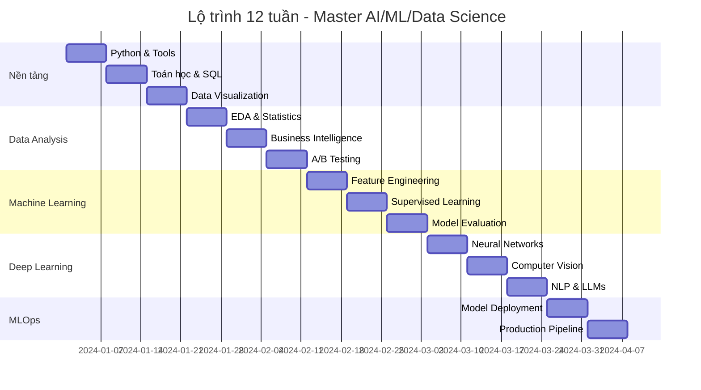

# 📅 Lộ trình 12 tuần - Master AI/ML/Data Science

> **Mục tiêu**: Cung cấp lộ trình học tập có cấu trúc theo thời gian, giúp người học đạt được mục tiêu từ beginner đến intermediate trong 12 tuần

## 🎯 **Tổng quan lộ trình**




**📁 [Xem file PNG trực tiếp](assets/12-week-roadmap.png)**

**📁 [Xem file PNG trực tiếp](assets/12-week-roadmap.png)**

**📁 [Xem file PNG trực tiếp](assets/12-week-roadmap.png)**

## 🧩 Chương trình 50/50 (Lý thuyết : Thực hành)

- Mục tiêu: 50% lý thuyết (mục tiêu tuần, kiến thức cốt lõi), 50% thực hành (deliverables rõ ràng, tiêu chí pass/fail)

| Giai đoạn | Lý thuyết (50%) | Thực hành (50%) |
|---|---|---|
| Weeks 1-3 Foundations | Python/Math/SQL principles | Package + EDA notebook + SQL queries |
| Weeks 4-6 Analysis | CRISP-DM, visualization, A/B | Dashboard + A/B report |
| Weeks 7-9 ML | FE, algorithms, evaluation | ML pipeline + API predict |
| Weeks 10-12 DL/MLOps | NN/optim, serving, monitoring | DL model + serving + monitor |

Rubric tuần (100đ): Lý thuyết 30 | Code 30 | Kết quả 30 | Báo cáo 10

---

## 🚀 **Lộ trình chi tiết theo tuần**

### **📚 Tuần 1-3: Nền tảng vững chắc**

#### **Tuần 1: Python & Development Tools**
> **Mục tiêu**: Làm chủ Python nâng cao và setup môi trường phát triển

**Nội dung chính**:
- **Python OOP**: Classes, inheritance, polymorphism, abstract classes
- **Advanced Python**: List comprehensions, generators, decorators, context managers
- **Packaging**: `pyproject.toml`, virtual environments, dependency management
- **Testing**: `pytest`, fixtures, parametrized tests, mocking
- **Git & CLI**: Version control, command line operations, branching strategies

**Deliverables**:
- Portfolio website với Python backend
- Python package với tests đầy đủ
- Git repository với commit history rõ ràng

**Learning Resources**:
- [Python OOP Tutorial](https://realpython.com/python3-object-oriented-programming/)
- [Pytest Documentation](https://docs.pytest.org/)
- [Git Handbook](https://guides.github.com/introduction/git-handbook/)

**Practice Projects**:
```python
# Ví dụ: Tạo một class hierarchy cho shapes
from abc import ABC, abstractmethod
import math

class Shape(ABC):
    """Abstract base class cho tất cả shapes"""
    
    @abstractmethod
    def area(self) -> float:
        """Tính diện tích"""
        pass
    
    @abstractmethod
    def perimeter(self) -> float:
        """Tính chu vi"""
        pass
    
    def describe(self) -> str:
        """Mô tả shape"""
        return f"{self.__class__.__name__} với diện tích {self.area():.2f}"

class Circle(Shape):
    def __init__(self, radius: float):
        if radius <= 0:
            raise ValueError("Radius phải dương")
        self.radius = radius
    
    def area(self) -> float:
        return math.pi * self.radius ** 2
    
    def perimeter(self) -> float:
        return 2 * math.pi * self.radius

class Rectangle(Shape):
    def __init__(self, width: float, height: float):
        if width <= 0 or height <= 0:
            raise ValueError("Width và height phải dương")
        self.width = width
        self.height = height
    
    def area(self) -> float:
        return self.width * self.height
    
    def perimeter(self) -> float:
        return 2 * (self.width + self.height)

# Tests
def test_shapes():
    circle = Circle(5)
    assert abs(circle.area() - 78.54) < 0.1
    assert abs(circle.perimeter() - 31.42) < 0.1
    
    rect = Rectangle(4, 6)
    assert rect.area() == 24
    assert rect.perimeter() == 20
    
    print("✅ Tất cả tests passed!")

if __name__ == "__main__":
    test_shapes()
```

#### **Tuần 2: Toán học & SQL**
> **Mục tiêu**: Nắm vững kiến thức toán học cơ bản và SQL cho data analysis

**Nội dung chính**:
- **Linear Algebra**: Vectors, matrices, eigenvalues, eigenvectors
- **Probability & Statistics**: Normal distribution, confidence intervals, hypothesis testing
- **SQL Fundamentals**: SELECT, JOINs, Window functions, subqueries
- **Database Design**: Normalization, indexing, query optimization
- **Statistical Analysis**: Descriptive statistics, correlation analysis, regression basics

**Deliverables**:
- Statistical analysis report với Python
- SQL queries cho complex data analysis
- Database schema design document

**Practice Projects**:
```python
import numpy as np
import pandas as pd
from scipy import stats
import matplotlib.pyplot as plt

class StatisticalAnalyzer:
    def __init__(self, data):
        self.data = data
        self.results = {}
    
    def descriptive_statistics(self):
        """Thống kê mô tả cơ bản"""
        stats_dict = {
            'mean': np.mean(self.data),
            'median': np.median(self.data),
            'std': np.std(self.data),
            'skewness': stats.skew(self.data),
            'kurtosis': stats.kurtosis(self.data),
            'min': np.min(self.data),
            'max': np.max(self.data),
            'q25': np.percentile(self.data, 25),
            'q75': np.percentile(self.data, 75)
        }
        
        self.results['descriptive'] = stats_dict
        return stats_dict
    
    def normality_test(self):
        """Kiểm tra tính chuẩn của dữ liệu"""
        # Shapiro-Wilk test
        shapiro_stat, shapiro_p = stats.shapiro(self.data)
        
        # Anderson-Darling test
        anderson_result = stats.anderson(self.data)
        
        normality_results = {
            'shapiro_wilk': {'statistic': shapiro_stat, 'p_value': shapiro_p},
            'anderson_darling': {'statistic': anderson_result.statistic, 'critical_values': anderson_result.critical_values}
        }
        
        self.results['normality'] = normality_results
        return normality_results
    
    def confidence_interval(self, confidence=0.95):
        """Tính confidence interval cho mean"""
        n = len(self.data)
        mean = np.mean(self.data)
        std_err = stats.sem(self.data)
        
        ci = stats.t.interval(confidence, n-1, loc=mean, scale=std_err)
        
        self.results['confidence_interval'] = {
            'lower': ci[0],
            'upper': ci[1],
            'confidence_level': confidence
        }
        
        return self.results['confidence_interval']
    
    def plot_distribution(self):
        """Vẽ histogram và Q-Q plot"""
        fig, (ax1, ax2) = plt.subplots(1, 2, figsize=(12, 5))
        
        # Histogram
        ax1.hist(self.data, bins=30, alpha=0.7, edgecolor='black')
        ax1.axvline(np.mean(self.data), color='red', linestyle='--', label='Mean')
        ax1.axvline(np.median(self.data), color='green', linestyle='--', label='Median')
        ax1.set_title('Histogram của dữ liệu')
        ax1.legend()
        
        # Q-Q plot
        stats.probplot(self.data, dist="norm", plot=ax2)
        ax2.set_title('Q-Q Plot (Normal Distribution)')
        
        plt.tight_layout()
        plt.show()

# Sử dụng
np.random.seed(42)
sample_data = np.random.normal(100, 15, 1000)
analyzer = StatisticalAnalyzer(sample_data)

print("=== THỐNG KÊ MÔ TẢ ===")
desc_stats = analyzer.descriptive_statistics()
for key, value in desc_stats.items():
    print(f"{key}: {value:.4f}")

print("\n=== KIỂM TRA TÍNH CHUẨN ===")
normality = analyzer.normality_test()
print(f"Shapiro-Wilk p-value: {normality['shapiro_wilk']['p_value']:.6f}")

print("\n=== CONFIDENCE INTERVAL (95%) ===")
ci = analyzer.confidence_interval()
print(f"95% CI: [{ci['lower']:.2f}, {ci['upper']:.2f}]")

analyzer.plot_distribution()
```

#### **Tuần 3: Data Visualization & Dashboard**
> **Mục tiêu**: Làm chủ các công cụ visualization và tạo dashboard tương tác

**Nội dung chính**:
- **Matplotlib & Seaborn**: Static visualizations, statistical plots
- **Plotly**: Interactive visualizations, 3D plots
- **Dash**: Web-based dashboards, real-time updates
- **Design Principles**: Color theory, chart selection, accessibility
- **Storytelling**: Data narrative, insights communication

**Deliverables**:
- Interactive dashboard với Plotly Dash
- Portfolio visualization project
- Data storytelling presentation

### **📊 Tuần 4-6: Data Analysis & Business Intelligence**

#### **Tuần 4: Exploratory Data Analysis**
> **Mục tiêu**: Thực hành EDA với real-world datasets

**Nội dung chính**:
- **Data Understanding**: Business context, data quality assessment
- **Data Cleaning**: Missing values, outliers, data validation
- **Exploratory Analysis**: Univariate, bivariate, multivariate analysis
- **Statistical Testing**: T-tests, chi-square, ANOVA
- **Insights Generation**: Business implications, actionable recommendations

#### **Tuần 5: Business Intelligence & Dashboarding**
> **Mục tiêu**: Xây dựng BI solutions và performance tracking

**Nội dung chính**:
- **KPI Design**: Business metrics, performance indicators
- **Dashboard Development**: Real-time monitoring, alerting
- **Data Storytelling**: Executive summaries, stakeholder communication
- **Business Context**: Industry knowledge, domain expertise
- **Performance Optimization**: Query optimization, caching strategies

#### **Tuần 6: A/B Testing & Causal Inference**
> **Mục tiêu**: Thiết kế và phân tích experiments

**Nội dung chính**:
- **Experimental Design**: Hypothesis formulation, sample size calculation
- **Statistical Analysis**: T-tests, confidence intervals, effect sizes
- **Causal Inference**: Correlation vs causation, confounding variables
- **Business Impact**: ROI calculation, decision making
- **Ethics & Best Practices**: Informed consent, data privacy

### **🤖 Tuần 7-9: Machine Learning & Model Development**

#### **Tuần 7: Feature Engineering & Selection**
> **Mục tiêu**: Tạo features có ý nghĩa và chọn features tối ưu

**Nội dung chính**:
- **Temporal Features**: Time-based variables, cyclical encoding
- **Categorical Encoding**: Label encoding, one-hot encoding, target encoding
- **Feature Selection**: Statistical methods, model-based selection
- **Domain Knowledge**: Business logic, industry expertise
- **Feature Store**: Feature versioning, reuse, monitoring

#### **Tuần 8: Supervised Learning Models**
> **Mục tiêu**: Xây dựng và optimize các mô hình supervised learning

**Nội dung chính**:
- **Linear Models**: Linear regression, Ridge, Lasso, Elastic Net
- **Tree-based Models**: Decision trees, Random Forest, Gradient Boosting
- **Model Selection**: Cross-validation, hyperparameter tuning
- **Regularization**: Overfitting prevention, generalization
- **Model Interpretation**: SHAP, feature importance, business logic

#### **Tuần 9: Model Evaluation & Deployment**
> **Mục tiêu**: Đánh giá mô hình và chuẩn bị deployment

**Nội dung chính**:
- **Performance Metrics**: Classification metrics, regression metrics
- **Model Validation**: Cross-validation strategies, time series CV
- **Error Analysis**: Bias-variance tradeoff, error patterns
- **Model Deployment**: API development, containerization
- **Monitoring**: Performance tracking, data drift detection

### **🧠 Tuần 10-12: Deep Learning & Production**

#### **Tuần 10: Neural Networks & Deep Learning**
> **Mục tiêu**: Hiểu sâu về neural networks và deep learning

**Nội dung chính**:
- **Neural Network Theory**: Universal approximation, backpropagation
- **Optimization**: Gradient descent, learning rate scheduling
- **Regularization**: Dropout, batch normalization, early stopping
- **Architecture Design**: Layer design, activation functions
- **Transfer Learning**: Pre-trained models, fine-tuning

#### **Tuần 11: Computer Vision & NLP**
> **Mục tiêu**: Áp dụng deep learning cho CV và NLP

**Nội dung chính**:
- **Computer Vision**: CNN architectures, image preprocessing
- **Natural Language Processing**: RNNs, LSTMs, Transformers
- **Data Augmentation**: Image augmentation, text augmentation
- **Model Optimization**: GPU utilization, memory management
- **Real-world Applications**: Image classification, sentiment analysis

#### **Tuần 12: MLOps & Production Pipeline**
> **Mục tiêu**: Xây dựng production-ready ML systems

**Nội dung chính**:
- **Model Serving**: REST APIs, gRPC, batch processing
- **CI/CD Pipeline**: Automated testing, deployment automation
- **Monitoring & Observability**: Model performance, data quality
- **Scalability**: Load balancing, horizontal scaling
- **Security & Compliance**: Authentication, data privacy, audit trails

## 📋 **Deliverables & Milestones**

### **End of Week 3: Foundation Complete**
- ✅ Python portfolio project
- ✅ Statistical analysis report
- ✅ Basic visualization skills
- ✅ Git proficiency

### **End of Week 6: Data Analysis Complete**
- ✅ EDA project với real dataset
- ✅ Interactive dashboard
- ✅ A/B testing analysis
- ✅ Business insights report

### **End of Week 9: ML Fundamentals Complete**
- ✅ Feature engineering pipeline
- ✅ ML model với good performance
- ✅ Model interpretation report
- ✅ Basic deployment API

### **End of Week 12: Full Stack Complete**
- ✅ Deep learning project
- ✅ Production ML pipeline
- ✅ Portfolio website
- ✅ Technical presentation

## 🎯 **Assessment & Evaluation**

### **Weekly Check-ins**
- **Self-assessment**: Rate progress 1-10
- **Code review**: Peer feedback
- **Mentor check-in**: Weekly progress discussion
- **Project milestones**: Deliverable completion

### **Final Evaluation**
- **Portfolio review**: Project showcase
- **Technical assessment**: Skills demonstration
- **Business presentation**: Stakeholder communication
- **Peer feedback**: Community evaluation

## 🚀 **Success Tips**

### **Time Management**
- **Daily practice**: 2-3 hours coding
- **Weekly review**: Sunday reflection & planning
- **Project focus**: One major project per phase
- **Balance**: Theory + practice + projects

### **Learning Strategies**
- **Active learning**: Code everything you learn
- **Project-based**: Apply knowledge immediately
- **Community**: Join study groups, forums
- **Documentation**: Write notes, create cheatsheets

### **Overcoming Challenges**
- **Imposter syndrome**: Normal feeling, focus on progress
- **Complex concepts**: Break down, practice incrementally
- **Time constraints**: Prioritize, use Pomodoro technique
- **Technical difficulties**: Stack Overflow, documentation, community help

## 📚 **Resources & References**

### **Core Materials**
- [Python Documentation](https://docs.python.org/)
- [Scikit-learn User Guide](https://scikit-learn.org/stable/user_guide.html)
- [PyTorch Tutorials](https://pytorch.org/tutorials/)
- [FastAPI Documentation](https://fastapi.tiangolo.com/)

### **Practice Platforms**
- [Kaggle](https://www.kaggle.com/) - Datasets & competitions
- [LeetCode](https://leetcode.com/) - Algorithm practice
- [HackerRank](https://www.hackerrank.com/) - Python & ML challenges
- [DataCamp](https://www.datacamp.com/) - Interactive tutorials

### **Community & Support**
- [Stack Overflow](https://stackoverflow.com/) - Technical Q&A
- [Reddit r/learnpython](https://www.reddit.com/r/learnpython/) - Python community
- [Discord AI/ML servers](https://discord.gg/) - Real-time discussions
- [GitHub Discussions](https://github.com/) - Project collaboration

---

## 💡 **Lời khuyên từ chuyên gia**

> **"Consistency beats intensity"** - Học đều đặn mỗi ngày tốt hơn học dồn dập

> **"Build in public"** - Chia sẻ quá trình học tập và projects

> **"Learn by doing"** - Lý thuyết + thực hành = thành công

> **"Community is key"** - Kết nối với người cùng học và mentors

---

*Chúc bạn thành công với lộ trình 12 tuần! 🎉*

