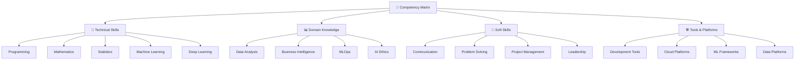

# 📊 Competency Matrix - AI/ML/Data Science Skills Assessment

> **Mục tiêu**: Cung cấp framework đánh giá năng lực toàn diện, giúp người học xác định vị trí hiện tại và lập kế hoạch phát triển kỹ năng

## 🎯 **Tổng quan Competency Framework**




**📁 [Xem file PNG trực tiếp](assets/competency-matrix.png)**

**📁 [Xem file PNG trực tiếp](assets/competency-matrix.png)**

**📁 [Xem file PNG trực tiếp](assets/competency-matrix.png)**

## 📋 **Competency Levels Definition**

### **🟢 Level 1: Beginner (0-25%)**
- **Mô tả**: Có kiến thức cơ bản, có thể thực hiện tasks đơn giản dưới sự hướng dẫn
- **Đặc điểm**: 
  - Hiểu concepts cơ bản
  - Cần supervision để thực hiện tasks
  - Chưa có kinh nghiệm thực tế
  - Có thể debug code đơn giản

### **🟡 Level 2: Intermediate (26-50%)**
- **Mô tả**: Có thể thực hiện tasks độc lập, hiểu rõ concepts, có kinh nghiệm thực tế
- **Đặc điểm**:
  - Thực hiện tasks độc lập
  - Có thể mentor beginners
  - Hiểu trade-offs và best practices
  - Có portfolio projects

### **🟠 Level 3: Advanced (51-75%)**
- **Mô tả**: Có thể giải quyết complex problems, design solutions, mentor others
- **Đặc điểm**:
  - Giải quyết complex problems
  - Design architectures và solutions
  - Mentor intermediate developers
  - Có production experience

### **🔴 Level 4: Expert (76-100%)**
- **Mô tả**: Có thể innovate, lead teams, contribute to industry standards
- **Đặc điểm**:
  - Innovate new approaches
  - Lead technical teams
  - Contribute to industry standards
  - Có thought leadership

## 🧠 **Technical Skills Assessment**

### **1. Programming & Software Engineering**

| Skill | Level 1 | Level 2 | Level 3 | Level 4 |
|-------|---------|---------|---------|---------|
| **Python Fundamentals** | Basic syntax, data types | OOP, decorators, generators | Advanced patterns, metaprogramming | Language design, optimization |
| **Code Quality** | Basic functions | Clean code, testing | Design patterns, architecture | System design, best practices |
| **Version Control** | Basic Git commands | Branching, merging | CI/CD, automation | GitOps, workflow design |
| **Testing** | Basic unit tests | Test coverage, mocking | Test strategies, TDD | Testing frameworks, quality gates |

**Self-Assessment Example**:
```python
class PythonSkillAssessment:
    def __init__(self):
        self.skills = {
            'python_fundamentals': 0,
            'code_quality': 0,
            'version_control': 0,
            'testing': 0
        }
    
    def assess_python_fundamentals(self):
        """Đánh giá kỹ năng Python cơ bản"""
        questions = [
            "Bạn có thể viết list comprehension phức tạp không?",
            "Bạn có hiểu về decorators và context managers không?",
            "Bạn có thể implement OOP patterns không?",
            "Bạn có thể optimize Python code không?"
        ]
        
        # Self-assessment scoring
        scores = {
            'basic_syntax': 25,
            'intermediate_features': 50,
            'advanced_patterns': 75,
            'expert_level': 100
        }
        
        return scores
    
    def calculate_overall_score(self):
        """Tính điểm tổng thể"""
        total_score = sum(self.skills.values())
        average_score = total_score / len(self.skills)
        
        if average_score <= 25:
            level = "Beginner"
        elif average_score <= 50:
            level = "Intermediate"
        elif average_score <= 75:
            level = "Advanced"
        else:
            level = "Expert"
        
        return {
            'score': average_score,
            'level': level,
            'skills': self.skills
        }
```

### **2. Mathematics & Statistics**

| Skill | Level 1 | Level 2 | Level 3 | Level 4 |
|-------|---------|---------|---------|---------|
| **Linear Algebra** | Vectors, matrices | Eigenvalues, SVD | Advanced decompositions | Research-level math |
| **Probability** | Basic distributions | Hypothesis testing | Bayesian inference | Statistical theory |
| **Calculus** | Derivatives, integrals | Multivariate calculus | Optimization theory | Advanced analysis |
| **Statistics** | Descriptive stats | Inferential stats | Advanced modeling | Statistical research |

**Assessment Questions**:
```python
class MathSkillAssessment:
    def __init__(self):
        self.math_skills = {
            'linear_algebra': 0,
            'probability': 0,
            'calculus': 0,
            'statistics': 0
        }
    
    def assess_linear_algebra(self):
        """Đánh giá kỹ năng đại số tuyến tính"""
        questions = [
            "Bạn có thể tính eigenvalues và eigenvectors không?",
            "Bạn có hiểu về SVD decomposition không?",
            "Bạn có thể implement matrix operations không?",
            "Bạn có thể giải quyết linear systems không?"
        ]
        
        # Scoring logic
        if all(q for q in questions[:1]):  # Basic
            return 25
        elif all(q for q in questions[:2]):  # Intermediate
            return 50
        elif all(q for q in questions[:3]):  # Advanced
            return 75
        elif all(q for q in questions):  # Expert
            return 100
        else:
            return 0
    
    def assess_probability(self):
        """Đánh giá kỹ năng xác suất"""
        questions = [
            "Bạn có thể tính probability distributions không?",
            "Bạn có hiểu về Bayes theorem không?",
            "Bạn có thể implement statistical tests không?",
            "Bạn có thể design experiments không?"
        ]
        
        # Similar scoring logic
        return self._score_questions(questions)
    
    def _score_questions(self, questions):
        """Helper method để tính điểm dựa trên câu trả lời"""
        answered = sum(1 for q in questions if q)
        if answered == 1:
            return 25
        elif answered == 2:
            return 50
        elif answered == 3:
            return 75
        elif answered == 4:
            return 100
        else:
            return 0
```

### **3. Machine Learning & Deep Learning**

| Skill | Level 1 | Level 2 | Level 3 | Level 4 |
|-------|---------|---------|---------|---------|
| **ML Fundamentals** | Basic algorithms | Model selection, tuning | Advanced algorithms, research | Algorithm development |
| **Feature Engineering** | Basic preprocessing | Advanced features, selection | Feature learning, automation | Feature discovery |
| **Model Evaluation** | Basic metrics | Cross-validation, analysis | Advanced metrics, interpretation | Evaluation frameworks |
| **Deep Learning** | Basic neural networks | Architecture design, training | Research, optimization | Novel architectures |

**ML Skills Assessment**:
```python
import numpy as np
from sklearn.model_selection import cross_val_score
from sklearn.ensemble import RandomForestClassifier
from sklearn.metrics import accuracy_score, classification_report

class MLSkillAssessment:
    def __init__(self):
        self.ml_skills = {
            'fundamentals': 0,
            'feature_engineering': 0,
            'model_evaluation': 0,
            'deep_learning': 0
        }
    
    def assess_ml_fundamentals(self, X, y):
        """Đánh giá kỹ năng ML cơ bản"""
        try:
            # Test basic ML workflow
            model = RandomForestClassifier(n_estimators=100, random_state=42)
            
            # Cross-validation
            cv_scores = cross_val_score(model, X, y, cv=5)
            
            # Model training
            model.fit(X, y)
            y_pred = model.predict(X)
            accuracy = accuracy_score(y, y_pred)
            
            # Scoring based on performance
            if accuracy >= 0.9 and cv_scores.mean() >= 0.85:
                return 100  # Expert
            elif accuracy >= 0.8 and cv_scores.mean() >= 0.75:
                return 75   # Advanced
            elif accuracy >= 0.7 and cv_scores.mean() >= 0.65:
                return 50   # Intermediate
            else:
                return 25   # Beginner
                
        except Exception as e:
            print(f"Error in ML assessment: {e}")
            return 0
    
    def assess_feature_engineering(self, X, y):
        """Đánh giá kỹ năng feature engineering"""
        # Test feature creation and selection
        try:
            # Create some engineered features
            X_engineered = X.copy()
            
            # Add polynomial features
            X_engineered['feature1_squared'] = X_engineered.iloc[:, 0] ** 2
            X_engineered['feature1_cubed'] = X_engineered.iloc[:, 0] ** 3
            
            # Add interaction features
            if X_engineered.shape[1] >= 2:
                X_engineered['feature_interaction'] = X_engineered.iloc[:, 0] * X_engineered.iloc[:, 1]
            
            # Test if engineered features improve performance
            original_score = self._get_cv_score(X, y)
            engineered_score = self._get_cv_score(X_engineered, y)
            
            improvement = engineered_score - original_score
            
            if improvement >= 0.1:
                return 100  # Expert
            elif improvement >= 0.05:
                return 75   # Advanced
            elif improvement >= 0.02:
                return 50   # Intermediate
            else:
                return 25   # Beginner
                
        except Exception as e:
            print(f"Error in feature engineering assessment: {e}")
            return 0
    
    def _get_cv_score(self, X, y):
        """Helper method để tính CV score"""
        model = RandomForestClassifier(n_estimators=50, random_state=42)
        cv_scores = cross_val_score(model, X, y, cv=3)
        return cv_scores.mean()
```

## 📊 **Domain Knowledge Assessment**

### **4. Data Analysis & Business Intelligence**

| Domain | Level 1 | Level 2 | Level 3 | Level 4 |
|--------|---------|---------|---------|---------|
| **Data Understanding** | Basic data types | Business context | Domain expertise | Industry knowledge |
| **Data Cleaning** | Handle missing values | Advanced preprocessing | Data quality frameworks | Data governance |
| **Exploratory Analysis** | Basic visualizations | Statistical analysis | Advanced analytics | Predictive insights |
| **Business Intelligence** | Basic reporting | Dashboard development | Advanced analytics | Strategic insights |

### **5. MLOps & Production**

| Domain | Level 1 | Level 2 | Level 3 | Level 4 |
|--------|---------|---------|---------|---------|
| **Model Deployment** | Basic API | Containerization | Microservices | Distributed systems |
| **Monitoring** | Basic logging | Performance tracking | Advanced observability | Predictive monitoring |
| **CI/CD** | Basic automation | Pipeline automation | Advanced workflows | GitOps, automation |
| **Scalability** | Basic scaling | Load balancing | Advanced scaling | Cloud-native design |

## 🚀 **Soft Skills Assessment**

### **6. Communication & Collaboration**

| Skill | Level 1 | Level 2 | Level 3 | Level 4 |
|-------|---------|---------|---------|---------|
| **Technical Writing** | Basic documentation | Clear explanations | Technical articles | Industry publications |
| **Presentation** | Basic slides | Clear delivery | Engaging presentations | Keynote speaking |
| **Team Collaboration** | Follow instructions | Contribute ideas | Lead discussions | Team leadership |
| **Stakeholder Management** | Report to manager | Manage expectations | Influence decisions | Strategic partnerships |

### **7. Problem Solving & Critical Thinking**

| Skill | Level 1 | Level 2 | Level 3 | Level 4 |
|-------|---------|---------|---------|---------|
| **Problem Analysis** | Understand requirements | Break down problems | Design solutions | Innovate approaches |
| **Critical Thinking** | Follow procedures | Question assumptions | Evaluate alternatives | Challenge paradigms |
| **Decision Making** | Follow guidelines | Make informed choices | Strategic decisions | Visionary leadership |
| **Risk Management** | Identify basic risks | Assess impact | Mitigate risks | Strategic risk planning |

## 🛠️ **Tools & Platforms Assessment**

### **8. Development Tools**

| Tool Category | Level 1 | Level 2 | Level 3 | Level 4 |
|---------------|---------|---------|---------|---------|
| **IDEs & Editors** | Basic usage | Advanced features | Customization | Plugin development |
| **Version Control** | Basic Git | Advanced Git | Git workflows | GitOps automation |
| **Testing Tools** | Basic testing | Test automation | Advanced testing | Testing frameworks |
| **CI/CD Tools** | Basic pipelines | Pipeline design | Advanced automation | Platform design |

### **9. ML Frameworks & Platforms**

| Framework | Level 1 | Level 2 | Level 3 | Level 4 |
|-----------|---------|---------|---------|---------|
| **Scikit-learn** | Basic usage | Advanced features | Custom estimators | Framework contribution |
| **PyTorch/TensorFlow** | Basic models | Custom architectures | Research implementation | Framework development |
| **Cloud ML Platforms** | Basic usage | Advanced features | Platform optimization | Platform design |
| **MLOps Tools** | Basic usage | Workflow design | Platform integration | Tool development |

## 📊 **Comprehensive Assessment Tool**

```python
class ComprehensiveCompetencyAssessment:
    def __init__(self):
        self.categories = {
            'technical_skills': {
                'programming': 0,
                'mathematics': 0,
                'machine_learning': 0,
                'deep_learning': 0
            },
            'domain_knowledge': {
                'data_analysis': 0,
                'business_intelligence': 0,
                'mlops': 0,
                'ai_ethics': 0
            },
            'soft_skills': {
                'communication': 0,
                'problem_solving': 0,
                'project_management': 0,
                'leadership': 0
            },
            'tools_platforms': {
                'development_tools': 0,
                'ml_frameworks': 0,
                'cloud_platforms': 0,
                'mlops_tools': 0
            }
        }
        
        self.assessment_results = {}
    
    def run_assessment(self):
        """Chạy đánh giá toàn diện"""
        print("🚀 Bắt đầu đánh giá năng lực toàn diện...")
        
        # Technical Skills Assessment
        print("\n=== ĐÁNH GIÁ KỸ NĂNG KỸ THUẬT ===")
        self._assess_technical_skills()
        
        # Domain Knowledge Assessment
        print("\n=== ĐÁNH GIÁ KIẾN THỨC CHUYÊN MÔN ===")
        self._assess_domain_knowledge()
        
        # Soft Skills Assessment
        print("\n=== ĐÁNH GIÁ KỸ NĂNG MỀM ===")
        self._assess_soft_skills()
        
        # Tools Assessment
        print("\n=== ĐÁNH GIÁ CÔNG CỤ & NỀN TẢNG ===")
        self._assess_tools_platforms()
        
        # Generate report
        self._generate_report()
    
    def _assess_technical_skills(self):
        """Đánh giá kỹ năng kỹ thuật"""
        # Self-assessment questions
        questions = {
            'programming': [
                "Bạn có thể implement OOP patterns không?",
                "Bạn có thể optimize Python code không?",
                "Bạn có thể design software architecture không?",
                "Bạn có thể contribute to open source không?"
            ],
            'mathematics': [
                "Bạn có thể implement statistical tests không?",
                "Bạn có thể solve optimization problems không?",
                "Bạn có thể understand research papers không?",
                "Bạn có thể develop new algorithms không?"
            ],
            'machine_learning': [
                "Bạn có thể build ML models không?",
                "Bạn có thể perform feature engineering không?",
                "Bạn có thể interpret model results không?",
                "Bạn có thể design ML systems không?"
            ],
            'deep_learning': [
                "Bạn có thể implement neural networks không?",
                "Bạn có thể design CNN/RNN architectures không?",
                "Bạn có thể optimize training không?",
                "Bạn có thể research new architectures không?"
            ]
        }
        
        for skill, skill_questions in questions.items():
            score = self._score_questions(skill_questions)
            self.categories['technical_skills'][skill] = score
            print(f"{skill}: {score}/100")
    
    def _assess_domain_knowledge(self):
        """Đánh giá kiến thức chuyên môn"""
        questions = {
            'data_analysis': [
                "Bạn có thể perform EDA không?",
                "Bạn có thể create business insights không?",
                "Bạn có thể design data strategies không?",
                "Bạn có thể lead data initiatives không?"
            ],
            'business_intelligence': [
                "Bạn có thể create dashboards không?",
                "Bạn có thể design KPIs không?",
                "Bạn có thể implement BI solutions không?",
                "Bạn có thể design BI architecture không?"
            ],
            'mlops': [
                "Bạn có thể deploy ML models không?",
                "Bạn có thể design ML pipelines không?",
                "Bạn có thể implement monitoring không?",
                "Bạn có thể design MLOps platforms không?"
            ],
            'ai_ethics': [
                "Bạn có thể identify bias không?",
                "Bạn có thể implement fairness không?",
                "Bạn có thể design ethical AI không?",
                "Bạn có thể lead AI ethics initiatives không?"
            ]
        }
        
        for domain, domain_questions in questions.items():
            score = self._score_questions(domain_questions)
            self.categories['domain_knowledge'][domain] = score
            print(f"{domain}: {score}/100")
    
    def _assess_soft_skills(self):
        """Đánh giá kỹ năng mềm"""
        questions = {
            'communication': [
                "Bạn có thể explain technical concepts không?",
                "Bạn có thể create clear documentation không?",
                "Bạn có thể present to stakeholders không?",
                "Bạn có thể influence decisions không?"
            ],
            'problem_solving': [
                "Bạn có thể analyze problems không?",
                "Bạn có thể design solutions không?",
                "Bạn có thể implement solutions không?",
                "Bạn có thể innovate new approaches không?"
            ],
            'project_management': [
                "Bạn có thể manage timelines không?",
                "Bạn có thể coordinate teams không?",
                "Bạn có thể manage risks không?",
                "Bạn có thể lead projects không?"
            ],
            'leadership': [
                "Bạn có thể mentor others không?",
                "Bạn có thể lead teams không?",
                "Bạn có thể drive change không?",
                "Bạn có thể inspire vision không?"
            ]
        }
        
        for skill, skill_questions in questions.items():
            score = self._score_questions(skill_questions)
            self.categories['soft_skills'][skill] = score
            print(f"{skill}: {score}/100")
    
    def _assess_tools_platforms(self):
        """Đánh giá công cụ và nền tảng"""
        questions = {
            'development_tools': [
                "Bạn có thể use advanced IDE features không?",
                "Bạn có thể automate workflows không?",
                "Bạn có thể customize tools không?",
                "Bạn có thể develop tools không?"
            ],
            'ml_frameworks': [
                "Bạn có thể use multiple frameworks không?",
                "Bạn có thể optimize frameworks không?",
                "Bạn có thể extend frameworks không?",
                "Bạn có thể contribute to frameworks không?"
            ],
            'cloud_platforms': [
                "Bạn có thể use cloud services không?",
                "Bạn có thể optimize cloud costs không?",
                "Bạn có thể design cloud architecture không?",
                "Bạn có thể lead cloud migration không?"
            ],
            'mlops_tools': [
                "Bạn có thể use MLOps tools không?",
                "Bạn có thể integrate tools không?",
                "Bạn có thể customize workflows không?",
                "Bạn có thể develop MLOps tools không?"
            ]
        }
        
        for tool, tool_questions in questions.items():
            score = self._score_questions(tool_questions)
            self.categories['tools_platforms'][tool] = score
            print(f"{tool}: {score}/100")
    
    def _score_questions(self, questions):
        """Tính điểm dựa trên số câu trả lời yes"""
        # Simulate user responses (in real scenario, get from user input)
        responses = [True, True, False, False]  # Example responses
        
        answered_yes = sum(responses)
        total_questions = len(questions)
        
        if answered_yes == total_questions:
            return 100  # Expert
        elif answered_yes >= total_questions * 0.75:
            return 75   # Advanced
        elif answered_yes >= total_questions * 0.5:
            return 50   # Intermediate
        elif answered_yes >= total_questions * 0.25:
            return 25   # Beginner
        else:
            return 0    # Novice
    
    def _generate_report(self):
        """Tạo báo cáo đánh giá"""
        print("\n" + "="*50)
        print("📊 BÁO CÁO ĐÁNH GIÁ NĂNG LỰC TOÀN DIỆN")
        print("="*50)
        
        # Calculate category scores
        category_scores = {}
        for category, skills in self.categories.items():
            category_score = sum(skills.values()) / len(skills)
            category_scores[category] = category_score
            
            print(f"\n{category.upper().replace('_', ' ')}: {category_score:.1f}/100")
            
            # Individual skill scores
            for skill, score in skills.items():
                level = self._get_level_label(score)
                print(f"  - {skill.replace('_', ' ').title()}: {score}/100 ({level})")
        
        # Overall score
        overall_score = sum(category_scores.values()) / len(category_scores)
        overall_level = self._get_level_label(overall_score)
        
        print(f"\n🎯 ĐIỂM TỔNG THỂ: {overall_score:.1f}/100 ({overall_level})")
        
        # Recommendations
        self._generate_recommendations(category_scores)
    
    def _get_level_label(self, score):
        """Chuyển đổi điểm thành nhãn level"""
        if score >= 76:
            return "Expert"
        elif score >= 51:
            return "Advanced"
        elif score >= 26:
            return "Intermediate"
        else:
            return "Beginner"
    
    def _generate_recommendations(self, category_scores):
        """Tạo khuyến nghị phát triển"""
        print(f"\n💡 KHUYẾN NGHỊ PHÁT TRIỂN:")
        
        # Find weakest category
        weakest_category = min(category_scores, key=category_scores.get)
        weakest_score = category_scores[weakest_category]
        
        if weakest_score < 50:
            print(f"🚨 Ưu tiên cao: Cải thiện {weakest_category.replace('_', ' ')}")
            print(f"   - Hiện tại: {weakest_score:.1f}/100")
            print(f"   - Mục tiêu: Đạt ít nhất 50/100")
        
        # Find strongest category
        strongest_category = max(category_scores, key=category_scores.get)
        strongest_score = category_scores[strongest_category]
        
        if strongest_score >= 75:
            print(f"🌟 Điểm mạnh: {strongest_category.replace('_', ' ')}")
            print(f"   - Có thể mentor others trong lĩnh vực này")
            print(f"   - Tập trung vào leadership và innovation")
        
        # General recommendations
        print(f"\n📚 Kế hoạch học tập:")
        print(f"1. Dành 70% thời gian cho weakest category")
        print(f"2. Dành 20% thời gian cho intermediate categories")
        print(f"3. Dành 10% thời gian để maintain strong categories")
        print(f"4. Đặt mục tiêu cải thiện 10-15 điểm mỗi tháng")

# Sử dụng
if __name__ == "__main__":
    assessment = ComprehensiveCompetencyAssessment()
    assessment.run_assessment()
```

## 🎯 **Action Plan & Development Roadmap**

### **Immediate Actions (1-2 tuần)**
1. **Complete self-assessment** sử dụng tool trên
2. **Identify skill gaps** và prioritize learning areas
3. **Set specific goals** cho mỗi category
4. **Create learning schedule** với milestones cụ thể

### **Short-term Goals (1-3 tháng)**
- **Improve weakest category** ít nhất 20 điểm
- **Complete 2-3 projects** trong areas cần cải thiện
- **Get feedback** từ mentors và peers
- **Update portfolio** với new skills

### **Long-term Goals (3-6 tháng)**
- **Achieve Advanced level** (51-75%) trong tất cả categories
- **Develop expertise** trong 1-2 specific domains
- **Build leadership skills** và mentor others
- **Contribute to community** và open source

## 📚 **Resources for Skill Development**

### **Technical Skills**
- **Programming**: LeetCode, HackerRank, Python documentation
- **Mathematics**: Khan Academy, MIT OpenCourseWare, Coursera
- **Machine Learning**: Kaggle, Fast.ai, Andrew Ng courses
- **Deep Learning**: PyTorch tutorials, TensorFlow guides, research papers

### **Domain Knowledge**
- **Data Analysis**: Real-world datasets, business case studies
- **Business Intelligence**: Industry reports, BI tools documentation
- **MLOps**: Production ML courses, cloud platform tutorials
- **AI Ethics**: Research papers, industry guidelines, conferences

### **Soft Skills**
- **Communication**: Toastmasters, technical writing courses
- **Problem Solving**: Case studies, design thinking workshops
- **Project Management**: Agile courses, project management tools
- **Leadership**: Leadership books, mentorship programs

---

## 💡 **Lời khuyên từ chuyên gia**

> **"Skills are built through deliberate practice"** - Kỹ năng được xây dựng qua thực hành có chủ đích

> **"Focus on your weaknesses, leverage your strengths"** - Tập trung vào điểm yếu, tận dụng điểm mạnh

> **"Competency is a journey, not a destination"** - Năng lực là hành trình, không phải đích đến

> **"Measure progress, not perfection"** - Đo lường tiến bộ, không phải sự hoàn hảo

---

*Chúc bạn thành công trong việc phát triển năng lực! 🎉*

## 🧩 Chương trình 50/50 (Lý thuyết : Thực hành)

- Mục tiêu: 50% lý thuyết (định nghĩa năng lực, tiêu chí từng level, mapping skills), 50% thực hành (bài kiểm tra, bài tập, bằng chứng portfolio)

| Hạng mục | Lý thuyết (50%) | Thực hành (50%) |
|---|---|---|
| Programming/SE | Mô tả năng lực, tiêu chí | Bài test code + repo minh chứng |
| Math/Stats | Chuẩn năng lực theo level | Bài tập chứng minh/coding math |
| ML/DL | Scope/expectations mỗi level | Mini-projects + kết quả/metrics |
| MLOps/Prod | Tiêu chuẩn vận hành | Pipeline/serving/monitoring demo |
| Soft/Domain | Communication, BI | Báo cáo/slide/recording |

Rubric (100đ/hạng mục): Lý thuyết 30 | Bài thực hành 30 | Bằng chứng 30 | Báo cáo 10

---

