# 🛠️ Bộ công cụ & Môi trường - AI/ML Development Setup

> **Mục tiêu**: Cung cấp hướng dẫn setup môi trường phát triển AI/ML hoàn chỉnh, bao gồm tools, libraries và best practices

## 🎯 **Tổng quan Development Environment**

```mermaid
graph TD
    A[🚀 AI/ML Development Environment] --> B[🐍 Python Ecosystem]
    A --> C[📊 Data Science Stack]
    A --> D[🤖 ML/DL Frameworks]
    A --> E[☁️ Cloud & Deployment]
    A --> F[🔄 MLOps Tools]
    
    B --> B1[Python 3.9+]
    B --> B2[Poetry/Pipenv]
    B --> B3[Virtual Environments]
    B --> B4[Code Quality Tools]
    
    C --> C1[Pandas/NumPy]
    C --> C2[Matplotlib/Seaborn]
    C --> C3[Jupyter/VS Code]
    C --> C4[Database Tools]
    
    D --> D1[Scikit-learn]
    D --> D2[PyTorch/TensorFlow]
    D --> D3[Transformers]
    D --> D4[MLflow]
    
    E --> E1[AWS/GCP/Azure]
    E --> E2[Docker/Kubernetes]
    E --> E3[FastAPI/Flask]
    E --> E4[Monitoring Tools]
    
    F --> F1[Experiment Tracking]
    F --> F2[Model Registry]
    F --> F3[Pipeline Automation]
    F --> F4[Performance Monitoring]
```




**📁 [Xem file PNG trực tiếp](assets/development-environment.png)**

**📁 [Xem file PNG trực tiếp](assets/development-environment.png)**

**📁 [Xem file PNG trực tiếp](assets/development-environment.png)**

## 🧩 Chương trình 50/50 (Lý thuyết : Thực hành)

- Mục tiêu: 50% lý thuyết (nguyên tắc setup, tiêu chuẩn chất lượng, bảo trì), 50% thực hành (thiết lập môi trường, scripts, kiểm thử)

| Hạng mục | Lý thuyết (50%) | Thực hành (50%) |
|---|---|---|
| Python Env | Versioning, venv/Poetry, dep rules | Tạo project Poetry + lock + publish |
| DS Stack | Stack chọn và lý do | Notebook demo Pandas/Plotly |
| IDE/Dev | Lint/format/test, settings | VS Code settings + pre-commit |
| ML/DL | Frameworks & versions | Train demo + track deps |
| Cloud/Container | Docker/K8s cơ bản | Dockerfile + compose + healthcheck |

Rubric (100đ/hạng mục): Lý thuyết 30 | Thiết lập 30 | Kiểm thử 30 | Tài liệu 10

---

## 🐍 **Python Environment Setup**

### **1. Python Version Management**

**Khuyến nghị**: Python 3.9+ (tối ưu cho AI/ML)

**Setup với pyenv**:
```bash
# macOS
brew install pyenv

# Ubuntu/Debian
curl https://pyenv.run | bash

# Windows
# Sử dụng pyenv-win hoặc conda
```

**Install Python versions**:
```bash
# Install Python 3.11 (stable)
pyenv install 3.11.7
pyenv global 3.11.7

# Verify installation
python --version
pip --version
```

### **2. Package Management với Poetry**

**Install Poetry**:
```bash
# Official installer
curl -sSL https://install.python-poetry.org | python3 -

# Verify installation
poetry --version
```

**Project setup với Poetry**:
```python
# pyproject.toml example
[tool.poetry]
name = "ai-ml-project"
version = "0.1.0"
description = "AI/ML project with modern Python tooling"
authors = ["Your Name <your.email@example.com>"]

[tool.poetry.dependencies]
python = "^3.9"
pandas = "^2.0.0"
numpy = "^1.24.0"
scikit-learn = "^1.3.0"
matplotlib = "^3.7.0"
seaborn = "^0.12.0"
jupyter = "^1.0.0"

[tool.poetry.group.dev.dependencies]
pytest = "^7.4.0"
black = "^23.0.0"
flake8 = "^6.0.0"
mypy = "^1.5.0"
pre-commit = "^3.3.0"

[tool.poetry.group.ml.dependencies]
torch = "^2.0.0"
transformers = "^4.30.0"
mlflow = "^2.6.0"
fastapi = "^0.100.0"
uvicorn = "^0.23.0"

[build-system]
requires = ["poetry-core"]
build-backend = "poetry.core.masonry.api"

# Development tools configuration
[tool.black]
line-length = 88
target-version = ['py39']
include = '\.pyi?$'

[tool.isort]
profile = "black"
multi_line_output = 3

[tool.mypy]
python_version = "3.9"
warn_return_any = true
warn_unused_configs = true
disallow_untyped_defs = true

[tool.pytest.ini_options]
testpaths = ["tests"]
python_files = ["test_*.py", "*_test.py"]
python_classes = ["Test*"]
python_functions = ["test_*"]
addopts = "-v --tb=short"
```

**Poetry commands**:
```bash
# Create new project
poetry new my-ai-project
cd my-ai-project

# Install dependencies
poetry install

# Add new dependency
poetry add pandas numpy scikit-learn

# Add dev dependency
poetry add --group dev pytest black flake8

# Run commands in virtual environment
poetry run python main.py
poetry run pytest

# Activate virtual environment
poetry shell

# Update dependencies
poetry update

# Export requirements.txt
poetry export -f requirements.txt --output requirements.txt
```

### **3. Virtual Environment Management**

**Alternative: venv + pip**:
```bash
# Create virtual environment
python -m venv venv

# Activate (Linux/Mac)
source venv/bin/activate

# Activate (Windows)
venv\Scripts\activate

# Install dependencies
pip install -r requirements.txt

# Deactivate
deactivate
```

**Requirements.txt example**:
```txt
# Core dependencies
pandas>=2.0.0
numpy>=1.24.0
scikit-learn>=1.3.0

# Data visualization
matplotlib>=3.7.0
seaborn>=0.12.0
plotly>=5.15.0

# Machine Learning
torch>=2.0.0
transformers>=4.30.0
mlflow>=2.6.0

# Web framework
fastapi>=0.100.0
uvicorn>=0.23.0

# Development tools
pytest>=7.4.0
black>=23.0.0
flake8>=6.0.0
mypy>=1.5.0
```

## 📊 **Data Science Stack**

### **4. Core Libraries**

**Data Manipulation**:
```python
# Pandas - Data manipulation and analysis
import pandas as pd

# NumPy - Numerical computing
import numpy as np

# Example usage
class DataProcessor:
    def __init__(self):
        self.data = None
    
    def load_data(self, file_path: str) -> pd.DataFrame:
        """Load data from various formats"""
        if file_path.endswith('.csv'):
            self.data = pd.read_csv(file_path)
        elif file_path.endswith('.parquet'):
            self.data = pd.read_parquet(file_path)
        elif file_path.endswith('.xlsx'):
            self.data = pd.read_excel(file_path)
        else:
            raise ValueError(f"Unsupported file format: {file_path}")
        
        return self.data
    
    def clean_data(self) -> pd.DataFrame:
        """Basic data cleaning operations"""
        if self.data is None:
            raise ValueError("No data loaded")
        
        # Remove duplicates
        self.data = self.data.drop_duplicates()
        
        # Handle missing values
        numeric_cols = self.data.select_dtypes(include=[np.number]).columns
        self.data[numeric_cols] = self.data[numeric_cols].fillna(
            self.data[numeric_cols].median()
        )
        
        # Handle categorical missing values
        categorical_cols = self.data.select_dtypes(include=['object']).columns
        self.data[categorical_cols] = self.data[categorical_cols].fillna('Unknown')
        
        return self.data
    
    def get_summary(self) -> dict:
        """Get comprehensive data summary"""
        if self.data is None:
            raise ValueError("No data loaded")
        
        summary = {
            'shape': self.data.shape,
            'columns': list(self.data.columns),
            'dtypes': self.data.dtypes.to_dict(),
            'missing_values': self.data.isnull().sum().to_dict(),
            'numeric_summary': self.data.describe().to_dict(),
            'categorical_summary': {}
        }
        
        # Categorical summary
        for col in self.data.select_dtypes(include=['object']).columns:
            summary['categorical_summary'][col] = {
                'unique_count': self.data[col].nunique(),
                'top_values': self.data[col].value_counts().head(5).to_dict()
            }
        
        return summary

# Usage example
processor = DataProcessor()
df = processor.load_data('data.csv')
clean_df = processor.clean_data()
summary = processor.get_summary()

print("Data Summary:")
print(f"Shape: {summary['shape']}")
print(f"Missing values: {summary['missing_values']}")
```

**Data Visualization**:
```python
# Matplotlib - Basic plotting
import matplotlib.pyplot as plt

# Seaborn - Statistical visualization
import seaborn as sns

# Plotly - Interactive visualization
import plotly.express as px
import plotly.graph_objects as go
from plotly.subplots import make_subplots

class DataVisualizer:
    def __init__(self, style='seaborn'):
        self.style = style
        plt.style.use(style)
        sns.set_palette("husl")
    
    def plot_distribution(self, data, column, title=None):
        """Plot distribution of a column"""
        fig, (ax1, ax2) = plt.subplots(1, 2, figsize=(15, 5))
        
        # Histogram
        ax1.hist(data[column], bins=30, alpha=0.7, edgecolor='black')
        ax1.set_title(f'Histogram - {column}')
        ax1.set_xlabel(column)
        ax1.set_ylabel('Frequency')
        
        # Box plot
        ax2.boxplot(data[column])
        ax2.set_title(f'Box Plot - {column}')
        ax2.set_ylabel(column)
        
        if title:
            fig.suptitle(title, fontsize=16)
        
        plt.tight_layout()
        plt.show()
        
        return fig
    
    def plot_correlation_matrix(self, data, numeric_columns=None):
        """Plot correlation matrix"""
        if numeric_columns is None:
            numeric_columns = data.select_dtypes(include=[np.number]).columns
        
        correlation_matrix = data[numeric_columns].corr()
        
        plt.figure(figsize=(10, 8))
        sns.heatmap(
            correlation_matrix, 
            annot=True, 
            cmap='coolwarm', 
            center=0,
            square=True,
            fmt='.2f'
        )
        plt.title('Correlation Matrix')
        plt.tight_layout()
        plt.show()
    
    def create_interactive_dashboard(self, data, key_metrics):
        """Create interactive Plotly dashboard"""
        fig = make_subplots(
            rows=2, cols=2,
            subplot_titles=['Key Metrics', 'Data Distribution', 'Trends', 'Summary'],
            specs=[[{"type": "indicator"}, {"type": "histogram"}],
                   [{"type": "scatter"}, {"type": "bar"}]]
        )
        
        # Key metrics
        fig.add_trace(
            go.Indicator(
                mode="gauge+number+delta",
                value=key_metrics['current_value'],
                delta={'reference': key_metrics['previous_value']},
                gauge={'axis': {'range': [None, key_metrics['max_value']]},
                       'bar': {'color': "darkblue"},
                       'steps': [{'range': [0, key_metrics['threshold']], 'color': "lightgray"}],
                       'threshold': {'line': {'color': "red", 'width': 4}, 'thickness': 0.75, 'value': key_metrics['threshold']}},
                title={'text': key_metrics['name']}
            ),
            row=1, col=1
        )
        
        # Data distribution
        fig.add_trace(
            go.Histogram(x=data.iloc[:, 0], name='Distribution'),
            row=1, col=2
        )
        
        # Trends (if time series data)
        if len(data) > 1:
            fig.add_trace(
                go.Scatter(x=data.index, y=data.iloc[:, 0], name='Trend'),
                row=2, col=1
            )
        
        # Summary statistics
        summary_stats = data.describe()
        fig.add_trace(
            go.Bar(x=['Mean', 'Std', 'Min', 'Max'], 
                   y=[summary_stats.iloc[1, 0], summary_stats.iloc[2, 0], 
                      summary_stats.iloc[3, 0], summary_stats.iloc[7, 0]],
                   name='Statistics'),
            row=2, col=2
        )
        
        fig.update_layout(height=600, title_text="Interactive Data Dashboard")
        fig.show()
        
        return fig

# Usage example
visualizer = DataVisualizer()
visualizer.plot_distribution(df, 'age', 'Age Distribution Analysis')
visualizer.plot_correlation_matrix(df)

# Interactive dashboard
key_metrics = {
    'name': 'Average Age',
    'current_value': df['age'].mean(),
    'previous_value': df['age'].mean() - 1,
    'max_value': df['age'].max(),
    'threshold': df['age'].quantile(0.8)
}
visualizer.create_interactive_dashboard(df, key_metrics)
```

### **5. Jupyter & Development Environment**

**Jupyter Lab setup**:
```bash
# Install Jupyter Lab
poetry add jupyterlab

# Install additional kernels
poetry add ipykernel

# Register kernel
poetry run python -m ipykernel install --user --name my-ai-project

# Launch Jupyter Lab
poetry run jupyter lab
```

**VS Code setup**:
```json
// .vscode/settings.json
{
    "python.defaultInterpreterPath": "./venv/bin/python",
    "python.linting.enabled": true,
    "python.linting.pylintEnabled": false,
    "python.linting.flake8Enabled": true,
    "python.formatting.provider": "black",
    "python.sortImports.args": ["--profile", "black"],
    "editor.formatOnSave": true,
    "editor.codeActionsOnSave": {
        "source.organizeImports": true
    },
    "python.testing.pytestEnabled": true,
    "python.testing.unittestEnabled": false,
    "python.testing.pytestArgs": [
        "tests"
    ]
}
```

**VS Code Extensions**:
- Python (Microsoft)
- Jupyter (Microsoft)
- Python Indent (Kevin Rose)
- autoDocstring (Nils Werner)
- GitLens (Eric Amodio)
- Docker (Microsoft)
- Remote Development (Microsoft)

## 🤖 **Machine Learning Frameworks**

### **6. Scikit-learn Ecosystem**

**Install và setup**:
```bash
poetry add scikit-learn scikit-optimize
```

**Basic ML pipeline**:
```python
from sklearn.model_selection import train_test_split, cross_val_score
from sklearn.preprocessing import StandardScaler
from sklearn.ensemble import RandomForestClassifier
from sklearn.metrics import classification_report, confusion_matrix
import joblib

class MLPipeline:
    def __init__(self):
        self.model = None
        self.scaler = StandardScaler()
        self.feature_names = None
    
    def prepare_data(self, X, y, test_size=0.2, random_state=42):
        """Prepare data for training"""
        # Split data
        X_train, X_test, y_train, y_test = train_test_split(
            X, y, test_size=test_size, random_state=random_state
        )
        
        # Scale features
        X_train_scaled = self.scaler.fit_transform(X_train)
        X_test_scaled = self.scaler.transform(X_test)
        
        # Store feature names
        if hasattr(X, 'columns'):
            self.feature_names = list(X.columns)
        
        return X_train_scaled, X_test_scaled, y_train, y_test
    
    def train_model(self, X_train, y_train, model_type='random_forest'):
        """Train ML model"""
        if model_type == 'random_forest':
            self.model = RandomForestClassifier(
                n_estimators=100,
                random_state=42,
                n_jobs=-1
            )
        
        # Train model
        self.model.fit(X_train, y_train)
        
        # Cross-validation score
        cv_scores = cross_val_score(self.model, X_train, y_train, cv=5)
        
        return {
            'model': self.model,
            'cv_mean': cv_scores.mean(),
            'cv_std': cv_scores.std()
        }
    
    def evaluate_model(self, X_test, y_test):
        """Evaluate model performance"""
        if self.model is None:
            raise ValueError("Model not trained yet")
        
        # Make predictions
        y_pred = self.model.predict(X_test)
        
        # Generate report
        report = classification_report(y_test, y_pred, output_dict=True)
        
        return {
            'predictions': y_pred,
            'classification_report': report,
            'accuracy': report['accuracy']
        }
    
    def save_model(self, filepath):
        """Save trained model"""
        if self.model is None:
            raise ValueError("Model not trained yet")
        
        model_data = {
            'model': self.model,
            'scaler': self.scaler,
            'feature_names': self.feature_names
        }
        
        joblib.dump(model_data, filepath)
        print(f"Model saved to {filepath}")
    
    def load_model(self, filepath):
        """Load trained model"""
        model_data = joblib.load(filepath)
        
        self.model = model_data['model']
        self.scaler = model_data['scaler']
        self.feature_names = model_data['feature_names']
        
        print(f"Model loaded from {filepath}")
        return self

# Usage example
pipeline = MLPipeline()
X_train_scaled, X_test_scaled, y_train, y_test = pipeline.prepare_data(X, y)

# Train model
training_result = pipeline.train_model(X_train_scaled, y_train)
print(f"CV Score: {training_result['cv_mean']:.3f} (+/- {training_result['cv_std'] * 2:.3f})")

# Evaluate model
evaluation_result = pipeline.evaluate_model(X_test_scaled, y_test)
print(f"Test Accuracy: {evaluation_result['accuracy']:.3f}")

# Save model
pipeline.save_model('model.pkl')
```

### **7. Deep Learning với PyTorch**

**Install PyTorch**:
```bash
# CPU version
poetry add torch torchvision torchaudio

# GPU version (CUDA 11.8)
poetry add torch torchvision torchaudio --index-url https://download.pytorch.org/whl/cu118
```

**Basic PyTorch setup**:
```python
import torch
import torch.nn as nn
import torch.optim as optim
from torch.utils.data import DataLoader, TensorDataset

class SimpleNN(nn.Module):
    def __init__(self, input_size, hidden_size, output_size):
        super(SimpleNN, self).__init__()
        self.layer1 = nn.Linear(input_size, hidden_size)
        self.layer2 = nn.Linear(hidden_size, hidden_size)
        self.layer3 = nn.Linear(hidden_size, output_size)
        self.relu = nn.ReLU()
        self.dropout = nn.Dropout(0.2)
    
    def forward(self, x):
        x = self.relu(self.layer1(x))
        x = self.dropout(x)
        x = self.relu(self.layer2(x))
        x = self.dropout(x)
        x = self.layer3(x)
        return x

class PyTorchTrainer:
    def __init__(self, model, device='auto'):
        self.model = model
        
        # Device selection
        if device == 'auto':
            self.device = torch.device('cuda' if torch.cuda.is_available() else 'cpu')
        else:
            self.device = device
        
        self.model.to(self.device)
        print(f"Using device: {self.device}")
    
    def prepare_data(self, X, y, batch_size=32):
        """Convert numpy arrays to PyTorch tensors"""
        # Convert to tensors
        X_tensor = torch.FloatTensor(X)
        y_tensor = torch.LongTensor(y) if len(y.shape) == 1 else torch.FloatTensor(y)
        
        # Create dataset and dataloader
        dataset = TensorDataset(X_tensor, y_tensor)
        dataloader = DataLoader(dataset, batch_size=batch_size, shuffle=True)
        
        return dataloader
    
    def train(self, train_loader, epochs=100, learning_rate=0.001):
        """Train the model"""
        criterion = nn.CrossEntropyLoss()
        optimizer = optim.Adam(self.model.parameters(), lr=learning_rate)
        
        self.model.train()
        losses = []
        
        for epoch in range(epochs):
            running_loss = 0.0
            for batch_X, batch_y in train_loader:
                # Move to device
                batch_X = batch_X.to(self.device)
                batch_y = batch_y.to(self.device)
                
                # Forward pass
                outputs = self.model(batch_X)
                loss = criterion(outputs, batch_y)
                
                # Backward pass
                optimizer.zero_grad()
                loss.backward()
                optimizer.step()
                
                running_loss += loss.item()
            
            epoch_loss = running_loss / len(train_loader)
            losses.append(epoch_loss)
            
            if epoch % 10 == 0:
                print(f'Epoch {epoch}, Loss: {epoch_loss:.4f}')
        
        return losses
    
    def evaluate(self, test_loader):
        """Evaluate the model"""
        self.model.eval()
        correct = 0
        total = 0
        
        with torch.no_grad():
            for batch_X, batch_y in test_loader:
                batch_X = batch_X.to(self.device)
                batch_y = batch_y.to(self.device)
                
                outputs = self.model(batch_X)
                _, predicted = torch.max(outputs.data, 1)
                
                total += batch_y.size(0)
                correct += (predicted == batch_y).sum().item()
        
        accuracy = 100 * correct / total
        print(f'Accuracy: {accuracy:.2f}%')
        return accuracy
    
    def save_model(self, filepath):
        """Save trained model"""
        torch.save(self.model.state_dict(), filepath)
        print(f"Model saved to {filepath}")
    
    def load_model(self, filepath):
        """Load trained model"""
        self.model.load_state_dict(torch.load(filepath, map_location=self.device))
        print(f"Model loaded from {filepath}")

# Usage example
# Prepare data
X_tensor = torch.FloatTensor(X)
y_tensor = torch.LongTensor(y)

# Create model
input_size = X.shape[1]
hidden_size = 64
output_size = len(np.unique(y))
model = SimpleNN(input_size, hidden_size, output_size)

# Train model
trainer = PyTorchTrainer(model)
train_loader = trainer.prepare_data(X, y, batch_size=32)
losses = trainer.train(train_loader, epochs=100)

# Evaluate model
test_loader = trainer.prepare_data(X_test, y_test, batch_size=32)
accuracy = trainer.evaluate(test_loader)

# Save model
trainer.save_model('pytorch_model.pth')
```

## 🔄 **MLOps & Experiment Tracking**

### **8. MLflow Setup**

**Install MLflow**:
```bash
poetry add mlflow
```

**Basic MLflow usage**:
```python
import mlflow
import mlflow.sklearn
from sklearn.ensemble import RandomForestClassifier
from sklearn.metrics import accuracy_score

class MLflowExperiment:
    def __init__(self, experiment_name):
        self.experiment_name = experiment_name
        mlflow.set_experiment(experiment_name)
    
    def run_experiment(self, X_train, X_test, y_train, y_test, params):
        """Run ML experiment with MLflow tracking"""
        with mlflow.start_run():
            # Log parameters
            mlflow.log_params(params)
            
            # Train model
            model = RandomForestClassifier(**params, random_state=42)
            model.fit(X_train, y_train)
            
            # Make predictions
            y_pred = model.predict(X_test)
            accuracy = accuracy_score(y_test, y_pred)
            
            # Log metrics
            mlflow.log_metric("accuracy", accuracy)
            
            # Log model
            mlflow.sklearn.log_model(model, "model")
            
            # Log additional artifacts
            mlflow.log_artifact("data_processing.py")
            
            print(f"Experiment completed. Accuracy: {accuracy:.3f}")
            
            return model, accuracy

# Usage example
experiment = MLflowExperiment("random_forest_experiment")

params = {
    'n_estimators': 100,
    'max_depth': 10,
    'min_samples_split': 2
}

model, accuracy = experiment.run_experiment(
    X_train, X_test, y_train, y_test, params
)
```

## 📚 **Tài liệu tham khảo**

### **Official Documentation**
- [Python Documentation](https://docs.python.org/)
- [Poetry Documentation](https://python-poetry.org/docs/)
- [Pandas Documentation](https://pandas.pydata.org/docs/)
- [Scikit-learn Documentation](https://scikit-learn.org/stable/)
- [PyTorch Documentation](https://pytorch.org/docs/)
- [MLflow Documentation](https://mlflow.org/docs/)

### **Best Practices**
- [Python Packaging Guide](https://packaging.python.org/guides/)
- [Data Science Project Structure](https://drivendata.github.io/cookiecutter-data-science/)
- [MLOps Best Practices](https://ml-ops.org/)
- [Python Code Style](https://pep8.org/)

### **Community Resources**
- [Real Python](https://realpython.com/) - Python tutorials
- [Towards Data Science](https://towardsdatascience.com/) - ML articles
- [Papers With Code](https://paperswithcode.com/) - Research implementations
- [Kaggle](https://www.kaggle.com/) - Datasets and competitions

---

## 💡 **Lời khuyên từ chuyên gia**

> **"Start simple, scale smart"** - Bắt đầu đơn giản, scale thông minh

> **"Environment consistency is key"** - Tính nhất quán môi trường là chìa khóa

> **"Automate everything that can be automated"** - Tự động hóa mọi thứ có thể

> **"Document your setup process"** - Ghi chép quy trình setup

---

*Chúc bạn setup môi trường thành công! 🎉*

