# 🏗️ Ứng dụng theo Stack - Technology Architecture Patterns

> **Mục tiêu**: Cung cấp hướng dẫn xây dựng ứng dụng AI/ML theo các technology stack cụ thể, bao gồm Python, Rust, Node.js và interop patterns

## 🎯 **Tổng quan Technology Stacks**

```mermaid
graph TD
    A[🏗️ Technology Stacks] --> B[🐍 Python Stack]
    A --> C[🦀 Rust Stack]
    A --> D[🟢 Node.js Stack]
    A --> E[🔗 Hybrid Stack]
    A --> F[☁️ Cloud-Native Stack]
    
    B --> B1[FastAPI/Flask]
    B --> B2[Pandas/NumPy]
    B --> B3[Scikit-learn/PyTorch]
    B --> B4[PostgreSQL/Redis]
    
    C --> C1[Actix-web/Axum]
    C --> C2[Serde/Serde-json]
    C --> C3[Tokio/Async-std]
    C --> C4[Postgres/Redis]
    
    D --> D1[Express/Fastify]
    D --> D2[TypeScript/JavaScript]
    D --> D3[TensorFlow.js]
    D --> D4[MongoDB/Redis]
    
    E --> E1[Python Backend]
    E --> E2[Rust Core]
    E --> E3[Node.js Frontend]
    E --> E4[Shared APIs]
    
    F --> F1[Kubernetes]
    F --> F2[Docker]
    F --> F3[Cloud Services]
    F --> F4[Microservices]
```




**📁 [Xem file PNG trực tiếp](assets/technology-stacks.png)**

**📁 [Xem file PNG trực tiếp](assets/technology-stacks.png)**

**📁 [Xem file PNG trực tiếp](assets/technology-stacks.png)**

## 🧩 Chương trình 50/50 (Lý thuyết : Thực hành)

- Mục tiêu: 50% lý thuyết (nguyên tắc kiến trúc, ưu/nhược từng stack, trade-offs), 50% thực hành (xây dựng service end-to-end có benchmark)

| Mô-đun | Lý thuyết (50%) | Thực hành (50%) |
|---|---|---|
| Python Stack | Kiến trúc API + ML pipeline | FastAPI + ML + cache + healthchecks |
| Rust Stack | Concurrency, zero-cost, perf | Actix/Axum service + benchmark |
| Node.js Stack | Event loop, non-blocking I/O | Express/Fastify gateway + TF.js |
| Hybrid | Interop, FFI, data contracts | Orchestrate Python/Rust/Node |
| Cloud-native | K8s, containers, scaling | Deploy + HPA + metrics |

Rubric (100đ/module): Lý thuyết 30 | Code 30 | Kết quả 30 | Báo cáo 10

---

## 🐍 **Python Stack - AI/ML Backend**

### **1. FastAPI + ML Pipeline Stack**

**Lý thuyết cơ bản:**
- **Microservices Architecture**: Service decomposition và communication patterns
- **API Design Principles**: RESTful design, versioning, và documentation
- **Performance Optimization**: Async programming, caching strategies, và load balancing
- **Scalability Patterns**: Horizontal scaling, database sharding, và message queues

**Architectural Theory:**

**1. Microservices Architecture Patterns:**
```python
from fastapi import FastAPI, HTTPException, Depends
from fastapi.middleware.cors import CORSMiddleware
from pydantic import BaseModel
import pandas as pd
import numpy as np
from sklearn.ensemble import RandomForestClassifier
import joblib
import redis
import json
from typing import Dict, Any, List
import uvicorn
from contextlib import asynccontextmanager
import asyncio
import time
from dataclasses import dataclass
from enum import Enum

class ArchitecturePatterns:
    """Theoretical framework cho microservices architecture"""
    
    @staticmethod
    def explain_microservices_patterns():
        """Explain microservices architectural patterns"""
        print("""
        **Microservices Architecture Patterns:**
        
        1. **Service Decomposition:**
           - Single Responsibility Principle
           - Domain-Driven Design (DDD)
           - Bounded Contexts
        
        2. **Communication Patterns:**
           - Synchronous: HTTP/REST, gRPC
           - Asynchronous: Message queues, Event-driven
           - Hybrid: Request-response + events
        
        3. **Data Management:**
           - Database per Service
           - Shared Database (anti-pattern)
           - Event Sourcing
           - CQRS (Command Query Responsibility Segregation)
        
        4. **Deployment Patterns:**
           - Multiple services per host
           - Service per host
           - Service per VM/Container
           - Serverless deployment
        
        **Benefits:**
        - Independent development and deployment
        - Technology diversity
        - Fault isolation
        - Scalability
        
        **Challenges:**
        - Distributed system complexity
        - Network latency
        - Data consistency
        - Testing complexity
        """)
    
    @staticmethod
    def demonstrate_service_decomposition():
        """Demonstrate service decomposition principles"""
        
        @dataclass
        class ServiceBoundary:
            """Define service boundaries"""
            name: str
            responsibilities: List[str]
            data_entities: List[str]
            external_dependencies: List[str]
            api_endpoints: List[str]
        
        # Example: E-commerce system decomposition
        services = [
            ServiceBoundary(
                name="User Service",
                responsibilities=["User management", "Authentication", "Profile management"],
                data_entities=["User", "Profile", "Preferences"],
                external_dependencies=["Database", "Redis", "Email service"],
                api_endpoints=["/users", "/auth", "/profile"]
            ),
            ServiceBoundary(
                name="Product Service",
                responsibilities=["Product catalog", "Inventory management", "Pricing"],
                data_entities=["Product", "Category", "Inventory", "Price"],
                external_dependencies=["Database", "Search engine", "Image storage"],
                api_endpoints=["/products", "/categories", "/inventory"]
            ),
            ServiceBoundary(
                name="Order Service",
                responsibilities=["Order processing", "Payment integration", "Shipping"],
                data_entities=["Order", "OrderItem", "Payment", "Shipment"],
                external_dependencies=["Database", "Payment gateway", "Shipping API"],
                api_endpoints=["/orders", "/payments", "/shipping"]
            ),
            ServiceBoundary(
                name="Recommendation Service",
                responsibilities=["Product recommendations", "User behavior analysis"],
                data_entities=["UserBehavior", "Recommendation", "Model"],
                external_dependencies=["ML pipeline", "User service", "Product service"],
                api_endpoints=["/recommendations", "/analytics"]
            )
        ]
        
        print("**Service Decomposition Example:**")
        for service in services:
            print(f"\n**{service.name}**")
            print(f"  Responsibilities: {', '.join(service.responsibilities)}")
            print(f"  Data Entities: {', '.join(service.data_entities)}")
            print(f"  Dependencies: {', '.join(service.external_dependencies)}")
            print(f"  API Endpoints: {', '.join(service.api_endpoints)}")
        
        return services
    
    @staticmethod
    def demonstrate_communication_patterns():
        """Demonstrate inter-service communication patterns"""
        
        class CommunicationPatterns:
            """Implement different communication patterns"""
            
            def __init__(self):
                self.message_queue = []
                self.event_store = []
                self.circuit_breaker_state = 'CLOSED'
                self.failure_count = 0
            
            def synchronous_call(self, service_name: str, endpoint: str, data: Dict[str, Any]) -> Dict[str, Any]:
                """Synchronous HTTP call simulation"""
                
                # Simulate network latency
                time.sleep(0.1)
                
                # Simulate potential failure
                if random.random() < 0.1:  # 10% failure rate
                    raise Exception(f"Service {service_name} temporarily unavailable")
                
                return {
                    'service': service_name,
                    'endpoint': endpoint,
                    'response': f"Processed {data}",
                    'timestamp': time.time()
                }
            
            def asynchronous_message(self, service_name: str, message_type: str, payload: Dict[str, Any]):
                """Asynchronous message queue simulation"""
                
                message = {
                    'id': f"msg_{int(time.time() * 1000)}",
                    'service': service_name,
                    'type': message_type,
                    'payload': payload,
                    'timestamp': time.time(),
                    'status': 'pending'
                }
                
                self.message_queue.append(message)
                print(f"Message queued: {message['id']} for {service_name}")
                
                return message['id']
            
            def event_driven_communication(self, event_type: str, event_data: Dict[str, Any]):
                """Event-driven communication simulation"""
                
                event = {
                    'id': f"event_{int(time.time() * 1000)}",
                    'type': event_type,
                    'data': event_data,
                    'timestamp': time.time(),
                    'version': '1.0'
                }
                
                self.event_store.append(event)
                
                # Simulate event processing by multiple services
                services_to_notify = ['UserService', 'AnalyticsService', 'NotificationService']
                for service in services_to_notify:
                    print(f"Event {event['id']} processed by {service}")
                
                return event['id']
            
            def circuit_breaker_call(self, service_name: str, operation: Callable) -> Any:
                """Circuit breaker pattern implementation"""
                
                if self.circuit_breaker_state == 'OPEN':
                    raise Exception("Circuit breaker is OPEN - service unavailable")
                
                try:
                    result = operation()
                    if self.circuit_breaker_state == 'HALF_OPEN':
                        self.circuit_breaker_state = 'CLOSED'
                        self.failure_count = 0
                    return result
                
                except Exception as e:
                    self.failure_count += 1
                    if self.failure_count >= 5:
                        self.circuit_breaker_state = 'OPEN'
                        print(f"Circuit breaker opened for {service_name}")
                    raise e
            
            def get_communication_stats(self) -> Dict[str, Any]:
                """Get communication statistics"""
                return {
                    'queued_messages': len(self.message_queue),
                    'stored_events': len(self.event_store),
                    'circuit_breaker_state': self.circuit_breaker_state,
                    'failure_count': self.failure_count
                }
        
        # Demonstrate communication patterns
        comm_patterns = CommunicationPatterns()
        
        print("**Communication Patterns Demonstration:**")
        
        # Synchronous calls
        print("\n1. Synchronous Communication:")
        try:
            result = comm_patterns.synchronous_call("UserService", "/users/123", {"action": "get_profile"})
            print(f"  Success: {result}")
        except Exception as e:
            print(f"  Failed: {e}")
        
        # Asynchronous messages
        print("\n2. Asynchronous Communication:")
        msg_id = comm_patterns.asynchronous_message("OrderService", "order_created", {"order_id": "12345"})
        print(f"  Message ID: {msg_id}")
        
        # Event-driven communication
        print("\n3. Event-Driven Communication:")
        event_id = comm_patterns.event_driven_communication("user_registered", {"user_id": "123", "email": "user@example.com"})
        print(f"  Event ID: {event_id}")
        
        # Circuit breaker
        print("\n4. Circuit Breaker Pattern:")
        def failing_operation():
            raise Exception("Service failure")
        
        for i in range(6):
            try:
                comm_patterns.circuit_breaker_call("FailingService", failing_operation)
            except Exception as e:
                print(f"  Attempt {i+1}: {e}")
        
        # Get stats
        stats = comm_patterns.get_communication_stats()
        print(f"\n**Communication Statistics:**")
        for key, value in stats.items():
            print(f"  {key}: {value}")
        
        return comm_patterns, stats

# Demonstrate architecture patterns
architecture_patterns = ArchitecturePatterns()
architecture_patterns.explain_microservices_patterns()

# Demonstrate service decomposition
decomposed_services = architecture_patterns.demonstrate_service_decomposition()

# Demonstrate communication patterns
comm_patterns, comm_stats = architecture_patterns.demonstrate_communication_patterns()
```

**2. Performance Optimization Theory:**
```python
class PerformanceOptimizationTheory:
    """Theoretical framework cho performance optimization"""
    
    @staticmethod
    def explain_performance_principles():
        """Explain performance optimization principles"""
        print("""
        **Performance Optimization Principles:**
        
        1. **Amdahl's Law:**
           - Speedup = 1 / ((1-p) + p/s)
           - p = parallelizable portion
           - s = speedup of parallel portion
        
        2. **Latency vs Throughput:**
           - Latency: Time for single operation
           - Throughput: Operations per unit time
           - Trade-off: Lower latency often means lower throughput
        
        3. **Bottleneck Analysis:**
           - CPU-bound: Computation intensive
           - I/O-bound: Input/Output intensive
           - Memory-bound: Memory access intensive
           - Network-bound: Network communication intensive
        
        4. **Caching Strategies:**
           - L1/L2/L3 Cache: CPU cache hierarchy
           - Application Cache: Redis, Memcached
           - Database Cache: Query result caching
           - CDN: Content delivery network
        """)
    
    @staticmethod
    def demonstrate_amdahls_law():
        """Demonstrate Amdahl's Law for parallelization"""
        
        import matplotlib.pyplot as plt
        
        def amdahls_law(parallel_fraction: float, speedup: float) -> float:
            """Calculate speedup according to Amdahl's Law"""
            return 1 / ((1 - parallel_fraction) + parallel_fraction / speedup)
        
        # Generate data for different parallel fractions
        parallel_fractions = np.linspace(0.1, 0.99, 100)
        speedups = np.linspace(1, 100, 100)
        
        # Create meshgrid
        P, S = np.meshgrid(parallel_fractions, speedups)
        Z = amdahls_law(P, S)
        
        # Visualization
        fig = plt.figure(figsize=(15, 10))
        
        # 3D surface plot
        ax1 = fig.add_subplot(2, 2, 1, projection='3d')
        surface = ax1.plot_surface(P, S, Z, cmap='viridis', alpha=0.8)
        ax1.set_xlabel('Parallel Fraction (p)')
        ax1.set_ylabel('Speedup (s)')
        ax1.set_zlabel('Overall Speedup')
        ax1.set_title('Amdahl\'s Law: 3D Surface')
        
        # 2D contour plot
        ax2 = fig.add_subplot(2, 2, 2)
        contour = ax2.contour(P, S, Z, levels=20)
        ax2.clabel(contour, inline=True, fontsize=8)
        ax2.set_xlabel('Parallel Fraction (p)')
        ax2.set_ylabel('Speedup (s)')
        ax2.set_title('Amdahl\'s Law: Contours')
        
        # Speedup vs Parallel fraction (fixed speedup)
        ax3 = fig.add_subplot(2, 2, 3)
        fixed_speedups = [2, 4, 8, 16, 32]
        for s in fixed_speedups:
            overall_speedup = [amdahls_law(p, s) for p in parallel_fractions]
            ax3.plot(parallel_fractions, overall_speedup, label=f'Speedup={s}', linewidth=2)
        
        ax3.set_xlabel('Parallel Fraction (p)')
        ax3.set_ylabel('Overall Speedup')
        ax3.set_title('Speedup vs Parallel Fraction')
        ax3.legend()
        ax3.grid(True)
        
        # Parallel fraction vs Speedup (fixed overall speedup)
        ax4 = fig.add_subplot(2, 2, 4)
        target_speedups = [2, 4, 8, 16]
        for target in target_speedups:
            required_speedup = []
            for p in parallel_fractions:
                if p > 0:
                    # Solve for s: target = 1/((1-p) + p/s)
                    # s = p / (1/target - (1-p))
                    s = p / (1/target - (1-p))
                    required_speedup.append(s if s > 0 else float('inf'))
                else:
                    required_speedup.append(float('inf'))
            
            ax4.plot(parallel_fractions, required_speedup, label=f'Target={target}', linewidth=2)
        
        ax4.set_xlabel('Parallel Fraction (p)')
        ax4.set_ylabel('Required Speedup (s)')
        ax4.set_title('Required Speedup vs Parallel Fraction')
        ax4.legend()
        ax4.grid(True)
        ax4.set_yscale('log')
        
        plt.tight_layout()
        plt.show()
        
        # Practical examples
        print("\n**Amdahl's Law Practical Examples:**")
        
        examples = [
            (0.5, 2, "50% parallel, 2x speedup"),
            (0.8, 4, "80% parallel, 4x speedup"),
            (0.95, 10, "95% parallel, 10x speedup"),
            (0.99, 100, "99% parallel, 100x speedup")
        ]
        
        print("Parallel Fraction | Speedup | Overall Speedup | Efficiency")
        print("-" * 65)
        
        for p, s, description in examples:
            overall = amdahls_law(p, s)
            efficiency = overall / s
            print(f"{p:15.2f} | {s:7.0f} | {overall:15.2f} | {efficiency:9.2f}")
            print(f"  {description}")
        
        return parallel_fractions, speedups, Z
    
    @staticmethod
    def demonstrate_caching_strategies():
        """Demonstrate different caching strategies"""
        
        class CacheStrategy:
            """Implement different caching strategies"""
            
            def __init__(self):
                self.l1_cache = {}  # Fastest, smallest
                self.l2_cache = {}  # Medium speed, medium size
                self.l3_cache = {}  # Slower, larger
                self.miss_counts = {'l1': 0, 'l2': 0, 'l3': 0}
                self.hit_counts = {'l1': 0, 'l2': 0, 'l3': 0}
            
            def get_with_l1_cache(self, key: str) -> Any:
                """Get value with L1 cache (fastest)"""
                
                if key in self.l1_cache:
                    self.hit_counts['l1'] += 1
                    return self.l1_cache[key]
                
                self.miss_counts['l1'] += 1
                return None
            
            def get_with_l2_cache(self, key: str) -> Any:
                """Get value with L2 cache (medium)"""
                
                if key in self.l2_cache:
                    self.hit_counts['l2'] += 1
                    return self.l2_cache[key]
                
                self.miss_counts['l2'] += 1
                return None
            
            def get_with_l3_cache(self, key: str) -> Any:
                """Get value with L3 cache (largest)"""
                
                if key in self.l3_cache:
                    self.hit_counts['l3'] += 1
                    return self.l3_cache[key]
                
                self.miss_counts['l3'] += 1
                return None
            
            def simulate_cache_hierarchy(self, keys: List[str], values: List[Any]):
                """Simulate cache hierarchy behavior"""
                
                # Populate caches with different strategies
                for i, (key, value) in enumerate(zip(keys, values)):
                    # L1 cache: Keep most recent 10 items
                    if len(self.l1_cache) < 10:
                        self.l1_cache[key] = value
                    else:
                        # Remove oldest item
                        oldest_key = next(iter(self.l1_cache))
                        del self.l1_cache[oldest_key]
                        self.l1_cache[key] = value
                    
                    # L2 cache: Keep most recent 50 items
                    if len(self.l2_cache) < 50:
                        self.l2_cache[key] = value
                    else:
                        oldest_key = next(iter(self.l2_cache))
                        del self.l2_cache[oldest_key]
                        self.l2_cache[key] = value
                    
                    # L3 cache: Keep most recent 200 items
                    if len(self.l3_cache) < 200:
                        self.l3_cache[key] = value
                    else:
                        oldest_key = next(iter(self.l3_cache))
                        del self.l3_cache[oldest_key]
                        self.l3_cache[key] = value
            
            def get_cache_statistics(self) -> Dict[str, Any]:
                """Get cache performance statistics"""
                
                total_requests = sum(self.hit_counts.values()) + sum(self.miss_counts.values())
                
                if total_requests == 0:
                    return {}
                
                hit_rates = {}
                for level in ['l1', 'l2', 'l3']:
                    total_level_requests = self.hit_counts[level] + self.miss_counts[level]
                    if total_level_requests > 0:
                        hit_rates[level] = self.hit_counts[level] / total_level_requests
                    else:
                        hit_rates[level] = 0.0
                
                overall_hit_rate = sum(self.hit_counts.values()) / total_requests
                
                return {
                    'total_requests': total_requests,
                    'hit_counts': self.hit_counts.copy(),
                    'miss_counts': self.miss_counts.copy(),
                    'hit_rates': hit_rates,
                    'overall_hit_rate': overall_hit_rate,
                    'cache_sizes': {
                        'l1': len(self.l1_cache),
                        'l2': len(self.l2_cache),
                        'l3': len(self.l3_cache)
                    }
                }
        
        # Demonstrate caching strategies
        cache_strategy = CacheStrategy()
        
        # Generate test data
        test_keys = [f"key_{i}" for i in range(1000)]
        test_values = [f"value_{i}" for i in range(1000)]
        
        # Simulate cache population
        cache_strategy.simulate_cache_hierarchy(test_keys, test_values)
        
        # Test cache performance
        test_queries = test_keys[::10]  # Query every 10th key
        
        print("**Cache Hierarchy Performance Test:**")
        print("Querying cache with different access patterns...")
        
        for key in test_queries[:20]:  # Test first 20 queries
            # Try L1 cache first
            value = cache_strategy.get_with_l1_cache(key)
            if value is None:
                # Try L2 cache
                value = cache_strategy.get_with_l2_cache(key)
                if value is None:
                    # Try L3 cache
                    value = cache_strategy.get_with_l3_cache(key)
                    if value is None:
                        print(f"  {key}: Cache miss at all levels")
                    else:
                        print(f"  {key}: L3 cache hit")
                else:
                    print(f"  {key}: L2 cache hit")
            else:
                print(f"  {key}: L1 cache hit")
        
        # Get cache statistics
        stats = cache_strategy.get_cache_statistics()
        
        print(f"\n**Cache Performance Statistics:**")
        print(f"Total Requests: {stats['total_requests']}")
        print(f"Overall Hit Rate: {stats['overall_hit_rate']:.2%}")
        
        for level in ['l1', 'l2', 'l3']:
            print(f"\n{level.upper()} Cache:")
            print(f"  Hits: {stats['hit_counts'][level]}")
            print(f"  Misses: {stats['miss_counts'][level]}")
            print(f"  Hit Rate: {stats['hit_rates'][level]:.2%}")
            print(f"  Size: {stats['cache_sizes'][level]}")
        
        return cache_strategy, stats

# Demonstrate performance optimization theory
performance_theory = PerformanceOptimizationTheory()
performance_theory.explain_performance_principles()

# Demonstrate Amdahl's Law
parallel_fractions, speedups, amdahl_results = performance_theory.demonstrate_amdahls_law()

# Demonstrate caching strategies
cache_strategy, cache_stats = performance_theory.demonstrate_caching_strategies()
```

**3. Scalability Patterns Theory:**
```python
class ScalabilityPatternsTheory:
    """Theoretical framework cho scalability patterns"""
    
    @staticmethod
    def explain_scalability_patterns():
        """Explain scalability patterns and strategies"""
        print("""
        **Scalability Patterns:**
        
        1. **Horizontal Scaling (Scale Out):**
           - Add more machines/instances
           - Load balancing across instances
           - Stateless application design
        
        2. **Vertical Scaling (Scale Up):**
           - Increase machine resources (CPU, RAM)
           - Limited by hardware constraints
           - Higher cost per unit
        
        3. **Database Scaling:**
           - Read replicas for read-heavy workloads
           - Sharding for write-heavy workloads
           - Caching layers (Redis, Memcached)
        
        4. **Microservices Scaling:**
           - Independent scaling of services
           - Service mesh for communication
           - Circuit breakers for fault tolerance
        
        **Scaling Considerations:**
        - **State Management**: Stateless vs stateful services
        - **Data Consistency**: Strong vs eventual consistency
        - **Network Overhead**: Inter-service communication costs
        - **Monitoring**: Distributed system observability
        """)
    
    @staticmethod
    def demonstrate_scaling_patterns():
        """Demonstrate different scaling patterns"""
        
        import threading
        import queue
        import time
        
        class LoadBalancer:
            """Simple load balancer implementation"""
            
            def __init__(self, strategy: str = 'round_robin'):
                self.strategy = strategy
                self.servers = []
                self.current_index = 0
                self.request_queue = queue.Queue()
                self.server_stats = {}
            
            def add_server(self, server_id: str, capacity: int):
                """Add server to load balancer"""
                self.servers.append(server_id)
                self.server_stats[server_id] = {
                    'capacity': capacity,
                    'current_load': 0,
                    'total_requests': 0,
                    'response_times': []
                }
            
            def route_request(self, request_id: str) -> str:
                """Route request to appropriate server"""
                
                if not self.servers:
                    raise Exception("No servers available")
                
                if self.strategy == 'round_robin':
                    server = self.servers[self.current_index]
                    self.current_index = (self.current_index + 1) % len(self.servers)
                
                elif self.strategy == 'least_connections':
                    server = min(self.servers, key=lambda s: self.server_stats[s]['current_load'])
                
                elif self.strategy == 'weighted_round_robin':
                    # Simple weighted selection based on capacity
                    total_capacity = sum(self.server_stats[s]['capacity'] for s in self.servers)
                    weights = [self.server_stats[s]['capacity'] / total_capacity for s in self.servers]
                    
                    # Simple weighted round-robin
                    server = self.servers[self.current_index]
                    self.current_index = (self.current_index + 1) % len(self.servers)
                
                # Update server statistics
                self.server_stats[server]['current_load'] += 1
                self.server_stats[server]['total_requests'] += 1
                
                return server
            
            def complete_request(self, server_id: str, response_time: float):
                """Mark request as completed"""
                if server_id in self.server_stats:
                    self.server_stats[server_id]['current_load'] -= 1
                    self.server_stats[server_id]['response_times'].append(response_time)
            
            def get_statistics(self) -> Dict[str, Any]:
                """Get load balancer statistics"""
                stats = {}
                for server_id, server_stat in self.server_stats.items():
                    response_times = server_stat['response_times']
                    stats[server_id] = {
                        'capacity': server_stat['capacity'],
                        'current_load': server_stat['current_load'],
                        'total_requests': server_stat['total_requests'],
                        'avg_response_time': np.mean(response_times) if response_times else 0,
                        'utilization': server_stat['current_load'] / server_stat['capacity']
                    }
                return stats
        
        class DatabaseSharding:
            """Database sharding implementation"""
            
            def __init__(self, num_shards: int = 4):
                self.num_shards = num_shards
                self.shards = {i: {} for i in range(num_shards)}
                self.shard_stats = {i: {'reads': 0, 'writes': 0, 'size': 0} for i in range(num_shards)}
            
            def get_shard(self, key: str) -> int:
                """Determine which shard a key belongs to"""
                return hash(key) % self.num_shards
            
            def write(self, key: str, value: Any):
                """Write data to appropriate shard"""
                shard_id = self.get_shard(key)
                self.shards[shard_id][key] = value
                self.shard_stats[shard_id]['writes'] += 1
                self.shard_stats[shard_id]['size'] = len(self.shards[shard_id])
            
            def read(self, key: str) -> Any:
                """Read data from appropriate shard"""
                shard_id = self.get_shard(key)
                self.shard_stats[shard_id]['reads'] += 1
                return self.shards[shard_id].get(key)
            
            def get_shard_statistics(self) -> Dict[str, Any]:
                """Get sharding statistics"""
                total_reads = sum(stats['reads'] for stats in self.shard_stats.values())
                total_writes = sum(stats['writes'] for stats in self.shard_stats.values())
                
                return {
                    'num_shards': self.num_shards,
                    'total_reads': total_reads,
                    'total_writes': total_writes,
                    'shard_details': self.shard_stats.copy(),
                    'load_distribution': {
                        shard_id: {
                            'reads': stats['reads'],
                            'writes': stats['writes'],
                            'size': stats['size'],
                            'read_percentage': stats['reads'] / total_reads if total_reads > 0 else 0,
                            'write_percentage': stats['writes'] / total_writes if total_writes > 0 else 0
                        }
                        for shard_id, stats in self.shard_stats.items()
                    }
                }
        
        # Demonstrate scaling patterns
        print("**Scaling Patterns Demonstration:**")
        
        # Load Balancer
        print("\n1. Load Balancer Patterns:")
        lb = LoadBalancer(strategy='round_robin')
        
        # Add servers with different capacities
        lb.add_server('server_1', capacity=100)
        lb.add_server('server_2', capacity=150)
        lb.add_server('server_3', capacity=200)
        
        # Simulate requests
        for i in range(30):
            server = lb.route_request(f"request_{i}")
            # Simulate processing time
            time.sleep(0.01)
            response_time = random.uniform(0.1, 0.5)
            lb.complete_request(server, response_time)
        
        # Get load balancer statistics
        lb_stats = lb.get_statistics()
        print("Load Balancer Statistics:")
        for server_id, stats in lb_stats.items():
            print(f"  {server_id}:")
            print(f"    Capacity: {stats['capacity']}")
            print(f"    Current Load: {stats['current_load']}")
            print(f"    Total Requests: {stats['total_requests']}")
            print(f"    Avg Response Time: {stats['avg_response_time']:.3f}s")
            print(f"    Utilization: {stats['utilization']:.2%}")
        
        # Database Sharding
        print("\n2. Database Sharding Patterns:")
        sharding = DatabaseSharding(num_shards=4)
        
        # Simulate data distribution
        test_data = {f"user_{i}": f"data_{i}" for i in range(100)}
        
        for key, value in test_data.items():
            sharding.write(key, value)
        
        # Read some data
        for i in range(0, 100, 10):
            key = f"user_{i}"
            value = sharding.read(key)
        
        # Get sharding statistics
        shard_stats = sharding.get_shard_statistics()
        print("Sharding Statistics:")
        print(f"  Number of shards: {shard_stats['num_shards']}")
        print(f"  Total reads: {shard_stats['total_reads']}")
        print(f"  Total writes: {shard_stats['total_writes']}")
        
        print("\nShard Load Distribution:")
        for shard_id, details in shard_stats['load_distribution'].items():
            print(f"  Shard {shard_id}:")
            print(f"    Reads: {details['reads']} ({details['read_percentage']:.1%})")
            print(f"    Writes: {details['writes']} ({details['write_percentage']:.1%})")
            print(f"    Size: {details['size']} records")
        
        return lb, sharding, lb_stats, shard_stats

# Demonstrate scalability patterns theory
scalability_theory = ScalabilityPatternsTheory()
scalability_theory.explain_scalability_patterns()

# Demonstrate scaling patterns
load_balancer, database_sharding, lb_stats, shard_stats = scalability_theory.demonstrate_scaling_patterns()
```

**Tài liệu tham khảo chuyên sâu:**
- **Microservices Architecture**: [Building Microservices](https://www.oreilly.com/library/view/building-microservices-2nd/9781491950348/)
- **Performance Engineering**: [Systems Performance](https://www.oreilly.com/library/view/systems-performance-2nd/9780136826954/)
- **Scalability Patterns**: [Scalability Rules](https://www.oreilly.com/library/view/scalability-rules/9780134431607/)
- **System Design**: [Designing Data-Intensive Applications](https://www.oreilly.com/library/view/designing-data-intensive-applications/9781491903063/)
```python
from fastapi import FastAPI, HTTPException, Depends
from fastapi.middleware.cors import CORSMiddleware
from pydantic import BaseModel
import pandas as pd
import numpy as np
from sklearn.ensemble import RandomForestClassifier
import joblib
import redis
import json
from typing import Dict, Any, List
import uvicorn
from contextlib import asynccontextmanager

# Data models
class PredictionRequest(BaseModel):
    features: Dict[str, float]
    
class PredictionResponse(BaseModel):
    prediction: float
    confidence: float
    model_version: str
    timestamp: str

class ModelInfo(BaseModel):
    version: str
    accuracy: float
    last_updated: str
    features: List[str]

# Redis cache
redis_client = redis.Redis(host='localhost', port=6379, db=0)

# ML Model Manager
class MLModelManager:
    def __init__(self):
        self.model = None
        self.model_version = "v1.0.0"
        self.feature_names = []
        self.model_metadata = {}
    
    def load_model(self, model_path: str):
        """Load trained ML model"""
        try:
            model_data = joblib.load(model_path)
            self.model = model_data['model']
            self.feature_names = model_data['feature_names']
            self.model_metadata = model_data['metadata']
            print(f"Model {self.model_version} loaded successfully")
        except Exception as e:
            print(f"Error loading model: {e}")
            raise
    
    def predict(self, features: Dict[str, float]) -> Dict[str, Any]:
        """Make prediction with loaded model"""
        if self.model is None:
            raise ValueError("Model not loaded")
        
        # Prepare features
        feature_vector = []
        for feature_name in self.feature_names:
            if feature_name in features:
                feature_vector.append(features[feature_name])
            else:
                feature_vector.append(0.0)  # Default value
        
        # Make prediction
        prediction = self.model.predict([feature_vector])[0]
        confidence = self.model.predict_proba([feature_vector]).max()
        
        return {
            'prediction': float(prediction),
            'confidence': float(confidence),
            'model_version': self.model_version
        }

# Initialize model manager
model_manager = MLModelManager()

# FastAPI app
@asynccontextmanager
async def lifespan(app: FastAPI):
    # Startup
    model_manager.load_model('models/best_model.pkl')
    yield
    # Shutdown
    redis_client.close()

app = FastAPI(
    title="AI/ML Prediction API",
    description="High-performance ML prediction service",
    version="1.0.0",
    lifespan=lifespan
)

# CORS middleware
app.add_middleware(
    CORSMiddleware,
    allow_origins=["*"],
    allow_credentials=True,
    allow_methods=["*"],
    allow_headers=["*"],
)

# Cache decorator
def cache_result(expire_time: int = 3600):
    def decorator(func):
        async def wrapper(*args, **kwargs):
            # Generate cache key
            cache_key = f"prediction:{hash(str(args) + str(kwargs))}"
            
            # Check cache
            cached_result = redis_client.get(cache_key)
            if cached_result:
                return json.loads(cached_result)
            
            # Execute function
            result = await func(*args, **kwargs)
            
            # Cache result
            redis_client.setex(cache_key, expire_time, json.dumps(result))
            
            return result
        return wrapper
    return decorator

# API endpoints
@app.get("/")
async def root():
    return {"message": "AI/ML Prediction API", "version": "1.0.0"}

@app.get("/health")
async def health_check():
    return {
        "status": "healthy",
        "model_loaded": model_manager.model is not None,
        "model_version": model_manager.model_version,
        "redis_connected": redis_client.ping()
    }

@app.get("/model/info", response_model=ModelInfo)
async def get_model_info():
    """Get model information"""
    return ModelInfo(
        version=model_manager.model_version,
        accuracy=model_manager.model_metadata.get('accuracy', 0.0),
        last_updated=model_manager.model_metadata.get('last_updated', ''),
        features=model_manager.feature_names
    )

@app.post("/predict", response_model=PredictionResponse)
@cache_result(expire_time=1800)  # Cache for 30 minutes
async def predict(request: PredictionRequest):
    """Make prediction with ML model"""
    try:
        # Validate features
        if not request.features:
            raise HTTPException(status_code=400, detail="Features cannot be empty")
        
        # Make prediction
        result = model_manager.predict(request.features)
        
        # Prepare response
        response = PredictionResponse(
            prediction=result['prediction'],
            confidence=result['confidence'],
            model_version=result['model_version'],
            timestamp=pd.Timestamp.now().isoformat()
        )
        
        return response
        
    except Exception as e:
        raise HTTPException(status_code=500, detail=str(e))

@app.get("/stats")
async def get_stats():
    """Get API usage statistics"""
    try:
        # Get Redis stats
        redis_info = redis_client.info()
        
        # Get model stats
        model_stats = {
            'model_version': model_manager.model_version,
            'features_count': len(model_manager.feature_names),
            'model_loaded': model_manager.model is not None
        }
        
        return {
            'redis_stats': {
                'connected_clients': redis_info.get('connected_clients', 0),
                'used_memory': redis_info.get('used_memory_human', '0B'),
                'total_commands_processed': redis_info.get('total_commands_processed', 0)
            },
            'model_stats': model_stats,
            'api_status': 'operational'
        }
        
    except Exception as e:
        raise HTTPException(status_code=500, detail=str(e))

# Run the application
if __name__ == "__main__":
    uvicorn.run(
        "main:app",
        host="0.0.0.0",
        port=8000,
        reload=True,
        log_level="info"
    )
```

### **2. Python ML Pipeline với Celery**

**Background task processing**:
```python
from celery import Celery
from celery.utils.log import get_task_logger
import pandas as pd
import numpy as np
from sklearn.model_selection import train_test_split
from sklearn.ensemble import RandomForestClassifier
import mlflow
import json

# Celery configuration
celery_app = Celery(
    'ml_pipeline',
    broker='redis://localhost:6379/0',
    backend='redis://localhost:6379/0'
)

celery_app.conf.update(
    task_serializer='json',
    accept_content=['json'],
    result_serializer='json',
    timezone='UTC',
    enable_utc=True,
    task_track_started=True,
    task_time_limit=30 * 60,  # 30 minutes
    task_soft_time_limit=25 * 60,  # 25 minutes
)

logger = get_task_logger(__name__)

@celery_app.task(bind=True)
def train_model_task(self, data_path: str, model_params: dict):
    """Train ML model in background"""
    try:
        # Update task state
        self.update_state(
            state='PROGRESS',
            meta={'current': 0, 'total': 100, 'status': 'Loading data...'}
        )
        
        # Load data
        data = pd.read_csv(data_path)
        self.update_state(
            state='PROGRESS',
            meta={'current': 20, 'total': 100, 'status': 'Data loaded, preparing features...'}
        )
        
        # Prepare features
        X = data.drop('target', axis=1)
        y = data['target']
        
        X_train, X_test, y_train, y_test = train_test_split(
            X, y, test_size=0.2, random_state=42
        )
        
        self.update_state(
            state='PROGRESS',
            meta={'current': 40, 'total': 100, 'status': 'Training model...'}
        )
        
        # Train model
        model = RandomForestClassifier(**model_params, random_state=42)
        model.fit(X_train, y_train)
        
        self.update_state(
            state='PROGRESS',
            meta={'current': 80, 'total': 100, 'status': 'Evaluating model...'}
        )
        
        # Evaluate model
        train_score = model.score(X_train, y_train)
        test_score = model.score(X_test, y_test)
        
        # Log to MLflow
        with mlflow.start_run():
            mlflow.log_params(model_params)
            mlflow.log_metric("train_score", train_score)
            mlflow.log_metric("test_score", test_score)
            mlflow.sklearn.log_model(model, "model")
        
        self.update_state(
            state='PROGRESS',
            meta={'current': 100, 'total': 100, 'status': 'Training completed!'}
        )
        
        return {
            'status': 'SUCCESS',
            'train_score': train_score,
            'test_score': test_score,
            'model_params': model_params
        }
        
    except Exception as e:
        logger.error(f"Training failed: {str(e)}")
        self.update_state(
            state='FAILURE',
            meta={'error': str(e)}
        )
        raise

@celery_app.task
def batch_prediction_task(data_path: str, model_path: str):
    """Batch prediction task"""
    try:
        # Load data and model
        data = pd.read_csv(data_path)
        model = joblib.load(model_path)
        
        # Make predictions
        predictions = model.predict(data)
        
        # Save results
        results_df = pd.DataFrame({
            'id': range(len(predictions)),
            'prediction': predictions
        })
        
        output_path = f"predictions_{pd.Timestamp.now().strftime('%Y%m%d_%H%M%S')}.csv"
        results_df.to_csv(output_path, index=False)
        
        return {
            'status': 'SUCCESS',
            'predictions_count': len(predictions),
            'output_file': output_path
        }
        
    except Exception as e:
        logger.error(f"Batch prediction failed: {str(e)}")
        raise

# Usage example
def start_training(data_path: str, model_params: dict):
    """Start model training in background"""
    task = train_model_task.delay(data_path, model_params)
    return {
        'task_id': task.id,
        'status': 'STARTED',
        'message': 'Training started in background'
    }

def get_task_status(task_id: str):
    """Get task status"""
    task = train_model_task.AsyncResult(task_id)
    
    if task.state == 'PENDING':
        response = {
            'state': task.state,
            'current': 0,
            'total': 100,
            'status': 'Task is pending...'
        }
    elif task.state != 'FAILURE':
        response = {
            'state': task.state,
            'current': task.info.get('current', 0),
            'total': task.info.get('total', 100),
            'status': task.info.get('status', '')
        }
        if 'result' in task.info:
            response['result'] = task.info['result']
    else:
        response = {
            'state': task.state,
            'current': 0,
            'total': 100,
            'status': str(task.info),
        }
    
    return response
```

## 🦀 **Rust Stack - High-Performance Core**

### **3. Rust ML Core với Actix-web**

**Cargo.toml dependencies**:
```toml
[package]
name = "rust-ml-core"
version = "0.1.0"
edition = "2021"

[dependencies]
actix-web = "4.4"
actix-rt = "2.9"
serde = { version = "1.0", features = ["derive"] }
serde_json = "1.0"
tokio = { version = "1.0", features = ["full"] }
reqwest = { version = "0.11", features = ["json"] }
redis = { version = "0.23", features = ["tokio-comp"] }
uuid = { version = "1.0", features = ["v4"] }
chrono = { version = "0.4", features = ["serde"] }
tracing = "0.1"
tracing-subscriber = "0.3"
anyhow = "1.0"
thiserror = "1.0"

[dev-dependencies]
tokio-test = "0.4"
```

**Main application**:
```rust
use actix_web::{web, App, HttpServer, HttpResponse, Error};
use actix_web::middleware::Logger;
use serde::{Deserialize, Serialize};
use redis::AsyncCommands;
use std::sync::Arc;
use tokio::sync::Mutex;
use uuid::Uuid;
use chrono::{DateTime, Utc};

// Data structures
#[derive(Debug, Serialize, Deserialize)]
struct PredictionRequest {
    features: Vec<f64>,
    model_id: String,
}

#[derive(Debug, Serialize, Deserialize)]
struct PredictionResponse {
    prediction: f64,
    confidence: f64,
    model_version: String,
    timestamp: DateTime<Utc>,
    request_id: String,
}

#[derive(Debug, Serialize, Deserialize)]
struct ModelInfo {
    id: String,
    version: String,
    accuracy: f64,
    features_count: usize,
    last_updated: DateTime<Utc>,
}

// ML Model trait
trait MLModel {
    fn predict(&self, features: &[f64]) -> Result<(f64, f64), Box<dyn std::error::Error>>;
    fn get_info(&self) -> ModelInfo;
}

// Simple linear model implementation
struct LinearModel {
    weights: Vec<f64>,
    bias: f64,
    info: ModelInfo,
}

impl LinearModel {
    fn new(weights: Vec<f64>, bias: f64) -> Self {
        let info = ModelInfo {
            id: Uuid::new_v4().to_string(),
            version: "1.0.0".to_string(),
            accuracy: 0.85,
            features_count: weights.len(),
            last_updated: Utc::now(),
        };
        
        Self { weights, bias, info }
    }
}

impl MLModel for LinearModel {
    fn predict(&self, features: &[f64]) -> Result<(f64, f64), Box<dyn std::error::Error>> {
        if features.len() != self.weights.len() {
            return Err("Feature count mismatch".into());
        }
        
        let prediction: f64 = features
            .iter()
            .zip(self.weights.iter())
            .map(|(f, w)| f * w)
            .sum::<f64>() + self.bias;
        
        // Simple confidence calculation
        let confidence = 0.8 + (0.2 * (1.0 - (prediction.abs() / 100.0)));
        
        Ok((prediction, confidence))
    }
    
    fn get_info(&self) -> ModelInfo {
        self.info.clone()
    }
}

// Application state
struct AppState {
    models: Arc<Mutex<Vec<Box<dyn MLModel + Send + Sync>>>>,
    redis_client: redis::Client,
}

// Handlers
async fn health_check() -> HttpResponse {
    HttpResponse::Ok().json(serde_json::json!({
        "status": "healthy",
        "timestamp": Utc::now().to_rfc3339(),
        "service": "rust-ml-core"
    }))
}

async fn get_model_info(
    state: web::Data<AppState>,
    path: web::Path<String>,
) -> Result<HttpResponse, Error> {
    let model_id = path.into_inner();
    let models = state.models.lock().await;
    
    for model in models.iter() {
        let info = model.get_info();
        if info.id == model_id {
            return Ok(HttpResponse::Ok().json(info));
        }
    }
    
    Ok(HttpResponse::NotFound().json(serde_json::json!({
        "error": "Model not found"
    })))
}

async fn predict(
    state: web::Data<AppState>,
    req: web::Json<PredictionRequest>,
) -> Result<HttpResponse, Error> {
    let request_id = Uuid::new_v4().to_string();
    
    // Get model
    let models = state.models.lock().await;
    let model = models.iter().find(|m| m.get_info().id == req.model_id);
    
    let model = match model {
        Some(m) => m,
        None => {
            return Ok(HttpResponse::NotFound().json(serde_json::json!({
                "error": "Model not found",
                "request_id": request_id
            })));
        }
    };
    
    // Make prediction
    let (prediction, confidence) = match model.predict(&req.features) {
        Ok(result) => result,
        Err(e) => {
            return Ok(HttpResponse::BadRequest().json(serde_json::json!({
                "error": format!("Prediction failed: {}", e),
                "request_id": request_id
            })));
        }
    };
    
    // Cache result in Redis
    let mut redis_conn = state.redis_client.get_async_connection().await
        .map_err(|e| actix_web::error::ErrorInternalServerError(e))?;
    
    let cache_key = format!("prediction:{}", request_id);
    let cache_data = serde_json::json!({
        "prediction": prediction,
        "confidence": confidence,
        "features": req.features,
        "timestamp": Utc::now()
    });
    
    let _: () = redis_conn.set_ex(&cache_key, cache_data.to_string(), 3600).await
        .map_err(|e| actix_web::error::ErrorInternalServerError(e))?;
    
    // Prepare response
    let response = PredictionResponse {
        prediction,
        confidence,
        model_version: model.get_info().version,
        timestamp: Utc::now(),
        request_id,
    };
    
    Ok(HttpResponse::Ok().json(response))
}

async fn get_prediction_cache(
    state: web::Data<AppState>,
    path: web::Path<String>,
) -> Result<HttpResponse, Error> {
    let request_id = path.into_inner();
    let mut redis_conn = state.redis_client.get_async_connection().await
        .map_err(|e| actix_web::error::ErrorInternalServerError(e))?;
    
    let cache_key = format!("prediction:{}", request_id);
    let cached_data: Option<String> = redis_conn.get(&cache_key).await
        .map_err(|e| actix_web::error::ErrorInternalServerError(e))?;
    
    match cached_data {
        Some(data) => {
            let parsed: serde_json::Value = serde_json::from_str(&data)
                .map_err(|e| actix_web::error::ErrorInternalServerError(e))?;
            Ok(HttpResponse::Ok().json(parsed))
        }
        None => {
            Ok(HttpResponse::NotFound().json(serde_json::json!({
                "error": "Prediction not found in cache"
            })))
        }
    }
}

#[actix_web::main]
async fn main() -> std::io::Result<()> {
    // Initialize logging
    tracing_subscriber::fmt::init();
    
    // Initialize Redis client
    let redis_client = redis::Client::open("redis://127.0.0.1/").unwrap();
    
    // Initialize models
    let linear_model = LinearModel::new(
        vec![0.1, 0.2, 0.3, 0.4, 0.5],
        0.0
    );
    
    let models: Vec<Box<dyn MLModel + Send + Sync>> = vec![
        Box::new(linear_model)
    ];
    
    let app_state = web::Data::new(AppState {
        models: Arc::new(Mutex::new(models)),
        redis_client,
    });
    
    // Start HTTP server
    HttpServer::new(move || {
        App::new()
            .app_data(app_state.clone())
            .wrap(Logger::default())
            .service(
                web::scope("/api/v1")
                    .route("/health", web::get().to(health_check))
                    .route("/models/{model_id}", web::get().to(get_model_info))
                    .route("/predict", web::post().to(predict))
                    .route("/cache/{request_id}", web::get().to(get_prediction_cache))
            )
    })
    .bind("127.0.0.1:8080")?
    .run()
    .await
}
```

## 🟢 **Node.js Stack - Frontend & API Gateway**

### **4. Express.js + TensorFlow.js Stack**

**Package.json**:
```json
{
  "name": "nodejs-ml-frontend",
  "version": "1.0.0",
  "description": "Node.js ML frontend with TensorFlow.js",
  "main": "src/app.js",
  "scripts": {
    "start": "node src/app.js",
    "dev": "nodemon src/app.js",
    "test": "jest",
    "build": "webpack --mode production"
  },
  "dependencies": {
    "express": "^4.18.2",
    "cors": "^2.8.5",
    "helmet": "^7.1.0",
    "compression": "^1.7.4",
    "express-rate-limit": "^7.1.5",
    "multer": "^1.4.5-lts.1",
    "sharp": "^0.33.0",
    "@tensorflow/tfjs-node": "^4.15.0",
    "@tensorflow/tfjs-node-gpu": "^4.15.0",
    "redis": "^4.6.10",
    "axios": "^1.6.2",
    "joi": "^17.11.0",
    "winston": "^3.11.0"
  },
  "devDependencies": {
    "nodemon": "^3.0.2",
    "jest": "^29.7.0",
    "supertest": "^6.3.3",
    "webpack": "^5.89.0",
    "webpack-cli": "^5.1.4"
  }
}
```

**Main application**:
```javascript
const express = require('express');
const cors = require('cors');
const helmet = require('helmet');
const compression = require('compression');
const rateLimit = require('express-rate-limit');
const multer = require('multer');
const sharp = require('sharp');
const tf = require('@tensorflow/tfjs-node');
const redis = require('redis');
const axios = require('axios');
const Joi = require('joi');
const winston = require('winston');

// Initialize Express app
const app = express();
const PORT = process.env.PORT || 3000;

// Middleware
app.use(helmet());
app.use(compression());
app.use(cors());
app.use(express.json({ limit: '10mb' }));
app.use(express.urlencoded({ extended: true, limit: '10mb' }));

// Rate limiting
const limiter = rateLimit({
    windowMs: 15 * 60 * 1000, // 15 minutes
    max: 100, // limit each IP to 100 requests per windowMs
    message: 'Too many requests from this IP'
});
app.use('/api/', limiter);

// Logging
const logger = winston.createLogger({
    level: 'info',
    format: winston.format.combine(
        winston.format.timestamp(),
        winston.format.json()
    ),
    transports: [
        new winston.transports.File({ filename: 'error.log', level: 'error' }),
        new winston.transports.File({ filename: 'combined.log' })
    ]
});

if (process.env.NODE_ENV !== 'production') {
    logger.add(new winston.transports.Console({
        format: winston.format.simple()
    }));
}

// Redis client
const redisClient = redis.createClient({
    url: process.env.REDIS_URL || 'redis://localhost:6379'
});

redisClient.on('error', (err) => logger.error('Redis Client Error', err));
redisClient.connect().catch(console.error);

// ML Model Manager
class MLModelManager {
    constructor() {
        this.models = new Map();
        this.modelConfigs = new Map();
    }
    
    async loadModel(modelId, modelPath) {
        try {
            logger.info(`Loading model: ${modelId}`);
            
            // Load model from file or URL
            const model = await tf.loadLayersModel(modelPath);
            
            // Store model
            this.models.set(modelId, model);
            
            // Load model configuration
            const config = await this.loadModelConfig(modelId);
            this.modelConfigs.set(modelId, config);
            
            logger.info(`Model ${modelId} loaded successfully`);
            return true;
            
        } catch (error) {
            logger.error(`Error loading model ${modelId}:`, error);
            throw error;
        }
    }
    
    async loadModelConfig(modelId) {
        // Load model configuration (input shape, output classes, etc.)
        const configs = {
            'image-classifier': {
                inputShape: [224, 224, 3],
                outputClasses: ['cat', 'dog', 'bird'],
                preprocessing: 'normalize'
            },
            'text-classifier': {
                inputShape: [100],
                outputClasses: ['positive', 'negative', 'neutral'],
                preprocessing: 'tokenize'
            }
        };
        
        return configs[modelId] || {};
    }
    
    async predict(modelId, input) {
        try {
            const model = this.models.get(modelId);
            const config = this.modelConfigs.get(modelId);
            
            if (!model) {
                throw new Error(`Model ${modelId} not loaded`);
            }
            
            // Preprocess input based on model type
            let processedInput = input;
            
            if (modelId === 'image-classifier') {
                processedInput = await this.preprocessImage(input, config);
            } else if (modelId === 'text-classifier') {
                processedInput = await this.preprocessText(input, config);
            }
            
            // Make prediction
            const prediction = await model.predict(processedInput).array();
            
            // Post-process output
            const result = this.postprocessPrediction(prediction[0], config);
            
            return result;
            
        } catch (error) {
            logger.error(`Prediction error for model ${modelId}:`, error);
            throw error;
        }
    }
    
    async preprocessImage(imageBuffer, config) {
        try {
            // Resize and normalize image
            const processedImage = await sharp(imageBuffer)
                .resize(config.inputShape[0], config.inputShape[1])
                .toBuffer();
            
            // Convert to tensor
            const tensor = tf.node.decodeImage(processedImage, 3);
            const normalized = tensor.div(255.0);
            const batched = normalized.expandDims(0);
            
            return batched;
            
        } catch (error) {
            logger.error('Image preprocessing error:', error);
            throw error;
        }
    }
    
    async preprocessText(text, config) {
        // Simple text preprocessing (in production, use proper tokenization)
        const tokens = text.toLowerCase().split(' ').slice(0, config.inputShape[0]);
        const padded = tokens.concat(Array(config.inputShape[0] - tokens.length).fill(0));
        
        return tf.tensor2d([padded], [1, config.inputShape[0]]);
    }
    
    postprocessPrediction(prediction, config) {
        if (config.outputClasses) {
            const maxIndex = prediction.indexOf(Math.max(...prediction));
            return {
                class: config.outputClasses[maxIndex],
                confidence: prediction[maxIndex],
                probabilities: prediction.map((prob, index) => ({
                    class: config.outputClasses[index],
                    probability: prob
                }))
            };
        }
        
        return { prediction: prediction[0] };
    }
}

// Initialize ML Model Manager
const mlModelManager = new MLModelManager();

// Validation schemas
const predictionSchema = Joi.object({
    modelId: Joi.string().required(),
    input: Joi.alternatives().try(
        Joi.string(),
        Joi.object()
    ).required()
});

// Routes
app.get('/health', (req, res) => {
    res.json({
        status: 'healthy',
        timestamp: new Date().toISOString(),
        service: 'nodejs-ml-frontend',
        models: Array.from(mlModelManager.models.keys())
    });
});

app.post('/api/predict', async (req, res) => {
    try {
        // Validate request
        const { error, value } = predictionSchema.validate(req.body);
        if (error) {
            return res.status(400).json({
                error: 'Validation error',
                details: error.details
            });
        }
        
        const { modelId, input } = value;
        
        // Check cache first
        const cacheKey = `prediction:${modelId}:${JSON.stringify(input)}`;
        const cachedResult = await redisClient.get(cacheKey);
        
        if (cachedResult) {
            logger.info(`Cache hit for model ${modelId}`);
            return res.json({
                ...JSON.parse(cachedResult),
                cached: true
            });
        }
        
        // Make prediction
        const result = await mlModelManager.predict(modelId, input);
        
        // Cache result
        await redisClient.setEx(cacheKey, 3600, JSON.stringify(result));
        
        // Log prediction
        logger.info(`Prediction made for model ${modelId}`, {
            modelId,
            inputType: typeof input,
            result
        });
        
        res.json({
            ...result,
            cached: false,
            timestamp: new Date().toISOString()
        });
        
    } catch (error) {
        logger.error('Prediction endpoint error:', error);
        res.status(500).json({
            error: 'Prediction failed',
            message: error.message
        });
    }
});

app.post('/api/models/:modelId/load', async (req, res) => {
    try {
        const { modelId } = req.params;
        const { modelPath } = req.body;
        
        if (!modelPath) {
            return res.status(400).json({
                error: 'modelPath is required'
            });
        }
        
        await mlModelManager.loadModel(modelId, modelPath);
        
        res.json({
            message: `Model ${modelId} loaded successfully`,
            modelId,
            timestamp: new Date().toISOString()
        });
        
    } catch (error) {
        logger.error(`Model loading error:`, error);
        res.status(500).json({
            error: 'Model loading failed',
            message: error.message
        });
    }
});

app.get('/api/models/:modelId/info', (req, res) => {
    try {
        const { modelId } = req.params;
        const config = mlModelManager.modelConfigs.get(modelId);
        
        if (!config) {
            return res.status(404).json({
                error: 'Model not found'
            });
        }
        
        res.json({
            modelId,
            config,
            loaded: mlModelManager.models.has(modelId),
            timestamp: new Date().toISOString()
        });
        
    } catch (error) {
        logger.error('Model info error:', error);
        res.status(500).json({
            error: 'Failed to get model info',
            message: error.message
        });
    }
});

// Error handling middleware
app.use((error, req, res, next) => {
    logger.error('Unhandled error:', error);
    res.status(500).json({
        error: 'Internal server error',
        message: error.message
    });
});

// Start server
app.listen(PORT, () => {
    logger.info(`Server running on port ${PORT}`);
    logger.info(`Environment: ${process.env.NODE_ENV || 'development'}`);
});

// Graceful shutdown
process.on('SIGTERM', async () => {
    logger.info('SIGTERM received, shutting down gracefully');
    
    // Close Redis connection
    await redisClient.quit();
    
    process.exit(0);
});

module.exports = app;
```

## 🔗 **Hybrid Stack - Multi-Language Integration**

### **5. Python + Rust + Node.js Integration**

**Architecture overview**:

```mermaid
graph TD
    A[🌐 Frontend - Node.js] --> B[🔌 API Gateway - Node.js]
    B --> C[🐍 ML Backend - Python]
    B --> D[🦀 High-Performance Core - Rust]
    B --> E[🗄️ Database Layer]
    
    C --> C1[FastAPI Services]
    C --> C2[ML Pipelines]
    C --> C3[Data Processing]
    
    D --> D1[Real-time Processing]
    D --> D2[Heavy Computations]
    D --> D3[System Operations]
    
    E --> E1[PostgreSQL]
    E --> E2[Redis Cache]
    E --> E3[Vector Database]
```


**Integration patterns**:
```python
# Python service - ML processing
import asyncio
import aiohttp
import json
from fastapi import FastAPI, HTTPException
from pydantic import BaseModel
import numpy as np

app = FastAPI(title="ML Processing Service")

class ProcessingRequest(BaseModel):
    data: list
    operation: str
    parameters: dict = {}

class ProcessingResponse(BaseModel):
    result: list
    processing_time: float
    service: str = "python-ml"

@app.post("/process")
async def process_data(request: ProcessingRequest):
    start_time = asyncio.get_event_loop().time()
    
    try:
        if request.operation == "normalize":
            data = np.array(request.data)
            result = (data - data.mean()) / data.std()
            result = result.tolist()
        elif request.operation == "filter":
            threshold = request.parameters.get("threshold", 0.5)
            result = [x for x in request.data if x > threshold]
        else:
            raise HTTPException(status_code=400, detail="Unknown operation")
        
        processing_time = asyncio.get_event_loop().time() - start_time
        
        return ProcessingResponse(
            result=result,
            processing_time=processing_time
        )
        
    except Exception as e:
        raise HTTPException(status_code=500, detail=str(e))

@app.post("/call-rust")
async def call_rust_service():
    """Call Rust service for heavy computation"""
    async with aiohttp.ClientSession() as session:
        async with session.post(
            "http://localhost:8080/api/compute",
            json={"data": [1, 2, 3, 4, 5]}
        ) as response:
            result = await response.json()
            return result
```

```rust
// Rust service - High-performance computation
use actix_web::{web, App, HttpServer, HttpResponse};
use serde::{Deserialize, Serialize};
use std::time::Instant;

#[derive(Deserialize)]
struct ComputeRequest {
    data: Vec<f64>,
}

#[derive(Serialize)]
struct ComputeResponse {
    result: Vec<f64>,
    computation_time: f64,
    service: String,
}

async fn compute_heavy_task(req: web::Json<ComputeRequest>) -> HttpResponse {
    let start = Instant::now();
    
    // Heavy computation (e.g., matrix operations, optimization)
    let mut result = req.data.clone();
    
    // Example: Sort and apply mathematical operations
    result.sort_by(|a, b| a.partial_cmp(b).unwrap());
    result = result.iter().map(|x| x.powi(2) + x.sqrt()).collect();
    
    let computation_time = start.elapsed().as_secs_f64();
    
    HttpResponse::Ok().json(ComputeResponse {
        result,
        computation_time,
        service: "rust-compute".to_string(),
    })
}

#[actix_web::main]
async fn main() -> std::io::Result<()> {
    HttpServer::new(|| {
        App::new()
            .service(
                web::scope("/api")
                    .route("/compute", web::post().to(compute_heavy_task))
            )
    })
    .bind("127.0.0.1:8080")?
    .run()
    .await
}
```

```javascript
// Node.js - API Gateway and orchestration
const express = require('express');
const axios = require('axios');

const app = express();
app.use(express.json());

// Service discovery
const services = {
    python: 'http://localhost:8000',
    rust: 'http://localhost:8080',
    nodejs: 'http://localhost:3000'
};

// Orchestration endpoint
app.post('/api/orchestrate', async (req, res) => {
    try {
        const { data, operations } = req.body;
        
        let currentData = data;
        const results = [];
        
        for (const operation of operations) {
            const startTime = Date.now();
            
            // Route to appropriate service
            let serviceResponse;
            
            if (operation.type === 'ml') {
                // Python ML service
                serviceResponse = await axios.post(
                    `${services.python}/process`,
                    {
                        data: currentData,
                        operation: operation.name,
                        parameters: operation.parameters || {}
                    }
                );
            } else if (operation.type === 'compute') {
                // Rust compute service
                serviceResponse = await axios.post(
                    `${services.rust}/api/compute`,
                    { data: currentData }
                );
            }
            
            const processingTime = Date.now() - startTime;
            
            results.push({
                operation: operation.name,
                service: serviceResponse.data.service,
                processing_time: processingTime,
                result: serviceResponse.data.result
            });
            
            currentData = serviceResponse.data.result;
        }
        
        res.json({
            final_result: currentData,
            operations: results,
            total_operations: operations.length
        });
        
    } catch (error) {
        console.error('Orchestration error:', error);
        res.status(500).json({
            error: 'Orchestration failed',
            message: error.message
        });
    }
});

// Health check for all services
app.get('/health/all', async (req, res) => {
    const healthChecks = {};
    
    for (const [serviceName, serviceUrl] of Object.entries(services)) {
        try {
            const response = await axios.get(`${serviceUrl}/health`);
            healthChecks[serviceName] = {
                status: 'healthy',
                response_time: response.headers['x-response-time'] || 'N/A'
            };
        } catch (error) {
            healthChecks[serviceName] = {
                status: 'unhealthy',
                error: error.message
            };
        }
    }
    
    res.json({
        timestamp: new Date().toISOString(),
        services: healthChecks
    });
});

app.listen(3000, () => {
    console.log('API Gateway running on port 3000');
});
```

## 📚 **Tài liệu tham khảo**

### **Official Documentation**
- [FastAPI Documentation](https://fastapi.tiangolo.com/)
- [Actix-web Documentation](https://actix.rs/)
- [Express.js Documentation](https://expressjs.com/)
- [TensorFlow.js Documentation](https://www.tensorflow.org/js)

### **Best Practices**
- [Microservices Architecture](https://microservices.io/)
- [API Design Patterns](https://docs.microsoft.com/en-us/azure/architecture/patterns/)
- [Performance Optimization](https://web.dev/performance/)
- [Security Best Practices](https://owasp.org/www-project-top-ten/)

### **Community Resources**
- [Rust Book](https://doc.rust-lang.org/book/)
- [Node.js Best Practices](https://github.com/goldbergyoni/nodebestpractices)
- [Python Performance](https://docs.python.org/3/library/profile.html)
- [System Design Primer](https://github.com/donnemartin/system-design-primer)

---

## 🏗️ **System Design Theory & Architecture Principles**

### **6. System Design Theory**

**Lý thuyết cơ bản:**
- **CAP Theorem**: Consistency, Availability, Partition Tolerance
- **PACELC Extension**: Partition tolerance, Availability, Consistency, Else, Latency, Consistency
- **ACID vs BASE**: Database consistency models
- **Eventual Consistency**: Distributed system consistency patterns
- **Load Balancing Algorithms**: Round-robin, Least connections, Weighted, IP hash

**System Design Theory Framework:**

**1. CAP Theorem Analysis:**
```python
class CAPTheoremTheory:
    """Theoretical framework cho CAP Theorem analysis"""
    
    @staticmethod
    def explain_cap_theorem():
        """Explain CAP Theorem and its implications"""
        print("""
        **CAP Theorem (Brewer's Theorem):**
        
        Trong distributed system, chỉ có thể đảm bảo 2 trong 3 tính chất:
        
        1. **Consistency (C)**: Tất cả nodes thấy cùng data tại cùng thời điểm
        2. **Availability (A)**: Mọi request đều nhận được response (không phải error/timeout)
        3. **Partition Tolerance (P)**: System vẫn hoạt động khi network partition xảy ra
        
        **Implications:**
        - CP (Consistency + Partition Tolerance): Database systems (PostgreSQL, MongoDB)
        - AP (Availability + Partition Tolerance): Cache systems (Redis, Memcached)
        - CA (Consistency + Availability): Single-node systems (traditional databases)
        
        **Real-world Examples:**
        - Banking: CP (Consistency critical)
        - Social Media: AP (Availability preferred)
        - E-commerce: CP (Order consistency critical)
        """)
    
    @staticmethod
    def demonstrate_cap_tradeoffs():
        """Demonstrate CAP tradeoffs in different scenarios"""
        
        class CAPSystem:
            """Simulate different CAP configurations"""
            
            def __init__(self, config: str):
                self.config = config
                self.data = {}
                self.network_partition = False
                self.consistency_level = 0.0
                self.availability_level = 0.0
                self.partition_tolerance_level = 0.0
                
                # Set characteristics based on config
                if config == "CP":
                    self.consistency_level = 0.95
                    self.availability_level = 0.60
                    self.partition_tolerance_level = 0.90
                elif config == "AP":
                    self.consistency_level = 0.70
                    self.availability_level = 0.95
                    self.partition_tolerance_level = 0.90
                elif config == "CA":
                    self.consistency_level = 0.95
                    self.availability_level = 0.95
                    self.partition_tolerance_level = 0.30
            
            def write_data(self, key: str, value: str) -> Dict[str, Any]:
                """Write data with CAP characteristics"""
                
                if self.network_partition and self.config in ["CP", "AP"]:
                    if self.config == "CP":
                        # CP: Maintain consistency, sacrifice availability
                        return {
                            "success": False,
                            "error": "Network partition - maintaining consistency",
                            "cap_config": self.config,
                            "consistency": self.consistency_level,
                            "availability": self.availability_level
                        }
                    else:  # AP
                        # AP: Maintain availability, sacrifice consistency
                        return {
                            "success": True,
                            "warning": "Data may be inconsistent due to partition",
                            "cap_config": self.config,
                            "consistency": self.consistency_level,
                            "availability": self.availability_level
                        }
                
                # Normal operation
                self.data[key] = value
                return {
                    "success": True,
                    "data": {key: value},
                    "cap_config": self.config,
                    "consistency": self.consistency_level,
                    "availability": self.availability_level
                }
            
            def read_data(self, key: str) -> Dict[str, Any]:
                """Read data with CAP characteristics"""
                
                if self.network_partition and self.config in ["CP", "AP"]:
                    if self.config == "CP":
                        # CP: May fail to maintain consistency
                        return {
                            "success": False,
                            "error": "Network partition - cannot guarantee consistency",
                            "cap_config": self.config
                        }
                    else:  # AP
                        # AP: Return potentially stale data
                        return {
                            "success": True,
                            "data": {key: self.data.get(key, "Not found")},
                            "warning": "Data may be stale due to partition",
                            "cap_config": self.config
                        }
                
                # Normal operation
                return {
                    "success": True,
                    "data": {key: self.data.get(key, "Not found")},
                    "cap_config": self.config
                }
            
            def simulate_network_partition(self, partition: bool):
                """Simulate network partition"""
                self.network_partition = partition
            
            def get_cap_metrics(self) -> Dict[str, float]:
                """Get CAP characteristics metrics"""
                return {
                    "consistency": self.consistency_level,
                    "availability": self.availability_level,
                    "partition_tolerance": self.partition_tolerance_level,
                    "config": self.config
                }
        
        # Demonstrate CAP tradeoffs
        print("**CAP Theorem Tradeoffs Demonstration:**")
        
        # Test different configurations
        configs = ["CP", "AP", "CA"]
        systems = {}
        
        for config in configs:
            systems[config] = CAPSystem(config)
        
        # Normal operation
        print("\n1. Normal Operation (No Network Partition):")
        for config, system in systems.items():
            # Write data
            write_result = system.write_data("user_123", "John Doe")
            print(f"  {config} Write: {write_result['success']}")
            
            # Read data
            read_result = system.read_data("user_123")
            print(f"  {config} Read: {read_result['success']}")
        
        # Network partition scenario
        print("\n2. Network Partition Scenario:")
        for config, system in systems.items():
            system.simulate_network_partition(True)
            
            # Try to write during partition
            write_result = system.write_data("user_456", "Jane Smith")
            print(f"  {config} Write during partition: {write_result}")
            
            # Try to read during partition
            read_result = system.read_data("user_123")
            print(f"  {config} Read during partition: {read_result}")
        
        # CAP metrics comparison
        print("\n3. CAP Characteristics Comparison:")
        print("Config | Consistency | Availability | Partition Tolerance")
        print("-" * 60)
        
        for config, system in systems.items():
            metrics = system.get_cap_metrics()
            print(f"{config:6} | {metrics['consistency']:11.2f} | {metrics['availability']:12.2f} | {metrics['partition_tolerance']:19.2f}")
        
        return systems
    
    @staticmethod
    def demonstrate_pacelc_extension():
        """Demonstrate PACELC extension of CAP Theorem"""
        
        print("""
        **PACELC Extension:**
        
        PACELC mở rộng CAP Theorem để xem xét latency và consistency tradeoffs:
        
        - **PA/EL**: Khi có partition, chọn availability; else, chọn latency
        - **PC/EC**: Khi có partition, chọn consistency; else, chọn consistency
        
        **Examples:**
        - **PA/EL**: DynamoDB, Cassandra (eventual consistency)
        - **PC/EC**: PostgreSQL, MongoDB (strong consistency)
        """)
        
        class PACELCAnalysis:
            """Analyze PACELC tradeoffs"""
            
            def __init__(self):
                self.scenarios = {
                    "PA/EL": {
                        "description": "Partition: Availability, Else: Latency",
                        "examples": ["DynamoDB", "Cassandra", "Redis"],
                        "consistency": "Eventual",
                        "latency": "Low",
                        "availability": "High"
                    },
                    "PC/EC": {
                        "description": "Partition: Consistency, Else: Consistency",
                        "examples": ["PostgreSQL", "MongoDB", "MySQL"],
                        "consistency": "Strong",
                        "latency": "Medium",
                        "availability": "Medium"
                    }
                }
            
            def analyze_tradeoffs(self):
                """Analyze PACELC tradeoffs"""
                
                print("**PACELC Tradeoff Analysis:**")
                print("-" * 50)
                
                for strategy, details in self.scenarios.items():
                    print(f"\n**{strategy} Strategy:**")
                    print(f"  Description: {details['description']}")
                    print(f"  Examples: {', '.join(details['examples'])}")
                    print(f"  Consistency: {details['consistency']}")
                    print(f"  Latency: {details['latency']}")
                    print(f"  Availability: {details['availability']}")
                    
                    # Use case recommendations
                    if strategy == "PA/EL":
                        print("  Best for: High availability, eventual consistency acceptable")
                        print("  Use cases: Social media, content delivery, caching")
                    else:  # PC/EC
                        print("  Best for: Strong consistency required")
                        print("  Use cases: Banking, e-commerce, financial systems")
        
        # Demonstrate PACELC analysis
        pacelc_analysis = PACELCAnalysis()
        pacelc_analysis.analyze_tradeoffs()
        
        return pacelc_analysis

# Demonstrate CAP Theorem theory
cap_theory = CAPTheoremTheory()
cap_theory.explain_cap_theorem()

# Demonstrate CAP tradeoffs
cap_systems = cap_theory.demonstrate_cap_tradeoffs()

# Demonstrate PACELC extension
pacelc_analysis = cap_theory.demonstrate_pacelc_extension()
```

**2. Load Balancing Theory:**
```python
class LoadBalancingTheory:
    """Theoretical framework cho load balancing algorithms"""
    
    @staticmethod
    def explain_load_balancing():
        """Explain load balancing concepts and algorithms"""
        print("""
        **Load Balancing Theory:**
        
        Load balancing phân phối traffic across multiple servers để:
        - Tăng throughput
        - Giảm response time
        - Tăng reliability
        - Tối ưu resource utilization
        
        **Key Concepts:**
        1. **Health Checking**: Monitor server health
        2. **Session Persistence**: Sticky sessions
        3. **Failover**: Automatic server switching
        4. **Backup Servers**: Standby servers
        
        **Algorithms:**
        1. **Round Robin**: Sequential distribution
        2. **Least Connections**: Fewest active connections
        3. **Weighted Round Robin**: Capacity-based distribution
        4. **IP Hash**: Client IP-based routing
        5. **Least Response Time**: Fastest response time
        """)
    
    @staticmethod
    def demonstrate_load_balancing_algorithms():
        """Demonstrate different load balancing algorithms"""
        
        import random
        import time
        
        class LoadBalancer:
            """Advanced load balancer with multiple algorithms"""
            
            def __init__(self):
                self.servers = []
                self.algorithm = 'round_robin'
                self.current_index = 0
                self.server_stats = {}
                self.health_checks = {}
            
            def add_server(self, server_id: str, capacity: int, weight: int = 1):
                """Add server with capacity and weight"""
                server = {
                    'id': server_id,
                    'capacity': capacity,
                    'weight': weight,
                    'current_load': 0,
                    'active_connections': 0,
                    'response_times': [],
                    'health_status': 'healthy',
                    'last_health_check': time.time()
                }
                
                self.servers.append(server)
                self.server_stats[server_id] = server
                self.health_checks[server_id] = True
            
            def health_check(self, server_id: str) -> bool:
                """Simulate health check"""
                # Simulate 95% success rate
                is_healthy = random.random() > 0.05
                self.health_checks[server_id] = is_healthy
                
                if is_healthy:
                    self.server_stats[server_id]['health_status'] = 'healthy'
                    self.server_stats[server_id]['last_health_check'] = time.time()
                else:
                    self.server_stats[server_id]['health_status'] = 'unhealthy'
                
                return is_healthy
            
            def round_robin(self) -> str:
                """Round Robin algorithm"""
                healthy_servers = [s for s in self.servers if self.health_checks.get(s['id'], True)]
                
                if not healthy_servers:
                    raise Exception("No healthy servers available")
                
                server = healthy_servers[self.current_index % len(healthy_servers)]
                self.current_index += 1
                return server['id']
            
            def least_connections(self) -> str:
                """Least Connections algorithm"""
                healthy_servers = [s for s in self.servers if self.health_checks.get(s['id'], True)]
                
                if not healthy_servers:
                    raise Exception("No healthy servers available")
                
                server = min(healthy_servers, key=lambda x: x['active_connections'])
                return server['id']
            
            def weighted_round_robin(self) -> str:
                """Weighted Round Robin algorithm"""
                healthy_servers = [s for s in self.servers if self.health_checks.get(s['id'], True)]
                
                if not healthy_servers:
                    raise Exception("No healthy servers available")
                
                # Calculate total weight
                total_weight = sum(s['weight'] for s in healthy_servers)
                
                # Weighted selection
                current_weight = self.current_index % total_weight
                weight_sum = 0
                
                for server in healthy_servers:
                    weight_sum += server['weight']
                    if current_weight < weight_sum:
                        self.current_index += 1
                        return server['id']
                
                # Fallback
                self.current_index += 1
                return healthy_servers[0]['id']
            
            def ip_hash(self, client_ip: str) -> str:
                """IP Hash algorithm"""
                healthy_servers = [s for s in self.servers if self.health_checks.get(s['id'], True)]
                
                if not healthy_servers:
                    raise Exception("No healthy servers available")
                
                # Hash client IP and map to server
                hash_value = hash(client_ip)
                server_index = hash_value % len(healthy_servers)
                return healthy_servers[server_index]['id']
            
            def least_response_time(self) -> str:
                """Least Response Time algorithm"""
                healthy_servers = [s for s in self.servers if self.health_checks.get(s['id'], True)]
                
                if not healthy_servers:
                    raise Exception("No healthy servers available")
                
                # Find server with lowest average response time
                best_server = None
                best_response_time = float('inf')
                
                for server in healthy_servers:
                    if server['response_times']:
                        avg_response_time = sum(server['response_times']) / len(server['response_times'])
                        if avg_response_time < best_response_time:
                            best_response_time = avg_response_time
                            best_server = server
                
                if best_server:
                    return best_server['id']
                else:
                    # Fallback to round robin
                    return self.round_robin()
            
            def route_request(self, client_ip: str = None) -> str:
                """Route request using selected algorithm"""
                
                # Perform health checks
                for server in self.servers:
                    self.health_check(server['id'])
                
                # Route based on algorithm
                if self.algorithm == 'round_robin':
                    server_id = self.round_robin()
                elif self.algorithm == 'least_connections':
                    server_id = self.least_connections()
                elif self.algorithm == 'weighted_round_robin':
                    server_id = self.weighted_round_robin()
                elif self.algorithm == 'ip_hash':
                    if client_ip is None:
                        client_ip = f"192.168.1.{random.randint(1, 254)}"
                    server_id = self.ip_hash(client_ip)
                elif self.algorithm == 'least_response_time':
                    server_id = self.least_response_time()
                else:
                    server_id = self.round_robin()
                
                # Update server statistics
                if server_id in self.server_stats:
                    self.server_stats[server_id]['current_load'] += 1
                    self.server_stats[server_id]['active_connections'] += 1
                
                return server_id
            
            def complete_request(self, server_id: str, response_time: float):
                """Mark request as completed"""
                if server_id in self.server_stats:
                    self.server_stats[server_id]['current_load'] -= 1
                    self.server_stats[server_id]['active_connections'] -= 1
                    self.server_stats[server_id]['response_times'].append(response_time)
                    
                    # Keep only last 100 response times
                    if len(self.server_stats[server_id]['response_times']) > 100:
                        self.server_stats[server_id]['response_times'] = self.server_stats[server_id]['response_times'][-100:]
            
            def set_algorithm(self, algorithm: str):
                """Set load balancing algorithm"""
                valid_algorithms = ['round_robin', 'least_connections', 'weighted_round_robin', 'ip_hash', 'least_response_time']
                if algorithm in valid_algorithms:
                    self.algorithm = algorithm
                else:
                    raise ValueError(f"Invalid algorithm. Choose from: {valid_algorithms}")
            
            def get_statistics(self) -> Dict[str, Any]:
                """Get load balancer statistics"""
                stats = {}
                for server_id, server_stat in self.server_stats.items():
                    response_times = server_stat['response_times']
                    stats[server_id] = {
                        'capacity': server_stat['capacity'],
                        'weight': server_stat['weight'],
                        'current_load': server_stat['current_load'],
                        'active_connections': server_stat['active_connections'],
                        'health_status': server_stat['health_status'],
                        'avg_response_time': sum(response_times) / len(response_times) if response_times else 0,
                        'utilization': server_stat['current_load'] / server_stat['capacity'],
                        'last_health_check': server_stat['last_health_check']
                    }
                return stats
        
        # Demonstrate load balancing algorithms
        print("**Load Balancing Algorithms Demonstration:**")
        
        # Create load balancer
        lb = LoadBalancer()
        
        # Add servers with different capacities and weights
        lb.add_server('server_1', capacity=100, weight=1)
        lb.add_server('server_2', capacity=150, weight=2)
        lb.add_server('server_3', capacity=200, weight=3)
        lb.add_server('server_4', capacity=120, weight=1)
        
        # Test different algorithms
        algorithms = ['round_robin', 'least_connections', 'weighted_round_robin', 'ip_hash', 'least_response_time']
        
        for algorithm in algorithms:
            print(f"\n**Testing {algorithm.upper()} Algorithm:**")
            
            lb.set_algorithm(algorithm)
            
            # Simulate requests
            for i in range(20):
                try:
                    server_id = lb.route_request(f"192.168.1.{i+1}")
                    
                    # Simulate processing time
                    time.sleep(0.01)
                    response_time = random.uniform(0.1, 0.5)
                    lb.complete_request(server_id, response_time)
                    
                    if i < 5:  # Show first 5 requests
                        print(f"  Request {i+1}: {server_id}")
                
                except Exception as e:
                    print(f"  Error: {e}")
                    break
            
            # Show statistics
            stats = lb.get_statistics()
            print(f"  Server Distribution:")
            for server_id, server_stats in stats.items():
                print(f"    {server_id}: {server_stats['active_connections']} connections, "
                      f"utilization: {server_stats['utilization']:.2%}")
        
        return lb, algorithms

# Demonstrate load balancing theory
load_balancing_theory = LoadBalancingTheory()
load_balancing_theory.explain_load_balancing()

# Demonstrate load balancing algorithms
load_balancer, algorithms = load_balancing_theory.demonstrate_load_balancing_algorithms()
```

**3. Performance Analysis Theory:**
```python
class PerformanceAnalysisTheory:
    """Theoretical framework cho performance analysis"""
    
    @staticmethod
    def explain_performance_metrics():
        """Explain key performance metrics"""
        print("""
        **Performance Metrics Theory:**
        
        1. **Throughput**: Requests processed per unit time
        2. **Latency**: Time to process single request
        3. **Concurrency**: Number of simultaneous requests
        4. **Resource Utilization**: CPU, Memory, Network usage
        5. **Error Rate**: Percentage of failed requests
        6. **Response Time Distribution**: P50, P95, P99 percentiles
        
        **Performance Laws:**
        - **Little's Law**: L = λW (L: avg requests, λ: arrival rate, W: avg time)
        - **Response Time Law**: R = S/(1-U) (R: response time, S: service time, U: utilization)
        - **Throughput Law**: X = U/S (X: throughput, U: utilization, S: service time)
        """)
    
    @staticmethod
    def demonstrate_performance_laws():
        """Demonstrate performance laws with examples"""
        
        import matplotlib.pyplot as plt
        
        class PerformanceLaws:
            """Implement and demonstrate performance laws"""
            
            def __init__(self):
                self.results = {}
            
            def littles_law(self, arrival_rate: float, service_time: float, utilization: float) -> Dict[str, float]:
                """Demonstrate Little's Law"""
                
                # L = λW (L: avg requests, λ: arrival rate, W: avg time)
                # W = S/(1-U) (W: avg time, S: service time, U: utilization)
                
                avg_time = service_time / (1 - utilization)
                avg_requests = arrival_rate * avg_time
                
                return {
                    'arrival_rate': arrival_rate,
                    'service_time': service_time,
                    'utilization': utilization,
                    'avg_time': avg_time,
                    'avg_requests': avg_requests
                }
            
            def response_time_law(self, service_time: float, utilization: float) -> float:
                """Demonstrate Response Time Law"""
                
                # R = S/(1-U) (R: response time, S: service time, U: utilization)
                response_time = service_time / (1 - utilization)
                return response_time
            
            def throughput_law(self, utilization: float, service_time: float) -> float:
                """Demonstrate Throughput Law"""
                
                # X = U/S (X: throughput, U: utilization, S: service time)
                throughput = utilization / service_time
                return throughput
            
            def analyze_performance_scenarios(self):
                """Analyze different performance scenarios"""
                
                scenarios = []
                
                # Scenario 1: Low utilization
                low_util = self.littles_law(arrival_rate=10, service_time=0.1, utilization=0.3)
                low_util['scenario'] = 'Low Utilization (30%)'
                scenarios.append(low_util)
                
                # Scenario 2: Medium utilization
                med_util = self.littles_law(arrival_rate=10, service_time=0.1, utilization=0.6)
                med_util['scenario'] = 'Medium Utilization (60%)'
                scenarios.append(med_util)
                
                # Scenario 3: High utilization
                high_util = self.littles_law(arrival_rate=10, service_time=0.1, utilization=0.9)
                high_util['scenario'] = 'High Utilization (90%)'
                scenarios.append(high_util)
                
                # Scenario 4: Very high utilization
                very_high_util = self.littles_law(arrival_rate=10, service_time=0.1, utilization=0.95)
                very_high_util['scenario'] = 'Very High Utilization (95%)'
                scenarios.append(very_high_util)
                
                return scenarios
            
            def visualize_performance_laws(self):
                """Visualize performance laws"""
                
                # Generate data for visualization
                utilizations = np.linspace(0.1, 0.99, 100)
                service_time = 0.1
                
                response_times = [self.response_time_law(service_time, u) for u in utilizations]
                throughputs = [self.throughput_law(u, service_time) for u in utilizations]
                
                # Create visualization
                fig, (ax1, ax2) = plt.subplots(1, 2, figsize=(15, 6))
                
                # Response Time vs Utilization
                ax1.plot(utilizations, response_times, 'b-', linewidth=2)
                ax1.set_xlabel('Utilization (U)')
                ax1.set_ylabel('Response Time (R)')
                ax1.set_title('Response Time Law: R = S/(1-U)')
                ax1.grid(True)
                ax1.axvline(x=0.8, color='r', linestyle='--', alpha=0.7, label='80% Utilization')
                ax1.axvline(x=0.9, color='orange', linestyle='--', alpha=0.7, label='90% Utilization')
                ax1.legend()
                
                # Throughput vs Utilization
                ax2.plot(utilizations, throughputs, 'g-', linewidth=2)
                ax2.set_xlabel('Utilization (U)')
                ax2.set_ylabel('Throughput (X)')
                ax2.set_title('Throughput Law: X = U/S')
                ax2.grid(True)
                ax2.axvline(x=0.8, color='r', linestyle='--', alpha=0.7, label='80% Utilization')
                ax2.axvline(x=0.9, color='orange', linestyle='--', alpha=0.7, label='90% Utilization')
                ax2.legend()
                
                plt.tight_layout()
                plt.show()
                
                return utilizations, response_times, throughputs
            
            def demonstrate_bottleneck_analysis(self):
                """Demonstrate bottleneck analysis"""
                
                print("**Bottleneck Analysis Demonstration:**")
                
                # Simulate different bottleneck scenarios
                scenarios = [
                    {
                        'name': 'CPU-Bound System',
                        'cpu_utilization': 0.95,
                        'memory_utilization': 0.60,
                        'network_utilization': 0.40,
                        'disk_utilization': 0.30
                    },
                    {
                        'name': 'Memory-Bound System',
                        'cpu_utilization': 0.70,
                        'memory_utilization': 0.95,
                        'network_utilization': 0.50,
                        'disk_utilization': 0.40
                    },
                    {
                        'name': 'Network-Bound System',
                        'cpu_utilization': 0.60,
                        'memory_utilization': 0.70,
                        'network_utilization': 0.95,
                        'disk_utilization': 0.30
                    },
                    {
                        'name': 'Balanced System',
                        'cpu_utilization': 0.75,
                        'memory_utilization': 0.75,
                        'network_utilization': 0.75,
                        'disk_utilization': 0.75
                    }
                ]
                
                for scenario in scenarios:
                    print(f"\n**{scenario['name']}:**")
                    
                    # Find bottleneck
                    max_utilization = max(
                        scenario['cpu_utilization'],
                        scenario['memory_utilization'],
                        scenario['network_utilization'],
                        scenario['disk_utilization']
                    )
                    
                    bottleneck = None
                    if max_utilization == scenario['cpu_utilization']:
                        bottleneck = 'CPU'
                    elif max_utilization == scenario['memory_utilization']:
                        bottleneck = 'Memory'
                    elif max_utilization == scenario['network_utilization']:
                        bottleneck = 'Network'
                    elif max_utilization == scenario['disk_utilization']:
                        bottleneck = 'Disk'
                    
                    print(f"  CPU: {scenario['cpu_utilization']:.1%}")
                    print(f"  Memory: {scenario['memory_utilization']:.1%}")
                    print(f"  Network: {scenario['network_utilization']:.1%}")
                    print(f"  Disk: {scenario['disk_utilization']:.1%}")
                    print(f"  Bottleneck: {bottleneck} ({max_utilization:.1%})")
                    
                    # Recommendations
                    if bottleneck == 'CPU':
                        print("  Recommendations: Scale CPU, optimize algorithms, use caching")
                    elif bottleneck == 'Memory':
                        print("  Recommendations: Increase RAM, optimize data structures, garbage collection")
                    elif bottleneck == 'Network':
                        print("  Recommendations: Increase bandwidth, use CDN, optimize protocols")
                    elif bottleneck == 'Disk':
                        print("  Recommendations: Use SSD, optimize I/O, implement caching")
        
        # Demonstrate performance analysis theory
        performance_theory = PerformanceAnalysisTheory()
        performance_theory.explain_performance_metrics()
        
        # Demonstrate performance laws
        performance_laws = PerformanceLaws()
        
        # Analyze different scenarios
        scenarios = performance_laws.analyze_performance_scenarios()
        
        print("**Performance Laws Analysis:**")
        print("-" * 80)
        print("Scenario | Arrival Rate | Service Time | Utilization | Avg Time | Avg Requests")
        print("-" * 80)
        
        for scenario in scenarios:
            print(f"{scenario['scenario']:25} | {scenario['arrival_rate']:12.0f} | "
                  f"{scenario['service_time']:12.1f} | {scenario['utilization']:11.0%} | "
                  f"{scenario['avg_time']:9.3f} | {scenario['avg_requests']:13.1f}")
        
        # Visualize performance laws
        utilizations, response_times, throughputs = performance_laws.visualize_performance_laws()
        
        # Demonstrate bottleneck analysis
        performance_laws.demonstrate_bottleneck_analysis()
        
        return performance_laws, scenarios

# Demonstrate performance analysis theory
performance_analysis_theory = PerformanceAnalysisTheory()
performance_analysis_theory.explain_performance_metrics()

# Demonstrate performance laws
performance_laws, scenarios = performance_analysis_theory.demonstrate_performance_laws()
```

**Tài liệu tham khảo chuyên sâu:**
- **System Design**: [Designing Data-Intensive Applications](https://www.oreilly.com/library/view/designing-data-intensive-applications/9781491903063/)
- **CAP Theorem**: [Brewer's CAP Theorem](https://en.wikipedia.org/wiki/CAP_theorem)
- **Performance Engineering**: [Systems Performance](https://www.oreilly.com/library/view/systems-performance-2nd/9780136826954/)
- **Load Balancing**: [Load Balancing Algorithms](https://www.nginx.com/resources/library/load-balancing-deep-dive/)
- **Performance Laws**: [Performance and Scalability](https://www.oreilly.com/library/view/performance-and-scalability/9781491922712/)

## 💡 **Lời khuyên từ chuyên gia**

> **"Choose the right tool for the job"** - Chọn đúng công cụ cho từng nhiệm vụ

> **"Performance at the core, convenience at the edges"** - Hiệu suất ở core, tiện lợi ở edges

> **"Start simple, scale smart"** - Bắt đầu đơn giản, scale thông minh

> **"Interoperability is key"** - Khả năng tương tác là chìa khóa

> **"Understand the tradeoffs"** - Hiểu rõ các tradeoffs trong system design

> **"Monitor everything, optimize bottlenecks"** - Monitor tất cả, tối ưu bottlenecks

---

*Chúc bạn xây dựng ứng dụng thành công với technology stack phù hợp! 🎉*

