# 🔗 Interop - System Integration & Communication Patterns

> **Mục tiêu**: Cung cấp hướng dẫn chi tiết về các phương pháp tích hợp hệ thống, bao gồm REST APIs, gRPC, FFI và cross-language communication

## 🎯 **Tổng quan Interop Patterns**

```mermaid
graph TD
    A[🔗 Interop Patterns] --> B[🌐 REST APIs]
    A --> C[⚡ gRPC]
    A --> D[🔧 FFI - Foreign Function Interface]
    A --> E[📡 Message Queues]
    A --> F[🔄 Event Streaming]
    
    B --> B1[HTTP/HTTPS]
    B --> B2[OpenAPI/Swagger]
    B --> B3[JSON/XML]
    B --> B4[Rate Limiting]
    
    C --> C1[Protocol Buffers]
    C --> C2[HTTP/2]
    C --> C3[Streaming]
    C --> C4[Code Generation]
    
    D --> D1[PyO3 - Python/Rust]
    D --> D2[N-API - Node.js/C++]
    D --> D3[ctypes - Python/C]
    D --> D4[JNI - Java/C++]
    
    E --> E1[Redis Pub/Sub]
    E --> E2[RabbitMQ]
    E --> E3[Apache Kafka]
    E --> E4[ZeroMQ]
    
    F --> F1[WebSockets]
    F --> F2[Server-Sent Events]
    F --> F3[GraphQL Subscriptions]
    F --> F4[Event Sourcing]
```




**📁 [Xem file PNG trực tiếp](assets/interop-patterns.png)**

**📁 [Xem file PNG trực tiếp](assets/interop-patterns.png)**

**📁 [Xem file PNG trực tiếp](assets/interop-patterns.png)**

## 🧩 Chương trình 50/50 (Lý thuyết : Thực hành)

- Mục tiêu: 50% lý thuyết (chuẩn giao tiếp, trade-offs latency/throughput/consistency), 50% thực hành (dịch vụ demo và đo đạc)

| Mô-đun | Lý thuyết (50%) | Thực hành (50%) |
|---|---|---|
| REST | HTTP/REST, OpenAPI, auth/rate limit | FastAPI + OpenAPI + tests |
| gRPC | Proto, HTTP/2, streaming | Python gRPC server + client bench |
| FFI | ABI, memory safety, marshalling | PyO3/N-API demo + fuzz tests |
| MQ/Streaming | Semantics at least once/exactly once | Kafka/Rabbit demo + metrics |

Rubric (100đ/module): Lý thuyết 30 | Code 30 | Kết quả 30 | Báo cáo 10

---

## 🧠 **Interoperability Theory & Protocol Design**

### **1. Interoperability Theory Framework**

**Lý thuyết cơ bản:**
- **Protocol Theory**: Communication protocols, message formats, và serialization
- **Latency Models**: Network latency, processing latency, và end-to-end latency
- **Cross-Language Communication**: Type systems, memory models, và data marshalling
- **Integration Patterns**: Synchronous, asynchronous, và event-driven communication

**Interoperability Theory Framework:**

**1. Protocol Design Theory:**
```python
class ProtocolDesignTheory:
    """Theoretical framework cho protocol design và interoperability"""
    
    @staticmethod
    def explain_protocol_fundamentals():
        """Explain fundamental protocol concepts"""
        print("""
        **Protocol Design Fundamentals:**
        
        1. **Protocol Stack (OSI Model):**
           - Physical Layer: Bit transmission
           - Data Link Layer: Frame transmission
           - Network Layer: Packet routing (IP)
           - Transport Layer: End-to-end communication (TCP/UDP)
           - Session Layer: Session management
           - Presentation Layer: Data format conversion
           - Application Layer: Application protocols (HTTP, gRPC)
        
        2. **Protocol Characteristics:**
           - **Reliability**: Guaranteed delivery vs best effort
           - **Ordering**: In-order vs out-of-order delivery
           - **Flow Control**: Rate limiting và congestion control
           - **Error Handling**: Error detection và correction
        
        3. **Protocol Trade-offs:**
           - **Latency vs Throughput**: Lower latency often means lower throughput
           - **Reliability vs Performance**: Guaranteed delivery vs speed
           - **Simplicity vs Features**: Easy implementation vs rich functionality
        """)
    
    @staticmethod
    def demonstrate_protocol_tradeoffs():
        """Demonstrate protocol design tradeoffs"""
        
        import time
        import random
        
        class ProtocolSimulator:
            """Simulate different protocol characteristics"""
            
            def __init__(self, protocol_type: str):
                self.protocol_type = protocol_type
                self.messages_sent = 0
                self.messages_delivered = 0
                self.total_latency = 0.0
                self.errors = 0
                
                # Set protocol characteristics
                if protocol_type == "TCP-like":
                    self.reliability = 0.99
                    self.ordering = True
                    self.flow_control = True
                    self.base_latency = 0.05
                elif protocol_type == "UDP-like":
                    self.reliability = 0.85
                    self.ordering = False
                    self.flow_control = False
                    self.base_latency = 0.02
                elif protocol_type == "HTTP-like":
                    self.reliability = 0.95
                    self.ordering = True
                    self.flow_control = True
                    self.base_latency = 0.08
                elif protocol_type == "gRPC-like":
                    self.reliability = 0.98
                    self.ordering = True
                    self.flow_control = True
                    self.base_latency = 0.03
            
            def send_message(self, message_size: int) -> Dict[str, Any]:
                """Send message with protocol characteristics"""
                
                self.messages_sent += 1
                
                # Calculate latency based on message size and protocol
                size_factor = message_size / 1024  # KB
                latency = self.base_latency + (size_factor * 0.01)
                
                # Add random jitter
                latency += random.uniform(-0.01, 0.01)
                
                # Simulate reliability
                if random.random() < self.reliability:
                    self.messages_delivered += 1
                    self.total_latency += latency
                    
                    # Simulate ordering delay if required
                    if self.ordering:
                        latency += random.uniform(0.01, 0.05)
                    
                    # Simulate flow control delay
                    if self.flow_control:
                        latency += random.uniform(0.02, 0.08)
                    
                    return {
                        "success": True,
                        "latency": latency,
                        "message_size": message_size,
                        "protocol": self.protocol_type
                    }
                else:
                    self.errors += 1
                    return {
                        "success": False,
                        "error": "Transmission failed",
                        "protocol": self.protocol_type
                    }
            
            def get_statistics(self) -> Dict[str, Any]:
                """Get protocol performance statistics"""
                
                if self.messages_delivered == 0:
                    return {
                        "protocol": self.protocol_type,
                        "success_rate": 0.0,
                        "avg_latency": 0.0,
                        "throughput": 0.0
                    }
                
                success_rate = self.messages_delivered / self.messages_sent
                avg_latency = self.total_latency / self.messages_delivered
                throughput = self.messages_delivered / (self.total_latency + 0.001)  # Avoid division by zero
                
                return {
                    "protocol": self.protocol_type,
                    "messages_sent": self.messages_sent,
                    "messages_delivered": self.messages_delivered,
                    "errors": self.errors,
                    "success_rate": success_rate,
                    "avg_latency": avg_latency,
                    "throughput": throughput,
                    "reliability": self.reliability,
                    "ordering": self.ordering,
                    "flow_control": self.flow_control
                }
        
        # Demonstrate protocol tradeoffs
        print("**Protocol Design Tradeoffs Demonstration:**")
        
        # Test different protocols
        protocols = ["TCP-like", "UDP-like", "HTTP-like", "gRPC-like"]
        protocol_simulators = {}
        
        for protocol in protocols:
            protocol_simulators[protocol] = ProtocolSimulator(protocol)
        
        # Simulate message transmission
        message_sizes = [64, 256, 1024, 4096]  # Bytes
        
        for size in message_sizes:
            print(f"\n**Testing with message size: {size} bytes**")
            
            for protocol, simulator in protocol_simulators.items():
                # Send multiple messages to get average
                results = []
                for _ in range(10):
                    result = simulator.send_message(size)
                    if result["success"]:
                        results.append(result["latency"])
                
                if results:
                    avg_latency = sum(results) / len(results)
                    print(f"  {protocol}: Avg latency = {avg_latency:.4f}s")
        
        # Get final statistics
        print("\n**Protocol Performance Comparison:**")
        print("-" * 80)
        print("Protocol | Success Rate | Avg Latency | Throughput | Reliability | Ordering | Flow Control")
        print("-" * 80)
        
        for protocol, simulator in protocol_simulators.items():
            stats = simulator.get_statistics()
            print(f"{stats['protocol']:9} | {stats['success_rate']:12.2%} | "
                  f"{stats['avg_latency']:12.4f} | {stats['throughput']:10.2f} | "
                  f"{stats['reliability']:11.2%} | {stats['ordering']:8} | {stats['flow_control']:11}")
        
        return protocol_simulators
    
    @staticmethod
    def demonstrate_latency_models():
        """Demonstrate different latency models"""
        
        import matplotlib.pyplot as plt
        
        class LatencyModel:
            """Implement different latency models"""
            
            def __init__(self):
                self.models = {}
            
            def constant_latency(self, base_latency: float, jitter: float = 0.0) -> float:
                """Constant latency with optional jitter"""
                return base_latency + random.uniform(-jitter, jitter)
            
            def linear_latency(self, base_latency: float, size_factor: float, jitter: float = 0.0) -> float:
                """Linear latency based on message size"""
                return base_latency + (size_factor * 0.001) + random.uniform(-jitter, jitter)
            
            def exponential_latency(self, base_latency: float, size_factor: float, jitter: float = 0.0) -> float:
                """Exponential latency based on message size"""
                return base_latency + (size_factor ** 0.5 * 0.0001) + random.uniform(-jitter, jitter)
            
            def network_latency_model(self, distance_km: float, bandwidth_mbps: float, packet_size_bytes: int) -> float:
                """Realistic network latency model"""
                
                # Propagation delay (speed of light: ~200,000 km/s in fiber)
                propagation_delay = distance_km / 200000  # seconds
                
                # Transmission delay
                transmission_delay = (packet_size_bytes * 8) / (bandwidth_mbps * 1_000_000)  # seconds
                
                # Processing delay (assumed constant)
                processing_delay = 0.001  # 1ms
                
                # Queueing delay (simplified)
                queueing_delay = random.uniform(0.001, 0.010)  # 1-10ms
                
                total_latency = propagation_delay + transmission_delay + processing_delay + queueing_delay
                
                return total_latency
            
            def analyze_latency_patterns(self):
                """Analyze different latency patterns"""
                
                # Generate test data
                message_sizes = list(range(64, 4097, 64))  # 64 bytes to 4KB
                
                # Test different models
                constant_latencies = [self.constant_latency(0.05, 0.01) for _ in message_sizes]
                linear_latencies = [self.linear_latency(0.05, size, 0.01) for size in message_sizes]
                exponential_latencies = [self.exponential_latency(0.05, size, 0.01) for size in message_sizes]
                
                # Network latency examples
                local_network = [self.network_latency_model(0.1, 1000, size) for size in message_sizes]
                internet = [self.network_latency_model(100, 100, size) for size in message_sizes]
                global = [self.network_latency_model(10000, 10, size) for size in message_sizes]
                
                # Visualization
                fig, ((ax1, ax2), (ax3, ax4)) = plt.subplots(2, 2, figsize=(15, 10))
                
                # Protocol latency models
                ax1.plot(message_sizes, constant_latencies, 'b-', label='Constant', linewidth=2)
                ax1.plot(message_sizes, linear_latencies, 'r-', label='Linear', linewidth=2)
                ax1.plot(message_sizes, exponential_latencies, 'g-', label='Exponential', linewidth=2)
                ax1.set_xlabel('Message Size (bytes)')
                ax1.set_ylabel('Latency (seconds)')
                ax1.set_title('Protocol Latency Models')
                ax1.legend()
                ax1.grid(True)
                
                # Network latency by distance
                ax2.plot(message_sizes, local_network, 'b-', label='Local Network (0.1km)', linewidth=2)
                ax2.plot(message_sizes, internet, 'r-', label='Internet (100km)', linewidth=2)
                ax2.plot(message_sizes, global, 'g-', label='Global (10,000km)', linewidth=2)
                ax2.set_xlabel('Message Size (bytes)')
                ax2.set_ylabel('Latency (seconds)')
                ax2.set_title('Network Latency by Distance')
                ax2.legend()
                ax2.grid(True)
                
                # Latency distribution
                ax3.hist(constant_latencies, bins=20, alpha=0.7, label='Constant', color='blue')
                ax3.hist(linear_latencies, bins=20, alpha=0.7, label='Linear', color='red')
                ax3.set_xlabel('Latency (seconds)')
                ax3.set_ylabel('Frequency')
                ax3.set_title('Latency Distribution')
                ax3.legend()
                ax3.grid(True)
                
                # Cumulative latency
                ax4.plot(message_sizes, np.cumsum(constant_latencies), 'b-', label='Constant', linewidth=2)
                ax4.plot(message_sizes, np.cumsum(linear_latencies), 'r-', label='Linear', linewidth=2)
                ax4.plot(message_sizes, np.cumsum(exponential_latencies), 'g-', label='Exponential', linewidth=2)
                ax4.set_xlabel('Message Size (bytes)')
                ax4.set_ylabel('Cumulative Latency (seconds)')
                ax4.set_title('Cumulative Latency')
                ax4.legend()
                ax4.grid(True)
                
                plt.tight_layout()
                plt.show()
                
                return message_sizes, constant_latencies, linear_latencies, exponential_latencies
        
        # Demonstrate latency models
        latency_model = LatencyModel()
        
        # Analyze latency patterns
        message_sizes, constant_latencies, linear_latencies, exponential_latencies = latency_model.analyze_latency_patterns()
        
        # Show practical examples
        print("\n**Practical Latency Examples:**")
        
        examples = [
            (0.1, 1000, 1024, "Local network, 1Gbps, 1KB packet"),
            (100, 100, 1024, "Internet, 100Mbps, 1KB packet"),
            (10000, 10, 1024, "Global, 10Mbps, 1KB packet")
        ]
        
        print("Distance | Bandwidth | Packet Size | Total Latency | Breakdown")
        print("-" * 75)
        
        for distance, bandwidth, packet_size, description in examples:
            latency = latency_model.network_latency_model(distance, bandwidth, packet_size)
            
            # Calculate components
            prop_delay = distance / 200000
            trans_delay = (packet_size * 8) / (bandwidth * 1_000_000)
            proc_delay = 0.001
            queue_delay = 0.005  # Average
            
            print(f"{distance:8.1f} | {bandwidth:9.0f} | {packet_size:11.0f} | "
                  f"{latency:13.4f} | P:{prop_delay:.4f}+T:{trans_delay:.4f}+Pr:{proc_delay:.4f}+Q:{queue_delay:.4f}")
            print(f"  {description}")
        
        return latency_model

# Demonstrate protocol design theory
protocol_theory = ProtocolDesignTheory()
protocol_theory.explain_protocol_fundamentals()

# Demonstrate protocol tradeoffs
protocol_simulators = protocol_theory.demonstrate_protocol_tradeoffs()

# Demonstrate latency models
latency_model = protocol_theory.demonstrate_latency_models()
```

**2. Cross-Language Communication Theory:**
```python
class CrossLanguageCommunicationTheory:
    """Theoretical framework cho cross-language communication"""
    
    @staticmethod
    def explain_cross_language_challenges():
        """Explain challenges in cross-language communication"""
        print("""
        **Cross-Language Communication Challenges:**
        
        1. **Type System Differences:**
           - Static vs Dynamic typing
           - Strong vs Weak typing
           - Type coercion và conversion
           - Memory representation differences
        
        2. **Memory Model Differences:**
           - Garbage collection vs manual memory management
           - Memory layout và alignment
           - Pointer semantics
           - Memory safety guarantees
        
        3. **Data Marshalling:**
           - Serialization formats (JSON, Protocol Buffers, MessagePack)
           - Endianness (big-endian vs little-endian)
           - Numeric type precision
           - String encoding (UTF-8, UTF-16, etc.)
        
        4. **Error Handling:**
           - Exception handling vs error codes
           - Error propagation across boundaries
           - Error recovery strategies
        """)
    
    @staticmethod
    def demonstrate_type_system_challenges():
        """Demonstrate type system challenges across languages"""
        
        class TypeSystemAnalyzer:
            """Analyze type system differences"""
            
            def __init__(self):
                self.type_mappings = {
                    'python': {
                        'int': {'size': 'variable', 'range': 'unlimited', 'type': 'dynamic'},
                        'float': {'size': '64-bit', 'range': 'IEEE 754', 'type': 'dynamic'},
                        'str': {'size': 'variable', 'encoding': 'UTF-8', 'type': 'dynamic'},
                        'list': {'size': 'variable', 'type': 'dynamic', 'homogeneous': False},
                        'dict': {'size': 'variable', 'type': 'dynamic', 'ordered': '3.7+'}
                    },
                    'rust': {
                        'i32': {'size': '32-bit', 'range': '-2^31 to 2^31-1', 'type': 'static'},
                        'f64': {'size': '64-bit', 'range': 'IEEE 754', 'type': 'static'},
                        'String': {'size': 'variable', 'encoding': 'UTF-8', 'type': 'static'},
                        'Vec<T>': {'size': 'variable', 'type': 'static', 'homogeneous': True},
                        'HashMap<K,V>': {'size': 'variable', 'type': 'static', 'ordered': False}
                    },
                    'javascript': {
                        'number': {'size': '64-bit', 'range': 'IEEE 754', 'type': 'dynamic'},
                        'string': {'size': 'variable', 'encoding': 'UTF-16', 'type': 'dynamic'},
                        'array': {'size': 'variable', 'type': 'dynamic', 'homogeneous': False},
                        'object': {'size': 'variable', 'type': 'dynamic', 'ordered': 'ES2015+'}
                    }
                }
            
            def analyze_type_compatibility(self, source_lang: str, target_lang: str, data_type: str) -> Dict[str, Any]:
                """Analyze type compatibility between languages"""
                
                if source_lang not in self.type_mappings or target_lang not in self.type_mappings:
                    return {"error": "Language not supported"}
                
                source_type = self.type_mappings[source_lang].get(data_type)
                target_type = self.type_mappings[target_lang].get(data_type)
                
                if not source_type or not target_type:
                    return {"error": "Data type not found"}
                
                # Analyze compatibility
                compatibility_score = 0.0
                challenges = []
                solutions = []
                
                # Size compatibility
                if source_type['size'] == target_type['size']:
                    compatibility_score += 0.3
                else:
                    challenges.append(f"Size mismatch: {source_type['size']} vs {target_type['size']}")
                    solutions.append("Use explicit size conversion or validation")
                
                # Type safety compatibility
                if source_type['type'] == target_type['type']:
                    compatibility_score += 0.4
                else:
                    challenges.append(f"Type system mismatch: {source_type['type']} vs {target_type['type']}")
                    if source_type['type'] == 'dynamic' and target_type['type'] == 'static':
                        solutions.append("Add runtime type checking and validation")
                    else:
                        solutions.append("Use type annotations and contracts")
                
                # Range/precision compatibility
                if source_type.get('range') == target_type.get('range'):
                    compatibility_score += 0.3
                else:
                    challenges.append(f"Range/precision mismatch: {source_type.get('range')} vs {target_type.get('range')}")
                    solutions.append("Implement range validation and overflow handling")
                
                return {
                    "source_language": source_lang,
                    "target_language": target_lang,
                    "data_type": data_type,
                    "compatibility_score": compatibility_score,
                    "challenges": challenges,
                    "solutions": solutions,
                    "source_type_info": source_type,
                    "target_type_info": target_type
                }
            
            def demonstrate_type_conversion_examples(self):
                """Demonstrate type conversion examples"""
                
                print("**Type Conversion Examples Across Languages:**")
                
                # Test different type conversions
                conversions = [
                    ("python", "rust", "int"),
                    ("python", "javascript", "float"),
                    ("rust", "python", "String"),
                    ("javascript", "rust", "number")
                ]
                
                for source_lang, target_lang, data_type in conversions:
                    print(f"\n**{source_lang.title()} -> {target_lang.title()}: {data_type}**")
                    
                    analysis = self.analyze_type_compatibility(source_lang, target_lang, data_type)
                    
                    if "error" not in analysis:
                        print(f"  Compatibility Score: {analysis['compatibility_score']:.1%}")
                        
                        if analysis['challenges']:
                            print(f"  Challenges:")
                            for challenge in analysis['challenges']:
                                print(f"    - {challenge}")
                        
                        if analysis['solutions']:
                            print(f"  Solutions:")
                            for solution in analysis['solutions']:
                                print(f"    - {solution}")
                        
                        print(f"  Source: {analysis['source_type_info']}")
                        print(f"  Target: {analysis['target_type_info']}")
                    else:
                        print(f"  Error: {analysis['error']}")
        
        # Demonstrate cross-language communication theory
        cross_lang_theory = CrossLanguageCommunicationTheory()
        cross_lang_theory.explain_cross_language_challenges()
        
        # Demonstrate type system challenges
        type_analyzer = TypeSystemAnalyzer()
        type_analyzer.demonstrate_type_conversion_examples()
        
        return type_analyzer

# Demonstrate cross-language communication theory
cross_lang_theory = CrossLanguageCommunicationTheory()
cross_lang_theory.explain_cross_language_challenges()

# Demonstrate type system challenges
type_analyzer = cross_lang_theory.demonstrate_type_system_challenges()
```

**Tài liệu tham khảo chuyên sâu:**
- **Protocol Design**: [Computer Networks](https://www.oreilly.com/library/view/computer-networks-5th/9780132126953/)
- **Network Latency**: [High Performance Browser Networking](https://www.oreilly.com/library/view/high-performance-browser/9781449344757/)
- **Cross-Language Communication**: [Interoperability Patterns](https://www.oreilly.com/library/view/enterprise-integration-patterns/9780133065107/)
- **Type Systems**: [Types and Programming Languages](https://www.oreilly.com/library/view/types-and-programming-languages/9780262162288/)

## 🌐 **REST APIs - Standard Web Communication**

### **1. OpenAPI/Swagger Specification**

**OpenAPI 3.0 specification example**:
```yaml
openapi: 3.0.3
info:
  title: AI/ML Prediction API
  description: High-performance machine learning prediction service
  version: 1.0.0
  contact:
    name: API Support
    email: support@example.com
  license:
    name: MIT
    url: https://opensource.org/licenses/MIT

servers:
  - url: https://api.example.com/v1
    description: Production server
  - url: https://staging-api.example.com/v1
    description: Staging server
  - url: http://localhost:8000/v1
    description: Local development

paths:
  /health:
    get:
      summary: Health check
      description: Check API health status
      operationId: getHealth
      tags:
        - System
      responses:
        '200':
          description: API is healthy
          content:
            application/json:
              schema:
                $ref: '#/components/schemas/HealthResponse'
        '500':
          description: API is unhealthy
          content:
            application/json:
              schema:
                $ref: '#/components/schemas/ErrorResponse'

  /predict:
    post:
      summary: Make prediction
      description: Submit features and get ML model prediction
      operationId: createPrediction
      tags:
        - ML
      requestBody:
        required: true
        content:
          application/json:
            schema:
              $ref: '#/components/schemas/PredictionRequest'
            examples:
              house_price:
                summary: House price prediction
                value:
                  features:
                    area: 1500
                    bedrooms: 3
                    bathrooms: 2
                    year_built: 2010
      responses:
        '200':
          description: Prediction successful
          content:
            application/json:
              schema:
                $ref: '#/components/schemas/PredictionResponse'
        '400':
          description: Invalid request
          content:
            application/json:
              schema:
                $ref: '#/components/schemas/ErrorResponse'
        '500':
          description: Internal server error
          content:
            application/json:
              schema:
                $ref: '#/components/schemas/ErrorResponse'

  /models/{model_id}:
    get:
      summary: Get model information
      description: Retrieve information about a specific ML model
      operationId: getModel
      tags:
        - ML
      parameters:
        - name: model_id
          in: path
          required: true
          description: Unique identifier for the model
          schema:
            type: string
            pattern: '^[a-zA-Z0-9_-]+$'
      responses:
        '200':
          description: Model information retrieved
          content:
            application/json:
              schema:
                $ref: '#/components/schemas/ModelInfo'
        '404':
          description: Model not found
          content:
            application/json:
              schema:
                $ref: '#/components/schemas/ErrorResponse'

components:
  schemas:
    HealthResponse:
      type: object
      required:
        - status
        - timestamp
        - version
      properties:
        status:
          type: string
          enum: [healthy, unhealthy]
          description: Current health status
        timestamp:
          type: string
          format: date-time
          description: Current server time
        version:
          type: string
          description: API version
        uptime:
          type: number
          description: Server uptime in seconds
        services:
          type: object
          description: Health status of individual services

    PredictionRequest:
      type: object
      required:
        - features
      properties:
        features:
          type: object
          additionalProperties:
            oneOf:
              - type: number
              - type: string
              - type: boolean
          description: Feature values for prediction
        model_id:
          type: string
          description: Specific model to use (optional)
        options:
          type: object
          description: Additional prediction options

    PredictionResponse:
      type: object
      required:
        - prediction
        - confidence
        - model_version
        - timestamp
      properties:
        prediction:
          oneOf:
            - type: number
            - type: string
            - type: array
          description: Model prediction result
        confidence:
          type: number
          minimum: 0
          maximum: 1
          description: Prediction confidence score
        model_version:
          type: string
          description: Version of the model used
        timestamp:
          type: string
          format: date-time
          description: When prediction was made
        features_used:
          type: array
          items:
            type: string
          description: Features that were actually used

    ModelInfo:
      type: object
      required:
        - id
        - name
        - version
        - status
      properties:
        id:
          type: string
          description: Unique model identifier
        name:
          type: string
          description: Human-readable model name
        version:
          type: string
          description: Model version
        status:
          type: string
          enum: [active, inactive, training, error]
          description: Current model status
        accuracy:
          type: number
          minimum: 0
          maximum: 1
          description: Model accuracy score
        created_at:
          type: string
          format: date-time
          description: When model was created
        updated_at:
          type: string
          format: date-time
          description: When model was last updated

    ErrorResponse:
      type: object
      required:
        - error
        - message
        - timestamp
      properties:
        error:
          type: string
          description: Error type/code
        message:
          type: string
          description: Human-readable error message
        timestamp:
          type: string
          format: date-time
          description: When error occurred
        details:
          type: object
          description: Additional error details
        request_id:
          type: string
          description: Unique request identifier for tracking

  securitySchemes:
    ApiKeyAuth:
      type: apiKey
      in: header
      name: X-API-Key
    BearerAuth:
      type: http
      scheme: bearer
      bearerFormat: JWT

security:
  - ApiKeyAuth: []
  - BearerAuth: []

tags:
  - name: System
    description: System management endpoints
  - name: ML
    description: Machine learning operations
  - name: Models
    description: Model management operations
```

### **2. FastAPI Implementation với OpenAPI**

**FastAPI app với OpenAPI integration**:
```python
from fastapi import FastAPI, HTTPException, Depends, status
from fastapi.middleware.cors import CORSMiddleware
from fastapi.security import HTTPBearer, HTTPAuthorizationCredentials
from fastapi.openapi.utils import get_openapi
from pydantic import BaseModel, Field, validator
from typing import Dict, Any, List, Optional, Union
import uvicorn
from datetime import datetime
import uuid
import logging

# Configure logging
logging.basicConfig(level=logging.INFO)
logger = logging.getLogger(__name__)

# Security
security = HTTPBearer()

# Data models
class HealthResponse(BaseModel):
    status: str = Field(..., description="Current health status")
    timestamp: datetime = Field(..., description="Current server time")
    version: str = Field(..., description="API version")
    uptime: Optional[float] = Field(None, description="Server uptime in seconds")
    services: Optional[Dict[str, str]] = Field(None, description="Health status of individual services")

class PredictionRequest(BaseModel):
    features: Dict[str, Union[float, str, bool]] = Field(..., description="Feature values for prediction")
    model_id: Optional[str] = Field(None, description="Specific model to use")
    options: Optional[Dict[str, Any]] = Field(None, description="Additional prediction options")
    
    @validator('features')
    def validate_features(cls, v):
        if not v:
            raise ValueError('Features cannot be empty')
        if len(v) > 100:
            raise ValueError('Too many features (max 100)')
        return v

class PredictionResponse(BaseModel):
    prediction: Union[float, str, List[Any]] = Field(..., description="Model prediction result")
    confidence: float = Field(..., ge=0, le=1, description="Prediction confidence score")
    model_version: str = Field(..., description="Version of the model used")
    timestamp: datetime = Field(..., description="When prediction was made")
    features_used: List[str] = Field(..., description="Features that were actually used")
    request_id: str = Field(..., description="Unique request identifier")

class ModelInfo(BaseModel):
    id: str = Field(..., description="Unique model identifier")
    name: str = Field(..., description="Human-readable model name")
    version: str = Field(..., description="Model version")
    status: str = Field(..., regex="^(active|inactive|training|error)$", description="Current model status")
    accuracy: Optional[float] = Field(None, ge=0, le=1, description="Model accuracy score")
    created_at: datetime = Field(..., description="When model was created")
    updated_at: datetime = Field(..., description="When model was last updated")

class ErrorResponse(BaseModel):
    error: str = Field(..., description="Error type/code")
    message: str = Field(..., description="Human-readable error message")
    timestamp: datetime = Field(..., description="When error occurred")
    details: Optional[Dict[str, Any]] = Field(None, description="Additional error details")
    request_id: str = Field(..., description="Unique request identifier for tracking")

# ML Model Manager
class MLModelManager:
    def __init__(self):
        self.models = {}
        self.start_time = datetime.now()
    
    def get_uptime(self) -> float:
        """Get server uptime in seconds"""
        return (datetime.now() - self.start_time).total_seconds()
    
    def get_health_status(self) -> Dict[str, str]:
        """Get health status of individual services"""
        return {
            "database": "healthy",
            "redis": "healthy",
            "ml_models": "healthy" if self.models else "warning"
        }
    
    def predict(self, features: Dict[str, Union[float, str, bool]], model_id: Optional[str] = None) -> Dict[str, Any]:
        """Make prediction with ML model"""
        # Simple mock prediction (replace with actual ML model)
        prediction_value = sum(float(v) for v in features.values() if isinstance(v, (int, float)))
        confidence = min(0.95, 0.5 + (prediction_value / 1000))
        
        return {
            'prediction': prediction_value,
            'confidence': confidence,
            'model_version': '1.0.0',
            'features_used': list(features.keys())
        }

# Initialize model manager
model_manager = MLModelManager()

# FastAPI app
app = FastAPI(
    title="AI/ML Prediction API",
    description="High-performance machine learning prediction service with comprehensive OpenAPI documentation",
    version="1.0.0",
    docs_url="/docs",
    redoc_url="/redoc",
    openapi_url="/openapi.json"
)

# CORS middleware
app.add_middleware(
    CORSMiddleware,
    allow_origins=["*"],
    allow_credentials=True,
    allow_methods=["*"],
    allow_headers=["*"],
)

# Custom OpenAPI schema
def custom_openapi():
    if app.openapi_schema:
        return app.openapi_schema
    
    openapi_schema = get_openapi(
        title=app.title,
        version=app.version,
        description=app.description,
        routes=app.routes,
    )
    
    # Custom security schemes
    openapi_schema["components"]["securitySchemes"] = {
        "ApiKeyAuth": {
            "type": "apiKey",
            "in": "header",
            "name": "X-API-Key"
        },
        "BearerAuth": {
            "type": "http",
            "scheme": "bearer",
            "bearerFormat": "JWT"
        }
    }
    
    # Global security
    openapi_schema["security"] = [
        {"ApiKeyAuth": []},
        {"BearerAuth": []}
    ]
    
    app.openapi_schema = openapi_schema
    return app.openapi_schema

app.openapi = custom_openapi

# Authentication dependency
async def verify_token(credentials: HTTPAuthorizationCredentials = Depends(security)):
    """Verify authentication token"""
    # In production, implement proper JWT validation
    if credentials.credentials != "valid_token":
        raise HTTPException(
            status_code=status.HTTP_401_UNAUTHORIZED,
            detail="Invalid authentication credentials",
            headers={"WWW-Authenticate": "Bearer"},
        )
    return credentials.credentials

# Health check endpoint
@app.get(
    "/health",
    response_model=HealthResponse,
    summary="Health check",
    description="Check API health status",
    tags=["System"]
)
async def health_check():
    """Check API health status"""
    return HealthResponse(
        status="healthy",
        timestamp=datetime.now(),
        version="1.0.0",
        uptime=model_manager.get_uptime(),
        services=model_manager.get_health_status()
    )

# Prediction endpoint
@app.post(
    "/predict",
    response_model=PredictionResponse,
    summary="Make prediction",
    description="Submit features and get ML model prediction",
    tags=["ML"],
    status_code=status.HTTP_200_OK
)
async def create_prediction(
    request: PredictionRequest,
    token: str = Depends(verify_token)
):
    """Submit features and get ML model prediction"""
    try:
        request_id = str(uuid.uuid4())
        logger.info(f"Processing prediction request: {request_id}")
        
        # Make prediction
        result = model_manager.predict(request.features, request.model_id)
        
        # Prepare response
        response = PredictionResponse(
            prediction=result['prediction'],
            confidence=result['confidence'],
            model_version=result['model_version'],
            timestamp=datetime.now(),
            features_used=result['features_used'],
            request_id=request_id
        )
        
        logger.info(f"Prediction completed: {request_id}")
        return response
        
    except Exception as e:
        logger.error(f"Prediction error: {str(e)}")
        raise HTTPException(
            status_code=status.HTTP_500_INTERNAL_SERVER_ERROR,
            detail=f"Prediction failed: {str(e)}"
        )

# Model information endpoint
@app.get(
    "/models/{model_id}",
    response_model=ModelInfo,
    summary="Get model information",
    description="Retrieve information about a specific ML model",
    tags=["Models"]
)
async def get_model(
    model_id: str,
    token: str = Depends(verify_token)
):
    """Get information about a specific ML model"""
    # Mock model info (replace with actual model lookup)
    if model_id not in ["model1", "model2"]:
        raise HTTPException(
            status_code=status.HTTP_404_NOT_FOUND,
            detail="Model not found"
        )
    
    return ModelInfo(
        id=model_id,
        name=f"Model {model_id}",
        version="1.0.0",
        status="active",
        accuracy=0.85,
        created_at=datetime.now(),
        updated_at=datetime.now()
    )

# Error handler
@app.exception_handler(Exception)
async def global_exception_handler(request, exc):
    """Global exception handler"""
    request_id = str(uuid.uuid4())
    logger.error(f"Unhandled exception: {request_id} - {str(exc)}")
    
    return ErrorResponse(
        error="InternalServerError",
        message="An unexpected error occurred",
        timestamp=datetime.now(),
        request_id=request_id
    )

# Run the application
if __name__ == "__main__":
    uvicorn.run(
        "main:app",
        host="0.0.0.0",
        port=8000,
        reload=True,
        log_level="info"
    )
```

## ⚡ **gRPC - High-Performance Communication**

### **3. Protocol Buffers Definition**

**ML Service Protocol Buffers**:
```protobuf
// ml_service.proto
syntax = "proto3";

package mlservice;

import "google/protobuf/timestamp.proto";
import "google/protobuf/any.proto";

option go_package = "github.com/example/mlservice";
option java_package = "com.example.mlservice";
option python_package = "mlservice";

// Service definition
service MLService {
  // Unary RPC for single prediction
  rpc Predict(PredictionRequest) returns (PredictionResponse);
  
  // Server streaming for batch predictions
  rpc BatchPredict(BatchPredictionRequest) returns (stream PredictionResponse);
  
  // Client streaming for real-time features
  rpc StreamPredict(stream FeatureStream) returns (PredictionResponse);
  
  // Bidirectional streaming for interactive prediction
  rpc InteractivePredict(stream InteractiveRequest) returns (stream InteractiveResponse);
  
  // Model management
  rpc GetModelInfo(ModelRequest) returns (ModelInfo);
  rpc UpdateModel(UpdateModelRequest) returns (UpdateModelResponse);
  rpc ListModels(ListModelsRequest) returns (ListModelsResponse);
}

// Request/Response messages
message PredictionRequest {
  string request_id = 1;
  map<string, FeatureValue> features = 2;
  string model_id = 3;
  PredictionOptions options = 4;
  google.protobuf.Timestamp timestamp = 5;
}

message FeatureValue {
  oneof value {
    double float_value = 1;
    int64 int_value = 2;
    string string_value = 3;
    bool bool_value = 4;
    bytes bytes_value = 5;
  }
}

message PredictionOptions {
  bool return_confidence = 1;
  bool return_features_used = 2;
  bool return_explanations = 3;
  int32 max_explanations = 4;
  float confidence_threshold = 5;
}

message PredictionResponse {
  string request_id = 1;
  PredictionResult result = 2;
  float confidence = 3;
  string model_version = 4;
  google.protobuf.Timestamp timestamp = 5;
  repeated string features_used = 6;
  repeated Explanation explanations = 7;
  ProcessingMetadata metadata = 8;
}

message PredictionResult {
  oneof result {
    double float_result = 1;
    int64 int_result = 2;
    string string_result = 3;
    ClassificationResult classification = 4;
    RegressionResult regression = 5;
    google.protobuf.Any custom_result = 6;
  }
}

message ClassificationResult {
  string predicted_class = 1;
  map<string, float> class_probabilities = 2;
  repeated string top_classes = 3;
}

message RegressionResult {
  double predicted_value = 1;
  double lower_bound = 2;
  double upper_bound = 3;
}

message Explanation {
  string feature_name = 1;
  float importance = 2;
  string description = 3;
  repeated float shap_values = 4;
}

message ProcessingMetadata {
  float processing_time_ms = 1;
  string model_name = 2;
  string model_hash = 3;
  map<string, string> tags = 4;
}

// Batch prediction
message BatchPredictionRequest {
  string batch_id = 1;
  repeated PredictionRequest requests = 2;
  BatchOptions options = 3;
}

message BatchOptions {
  int32 max_concurrent = 1;
  float timeout_seconds = 2;
  bool return_individual_errors = 3;
}

// Streaming
message FeatureStream {
  string stream_id = 1;
  repeated FeatureValue features = 2;
  google.protobuf.Timestamp timestamp = 3;
}

message InteractiveRequest {
  string session_id = 1;
  oneof request {
    PredictionRequest prediction = 2;
    string question = 3;
    FeedbackRequest feedback = 4;
  }
}

message InteractiveResponse {
  string session_id = 1;
  oneof response {
    PredictionResponse prediction = 2;
    string answer = 3;
    SuggestionRequest suggestion = 4;
  }
}

message FeedbackRequest {
  string prediction_id = 1;
  float user_rating = 2;
  string comment = 3;
  map<string, float> feature_importance = 4;
}

message SuggestionRequest {
  string suggestion_type = 1;
  repeated string suggested_features = 2;
  string reasoning = 3;
}

// Model management
message ModelRequest {
  string model_id = 1;
}

message ModelInfo {
  string id = 1;
  string name = 2;
  string version = 3;
  ModelStatus status = 4;
  ModelMetrics metrics = 5;
  ModelMetadata metadata = 6;
  google.protobuf.Timestamp created_at = 7;
  google.protobuf.Timestamp updated_at = 8;
}

enum ModelStatus {
  UNKNOWN = 0;
  ACTIVE = 1;
  INACTIVE = 2;
  TRAINING = 3;
  ERROR = 4;
  DEPRECATED = 5;
}

message ModelMetrics {
  float accuracy = 1;
  float precision = 2;
  float recall = 3;
  float f1_score = 4;
  float auc = 5;
  map<string, float> custom_metrics = 6;
}

message ModelMetadata {
  string description = 1;
  repeated string tags = 2;
  string framework = 3;
  string algorithm = 4;
  int64 model_size_bytes = 5;
  map<string, string> hyperparameters = 6;
}

message UpdateModelRequest {
  string model_id = 1;
  ModelUpdate update = 2;
}

message ModelUpdate {
  string new_version = 1;
  ModelMetadata metadata = 2;
  repeated string tags_to_add = 3;
  repeated string tags_to_remove = 4;
}

message UpdateModelResponse {
  bool success = 1;
  string message = 2;
  ModelInfo updated_model = 3;
}

message ListModelsRequest {
  string filter = 1;
  int32 page_size = 2;
  string page_token = 3;
  repeated string tags = 4;
  ModelStatus status = 5;
}

message ListModelsResponse {
  repeated ModelInfo models = 1;
  string next_page_token = 2;
  int32 total_count = 3;
}

// Error handling
message Error {
  string code = 1;
  string message = 2;
  string details = 3;
  repeated string suggestions = 4;
  google.protobuf.Any additional_data = 5;
}
```

### **4. Python gRPC Server Implementation**

**gRPC server với ML service**:
```python
import grpc
from concurrent import futures
import time
import logging
from datetime import datetime
import uuid
from typing import Iterator, List

# Import generated protobuf code
import ml_service_pb2
import ml_service_pb2_grpc

# Configure logging
logging.basicConfig(level=logging.INFO)
logger = logging.getLogger(__name__)

class MLServiceServicer(ml_service_pb2_grpc.MLServiceServicer):
    """Implementation of MLService gRPC server"""
    
    def __init__(self):
        self.models = {}
        self.sessions = {}
        self.request_count = 0
    
    def Predict(self, request, context):
        """Handle unary prediction request"""
        try:
            start_time = time.time()
            self.request_count += 1
            
            logger.info(f"Processing prediction request: {request.request_id}")
            
            # Validate request
            if not request.features:
                context.abort(grpc.StatusCode.INVALID_ARGUMENT, "Features cannot be empty")
            
            # Extract features
            features = {}
            for key, value in request.features.items():
                if value.HasField('float_value'):
                    features[key] = value.float_value
                elif value.HasField('int_value'):
                    features[key] = value.int_value
                elif value.HasField('string_value'):
                    features[key] = value.string_value
                elif value.HasField('bool_value'):
                    features[key] = value.bool_value
            
            # Make prediction (mock implementation)
            prediction_result, confidence = self._make_prediction(features)
            
            # Build response
            response = ml_service_pb2.PredictionResponse(
                request_id=request.request_id,
                result=prediction_result,
                confidence=confidence,
                model_version="1.0.0",
                timestamp=datetime.now().isoformat(),
                features_used=list(features.keys()),
                metadata=ml_service_pb2.ProcessingMetadata(
                    processing_time_ms=(time.time() - start_time) * 1000,
                    model_name="mock_model",
                    model_hash="abc123",
                    tags={"type": "mock", "version": "1.0.0"}
                )
            )
            
            # Add explanations if requested
            if request.options and request.options.return_explanations:
                response.explanations.extend(self._generate_explanations(features))
            
            logger.info(f"Prediction completed: {request.request_id}")
            return response
            
        except Exception as e:
            logger.error(f"Prediction error: {str(e)}")
            context.abort(grpc.StatusCode.INTERNAL, f"Prediction failed: {str(e)}")
    
    def BatchPredict(self, request, context):
        """Handle batch prediction with server streaming"""
        try:
            logger.info(f"Processing batch prediction: {request.batch_id}")
            
            for i, pred_request in enumerate(request.requests):
                # Process each prediction request
                try:
                    # Extract features
                    features = {}
                    for key, value in pred_request.features.items():
                        if value.HasField('float_value'):
                            features[key] = value.float_value
                        elif value.HasField('int_value'):
                            features[key] = value.int_value
                    
                    # Make prediction
                    prediction_result, confidence = self._make_prediction(features)
                    
                    # Create response
                    response = ml_service_pb2.PredictionResponse(
                        request_id=pred_request.request_id,
                        result=prediction_result,
                        confidence=confidence,
                        model_version="1.0.0",
                        timestamp=datetime.now().isoformat(),
                        features_used=list(features.keys())
                    )
                    
                    yield response
                    
                    # Add delay for demonstration
                    time.sleep(0.1)
                    
                except Exception as e:
                    logger.error(f"Error in batch prediction {i}: {str(e)}")
                    # Continue with next request
                    continue
            
            logger.info(f"Batch prediction completed: {request.batch_id}")
            
        except Exception as e:
            logger.error(f"Batch prediction error: {str(e)}")
            context.abort(grpc.StatusCode.INTERNAL, f"Batch prediction failed: {str(e)}")
    
    def StreamPredict(self, request_iterator, context):
        """Handle client streaming prediction"""
        try:
            stream_id = str(uuid.uuid4())
            logger.info(f"Starting stream prediction: {stream_id}")
            
            all_features = []
            start_time = time.time()
            
            # Collect all features from stream
            for request in request_iterator:
                features = {}
                for key, value in request.features.items():
                    if value.HasField('float_value'):
                        features[key] = value.float_value
                    elif value.HasField('int_value'):
                        features[key] = value.int_value
                
                all_features.append(features)
                logger.info(f"Received features batch: {len(features)} features")
            
            # Make prediction on accumulated features
            if all_features:
                # Combine all features (simple average for demo)
                combined_features = {}
                for feature_name in all_features[0].keys():
                    values = [f[feature_name] for f in all_features if feature_name in f]
                    if values:
                        combined_features[feature_name] = sum(values) / len(values)
                
                prediction_result, confidence = self._make_prediction(combined_features)
                
                response = ml_service_pb2.PredictionResponse(
                    request_id=stream_id,
                    result=prediction_result,
                    confidence=confidence,
                    model_version="1.0.0",
                    timestamp=datetime.now().isoformat(),
                    features_used=list(combined_features.keys()),
                    metadata=ml_service_pb2.ProcessingMetadata(
                        processing_time_ms=(time.time() - start_time) * 1000,
                        model_name="stream_model",
                        model_hash="stream123"
                    )
                )
                
                logger.info(f"Stream prediction completed: {stream_id}")
                return response
            
            else:
                context.abort(grpc.StatusCode.INVALID_ARGUMENT, "No features received")
                
        except Exception as e:
            logger.error(f"Stream prediction error: {str(e)}")
            context.abort(grpc.StatusCode.INTERNAL, f"Stream prediction failed: {str(e)}")
    
    def InteractivePredict(self, request_iterator, context):
        """Handle bidirectional streaming for interactive prediction"""
        try:
            session_id = None
            logger.info("Starting interactive prediction session")
            
            for request in request_iterator:
                if not session_id:
                    session_id = request.session_id
                    self.sessions[session_id] = {
                        'start_time': time.time(),
                        'interactions': 0
                    }
                
                self.sessions[session_id]['interactions'] += 1
                
                if request.HasField('prediction'):
                    # Handle prediction request
                    try:
                        features = {}
                        for key, value in request.prediction.features.items():
                            if value.HasField('float_value'):
                                features[key] = value.float_value
                        
                        prediction_result, confidence = self._make_prediction(features)
                        
                        response = ml_service_pb2.InteractiveResponse(
                            session_id=session_id,
                            prediction=ml_service_pb2.PredictionResponse(
                                request_id=request.prediction.request_id,
                                result=prediction_result,
                                confidence=confidence,
                                model_version="1.0.0",
                                timestamp=datetime.now().isoformat(),
                                features_used=list(features.keys())
                            )
                        )
                        
                        yield response
                        
                    except Exception as e:
                        logger.error(f"Interactive prediction error: {str(e)}")
                        continue
                
                elif request.HasField('question'):
                    # Handle question
                    answer = self._answer_question(request.question)
                    response = ml_service_pb2.InteractiveResponse(
                        session_id=session_id,
                        answer=answer
                    )
                    yield response
                
                elif request.HasField('feedback'):
                    # Handle feedback
                    logger.info(f"Received feedback: {request.feedback}")
                    response = ml_service_pb2.InteractiveResponse(
                        session_id=session_id,
                        suggestion=ml_service_pb2.SuggestionRequest(
                            suggestion_type="improvement",
                            suggested_features=["feature1", "feature2"],
                            reasoning="Based on your feedback"
                        )
                    )
                    yield response
            
            # Clean up session
            if session_id in self.sessions:
                del self.sessions[session_id]
            
            logger.info(f"Interactive prediction session ended: {session_id}")
            
        except Exception as e:
            logger.error(f"Interactive prediction error: {str(e)}")
            context.abort(grpc.StatusCode.INTERNAL, f"Interactive prediction failed: {str(e)}")
    
    def GetModelInfo(self, request, context):
        """Get model information"""
        try:
            model_id = request.model_id
            
            # Mock model info
            model_info = ml_service_pb2.ModelInfo(
                id=model_id,
                name=f"Model {model_id}",
                version="1.0.0",
                status=ml_service_pb2.ModelStatus.ACTIVE,
                metrics=ml_service_pb2.ModelMetrics(
                    accuracy=0.85,
                    precision=0.82,
                    recall=0.88,
                    f1_score=0.85,
                    auc=0.90
                ),
                metadata=ml_service_pb2.ModelMetadata(
                    description="Mock ML model for demonstration",
                    tags=["mock", "demo", "ml"],
                    framework="scikit-learn",
                    algorithm="random_forest",
                    model_size_bytes=1024*1024
                ),
                created_at=datetime.now().isoformat(),
                updated_at=datetime.now().isoformat()
            )
            
            return model_info
            
        except Exception as e:
            logger.error(f"Get model info error: {str(e)}")
            context.abort(grpc.StatusCode.INTERNAL, f"Failed to get model info: {str(e)}")
    
    def _make_prediction(self, features: dict) -> tuple:
        """Make prediction with mock model"""
        # Simple mock prediction
        if not features:
            return 0.0, 0.0
        
        # Calculate prediction based on features
        prediction = sum(float(v) for v in features.values() if isinstance(v, (int, float)))
        confidence = min(0.95, 0.5 + (prediction / 1000))
        
        # Create prediction result
        if prediction > 100:
            result = ml_service_pb2.PredictionResult(
                classification=ml_service_pb2.ClassificationResult(
                    predicted_class="high",
                    class_probabilities={"low": 0.1, "medium": 0.3, "high": 0.6},
                    top_classes=["high", "medium", "low"]
                )
            )
        else:
            result = ml_service_pb2.PredictionResult(
                regression=ml_service_pb2.RegressionResult(
                    predicted_value=prediction,
                    lower_bound=prediction * 0.9,
                    upper_bound=prediction * 1.1
                )
            )
        
        return result, confidence
    
    def _generate_explanations(self, features: dict) -> List[ml_service_pb2.Explanation]:
        """Generate feature explanations"""
        explanations = []
        for feature_name, value in features.items():
            importance = abs(float(value)) / 100 if isinstance(value, (int, float)) else 0.1
            explanation = ml_service_pb2.Explanation(
                feature_name=feature_name,
                importance=importance,
                description=f"Feature {feature_name} has value {value}",
                shap_values=[importance, -importance * 0.5]
            )
            explanations.append(explanation)
        
        return explanations
    
    def _answer_question(self, question: str) -> str:
        """Answer user questions"""
        question_lower = question.lower()
        if "accuracy" in question_lower:
            return "The model has an accuracy of 85% on the test set."
        elif "features" in question_lower:
            return "The model uses numerical and categorical features for prediction."
        else:
            return "I can help you with questions about model accuracy, features, and performance."

def serve():
    """Start gRPC server"""
    server = grpc.server(futures.ThreadPoolExecutor(max_workers=10))
    ml_service_pb2_grpc.add_MLServiceServicer_to_server(MLServiceServicer(), server)
    
    # Listen on port
    listen_addr = '[::]:50051'
    server.add_insecure_port(listen_addr)
    
    logger.info(f"Starting gRPC server on {listen_addr}")
    server.start()
    
    try:
        server.wait_for_termination()
    except KeyboardInterrupt:
        logger.info("Shutting down server...")
        server.stop(0)

if __name__ == '__main__':
    serve()
```

## 📚 **Tài liệu tham khảo**

### **Official Documentation**
- [OpenAPI Specification](https://swagger.io/specification/)
- [gRPC Documentation](https://grpc.io/docs/)
- [Protocol Buffers](https://developers.google.com/protocol-buffers)
- [FastAPI Documentation](https://fastapi.tiangolo.com/)

### **Best Practices**
- [REST API Design](https://restfulapi.net/)
- [gRPC Best Practices](https://grpc.io/docs/guides/best-practices/)
- [API Security](https://owasp.org/www-project-api-security/)
- [Performance Optimization](https://grpc.io/docs/guides/performance/)

### **Community Resources**
- [gRPC Examples](https://github.com/grpc/grpc/tree/master/examples)
- [OpenAPI Tools](https://github.com/OpenAPITools)
- [API Design Patterns](https://docs.microsoft.com/en-us/azure/architecture/patterns/)
- [Microservices Communication](https://microservices.io/patterns/communication-style/)

---

## 💡 **Lời khuyên từ chuyên gia**

> **"Choose the right protocol for your use case"** - Chọn đúng protocol cho use case cụ thể

> **"Performance and developer experience go hand in hand"** - Hiệu suất và trải nghiệm developer đi đôi với nhau

> **"Documentation is as important as implementation"** - Tài liệu quan trọng như implementation

> **"Security should be built-in, not bolted on"** - Bảo mật nên được tích hợp sẵn, không phải gắn thêm

---

*Chúc bạn xây dựng hệ thống tích hợp thành công! 🎉*

