# 🏆 Benchmarks - Đánh giá hiệu suất mô hình

> **Mục tiêu**: Trở thành chuyên gia benchmark và evaluation, có khả năng đánh giá toàn diện hiệu suất của các mô hình ML/DL

## 📋 Tổng quan nội dung

```mermaid
graph TD
    A[🏆 Model Benchmarks] --> B[📊 Performance Metrics]
    A --> C[⚡ Speed & Efficiency]
    A --> D[💾 Memory & Storage]
    A --> E[🔍 Quality Assessment]
    A --> F[📈 Comparative Analysis]
    A --> G[🚀 Production Readiness]
    
    B --> B1[Classification Metrics]
    B --> B2[Regression Metrics]
    B --> B3[Ranking Metrics]
    B --> B4[Custom Metrics]
    
    C --> C1[Inference Time]
    C --> C2[Training Time]
    C --> C3[Throughput]
    C --> C4[Latency]
    
    D --> D1[Model Size]
    D --> D2[Memory Usage]
    D --> D3[GPU Memory]
    D --> D4[Storage Requirements]
    
    E --> E1[Accuracy]
    E --> E2[Robustness]
    E --> E3[Generalization]
    E --> E4[Fairness]
    
    F --> F1[Model Comparison]
    F --> F2[Baseline Analysis]
    F --> F3[Statistical Testing]
    F --> F4[Visualization]
    
    G --> G1[Scalability]
    G --> G2[Reliability]
    G --> G3[Monitoring]
    G --> G4[Deployment]
```




**📁 [Xem file PNG trực tiếp](assets/benchmarks-architecture.png)**

**📁 [Xem file PNG trực tiếp](assets/benchmarks-architecture.png)**

**📁 [Xem file PNG trực tiếp](assets/benchmarks-architecture.png)**

## 🧠 **Benchmarking Theory & Statistical Analysis**

### **1. Benchmarking Theory Framework**

**Lý thuyết cơ bản:**
- **Statistical Theory**: Hypothesis testing, confidence intervals, effect sizes
- **Performance Measurement**: Metrics selection, baseline establishment, comparative analysis
- **Experimental Design**: Controlled experiments, randomization, bias elimination
- **Reliability Theory**: Reproducibility, consistency, measurement error

**Benchmarking Theory Framework:**

**1. Statistical Testing Theory:**
```python
class StatisticalTestingTheory:
    """Theoretical framework cho statistical testing trong benchmarking"""
    
    @staticmethod
    def explain_statistical_fundamentals():
        """Explain fundamental statistical concepts"""
        print("""
        **Statistical Testing Fundamentals:**
        
        1. **Hypothesis Testing Framework:**
           - Null Hypothesis (H0): No difference/effect
           - Alternative Hypothesis (H1): Significant difference/effect
           - Significance Level (α): Probability of Type I error (false positive)
           - Power (1-β): Probability of correctly rejecting H0
        
        2. **Statistical Tests:**
           - **Parametric Tests**: Assume normal distribution (t-test, ANOVA)
           - **Non-parametric Tests**: No distribution assumptions (Mann-Whitney, Kruskal-Wallis)
           - **Correlation Tests**: Measure relationship strength (Pearson, Spearman)
        
        3. **Effect Size Measures:**
           - **Cohen's d**: Standardized mean difference
           - **Eta-squared (η²)**: Proportion of variance explained
           - **R-squared (R²)**: Coefficient of determination
        """)
    
    @staticmethod
    def demonstrate_statistical_tests():
        """Demonstrate different statistical tests"""
        
        import scipy.stats as stats
        import numpy as np
        import matplotlib.pyplot as plt
        
        class StatisticalTestSuite:
            """Comprehensive statistical testing suite"""
            
            def __init__(self):
                self.test_results = {}
            
            def t_test_comparison(self, group1: np.ndarray, group2: np.ndarray, alpha: float = 0.05) -> Dict[str, Any]:
                """Perform independent t-test between two groups"""
                
                # Perform t-test
                t_stat, p_value = stats.ttest_ind(group1, group2)
                
                # Calculate effect size (Cohen's d)
                pooled_std = np.sqrt(((len(group1) - 1) * np.var(group1, ddof=1) + 
                                     (len(group2) - 1) * np.var(group2, ddof=1)) / 
                                    (len(group1) + len(group2) - 2))
                cohens_d = (np.mean(group1) - np.mean(group2)) / pooled_std
                
                # Determine significance
                significant = p_value < alpha
                
                # Effect size interpretation
                if abs(cohens_d) < 0.2:
                    effect_size = "Small"
                elif abs(cohens_d) < 0.5:
                    effect_size = "Medium"
                elif abs(cohens_d) < 0.8:
                    effect_size = "Large"
                else:
                    effect_size = "Very Large"
                
                return {
                    "test_type": "Independent t-test",
                    "t_statistic": t_stat,
                    "p_value": p_value,
                    "significant": significant,
                    "alpha": alpha,
                    "cohens_d": cohens_d,
                    "effect_size": effect_size,
                    "group1_mean": np.mean(group1),
                    "group2_mean": np.mean(group2),
                    "group1_std": np.std(group1),
                    "group2_std": np.std(group2)
                }
            
            def mann_whitney_test(self, group1: np.ndarray, group2: np.ndarray, alpha: float = 0.05) -> Dict[str, Any]:
                """Perform Mann-Whitney U test (non-parametric)"""
                
                # Perform Mann-Whitney test
                u_stat, p_value = stats.mannwhitneyu(group1, group2, alternative='two-sided')
                
                # Calculate effect size (r = Z / sqrt(N))
                n1, n2 = len(group1), len(group2)
                z_stat = (u_stat - (n1 * n2) / 2) / np.sqrt((n1 * n2 * (n1 + n2 + 1)) / 12)
                effect_size_r = abs(z_stat) / np.sqrt(n1 + n2)
                
                # Effect size interpretation
                if effect_size_r < 0.1:
                    effect_size = "Small"
                elif effect_size_r < 0.3:
                    effect_size = "Medium"
                elif effect_size_r < 0.5:
                    effect_size = "Large"
                else:
                    effect_size = "Very Large"
                
                return {
                    "test_type": "Mann-Whitney U test",
                    "u_statistic": u_stat,
                    "p_value": p_value,
                    "significant": p_value < alpha,
                    "alpha": alpha,
                    "effect_size_r": effect_size_r,
                    "effect_size": effect_size,
                    "z_statistic": z_stat
                }
            
            def anova_test(self, groups: List[np.ndarray], alpha: float = 0.05) -> Dict[str, Any]:
                """Perform one-way ANOVA test"""
                
                # Perform ANOVA
                f_stat, p_value = stats.f_oneway(*groups)
                
                # Calculate effect size (eta-squared)
                total_ss = 0
                grand_mean = np.mean(np.concatenate(groups))
                
                for group in groups:
                    total_ss += np.sum((group - grand_mean) ** 2)
                
                between_ss = 0
                for group in groups:
                    between_ss += len(group) * (np.mean(group) - grand_mean) ** 2
                
                eta_squared = between_ss / total_ss
                
                # Effect size interpretation
                if eta_squared < 0.01:
                    effect_size = "Small"
                elif eta_squared < 0.06:
                    effect_size = "Medium"
                elif eta_squared < 0.14:
                    effect_size = "Large"
                else:
                    effect_size = "Very Large"
                
                return {
                    "test_type": "One-way ANOVA",
                    "f_statistic": f_stat,
                    "p_value": p_value,
                    "significant": p_value < alpha,
                    "alpha": alpha,
                    "eta_squared": eta_squared,
                    "effect_size": effect_size,
                    "num_groups": len(groups),
                    "total_samples": sum(len(group) for group in groups)
                }
            
            def correlation_analysis(self, x: np.ndarray, y: np.ndarray, alpha: float = 0.05) -> Dict[str, Any]:
                """Perform correlation analysis"""
                
                # Pearson correlation
                pearson_r, pearson_p = stats.pearsonr(x, y)
                
                # Spearman correlation
                spearman_r, spearman_p = stats.spearmanr(x, y)
                
                # Determine significance
                pearson_sig = pearson_p < alpha
                spearman_sig = spearman_p < alpha
                
                # Effect size interpretation for correlation
                def interpret_correlation(r):
                    if abs(r) < 0.1:
                        return "Negligible"
                    elif abs(r) < 0.3:
                        return "Small"
                    elif abs(r) < 0.5:
                        return "Medium"
                    elif abs(r) < 0.7:
                        return "Large"
                    else:
                        return "Very Large"
                
                return {
                    "pearson_r": pearson_r,
                    "pearson_p": pearson_p,
                    "pearson_significant": pearson_sig,
                    "pearson_effect_size": interpret_correlation(pearson_r),
                    "spearman_r": spearman_r,
                    "spearman_p": spearman_p,
                    "spearman_significant": spearman_sig,
                    "spearman_effect_size": interpret_correlation(spearman_r),
                    "alpha": alpha
                }
            
            def confidence_interval(self, data: np.ndarray, confidence: float = 0.95) -> Dict[str, float]:
                """Calculate confidence interval for mean"""
                
                n = len(data)
                mean = np.mean(data)
                std = np.std(data, ddof=1)
                
                # Calculate standard error
                se = std / np.sqrt(n)
                
                # Calculate t-value for confidence level
                t_value = stats.t.ppf((1 + confidence) / 2, n - 1)
                
                # Calculate margin of error
                margin_of_error = t_value * se
                
                # Calculate confidence interval
                ci_lower = mean - margin_of_error
                ci_upper = mean + margin_of_error
                
                return {
                    "mean": mean,
                    "std": std,
                    "n": n,
                    "standard_error": se,
                    "t_value": t_value,
                    "margin_of_error": margin_of_error,
                    "confidence_level": confidence,
                    "ci_lower": ci_lower,
                    "ci_upper": ci_upper
                }
            
            def power_analysis(self, effect_size: float, alpha: float = 0.05, power: float = 0.8) -> Dict[str, Any]:
                """Perform power analysis"""
                
                from scipy.stats import norm
                
                # Calculate critical value
                z_alpha = norm.ppf(1 - alpha)
                z_beta = norm.ppf(power)
                
                # Calculate required sample size for t-test
                required_n = 2 * ((z_alpha + z_beta) / effect_size) ** 2
                
                return {
                    "effect_size": effect_size,
                    "alpha": alpha,
                    "power": power,
                    "z_alpha": z_alpha,
                    "z_beta": z_beta,
                    "required_sample_size": required_n,
                    "total_sample_size": required_n * 2  # For two groups
                }
        
        # Demonstrate statistical testing theory
        statistical_theory = StatisticalTestingTheory()
        statistical_theory.explain_statistical_fundamentals()
        
        # Demonstrate statistical tests
        test_suite = StatisticalTestSuite()
        
        # Generate sample data
        np.random.seed(42)
        group1 = np.random.normal(100, 15, 30)  # Mean=100, Std=15, n=30
        group2 = np.random.normal(110, 15, 30)  # Mean=110, Std=15, n=30
        group3 = np.random.normal(105, 15, 30)  # Mean=105, Std=15, n=30
        
        print("**Statistical Testing Demonstration:**")
        
        # T-test comparison
        print("\n1. T-test Comparison (Group1 vs Group2):")
        t_test_result = test_suite.t_test_comparison(group1, group2)
        for key, value in t_test_result.items():
            print(f"  {key}: {value}")
        
        # Mann-Whitney test
        print("\n2. Mann-Whitney Test (Group1 vs Group2):")
        mw_result = test_suite.mann_whitney_test(group1, group2)
        for key, value in mw_result.items():
            print(f"  {key}: {value}")
        
        # ANOVA test
        print("\n3. ANOVA Test (Group1 vs Group2 vs Group3):")
        anova_result = test_suite.anova_test([group1, group2, group3])
        for key, value in anova_result.items():
            print(f"  {key}: {value}")
        
        # Correlation analysis
        print("\n4. Correlation Analysis:")
        correlation_result = test_suite.correlation_analysis(group1, group2)
        for key, value in correlation_result.items():
            print(f"  {key}: {value}")
        
        # Confidence interval
        print("\n5. Confidence Interval (Group1):")
        ci_result = test_suite.confidence_interval(group1)
        for key, value in ci_result.items():
            print(f"  {key}: {value}")
        
        # Power analysis
        print("\n6. Power Analysis:")
        power_result = test_suite.power_analysis(effect_size=0.5)
        for key, value in power_result.items():
            print(f"  {key}: {value}")
        
        return test_suite, t_test_result, mw_result, anova_result, correlation_result, ci_result, power_result

# Demonstrate statistical testing theory
statistical_theory = StatisticalTestingTheory()
statistical_theory.explain_statistical_fundamentals()

# Demonstrate statistical tests
test_suite, t_test_result, mw_result, anova_result, correlation_result, ci_result, power_result = statistical_theory.demonstrate_statistical_tests()
```

**2. Performance Measurement Theory:**
```python
class PerformanceMeasurementTheory:
    """Theoretical framework cho performance measurement"""
    
    @staticmethod
    def explain_performance_metrics():
        """Explain performance measurement concepts"""
        print("""
        **Performance Measurement Theory:**
        
        1. **Metric Categories:**
           - **Accuracy Metrics**: Precision, Recall, F1, AUC
           - **Efficiency Metrics**: Speed, Throughput, Latency
           - **Resource Metrics**: Memory, CPU, GPU utilization
           - **Quality Metrics**: Robustness, Generalization, Fairness
        
        2. **Measurement Principles:**
           - **Reliability**: Consistent results across measurements
           - **Validity**: Measures what it's intended to measure
           - **Sensitivity**: Detects meaningful differences
           - **Specificity**: Avoids false positives
        
        3. **Baseline Establishment:**
           - **Random Baseline**: Random guessing performance
           - **Majority Baseline**: Most frequent class prediction
           - **Simple Model Baseline**: Linear/logistic regression
           - **State-of-the-Art Baseline**: Best published results
        """)
    
    @staticmethod
    def demonstrate_metric_analysis():
        """Demonstrate comprehensive metric analysis"""
        
        import numpy as np
        import matplotlib.pyplot as plt
        from sklearn.metrics import roc_curve, precision_recall_curve
        
        class MetricAnalyzer:
            """Comprehensive metric analysis framework"""
            
            def __init__(self):
                self.metrics = {}
            
            def calculate_classification_metrics(self, y_true: np.ndarray, y_pred: np.ndarray, 
                                             y_prob: np.ndarray = None) -> Dict[str, float]:
                """Calculate comprehensive classification metrics"""
                
                from sklearn.metrics import (accuracy_score, precision_score, recall_score, 
                                           f1_score, roc_auc_score, log_loss, confusion_matrix)
                
                # Basic metrics
                accuracy = accuracy_score(y_true, y_pred)
                precision = precision_score(y_true, y_pred, average='weighted')
                recall = recall_score(y_true, y_pred, average='weighted')
                f1 = f1_score(y_true, y_pred, average='weighted')
                
                # Advanced metrics
                if y_prob is not None:
                    roc_auc = roc_auc_score(y_true, y_prob, average='weighted')
                    log_loss_val = log_loss(y_true, y_prob)
                else:
                    roc_auc = None
                    log_loss_val = None
                
                # Confusion matrix
                cm = confusion_matrix(y_true, y_pred)
                
                # Calculate per-class metrics
                per_class_precision = precision_score(y_true, y_pred, average=None)
                per_class_recall = recall_score(y_true, y_pred, average=None)
                per_class_f1 = f1_score(y_true, y_pred, average=None)
                
                return {
                    "accuracy": accuracy,
                    "precision": precision,
                    "recall": recall,
                    "f1_score": f1,
                    "roc_auc": roc_auc,
                    "log_loss": log_loss_val,
                    "confusion_matrix": cm,
                    "per_class_precision": per_class_precision,
                    "per_class_recall": per_class_recall,
                    "per_class_f1": per_class_f1
                }
            
            def calculate_regression_metrics(self, y_true: np.ndarray, y_pred: np.ndarray) -> Dict[str, float]:
                """Calculate comprehensive regression metrics"""
                
                from sklearn.metrics import (mean_squared_error, mean_absolute_error, 
                                           r2_score, mean_absolute_percentage_error)
                
                # Basic metrics
                mse = mean_squared_error(y_true, y_pred)
                rmse = np.sqrt(mse)
                mae = mean_absolute_error(y_true, y_pred)
                r2 = r2_score(y_true, y_pred)
                
                # Advanced metrics
                mape = mean_absolute_percentage_error(y_true, y_pred)
                
                # Calculate residuals
                residuals = y_true - y_pred
                
                # Statistical measures
                mean_residual = np.mean(residuals)
                std_residual = np.std(residuals)
                
                return {
                    "mse": mse,
                    "rmse": rmse,
                    "mae": mae,
                    "r2": r2,
                    "mape": mape,
                    "mean_residual": mean_residual,
                    "std_residual": std_residual,
                    "residuals": residuals
                }
            
            def analyze_metric_distributions(self, y_true: np.ndarray, y_pred: np.ndarray, 
                                          y_prob: np.ndarray = None) -> Dict[str, Any]:
                """Analyze metric distributions and patterns"""
                
                # Calculate metrics
                if len(np.unique(y_true)) == 2:  # Binary classification
                    metrics = self.calculate_classification_metrics(y_true, y_pred, y_prob)
                else:  # Regression
                    metrics = self.calculate_regression_metrics(y_true, y_pred)
                
                # Analyze prediction distributions
                prediction_stats = {
                    "mean": np.mean(y_pred),
                    "std": np.std(y_pred),
                    "min": np.min(y_pred),
                    "max": np.max(y_pred),
                    "percentiles": np.percentile(y_pred, [25, 50, 75])
                }
                
                # Analyze error patterns
                if len(np.unique(y_true)) == 2:
                    # Classification error analysis
                    errors = y_true != y_pred
                    error_rate = np.mean(errors)
                    error_patterns = {
                        "total_errors": np.sum(errors),
                        "error_rate": error_rate,
                        "error_by_class": {}
                    }
                    
                    for class_label in np.unique(y_true):
                        class_mask = y_true == class_label
                        class_errors = np.sum(errors[class_mask])
                        class_total = np.sum(class_mask)
                        error_by_class = class_errors / class_total if class_total > 0 else 0
                        error_patterns["error_by_class"][f"class_{class_label}"] = {
                            "errors": class_errors,
                            "total": class_total,
                            "error_rate": error_by_class
                        }
                else:
                    # Regression error analysis
                    residuals = y_true - y_pred
                    error_patterns = {
                        "mean_residual": np.mean(residuals),
                        "std_residual": np.std(residuals),
                        "residual_skewness": stats.skew(residuals),
                        "residual_kurtosis": stats.kurtosis(residuals),
                        "outlier_threshold": 2 * np.std(residuals)
                    }
                
                return {
                    "metrics": metrics,
                    "prediction_stats": prediction_stats,
                    "error_patterns": error_patterns
                }
            
            def visualize_metric_analysis(self, y_true: np.ndarray, y_pred: np.ndarray, 
                                       y_prob: np.ndarray = None):
                """Visualize comprehensive metric analysis"""
                
                # Create visualization
                fig, axes = plt.subplots(2, 3, figsize=(18, 12))
                
                # 1. True vs Predicted scatter plot
                axes[0, 0].scatter(y_true, y_pred, alpha=0.6)
                axes[0, 0].plot([y_true.min(), y_true.max()], [y_true.min(), y_true.max()], 'r--', lw=2)
                axes[0, 0].set_xlabel('True Values')
                axes[0, 0].set_ylabel('Predicted Values')
                axes[0, 0].set_title('True vs Predicted')
                axes[0, 0].grid(True)
                
                # 2. Residuals plot
                if len(np.unique(y_true)) > 2:  # Regression
                    residuals = y_true - y_pred
                    axes[0, 1].scatter(y_pred, residuals, alpha=0.6)
                    axes[0, 1].axhline(y=0, color='r', linestyle='--')
                    axes[0, 1].set_xlabel('Predicted Values')
                    axes[0, 1].set_ylabel('Residuals')
                    axes[0, 1].set_title('Residuals Plot')
                    axes[0, 1].grid(True)
                else:  # Classification
                    # Confusion matrix heatmap
                    cm = confusion_matrix(y_true, y_pred)
                    sns.heatmap(cm, annot=True, fmt='d', cmap='Blues', ax=axes[0, 1])
                    axes[0, 1].set_title('Confusion Matrix')
                
                # 3. Prediction distribution
                axes[0, 2].hist(y_pred, bins=30, alpha=0.7, edgecolor='black')
                axes[0, 2].set_xlabel('Predicted Values')
                axes[0, 2].set_ylabel('Frequency')
                axes[0, 2].set_title('Prediction Distribution')
                axes[0, 2].grid(True)
                
                # 4. ROC curve (for classification)
                if y_prob is not None and len(np.unique(y_true)) == 2:
                    fpr, tpr, _ = roc_curve(y_true, y_prob)
                    axes[1, 0].plot(fpr, tpr, lw=2)
                    axes[1, 0].plot([0, 1], [0, 1], 'k--', lw=2)
                    axes[1, 0].set_xlabel('False Positive Rate')
                    axes[1, 0].set_ylabel('True Positive Rate')
                    axes[1, 0].set_title('ROC Curve')
                    axes[1, 0].grid(True)
                else:
                    # Residuals histogram
                    if len(np.unique(y_true)) > 2:
                        axes[1, 0].hist(residuals, bins=30, alpha=0.7, edgecolor='black')
                        axes[1, 0].set_xlabel('Residuals')
                        axes[1, 0].set_ylabel('Frequency')
                        axes[1, 0].set_title('Residuals Distribution')
                        axes[1, 0].grid(True)
                
                # 5. Precision-Recall curve (for classification)
                if y_prob is not None and len(np.unique(y_true)) == 2:
                    precision, recall, _ = precision_recall_curve(y_true, y_prob)
                    axes[1, 1].plot(recall, precision, lw=2)
                    axes[1, 1].set_xlabel('Recall')
                    axes[1, 1].set_ylabel('Precision')
                    axes[1, 1].set_title('Precision-Recall Curve')
                    axes[1, 1].grid(True)
                else:
                    # Q-Q plot for residuals
                    if len(np.unique(y_true)) > 2:
                        stats.probplot(residuals, dist="norm", plot=axes[1, 1])
                        axes[1, 1].set_title('Q-Q Plot (Residuals)')
                
                # 6. Metric summary
                if len(np.unique(y_true)) == 2:
                    metrics = self.calculate_classification_metrics(y_true, y_pred, y_prob)
                    metric_text = f"Accuracy: {metrics['accuracy']:.3f}\n"
                    metric_text += f"Precision: {metrics['precision']:.3f}\n"
                    metric_text += f"Recall: {metrics['recall']:.3f}\n"
                    metric_text += f"F1: {metrics['f1_score']:.3f}\n"
                    if metrics['roc_auc']:
                        metric_text += f"ROC AUC: {metrics['roc_auc']:.3f}"
                else:
                    metrics = self.calculate_regression_metrics(y_true, y_pred)
                    metric_text = f"R²: {metrics['r2']:.3f}\n"
                    metric_text += f"RMSE: {metrics['rmse']:.3f}\n"
                    metric_text += f"MAE: {metrics['mae']:.3f}\n"
                    metric_text += f"MAPE: {metrics['mape']:.3f}"
                
                axes[1, 2].text(0.1, 0.5, metric_text, transform=axes[1, 2].transAxes, 
                               fontsize=12, verticalalignment='center',
                               bbox=dict(boxstyle="round,pad=0.3", facecolor="lightblue"))
                axes[1, 2].set_title('Metrics Summary')
                axes[1, 2].axis('off')
                
                plt.tight_layout()
                plt.show()
        
        # Demonstrate performance measurement theory
        performance_theory = PerformanceMeasurementTheory()
        performance_theory.explain_performance_metrics()
        
        # Demonstrate metric analysis
        metric_analyzer = MetricAnalyzer()
        
        # Generate sample data for demonstration
        np.random.seed(42)
        
        # Classification example
        n_samples = 1000
        y_true_class = np.random.binomial(1, 0.7, n_samples)
        y_prob_class = np.random.beta(2, 1, n_samples)
        y_pred_class = (y_prob_class > 0.5).astype(int)
        
        # Regression example
        x_reg = np.random.normal(0, 1, n_samples)
        y_true_reg = 2 * x_reg + 1 + np.random.normal(0, 0.5, n_samples)
        y_pred_reg = 2 * x_reg + 1
        
        print("**Performance Measurement Demonstration:**")
        
        # Classification metrics
        print("\n1. Classification Metrics:")
        class_metrics = metric_analyzer.calculate_classification_metrics(y_true_class, y_pred_class, y_prob_class)
        for key, value in class_metrics.items():
            if key not in ['confusion_matrix', 'per_class_precision', 'per_class_recall', 'per_class_f1']:
                print(f"  {key}: {value}")
        
        # Regression metrics
        print("\n2. Regression Metrics:")
        reg_metrics = metric_analyzer.calculate_regression_metrics(y_true_reg, y_pred_reg)
        for key, value in reg_metrics.items():
            if key != 'residuals':
                print(f"  {key}: {value}")
        
        # Metric analysis
        print("\n3. Classification Metric Analysis:")
        class_analysis = metric_analyzer.analyze_metric_distributions(y_true_class, y_pred_class, y_prob_class)
        print(f"  Prediction Stats: {class_analysis['prediction_stats']}")
        print(f"  Error Patterns: {class_analysis['error_patterns']}")
        
        print("\n4. Regression Metric Analysis:")
        reg_analysis = metric_analyzer.analyze_metric_distributions(y_true_reg, y_pred_reg)
        print(f"  Prediction Stats: {reg_analysis['prediction_stats']}")
        print(f"  Error Patterns: {reg_analysis['error_patterns']}")
        
        # Visualize analysis
        print("\n5. Visualizing Metric Analysis:")
        metric_analyzer.visualize_metric_analysis(y_true_class, y_pred_class, y_prob_class)
        metric_analyzer.visualize_metric_analysis(y_true_reg, y_pred_reg)
        
        return metric_analyzer, class_metrics, reg_metrics, class_analysis, reg_analysis

# Demonstrate performance measurement theory
performance_theory = PerformanceMeasurementTheory()
performance_theory.explain_performance_metrics()

# Demonstrate metric analysis
metric_analyzer, class_metrics, reg_metrics, class_analysis, reg_analysis = performance_theory.demonstrate_metric_analysis()
```

**Tài liệu tham khảo chuyên sâu:**
- **Statistical Testing**: [Statistical Inference](https://www.oreilly.com/library/view/statistical-inference/9780135186339/)
- **Performance Measurement**: [Performance Engineering](https://www.oreilly.com/library/view/performance-engineering/9781491922712/)
- **Benchmarking**: [Benchmarking Best Practices](https://www.oreilly.com/library/view/benchmarking-best-practices/9781491922712/)
- **Experimental Design**: [Design and Analysis of Experiments](https://www.oreilly.com/library/view/design-and-analysis/9780135165685/)

## 📊 **1. Performance Benchmarks - Đánh giá hiệu suất**

### **1.1 Model Performance Benchmarks - Đánh giá hiệu suất mô hình**

> **Model Performance Benchmarks** là quá trình đánh giá toàn diện hiệu suất của các mô hình ML/DL trên các metrics khác nhau.

#### Classification Benchmarks - Đánh giá mô hình phân loại

**Các metrics chính**:
- **Accuracy**: Độ chính xác tổng thể
- **Precision**: Độ chính xác dương tính
- **Recall**: Độ bao phủ dương tính
- **F1-Score**: Trung bình điều hòa của Precision và Recall
- **ROC-AUC**: Diện tích dưới đường ROC
- **Log Loss**: Hàm mất mát logarit

**Công thức tính toán**:
```
Accuracy = (TP + TN) / (TP + TN + FP + FN)
Precision = TP / (TP + FP)
Recall = TP / (TP + FN)
F1 = 2 × (Precision × Recall) / (Precision + Recall)
```

**Giải thích ký hiệu:**
- **TP (True Positive)**: Dự đoán đúng dương tính
- **TN (True Negative)**: Dự đoán đúng âm tính
- **FP (False Positive)**: Dự đoán sai dương tính
- **FN (False Negative)**: Dự đoán sai âm tính

#### Implementation chi tiết

```python
import numpy as np
import pandas as pd
from sklearn.metrics import accuracy_score, precision_score, recall_score, f1_score
from sklearn.metrics import roc_auc_score, log_loss, confusion_matrix
import time
import psutil
import os
from typing import Dict, List, Any, Tuple
import json
import matplotlib.pyplot as plt
import seaborn as sns

class ModelBenchmark:
    """
    Class để benchmark hiệu suất của các mô hình ML/DL
    
    Features:
    - Performance metrics calculation
    - Memory và time profiling
    - Model size analysis
    - Comparative benchmarking
    - Results visualization
    """
    
    def __init__(self, benchmark_name: str):
        """
        Khởi tạo Model Benchmark
        
        Parameters:
        benchmark_name (str): Tên của benchmark session
        """
        self.benchmark_name = benchmark_name
        self.results = {}
        self.benchmark_history = []
        
        print(f"🏆 Model Benchmark initialized: {benchmark_name}")
        print(f"📊 Ready to evaluate model performance")
    
    def benchmark_classification(self, model, X_test: np.ndarray, y_test: np.ndarray, 
                               model_name: str = "unknown") -> Dict[str, Any]:
        """
        Benchmark hiệu suất của mô hình phân loại
        
        Parameters:
        model: Trained classification model
        X_test (np.ndarray): Test features
        y_test (np.ndarray): Test labels
        model_name (str): Tên của model
        
        Returns:
        Dict[str, Any]: Kết quả benchmark chi tiết
        """
        
        print(f"🔍 Benchmarking classification model: {model_name}")
        
        start_time = time.time()
        
        # Memory usage before prediction
        process = psutil.Process(os.getpid())
        memory_before = process.memory_info().rss / 1024 / 1024  # MB
        
        try:
            # Make predictions
            y_pred = model.predict(X_test)
            y_prob = model.predict_proba(X_test) if hasattr(model, 'predict_proba') else None
            
            # Memory usage after prediction
            memory_after = process.memory_info().rss / 1024 / 1024  # MB
            memory_used = memory_after - memory_before
            
            # Calculate classification metrics
            metrics = {
                'accuracy': accuracy_score(y_test, y_pred),
                'precision': precision_score(y_test, y_pred, average='weighted'),
                'recall': recall_score(y_test, y_pred, average='weighted'),
                'f1': f1_score(y_test, y_pred, average='weighted')
            }
            
            # Add probability-based metrics if available
            if y_prob is not None:
                try:
                    metrics['roc_auc'] = roc_auc_score(y_test, y_prob, multi_class='ovr')
                    metrics['log_loss'] = log_loss(y_test, y_prob)
                except Exception as e:
                    print(f"⚠️ Could not calculate probability metrics: {e}")
                    metrics['roc_auc'] = None
                    metrics['log_loss'] = None
            
            # Performance metrics
            inference_time = time.time() - start_time
            throughput = len(X_test) / inference_time  # samples per second
            
            # Model size
            model_size = self._get_model_size(model)
            
            # Create comprehensive benchmark result
            benchmark_result = {
                'model_name': model_name,
                'benchmark_name': self.benchmark_name,
                'timestamp': time.time(),
                'metrics': metrics,
                'performance': {
                    'inference_time': inference_time,
                    'throughput': throughput,
                    'memory_used_mb': memory_used,
                    'model_size_mb': model_size
                },
                'dataset_info': {
                    'test_samples': len(X_test),
                    'features': X_test.shape[1],
                    'classes': len(np.unique(y_test))
                }
            }
            
            # Store results
            self.results[model_name] = benchmark_result
            self.benchmark_history.append(benchmark_result)
            
            # Print summary
            print(f"✅ Benchmark completed for {model_name}")
            print(f"  Accuracy: {metrics['accuracy']:.4f}")
            print(f"  F1-Score: {metrics['f1']:.4f}")
            print(f"  Inference Time: {inference_time:.4f}s")
            print(f"  Throughput: {throughput:.0f} samples/s")
            print(f"  Memory Used: {memory_used:.2f} MB")
            print(f"  Model Size: {model_size:.2f} MB")
            
            return benchmark_result
            
        except Exception as e:
            print(f"❌ Benchmark failed for {model_name}: {e}")
            raise
    
    def benchmark_regression(self, model, X_test: np.ndarray, y_test: np.ndarray,
                           model_name: str = "unknown") -> Dict[str, Any]:
        """
        Benchmark hiệu suất của mô hình hồi quy
        
        Parameters:
        model: Trained regression model
        X_test (np.ndarray): Test features
        y_test (np.ndarray): Test targets
        model_name (str): Tên của model
        
        Returns:
        Dict[str, Any]: Kết quả benchmark chi tiết
        """
        
        from sklearn.metrics import mean_squared_error, mean_absolute_error, r2_score
        
        print(f"🔍 Benchmarking regression model: {model_name}")
        
        start_time = time.time()
        
        # Memory usage before prediction
        process = psutil.Process(os.getpid())
        memory_before = process.memory_info().rss / 1024 / 1024
        
        try:
            # Make predictions
            y_pred = model.predict(X_test)
            
            # Memory usage after prediction
            memory_after = process.memory_info().rss / 1024 / 1024
            memory_used = memory_after - memory_before
            
            # Calculate regression metrics
            mse = mean_squared_error(y_test, y_pred)
            rmse = np.sqrt(mse)
            mae = mean_absolute_error(y_test, y_pred)
            r2 = r2_score(y_test, y_pred)
            
            metrics = {
                'mse': mse,
                'rmse': rmse,
                'mae': mae,
                'r2': r2,
                'mape': np.mean(np.abs((y_test - y_pred) / y_test)) * 100  # Mean Absolute Percentage Error
            }
            
            # Performance metrics
            inference_time = time.time() - start_time
            throughput = len(X_test) / inference_time
            
            # Model size
            model_size = self._get_model_size(model)
            
            # Create benchmark result
            benchmark_result = {
                'model_name': model_name,
                'benchmark_name': self.benchmark_name,
                'timestamp': time.time(),
                'metrics': metrics,
                'performance': {
                    'inference_time': inference_time,
                    'throughput': throughput,
                    'memory_used_mb': memory_used,
                    'model_size_mb': model_size
                },
                'dataset_info': {
                    'test_samples': len(X_test),
                    'features': X_test.shape[1]
                }
            }
            
            # Store results
            self.results[model_name] = benchmark_result
            self.benchmark_history.append(benchmark_result)
            
            # Print summary
            print(f"✅ Regression benchmark completed for {model_name}")
            print(f"  R² Score: {r2:.4f}")
            print(f"  RMSE: {rmse:.4f}")
            print(f"  MAE: {mae:.4f}")
            print(f"  MAPE: {metrics['mape']:.2f}%")
            print(f"  Inference Time: {inference_time:.4f}s")
            print(f"  Throughput: {throughput:.0f} samples/s")
            
            return benchmark_result
            
        except Exception as e:
            print(f"❌ Regression benchmark failed for {model_name}: {e}")
            raise
    
    def _get_model_size(self, model) -> float:
        """
        Tính kích thước model (MB)
        
        Parameters:
        model: Trained model
        
        Returns:
        float: Model size in MB
        """
        
        try:
            # Try to get model size using joblib
            import joblib
            import tempfile
            import os
            
            with tempfile.NamedTemporaryFile(delete=False, suffix='.pkl') as tmp:
                joblib.dump(model, tmp.name)
                size_mb = os.path.getsize(tmp.name) / (1024 * 1024)
                os.unlink(tmp.name)
                return size_mb
                
        except Exception as e:
            print(f"⚠️ Could not determine model size: {e}")
            return 0.0
    
    def compare_models(self, metric_name: str = None, top_k: int = 5):
        """
        So sánh hiệu suất của các models
        
        Parameters:
        metric_name (str): Tên metric để so sánh
        top_k (int): Số models tốt nhất để hiển thị
        """
        
        if not self.results:
            print("❌ No benchmark results available")
            return
        
        print(f"📊 Model Comparison Results")
        print("=" * 50)
        
        # Determine metric to compare
        if metric_name is None:
            # Auto-select based on task type
            first_result = list(self.results.values())[0]
            if 'accuracy' in first_result['metrics']:
                metric_name = 'accuracy'  # Classification
            elif 'r2' in first_result['metrics']:
                metric_name = 'r2'  # Regression
            else:
                metric_name = list(first_result['metrics'].keys())[0]
        
        # Create comparison DataFrame
        comparison_data = []
        for model_name, result in self.results.items():
            row = {
                'Model': model_name,
                'Metric': result['metrics'].get(metric_name, 'N/A'),
                'Inference Time (s)': result['performance']['inference_time'],
                'Throughput (samples/s)': result['performance']['throughput'],
                'Memory Used (MB)': result['performance']['memory_used_mb'],
                'Model Size (MB)': result['performance']['model_size_mb']
            }
            comparison_data.append(row)
        
        comparison_df = pd.DataFrame(comparison_data)
        
        # Sort by metric (higher is better for most metrics)
        if metric_name in ['accuracy', 'f1', 'r2', 'roc_auc']:
            comparison_df = comparison_df.sort_values('Metric', ascending=False)
        else:
            comparison_df = comparison_df.sort_values('Metric', ascending=True)
        
        # Display top-k models
        print(f"🏆 Top {top_k} Models by {metric_name.upper()}")
        print("=" * 40)
        print(comparison_df.head(top_k).to_string(index=False))
        
        return comparison_df
    
    def plot_comparison(self, metric_name: str = None, figsize=(15, 10)):
        """
        Vẽ biểu đồ so sánh models
        
        Parameters:
        metric_name (str): Tên metric để visualize
        figsize (tuple): Kích thước figure
        """
        
        if not self.results:
            print("❌ No benchmark results available")
            return
        
        # Determine metric to plot
        if metric_name is None:
            first_result = list(self.results.values())[0]
            if 'accuracy' in first_result['metrics']:
                metric_name = 'accuracy'
            elif 'r2' in first_result['metrics']:
                metric_name = 'r2'
            else:
                metric_name = list(first_result['metrics'].keys())[0]
        
        # Prepare data for plotting
        model_names = list(self.results.keys())
        metric_values = [self.results[name]['metrics'].get(metric_name, 0) for name in model_names]
        inference_times = [self.results[name]['performance']['inference_time'] for name in model_names]
        memory_usage = [self.results[name]['performance']['memory_used_mb'] for name in model_names]
        
        # Create subplots
        fig, axes = plt.subplots(2, 2, figsize=figsize)
        
        # 1. Metric comparison
        axes[0, 0].barh(model_names, metric_values, color='skyblue')
        axes[0, 0].set_xlabel(metric_name.upper())
        axes[0, 0].set_title(f'Model Comparison - {metric_name.upper()}')
        axes[0, 0].grid(True, alpha=0.3)
        
        # 2. Inference time comparison
        axes[0, 1].barh(model_names, inference_times, color='lightcoral')
        axes[0, 1].set_xlabel('Inference Time (s)')
        axes[0, 1].set_title('Inference Time Comparison')
        axes[0, 1].grid(True, alpha=0.3)
        
        # 3. Memory usage comparison
        axes[1, 0].barh(model_names, memory_usage, color='lightgreen')
        axes[1, 0].set_xlabel('Memory Usage (MB)')
        axes[1, 0].set_title('Memory Usage Comparison')
        axes[1, 0].grid(True, alpha=0.3)
        
        # 4. Scatter plot: Metric vs Inference Time
        axes[1, 1].scatter(inference_times, metric_values, s=100, alpha=0.7)
        for i, name in enumerate(model_names):
            axes[1, 1].annotate(name, (inference_times[i], metric_values[i]), 
                               xytext=(5, 5), textcoords='offset points')
        axes[1, 1].set_xlabel('Inference Time (s)')
        axes[1, 1].set_ylabel(metric_name.upper())
        axes[1, 1].set_title(f'{metric_name.upper()} vs Inference Time')
        axes[1, 1].grid(True, alpha=0.3)
        
        plt.tight_layout()
        plt.show()
        
        return fig, axes
    
    def export_results(self, filename: str = None):
        """
        Export kết quả benchmark
        
        Parameters:
        filename (str): Tên file output
        """
        
        if filename is None:
            timestamp = time.strftime("%Y%m%d_%H%M%S")
            filename = f"benchmark_results_{self.benchmark_name}_{timestamp}.json"
        
        try:
            with open(filename, 'w') as f:
                json.dump(self.results, f, indent=2, default=str)
            
            print(f"✅ Benchmark results exported to: {filename}")
            
        except Exception as e:
            print(f"❌ Failed to export results: {e}")

# Ví dụ sử dụng
def demonstrate_model_benchmark():
    """
    Minh họa cách sử dụng Model Benchmark
    """
    
    print("🏆 MODEL BENCHMARK DEMONSTRATION")
    print("=" * 50)
    
    # Tạo dữ liệu mẫu
    np.random.seed(42)
    n_samples = 1000
    n_features = 20
    
    X = np.random.randn(n_samples, n_features)
    y_classification = np.random.randint(0, 3, n_samples)  # 3 classes
    y_regression = 2 * X[:, 0] + 1.5 * X[:, 1] + np.random.randn(n_samples) * 0.1
    
    # Split data
    from sklearn.model_selection import train_test_split
    X_train, X_test, y_train_class, y_test_class = train_test_split(
        X, y_classification, test_size=0.2, random_state=42
    )
    _, _, y_train_reg, y_test_reg = train_test_split(
        X, y_regression, test_size=0.2, random_state=42
    )
    
    # Train models
    from sklearn.ensemble import RandomForestClassifier, RandomForestRegressor
    from sklearn.linear_model import LogisticRegression, LinearRegression
    
    # Classification models
    rf_clf = RandomForestClassifier(n_estimators=100, random_state=42)
    lr_clf = LogisticRegression(random_state=42)
    
    rf_clf.fit(X_train, y_train_class)
    lr_clf.fit(X_train, y_train_class)
    
    # Regression models
    rf_reg = RandomForestRegressor(n_estimators=100, random_state=42)
    lr_reg = LinearRegression()
    
    rf_reg.fit(X_train, y_train_reg)
    lr_reg.fit(X_train, y_train_reg)
    
    # Initialize benchmark
    benchmark = ModelBenchmark("demo_benchmark")
    
    # Benchmark classification models
    print(f"\n🔍 Benchmarking Classification Models")
    print("=" * 40)
    
    benchmark.benchmark_classification(rf_clf, X_test, y_test_class, "RandomForest_Classifier")
    benchmark.benchmark_classification(lr_clf, X_test, y_test_class, "LogisticRegression")
    
    # Benchmark regression models
    print(f"\n🔍 Benchmarking Regression Models")
    print("=" * 40)
    
    benchmark.benchmark_regression(rf_reg, X_test, y_test_reg, "RandomForest_Regressor")
    benchmark.benchmark_regression(lr_reg, X_test, y_test_reg, "LinearRegression")
    
    # Compare models
    print(f"\n📊 Model Comparison")
    print("=" * 30)
    
    comparison_df = benchmark.compare_models()
    
    # Plot comparison
    print(f"\n📈 Visualization")
    print("=" * 20)
    
    benchmark.plot_comparison()
    
    # Export results
    benchmark.export_results()
    
    return benchmark, comparison_df

# Ví dụ sử dụng
# benchmark, comparison_df = demonstrate_model_benchmark()
```

**Giải thích các khái niệm:**
- **Benchmark**: Quá trình đánh giá hiệu suất của mô hình
- **Throughput**: Số lượng samples có thể xử lý trong 1 giây
- **Inference Time**: Thời gian để model đưa ra dự đoán
- **Memory Usage**: Lượng bộ nhớ sử dụng trong quá trình inference

## 📚 Tài liệu tham khảo

### Benchmarking Fundamentals
- [Model Evaluation and Selection](https://scikit-learn.org/stable/modules/model_evaluation.html) - Scikit-learn
- [Performance Benchmarking](https://pytorch.org/tutorials/recipes/recipes/benchmark.html) - PyTorch

### Metrics và Evaluation
- [Classification Metrics](https://scikit-learn.org/stable/modules/model_evaluation.html#classification-metrics) - Scikit-learn
- [Regression Metrics](https://scikit-learn.org/stable/modules/model_evaluation.html#regression-metrics) - Scikit-learn

### Best Practices
- [ML Model Performance](https://cloud.google.com/architecture/ml-model-performance) - Google Cloud
- [Model Evaluation](https://www.databricks.com/blog/2021/04/06/model-evaluation.html) - Databricks

## 🎯 Bài tập thực hành

1. **Model Benchmarking**: Benchmark multiple models trên cùng dataset
2. **Performance Analysis**: Phân tích trade-off giữa accuracy và speed
3. **Memory Profiling**: Đo lường memory usage của different models
4. **Comparative Study**: So sánh models theo multiple criteria
5. **Production Metrics**: Đánh giá models theo production requirements

## 🚀 Bước tiếp theo

Sau khi hoàn thành Benchmarks cơ bản, bạn sẽ:
- Hiểu sâu về model evaluation và comparison
- Có thể benchmark models theo multiple dimensions
- Biết cách analyze performance trade-offs
- Sẵn sàng implement production-ready evaluation systems

---

*Chúc bạn trở thành Benchmarking Expert xuất sắc! 🎉*

## 🧩 Chương trình 50/50 (Lý thuyết : Thực hành)

- Mục tiêu: 50% lý thuyết (định nghĩa/ý nghĩa/chọn metrics, kiểm định thống kê, bẫy thường gặp), 50% thực hành (benchmark kịch bản thật, báo cáo)

| Mô-đun | Lý thuyết (50%) | Thực hành (50%) |
|---|---|---|
| Metrics | Định nghĩa, công thức, khi nào dùng | Tính toàn bộ metrics + so sánh |
| Speed/Efficiency | Throughput/latency, trade-offs | Đo thời gian huấn luyện/suy luận |
| Memory/Storage | Dung lượng, footprint, quant | Đo RAM/VRAM/size + tối ưu |
| Quality | Robustness/generalization/fairness | Stress tests + report |
| Analysis | So sánh, baseline, test thống kê | Paired t-test/Bootstrap |

Rubric (100đ/module): Lý thuyết 30 | Code 30 | Kết quả 30 | Báo cáo 10

---

