# 🔥 PyTorch Chuyên đề - Lộ trình học đầy đủ

> Mục tiêu: Làm chủ PyTorch từ cơ bản đến triển khai sản phẩm (research → production), bao gồm Tensor, Autograd, Modules, Training loops, CNN/RNN/Transformer, tối ưu hóa, huấn luyện phân tán, tối ưu hiệu năng, và triển khai (TorchScript/ONNX).

## 🧠 Mind map tổng quan

```mermaid
mindmap
  root((PyTorch Curriculum))
    Cơ bản
      Tensor & Device
      Autograd
      Module & nn
      DataLoader
      Training Loop
    Mạng nơ-ron
      MLP
      CNN
      RNN/LSTM/GRU
      Transformer (khái quát)
    Tối ưu hóa
      Optimizers (SGD/Adam/AdamW)
      LR Schedulers
      Regularization (Dropout/Weight decay)
      Initialization (Xavier/He)
    Thực hành
      Classification
      Regression
      Image tasks (CIFAR-10)
      NLP tasks (IMDB)
    Nâng cao
      Mixed Precision (AMP)
      Distributed (DDP)
      Checkpointing
      Logging (TensorBoard/MLflow)
    Hiệu năng
      Data pipeline
      Profiling
      TorchScript
      JIT & Quantization
      ONNX Export
    Triển khai
      FastAPI
      TorchServe
      Triton
      Edge/Mobile
    Best Practices
      Reproducibility
      Seed/Determinism
      Experiment structure
      Testing
```




**📁 [Xem file PNG trực tiếp](assets/pytorch-curriculum.png)**

**📁 [Xem file PNG trực tiếp](assets/pytorch-curriculum.png)**

**📁 [Xem file PNG trực tiếp](assets/pytorch-curriculum.png)**

---

## 📚 Chương trình 50/50 (Lý thuyết : Thực hành)

- Tỷ lệ mục tiêu: 50% thời lượng cho lý thuyết cốt lõi, 50% cho thực hành có chấm điểm
- Mỗi mô-đun gồm: Mục tiêu học tập → Lý thuyết ngắn gọn → Thực hành có deliverables → Tiêu chí đánh giá

### Phân bổ 50/50 theo mô-đun

| Mô-đun | Lý thuyết (50%) | Thực hành (50%) |
|---|---|---|
| Cơ bản (Tensor, Autograd, nn) | Tensor ops, Autograd graph, Module lifecycle | Bài tập Tensor, xây MLP, unit tests |
| Data & Training Loop | Dataset/DataLoader, Loss/Opt/Scheduler | Viết Trainer, early stop, save best |
| CNN | Convolution, padding/stride, receptive field | CIFAR-10 training + augmentation |
| RNN/LSTM/GRU | Sequence modeling basics | Sentiment IMDB (chuẩn bị dữ liệu + train) |
| Tối ưu & Regularization | AdamW, LR schedulers, dropout, init | Thử nghiệm grid nhỏ, so sánh metric |
| AMP & DDP | Mixed precision, distributed data parallel | Huấn luyện AMP, demo DDP 1 node |
| Hiệu năng & JIT/ONNX | Profiling, TorchScript, ONNX | Export ONNX + đo hiệu năng |
| Serve | FastAPI, TorchServe, Triton | REST predict, latency benchmark |

### Weekly split (6 tuần)

- Tuần 1: Cơ bản + Data/Loop (LT 50%: 6h, TH 50%: 6h)
- Tuần 2: CNN (LT 4h, TH 8h)
- Tuần 3: RNN/LSTM (LT 4h, TH 8h)
- Tuần 4: Tối ưu & Regularization (LT 6h, TH 6h)
- Tuần 5: AMP & DDP + Profiling (LT 6h, TH 6h)
- Tuần 6: JIT/ONNX + Serve (LT 6h, TH 6h)

### Rubric đánh giá (mỗi mô-đun 100 điểm)
- Hiểu biết lý thuyết (30đ): khái niệm chính, công thức, trade-offs
- Code chất lượng (30đ): cấu trúc hợp lý, typing/docstring, tests pass
- Kết quả thực nghiệm (30đ): tái lập, metric đạt yêu cầu tối thiểu
- Báo cáo ngắn (10đ): nêu setup, kết quả, phân tích lỗi và cải tiến

---

## 🧠 **PyTorch Theory & Deep Learning Fundamentals**

### **1. PyTorch Theory Framework**

**Lý thuyết cơ bản:**
- **Computational Graph Theory**: Dynamic vs Static graphs, autograd mechanics
- **Tensor Mathematics**: Linear algebra operations, broadcasting, memory layout
- **Optimization Theory**: Gradient descent variants, learning rate dynamics
- **Neural Network Theory**: Universal approximation, backpropagation, vanishing gradients

**PyTorch Theory Framework:**

**1. Computational Graph Theory:**
```python
class ComputationalGraphTheory:
    """Theoretical framework cho computational graphs trong PyTorch"""
    
    @staticmethod
    def explain_computational_graphs():
        """Explain computational graph concepts"""
        print("""
        **Computational Graph Theory:**
        
        1. **Graph Structure:**
           - **Nodes**: Mathematical operations (add, multiply, activation)
           - **Edges**: Data flow và dependencies
           - **Leaves**: Input tensors và parameters
           - **Roots**: Output tensors
        
        2. **Dynamic vs Static Graphs:**
           - **Dynamic (PyTorch)**: Graph built during execution, flexible control flow
           - **Static (TensorFlow 1.x)**: Graph defined before execution, optimized compilation
        
        3. **Autograd Mechanics:**
           - **Forward Pass**: Build computation graph, store intermediate values
           - **Backward Pass**: Compute gradients using chain rule
           - **Gradient Accumulation**: Sum gradients for multiple backward passes
        """)
    
    @staticmethod
    def demonstrate_graph_construction():
        """Demonstrate computational graph construction"""
        
        import torch
        import torch.nn as nn
        
        class GraphAnalyzer:
            """Analyze computational graph structure"""
            
            def __init__(self):
                self.graph_info = {}
            
            def analyze_tensor_graph(self, tensor: torch.Tensor) -> Dict[str, Any]:
                """Analyze tensor's computational graph"""
                
                if not tensor.requires_grad:
                    return {"requires_grad": False, "grad_fn": None}
                
                grad_fn = tensor.grad_fn
                if grad_fn is None:
                    return {"requires_grad": True, "grad_fn": "leaf"}
                
                # Analyze operation
                op_name = str(type(grad_fn).__name__)
                
                # Get input tensors
                input_tensors = []
                if hasattr(grad_fn, 'next_functions'):
                    for next_fn, _ in grad_fn.next_functions:
                        if next_fn is not None:
                            input_tensors.append(str(type(next_fn).__name__))
                
                # Get operation metadata
                metadata = {}
                if hasattr(grad_fn, 'metadata'):
                    metadata = grad_fn.metadata
                
                return {
                    "requires_grad": True,
                    "grad_fn": op_name,
                    "input_operations": input_tensors,
                    "metadata": metadata,
                    "is_leaf": False
                }
            
            def trace_computation_graph(self, model: nn.Module, input_tensor: torch.Tensor) -> Dict[str, Any]:
                """Trace complete computation graph"""
                
                # Forward pass
                output = model(input_tensor)
                
                # Analyze output tensor
                output_analysis = self.analyze_tensor_graph(output)
                
                # Count parameters
                total_params = sum(p.numel() for p in model.parameters())
                trainable_params = sum(p.numel() for p in model.parameters() if p.requires_grad)
                
                # Analyze model structure
                layer_info = []
                for name, layer in model.named_modules():
                    if len(list(layer.children())) == 0:  # Leaf module
                        layer_info.append({
                            "name": name,
                            "type": type(layer).__name__,
                            "parameters": sum(p.numel() for p in layer.parameters()),
                            "output_shape": None  # Would need hook to capture
                        })
                
                return {
                    "output_analysis": output_analysis,
                    "total_parameters": total_params,
                    "trainable_parameters": trainable_params,
                    "layers": layer_info,
                    "input_shape": list(input_tensor.shape),
                    "output_shape": list(output.shape)
                }
            
            def demonstrate_gradient_flow(self, model: nn.Module, input_tensor: torch.Tensor):
                """Demonstrate gradient flow through the network"""
                
                # Forward pass
                output = model(input_tensor)
                
                # Backward pass
                loss = output.sum()
                loss.backward()
                
                # Analyze gradients
                gradient_info = {}
                for name, param in model.named_parameters():
                    if param.grad is not None:
                        gradient_info[name] = {
                            "grad_mean": param.grad.mean().item(),
                            "grad_std": param.grad.std().item(),
                            "grad_norm": param.grad.norm().item(),
                            "param_norm": param.norm().item()
                        }
                
                # Calculate gradient statistics
                all_gradients = [p.grad.flatten() for p in model.parameters() if p.grad is not None]
                if all_gradients:
                    all_grads = torch.cat(all_gradients)
                    gradient_info["global"] = {
                        "grad_mean": all_grads.mean().item(),
                        "grad_std": all_grads.std().item(),
                        "grad_norm": all_grads.norm().item(),
                        "grad_max": all_grads.max().item(),
                        "grad_min": all_grads.min().item()
                    }
                
                return gradient_info
            
            def visualize_graph_structure(self, model: nn.Module, input_tensor: torch.Tensor):
                """Visualize computational graph structure"""
                
                import matplotlib.pyplot as plt
                
                # Get graph analysis
                graph_analysis = self.trace_computation_graph(model, input_tensor)
                
                # Create visualization
                fig, (ax1, ax2) = plt.subplots(1, 2, figsize=(15, 6))
                
                # Layer structure
                layer_names = [layer["name"] for layer in graph_analysis["layers"]]
                layer_params = [layer["parameters"] for layer in graph_analysis["layers"]]
                
                ax1.bar(range(len(layer_names)), layer_params)
                ax1.set_xlabel('Layer Index')
                ax1.set_ylabel('Number of Parameters')
                ax1.set_title('Model Architecture: Parameters per Layer')
                ax1.set_xticks(range(len(layer_names)))
                ax1.set_xticklabels(layer_names, rotation=45, ha='right')
                
                # Parameter distribution
                all_params = []
                for name, param in model.named_parameters():
                    all_params.extend(param.flatten().detach().numpy())
                
                ax2.hist(all_params, bins=50, alpha=0.7, edgecolor='black')
                ax2.set_xlabel('Parameter Values')
                ax2.set_ylabel('Frequency')
                ax2.set_title('Parameter Value Distribution')
                ax2.grid(True)
                
                plt.tight_layout()
                plt.show()
                
                return graph_analysis
        
        # Demonstrate computational graph theory
        computational_theory = ComputationalGraphTheory()
        computational_theory.explain_computational_graphs()
        
        # Demonstrate graph analysis
        graph_analyzer = GraphAnalyzer()
        
        # Create simple model for demonstration
        class SimpleModel(nn.Module):
            def __init__(self):
                super().__init__()
                self.linear1 = nn.Linear(10, 20)
                self.linear2 = nn.Linear(20, 5)
                self.relu = nn.ReLU()
            
            def forward(self, x):
                x = self.relu(self.linear1(x))
                x = self.linear2(x)
                return x
        
        model = SimpleModel()
        input_tensor = torch.randn(32, 10, requires_grad=True)
        
        print("**Computational Graph Analysis Demonstration:**")
        
        # Analyze computation graph
        graph_analysis = graph_analyzer.trace_computation_graph(model, input_tensor)
        print(f"\n1. Graph Analysis:")
        print(f"  Total Parameters: {graph_analysis['total_parameters']}")
        print(f"  Trainable Parameters: {graph_analysis['trainable_parameters']}")
        print(f"  Input Shape: {graph_analysis['input_shape']}")
        print(f"  Output Shape: {graph_analysis['output_shape']}")
        
        # Analyze gradient flow
        gradient_info = graph_analyzer.demonstrate_gradient_flow(model, input_tensor)
        print(f"\n2. Gradient Flow Analysis:")
        for name, info in gradient_info.items():
            if name != "global":
                print(f"  {name}: grad_norm={info['grad_norm']:.4f}, param_norm={info['param_norm']:.4f}")
        
        if "global" in gradient_info:
            global_info = gradient_info["global"]
            print(f"\n3. Global Gradient Statistics:")
            print(f"  Mean: {global_info['grad_mean']:.6f}")
            print(f"  Std: {global_info['grad_std']:.6f}")
            print(f"  Norm: {global_info['grad_norm']:.4f}")
            print(f"  Range: [{global_info['grad_min']:.6f}, {global_info['grad_max']:.6f}]")
        
        # Visualize graph structure
        print(f"\n4. Visualizing Graph Structure:")
        graph_analyzer.visualize_graph_structure(model, input_tensor)
        
        return graph_analyzer, graph_analysis, gradient_info

# Demonstrate computational graph theory
computational_theory = ComputationalGraphTheory()
computational_theory.explain_computational_graphs()

# Demonstrate graph analysis
graph_analyzer, graph_analysis, gradient_info = computational_theory.demonstrate_graph_construction()
```

**2. Tensor Mathematics Theory:**
```python
class TensorMathematicsTheory:
    """Theoretical framework cho tensor mathematics trong PyTorch"""
    
    @staticmethod
    def explain_tensor_fundamentals():
        """Explain fundamental tensor concepts"""
        print("""
        **Tensor Mathematics Theory:**
        
        1. **Tensor Properties:**
           - **Rank**: Number of dimensions (0=scalar, 1=vector, 2=matrix, 3+=tensor)
           - **Shape**: Size of each dimension
           - **Stride**: Memory layout và indexing
           - **Data Type**: Precision và memory usage
        
        2. **Linear Algebra Operations:**
           - **Matrix Multiplication**: O(n³) complexity, memory layout optimization
           - **Element-wise Operations**: Broadcasting rules, memory efficiency
           - **Reduction Operations**: Sum, mean, max along dimensions
        
        3. **Memory Layout:**
           - **Contiguous Memory**: Sequential storage, optimal for operations
           - **Stride Calculation**: Index mapping to memory locations
           - **Memory Views**: Shared memory, no data copying
        """)
    
    @staticmethod
    def demonstrate_tensor_operations():
        """Demonstrate tensor mathematical operations"""
        
        import torch
        import time
        
        class TensorAnalyzer:
            """Analyze tensor operations và performance"""
            
            def __init__(self):
                self.operation_times = {}
            
            def benchmark_operation(self, operation_name: str, operation_func, *args, **kwargs) -> float:
                """Benchmark operation execution time"""
                
                # Warmup
                for _ in range(10):
                    _ = operation_func(*args, **kwargs)
                
                # Benchmark
                torch.cuda.synchronize() if torch.cuda.is_available() else None
                start_time = time.time()
                
                for _ in range(100):
                    result = operation_func(*args, **kwargs)
                
                torch.cuda.synchronize() if torch.cuda.is_available() else None
                end_time = time.time()
                
                avg_time = (end_time - start_time) / 100
                self.operation_times[operation_name] = avg_time
                
                return avg_time
            
            def analyze_memory_layout(self, tensor: torch.Tensor) -> Dict[str, Any]:
                """Analyze tensor memory layout"""
                
                return {
                    "shape": list(tensor.shape),
                    "stride": list(tensor.stride()),
                    "is_contiguous": tensor.is_contiguous(),
                    "element_size": tensor.element_size(),
                    "numel": tensor.numel(),
                    "storage_size": tensor.storage().size(),
                    "dtype": str(tensor.dtype),
                    "device": str(tensor.device)
                }
            
            def demonstrate_broadcasting(self, tensor1: torch.Tensor, tensor2: torch.Tensor) -> Dict[str, Any]:
                """Demonstrate broadcasting rules"""
                
                # Calculate broadcast shape
                shape1 = list(tensor1.shape)
                shape2 = list(tensor2.shape)
                
                # Pad shorter shape with 1s
                max_len = max(len(shape1), len(shape2))
                shape1 = [1] * (max_len - len(shape1)) + shape1
                shape2 = [1] * (max_len - len(shape2)) + shape2
                
                # Check compatibility
                broadcast_shape = []
                compatible = True
                
                for dim1, dim2 in zip(shape1, shape2):
                    if dim1 == 1 or dim2 == 1 or dim1 == dim2:
                        broadcast_shape.append(max(dim1, dim2))
                    else:
                        compatible = False
                        break
                
                return {
                    "tensor1_shape": list(tensor1.shape),
                    "tensor2_shape": list(tensor2.shape),
                    "broadcast_shape": broadcast_shape,
                    "compatible": compatible,
                    "can_broadcast": compatible
                }
            
            def benchmark_matrix_operations(self, sizes: List[int]) -> Dict[str, List[float]]:
                """Benchmark matrix operations with different sizes"""
                
                results = {
                    "matrix_multiplication": [],
                    "element_wise_add": [],
                    "element_wise_multiply": [],
                    "transpose": [],
                    "inverse": []
                }
                
                for size in sizes:
                    # Create matrices
                    a = torch.randn(size, size)
                    b = torch.randn(size, size)
                    
                    # Benchmark operations
                    mm_time = self.benchmark_operation("matrix_multiplication", torch.mm, a, b)
                    add_time = self.benchmark_operation("element_wise_add", torch.add, a, b)
                    mul_time = self.benchmark_operation("element_wise_multiply", torch.mul, a, b)
                    t_time = self.benchmark_operation("transpose", torch.transpose, a, 0, 1)
                    
                    # Inverse (only for smaller matrices due to complexity)
                    if size <= 100:
                        inv_time = self.benchmark_operation("inverse", torch.inverse, a)
                    else:
                        inv_time = float('inf')
                    
                    results["matrix_multiplication"].append(mm_time)
                    results["element_wise_add"].append(add_time)
                    results["element_wise_multiply"].append(mul_time)
                    results["transpose"].append(t_time)
                    results["inverse"].append(inv_time)
                
                return results
            
            def analyze_computational_complexity(self, sizes: List[int]) -> Dict[str, List[float]]:
                """Analyze computational complexity of operations"""
                
                # Theoretical complexities
                theoretical_complexities = {
                    "matrix_multiplication": [size**3 for size in sizes],
                    "element_wise_add": [size**2 for size in sizes],
                    "element_wise_multiply": [size**2 for size in sizes],
                    "transpose": [size**2 for size in sizes],
                    "inverse": [size**3 for size in sizes]
                }
                
                # Benchmark actual times
                actual_times = self.benchmark_matrix_operations(sizes)
                
                # Normalize times for comparison
                normalized_times = {}
                for op_name, times in actual_times.items():
                    if times and times[0] != float('inf'):
                        normalized_times[op_name] = [t / times[0] for t in times]
                    else:
                        normalized_times[op_name] = times
                
                return {
                    "sizes": sizes,
                    "theoretical_complexities": theoretical_complexities,
                    "actual_times": actual_times,
                    "normalized_times": normalized_times
                }
        
        # Demonstrate tensor mathematics theory
        tensor_theory = TensorMathematicsTheory()
        tensor_theory.explain_tensor_fundamentals()
        
        # Demonstrate tensor operations
        tensor_analyzer = TensorAnalyzer()
        
        # Analyze memory layout
        print("**Tensor Mathematics Demonstration:**")
        
        # Create test tensors
        tensor1 = torch.randn(3, 4, 5)
        tensor2 = torch.randn(4, 5)
        
        print("\n1. Memory Layout Analysis:")
        layout1 = tensor_analyzer.analyze_memory_layout(tensor1)
        for key, value in layout1.items():
            print(f"  {key}: {value}")
        
        print("\n2. Broadcasting Analysis:")
        broadcast_info = tensor_analyzer.demonstrate_broadcasting(tensor1, tensor2)
        for key, value in broadcast_info.items():
            print(f"  {key}: {value}")
        
        # Benchmark operations
        print("\n3. Matrix Operation Benchmarking:")
        sizes = [10, 50, 100, 200]
        complexity_analysis = tensor_analyzer.analyze_computational_complexity(sizes)
        
        print(f"  Matrix sizes: {sizes}")
        for op_name, times in complexity_analysis["actual_times"].items():
            if times and times[0] != float('inf'):
                print(f"  {op_name}: {[f'{t*1000:.3f}ms' for t in times]}")
        
        return tensor_analyzer, layout1, broadcast_info, complexity_analysis

# Demonstrate tensor mathematics theory
tensor_theory = TensorMathematicsTheory()
tensor_theory.explain_tensor_fundamentals()

# Demonstrate tensor operations
tensor_analyzer, layout1, broadcast_info, complexity_analysis = tensor_theory.demonstrate_tensor_operations()
```

**Tài liệu tham khảo chuyên sâu:**
- **Computational Graphs**: [Deep Learning](https://www.deeplearningbook.org/)
- **Tensor Mathematics**: [Linear Algebra](https://www.oreilly.com/library/view/linear-algebra/9780135367971/)
- **PyTorch Internals**: [PyTorch Documentation](https://pytorch.org/docs/stable/)
- **Neural Network Theory**: [Neural Networks and Deep Learning](https://neuralnetworksanddeeplearning.com/)

## 1) Cơ bản PyTorch

### 1.1 Tensor & Device

- Tensor: mảng n-d tương tự NumPy, hỗ trợ GPU.
- Device: `cpu` hoặc `cuda`.

```python
import torch

a = torch.tensor([[1., 2.], [3., 4.]], device='cpu')
print(a.dtype, a.device, a.shape)

b = torch.randn(2, 2, device='cuda' if torch.cuda.is_available() else 'cpu')
print(b.mean(), b.std())

# Chuyển giữa numpy và tensor
x = torch.ones(3, 4)
np_x = x.numpy()
y = torch.from_numpy(np_x)
```

### 1.2 Autograd

- Theo dõi phép tính và tự động tính gradient.

```python
import torch

torch.manual_seed(0)
w = torch.randn(3, requires_grad=True)
x = torch.tensor([1., 2., 3.])
y = (w * x).sum()
y.backward()
print('grad:', w.grad)
```

### 1.3 Module & nn

- Xây dựng mô hình bằng `nn.Module`.

```python
import torch
import torch.nn as nn

class SimpleMLP(nn.Module):
    def __init__(self, in_features: int, hidden: int, out_features: int):
        super().__init__()
        self.net = nn.Sequential(
            nn.Linear(in_features, hidden),
            nn.ReLU(),
            nn.Linear(hidden, out_features)
        )
    def forward(self, x):
        return self.net(x)

model = SimpleMLP(20, 64, 2)
print(sum(p.numel() for p in model.parameters()), 'params')
```

### 1.4 Dataset & DataLoader

```python
from torch.utils.data import Dataset, DataLoader
import torch
import numpy as np

class ToyDataset(Dataset):
    def __init__(self, n=1000):
        super().__init__()
        rng = np.random.default_rng(0)
        self.X = rng.normal(size=(n, 20)).astype(np.float32)
        w = rng.normal(size=(20,))
        self.y = (self.X @ w > 0).astype(np.int64)
    def __len__(self):
        return len(self.X)
    def __getitem__(self, idx):
        return torch.from_numpy(self.X[idx]), torch.tensor(self.y[idx])

dloader = DataLoader(ToyDataset(), batch_size=64, shuffle=True, num_workers=2)
```

### 1.5 Training Loop chuẩn

```python
import torch
import torch.nn as nn
import torch.optim as optim
from torch.utils.data import DataLoader, random_split

class Trainer:
    def __init__(self, model: nn.Module, lr: float = 1e-3, device: str = None):
        self.device = device or ('cuda' if torch.cuda.is_available() else 'cpu')
        self.model = model.to(self.device)
        self.criterion = nn.CrossEntropyLoss()
        self.optimizer = optim.AdamW(self.model.parameters(), lr=lr)

    def fit(self, train_loader: DataLoader, val_loader: DataLoader, epochs: int = 10):
        best_val = float('inf')
        for epoch in range(1, epochs + 1):
            train_loss = self._run_epoch(train_loader, train=True)
            val_loss = self._run_epoch(val_loader, train=False)
            print(f"Epoch {epoch}: train={train_loss:.4f} val={val_loss:.4f}")
            if val_loss < best_val:
                best_val = val_loss
                torch.save(self.model.state_dict(), 'best.pt')
        return best_val

    def _run_epoch(self, loader: DataLoader, train: bool) -> float:
        self.model.train(train)
        total, count = 0.0, 0
        with torch.set_grad_enabled(train):
            for X, y in loader:
                X, y = X.to(self.device), y.to(self.device)
                logits = self.model(X)
                loss = self.criterion(logits, y)
                if train:
                    self.optimizer.zero_grad(set_to_none=True)
                    loss.backward()
                    self.optimizer.step()
                total += loss.item() * X.size(0)
                count += X.size(0)
        return total / max(count, 1)

# Demo chạy
if __name__ == '__main__':
    from torch.utils.data import random_split
    dataset = ToyDataset(5000)
    n_train = int(0.8 * len(dataset))
    train_ds, val_ds = random_split(dataset, [n_train, len(dataset)-n_train])
    train_loader = DataLoader(train_ds, batch_size=128, shuffle=True)
    val_loader = DataLoader(val_ds, batch_size=256)

    model = SimpleMLP(20, 128, 2)
    trainer = Trainer(model, lr=1e-3)
    trainer.fit(train_loader, val_loader, epochs=5)
```

---

## 2) Mạng nơ-ron thông dụng

### 2.1 MLP cho phân loại

```python
# Đã trình bày trong phần trên (SimpleMLP + Trainer)
```

### 2.2 CNN cho ảnh (CIFAR-10)

```python
import torch
import torch.nn as nn
import torch.optim as optim
from torchvision import datasets, transforms
from torch.utils.data import DataLoader

class SimpleCNN(nn.Module):
    def __init__(self, num_classes: int = 10):
        super().__init__()
        self.features = nn.Sequential(
            nn.Conv2d(3, 32, 3, padding=1), nn.ReLU(), nn.MaxPool2d(2),
            nn.Conv2d(32, 64, 3, padding=1), nn.ReLU(), nn.MaxPool2d(2),
        )
        self.classifier = nn.Sequential(
            nn.Flatten(),
            nn.Linear(64 * 8 * 8, 128), nn.ReLU(),
            nn.Linear(128, num_classes)
        )
    def forward(self, x):
        return self.classifier(self.features(x))

transform = transforms.Compose([
    transforms.ToTensor(),
    transforms.Normalize((0.5, 0.5, 0.5), (0.5, 0.5, 0.5))
])

train_set = datasets.CIFAR10(root='./data', train=True, download=True, transform=transform)
val_set = datasets.CIFAR10(root='./data', train=False, download=True, transform=transform)
train_loader = DataLoader(train_set, batch_size=128, shuffle=True, num_workers=2)
val_loader = DataLoader(val_set, batch_size=256, num_workers=2)

model = SimpleCNN()
trainer = Trainer(model, lr=1e-3)
trainer.fit(train_loader, val_loader, epochs=3)
```

### 2.3 RNN/LSTM/GRU (khái quát)

```python
import torch
import torch.nn as nn

class SimpleLSTM(nn.Module):
    def __init__(self, vocab_size: int, embed_dim: int = 128, hidden: int = 256, num_classes: int = 2):
        super().__init__()
        self.embed = nn.Embedding(vocab_size, embed_dim)
        self.lstm = nn.LSTM(embed_dim, hidden, batch_first=True)
        self.fc = nn.Linear(hidden, num_classes)
    def forward(self, x):
        emb = self.embed(x)
        _, (h, _) = self.lstm(emb)
        return self.fc(h[-1])
```

### 2.4 Transformer (khái quát)

```python
import torch
import torch.nn as nn

class TinyTransformer(nn.Module):
    def __init__(self, dim: int = 128, heads: int = 4, layers: int = 2):
        super().__init__()
        encoder_layer = nn.TransformerEncoderLayer(d_model=dim, nhead=heads, batch_first=True)
        self.encoder = nn.TransformerEncoder(encoder_layer, num_layers=layers)
        self.fc = nn.Linear(dim, 2)
    def forward(self, x):
        h = self.encoder(x)
        return self.fc(h[:, 0])
```

---

## 3) Tối ưu hóa và Regularization

- Optimizers: SGD, Momentum, Adam, AdamW.
- Lịch học: StepLR, CosineAnnealingLR, OneCycleLR.
- Regularization: Dropout, Label Smoothing, Weight Decay, Early Stopping.
- Khởi tạo: Xavier/Glorot, He.

```python
import torch
import torch.nn as nn
import torch.optim as optim

model = SimpleMLP(20, 128, 2)
opt = optim.AdamW(model.parameters(), lr=3e-4, weight_decay=1e-2)
sched = optim.lr_scheduler.CosineAnnealingLR(opt, T_max=50)

for epoch in range(50):
    # train_step(...)
    opt.step()
    sched.step()
```

---

## 4) Mixed Precision & Distributed Training

### 4.1 AMP (Automatic Mixed Precision)

```python
scaler = torch.cuda.amp.GradScaler()
model = model.to('cuda')
for X, y in train_loader:
    X, y = X.cuda(), y.cuda()
    opt.zero_grad(set_to_none=True)
    with torch.cuda.amp.autocast():
        logits = model(X)
        loss = criterion(logits, y)
    scaler.scale(loss).backward()
    scaler.step(opt)
    scaler.update()
```

### 4.2 Distributed Data Parallel (DDP) - phác thảo

```bash
python -m torch.distributed.run --nproc_per_node=2 train.py
```

```python
# train.py (rút gọn ý tưởng)
import torch, torch.distributed as dist
from torch.nn.parallel import DistributedDataParallel as DDP
from torch.utils.data import DistributedSampler, DataLoader

rank = int(os.environ['RANK'])
world = int(os.environ['WORLD_SIZE'])
dist.init_process_group('nccl')

device = rank % torch.cuda.device_count()
model = SimpleMLP(20, 128, 2).to(device)
model = DDP(model, device_ids=[device])

sampler = DistributedSampler(dataset)
loader = DataLoader(dataset, sampler=sampler, batch_size=128)
# training loop như thường, lưu ý chỉ rank==0 mới log/checkpoint
```

---

## 5) Hiệu năng & Triển khai

### 5.1 Data pipeline & Profiling

```python
from torch.utils.data import DataLoader
# Tăng num_workers, pin_memory, prefetch_factor
loader = DataLoader(dataset, batch_size=128, shuffle=True, num_workers=4, pin_memory=True, prefetch_factor=2)
```

```python
with torch.profiler.profile(activities=[
    torch.profiler.ProfilerActivity.CPU,
    torch.profiler.ProfilerActivity.CUDA,
]) as p:
    for X, y in loader:
        out = model(X.cuda())
        loss = criterion(out, y.cuda())
        loss.backward()
print(p.key_averages().table(sort_by='self_cuda_time_total'))
```

### 5.2 TorchScript/JIT & ONNX

```python
# TorchScript
scripted = torch.jit.script(model.cpu())
scripted.save('model_scripted.pt')

# ONNX export
dummy = torch.randn(1, 3, 32, 32)
torch.onnx.export(model.cpu(), dummy, 'model.onnx', input_names=['input'], output_names=['logits'], opset_version=13)
```

### 5.3 Triển khai với FastAPI

```python
from fastapi import FastAPI
import torch
import torchvision.transforms as T
from PIL import Image
import io, base64

app = FastAPI()
model = SimpleCNN()
model.load_state_dict(torch.load('best.pt', map_location='cpu'))
model.eval()

transform = T.Compose([
    T.Resize((32, 32)),
    T.ToTensor(),
    T.Normalize((0.5, 0.5, 0.5), (0.5, 0.5, 0.5)),
])

@app.post('/predict')
async def predict(image_b64: str):
    img = Image.open(io.BytesIO(base64.b64decode(image_b64))).convert('RGB')
    x = transform(img).unsqueeze(0)
    with torch.no_grad():
        logits = model(x)
        proba = torch.softmax(logits, dim=-1)[0].tolist()
    return {'proba': proba}
```

---

## 6) Tổ chức dự án & Best Practices

- Cấu trúc dự án
```
project/
├── data/
├── src/
│   ├── datasets.py
│   ├── models.py
│   ├── train.py
│   └── eval.py
├── experiments/
├── configs/
├── checkpoints/
└── requirements.txt
```

- Reproducibility
```python
import torch, random, numpy as np
SEED = 42
random.seed(SEED)
np.random.seed(SEED)
torch.manual_seed(SEED)
torch.cuda.manual_seed_all(SEED)
torch.backends.cudnn.deterministic = True
torch.backends.cudnn.benchmark = False
```

- Logging/Tracking: TensorBoard, MLflow
```python
from torch.utils.tensorboard import SummaryWriter
writer = SummaryWriter()
for step in range(10):
    writer.add_scalar('train/loss', 0.1 * (10-step), step)
writer.close()
```

---

## 7) Lộ trình học tập đề xuất

- Tuần 1-2: Tensors, Autograd, Module, Training loop, Dataset/DataLoader.
- Tuần 3-4: CNN, Regularization, LR schedulers, AMP.
- Tuần 5-6: RNN/LSTM cơ bản, Transformer overview, Logging/MLflow.
- Tuần 7-8: Distributed (DDP), Profiling, TorchScript/ONNX, Triển khai FastAPI/TorchServe.

---

## 8) Bài tập thực hành

- Implement lại MLP, CNN, LSTM từ đầu với Trainer chung.
- Thực hiện classification trên CIFAR-10; so sánh Adam vs AdamW, CosineAnnealing vs OneCycle.
- Export mô hình sang ONNX và kiểm thử bằng onnxruntime.
- Triển khai API dự đoán đơn giản với FastAPI.

---

## 9) Tài liệu tham khảo

- PyTorch Docs: `https://pytorch.org/docs/stable/`
- TorchVision: `https://pytorch.org/vision/stable/`
- Torch distributed: `https://pytorch.org/docs/stable/distributed.html`
- ONNX: `https://onnx.ai/`
- Serving: TorchServe `https://pytorch.org/serve/` | Triton `https://developer.nvidia.com/nvidia-triton-inference-server`