# 🧮 Toán học nâng cao cho AI/ML

> **Mục tiêu**: Hiểu sâu các khái niệm toán học cốt lõi trong AI/ML, từ lý thuyết đến ứng dụng thực tế

## 📋 Tổng quan nội dung

```mermaid
graph TD
    A[🧮 Toán học nâng cao] --> B[📐 Đại số tuyến tính nâng cao]
    A --> C[📈 Giải tích & Tối ưu hóa]
    A --> D[🎲 Xác suất & Thống kê nâng cao]
    A --> E[🌐 Lý thuyết thông tin]
    A --> F[📊 Lý thuyết học máy]
    
    B --> B1[SVD & Matrix Factorizations]
    B --> B2[Eigenvalue Theory]
    B --> B3[Tensor Operations]
    
    C --> C1[Convex Optimization]
    C --> C2[Gradient Methods]
    C --> C3[Lagrange Multipliers]
    
    D --> D1[Bayesian Inference]
    D --> D2[Statistical Learning Theory]
    D --> D3[Information Theory]
    
    E --> E1[Entropy & Mutual Information]
    E --> E2[KL Divergence]
    E --> E3[Rate-Distortion Theory]
    
    F --> F1[VC Dimension]
    F --> F2[Generalization Bounds]
    F --> F3[PAC Learning]
```



## 📚 **1. Bảng ký hiệu (Notation)**

### **Scalars & Vectors:**
- **Scalars**: $a, b, c$ (số thực)
- **Vectors**: $\mathbf{x}, \mathbf{y}, \mathbf{z}$ (vectơ)
- **Matrices**: $\mathbf{X}, \mathbf{Y}, \mathbf{A}, \mathbf{B}$ (ma trận)
- **Tensors**: $\mathcal{T}$ (tenxơ)

### **Dataset & Training:**
- **Dataset**: $\mathcal{D} = \{(\mathbf{x}_i, y_i)\}_{i=1}^n$
- **Features**: $\mathbf{x}_i \in \mathbb{R}^d$
- **Labels**: $y_i \in \mathbb{R}$ (regression) hoặc $y_i \in \{0,1\}$ (classification)
- **Parameters**: $\boldsymbol{\theta} \in \mathbb{R}^p$

### **Loss & Optimization:**
- **Loss function**: $\mathcal{L}(\boldsymbol{\theta})$
- **Gradient**: $\nabla_{\boldsymbol{\theta}} \mathcal{L}(\boldsymbol{\theta})$
- **Hessian**: $\mathbf{H} = \nabla^2_{\boldsymbol{\theta}} \mathcal{L}(\boldsymbol{\theta})$

### **Probability & Statistics:**
- **Probability**: $P(Y|X)$, $P(X)$
- **Expectation**: $\mathbb{E}[X]$, $\mathbb{E}_{X \sim P}[f(X)]$
- **Variance**: $\text{Var}(X) = \mathbb{E}[(X - \mathbb{E}[X])^2]$
- **Covariance**: $\text{Cov}(X,Y) = \mathbb{E}[(X - \mathbb{E}[X])(Y - \mathbb{E}[Y])]$

### **Linear Algebra:**
- **Eigenvalues**: $\lambda_1, \lambda_2, \ldots, \lambda_n$
- **Eigenvectors**: $\mathbf{v}_1, \mathbf{v}_2, \ldots, \mathbf{v}_n$
- **Singular values**: $\sigma_1, \sigma_2, \ldots, \sigma_r$
- **Matrix norm**: $\|\mathbf{A}\|_F$ (Frobenius), $\|\mathbf{A}\|_2$ (spectral)

## 📖 **2. Glossary (Định nghĩa cốt lõi)**

### **Core Concepts:**
- **Feature**: Đặc trưng của dữ liệu (ví dụ: tuổi, thu nhập, điểm số)
- **Label**: Nhãn cần dự đoán (ví dụ: mua hàng hay không, điểm số cuối kỳ)
- **Model**: Hàm $f(\mathbf{x}; \boldsymbol{\theta})$ ánh xạ từ features sang predictions
- **Parameter**: Các giá trị được học từ dữ liệu (weights, biases)
- **Hyperparameter**: Các giá trị được set trước (learning rate, batch size)

### **Training Concepts:**
- **Loss**: Hàm đo lỗi giữa prediction và ground truth
- **Metric**: Hàm đánh giá chất lượng mô hình (accuracy, precision, recall)
- **Overfitting**: Mô hình học quá kỹ training data, kém generalization
- **Underfitting**: Mô hình chưa học đủ, cả training và test error đều cao

### **Regularization & Normalization:**
- **Regularization**: Kỹ thuật ngăn overfitting (L1, L2, dropout)
- **Normalization**: Chuẩn hóa dữ liệu (StandardScaler, MinMaxScaler)
- **Batch Normalization**: Chuẩn hóa theo batch trong training
- **Layer Normalization**: Chuẩn hóa theo layer

## 🧩 Chương trình 50/50 (Lý thuyết : Thực hành)

| Mô-đun | Lý thuyết (50%) | Thực hành (50%) |
|---|---|---|
| Đại số tuyến tính | SVD, Eigenvalue, Tensor | PCA, LDA, Matrix operations |
| Giải tích | Convexity, Optimization | Gradient descent, Newton method |
| Xác suất | Bayesian, Information theory | MCMC, Entropy calculation |
| Lý thuyết học | VC dimension, PAC learning | Generalization bounds |

---

## 📐 **3. Thẻ thuật toán - SVD (Singular Value Decomposition)**

### **1. Bài toán & dữ liệu:**
- **Bài toán**: Phân tích ma trận $\mathbf{A} \in \mathbb{R}^{m \times n}$ thành tích của 3 ma trận
- **Dữ liệu**: Ma trận bất kỳ (không cần đối xứng, không cần vuông)
- **Ứng dụng**: PCA, Recommendation systems, Image compression

### **2. Mô hình & công thức:**
$$\mathbf{A} = \mathbf{U} \mathbf{\Sigma} \mathbf{V}^T$$

Trong đó:
- $\mathbf{U} \in \mathbb{R}^{m \times m}$: Left singular vectors (orthogonal)
- $\mathbf{\Sigma} \in \mathbb{R}^{m \times n}$: Singular values (diagonal)
- $\mathbf{V} \in \mathbb{R}^{n \times n}$: Right singular vectors (orthogonal)

### **3. Loss & mục tiêu:**
- **Mục tiêu**: Tìm decomposition sao cho $\|\mathbf{A} - \mathbf{U} \mathbf{\Sigma} \mathbf{V}^T\|_F$ nhỏ nhất
- **Loss**: $\mathcal{L} = \|\mathbf{A} - \mathbf{U} \mathbf{\Sigma} \mathbf{V}^T\|_F^2$

### **4. Tối ưu hoá & cập nhật:**
- **Algorithm**: Power iteration hoặc QR decomposition
- **Cập nhật**: Không có gradient descent, dùng eigenvalue decomposition

### **5. Hyperparams:**
- **Rank**: Số singular values giữ lại
- **Tolerance**: Ngưỡng dừng cho convergence

### **6. Độ phức tạp:**
- **Time**: $O(mn^2)$ cho ma trận $m \times n$
- **Space**: $O(mn)$

### **7. Metrics đánh giá:**
- **Reconstruction error**: $\|\mathbf{A} - \mathbf{A}_{reconstructed}\|_F$
- **Explained variance ratio**: $\frac{\sum_{i=1}^k \sigma_i^2}{\sum_{i=1}^r \sigma_i^2}$

### **8. Ưu / Nhược:**
**Ưu điểm:**
- Hoạt động với ma trận bất kỳ
- Stable numerical computation
- Có ý nghĩa geometric rõ ràng

**Nhược điểm:**
- Computational cost cao
- Không unique khi có singular values bằng nhau

### **9. Bẫy & mẹo:**
- **Bẫy**: Quên normalize vectors
- **Mẹo**: Dùng `np.linalg.svd()` thay vì implement từ đầu
- **Mẹo**: Chỉ giữ top-k singular values để compression

### **10. Pseudocode:**
```python
def svd_decomposition(A):
    # 1. Compute A^T A and AA^T
    ATA = A.T @ A
    AAT = A @ A.T
    
    # 2. Find eigenvalues and eigenvectors
    eigenvals_V, eigenvecs_V = eig(ATA)
    eigenvals_U, eigenvecs_U = eig(AAT)
    
    # 3. Sort by eigenvalues (descending)
    sorted_indices = argsort(eigenvals_V)[::-1]
    V = eigenvecs_V[:, sorted_indices]
    U = eigenvecs_U[:, sorted_indices]
    
    # 4. Compute singular values
    sigma = sqrt(eigenvals_V[sorted_indices])
    Sigma = diag(sigma)
    
    return U, Sigma, V.T
```

### **11. Code mẫu:**
```python
import numpy as np
from scipy import linalg

def demonstrate_svd():
    """Demonstrate SVD decomposition"""
    # Tạo ma trận mẫu
    A = np.random.randn(10, 8)
    
    # SVD decomposition
    U, s, Vt = linalg.svd(A, full_matrices=False)
    
    # Kiểm tra reconstruction
    A_reconstructed = U @ np.diag(s) @ Vt
    
    print(f"Original matrix shape: {A.shape}")
    print(f"U shape: {U.shape}, s length: {len(s)}, Vt shape: {Vt.shape}")
    print(f"Reconstruction error: {np.linalg.norm(A - A_reconstructed):.2e}")
    
    return U, s, Vt, A_reconstructed
```

### **12. Checklist kiểm tra nhanh:**
- [ ] Ma trận input có đúng shape?
- [ ] Singular values có sắp xếp giảm dần?
- [ ] U và V có orthogonal?
- [ ] Reconstruction error có nhỏ?
- [ ] Số singular values có phù hợp với rank?

---

## 📈 **4. Thẻ thuật toán - Gradient Descent**

### **1. Bài toán & dữ liệu:**
- **Bài toán**: Tìm minimum của hàm $f(\boldsymbol{\theta})$
- **Dữ liệu**: Hàm differentiable, starting point $\boldsymbol{\theta}_0$
- **Ứng dụng**: Training neural networks, optimization

### **2. Mô hình & công thức:**
$$\boldsymbol{\theta}_{t+1} = \boldsymbol{\theta}_t - \alpha \nabla f(\boldsymbol{\theta}_t)$$

Trong đó:
- $\alpha$: Learning rate
- $\nabla f(\boldsymbol{\theta}_t)$: Gradient tại điểm $\boldsymbol{\theta}_t$

### **3. Loss & mục tiêu:**
- **Mục tiêu**: $\min_{\boldsymbol{\theta}} f(\boldsymbol{\theta})$
- **Loss**: $f(\boldsymbol{\theta})$ (function value)

### **4. Tối ưu hoá & cập nhật:**
- **Algorithm**: Iterative gradient descent
- **Cập nhật**: $\boldsymbol{\theta} \leftarrow \boldsymbol{\theta} - \alpha \nabla f(\boldsymbol{\theta})$

### **5. Hyperparams:**
- **Learning rate**: $\alpha$ (thường 0.01 - 0.1)
- **Max iterations**: Số lần lặp tối đa
- **Tolerance**: Ngưỡng dừng cho gradient norm

### **6. Độ phức tạp:**
- **Time per iteration**: $O(n)$ với $n$ là số parameters
- **Space**: $O(n)$ cho storing parameters

### **7. Metrics đánh giá:**
- **Function value**: $f(\boldsymbol{\theta})$
- **Gradient norm**: $\|\nabla f(\boldsymbol{\theta})\|$
- **Convergence rate**: Tốc độ giảm của function value

### **8. Ưu / Nhược:**
**Ưu điểm:**
- Đơn giản, dễ implement
- Hoạt động với mọi hàm differentiable
- Memory efficient

**Nhược điểm:**
- Chậm convergence với ill-conditioned problems
- Cần tuning learning rate
- Có thể stuck ở local minima

### **9. Bẫy & mẹo:**
- **Bẫy**: Learning rate quá lớn → divergence
- **Bẫy**: Learning rate quá nhỏ → chậm convergence
- **Mẹo**: Dùng adaptive learning rate (Adam, RMSprop)
- **Mẹo**: Normalize data trước khi training

### **10. Pseudocode:**
```python
def gradient_descent(f, grad_f, theta0, alpha, max_iter, tol):
    theta = theta0
    for t in range(max_iter):
        gradient = grad_f(theta)
        if norm(gradient) < tol:
            break
        theta = theta - alpha * gradient
    return theta
```

### **11. Code mẫu:**
```python
def gradient_descent_example():
    """Gradient descent for quadratic function"""
    
    def f(theta):
        """f(x,y) = x^2 + y^2"""
        return theta[0]**2 + theta[1]**2
    
    def grad_f(theta):
        """Gradient: [2x, 2y]"""
        return np.array([2*theta[0], 2*theta[1]])
    
    # Parameters
    theta0 = np.array([1.0, 1.0])
    alpha = 0.1
    max_iter = 100
    
    # Gradient descent
    theta = theta0.copy()
    trajectory = [theta.copy()]
    
    for i in range(max_iter):
        gradient = grad_f(theta)
        theta = theta - alpha * gradient
        trajectory.append(theta.copy())
        
        if np.linalg.norm(gradient) < 1e-6:
            break
    
    print(f"Final theta: {theta}")
    print(f"Final function value: {f(theta)}")
    
    return np.array(trajectory)
```

### **12. Checklist kiểm tra nhanh:**
- [ ] Learning rate có phù hợp?
- [ ] Gradient có được tính đúng?
- [ ] Function value có giảm?
- [ ] Có convergence?
- [ ] Có stuck ở local minimum?

---

## 🎲 **5. Thẻ thuật toán - Bayesian Inference**

### **1. Bài toán & dữ liệu:**
- **Bài toán**: Cập nhật belief về parameters dựa trên data
- **Dữ liệu**: Prior $P(\theta)$, Likelihood $P(D|\theta)$, Data $D$
- **Ứng dụng**: Uncertainty quantification, decision making

### **2. Mô hình & công thức:**
**Bayes' Rule:**
$$P(\theta|D) = \frac{P(D|\theta) P(\theta)}{P(D)}$$

Trong đó:
- $P(\theta)$: Prior distribution
- $P(D|\theta)$: Likelihood function
- $P(\theta|D)$: Posterior distribution
- $P(D)$: Evidence (normalizing constant)

### **3. Loss & mục tiêu:**
- **Mục tiêu**: Tìm posterior distribution $P(\theta|D)$
- **Loss**: Negative log-likelihood hoặc KL divergence

### **4. Tối ưu hoá & cập nhật:**
- **Algorithm**: MCMC, Variational inference, Laplace approximation
- **Cập nhật**: Sampling từ posterior hoặc optimizing variational parameters

### **5. Hyperparams:**
- **Prior distribution**: Choice of prior (conjugate, non-informative)
- **MCMC parameters**: Number of samples, burn-in period
- **Variational parameters**: Family of approximating distributions

### **6. Độ phức tạp:**
- **Time**: $O(n \times \text{samples})$ với $n$ là data size
- **Space**: $O(\text{samples} \times \text{parameters})$

### **7. Metrics đánh giá:**
- **Posterior mean**: $\mathbb{E}[\theta|D]$
- **Posterior variance**: $\text{Var}[\theta|D]$
- **Credible intervals**: 95% confidence intervals
- **Effective sample size**: ESS for MCMC

### **8. Ưu / Nhược:**
**Ưu điểm:**
- Quantifies uncertainty
- Incorporates prior knowledge
- Natural for sequential learning

**Nhược điểm:**
- Computationally expensive
- Sensitive to prior choice
- Difficult to scale to large datasets

### **9. Bẫy & mẹo:**
- **Bẫy**: Prior quá strong → bias
- **Bẫy**: MCMC không converge
- **Mẹo**: Dùng conjugate priors khi có thể
- **Mẹo**: Check convergence với multiple chains

### **10. Pseudocode:**
```python
def bayesian_inference(prior, likelihood, data):
    # 1. Compute posterior (up to constant)
    def posterior(theta):
        return likelihood(data, theta) * prior(theta)
    
    # 2. Sample from posterior using MCMC
    samples = mcmc_sample(posterior, n_samples=1000)
    
    # 3. Compute posterior statistics
    mean = np.mean(samples)
    std = np.std(samples)
    
    return mean, std, samples
```

### **11. Code mẫu:**
```python
def bayesian_linear_regression():
    """Bayesian linear regression with conjugate priors"""
    
    # Generate synthetic data
    np.random.seed(42)
    n_samples = 100
    x = np.random.randn(n_samples, 1)
    true_w = 2.0
    true_b = 1.0
    y = true_w * x + true_b + 0.1 * np.random.randn(n_samples, 1)
    
    # Prior parameters
    prior_w_mean = 0.0
    prior_w_var = 1.0
    prior_b_mean = 0.0
    prior_b_var = 1.0
    
    # Noise variance
    noise_var = 0.1**2
    
    # Bayesian update
    def bayesian_update(x, y, prior_mean, prior_var, noise_var):
        """Bayesian update for linear regression"""
        # Design matrix
        X = np.column_stack([x, np.ones_like(x)])
        
        # Posterior precision (inverse of covariance)
        posterior_precision = X.T @ X / noise_var + 1/prior_var
        posterior_cov = np.linalg.inv(posterior_precision)
        
        # Posterior mean
        posterior_mean = posterior_cov @ (X.T @ y / noise_var + prior_mean / prior_var)
        
        return posterior_mean, posterior_cov
    
    # Update for both parameters
    prior_mean = np.array([prior_w_mean, prior_b_mean])
    prior_var = np.array([prior_w_var, prior_b_var])
    
    posterior_mean, posterior_cov = bayesian_update(x, y, prior_mean, prior_var, noise_var)
    
    print("Bayesian Linear Regression:")
    print(f"True parameters: w={true_w}, b={true_b}")
    print(f"Posterior mean: w={posterior_mean[0]:.4f}, b={posterior_mean[1]:.4f}")
    print(f"Posterior std: w={np.sqrt(posterior_cov[0,0]):.4f}, b={np.sqrt(posterior_cov[1,1]):.4f}")
    
    return posterior_mean, posterior_cov
```

### **12. Checklist kiểm tra nhanh:**
- [ ] Prior có reasonable?
- [ ] Likelihood có được tính đúng?
- [ ] MCMC có converge?
- [ ] Posterior có meaningful?
- [ ] Uncertainty có được quantify?

---

## 🧪 **6. Thực hành & Ứng dụng**

### **6.1 PCA với SVD**

```python
def pca_implementation():
    """PCA implementation using SVD"""
    
    # Generate sample data
    np.random.seed(42)
    n_samples, n_features = 1000, 10
    
    # Create data with structure
    data = np.random.randn(n_samples, n_features)
    
    # Add some correlation structure
    data[:, 2] = 0.8 * data[:, 0] + 0.2 * np.random.randn(n_samples)
    data[:, 3] = 0.6 * data[:, 1] + 0.4 * np.random.randn(n_samples)
    
    # Center the data
    data_centered = data - np.mean(data, axis=0)
    
    # PCA using SVD
    U, s, Vt = linalg.svd(data_centered, full_matrices=False)
    
    # Project data onto principal components
    data_pca = data_centered @ Vt.T
    
    # Explained variance
    explained_variance = s**2 / (n_samples - 1)
    explained_variance_ratio = explained_variance / np.sum(explained_variance)
    
    # Cumulative explained variance
    cumulative_variance = np.cumsum(explained_variance_ratio)
    
    print("PCA Results:")
    print(f"Original dimensions: {n_features}")
    print(f"Top 3 explained variance ratios: {explained_variance_ratio[:3]}")
    print(f"Cumulative variance (top 3): {cumulative_variance[:3]}")
    
    return data_pca, explained_variance_ratio, cumulative_variance
```

### **6.2 Information Theory**

```python
def information_theory():
    """Information theory concepts"""
    
    def entropy(p):
        """Calculate entropy H(X) = -Σ p(x) log p(x)"""
        # Remove zero probabilities to avoid log(0)
        p = p[p > 0]
        return -np.sum(p * np.log2(p))
    
    def mutual_information(p_xy, p_x, p_y):
        """Calculate mutual information I(X;Y)"""
        # I(X;Y) = Σ p(x,y) log(p(x,y)/(p(x)p(y)))
        mutual_info = 0
        for i in range(len(p_x)):
            for j in range(len(p_y)):
                if p_xy[i,j] > 0:
                    mutual_info += p_xy[i,j] * np.log2(p_xy[i,j] / (p_x[i] * p_y[j]))
        return mutual_info
    
    def kl_divergence(p, q):
        """Calculate KL divergence D_KL(P||Q)"""
        # D_KL(P||Q) = Σ p(x) log(p(x)/q(x))
        # Add small epsilon to avoid log(0)
        epsilon = 1e-10
        p = p + epsilon
        q = q + epsilon
        return np.sum(p * np.log2(p / q))
    
    # Example: Binary random variables
    p_x = np.array([0.7, 0.3])  # P(X=0) = 0.7, P(X=1) = 0.3
    p_y = np.array([0.6, 0.4])  # P(Y=0) = 0.6, P(Y=1) = 0.4
    
    # Joint distribution (example)
    p_xy = np.array([[0.5, 0.2], [0.1, 0.2]])
    
    # Calculate entropies
    h_x = entropy(p_x)
    h_y = entropy(p_y)
    h_xy = entropy(p_xy.flatten())
    
    # Calculate mutual information
    i_xy = mutual_information(p_xy, p_x, p_y)
    
    print(f"Entropy H(X): {h_x:.4f}")
    print(f"Entropy H(Y): {h_y:.4f}")
    print(f"Joint entropy H(X,Y): {h_xy:.4f}")
    print(f"Mutual information I(X;Y): {i_xy:.4f}")
    print(f"Verification: I(X;Y) = H(X) + H(Y) - H(X,Y) = {h_x + h_y - h_xy:.4f}")
    
    return h_x, h_y, h_xy, i_xy
```

---

## 📚 **Tài liệu tham khảo**

### **Sách giáo khoa:**
- [Mathematics for Machine Learning](https://mml-book.github.io/) - Deisenroth, Faisal, Ong
- [Linear Algebra Done Right](https://linear.axler.net/) - Sheldon Axler
- [Convex Optimization](https://web.stanford.edu/~boyd/cvxbook/) - Boyd & Vandenberghe
- [Pattern Recognition and Machine Learning](https://www.springer.com/gp/book/9780387310732) - Bishop
- [Information Theory, Inference, and Learning Algorithms](https://www.inference.org.uk/mackay/itila/) - MacKay

### **Papers quan trọng:**
- [Statistical Learning Theory](https://www.springer.com/gp/book/9780387943274) - Vapnik
- [PAC Learning](https://en.wikipedia.org/wiki/Probably_approximately_correct_learning) - Valiant
- [Information Theory](https://ieeexplore.ieee.org/document/6773024) - Shannon

### **Online Resources:**
- [MIT OpenCourseWare - Linear Algebra](https://ocw.mit.edu/courses/18-06-linear-algebra-spring-2010/)
- [Stanford CS229 - Machine Learning](http://cs229.stanford.edu/)
- [CMU 10-701 - Introduction to Machine Learning](https://www.cs.cmu.edu/~tom/10701_sp11/)

---

## 🎯 **Bài tập thực hành**

### **Bài tập 1: SVD Analysis**
1. Tạo ma trận 10x8 với rank thấp
2. Thực hiện SVD và phân tích singular values
3. Reconstruct với k singular values đầu tiên
4. Tính reconstruction error

### **Bài tập 2: Bayesian Inference**
1. Implement Bayesian linear regression
2. So sánh với frequentist approach
3. Visualize posterior distributions
4. Tính credible intervals

### **Bài tập 3: Information Theory**
1. Tính entropy cho các distribution khác nhau
2. Implement mutual information calculation
3. Analyze KL divergence between distributions
4. Apply to feature selection

### **Bài tập 4: Optimization**
1. Implement gradient descent với momentum
2. So sánh với Newton's method
3. Analyze convergence rates
4. Apply to logistic regression

---

## 🎓 **Cách học hiệu quả**

### **Bước 1: Đọc công thức → tra ký hiệu → hiểu trực giác**
- Đọc công thức toán học
- Tra cứu bảng ký hiệu để hiểu từng thành phần
- Tìm hiểu ý nghĩa trực giác của công thức

### **Bước 2: Điền "Thẻ thuật toán" cho từng mô hình**
- Hoàn thành 12 mục trong thẻ thuật toán
- Viết pseudocode và code mẫu
- Kiểm tra checklist

### **Bước 3: Làm Lab nhỏ → Mini-project → Case study**
- Bắt đầu với lab đơn giản
- Tiến tới mini-project phức tạp hơn
- Áp dụng vào case study thực tế

### **Bước 4: Đánh giá bằng metric phù hợp**
- Chọn metric đánh giá phù hợp với bài toán
- So sánh với baseline
- Phân tích kết quả

---

*Chúc bạn học tập hiệu quả! 🚀*

## 📐 1. Đại số tuyến tính nâng cao

### 1.1 Singular Value Decomposition (SVD)

**Định nghĩa toán học:**
```python
import numpy as np
from scipy import linalg

def demonstrate_svd():
    """Demonstrate SVD decomposition"""
    # Tạo ma trận mẫu
    A = np.random.randn(10, 8)
    
    # SVD decomposition
    U, s, Vt = linalg.svd(A, full_matrices=False)
    
    # Kiểm tra reconstruction
    A_reconstructed = U @ np.diag(s) @ Vt
    
    print(f"Original matrix shape: {A.shape}")
    print(f"U shape: {U.shape}, s length: {len(s)}, Vt shape: {Vt.shape}")
    print(f"Reconstruction error: {np.linalg.norm(A - A_reconstructed):.2e}")
    
    return U, s, Vt, A_reconstructed
```

**Ứng dụng trong ML:**
- **Dimensionality Reduction**: PCA sử dụng SVD
- **Recommendation Systems**: Matrix factorization
- **Image Compression**: SVD cho ma trận ảnh
- **Natural Language Processing**: Latent Semantic Analysis (LSA)

### 1.2 Eigenvalue Theory & Spectral Analysis

**Eigenvalue decomposition:**
```python
def spectral_analysis():
    """Spectral analysis of matrices"""
    # Tạo ma trận đối xứng
    n = 100
    A = np.random.randn(n, n)
    A = (A + A.T) / 2  # Đối xứng
    
    # Eigenvalue decomposition
    eigenvalues, eigenvectors = linalg.eigh(A)
    
    # Spectral properties
    spectral_radius = np.max(np.abs(eigenvalues))
    condition_number = np.max(eigenvalues) / np.min(eigenvalues)
    
    print(f"Spectral radius: {spectral_radius:.4f}")
    print(f"Condition number: {condition_number:.4f}")
    
    return eigenvalues, eigenvectors
```

### 1.3 Tensor Operations

**Tensor basics:**
```python
def tensor_operations():
    """Basic tensor operations"""
    # 3D tensor (batch, height, width)
    tensor = np.random.randn(32, 64, 64)
    
    # Tensor reshaping
    flattened = tensor.reshape(32, -1)  # Flatten spatial dimensions
    transposed = np.transpose(tensor, (0, 2, 1))  # Swap height/width
    
    # Tensor contraction (Einstein summation)
    # C_ij = A_ik B_kj
    A = np.random.randn(10, 5)
    B = np.random.randn(5, 8)
    C = np.einsum('ik,kj->ij', A, B)
    
    return tensor, flattened, transposed, C
```

---

## 📈 2. Giải tích & Tối ưu hóa nâng cao

### 2.1 Convex Optimization

**Định nghĩa hàm lồi:**
```python
def convex_function_demo():
    """Demonstrate convex functions"""
    import matplotlib.pyplot as plt
    
    x = np.linspace(-2, 2, 100)
    
    # Hàm lồi: f(x) = x²
    f_convex = x**2
    
    # Hàm không lồi: f(x) = sin(x)
    f_nonconvex = np.sin(x)
    
    # Kiểm tra tính lồi bằng định nghĩa
    def is_convex(f, x):
        """Check if function is convex using definition"""
        alpha = 0.5
        for i in range(1, len(x)-1):
            x1, x2 = x[i-1], x[i+1]
            f1, f2 = f[i-1], f[i+1]
            f_mid = f[i]
            
            # Jensen's inequality: f(αx1 + (1-α)x2) ≤ αf(x1) + (1-α)f(x2)
            if f_mid > alpha * f1 + (1-alpha) * f2:
                return False
        return True
    
    print(f"x² is convex: {is_convex(f_convex, x)}")
    print(f"sin(x) is convex: {is_convex(f_nonconvex, x)}")
    
    return x, f_convex, f_nonconvex
```

### 2.2 Gradient Methods & Optimization

**Advanced gradient methods:**
```python
def advanced_optimization():
    """Advanced optimization methods"""
    
    def rosenbrock(x):
        """Rosenbrock function"""
        return (1 - x[0])**2 + 100 * (x[1] - x[0]**2)**2
    
    def rosenbrock_gradient(x):
        """Gradient of Rosenbrock function"""
        dx = -2 * (1 - x[0]) - 400 * x[0] * (x[1] - x[0]**2)
        dy = 200 * (x[1] - x[0]**2)
        return np.array([dx, dy])
    
    def rosenbrock_hessian(x):
        """Hessian of Rosenbrock function"""
        H = np.zeros((2, 2))
        H[0, 0] = 2 + 1200 * x[0]**2 - 400 * x[1]
        H[0, 1] = H[1, 0] = -400 * x[0]
        H[1, 1] = 200
        return H
    
    # Gradient Descent
    def gradient_descent(f, grad_f, x0, lr=0.001, max_iter=1000):
        x = x0.copy()
        trajectory = [x.copy()]
        
        for i in range(max_iter):
            grad = grad_f(x)
            x = x - lr * grad
            trajectory.append(x.copy())
            
            if np.linalg.norm(grad) < 1e-6:
                break
        
        return np.array(trajectory)
    
    # Newton's Method
    def newton_method(f, grad_f, hess_f, x0, max_iter=100):
        x = x0.copy()
        trajectory = [x.copy()]
        
        for i in range(max_iter):
            grad = grad_f(x)
            hess = hess_f(x)
            
            # Newton step: x = x - H⁻¹∇f(x)
            try:
                step = np.linalg.solve(hess, grad)
                x = x - step
                trajectory.append(x.copy())
                
                if np.linalg.norm(step) < 1e-6:
                    break
            except np.linalg.LinAlgError:
                print("Hessian is singular")
                break
        
        return np.array(trajectory)
    
    # Test optimization methods
    x0 = np.array([-1.5, -1.5])
    
    gd_traj = gradient_descent(rosenbrock, rosenbrock_gradient, x0)
    newton_traj = newton_method(rosenbrock, rosenbrock_gradient, rosenbrock_hessian, x0)
    
    print(f"Gradient descent final: {gd_traj[-1]}")
    print(f"Newton method final: {newton_traj[-1]}")
    print(f"True minimum: [1, 1]")
    
    return gd_traj, newton_traj
```

### 2.3 Lagrange Multipliers & Constrained Optimization

**Constrained optimization:**
```python
def lagrange_multipliers():
    """Lagrange multipliers example"""
    
    def objective(x):
        """Objective function: f(x,y) = x² + y²"""
        return x[0]**2 + x[1]**2
    
    def constraint(x):
        """Constraint: g(x,y) = x + y - 1 = 0"""
        return x[0] + x[1] - 1
    
    def lagrange_function(x, lambda_val):
        """Lagrangian: L(x,λ) = f(x) + λg(x)"""
        return objective(x) + lambda_val * constraint(x)
    
    def solve_lagrange():
        """Solve using Lagrange multipliers"""
        # From ∇f + λ∇g = 0 and g(x) = 0
        # We get: 2x = λ, 2y = λ, x + y = 1
        # Therefore: x = y = 0.5, λ = 1
        
        x_opt = np.array([0.5, 0.5])
        lambda_opt = 1.0
        
        print(f"Optimal point: {x_opt}")
        print(f"Lagrange multiplier: {lambda_opt}")
        print(f"Objective value: {objective(x_opt)}")
        print(f"Constraint value: {constraint(x_opt)}")
        
        return x_opt, lambda_opt
    
    return solve_lagrange()
```

---

## 🎲 3. Xác suất & Thống kê nâng cao

### 3.1 Bayesian Inference

**Bayesian framework:**
```python
def bayesian_inference():
    """Bayesian inference demonstration"""
    
    # Prior distribution: Beta(α=2, β=5)
    alpha_prior, beta_prior = 2, 5
    
    # Data: 10 successes out of 20 trials
    n_success, n_trials = 10, 20
    
    # Likelihood: Binomial(n=20, p=θ)
    def likelihood(theta, n_success, n_trials):
        """Binomial likelihood"""
        from scipy.special import comb
        return comb(n_trials, n_success) * theta**n_success * (1-theta)**(n_trials-n_success)
    
    # Posterior: Beta(α + n_success, β + n_trials - n_success)
    alpha_posterior = alpha_prior + n_success
    beta_posterior = beta_prior + (n_trials - n_success)
    
    # Posterior mean and variance
    posterior_mean = alpha_posterior / (alpha_posterior + beta_posterior)
    posterior_var = (alpha_posterior * beta_posterior) / ((alpha_posterior + beta_posterior)**2 * (alpha_posterior + beta_posterior + 1))
    
    print(f"Prior: Beta({alpha_prior}, {beta_prior})")
    print(f"Data: {n_success} successes out of {n_trials} trials")
    print(f"Posterior: Beta({alpha_posterior}, {beta_posterior})")
    print(f"Posterior mean: {posterior_mean:.4f}")
    print(f"Posterior std: {np.sqrt(posterior_var):.4f}")
    
    return alpha_posterior, beta_posterior, posterior_mean, posterior_var
```

### 3.2 Statistical Learning Theory

**VC Dimension & Generalization:**
```python
def statistical_learning_theory():
    """Statistical learning theory concepts"""
    
    def vc_dimension_example():
        """VC dimension example for linear classifiers in 2D"""
        # Linear classifiers in 2D can shatter 3 points but not 4 points
        # Therefore VC dimension = 3
        
        def can_shatter(n_points):
            """Check if n points can be shattered by linear classifiers"""
            if n_points <= 3:
                return True
            elif n_points == 4:
                # XOR pattern cannot be shattered by linear classifiers
                return False
            else:
                return False
        
        print("VC dimension for linear classifiers in 2D:")
        for n in range(1, 6):
            print(f"  {n} points: {'Yes' if can_shatter(n) else 'No'}")
    
    def generalization_bound():
        """Generalization bound using VC dimension"""
        # VC dimension
        d_vc = 3
        
        # Sample size
        n = 1000
        
        # Confidence level
        delta = 0.05
        
        # Generalization bound: R(h) ≤ R_emp(h) + √((d_vc * log(2n/d_vc) + log(1/δ))/n)
        empirical_risk = 0.1  # Assume 10% training error
        
        generalization_bound = empirical_risk + np.sqrt((d_vc * np.log(2*n/d_vc) + np.log(1/delta)) / n)
        
        print(f"VC dimension: {d_vc}")
        print(f"Sample size: {n}")
        print(f"Confidence: {1-delta:.1%}")
        print(f"Empirical risk: {empirical_risk:.3f}")
        print(f"Generalization bound: {generalization_bound:.3f}")
        
        return generalization_bound
    
    vc_dimension_example()
    return generalization_bound()
```

### 3.3 Information Theory

**Entropy & Mutual Information:**
```python
def information_theory():
    """Information theory concepts"""
    
    def entropy(p):
        """Calculate entropy H(X) = -Σ p(x) log p(x)"""
        # Remove zero probabilities to avoid log(0)
        p = p[p > 0]
        return -np.sum(p * np.log2(p))
    
    def mutual_information(p_xy, p_x, p_y):
        """Calculate mutual information I(X;Y)"""
        # I(X;Y) = Σ p(x,y) log(p(x,y)/(p(x)p(y)))
        mutual_info = 0
        for i in range(len(p_x)):
            for j in range(len(p_y)):
                if p_xy[i,j] > 0:
                    mutual_info += p_xy[i,j] * np.log2(p_xy[i,j] / (p_x[i] * p_y[j]))
        return mutual_info
    
    def kl_divergence(p, q):
        """Calculate KL divergence D_KL(P||Q)"""
        # D_KL(P||Q) = Σ p(x) log(p(x)/q(x))
        # Add small epsilon to avoid log(0)
        epsilon = 1e-10
        p = p + epsilon
        q = q + epsilon
        return np.sum(p * np.log2(p / q))
    
    # Example: Binary random variables
    p_x = np.array([0.7, 0.3])  # P(X=0) = 0.7, P(X=1) = 0.3
    p_y = np.array([0.6, 0.4])  # P(Y=0) = 0.6, P(Y=1) = 0.4
    
    # Joint distribution (example)
    p_xy = np.array([[0.5, 0.2], [0.1, 0.2]])
    
    # Calculate entropies
    h_x = entropy(p_x)
    h_y = entropy(p_y)
    h_xy = entropy(p_xy.flatten())
    
    # Calculate mutual information
    i_xy = mutual_information(p_xy, p_x, p_y)
    
    print(f"Entropy H(X): {h_x:.4f}")
    print(f"Entropy H(Y): {h_y:.4f}")
    print(f"Joint entropy H(X,Y): {h_xy:.4f}")
    print(f"Mutual information I(X;Y): {i_xy:.4f}")
    print(f"Verification: I(X;Y) = H(X) + H(Y) - H(X,Y) = {h_x + h_y - h_xy:.4f}")
    
    return h_x, h_y, h_xy, i_xy
```

---

## 📊 4. Lý thuyết học máy

### 4.1 PAC Learning

**Probably Approximately Correct Learning:**
```python
def pac_learning():
    """PAC learning framework"""
    
    def pac_bound(epsilon, delta, d_vc, n):
        """PAC generalization bound"""
        # With probability at least 1-δ:
        # R(h) ≤ R_emp(h) + √((d_vc * log(2n/d_vc) + log(1/δ))/n)
        
        empirical_risk = 0.1  # Assume 10% training error
        generalization_bound = empirical_risk + np.sqrt((d_vc * np.log(2*n/d_vc) + np.log(1/delta)) / n)
        
        return generalization_bound
    
    def sample_complexity(epsilon, delta, d_vc):
        """Sample complexity for PAC learning"""
        # n ≥ (1/ε²) * (d_vc * log(1/ε) + log(1/δ))
        n = (1/epsilon**2) * (d_vc * np.log(1/epsilon) + np.log(1/delta))
        return int(np.ceil(n))
    
    # Example parameters
    epsilon = 0.1  # Accuracy parameter
    delta = 0.05   # Confidence parameter
    d_vc = 3       # VC dimension
    
    # Calculate sample complexity
    n_required = sample_complexity(epsilon, delta, d_vc)
    
    # Calculate generalization bound for given sample size
    n_actual = 1000
    gen_bound = pac_bound(epsilon, delta, d_vc, n_actual)
    
    print(f"PAC Learning Parameters:")
    print(f"  Accuracy (ε): {epsilon}")
    print(f"  Confidence (δ): {delta}")
    print(f"  VC dimension: {d_vc}")
    print(f"  Required sample size: {n_required}")
    print(f"  Actual sample size: {n_actual}")
    print(f"  Generalization bound: {gen_bound:.4f}")
    
    return n_required, gen_bound
```

### 4.2 Rademacher Complexity

**Rademacher complexity bounds:**
```python
def rademacher_complexity():
    """Rademacher complexity demonstration"""
    
    def empirical_rademacher_complexity(hypothesis_class, data, n_samples=1000):
        """Estimate empirical Rademacher complexity"""
        n = len(data)
        rademacher_sum = 0
        
        for _ in range(n_samples):
            # Generate random Rademacher variables
            sigma = np.random.choice([-1, 1], size=n)
            
            # Find best hypothesis for this Rademacher sequence
            best_value = -np.inf
            for h in hypothesis_class:
                value = np.sum(sigma * h(data))
                best_value = max(best_value, value)
            
            rademacher_sum += best_value
        
        return rademacher_sum / (n * n_samples)
    
    # Example: Linear classifiers in 1D
    def linear_classifier_1d(data, threshold):
        """Linear classifier in 1D"""
        return np.where(data > threshold, 1, -1)
    
    # Generate sample data
    data = np.random.randn(100)
    
    # Define hypothesis class (linear classifiers with different thresholds)
    hypothesis_class = [lambda x, t=t: linear_classifier_1d(x, t) for t in np.linspace(-2, 2, 20)]
    
    # Estimate Rademacher complexity
    rad_complexity = empirical_rademacher_complexity(hypothesis_class, data)
    
    print(f"Estimated Rademacher complexity: {rad_complexity:.4f}")
    print(f"Theoretical bound: O(1/√n) ≈ {1/np.sqrt(len(data)):.4f}")
    
    return rad_complexity
```

---

## 🧪 5. Thực hành & Ứng dụng

### 5.1 PCA với SVD

```python
def pca_implementation():
    """PCA implementation using SVD"""
    
    # Generate sample data
    np.random.seed(42)
    n_samples, n_features = 1000, 10
    
    # Create data with structure
    data = np.random.randn(n_samples, n_features)
    
    # Add some correlation structure
    data[:, 2] = 0.8 * data[:, 0] + 0.2 * np.random.randn(n_samples)
    data[:, 3] = 0.6 * data[:, 1] + 0.4 * np.random.randn(n_samples)
    
    # Center the data
    data_centered = data - np.mean(data, axis=0)
    
    # PCA using SVD
    U, s, Vt = linalg.svd(data_centered, full_matrices=False)
    
    # Project data onto principal components
    data_pca = data_centered @ Vt.T
    
    # Explained variance
    explained_variance = s**2 / (n_samples - 1)
    explained_variance_ratio = explained_variance / np.sum(explained_variance)
    
    # Cumulative explained variance
    cumulative_variance = np.cumsum(explained_variance_ratio)
    
    print("PCA Results:")
    print(f"Original dimensions: {n_features}")
    print(f"Top 3 explained variance ratios: {explained_variance_ratio[:3]}")
    print(f"Cumulative variance (top 3): {cumulative_variance[:3]}")
    
    return data_pca, explained_variance_ratio, cumulative_variance
```

### 5.2 Bayesian Linear Regression

```python
def bayesian_linear_regression():
    """Bayesian linear regression implementation"""
    
    # Generate synthetic data
    np.random.seed(42)
    n_samples = 100
    x = np.random.randn(n_samples, 1)
    true_w = 2.0
    true_b = 1.0
    y = true_w * x + true_b + 0.1 * np.random.randn(n_samples, 1)
    
    # Prior parameters
    prior_w_mean = 0.0
    prior_w_var = 1.0
    prior_b_mean = 0.0
    prior_b_var = 1.0
    
    # Noise variance
    noise_var = 0.1**2
    
    # Bayesian update
    def bayesian_update(x, y, prior_mean, prior_var, noise_var):
        """Bayesian update for linear regression"""
        # Design matrix
        X = np.column_stack([x, np.ones_like(x)])
        
        # Posterior precision (inverse of covariance)
        posterior_precision = X.T @ X / noise_var + 1/prior_var
        posterior_cov = np.linalg.inv(posterior_precision)
        
        # Posterior mean
        posterior_mean = posterior_cov @ (X.T @ y / noise_var + prior_mean / prior_var)
        
        return posterior_mean, posterior_cov
    
    # Update for both parameters
    prior_mean = np.array([prior_w_mean, prior_b_mean])
    prior_var = np.array([prior_w_var, prior_b_var])
    
    posterior_mean, posterior_cov = bayesian_update(x, y, prior_mean, prior_var, noise_var)
    
    print("Bayesian Linear Regression:")
    print(f"True parameters: w={true_w}, b={true_b}")
    print(f"Posterior mean: w={posterior_mean[0]:.4f}, b={posterior_mean[1]:.4f}")
    print(f"Posterior std: w={np.sqrt(posterior_cov[0,0]):.4f}, b={np.sqrt(posterior_cov[1,1]):.4f}")
    
    return posterior_mean, posterior_cov
```

---

## 📚 Tài liệu tham khảo

### **Sách giáo khoa:**
- [Mathematics for Machine Learning](https://mml-book.github.io/) - Deisenroth, Faisal, Ong
- [Linear Algebra Done Right](https://linear.axler.net/) - Sheldon Axler
- [Convex Optimization](https://web.stanford.edu/~boyd/cvxbook/) - Boyd & Vandenberghe
- [Pattern Recognition and Machine Learning](https://www.springer.com/gp/book/9780387310732) - Bishop
- [Information Theory, Inference, and Learning Algorithms](https://www.inference.org.uk/mackay/itila/) - MacKay

### **Papers quan trọng:**
- [Statistical Learning Theory](https://www.springer.com/gp/book/9780387943274) - Vapnik
- [PAC Learning](https://en.wikipedia.org/wiki/Probably_approximately_correct_learning) - Valiant
- [Information Theory](https://ieeexplore.ieee.org/document/6773024) - Shannon

### **Online Resources:**
- [MIT OpenCourseWare - Linear Algebra](https://ocw.mit.edu/courses/18-06-linear-algebra-spring-2010/)
- [Stanford CS229 - Machine Learning](http://cs229.stanford.edu/)
- [CMU 10-701 - Introduction to Machine Learning](https://www.cs.cmu.edu/~tom/10701_sp11/)

---

## 🎯 Bài tập thực hành

### **Bài tập 1: SVD Analysis**
1. Tạo ma trận 10x8 với rank thấp
2. Thực hiện SVD và phân tích singular values
3. Reconstruct với k singular values đầu tiên
4. Tính reconstruction error

### **Bài tập 2: Bayesian Inference**
1. Implement Bayesian linear regression
2. So sánh với frequentist approach
3. Visualize posterior distributions
4. Tính credible intervals

### **Bài tập 3: Information Theory**
1. Tính entropy cho các distribution khác nhau
2. Implement mutual information calculation
3. Analyze KL divergence between distributions
4. Apply to feature selection

### **Bài tập 4: Optimization**
1. Implement gradient descent với momentum
2. So sánh với Newton's method
3. Analyze convergence rates
4. Apply to logistic regression

---

*Chúc bạn học tập hiệu quả! 🚀*