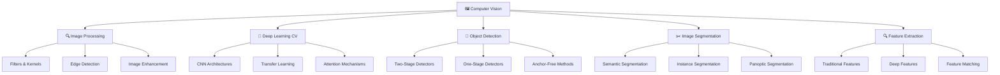

# 🖼️ Computer Vision nâng cao

> **Mục tiêu**: Hiểu sâu về Computer Vision từ lý thuyết đến triển khai thực tế

## 📋 Tổng quan nội dung



## 📚 **1. Bảng ký hiệu (Notation)**

### **Image & Pixel:**
- **Image**: $\mathbf{I} \in \mathbb{R}^{H \times W \times C}$ (Height × Width × Channels)
- **Pixel**: $I(i,j)$ hoặc $I_{i,j}$ (pixel tại vị trí i,j)
- **Kernel/Filter**: $\mathbf{K} \in \mathbb{R}^{k \times k}$ (kernel size k×k)
- **Feature map**: $\mathbf{F} \in \mathbb{R}^{H' \times W' \times D}$ (D channels)

### **Convolution & Operations:**
- **Convolution**: $(\mathbf{I} * \mathbf{K})(i,j) = \sum_{m,n} \mathbf{I}(i-m, j-n) \mathbf{K}(m,n)$
- **Cross-correlation**: $(\mathbf{I} \star \mathbf{K})(i,j) = \sum_{m,n} \mathbf{I}(i+m, j+n) \mathbf{K}(m,n)$
- **Pooling**: $\text{pool}(\mathbf{I}) = \max_{(i,j) \in \mathcal{R}} \mathbf{I}(i,j)$

### **Neural Networks:**
- **Weight matrix**: $\mathbf{W} \in \mathbb{R}^{d_{in} \times d_{out}}$
- **Bias**: $\mathbf{b} \in \mathbb{R}^{d_{out}}$
- **Activation**: $\sigma(\mathbf{z}) = \max(0, \mathbf{z})$ (ReLU)
- **Loss**: $\mathcal{L}(\mathbf{y}, \hat{\mathbf{y}})$

### **Detection & Segmentation:**
- **Bounding box**: $\mathbf{b} = [x, y, w, h]$ (center, width, height)
- **Confidence score**: $s \in [0,1]$
- **Class probability**: $P(c|\mathbf{x})$
- **IoU**: $\text{IoU} = \frac{\text{Area of Intersection}}{\text{Area of Union}}$

## 📖 **2. Glossary (Định nghĩa cốt lõi)**

### **Image Processing:**
- **Convolution**: Phép toán lọc ảnh bằng kernel, tính tổng có trọng số
- **Filter**: Ma trận nhỏ dùng để lọc ảnh (blur, sharpen, edge detection)
- **Edge**: Ranh giới giữa các vùng có độ sáng khác nhau
- **Gradient**: Độ thay đổi của pixel theo hướng x, y

### **Deep Learning CV:**
- **CNN**: Convolutional Neural Network, mạng nơ-ron chuyên xử lý ảnh
- **Feature map**: Kết quả sau khi áp dụng convolution layer
- **Pooling**: Giảm kích thước feature map (max, average, global)
- **Transfer learning**: Sử dụng pre-trained model cho task mới

### **Object Detection:**
- **Bounding box**: Hộp chữ nhật bao quanh object
- **Anchor**: Box mẫu dùng để dự đoán object
- **NMS**: Non-Maximum Suppression, loại bỏ box trùng lặp
- **mAP**: mean Average Precision, metric đánh giá detection

### **Segmentation:**
- **Semantic segmentation**: Phân loại từng pixel theo class
- **Instance segmentation**: Phân biệt từng instance của cùng class
- **Mask**: Ma trận nhị phân chỉ ra vùng thuộc object
- **Dice loss**: Loss function cho segmentation

## 🧩 Chương trình 50/50 (Lý thuyết : Thực hành)

| Mô-đun | Lý thuyết (50%) | Thực hành (50%) |
|---|---|---|
| Image Processing | Filters, Edge detection | OpenCV implementation |
| CNN Architectures | ResNet, VGG, EfficientNet | Model training & evaluation |
| Object Detection | R-CNN, YOLO, SSD | Custom detector training |
| Segmentation | U-Net, Mask R-CNN | Medical image segmentation |

---

## 🔍 **3. Thẻ thuật toán - Convolution**

### **1. Bài toán & dữ liệu:**
- **Bài toán**: Lọc ảnh để trích xuất features
- **Dữ liệu**: Image $\mathbf{I} \in \mathbb{R}^{H \times W \times C}$, Kernel $\mathbf{K} \in \mathbb{R}^{k \times k}$
- **Ứng dụng**: Edge detection, blur, sharpen, feature extraction

### **2. Mô hình & công thức:**
$$(\mathbf{I} * \mathbf{K})(i,j) = \sum_{m=-\frac{k-1}{2}}^{\frac{k-1}{2}} \sum_{n=-\frac{k-1}{2}}^{\frac{k-1}{2}} \mathbf{I}(i-m, j-n) \mathbf{K}(m,n)$$

Trong đó:
- $*$: Convolution operator
- $k$: Kernel size (thường 3×3, 5×5)
- $(i,j)$: Vị trí pixel output

### **3. Loss & mục tiêu:**
- **Mục tiêu**: Trích xuất features có ý nghĩa từ ảnh
- **Loss**: Không có loss riêng, là component của CNN

### **4. Tối ưu hoá & cập nhật:**
- **Algorithm**: Sliding window convolution
- **Cập nhật**: Không có parameter learning, chỉ là phép toán

### **5. Hyperparams:**
- **Kernel size**: $k$ (3, 5, 7, ...)
- **Stride**: Bước nhảy của sliding window
- **Padding**: Số pixel thêm vào biên ảnh

### **6. Độ phức tạp:**
- **Time**: $O(H \times W \times k^2)$ cho mỗi channel
- **Space**: $O(H \times W)$ cho output

### **7. Metrics đánh giá:**
- **Feature quality**: Subjective evaluation
- **Computational efficiency**: FLOPs, memory usage
- **Output size**: $(H - k + 1) \times (W - k + 1)$

### **8. Ưu / Nhược:**
**Ưu điểm:**
- Trích xuất local features hiệu quả
- Translation invariant
- Parameter sharing giảm overfitting

**Nhược điểm:**
- Không rotation invariant
- Computational cost cao với kernel lớn
- Mất thông tin biên ảnh

### **9. Bẫy & mẹo:**
- **Bẫy**: Quên padding → output size nhỏ hơn input
- **Bẫy**: Kernel size quá lớn → mất fine details
- **Mẹo**: Dùng separable convolution để giảm computation
- **Mẹo**: Pre-compute kernel nếu dùng nhiều lần

### **10. Pseudocode:**
```python
def convolution_2d(image, kernel):
    # Get dimensions
    H, W = image.shape
    k = kernel.shape[0]
    pad = k // 2
    
    # Pad image
    padded = np.pad(image, pad, mode='constant')
    
    # Initialize output
    output = np.zeros((H, W))
    
    # Apply convolution
    for i in range(H):
        for j in range(W):
            # Extract patch
            patch = padded[i:i+k, j:j+k]
            # Compute convolution
            output[i, j] = np.sum(patch * kernel)
    
    return output
```

### **11. Code mẫu:**
```python
import numpy as np
import cv2
import matplotlib.pyplot as plt

def convolution_2d(image, kernel):
    """2D convolution implementation"""
    # Get image and kernel dimensions
    img_h, img_w = image.shape
    kernel_h, kernel_w = kernel.shape
    
    # Calculate padding
    pad_h = kernel_h // 2
    pad_w = kernel_w // 2
    
    # Pad image
    padded = np.pad(image, ((pad_h, pad_h), (pad_w, pad_w)), mode='constant')
    
    # Initialize output
    output = np.zeros_like(image)
    
    # Apply convolution
    for i in range(img_h):
        for j in range(img_w):
            output[i, j] = np.sum(padded[i:i+kernel_h, j:j+kernel_w] * kernel)
    
    return output

def demonstrate_filters():
    """Demonstrate different filters"""
    
    # Create sample image
    image = np.random.randn(100, 100)
    
    # Different kernels
    kernels = {
        'Identity': np.array([[0, 0, 0], [0, 1, 0], [0, 0, 0]]),
        'Blur': np.array([[1, 1, 1], [1, 1, 1], [1, 1, 1]]) / 9,
        'Sharpen': np.array([[0, -1, 0], [-1, 5, -1], [0, -1, 0]]),
        'Edge Detection': np.array([[-1, -1, -1], [-1, 8, -1], [-1, -1, -1]])
    }
    
    results = {}
    for name, kernel in kernels.items():
        results[name] = convolution_2d(image, kernel)
    
    return results
```

### **12. Checklist kiểm tra nhanh:**
- [ ] Kernel size có phù hợp?
- [ ] Padding có được tính đúng?
- [ ] Output size có đúng?
- [ ] Convolution có được tính chính xác?
- [ ] Performance có acceptable?

---

## 🧠 **4. Thẻ thuật toán - ResNet**

### **1. Bài toán & dữ liệu:**
- **Bài toán**: Image classification với deep network
- **Dữ liệu**: Image dataset với labels (ImageNet, CIFAR, etc.)
- **Ứng dụng**: Image classification, feature extraction, transfer learning

### **2. Mô hình & công thức:**
**Residual Block:**
$$\mathbf{x}_{l+1} = \mathbf{x}_l + \mathcal{F}(\mathbf{x}_l, \mathbf{W}_l)$$

Trong đó:
- $\mathbf{x}_l$: Input của layer $l$
- $\mathcal{F}(\mathbf{x}_l, \mathbf{W}_l)$: Residual function
- $\mathbf{W}_l$: Weights của layer $l$

### **3. Loss & mục tiêu:**
- **Mục tiêu**: $\min_{\mathbf{W}} \mathcal{L}(\mathbf{y}, f(\mathbf{x}; \mathbf{W}))$
- **Loss**: Cross-entropy loss cho classification

### **4. Tối ưu hoá & cập nhật:**
- **Algorithm**: SGD/Adam với backpropagation
- **Cập nhật**: $\mathbf{W} \leftarrow \mathbf{W} - \alpha \nabla_{\mathbf{W}} \mathcal{L}$

### **5. Hyperparams:**
- **Learning rate**: $\alpha$ (thường 0.01 - 0.001)
- **Batch size**: 32, 64, 128, 256
- **Optimizer**: SGD, Adam, AdamW
- **Weight decay**: Regularization parameter

### **6. Độ phức tạp:**
- **Time**: $O(n \times \text{layers} \times \text{parameters})$
- **Space**: $O(\text{parameters})$ cho model + $O(\text{batch_size} \times \text{features})$ cho activations

### **7. Metrics đánh giá:**
- **Top-1 Accuracy**: Tỷ lệ dự đoán đúng class đầu tiên
- **Top-5 Accuracy**: Tỷ lệ đúng class trong top 5
- **Training/Validation loss**: Convergence monitoring

### **8. Ưu / Nhược:**
**Ưu điểm:**
- Giải quyết vanishing gradient problem
- Dễ train deep networks
- SOTA performance trên nhiều tasks

**Nhược điểm:**
- Computational cost cao
- Memory usage lớn
- Cần nhiều data để train

### **9. Bẫy & mẹo:**
- **Bẫy**: Learning rate quá cao → divergence
- **Bẫy**: Batch size quá lớn → out of memory
- **Mẹo**: Dùng pre-trained weights
- **Mẹo**: Freeze early layers cho transfer learning

### **10. Pseudocode:**
```python
class ResidualBlock:
    def __init__(self, in_channels, out_channels, stride=1):
        self.conv1 = Conv2d(in_channels, out_channels, 3, stride, 1)
        self.bn1 = BatchNorm2d(out_channels)
        self.conv2 = Conv2d(out_channels, out_channels, 3, 1, 1)
        self.bn2 = BatchNorm2d(out_channels)
        
        # Shortcut connection
        self.shortcut = Sequential()
        if stride != 1 or in_channels != out_channels:
            self.shortcut = Sequential(
                Conv2d(in_channels, out_channels, 1, stride),
                BatchNorm2d(out_channels)
            )
    
    def forward(self, x):
        residual = self.shortcut(x)
        
        out = relu(self.bn1(self.conv1(x)))
        out = self.bn2(self.conv2(out))
        out += residual
        out = relu(out)
        
        return out
```

### **11. Code mẫu:**
```python
import torch
import torch.nn as nn

class ResidualBlock(nn.Module):
    """Residual block for ResNet"""
    def __init__(self, in_channels, out_channels, stride=1):
        super().__init__()
        
        self.conv1 = nn.Conv2d(in_channels, out_channels, 3, stride, 1)
        self.bn1 = nn.BatchNorm2d(out_channels)
        self.conv2 = nn.Conv2d(out_channels, out_channels, 3, 1, 1)
        self.bn2 = nn.BatchNorm2d(out_channels)
        
        # Shortcut connection
        self.shortcut = nn.Sequential()
        if stride != 1 or in_channels != out_channels:
            self.shortcut = nn.Sequential(
                nn.Conv2d(in_channels, out_channels, 1, stride),
                nn.BatchNorm2d(out_channels)
            )
    
    def forward(self, x):
        residual = self.shortcut(x)
        
        out = torch.relu(self.bn1(self.conv1(x)))
        out = self.bn2(self.conv2(out))
        out += residual
        out = torch.relu(out)
        
        return out

class ResNet(nn.Module):
    """ResNet implementation"""
    def __init__(self, num_blocks, num_classes=1000):
        super().__init__()
        
        self.in_channels = 64
        self.conv1 = nn.Conv2d(3, 64, 7, 2, 3)
        self.bn1 = nn.BatchNorm2d(64)
        self.maxpool = nn.MaxPool2d(3, 2, 1)
        
        # ResNet layers
        self.layer1 = self._make_layer(64, num_blocks[0], 1)
        self.layer2 = self._make_layer(128, num_blocks[1], 2)
        self.layer3 = self._make_layer(256, num_blocks[2], 2)
        self.layer4 = self._make_layer(512, num_blocks[3], 2)
        
        self.avgpool = nn.AdaptiveAvgPool2d((1, 1))
        self.fc = nn.Linear(512, num_classes)
    
    def _make_layer(self, out_channels, num_blocks, stride):
        layers = []
        layers.append(ResidualBlock(self.in_channels, out_channels, stride))
        self.in_channels = out_channels
        
        for _ in range(1, num_blocks):
            layers.append(ResidualBlock(out_channels, out_channels))
        
        return nn.Sequential(*layers)
    
    def forward(self, x):
        x = torch.relu(self.bn1(self.conv1(x)))
        x = self.maxpool(x)
        
        x = self.layer1(x)
        x = self.layer2(x)
        x = self.layer3(x)
        x = self.layer4(x)
        
        x = self.avgpool(x)
        x = x.view(x.size(0), -1)
        x = self.fc(x)
        
        return x

def create_resnet18():
    """Create ResNet-18 model"""
    return ResNet([2, 2, 2, 2])
```

### **12. Checklist kiểm tra nhanh:**
- [ ] Model architecture có đúng?
- [ ] Residual connections có được implement?
- [ ] Batch normalization có được apply?
- [ ] Learning rate có phù hợp?
- [ ] Training có converge?

---

## 🎯 **5. Thẻ thuật toán - YOLO**

### **1. Bài toán & dữ liệu:**
- **Bài toán**: Real-time object detection
- **Dữ liệu**: Image với bounding box annotations
- **Ứng dụng**: Real-time detection, surveillance, autonomous driving

### **2. Mô hình & công thức:**
**YOLO v3 Output:**
$$\mathbf{y} = [x, y, w, h, \text{conf}, \text{class}_1, \text{class}_2, \ldots, \text{class}_C]$$

Trong đó:
- $(x,y)$: Center coordinates (normalized)
- $(w,h)$: Width and height (normalized)
- $\text{conf}$: Confidence score
- $\text{class}_i$: Class probabilities

### **3. Loss & mục tiêu:**
- **Mục tiêu**: $\min_{\mathbf{W}} \mathcal{L}_{\text{total}}$
- **Loss**: $\mathcal{L}_{\text{total}} = \mathcal{L}_{\text{coord}} + \mathcal{L}_{\text{conf}} + \mathcal{L}_{\text{class}}$

### **4. Tối ưu hoá & cập nhật:**
- **Algorithm**: SGD/Adam với backpropagation
- **Cập nhật**: $\mathbf{W} \leftarrow \mathbf{W} - \alpha \nabla_{\mathbf{W}} \mathcal{L}_{\text{total}}$

### **5. Hyperparams:**
- **Learning rate**: $\alpha$ (thường 0.001)
- **Batch size**: 16, 32, 64
- **Anchor boxes**: Pre-defined box sizes
- **Confidence threshold**: 0.5

### **6. Độ phức tạp:**
- **Time**: $O(H \times W \times \text{anchors} \times \text{classes})$
- **Space**: $O(\text{parameters})$ cho model

### **7. Metrics đánh giá:**
- **mAP**: mean Average Precision
- **Precision**: $\frac{TP}{TP + FP}$
- **Recall**: $\frac{TP}{TP + FN}$
- **FPS**: Frames per second

### **8. Ưu / Nhược:**
**Ưu điểm:**
- Real-time detection
- End-to-end training
- Good performance-speed trade-off

**Nhược điểm:**
- Struggles with small objects
- Limited to grid-based predictions
- Requires careful anchor tuning

### **9. Bẫy & mẹo:**
- **Bẫy**: Anchor boxes không phù hợp với dataset
- **Bẫy**: Confidence threshold quá cao/thấp
- **Mẹo**: Dùng multi-scale training
- **Mẹo**: Data augmentation cho small objects

### **10. Pseudocode:**
```python
def yolo_forward(x, anchors, num_classes):
    # 1. Extract features
    features = backbone(x)
    
    # 2. Apply detection heads
    predictions = []
    for feature_map in features:
        # Predict bounding boxes
        boxes = conv_layer(feature_map)
        # Reshape to [batch, anchors, grid_h, grid_w, 5+num_classes]
        boxes = boxes.view(batch, anchors, grid_h, grid_w, -1)
        predictions.append(boxes)
    
    # 3. Post-process predictions
    detections = post_process(predictions, anchors)
    
    return detections
```

### **11. Code mẫu:**
```python
class YOLOLayer(nn.Module):
    """YOLO detection layer"""
    def __init__(self, anchors, num_classes, img_size):
        super().__init__()
        self.anchors = anchors
        self.num_anchors = len(anchors)
        self.num_classes = num_classes
        self.img_size = img_size
        
        self.mse_loss = nn.MSELoss()
        self.bce_loss = nn.BCELoss()
        self.ignore_thres = 0.5
        self.obj_scale = 1
        self.noobj_scale = 100
        self.metrics = {}
        self.metrics['loss'] = 0
        self.metrics['x'] = 0
        self.metrics['y'] = 0
        self.metrics['w'] = 0
        self.metrics['h'] = 0
        self.metrics['conf'] = 0
        self.metrics['cls'] = 0
        self.metrics['cls_acc'] = 0
        self.metrics['recall50'] = 0
        self.metrics['recall75'] = 0
        self.metrics['precision'] = 0
    
    def forward(self, x, targets=None):
        num_batches = x.size(0)
        grid_size = x.size(2)
        
        prediction = x.view(num_batches, self.num_anchors,
                           self.num_classes + 5, grid_size, grid_size)
        prediction = prediction.permute(0, 1, 3, 4, 2).contiguous()
        
        # Get outputs
        x = torch.sigmoid(prediction[..., 0])  # Center x
        y = torch.sigmoid(prediction[..., 1])  # Center y
        w = prediction[..., 2]  # Width
        h = prediction[..., 3]  # Height
        pred_conf = torch.sigmoid(prediction[..., 4])  # Conf
        pred_cls = torch.sigmoid(prediction[..., 5:])  # Cls pred
        
        # If grid size does not match current grid size
        if grid_size != self.grid_size:
            self.grid_size = grid_size
            self.grid_x = torch.arange(grid_size).repeat(grid_size, 1).view([1, 1, grid_size, grid_size]).type(torch.FloatTensor)
            self.grid_y = torch.arange(grid_size).repeat(grid_size, 1).t().contiguous().view([1, 1, grid_size, grid_size]).type(torch.FloatTensor)
            self.scaled_anchors = torch.FloatTensor([(a_w / self.stride, a_h / self.stride) for a_w, a_h in self.anchors])
            self.anchor_w = self.scaled_anchors[:, 0:1].view((1, self.num_anchors, 1, 1))
            self.anchor_h = self.scaled_anchors[:, 1:2].view((1, self.num_anchors, 1, 1))
        
        # Add offset and scale with anchors
        pred_boxes = torch.FloatTensor(prediction[..., :4].shape)
        pred_boxes[..., 0] = x.data + self.grid_x
        pred_boxes[..., 1] = y.data + self.grid_y
        pred_boxes[..., 2] = torch.exp(w.data) * self.anchor_w
        pred_boxes[..., 3] = torch.exp(h.data) * self.anchor_h
        
        output = torch.cat((pred_boxes.view(num_batches, -1, 4) / self.img_size,
                          pred_conf.view(num_batches, -1, 1), pred_cls.view(num_batches, -1, self.num_classes)), -1)
        
        if targets is not None:
            return output, self.compute_loss(output, targets)
        else:
            return output
    
    def compute_loss(self, predictions, targets):
        # Loss computation implementation
        # This is a simplified version
        obj_mask = targets[..., 4] > 0
        noobj_mask = targets[..., 4] == 0
        
        loss = 0
        if obj_mask.sum() > 0:
            loss += self.mse_loss(predictions[obj_mask, :2], targets[obj_mask, :2])
            loss += self.mse_loss(predictions[obj_mask, 2:4], targets[obj_mask, 2:4])
            loss += self.bce_loss(predictions[obj_mask, 4], targets[obj_mask, 4])
        
        if noobj_mask.sum() > 0:
            loss += self.bce_loss(predictions[noobj_mask, 4], targets[noobj_mask, 4])
        
        return loss
```

### **12. Checklist kiểm tra nhanh:**
- [ ] Model architecture có đúng?
- [ ] Anchor boxes có phù hợp?
- [ ] Loss function có được implement?
- [ ] Post-processing có đúng?
- [ ] mAP có improve?

---

## ✂️ **6. Thẻ thuật toán - U-Net**

### **1. Bài toán & dữ liệu:**
- **Bài toán**: Image segmentation với pixel-level classification
- **Dữ liệu**: Image với pixel-wise labels (medical images, satellite images)
- **Ứng dụng**: Medical image segmentation, autonomous driving, satellite imagery

### **2. Mô hình & công thức:**
**U-Net Architecture:**
$$\mathbf{x}_{l+1} = \text{Up}(\mathbf{x}_l) \oplus \text{Skip}(\mathbf{x}_{l-1})$$

Trong đó:
- $\text{Up}(\cdot)$: Upsampling operation
- $\text{Skip}(\cdot)$: Skip connection từ encoder
- $\oplus$: Concatenation operation

### **3. Loss & mục tiêu:**
- **Mục tiêu**: $\min_{\mathbf{W}} \mathcal{L}(\mathbf{y}, f(\mathbf{x}; \mathbf{W}))$
- **Loss**: Dice loss, BCE loss, hoặc combination

### **4. Tối ưu hoá & cập nhật:**
- **Algorithm**: SGD/Adam với backpropagation
- **Cập nhật**: $\mathbf{W} \leftarrow \mathbf{W} - \alpha \nabla_{\mathbf{W}} \mathcal{L}$

### **5. Hyperparams:**
- **Learning rate**: $\alpha$ (thường 0.001)
- **Batch size**: 1, 2, 4 (memory constraint)
- **Loss function**: Dice, BCE, Focal loss
- **Data augmentation**: Rotation, scaling, flipping

### **6. Độ phức tạp:**
- **Time**: $O(H \times W \times \text{channels} \times \text{depth})$
- **Space**: $O(H \times W \times \text{features})$ cho activations

### **7. Metrics đánh giá:**
- **IoU**: Intersection over Union
- **Dice coefficient**: $\frac{2|A \cap B|}{|A| + |B|}$
- **Pixel accuracy**: $\frac{\text{Correct pixels}}{\text{Total pixels}}$
- **Precision/Recall**: Per-class metrics

### **8. Ưu / Nhược:**
**Ưu điểm:**
- Skip connections giúp preserve spatial information
- Works well với limited data
- Good for medical imaging

**Nhược điểm:**
- Memory intensive
- Slow training với large images
- Requires careful data preprocessing

### **9. Bẫy & mẹo:**
- **Bẫy**: Class imbalance → poor performance
- **Bẫy**: Memory issues với large images
- **Mẹo**: Dùng data augmentation
- **Mẹo**: Implement Dice loss

### **10. Pseudocode:**
```python
class UNet(nn.Module):
    def __init__(self, in_channels, out_channels):
        # Encoder
        self.enc1 = DoubleConv(in_channels, 64)
        self.enc2 = DoubleConv(64, 128)
        self.enc3 = DoubleConv(128, 256)
        self.enc4 = DoubleConv(256, 512)
        
        # Bottleneck
        self.bottleneck = DoubleConv(512, 1024)
        
        # Decoder
        self.up4 = ConvTranspose2d(1024, 512, 2, 2)
        self.dec4 = DoubleConv(1024, 512)
        # ... more decoder layers
    
    def forward(self, x):
        # Encoder path
        enc1 = self.enc1(x)
        enc2 = self.enc2(maxpool(enc1))
        enc3 = self.enc3(maxpool(enc2))
        enc4 = self.enc4(maxpool(enc3))
        
        # Bottleneck
        bottleneck = self.bottleneck(maxpool(enc4))
        
        # Decoder path with skip connections
        dec4 = self.up4(bottleneck)
        dec4 = concat(dec4, enc4)
        dec4 = self.dec4(dec4)
        # ... continue decoder
        
        return final_conv(dec1)
```

### **11. Code mẫu:**
```python
class DoubleConv(nn.Module):
    """Double convolution block"""
    def __init__(self, in_channels, out_channels):
        super().__init__()
        self.double_conv = nn.Sequential(
            nn.Conv2d(in_channels, out_channels, 3, padding=1),
            nn.BatchNorm2d(out_channels),
            nn.ReLU(inplace=True),
            nn.Conv2d(out_channels, out_channels, 3, padding=1),
            nn.BatchNorm2d(out_channels),
            nn.ReLU(inplace=True)
        )
    
    def forward(self, x):
        return self.double_conv(x)

class UNet(nn.Module):
    """U-Net architecture for image segmentation"""
    def __init__(self, in_channels=3, out_channels=1):
        super().__init__()
        
        # Encoder
        self.enc1 = DoubleConv(in_channels, 64)
        self.enc2 = DoubleConv(64, 128)
        self.enc3 = DoubleConv(128, 256)
        self.enc4 = DoubleConv(256, 512)
        
        # Bottleneck
        self.bottleneck = DoubleConv(512, 1024)
        
        # Decoder
        self.up4 = nn.ConvTranspose2d(1024, 512, 2, stride=2)
        self.dec4 = DoubleConv(1024, 512)
        
        self.up3 = nn.ConvTranspose2d(512, 256, 2, stride=2)
        self.dec3 = DoubleConv(512, 256)
        
        self.up2 = nn.ConvTranspose2d(256, 128, 2, stride=2)
        self.dec2 = DoubleConv(256, 128)
        
        self.up1 = nn.ConvTranspose2d(128, 64, 2, stride=2)
        self.dec1 = DoubleConv(128, 64)
        
        # Final convolution
        self.final = nn.Conv2d(64, out_channels, 1)
    
    def forward(self, x):
        # Encoder
        enc1 = self.enc1(x)
        enc2 = self.enc2(nn.MaxPool2d(2)(enc1))
        enc3 = self.enc3(nn.MaxPool2d(2)(enc2))
        enc4 = self.enc4(nn.MaxPool2d(2)(enc3))
        
        # Bottleneck
        bottleneck = self.bottleneck(nn.MaxPool2d(2)(enc4))
        
        # Decoder with skip connections
        dec4 = self.up4(bottleneck)
        dec4 = torch.cat([dec4, enc4], dim=1)
        dec4 = self.dec4(dec4)
        
        dec3 = self.up3(dec4)
        dec3 = torch.cat([dec3, enc3], dim=1)
        dec3 = self.dec3(dec3)
        
        dec2 = self.up2(dec3)
        dec2 = torch.cat([dec2, enc2], dim=1)
        dec2 = self.dec2(dec2)
        
        dec1 = self.up1(dec2)
        dec1 = torch.cat([dec1, enc1], dim=1)
        dec1 = self.dec1(dec1)
        
        return torch.sigmoid(self.final(dec1))
```

### **12. Checklist kiểm tra nhanh:**
- [ ] Skip connections có được implement?
- [ ] Loss function có phù hợp?
- [ ] Data preprocessing có đúng?
- [ ] Memory usage có acceptable?
- [ ] IoU có improve?

---

## 🧪 **7. Thực hành & Ứng dụng**

### **7.1 Image Classification Pipeline**

```python
def image_classification_pipeline():
    """Complete image classification pipeline"""
    
    # Load model
    model = create_resnet18()
    model.eval()
    
    # Preprocessing
    transform = transforms.Compose([
        transforms.Resize(256),
        transforms.CenterCrop(224),
        transforms.ToTensor(),
        transforms.Normalize(mean=[0.485, 0.456, 0.406],
                           std=[0.229, 0.224, 0.225])
    ])
    
    def predict_image(image_path):
        # Load and preprocess image
        image = Image.open(image_path).convert('RGB')
        image_tensor = transform(image).unsqueeze(0)
        
        # Predict
        with torch.no_grad():
            output = model(image_tensor)
            probabilities = torch.softmax(output, dim=1)
            predicted_class = torch.argmax(probabilities, dim=1)
        
        return predicted_class.item(), probabilities[0]
    
    return predict_image
```

### **7.2 Object Detection Pipeline**

```python
def object_detection_pipeline():
    """Object detection pipeline with YOLO"""
    
    def detect_objects(image, model, conf_threshold=0.5, nms_threshold=0.4):
        # Preprocess image
        input_tensor = preprocess_image(image)
        
        # Run inference
        with torch.no_grad():
            predictions = model(input_tensor)
        
        # Post-process predictions
        boxes, scores, class_ids = postprocess_predictions(predictions, conf_threshold)
        
        # Apply NMS
        keep_indices = non_maximum_suppression(boxes, scores, nms_threshold)
        
        return boxes[keep_indices], scores[keep_indices], class_ids[keep_indices]
    
    return detect_objects
```

---

## 📚 **Tài liệu tham khảo**

### **Sách giáo khoa:**
- [Computer Vision: Algorithms and Applications](https://szeliski.org/Book/) - Richard Szeliski
- [Deep Learning for Computer Vision](https://www.pyimagesearch.com/deep-learning-computer-vision-python-book/) - Adrian Rosebrock
- [Learning OpenCV](https://opencv.org/books/) - Gary Bradski

### **Papers quan trọng:**
- [YOLO v3](https://arxiv.org/abs/1804.02767) - Redmon & Farhadi
- [U-Net](https://arxiv.org/abs/1505.04597) - Ronneberger et al.
- [ResNet](https://arxiv.org/abs/1512.03385) - He et al.

### **Online Resources:**
- [OpenCV Documentation](https://docs.opencv.org/)
- [PyTorch Vision Tutorials](https://pytorch.org/vision/stable/index.html)
- [TensorFlow Object Detection](https://tensorflow-object-detection-api-tutorial.readthedocs.io/)

---

## 🎯 **Bài tập thực hành**

### **Bài tập 1: Image Filtering**
1. Implement Gaussian, Sobel, and Laplacian filters
2. Apply filters to detect edges in images
3. Compare results with OpenCV implementations

### **Bài tập 2: CNN Training**
1. Train ResNet on custom dataset
2. Implement data augmentation
3. Analyze model performance and confusion matrix

### **Bài tập 3: Object Detection**
1. Fine-tune YOLO on custom dataset
2. Implement custom loss function
3. Evaluate mAP and IoU metrics

### **Bài tập 4: Image Segmentation**
1. Train U-Net for medical image segmentation
2. Implement Dice loss and IoU metrics
3. Visualize segmentation results

---

## 🎓 **Cách học hiệu quả**

### **Bước 1: Đọc công thức → tra ký hiệu → hiểu trực giác**
- Đọc công thức toán học (convolution, loss functions)
- Tra cứu bảng ký hiệu để hiểu từng thành phần
- Tìm hiểu ý nghĩa trực giác của các phép toán

### **Bước 2: Điền "Thẻ thuật toán" cho từng mô hình**
- Hoàn thành 12 mục trong thẻ thuật toán cho mỗi algorithm
- Viết pseudocode và code mẫu
- Kiểm tra checklist

### **Bước 3: Làm Lab nhỏ → Mini-project → Case study**
- Bắt đầu với lab đơn giản (image filtering)
- Tiến tới mini-project phức tạp hơn (CNN training)
- Áp dụng vào case study thực tế (medical imaging)

### **Bước 4: Đánh giá bằng metric phù hợp**
- Chọn metric đánh giá phù hợp với bài toán (accuracy, mAP, IoU)
- So sánh với baseline
- Phân tích kết quả và visualize

---

*Chúc bạn học tập hiệu quả! 🚀*

## 🔍 1. Image Processing cơ bản

### 1.1 Convolution & Filters

**Convolution operation:**
```python
import numpy as np
import cv2
import matplotlib.pyplot as plt

def convolution_2d(image, kernel):
    """2D convolution implementation"""
    # Get image and kernel dimensions
    img_h, img_w = image.shape
    kernel_h, kernel_w = kernel.shape
    
    # Calculate padding
    pad_h = kernel_h // 2
    pad_w = kernel_w // 2
    
    # Pad image
    padded = np.pad(image, ((pad_h, pad_h), (pad_w, pad_w)), mode='constant')
    
    # Initialize output
    output = np.zeros_like(image)
    
    # Apply convolution
    for i in range(img_h):
        for j in range(img_w):
            output[i, j] = np.sum(padded[i:i+kernel_h, j:j+kernel_w] * kernel)
    
    return output

def demonstrate_filters():
    """Demonstrate different filters"""
    
    # Create sample image
    image = np.random.randn(100, 100)
    
    # Different kernels
    kernels = {
        'Identity': np.array([[0, 0, 0], [0, 1, 0], [0, 0, 0]]),
        'Blur': np.array([[1, 1, 1], [1, 1, 1], [1, 1, 1]]) / 9,
        'Sharpen': np.array([[0, -1, 0], [-1, 5, -1], [0, -1, 0]]),
        'Edge Detection': np.array([[-1, -1, -1], [-1, 8, -1], [-1, -1, -1]])
    }
    
    results = {}
    for name, kernel in kernels.items():
        results[name] = convolution_2d(image, kernel)
    
    return results
```

### 1.2 Edge Detection

**Canny Edge Detection:**
```python
def canny_edge_detection(image, low_threshold=50, high_threshold=150):
    """Canny edge detection implementation"""
    
    # 1. Gaussian blur
    blurred = cv2.GaussianBlur(image, (5, 5), 0)
    
    # 2. Gradient calculation
    grad_x = cv2.Sobel(blurred, cv2.CV_64F, 1, 0, ksize=3)
    grad_y = cv2.Sobel(blurred, cv2.CV_64F, 0, 1, ksize=3)
    
    # 3. Gradient magnitude and direction
    magnitude = np.sqrt(grad_x**2 + grad_y**2)
    direction = np.arctan2(grad_y, grad_x)
    
    # 4. Non-maximum suppression
    def non_maximum_suppression(mag, dir):
        h, w = mag.shape
        suppressed = np.zeros_like(mag)
        
        for i in range(1, h-1):
            for j in range(1, w-1):
                # Quantize direction to 0, 45, 90, 135 degrees
                angle = dir[i, j] * 180 / np.pi
                if angle < 0:
                    angle += 180
                
                # Determine neighbors to compare
                if 0 <= angle < 22.5 or 157.5 <= angle <= 180:
                    neighbors = [mag[i, j-1], mag[i, j+1]]
                elif 22.5 <= angle < 67.5:
                    neighbors = [mag[i-1, j-1], mag[i+1, j+1]]
                elif 67.5 <= angle < 112.5:
                    neighbors = [mag[i-1, j], mag[i+1, j]]
                else:
                    neighbors = [mag[i-1, j+1], mag[i+1, j-1]]
                
                # Suppress if not maximum
                if mag[i, j] >= max(neighbors):
                    suppressed[i, j] = mag[i, j]
        
        return suppressed
    
    # Apply non-maximum suppression
    suppressed = non_maximum_suppression(magnitude, direction)
    
    # 5. Double thresholding
    strong_edges = suppressed > high_threshold
    weak_edges = (suppressed >= low_threshold) & (suppressed <= high_threshold)
    
    # 6. Edge tracking by hysteresis
    def hysteresis(strong, weak):
        h, w = strong.shape
        result = strong.copy()
        
        # Find strong edge pixels
        strong_coords = np.where(strong)
        
        for i, j in zip(strong_coords[0], strong_coords[1]):
            # Check 8-connected neighbors
            for di in [-1, 0, 1]:
                for dj in [-1, 0, 1]:
                    ni, nj = i + di, j + dj
                    if (0 <= ni < h and 0 <= nj < w and 
                        weak[ni, nj] and not result[ni, nj]):
                        result[ni, nj] = True
        
        return result
    
    edges = hysteresis(strong_edges, weak_edges)
    
    return edges
```

---

## 🧠 2. Deep Learning cho Computer Vision

### 2.1 CNN Architectures

**ResNet implementation:**
```python
import torch
import torch.nn as nn

class ResidualBlock(nn.Module):
    """Residual block for ResNet"""
    def __init__(self, in_channels, out_channels, stride=1):
        super().__init__()
        
        self.conv1 = nn.Conv2d(in_channels, out_channels, 3, stride, 1)
        self.bn1 = nn.BatchNorm2d(out_channels)
        self.conv2 = nn.Conv2d(out_channels, out_channels, 3, 1, 1)
        self.bn2 = nn.BatchNorm2d(out_channels)
        
        # Shortcut connection
        self.shortcut = nn.Sequential()
        if stride != 1 or in_channels != out_channels:
            self.shortcut = nn.Sequential(
                nn.Conv2d(in_channels, out_channels, 1, stride),
                nn.BatchNorm2d(out_channels)
            )
    
    def forward(self, x):
        residual = self.shortcut(x)
        
        out = torch.relu(self.bn1(self.conv1(x)))
        out = self.bn2(self.conv2(out))
        out += residual
        out = torch.relu(out)
        
        return out

class ResNet(nn.Module):
    """ResNet implementation"""
    def __init__(self, num_blocks, num_classes=1000):
        super().__init__()
        
        self.in_channels = 64
        self.conv1 = nn.Conv2d(3, 64, 7, 2, 3)
        self.bn1 = nn.BatchNorm2d(64)
        self.maxpool = nn.MaxPool2d(3, 2, 1)
        
        # ResNet layers
        self.layer1 = self._make_layer(64, num_blocks[0], 1)
        self.layer2 = self._make_layer(128, num_blocks[1], 2)
        self.layer3 = self._make_layer(256, num_blocks[2], 2)
        self.layer4 = self._make_layer(512, num_blocks[3], 2)
        
        self.avgpool = nn.AdaptiveAvgPool2d((1, 1))
        self.fc = nn.Linear(512, num_classes)
    
    def _make_layer(self, out_channels, num_blocks, stride):
        layers = []
        layers.append(ResidualBlock(self.in_channels, out_channels, stride))
        self.in_channels = out_channels
        
        for _ in range(1, num_blocks):
            layers.append(ResidualBlock(out_channels, out_channels))
        
        return nn.Sequential(*layers)
    
    def forward(self, x):
        x = torch.relu(self.bn1(self.conv1(x)))
        x = self.maxpool(x)
        
        x = self.layer1(x)
        x = self.layer2(x)
        x = self.layer3(x)
        x = self.layer4(x)
        
        x = self.avgpool(x)
        x = x.view(x.size(0), -1)
        x = self.fc(x)
        
        return x

def create_resnet18():
    """Create ResNet-18 model"""
    return ResNet([2, 2, 2, 2])
```

### 2.2 Transfer Learning

**Transfer learning implementation:**
```python
def transfer_learning_example():
    """Transfer learning with pre-trained model"""
    
    import torchvision.models as models
    import torchvision.transforms as transforms
    
    # Load pre-trained ResNet
    model = models.resnet18(pretrained=True)
    
    # Freeze early layers
    for param in model.parameters():
        param.requires_grad = False
    
    # Modify final layer for new task
    num_classes = 10
    model.fc = nn.Linear(model.fc.in_features, num_classes)
    
    # Data transforms
    transform = transforms.Compose([
        transforms.Resize(256),
        transforms.CenterCrop(224),
        transforms.ToTensor(),
        transforms.Normalize(mean=[0.485, 0.456, 0.406],
                           std=[0.229, 0.224, 0.225])
    ])
    
    return model, transform
```

---

## 🎯 3. Object Detection

### 3.1 YOLO Implementation

**YOLO v3 architecture:**
```python
class YOLOLayer(nn.Module):
    """YOLO detection layer"""
    def __init__(self, anchors, num_classes, img_size):
        super().__init__()
        self.anchors = anchors
        self.num_anchors = len(anchors)
        self.num_classes = num_classes
        self.img_size = img_size
        
        self.mse_loss = nn.MSELoss()
        self.bce_loss = nn.BCELoss()
        self.ignore_thres = 0.5
        self.obj_scale = 1
        self.noobj_scale = 100
        self.metrics = {}
        self.metrics['loss'] = 0
        self.metrics['x'] = 0
        self.metrics['y'] = 0
        self.metrics['w'] = 0
        self.metrics['h'] = 0
        self.metrics['conf'] = 0
        self.metrics['cls'] = 0
        self.metrics['cls_acc'] = 0
        self.metrics['recall50'] = 0
        self.metrics['recall75'] = 0
        self.metrics['precision'] = 0
    
    def forward(self, x, targets=None):
        num_batches = x.size(0)
        grid_size = x.size(2)
        
        prediction = x.view(num_batches, self.num_anchors,
                           self.num_classes + 5, grid_size, grid_size)
        prediction = prediction.permute(0, 1, 3, 4, 2).contiguous()
        
        # Get outputs
        x = torch.sigmoid(prediction[..., 0])  # Center x
        y = torch.sigmoid(prediction[..., 1])  # Center y
        w = prediction[..., 2]  # Width
        h = prediction[..., 3]  # Height
        pred_conf = torch.sigmoid(prediction[..., 4])  # Conf
        pred_cls = torch.sigmoid(prediction[..., 5:])  # Cls pred
        
        # If grid size does not match current grid size
        if grid_size != self.grid_size:
            self.grid_size = grid_size
            self.grid_x = torch.arange(grid_size).repeat(grid_size, 1).view([1, 1, grid_size, grid_size]).type(torch.FloatTensor)
            self.grid_y = torch.arange(grid_size).repeat(grid_size, 1).t().contiguous().view([1, 1, grid_size, grid_size]).type(torch.FloatTensor)
            self.scaled_anchors = torch.FloatTensor([(a_w / self.stride, a_h / self.stride) for a_w, a_h in self.anchors])
            self.anchor_w = self.scaled_anchors[:, 0:1].view((1, self.num_anchors, 1, 1))
            self.anchor_h = self.scaled_anchors[:, 1:2].view((1, self.num_anchors, 1, 1))
        
        # Add offset and scale with anchors
        pred_boxes = torch.FloatTensor(prediction[..., :4].shape)
        pred_boxes[..., 0] = x.data + self.grid_x
        pred_boxes[..., 1] = y.data + self.grid_y
        pred_boxes[..., 2] = torch.exp(w.data) * self.anchor_w
        pred_boxes[..., 3] = torch.exp(h.data) * self.anchor_h
        
        output = torch.cat((pred_boxes.view(num_batches, -1, 4) / self.img_size,
                          pred_conf.view(num_batches, -1, 1), pred_cls.view(num_batches, -1, self.num_classes)), -1)
        
        if targets is not None:
            return output, self.compute_loss(output, targets)
        else:
            return output
    
    def compute_loss(self, predictions, targets):
        # Loss computation implementation
        # This is a simplified version
        obj_mask = targets[..., 4] > 0
        noobj_mask = targets[..., 4] == 0
        
        loss = 0
        if obj_mask.sum() > 0:
            loss += self.mse_loss(predictions[obj_mask, :2], targets[obj_mask, :2])
            loss += self.mse_loss(predictions[obj_mask, 2:4], targets[obj_mask, 2:4])
            loss += self.bce_loss(predictions[obj_mask, 4], targets[obj_mask, 4])
        
        if noobj_mask.sum() > 0:
            loss += self.bce_loss(predictions[noobj_mask, 4], targets[noobj_mask, 4])
        
        return loss
```

### 3.2 Non-Maximum Suppression

**NMS implementation:**
```python
def non_maximum_suppression(boxes, scores, iou_threshold=0.5):
    """Non-maximum suppression for object detection"""
    
    def calculate_iou(box1, box2):
        """Calculate IoU between two boxes"""
        x1 = max(box1[0], box2[0])
        y1 = max(box1[1], box2[1])
        x2 = min(box1[2], box2[2])
        y2 = min(box1[3], box2[3])
        
        intersection = max(0, x2 - x1) * max(0, y2 - y1)
        area1 = (box1[2] - box1[0]) * (box1[3] - box1[1])
        area2 = (box2[2] - box2[0]) * (box2[3] - box2[1])
        union = area1 + area2 - intersection
        
        return intersection / union if union > 0 else 0
    
    # Sort by scores
    indices = np.argsort(scores)[::-1]
    keep = []
    
    while len(indices) > 0:
        # Pick the box with highest score
        current = indices[0]
        keep.append(current)
        
        if len(indices) == 1:
            break
        
        # Calculate IoU with remaining boxes
        remaining = indices[1:]
        ious = [calculate_iou(boxes[current], boxes[i]) for i in remaining]
        
        # Keep boxes with IoU below threshold
        indices = remaining[np.array(ious) < iou_threshold]
    
    return keep
```

---

## ✂️ 4. Image Segmentation

### 4.1 U-Net Architecture

**U-Net implementation:**
```python
class DoubleConv(nn.Module):
    """Double convolution block"""
    def __init__(self, in_channels, out_channels):
        super().__init__()
        self.double_conv = nn.Sequential(
            nn.Conv2d(in_channels, out_channels, 3, padding=1),
            nn.BatchNorm2d(out_channels),
            nn.ReLU(inplace=True),
            nn.Conv2d(out_channels, out_channels, 3, padding=1),
            nn.BatchNorm2d(out_channels),
            nn.ReLU(inplace=True)
        )
    
    def forward(self, x):
        return self.double_conv(x)

class UNet(nn.Module):
    """U-Net architecture for image segmentation"""
    def __init__(self, in_channels=3, out_channels=1):
        super().__init__()
        
        # Encoder
        self.enc1 = DoubleConv(in_channels, 64)
        self.enc2 = DoubleConv(64, 128)
        self.enc3 = DoubleConv(128, 256)
        self.enc4 = DoubleConv(256, 512)
        
        # Bottleneck
        self.bottleneck = DoubleConv(512, 1024)
        
        # Decoder
        self.up4 = nn.ConvTranspose2d(1024, 512, 2, stride=2)
        self.dec4 = DoubleConv(1024, 512)
        
        self.up3 = nn.ConvTranspose2d(512, 256, 2, stride=2)
        self.dec3 = DoubleConv(512, 256)
        
        self.up2 = nn.ConvTranspose2d(256, 128, 2, stride=2)
        self.dec2 = DoubleConv(256, 128)
        
        self.up1 = nn.ConvTranspose2d(128, 64, 2, stride=2)
        self.dec1 = DoubleConv(128, 64)
        
        # Final convolution
        self.final = nn.Conv2d(64, out_channels, 1)
    
    def forward(self, x):
        # Encoder
        enc1 = self.enc1(x)
        enc2 = self.enc2(nn.MaxPool2d(2)(enc1))
        enc3 = self.enc3(nn.MaxPool2d(2)(enc2))
        enc4 = self.enc4(nn.MaxPool2d(2)(enc3))
        
        # Bottleneck
        bottleneck = self.bottleneck(nn.MaxPool2d(2)(enc4))
        
        # Decoder with skip connections
        dec4 = self.up4(bottleneck)
        dec4 = torch.cat([dec4, enc4], dim=1)
        dec4 = self.dec4(dec4)
        
        dec3 = self.up3(dec4)
        dec3 = torch.cat([dec3, enc3], dim=1)
        dec3 = self.dec3(dec3)
        
        dec2 = self.up2(dec3)
        dec2 = torch.cat([dec2, enc2], dim=1)
        dec2 = self.dec2(dec2)
        
        dec1 = self.up1(dec2)
        dec1 = torch.cat([dec1, enc1], dim=1)
        dec1 = self.dec1(dec1)
        
        return torch.sigmoid(self.final(dec1))
```

### 4.2 Dice Loss

**Dice loss implementation:**
```python
class DiceLoss(nn.Module):
    """Dice loss for segmentation"""
    def __init__(self, smooth=1.0):
        super().__init__()
        self.smooth = smooth
    
    def forward(self, pred, target):
        pred_flat = pred.view(-1)
        target_flat = target.view(-1)
        
        intersection = (pred_flat * target_flat).sum()
        dice = (2. * intersection + self.smooth) / (pred_flat.sum() + target_flat.sum() + self.smooth)
        
        return 1 - dice
```

---

## 🔍 5. Feature Extraction

### 5.1 SIFT Features

**SIFT implementation:**
```python
def sift_features(image):
    """Extract SIFT features"""
    sift = cv2.SIFT_create()
    keypoints, descriptors = sift.detectAndCompute(image, None)
    return keypoints, descriptors

def feature_matching(desc1, desc2, ratio=0.75):
    """Feature matching using FLANN"""
    # FLANN parameters
    FLANN_INDEX_KDTREE = 1
    index_params = dict(algorithm=FLANN_INDEX_KDTREE, trees=5)
    search_params = dict(checks=50)
    
    flann = cv2.FlannBasedMatcher(index_params, search_params)
    matches = flann.knnMatch(desc1, desc2, k=2)
    
    # Apply ratio test
    good_matches = []
    for m, n in matches:
        if m.distance < ratio * n.distance:
            good_matches.append(m)
    
    return good_matches
```

---

## 🧪 6. Thực hành & Ứng dụng

### 6.1 Image Classification Pipeline

```python
def image_classification_pipeline():
    """Complete image classification pipeline"""
    
    # Load model
    model = create_resnet18()
    model.eval()
    
    # Preprocessing
    transform = transforms.Compose([
        transforms.Resize(256),
        transforms.CenterCrop(224),
        transforms.ToTensor(),
        transforms.Normalize(mean=[0.485, 0.456, 0.406],
                           std=[0.229, 0.224, 0.225])
    ])
    
    def predict_image(image_path):
        # Load and preprocess image
        image = Image.open(image_path).convert('RGB')
        image_tensor = transform(image).unsqueeze(0)
        
        # Predict
        with torch.no_grad():
            output = model(image_tensor)
            probabilities = torch.softmax(output, dim=1)
            predicted_class = torch.argmax(probabilities, dim=1)
        
        return predicted_class.item(), probabilities[0]
    
    return predict_image
```

### 6.2 Object Detection Pipeline

```python
def object_detection_pipeline():
    """Object detection pipeline with YOLO"""
    
    def detect_objects(image, model, conf_threshold=0.5, nms_threshold=0.4):
        # Preprocess image
        input_tensor = preprocess_image(image)
        
        # Run inference
        with torch.no_grad():
            predictions = model(input_tensor)
        
        # Post-process predictions
        boxes, scores, class_ids = postprocess_predictions(predictions, conf_threshold)
        
        # Apply NMS
        keep_indices = non_maximum_suppression(boxes, scores, nms_threshold)
        
        return boxes[keep_indices], scores[keep_indices], class_ids[keep_indices]
    
    return detect_objects
```

---

## 📚 Tài liệu tham khảo

### **Sách giáo khoa:**
- [Computer Vision: Algorithms and Applications](https://szeliski.org/Book/) - Richard Szeliski
- [Deep Learning for Computer Vision](https://www.pyimagesearch.com/deep-learning-computer-vision-python-book/) - Adrian Rosebrock
- [Learning OpenCV](https://opencv.org/books/) - Gary Bradski

### **Papers quan trọng:**
- [YOLO v3](https://arxiv.org/abs/1804.02767) - Redmon & Farhadi
- [U-Net](https://arxiv.org/abs/1505.04597) - Ronneberger et al.
- [ResNet](https://arxiv.org/abs/1512.03385) - He et al.

### **Online Resources:**
- [OpenCV Documentation](https://docs.opencv.org/)
- [PyTorch Vision Tutorials](https://pytorch.org/vision/stable/index.html)
- [TensorFlow Object Detection](https://tensorflow-object-detection-api-tutorial.readthedocs.io/)

---

## 🎯 Bài tập thực hành

### **Bài tập 1: Image Filtering**
1. Implement Gaussian, Sobel, and Laplacian filters
2. Apply filters to detect edges in images
3. Compare results with OpenCV implementations

### **Bài tập 2: CNN Training**
1. Train ResNet on custom dataset
2. Implement data augmentation
3. Analyze model performance and confusion matrix

### **Bài tập 3: Object Detection**
1. Fine-tune YOLO on custom dataset
2. Implement custom loss function
3. Evaluate mAP and IoU metrics

### **Bài tập 4: Image Segmentation**
1. Train U-Net for medical image segmentation
2. Implement Dice loss and IoU metrics
3. Visualize segmentation results

---

*Chúc bạn học tập hiệu quả! 🚀*
