# 🚀 Learning AI — Split Documentation Index

> **Mục tiêu**: Cung cấp tài liệu học tập AI/ML/Data Science được chia nhỏ, dễ hiểu và có cấu trúc rõ ràng

## 🧠 **Global Theory Index & Academic Framework**

### **1. Theoretical Foundation Overview**

**Academic Structure:**
- **50% Theory / 50% Practice**: Balanced curriculum across all modules
- **Mathematical Foundations**: Linear algebra, calculus, probability, statistics
- **Computer Science Theory**: Algorithms, data structures, complexity analysis
- **Machine Learning Theory**: Learning theory, optimization, generalization
- **Deep Learning Theory**: Neural networks, backpropagation, attention mechanisms

**Research Areas & Publications:**
- **Core Papers**: Foundational research papers in AI/ML
- **Recent Advances**: State-of-the-art developments and breakthroughs
- **Implementation Guides**: Practical applications and best practices
- **Evaluation Metrics**: Standardized benchmarks and assessment criteria

### **2. Mathematical Theory Framework**

**Linear Algebra & Calculus:**
```python
class MathematicalTheoryFramework:
    """Theoretical framework cho mathematical foundations"""
    
    @staticmethod
    def explain_mathematical_foundations():
        """Explain mathematical foundations for AI/ML"""
        print("""
        **Mathematical Foundations for AI/ML:**
        
        1. **Linear Algebra:**
           - **Vector Spaces**: Basis, dimension, linear independence
           - **Matrix Operations**: Eigenvalues, eigenvectors, SVD
           - **Linear Transformations**: Projections, rotations, scaling
           - **Applications**: PCA, dimensionality reduction, feature extraction
        
        2. **Calculus & Optimization:**
           - **Multivariate Calculus**: Gradients, Hessians, chain rule
           - **Optimization Theory**: Convexity, Lagrange multipliers, KKT conditions
           - **Numerical Methods**: Gradient descent, Newton's method, line search
           - **Applications**: Neural network training, parameter optimization
        
        3. **Probability & Statistics:**
           - **Probability Theory**: Random variables, distributions, Bayes' rule
           - **Statistical Inference**: Hypothesis testing, confidence intervals
           - **Information Theory**: Entropy, mutual information, KL divergence
           - **Applications**: Model uncertainty, decision theory, causal inference
        
        4. **Graph Theory & Algorithms:**
           - **Graph Representations**: Adjacency matrices, edge lists
           - **Graph Algorithms**: Shortest path, minimum spanning tree
           - **Network Analysis**: Centrality, clustering, community detection
           - **Applications**: Social networks, recommendation systems, knowledge graphs
        """)
    
    @staticmethod
    def demonstrate_mathematical_concepts():
        """Demonstrate mathematical concepts with examples"""
        
        import numpy as np
        import matplotlib.pyplot as plt
        from scipy import linalg
        from scipy.stats import norm, multivariate_normal
        
        class MathematicalAnalyzer:
            """Analyze mathematical concepts in AI/ML context"""
            
            def __init__(self):
                self.results = {}
            
            def demonstrate_linear_algebra(self):
                """Demonstrate linear algebra concepts"""
                
                print("**Linear Algebra Demonstration:**")
                
                # Create sample data matrix
                np.random.seed(42)
                data = np.random.randn(100, 10)
                
                # 1. Principal Component Analysis (PCA)
                # Center the data
                data_centered = data - np.mean(data, axis=0)
                
                # Calculate covariance matrix
                cov_matrix = np.cov(data_centered.T)
                
                # Eigenvalue decomposition
                eigenvalues, eigenvectors = linalg.eigh(cov_matrix)
                
                # Sort by eigenvalues (descending)
                sorted_indices = np.argsort(eigenvalues)[::-1]
                eigenvalues = eigenvalues[sorted_indices]
                eigenvectors = eigenvectors[:, sorted_indices]
                
                # Project data onto principal components
                data_pca = data_centered @ eigenvectors
                
                print(f"Original data shape: {data.shape}")
                print(f"PCA data shape: {data_pca.shape}")
                print(f"Explained variance ratio: {eigenvalues / np.sum(eigenvalues)}")
                
                # Visualize explained variance
                plt.figure(figsize=(12, 5))
                
                plt.subplot(1, 2, 1)
                plt.plot(range(1, len(eigenvalues) + 1), eigenvalues, 'bo-', linewidth=2)
                plt.xlabel('Principal Component')
                plt.ylabel('Eigenvalue')
                plt.title('Eigenvalues (Variance)')
                plt.grid(True, alpha=0.3)
                
                plt.subplot(1, 2, 2)
                cumulative_variance = np.cumsum(eigenvalues) / np.sum(eigenvalues)
                plt.plot(range(1, len(cumulative_variance) + 1), cumulative_variance, 'ro-', linewidth=2)
                plt.xlabel('Principal Component')
                plt.ylabel('Cumulative Explained Variance')
                plt.title('Cumulative Explained Variance')
                plt.grid(True, alpha=0.3)
                
                plt.tight_layout()
                plt.show()
                
                return {
                    'data': data,
                    'eigenvalues': eigenvalues,
                    'eigenvectors': eigenvectors,
                    'data_pca': data_pca
                }
            
            def demonstrate_optimization(self):
                """Demonstrate optimization concepts"""
                
                print("\n**Optimization Demonstration:**")
                
                # Define a simple function to optimize
                def rosenbrock(x, y):
                    """Rosenbrock function: f(x,y) = (1-x)² + 100(y-x²)²"""
                    return (1 - x)**2 + 100 * (y - x**2)**2
                
                def rosenbrock_gradient(x, y):
                    """Gradient of Rosenbrock function"""
                    dx = -2 * (1 - x) - 400 * x * (y - x**2)
                    dy = 200 * (y - x**2)
                    return np.array([dx, dy])
                
                # Gradient descent optimization
                def gradient_descent(start_point, learning_rate=0.001, max_iterations=1000):
                    """Simple gradient descent implementation"""
                    
                    point = np.array(start_point)
                    trajectory = [point.copy()]
                    function_values = [rosenbrock(*point)]
                    
                    for iteration in range(max_iterations):
                        gradient = rosenbrock_gradient(*point)
                        point = point - learning_rate * gradient
                        
                        trajectory.append(point.copy())
                        function_values.append(rosenbrock(*point))
                        
                        # Check convergence
                        if np.linalg.norm(gradient) < 1e-6:
                            break
                    
                    return np.array(trajectory), function_values
                
                # Run optimization
                start_point = [-1.5, -1.5]
                trajectory, function_values = gradient_descent(start_point)
                
                print(f"Starting point: {start_point}")
                print(f"Final point: {trajectory[-1]}")
                print(f"Final function value: {function_values[-1]:.6f}")
                print(f"Number of iterations: {len(trajectory)}")
                
                # Visualize optimization
                x = np.linspace(-2, 2, 100)
                y = np.linspace(-2, 2, 100)
                X, Y = np.meshgrid(x, y)
                Z = rosenbrock(X, Y)
                
                plt.figure(figsize=(12, 5))
                
                # Contour plot with trajectory
                plt.subplot(1, 2, 1)
                contour = plt.contour(X, Y, Z, levels=20, colors='black', alpha=0.5)
                plt.clabel(contour, inline=True, fontsize=8)
                
                # Plot optimization trajectory
                trajectory = np.array(trajectory)
                plt.plot(trajectory[:, 0], trajectory[:, 1], 'r-o', linewidth=2, markersize=4)
                plt.plot(start_point[0], start_point[1], 'go', markersize=10, label='Start')
                plt.plot(trajectory[-1, 0], trajectory[-1, 1], 'ro', markersize=10, label='End')
                
                plt.xlabel('x')
                plt.ylabel('y')
                plt.title('Gradient Descent on Rosenbrock Function')
                plt.legend()
                plt.grid(True, alpha=0.3)
                
                # Function value convergence
                plt.subplot(1, 2, 2)
                plt.plot(function_values, 'b-', linewidth=2)
                plt.xlabel('Iteration')
                plt.ylabel('Function Value')
                plt.title('Convergence of Function Value')
                plt.yscale('log')
                plt.grid(True, alpha=0.3)
                
                plt.tight_layout()
                plt.show()
                
                return {
                    'trajectory': trajectory,
                    'function_values': function_values,
                    'start_point': start_point,
                    'final_point': trajectory[-1]
                }
            
            def demonstrate_probability_statistics(self):
                """Demonstrate probability and statistics concepts"""
                
                print("\n**Probability & Statistics Demonstration:**")
                
                # Generate sample data
                np.random.seed(42)
                n_samples = 1000
                
                # Two normal distributions
                data1 = np.random.normal(0, 1, n_samples)
                data2 = np.random.normal(2, 1.5, n_samples)
                
                # Combine data
                combined_data = np.concatenate([data1, data2])
                
                # Calculate statistics
                mean1, std1 = np.mean(data1), np.std(data1)
                mean2, std2 = np.mean(data2), np.std(data2)
                mean_combined, std_combined = np.mean(combined_data), np.std(combined_data)
                
                print(f"Distribution 1: Mean={mean1:.3f}, Std={std1:.3f}")
                print(f"Distribution 2: Mean={mean2:.3f}, Std={std2:.3f}")
                print(f"Combined: Mean={mean_combined:.3f}, Std={std_combined:.3f}")
                
                # Hypothesis testing: t-test
                from scipy.stats import ttest_ind
                t_stat, p_value = ttest_ind(data1, data2)
                
                print(f"\nT-test results:")
                print(f"  T-statistic: {t_stat:.3f}")
                print(f"  P-value: {p_value:.6f}")
                print(f"  Significant difference: {p_value < 0.05}")
                
                # Information theory: KL divergence
                def kl_divergence(p, q):
                    """Calculate KL divergence between two distributions"""
                    # Add small epsilon to avoid log(0)
                    epsilon = 1e-10
                    p = p + epsilon
                    q = q + epsilon
                    return np.sum(p * np.log(p / q))
                
                # Create histograms for KL divergence
                hist1, bins = np.histogram(data1, bins=30, density=True)
                hist2, _ = np.histogram(data2, bins=bins, density=True)
                
                # Normalize histograms
                hist1 = hist1 / np.sum(hist1)
                hist2 = hist2 / np.sum(hist2)
                
                kl_div = kl_divergence(hist1, hist2)
                print(f"\nKL Divergence (P||Q): {kl_div:.4f}")
                
                # Visualize distributions
                plt.figure(figsize=(15, 5))
                
                # Individual distributions
                plt.subplot(1, 3, 1)
                plt.hist(data1, bins=30, alpha=0.7, density=True, label='Distribution 1')
                plt.hist(data2, bins=30, alpha=0.7, density=True, label='Distribution 2')
                plt.xlabel('Value')
                plt.ylabel('Density')
                plt.title('Individual Distributions')
                plt.legend()
                plt.grid(True, alpha=0.3)
                
                # Combined distribution
                plt.subplot(1, 3, 2)
                plt.hist(combined_data, bins=30, alpha=0.7, density=True, color='green')
                plt.xlabel('Value')
                plt.ylabel('Density')
                plt.title('Combined Distribution')
                plt.grid(True, alpha=0.3)
                
                # Q-Q plot for normality test
                plt.subplot(1, 3, 3)
                from scipy.stats import probplot
                probplot(combined_data, dist="norm", plot=plt)
                plt.title('Q-Q Plot (Normality Test)')
                plt.grid(True, alpha=0.3)
                
                plt.tight_layout()
                plt.show()
                
                return {
                    'data1': data1,
                    'data2': data2,
                    'combined_data': combined_data,
                    't_test': (t_stat, p_value),
                    'kl_divergence': kl_div
                }
        
        # Demonstrate mathematical theory
        math_theory = MathematicalTheoryFramework()
        math_theory.explain_mathematical_foundations()
        
        # Demonstrate mathematical analysis
        math_analyzer = MathematicalAnalyzer()
        
        print("**Mathematical Theory Demonstration:**")
        
        # Demonstrate different mathematical concepts
        linear_algebra_results = math_analyzer.demonstrate_linear_algebra()
        optimization_results = math_analyzer.demonstrate_optimization()
        probability_results = math_analyzer.demonstrate_probability_statistics()
        
        return math_analyzer, linear_algebra_results, optimization_results, probability_results

# Demonstrate mathematical theory
math_theory = MathematicalTheoryFramework()
math_theory.explain_mathematical_foundations()

# Demonstrate mathematical analysis
math_analyzer, linear_algebra_results, optimization_results, probability_results = math_theory.demonstrate_mathematical_concepts()
```

### **3. Computer Science Theory Framework**

**Algorithms & Data Structures:**
```python
class ComputerScienceTheoryFramework:
    """Theoretical framework cho computer science foundations"""
    
    @staticmethod
    def explain_cs_foundations():
        """Explain computer science foundations for AI/ML"""
        print("""
        **Computer Science Foundations for AI/ML:**
        
        1. **Algorithm Analysis:**
           - **Time Complexity**: Big O notation, asymptotic analysis
           - **Space Complexity**: Memory usage, storage requirements
           - **Algorithm Design**: Divide and conquer, dynamic programming
           - **Optimization**: Greedy algorithms, approximation algorithms
        
        2. **Data Structures:**
           - **Linear Structures**: Arrays, linked lists, stacks, queues
           - **Tree Structures**: Binary trees, heaps, B-trees, tries
           - **Graph Structures**: Adjacency lists, adjacency matrices
           - **Hash Tables**: Collision resolution, load factor, rehashing
        
        3. **Complexity Theory:**
           - **P vs NP**: Polynomial time, nondeterministic polynomial time
           - **NP-Complete Problems**: Reduction, hardness proofs
           - **Approximation Algorithms**: Performance guarantees, approximation ratios
           - **Randomized Algorithms**: Probabilistic analysis, expected performance
        """)
    
    @staticmethod
    def demonstrate_cs_concepts():
        """Demonstrate computer science concepts with examples"""
        
        import time
        import matplotlib.pyplot as plt
        import numpy as np
        
        class CSTheoryAnalyzer:
            """Analyze computer science concepts in AI/ML context"""
            
            def __init__(self):
                self.results = {}
            
            def demonstrate_algorithm_complexity(self):
                """Demonstrate algorithm complexity analysis"""
                
                print("**Algorithm Complexity Demonstration:**")
                
                # Test different algorithms with varying input sizes
                input_sizes = [100, 500, 1000, 2000, 5000]
                
                # Linear algorithm: O(n)
                def linear_algorithm(n):
                    result = 0
                    for i in range(n):
                        result += i
                    return result
                
                # Quadratic algorithm: O(n²)
                def quadratic_algorithm(n):
                    result = 0
                    for i in range(n):
                        for j in range(n):
                            result += i * j
                    return result
                
                # Logarithmic algorithm: O(log n)
                def logarithmic_algorithm(n):
                    result = 0
                    i = n
                    while i > 1:
                        result += 1
                        i = i // 2
                    return result
                
                # Measure execution times
                algorithms = {
                    'O(n)': linear_algorithm,
                    'O(n²)': quadratic_algorithm,
                    'O(log n)': logarithmic_algorithm
                }
                
                execution_times = {name: [] for name in algorithms.keys()}
                
                for size in input_sizes:
                    for name, algorithm in algorithms.items():
                        start_time = time.time()
                        algorithm(size)
                        end_time = time.time()
                        execution_times[name].append(end_time - start_time)
                
                # Visualize complexity comparison
                plt.figure(figsize=(12, 5))
                
                # Execution time vs input size
                plt.subplot(1, 2, 1)
                for name, times in execution_times.items():
                    plt.plot(input_sizes, times, 'o-', linewidth=2, markersize=8, label=name)
                
                plt.xlabel('Input Size (n)')
                plt.ylabel('Execution Time (seconds)')
                plt.title('Algorithm Complexity Comparison')
                plt.legend()
                plt.grid(True, alpha=0.3)
                plt.yscale('log')
                
                # Theoretical complexity curves
                plt.subplot(1, 2, 2)
                n_theoretical = np.linspace(100, 5000, 100)
                
                # Normalize theoretical curves to match actual times
                plt.plot(n_theoretical, n_theoretical / 1e6, '--', linewidth=2, label='O(n) theoretical')
                plt.plot(n_theoretical, (n_theoretical**2) / 1e8, '--', linewidth=2, label='O(n²) theoretical')
                plt.plot(n_theoretical, np.log2(n_theoretical) / 1e4, '--', linewidth=2, label='O(log n) theoretical')
                
                plt.xlabel('Input Size (n)')
                plt.ylabel('Normalized Time')
                plt.title('Theoretical Complexity Curves')
                plt.legend()
                plt.grid(True, alpha=0.3)
                plt.yscale('log')
                
                plt.tight_layout()
                plt.show()
                
                return {
                    'input_sizes': input_sizes,
                    'execution_times': execution_times,
                    'algorithms': algorithms
                }
            
            def demonstrate_data_structures(self):
                """Demonstrate data structure performance"""
                
                print("\n**Data Structure Performance Demonstration:**")
                
                # Test different data structures
                import random
                
                # Test sizes
                sizes = [1000, 5000, 10000, 50000]
                
                # Data structure performance tests
                def test_list_operations(size):
                    """Test list operations"""
                    # Create list
                    start_time = time.time()
                    test_list = list(range(size))
                    creation_time = time.time() - start_time
                    
                    # Search operation
                    start_time = time.time()
                    target = random.randint(0, size - 1)
                    target in test_list
                    search_time = time.time() - start_time
                    
                    # Insert operation
                    start_time = time.time()
                    test_list.insert(size // 2, -1)
                    insert_time = time.time() - start_time
                    
                    return creation_time, search_time, insert_time
                
                def test_set_operations(size):
                    """Test set operations"""
                    # Create set
                    start_time = time.time()
                    test_set = set(range(size))
                    creation_time = time.time() - start_time
                    
                    # Search operation
                    start_time = time.time()
                    target = random.randint(0, size - 1)
                    target in test_set
                    search_time = time.time() - start_time
                    
                    # Insert operation
                    start_time = time.time()
                    test_set.add(-1)
                    insert_time = time.time() - start_time
                    
                    return creation_time, search_time, insert_time
                
                def test_dict_operations(size):
                    """Test dictionary operations"""
                    # Create dictionary
                    start_time = time.time()
                    test_dict = {i: i for i in range(size)}
                    creation_time = time.time() - start_time
                    
                    # Search operation
                    start_time = time.time()
                    target = random.randint(0, size - 1)
                    target in test_dict
                    search_time = time.time() - start_time
                    
                    # Insert operation
                    start_time = time.time()
                    test_dict[-1] = -1
                    insert_time = time.time() - start_time
                    
                    return creation_time, search_time, insert_time
                
                # Run tests
                data_structures = {
                    'List': test_list_operations,
                    'Set': test_set_operations,
                    'Dict': test_dict_operations
                }
                
                results = {name: {'creation': [], 'search': [], 'insert': []} 
                          for name in data_structures.keys()}
                
                for size in sizes:
                    for name, test_func in data_structures.items():
                        creation_time, search_time, insert_time = test_func(size)
                        results[name]['creation'].append(creation_time)
                        results[name]['search'].append(search_time)
                        results[name]['insert'].append(insert_time)
                
                # Visualize results
                fig, axes = plt.subplots(1, 3, figsize=(15, 5))
                operations = ['creation', 'search', 'insert']
                
                for i, operation in enumerate(operations):
                    ax = axes[i]
                    for name, times in results.items():
                        ax.plot(sizes, times[operation], 'o-', linewidth=2, markersize=6, label=name)
                    
                    ax.set_xlabel('Size')
                    ax.set_ylabel('Time (seconds)')
                    ax.set_title(f'{operation.capitalize()} Performance')
                    ax.legend()
                    ax.grid(True, alpha=0.3)
                    ax.set_yscale('log')
                
                plt.tight_layout()
                plt.show()
                
                return {
                    'sizes': sizes,
                    'results': results,
                    'data_structures': data_structures
                }
        
        # Demonstrate CS theory
        cs_theory = ComputerScienceTheoryFramework()
        cs_theory.explain_cs_foundations()
        
        # Demonstrate CS analysis
        cs_analyzer = CSTheoryAnalyzer()
        
        print("**Computer Science Theory Demonstration:**")
        
        # Demonstrate different CS concepts
        complexity_results = cs_analyzer.demonstrate_algorithm_complexity()
        data_structure_results = cs_analyzer.demonstrate_data_structures()
        
        return cs_analyzer, complexity_results, data_structure_results

# Demonstrate CS theory
cs_theory = ComputerScienceTheoryFramework()
cs_theory.explain_cs_foundations()

# Demonstrate CS analysis
cs_analyzer, complexity_results, data_structure_results = cs_theory.demonstrate_cs_concepts()
```

**Tài liệu tham khảo chuyên sâu:**
- **Mathematical Foundations**: [Mathematics for Machine Learning](https://mml-book.github.io/)
- **Linear Algebra**: [Linear Algebra Done Right](https://linear.axler.net/)
- **Optimization**: [Convex Optimization](https://web.stanford.edu/~boyd/cvxbook/)
- **Probability**: [Probability Theory: The Logic of Science](https://bayes.wustl.edu/etj/prob/book.pdf)
- **Algorithms**: [Introduction to Algorithms](https://mitpress.mit.edu/books/introduction-algorithms-third-edition)
- **Complexity Theory**: [Computational Complexity](https://theory.cs.princeton.edu/complexity/)

## 📋 Tổng quan nội dung

## 📋 Tổng quan nội dung



```mermaid
graph TD
    A[🚀 Learning AI] --> B[🧠 Nền tảng]
    A --> C[📊 Data Analyst]
    A --> D[🤖 Data Science & ML]
    A --> E[📈 Time Series]
    A --> F[🧠 Deep Learning]
    A --> G[🤖 LLMs & Ứng dụng]
    A --> H[🚀 MLOps & Sản xuất]
    
    B --> B1[Python Nâng cao]
    B --> B2[Toán học cơ bản]
    B --> B3[SQL & Database]
    B --> B4[Trực quan hóa dữ liệu]
    B --> B5[Git & CLI Tools]
    
    C --> C1[Quy trình phân tích]
    C --> C2[EDA & Khám phá dữ liệu]
    C --> C3[Trực quan hóa & Dashboard]
    C --> C4[A/B Testing & Causal Inference]
    C --> C5[Báo cáo & Storytelling]
    
    D --> D1[Feature Engineering]
    D --> D2[Supervised Learning]
    D --> D3[Unsupervised Learning]
    D --> D4[Model Evaluation]
    D --> D5[Model Deployment]
    
    E --> E1[Exploratory Analysis]
    E --> E2[Statistical Models]
    E --> E3[Machine Learning]
    E --> E4[Deep Learning]
    E --> E5[Forecasting]
    
    F --> F1[Neural Network Theory]
    F --> F2[Optimization & Training]
    F --> F3[Architecture Design]
    F --> F4[Computer Vision]
    F --> F5[NLP & Transformers]
    
    G --> G1[Language Modeling Theory]
    G --> G2[Supervised Fine-tuning]
    G --> G3[Reinforcement Learning]
    G --> G4[RAG & Vector Search]
    G --> G5[Model Deployment]
    
    H --> H1[Model Development]
    H --> H2[Model Serving & Deployment]
    H --> H3[CI/CD & Pipelines]
    H --> H4[Monitoring & Observability]
    H --> H5[Security & Governance]
```

## 📚 Danh sách tài liệu

### 🧠 **Nền tảng bắt buộc** - [01-foundations.md](./01-foundations.md)
> **Mục tiêu**: Xây dựng nền tảng vững chắc về Python, toán học, SQL và công cụ cần thiết

**Nội dung chính**:
- **Python Nâng cao**: OOP, Packaging, Testing, List comprehensions
- **Toán học cơ bản**: Đại số tuyến tính, Xác suất & Thống kê
- **SQL & Database**: JOINs, Window Functions, Query optimization
- **Trực quan hóa dữ liệu**: Matplotlib, Seaborn, Plotly Dash
- **Git & CLI Tools**: Version control, Command line operations

### 📊 **Data Analyst** - [02-data-analyst.md](./02-data-analyst.md)
> **Mục tiêu**: Trở thành Data Analyst chuyên nghiệp, có khả năng phân tích dữ liệu và tạo báo cáo

**Nội dung chính**:
- **Quy trình phân tích**: CRISP-DM framework, Business understanding
- **EDA & Khám phá dữ liệu**: Missing values, Data types, Statistical analysis
- **Trực quan hóa & Dashboard**: Interactive visualizations, Plotly Dash
- **A/B Testing & Causal Inference**: Experimental design, Statistical tests
- **Báo cáo & Storytelling**: Executive summary, Data storytelling

### 🤖 **Data Science / Machine Learning** - [03-ds-ml.md](./03-ds-ml.md)
> **Mục tiêu**: Trở thành Data Scientist, có khả năng xây dựng và triển khai mô hình ML

**Nội dung chính**:
- **Feature Engineering**: Temporal features, Categorical encoding, Feature selection
- **Supervised Learning**: Linear models, Tree-based models, Regularization
- **Unsupervised Learning**: Clustering, Dimensionality reduction
- **Model Evaluation**: Cross-validation, Performance metrics, Hyperparameter tuning
- **Model Deployment**: Model serving, API development, Monitoring

### 📈 **Time Series** - [04-time-series.md](./04-time-series.md)
> **Mục tiêu**: Trở thành chuyên gia Time Series Analysis, có khả năng xây dựng mô hình dự báo

**Nội dung chính**:
- **Exploratory Analysis**: Data visualization, Seasonality detection, Trend analysis
- **Statistical Models**: ARIMA models, Exponential smoothing, SARIMA/SARIMAX
- **Machine Learning**: Feature engineering, Random Forest, Gradient Boosting
- **Deep Learning**: LSTM networks, GRU networks, Transformer models
- **Forecasting**: Point forecasts, Interval forecasts, Probabilistic forecasts

### 🧠 **Deep Learning** - [05-deep-learning.md](./05-deep-learning.md)
> **Mục tiêu**: Trở thành chuyên gia Deep Learning, hiểu sâu về lý thuyết mạng nơ-ron

**Nội dung chính**:
- **Neural Network Theory**: Universal approximation, Backpropagation, Activation functions
- **Optimization & Training**: Initialization strategies, Batch normalization, Regularization
- **Architecture Design**: Feedforward networks, Convolutional networks, Recurrent networks
- **Computer Vision**: Image classification, Object detection, Image segmentation
- **NLP & Transformers**: Attention mechanisms, BERT, GPT architectures

### 🤖 **LLMs & Ứng dụng** - [06-llms.md](./06-llms.md)
> **Mục tiêu**: Trở thành chuyên gia LLMs, có khả năng fine-tune và triển khai ứng dụng AI

**Nội dung chính**:
- **Language Modeling Theory**: Autoregressive models, Scaling laws, Attention mechanisms
- **Supervised Fine-tuning**: Data preparation, Instruction tuning, LoRA & PEFT
- **Reinforcement Learning**: RLHF framework, PPO algorithm, Reward modeling
- **RAG & Vector Search**: Vector databases, Retrieval methods, Hybrid search
- **Model Deployment**: Model serving, API development, Cost optimization

### 🚀 **MLOps & Sản xuất** - [07-mlops.md](./07-mlops.md)
> **Mục tiêu**: Trở thành MLOps Engineer, có khả năng xây dựng hệ thống ML production

**Nội dung chính**:
- **Model Development**: Experiment tracking, Model registry, Data versioning
- **Model Serving & Deployment**: REST APIs, Model serving, Containerization
- **CI/CD & Pipelines**: GitOps, Automated testing, Deployment strategies
- **Monitoring & Observability**: Model performance, Data drift detection, Alerting
- **Security & Governance**: Access control, Data privacy, Compliance

### 🏆 **So sánh hiệu năng** - [14-benchmarks.md](./14-benchmarks.md)
> **Mục tiêu**: Trở thành chuyên gia benchmark và evaluation, đánh giá toàn diện hiệu suất mô hình

**Nội dung chính**:
- **Performance Metrics**: Classification metrics, Regression metrics, Custom metrics
- **Speed & Efficiency**: Inference time, Training time, Throughput, Latency
- **Memory & Storage**: Model size, Memory usage, GPU memory, Storage requirements
- **Quality Assessment**: Accuracy, Robustness, Generalization, Fairness
- **Comparative Analysis**: Model comparison, Baseline analysis, Statistical testing

## 🔧 **Tài liệu bổ sung**

### 📖 **Lý thuyết chuyên sâu** - [deep-theory.md](./deep-theory.md)
> **Mục tiêu**: Cung cấp kiến thức lý thuyết sâu về các khái niệm AI/ML

**Nội dung**: Mathematical foundations, Theoretical concepts, Advanced algorithms

### 🔥 **PyTorch chuyên đề** - [15-pytorch.md](./15-pytorch.md)
> **Mục tiêu**: Làm chủ PyTorch từ cơ bản đến triển khai sản phẩm (research → production)

**Nội dung chính**:
- **Cơ bản**: Tensor, Autograd, Module/nn, Dataset/DataLoader, Training Loop
- **Mạng nơ-ron**: MLP, CNN, RNN/LSTM/GRU, Transformer khái quát
- **Tối ưu & Regularization**: AdamW, LR schedulers, Dropout, Weight Decay, Initialization
- **Nâng cao**: AMP (Mixed Precision), Distributed (DDP), Checkpointing, Logging
- **Hiệu năng & Triển khai**: Profiling, TorchScript/JIT, ONNX, FastAPI/TorchServe/Triton

### 🧮 **Toán học nâng cao** - [16-advanced-mathematics.md](./16-advanced-mathematics.md)
> **Mục tiêu**: Hiểu sâu các khái niệm toán học cốt lõi trong AI/ML

**Nội dung chính**:
- **Đại số tuyến tính**: SVD, Eigenvalue theory, Tensor operations
- **Giải tích & Tối ưu**: Convex optimization, Gradient methods, Lagrange multipliers
- **Xác suất & Thống kê**: Bayesian inference, Statistical learning theory, Information theory
- **Lý thuyết học máy**: VC dimension, PAC learning, Generalization bounds

### 🖼️ **Computer Vision nâng cao** - [17-computer-vision.md](./17-computer-vision.md)
> **Mục tiêu**: Hiểu sâu về Computer Vision từ lý thuyết đến triển khai thực tế

**Nội dung chính**:
- **Image Processing**: Filters, Edge detection, Convolution operations
- **Deep Learning CV**: CNN architectures, Transfer learning, Attention mechanisms
- **Object Detection**: YOLO, R-CNN, Non-maximum suppression
- **Image Segmentation**: U-Net, Mask R-CNN, Dice loss
- **Feature Extraction**: SIFT, Deep features, Feature matching

### 🔍 **Tìm kiếm ngữ nghĩa** - [search.md](./search.md)
> **Mục tiêu**: Hỗ trợ tìm kiếm thông tin trong tài liệu một cách thông minh

**Tính năng**: Semantic search, Content discovery, Knowledge retrieval

### 🎨 **Real-ESRGAN x4** - [real-esrgan.md](./real-esrgan.md)
> **Mục tiêu**: Hướng dẫn sử dụng Real-ESRGAN để upscale hình ảnh

**Ứng dụng**: Image super-resolution, AI-powered upscaling

## 🗺️ **Mind Map tổng quan** - [mindmap.md](./mindmap.md)
> **Mục tiêu**: Cung cấp cái nhìn tổng quan về toàn bộ lộ trình học tập

**Tính năng**: Visual roadmap, Learning path, Topic relationships

## 📋 **Tài liệu thực hành**

### 🚀 **Dự án thực hành** - [08-projects.md](./08-projects.md)
> **Mục tiêu**: Áp dụng kiến thức vào các dự án thực tế

**Nội dung**: End-to-end projects, Real-world applications, Portfolio building

### 📅 **Lộ trình 12 tuần** - [09-12-week.md](./09-12-week.md)
> **Mục tiêu**: Cung cấp lộ trình học tập có cấu trúc theo thời gian

**Tính năng**: Weekly milestones, Learning objectives, Progress tracking

### 📊 **Competency matrix** - [10-competency.md](./10-competency.md)
> **Mục tiêu**: Đánh giá và theo dõi mức độ thành thạo các kỹ năng

**Tính năng**: Skill assessment, Progress tracking, Learning gaps identification

### 🛠️ **Bộ công cụ & môi trường** - [11-tooling.md](./11-tooling.md)
> **Mục tiêu**: Hướng dẫn setup môi trường phát triển AI/ML

**Nội dung**: Development environment, Tools setup, Best practices

### 🏗️ **Ứng dụng theo Stack** - [12-stack.md](./12-stack.md)
> **Mục tiêu**: Hướng dẫn xây dựng ứng dụng theo technology stack cụ thể

**Nội dung**: Full-stack development, Technology choices, Architecture patterns

### 🔗 **Interop** - [13-interop.md](./13-interop.md)
> **Mục tiêu**: Hướng dẫn tích hợp và tương tác giữa các hệ thống

**Nội dung**: System integration, API design, Data exchange

## 🎯 **Cách sử dụng tài liệu**

### 📖 **Đọc tuần tự** (Khuyến nghị cho người mới)
1. Bắt đầu với **01-foundations.md** để xây dựng nền tảng
2. Tiếp tục với **02-data-analyst.md** để học phân tích dữ liệu
3. Chuyển sang **03-ds-ml.md** để học machine learning
4. Học **04-time-series.md** nếu quan tâm đến dự báo
5. Tiếp tục với **05-deep-learning.md** và **06-llms.md**
6. Cuối cùng học **07-mlops.md** để triển khai production

### 🔍 **Đọc theo chủ đề** (Cho người có kinh nghiệm)
- **Computer Vision**: 01-foundations → 05-deep-learning
- **NLP & LLMs**: 01-foundations → 06-llms
- **MLOps & Production**: 01-foundations → 07-mlops
- **Time Series**: 01-foundations → 04-time-series

### 📚 **Tài liệu tham khảo**
- **Gốc đầy đủ**: [../learning-ai.md](../learning-ai.md)
- **Mind Map**: [mindmap.md](./mindmap.md)
- **Deep Theory**: [deep-theory.md](./deep-theory.md)

### 🧩 Ghi chú 50/50
- Toàn bộ tài liệu áp dụng tỷ lệ 50% lý thuyết : 50% thực hành
- Mỗi file chính đều có bảng phân bổ 50/50 và rubric 100đ (30 lý thuyết, 30 code, 30 kết quả, 10 báo cáo)

## 🚀 **Bắt đầu học tập**

### ✅ **Kiểm tra nền tảng**
Trước khi bắt đầu, hãy đảm bảo bạn có:
- Kiến thức Python cơ bản
- Hiểu biết về toán học phổ thông
- Khả năng sử dụng máy tính cơ bản
- Tinh thần học tập và kiên nhẫn

### 🎯 **Mục tiêu học tập**
- **Ngắn hạn (3-6 tháng)**: Hoàn thành foundations và data analyst
- **Trung hạn (6-12 tháng)**: Hoàn thành machine learning và deep learning
- **Dài hạn (1-2 năm)**: Trở thành AI/ML Engineer toàn diện

### 💡 **Lời khuyên**
- **Thực hành thường xuyên**: Code mỗi ngày, dù chỉ 30 phút
- **Dự án thực tế**: Áp dụng kiến thức vào các dự án cụ thể
- **Cộng đồng**: Tham gia các nhóm AI/ML để học hỏi và chia sẻ
- **Cập nhật**: Theo dõi xu hướng mới trong AI/ML

---

## 📞 **Hỗ trợ và liên hệ**

Nếu bạn gặp khó khăn hoặc có câu hỏi:
- **GitHub Issues**: Tạo issue trên repository này
- **Discussions**: Tham gia thảo luận trong GitHub Discussions
- **Contributions**: Đóng góp cải thiện tài liệu

---

*Chúc bạn thành công trên con đường học tập AI/ML! 🎉*

> **Lưu ý**: Tài liệu này được cập nhật thường xuyên. Hãy kiểm tra phiên bản mới nhất để có thông tin chính xác nhất.

