# 🧠 Lý thuyết chuyên sâu - Deep Learning & AI Theory

> **Mục tiêu**: Cung cấp kiến thức lý thuyết sâu về các khái niệm AI/ML, bao gồm mathematical foundations, theoretical concepts và advanced algorithms

## 🎯 **Tổng quan Deep Theory**

```mermaid
graph TD
    A[🧠 Deep Theory] --> B[⚡ Optimization]
    A --> C[🎯 Generalization]
    A --> D[🔄 Transformers]
    A --> E[🔍 RAG/IR Theory]
    A --> F[📊 Production Evaluation]
    
    B --> B1[AdamW & Weight Decay]
    B --> B2[SAM - Sharpness-Aware]
    B --> B3[Convergence Analysis]
    B --> B4[Learning Rate Theory]
    
    C --> C1[Generalization Gap]
    C --> C2[Flat vs Sharp Minima]
    C --> C3[VC Dimension]
    C --> C4[Rademacher Complexity]
    
    D --> D1[Self-Attention Math]
    D --> D2[Positional Encoding]
    D --> D3[Complexity Analysis]
    D --> D4[Attention Variants]
    
    E --> E1[Information Retrieval]
    E --> E2[RAG Pipeline]
    E --> E3[Evaluation Metrics]
    E --> E4[Optimization Strategies]
    
    F --> F1[Gold Set Design]
    F --> F2[Canary Evaluation]
    F --> F3[Risk & Safety]
    F --> F4[Production Metrics]
```




**📁 [Xem file PNG trực tiếp](assets/deep-theory-architecture.png)**

**📁 [Xem file PNG trực tiếp](assets/deep-theory-architecture.png)**

**📁 [Xem file PNG trực tiếp](assets/deep-theory-architecture.png)**

## 🧩 Chương trình 50/50 (Lý thuyết : Thực hành)

- Mục tiêu: 50% lý thuyết (chứng minh, định nghĩa, giới hạn/giải tích), 50% thực hành (thực nghiệm kiểm chứng, mô phỏng, báo cáo)

| Chủ đề | Lý thuyết (50%) | Thực hành (50%) |
|---|---|---|
| Optimization | AdamW, SAM, LR theory | So sánh hội tụ + landscape plots |
| Generalization | Gap, VC, Rademacher | Experiments on under/overfit |
| Transformers | Attention math, PE | Vi mô phỏng attention, ablation |
| RAG/IR | TF-IDF, BM25, dense | Đánh giá IR: P@k, NDCG@k |
| Prod Eval | Canary, safety, metrics | Thiết kế gold set + canary runs |

Rubric (100đ/chủ đề): Lý thuyết 30 | Thực nghiệm 30 | Kết quả 30 | Báo cáo 10

---

## 🧮 **Advanced Deep Learning Theory & Mathematical Foundations**

### **1. Optimization Theory Framework**

**Lý thuyết cơ bản:**
- **Convergence Theory**: Convergence rates, convergence conditions, optimality criteria
- **Learning Rate Dynamics**: Adaptive learning rates, learning rate schedules, momentum theory
- **Regularization Theory**: Weight decay, dropout, early stopping, theoretical foundations
- **Optimization Landscapes**: Loss surface analysis, saddle points, local minima

**Optimization Theory Framework:**

**1. Convergence Analysis Theory:**
```python
class ConvergenceAnalysisTheory:
    """Theoretical framework cho convergence analysis trong optimization"""
    
    @staticmethod
    def explain_convergence_theory():
        """Explain fundamental convergence concepts"""
        print("""
        **Convergence Theory Fundamentals:**
        
        1. **Convergence Types:**
           - **Linear Convergence**: ||xₜ₊₁ - x*|| ≤ ρ||xₜ - x*||, 0 < ρ < 1
           - **Quadratic Convergence**: ||xₜ₊₁ - x*|| ≤ C||xₜ - x*||²
           - **Sublinear Convergence**: ||xₜ - x*|| ≤ C/t^α, α > 0
        
        2. **Convergence Conditions:**
           - **Lipschitz Continuity**: ||∇f(x) - ∇f(y)|| ≤ L||x - y||
           - **Strong Convexity**: f(y) ≥ f(x) + ∇f(x)ᵀ(y-x) + (μ/2)||y-x||²
           - **Smoothness**: ||∇²f(x)|| ≤ L (bounded Hessian)
        
        3. **Optimality Criteria:**
           - **First-Order Optimality**: ∇f(x*) = 0
           - **Second-Order Optimality**: ∇f(x*) = 0 và ∇²f(x*) ⪰ 0
           - **KKT Conditions**: For constrained optimization
        """)
    
    @staticmethod
    def demonstrate_convergence_analysis():
        """Demonstrate convergence analysis with examples"""
        
        import numpy as np
        import matplotlib.pyplot as plt
        from scipy.optimize import minimize
        
        class ConvergenceAnalyzer:
            """Analyze convergence properties of optimization algorithms"""
            
            def __init__(self):
                self.convergence_data = {}
            
            def analyze_gradient_descent_convergence(self, function, gradient, x0, 
                                                  learning_rate=0.01, max_iter=1000) -> Dict[str, Any]:
                """Analyze gradient descent convergence"""
                
                x = np.array(x0, dtype=float)
                trajectory = [x.copy()]
                function_values = [function(x)]
                gradients = [np.linalg.norm(gradient(x))]
                
                for iteration in range(max_iter):
                    # Gradient descent step
                    grad = gradient(x)
                    x_new = x - learning_rate * grad
                    
                    # Check convergence
                    if np.linalg.norm(x_new - x) < 1e-8:
                        break
                    
                    x = x_new
                    trajectory.append(x.copy())
                    function_values.append(function(x))
                    gradients.append(np.linalg.norm(gradient(x)))
                
                # Analyze convergence
                trajectory = np.array(trajectory)
                function_values = np.array(function_values)
                gradients = np.array(gradients)
                
                # Calculate convergence rates
                if len(trajectory) > 1:
                    distances = np.linalg.norm(trajectory[1:] - trajectory[:-1], axis=1)
                    
                    # Linear convergence rate
                    if len(distances) > 1:
                        linear_rate = np.mean(distances[1:] / (distances[:-1] + 1e-10))
                    else:
                        linear_rate = 0
                    
                    # Function value convergence
                    function_improvements = np.abs(function_values[1:] - function_values[:-1])
                    function_convergence_rate = np.mean(function_improvements[1:] / (function_improvements[:-1] + 1e-10))
                else:
                    linear_rate = 0
                    function_convergence_rate = 0
                
                return {
                    "iterations": len(trajectory),
                    "final_x": x,
                    "final_value": function(x),
                    "final_gradient": np.linalg.norm(gradient(x)),
                    "trajectory": trajectory,
                    "function_values": function_values,
                    "gradients": gradients,
                    "linear_convergence_rate": linear_rate,
                    "function_convergence_rate": function_convergence_rate,
                    "converged": np.linalg.norm(gradient(x)) < 1e-6
                }
            
            def analyze_optimization_landscape(self, function, x_range, y_range, 
                                            resolution=100) -> Dict[str, Any]:
                """Analyze optimization landscape"""
                
                x = np.linspace(x_range[0], x_range[1], resolution)
                y = np.linspace(y_range[0], y_range[1], resolution)
                X, Y = np.meshgrid(x, y)
                
                # Calculate function values
                Z = np.zeros_like(X)
                for i in range(resolution):
                    for j in range(resolution):
                        Z[i, j] = function([X[i, j], Y[i, j]])
                
                # Find critical points
                critical_points = []
                for i in range(1, resolution-1):
                    for j in range(1, resolution-1):
                        # Check if point is local minimum/maximum
                        center = Z[i, j]
                        neighbors = [
                            Z[i-1, j], Z[i+1, j], Z[i, j-1], Z[i, j+1],
                            Z[i-1, j-1], Z[i-1, j+1], Z[i+1, j-1], Z[i+1, j+1]
                        ]
                        
                        if all(center <= neighbor for neighbor in neighbors):
                            critical_points.append({
                                "type": "local_minimum",
                                "position": [X[i, j], Y[i, j]],
                                "value": center
                            })
                        elif all(center >= neighbor for neighbor in neighbors):
                            critical_points.append({
                                "type": "local_maximum",
                                "position": [X[i, j], Y[i, j]],
                                "value": center
                            })
                
                return {
                    "X": X,
                    "Y": Y,
                    "Z": Z,
                    "critical_points": critical_points,
                    "global_minimum": np.min(Z),
                    "global_maximum": np.max(Z)
                }
            
            def compare_optimization_algorithms(self, function, gradient, x0, 
                                             algorithms: List[str]) -> Dict[str, Any]:
                """Compare different optimization algorithms"""
                
                results = {}
                
                for algorithm in algorithms:
                    if algorithm == "gradient_descent":
                        result = self.analyze_gradient_descent_convergence(
                            function, gradient, x0, learning_rate=0.01
                        )
                    elif algorithm == "momentum":
                        result = self.analyze_momentum_convergence(
                            function, gradient, x0, learning_rate=0.01, momentum=0.9
                        )
                    elif algorithm == "adam":
                        result = self.analyze_adam_convergence(
                            function, gradient, x0, learning_rate=0.01
                        )
                    else:
                        continue
                    
                    results[algorithm] = result
                
                return results
            
            def analyze_momentum_convergence(self, function, gradient, x0, 
                                           learning_rate=0.01, momentum=0.9, max_iter=1000) -> Dict[str, Any]:
                """Analyze momentum gradient descent convergence"""
                
                x = np.array(x0, dtype=float)
                v = np.zeros_like(x)  # Velocity
                trajectory = [x.copy()]
                function_values = [function(x)]
                
                for iteration in range(max_iter):
                    grad = gradient(x)
                    v = momentum * v - learning_rate * grad
                    x_new = x + v
                    
                    if np.linalg.norm(x_new - x) < 1e-8:
                        break
                    
                    x = x_new
                    trajectory.append(x.copy())
                    function_values.append(function(x))
                
                return {
                    "iterations": len(trajectory),
                    "final_x": x,
                    "final_value": function(x),
                    "trajectory": np.array(trajectory),
                    "function_values": np.array(function_values)
                }
            
            def analyze_adam_convergence(self, function, gradient, x0, 
                                       learning_rate=0.01, max_iter=1000) -> Dict[str, Any]:
                """Analyze Adam optimizer convergence"""
                
                x = np.array(x0, dtype=float)
                m = np.zeros_like(x)  # First moment
                v = np.zeros_like(x)  # Second moment
                beta1, beta2 = 0.9, 0.999
                eps = 1e-8
                
                trajectory = [x.copy()]
                function_values = [function(x)]
                
                for iteration in range(max_iter):
                    grad = gradient(x)
                    
                    # Update moments
                    m = beta1 * m + (1 - beta1) * grad
                    v = beta2 * v + (1 - beta2) * grad**2
                    
                    # Bias correction
                    m_hat = m / (1 - beta1**(iteration + 1))
                    v_hat = v / (1 - beta2**(iteration + 1))
                    
                    # Update parameters
                    x_new = x - learning_rate * m_hat / (np.sqrt(v_hat) + eps)
                    
                    if np.linalg.norm(x_new - x) < 1e-8:
                        break
                    
                    x = x_new
                    trajectory.append(x.copy())
                    function_values.append(function(x))
                
                return {
                    "iterations": len(trajectory),
                    "final_x": x,
                    "final_value": function(x),
                    "trajectory": np.array(trajectory),
                    "function_values": np.array(function_values)
                }
        
        # Demonstrate convergence analysis theory
        convergence_theory = ConvergenceAnalysisTheory()
        convergence_theory.explain_convergence_theory()
        
        # Demonstrate convergence analysis
        convergence_analyzer = ConvergenceAnalyzer()
        
        # Test functions
        def rosenbrock(x):
            """Rosenbrock function for testing optimization"""
            return (1 - x[0])**2 + 100 * (x[1] - x[0]**2)**2
        
        def rosenbrock_gradient(x):
            """Gradient of Rosenbrock function"""
            return np.array([
                -2 * (1 - x[0]) - 400 * x[0] * (x[1] - x[0]**2),
                200 * (x[1] - x[0]**2)
            ])
        
        print("**Convergence Analysis Demonstration:**")
        
        # Analyze gradient descent convergence
        print("\n1. Gradient Descent Convergence Analysis:")
        gd_result = convergence_analyzer.analyze_gradient_descent_convergence(
            rosenbrock, rosenbrock_gradient, [0, 0], learning_rate=0.001
        )
        print(f"  Iterations: {gd_result['iterations']}")
        print(f"  Final value: {gd_result['final_value']:.6f}")
        print(f"  Linear convergence rate: {gd_result['linear_convergence_rate']:.6f}")
        print(f"  Converged: {gd_result['converged']}")
        
        # Analyze optimization landscape
        print("\n2. Optimization Landscape Analysis:")
        landscape = convergence_analyzer.analyze_optimization_landscape(
            rosenbrock, [-2, 2], [-1, 3]
        )
        print(f"  Global minimum: {landscape['global_minimum']:.6f}")
        print(f"  Critical points found: {len(landscape['critical_points'])}")
        
        # Compare algorithms
        print("\n3. Algorithm Comparison:")
        algorithms = ["gradient_descent", "momentum", "adam"]
        comparison = convergence_analyzer.compare_optimization_algorithms(
            rosenbrock, rosenbrock_gradient, [0, 0], algorithms
        )
        
        for alg_name, result in comparison.items():
            print(f"  {alg_name}: {result['iterations']} iterations, "
                  f"final value: {result['final_value']:.6f}")
        
        return convergence_analyzer, gd_result, landscape, comparison

# Demonstrate convergence analysis theory
convergence_theory = ConvergenceAnalysisTheory()
convergence_theory.explain_convergence_theory()

# Demonstrate convergence analysis
convergence_analyzer, gd_result, landscape, comparison = convergence_theory.demonstrate_convergence_analysis()
```

**2. Learning Rate Theory:**
```python
class LearningRateTheory:
    """Theoretical framework cho learning rate dynamics"""
    
    @staticmethod
    def explain_learning_rate_theory():
        """Explain learning rate concepts"""
        print("""
        **Learning Rate Theory:**
        
        1. **Learning Rate Dynamics:**
           - **Fixed LR**: Constant learning rate, simple but may not converge
           - **Decay LR**: Decreasing learning rate, improves convergence
           - **Adaptive LR**: Automatic adjustment based on gradient statistics
        
        2. **Convergence Conditions:**
           - **Robbins-Monro**: Σₜ αₜ = ∞ và Σₜ αₜ² < ∞
           - **Polyak-Ruppert**: αₜ = O(1/t^α), α ∈ (0.5, 1]
           - **Adaptive Methods**: Adam, RMSprop, AdaGrad
        
        3. **Learning Rate Schedules:**
           - **Step Decay**: αₜ = α₀ × γ^⌊t/s⌋
           - **Exponential Decay**: αₜ = α₀ × γ^t
           - **Cosine Annealing**: αₜ = α₀ × (1 + cos(πt/T))/2
        """)
    
    @staticmethod
    def demonstrate_learning_rate_schedules():
        """Demonstrate different learning rate schedules"""
        
        import numpy as np
        import matplotlib.pyplot as plt
        
        class LearningRateAnalyzer:
            """Analyze learning rate schedules và their effects"""
            
            def __init__(self):
                self.schedules = {}
            
            def step_decay(self, initial_lr: float, decay_rate: float, 
                          step_size: int, max_epochs: int) -> np.ndarray:
                """Step decay learning rate schedule"""
                
                epochs = np.arange(max_epochs)
                learning_rates = initial_lr * (decay_rate ** (epochs // step_size))
                return learning_rates
            
            def exponential_decay(self, initial_lr: float, decay_rate: float, 
                                max_epochs: int) -> np.ndarray:
                """Exponential decay learning rate schedule"""
                
                epochs = np.arange(max_epochs)
                learning_rates = initial_lr * (decay_rate ** epochs)
                return learning_rates
            
            def cosine_annealing(self, initial_lr: float, min_lr: float, 
                                max_epochs: int) -> np.ndarray:
                """Cosine annealing learning rate schedule"""
                
                epochs = np.arange(max_epochs)
                learning_rates = min_lr + (initial_lr - min_lr) * (1 + np.cos(np.pi * epochs / max_epochs)) / 2
                return learning_rates
            
            def warmup_cosine(self, initial_lr: float, min_lr: float, 
                             warmup_epochs: int, max_epochs: int) -> np.ndarray:
                """Warmup + cosine annealing schedule"""
                
                epochs = np.arange(max_epochs)
                learning_rates = np.zeros_like(epochs, dtype=float)
                
                # Warmup phase
                warmup_mask = epochs < warmup_epochs
                learning_rates[warmup_mask] = initial_lr * epochs[warmup_mask] / warmup_epochs
                
                # Cosine annealing phase
                cosine_epochs = epochs[~warmup_mask] - warmup_epochs
                cosine_max_epochs = max_epochs - warmup_epochs
                learning_rates[~warmup_mask] = min_lr + (initial_lr - min_lr) * \
                    (1 + np.cos(np.pi * cosine_epochs / cosine_max_epochs)) / 2
                
                return learning_rates
            
            def analyze_schedule_properties(self, learning_rates: np.ndarray, 
                                         schedule_name: str) -> Dict[str, Any]:
                """Analyze properties of learning rate schedule"""
                
                return {
                    "schedule_name": schedule_name,
                    "initial_lr": learning_rates[0],
                    "final_lr": learning_rates[-1],
                    "total_decay": learning_rates[0] / learning_rates[-1],
                    "avg_lr": np.mean(learning_rates),
                    "std_lr": np.std(learning_rates),
                    "min_lr": np.min(learning_rates),
                    "max_lr": np.max(learning_rates)
                }
            
            def compare_schedules(self, max_epochs: int = 100) -> Dict[str, Any]:
                """Compare different learning rate schedules"""
                
                # Define schedules
                schedules = {
                    "Fixed": np.full(max_epochs, 0.01),
                    "Step Decay": self.step_decay(0.01, 0.5, 20, max_epochs),
                    "Exponential": self.exponential_decay(0.01, 0.99, max_epochs),
                    "Cosine Annealing": self.cosine_annealing(0.01, 0.001, max_epochs),
                    "Warmup + Cosine": self.warmup_cosine(0.01, 0.001, 10, max_epochs)
                }
                
                # Analyze each schedule
                analysis = {}
                for name, lr_schedule in schedules.items():
                    analysis[name] = self.analyze_schedule_properties(lr_schedule, name)
                
                # Visualize schedules
                epochs = np.arange(max_epochs)
                fig, (ax1, ax2) = plt.subplots(1, 2, figsize=(15, 6))
                
                # Learning rate curves
                for name, lr_schedule in schedules.items():
                    ax1.plot(epochs, lr_schedule, label=name, linewidth=2)
                
                ax1.set_xlabel('Epoch')
                ax1.set_ylabel('Learning Rate')
                ax1.set_title('Learning Rate Schedules Comparison')
                ax1.legend()
                ax1.grid(True)
                ax1.set_yscale('log')
                
                # Schedule properties comparison
                schedule_names = list(analysis.keys())
                total_decays = [analysis[name]['total_decay'] for name in schedule_names]
                
                ax2.bar(schedule_names, total_decays)
                ax2.set_xlabel('Schedule Type')
                ax2.set_ylabel('Total Decay Factor')
                ax2.set_title('Learning Rate Decay Comparison')
                ax2.tick_params(axis='x', rotation=45)
                ax2.grid(True)
                
                plt.tight_layout()
                plt.show()
                
                return schedules, analysis
        
        # Demonstrate learning rate theory
        lr_theory = LearningRateTheory()
        lr_theory.explain_learning_rate_theory()
        
        # Demonstrate learning rate schedules
        lr_analyzer = LearningRateAnalyzer()
        
        print("**Learning Rate Schedules Demonstration:**")
        
        # Compare different schedules
        schedules, analysis = lr_analyzer.compare_schedules(max_epochs=100)
        
        print("\nSchedule Properties Analysis:")
        for name, props in analysis.items():
            print(f"\n{name}:")
            print(f"  Initial LR: {props['initial_lr']:.6f}")
            print(f"  Final LR: {props['final_lr']:.6f}")
            print(f"  Total Decay: {props['total_decay']:.2f}x")
            print(f"  Average LR: {props['avg_lr']:.6f}")
        
        return lr_analyzer, schedules, analysis

# Demonstrate learning rate theory
lr_theory = LearningRateTheory()
lr_theory.explain_learning_rate_theory()

# Demonstrate learning rate schedules
lr_analyzer, schedules, analysis = lr_theory.demonstrate_learning_rate_schedules()
```

**Tài liệu tham khảo chuyên sâu:**
- **Optimization Theory**: [Convex Optimization](https://www.oreilly.com/library/view/convex-optimization/9780521833783/)
- **Convergence Analysis**: [Numerical Optimization](https://www.oreilly.com/library/view/numerical-optimization/9780387303031/)
- **Learning Rate Theory**: [Stochastic Approximation](https://www.oreilly.com/library/view/stochastic-approximation/9780521806503/)
- **Deep Learning Theory**: [Deep Learning Book](https://www.deeplearningbook.org/)

## ⚡ **Tối ưu hóa trong Deep Learning**

### **1. AdamW và Weight Decay**

**Vấn đề với Adam gốc**: 
- Adam sử dụng L2 regularization thông qua gradient update
- Weight decay không hoạt động đúng với adaptive learning rates
- Gradient noise từ L2 regularization có thể làm chậm convergence

**Giải pháp AdamW**:
```
θₜ₊₁ = θₜ - αₜ × (m̂ₜ/(√v̂ₜ + ε) + λθₜ)
```

**Trong đó**:
- **θₜ**: Parameters tại time step t
- **αₜ**: Learning rate tại time step t
- **m̂ₜ**: Bias-corrected first moment estimate
- **v̂ₜ**: Bias-corrected second moment estimate
- **λ**: Weight decay coefficient
- **ε**: Small constant để tránh division by zero

**So sánh với Adam**:
- **Adam**: θₜ₊₁ = θₜ - αₜ × m̂ₜ/(√v̂ₜ + ε) (L2 regularization)
- **AdamW**: θₜ₊₁ = θₜ - αₜ × (m̂ₜ/(√v̂ₜ + ε) + λθₜ) (weight decay)

**Implementation với PyTorch**:
```python
import torch
import torch.nn as nn
import torch.optim as optim
import matplotlib.pyplot as plt
import numpy as np

class AdamWOptimizer:
    """Custom AdamW implementation để hiểu rõ algorithm"""
    
    def __init__(self, params, lr=0.001, betas=(0.9, 0.999), eps=1e-8, weight_decay=0.01):
        self.params = list(params)
        self.lr = lr
        self.beta1, self.beta2 = betas
        self.eps = eps
        self.weight_decay = weight_decay
        
        # Initialize momentum buffers
        self.m = [torch.zeros_like(p) for p in self.params]
        self.v = [torch.zeros_like(p) for p in self.params]
        self.t = 0
        
    def step(self):
        """Perform AdamW update step"""
        self.t += 1
        
        for i, param in enumerate(self.params):
            if param.grad is None:
                continue
            
            grad = param.grad.data
            
            # Update biased first moment estimate
            self.m[i] = self.beta1 * self.m[i] + (1 - self.beta1) * grad
            
            # Update biased second moment estimate
            self.v[i] = self.beta2 * self.v[i] + (1 - self.beta2) * grad ** 2
            
            # Bias correction
            m_hat = self.m[i] / (1 - self.beta1 ** self.t)
            v_hat = self.v[i] / (1 - self.beta2 ** self.t)
            
            # AdamW update: separate weight decay from gradient update
            param.data = param.data - self.lr * (m_hat / (torch.sqrt(v_hat) + self.eps))
            param.data = param.data - self.lr * self.weight_decay * param.data
    
    def zero_grad(self):
        """Zero gradients"""
        for param in self.params:
            if param.grad is not None:
                param.grad.zero_()

# Comparison experiment
def compare_adam_vs_adamw():
    """So sánh Adam vs AdamW trên simple optimization problem"""
    
    # Simple quadratic function: f(x) = x² + 2x + 1
    def objective_function(x):
        return x**2 + 2*x + 1
    
    def objective_gradient(x):
        return 2*x + 2
    
    # Parameters
    x_adam = torch.tensor([5.0], requires_grad=True)
    x_adamw = torch.tensor([5.0], requires_grad=True)
    
    # Optimizers
    optimizer_adam = optim.Adam([x_adam], lr=0.1, weight_decay=0.01)
    optimizer_adamw = optim.AdamW([x_adamw], lr=0.1, weight_decay=0.01)
    
    # Training history
    history_adam = []
    history_adamw = []
    
    print("=== COMPARISON: ADAM vs ADAMW ===")
    print(f"{'Step':<6} {'Adam':<15} {'AdamW':<15} {'True Min':<15}")
    print("-" * 60)
    
    for step in range(20):
        # Adam
        x_adam.grad = None
        loss_adam = objective_function(x_adam)
        loss_adam.backward()
        optimizer_adam.step()
        
        # AdamW
        x_adamw.grad = None
        loss_adamw = objective_function(x_adamw)
        loss_adamw.backward()
        optimizer_adamw.step()
        
        # Record history
        history_adam.append(x_adam.item())
        history_adamw.append(x_adamw.item())
        
        if step % 5 == 0:
            true_min = -1.0  # Minimum of f(x) = x² + 2x + 1 is at x = -1
            print(f"{step:<6} {x_adam.item():<15.4f} {x_adamw.item():<15.4f} {true_min:<15.4f}")
    
    # Plotting
    plt.figure(figsize=(12, 5))
    
    # Loss landscape
    plt.subplot(1, 2, 1)
    x_range = np.linspace(-2, 6, 100)
    y_range = objective_function(torch.tensor(x_range)).numpy()
    plt.plot(x_range, y_range, 'b-', label='f(x) = x² + 2x + 1')
    plt.plot(history_adam, [objective_function(torch.tensor(x)).item() for x in history_adam], 
             'ro-', label='Adam', alpha=0.7)
    plt.plot(history_adamw, [objective_function(torch.tensor(x)).item() for x in history_adamw], 
             'go-', label='AdamW', alpha=0.7)
    plt.axvline(x=-1, color='k', linestyle='--', label='True Minimum')
    plt.xlabel('x')
    plt.ylabel('f(x)')
    plt.title('Optimization Path')
    plt.legend()
    plt.grid(True, alpha=0.3)
    
    # Convergence comparison
    plt.subplot(1, 2, 2)
    true_min = -1.0
    error_adam = [abs(x - true_min) for x in history_adam]
    error_adamw = [abs(x - true_min) for x in history_adamw]
    
    plt.semilogy(error_adam, 'ro-', label='Adam Error', alpha=0.7)
    plt.semilogy(error_adamw, 'go-', label='AdamW Error', alpha=0.7)
    plt.xlabel('Step')
    plt.ylabel('|x - x*| (log scale)')
    plt.title('Convergence Comparison')
    plt.legend()
    plt.grid(True, alpha=0.3)
    
    plt.tight_layout()
    plt.show()
    
    return history_adam, history_adamw

# Run comparison
if __name__ == "__main__":
    adam_history, adamw_history = compare_adam_vs_adamw()
    
    print(f"\n=== FINAL RESULTS ===")
    print(f"Adam final value: {adam_history[-1]:.6f}")
    print(f"AdamW final value: {adamw_history[-1]:.6f}")
    print(f"True minimum: -1.000000")
    print(f"Adam error: {abs(adam_history[-1] - (-1)):.6f}")
    print(f"AdamW error: {abs(adamw_history[-1] - (-1)):.6f}")
```

**Tài liệu tham khảo**:
- [Decoupled Weight Decay Regularization](https://arxiv.org/abs/1711.05101)
- [Adam: A Method for Stochastic Optimization](https://arxiv.org/abs/1412.6980)

### **2. SAM (Sharpness-Aware Minimization)**

**Mục tiêu**: Tìm minima phẳng (flat minima) thay vì minima nhọn (sharp minima)

**Cập nhật**:
```
θₜ₊₁ = θₜ - αₜ∇f(θₜ + ρ∇f(θₜ)/||∇f(θₜ)||)
```

**Trong đó**:
- **θₜ**: Parameters tại time step t
- **αₜ**: Learning rate
- **ρ**: Neighborhood radius (sharpness parameter)
- **∇f(θ)**: Gradient của loss function

**Lý thuyết**:
- **Flat minima** có generalization tốt hơn
- **SAM** tìm điểm có loss thấp trong vùng lân cận
- **ρ** điều khiển bán kính tìm kiếm
- **Flat minima** robust với parameter perturbations

**Implementation với PyTorch**:
```python
import torch
import torch.nn as nn
import torch.optim as optim
import torch.nn.functional as F
from torch.utils.data import DataLoader, TensorDataset
import numpy as np
import matplotlib.pyplot as plt

class SAMOptimizer:
    """Sharpness-Aware Minimization optimizer"""
    
    def __init__(self, params, base_optimizer, rho=0.05, adaptive=False):
        self.params = list(params)
        self.base_optimizer = base_optimizer
        self.rho = rho
        self.adaptive = adaptive
        
    def step(self, closure=None):
        """SAM optimization step"""
        # First step: compute gradient at current point
        if closure is not None:
            loss = closure()
        else:
            loss = None
        
        # Compute gradients
        if loss is not None:
            loss.backward()
        
        # Store current parameters
        current_params = [p.clone() for p in self.params]
        
        # Compute gradient norm
        grad_norm = self._grad_norm()
        
        if grad_norm > 0:
            # Compute perturbation
            for p in self.params:
                if p.grad is not None:
                    if self.adaptive:
                        # Adaptive SAM: scale by parameter magnitude
                        scale = self.rho / (p.grad.norm() + 1e-12)
                        p.data.add_(p.grad, alpha=scale)
                    else:
                        # Fixed SAM: scale by global gradient norm
                        scale = self.rho / grad_norm
                        p.data.add_(p.grad, alpha=scale)
            
            # Second step: compute gradient at perturbed point
            if closure is not None:
                loss = closure()
                loss.backward()
            
            # Restore original parameters
            for i, p in enumerate(self.params):
                p.data = current_params[i]
            
            # Update with gradient from perturbed point
            self.base_optimizer.step()
        else:
            # No gradient, just step
            self.base_optimizer.step()
    
    def _grad_norm(self):
        """Compute L2 norm of gradients"""
        grad_norm = 0.0
        for p in self.params:
            if p.grad is not None:
                grad_norm += p.grad.norm() ** 2
        return grad_norm ** 0.5
    
    def zero_grad(self):
        """Zero gradients"""
        self.base_optimizer.zero_grad()

# Simple neural network for demonstration
class SimpleNet(nn.Module):
    def __init__(self, input_size=2, hidden_size=10, output_size=1):
        super(SimpleNet, self).__init__()
        self.fc1 = nn.Linear(input_size, hidden_size)
        self.fc2 = nn.Linear(hidden_size, hidden_size)
        self.fc3 = nn.Linear(hidden_size, output_size)
        
    def forward(self, x):
        x = F.relu(self.fc1(x))
        x = F.relu(self.fc2(x))
        x = self.fc3(x)
        return x

# Generate synthetic data
def generate_data(n_samples=1000):
    """Generate synthetic classification data"""
    np.random.seed(42)
    
    # Create two classes with some overlap
    class1 = np.random.multivariate_normal([-1, -1], [[1, 0.5], [0.5, 1]], n_samples//2)
    class2 = np.random.multivariate_normal([1, 1], [[1, -0.5], [-0.5, 1]], n_samples//2)
    
    X = np.vstack([class1, class2])
    y = np.hstack([np.zeros(n_samples//2), np.ones(n_samples//2)])
    
    # Convert to PyTorch tensors
    X = torch.FloatTensor(X)
    y = torch.FloatTensor(y).unsqueeze(1)
    
    return X, y

# Training function
def train_with_sam_comparison():
    """Train network with and without SAM for comparison"""
    
    # Generate data
    X, y = generate_data()
    dataset = TensorDataset(X, y)
    dataloader = DataLoader(dataset, batch_size=32, shuffle=True)
    
    # Create two identical networks
    net_standard = SimpleNet()
    net_sam = SimpleNet()
    
    # Copy weights to ensure they start from same point
    net_sam.load_state_dict(net_standard.state_dict())
    
    # Optimizers
    optimizer_standard = optim.Adam(net_standard.parameters(), lr=0.01)
    optimizer_sam = SAMOptimizer(
        net_sam.parameters(), 
        base_optimizer=optim.Adam(net_sam.parameters(), lr=0.01),
        rho=0.05
    )
    
    # Training history
    history_standard = []
    history_sam = []
    
    print("=== TRAINING WITH SAM COMPARISON ===")
    print(f"{'Epoch':<6} {'Standard Loss':<15} {'SAM Loss':<15}")
    print("-" * 45)
    
    for epoch in range(50):
        # Standard training
        net_standard.train()
        total_loss_standard = 0
        for batch_X, batch_y in dataloader:
            optimizer_standard.zero_grad()
            outputs = net_standard(batch_X)
            loss = F.binary_cross_entropy_with_logits(outputs, batch_y)
            loss.backward()
            optimizer_standard.step()
            total_loss_standard += loss.item()
        
        # SAM training
        net_sam.train()
        total_loss_sam = 0
        for batch_X, batch_y in dataloader:
            def closure():
                optimizer_sam.zero_grad()
                outputs = net_sam(batch_X)
                loss = F.binary_cross_entropy_with_logits(outputs, batch_y)
                loss.backward()
                return loss
            
            loss = optimizer_sam.step(closure)
            total_loss_sam += loss.item()
        
        # Record average loss
        avg_loss_standard = total_loss_standard / len(dataloader)
        avg_loss_sam = total_loss_sam / len(dataloader)
        
        history_standard.append(avg_loss_standard)
        history_sam.append(avg_loss_sam)
        
        if epoch % 10 == 0:
            print(f"{epoch:<6} {avg_loss_standard:<15.6f} {avg_loss_sam:<15.6f}")
    
    # Plotting results
    plt.figure(figsize=(12, 5))
    
    # Loss comparison
    plt.subplot(1, 2, 1)
    plt.plot(history_standard, 'b-', label='Standard Training', alpha=0.7)
    plt.plot(history_sam, 'r-', label='SAM Training', alpha=0.7)
    plt.xlabel('Epoch')
    plt.ylabel('Loss')
    plt.title('Training Loss Comparison')
    plt.legend()
    plt.grid(True, alpha=0.3)
    
    # Final loss landscape visualization
    plt.subplot(1, 2, 2)
    
    # Create a simple 2D loss landscape
    x_range = np.linspace(-2, 2, 50)
    y_range = np.linspace(-2, 2, 50)
    X_mesh, Y_mesh = np.meshgrid(x_range, y_range)
    
    # Simple loss function for visualization
    Z = X_mesh**2 + Y_mesh**2 + 0.1 * np.sin(10*X_mesh) * np.sin(10*Y_mesh)
    
    plt.contour(X_mesh, Y_mesh, Z, levels=20, alpha=0.7)
    plt.colorbar(label='Loss')
    plt.xlabel('Parameter 1')
    plt.ylabel('Parameter 2')
    plt.title('Loss Landscape (Flat vs Sharp Minima)')
    plt.grid(True, alpha=0.3)
    
    plt.tight_layout()
    plt.show()
    
    return history_standard, history_sam

# Run training comparison
if __name__ == "__main__":
    standard_history, sam_history = train_with_sam_comparison()
    
    print(f"\n=== FINAL RESULTS ===")
    print(f"Standard final loss: {standard_history[-1]:.6f}")
    print(f"SAM final loss: {sam_history[-1]:.6f}")
    print(f"Improvement: {((standard_history[-1] - sam_history[-1]) / standard_history[-1] * 100):.2f}%")
```

**Ứng dụng**:
- **Vision transformers**: Improved generalization
- **Large language models**: Better few-shot learning
- **Computer vision tasks**: Robust feature learning

**Tài liệu tham khảo**:
- [Sharpness-Aware Minimization](https://arxiv.org/abs/2010.01412)
- [SAM: When Sharpness-Aware Minimization Meets Vision Transformers](https://arxiv.org/abs/2206.04356)

## 🎯 **Generalization và Khái quát hóa**

### **3. Generalization Gap**

**Định nghĩa**: 
```
Gap = R(h) - R̂(h)
```

**Trong đó**:
- **R(h)**: True risk (expectation over true distribution)
- **R̂(h)**: Empirical risk (average over training data)
- **h**: Hypothesis/model

**Lý thuyết**:
Với xác suất ≥ 1-δ:
```
R(h) ≤ R̂(h) + O(√(VC(H)log(n/δ)/n))
```

**Các yếu tố ảnh hưởng**:
- **Model complexity** (VC dimension)
- **Training set size** (n)
- **Data distribution** (true vs empirical)
- **Confidence level** (δ)

**Implementation để visualize generalization gap**:
```python
import torch
import torch.nn as nn
import torch.optim as optim
import numpy as np
import matplotlib.pyplot as plt
from sklearn.model_selection import train_test_split
from sklearn.metrics import mean_squared_error

class GeneralizationAnalyzer:
    """Analyze generalization gap for different model complexities"""
    
    def __init__(self):
        self.results = {}
    
    def generate_data(self, n_samples=1000, noise_level=0.1):
        """Generate synthetic data with true underlying function"""
        np.random.seed(42)
        
        # True function: f(x) = sin(2πx) + noise
        x = np.random.uniform(0, 1, n_samples)
        y_true = np.sin(2 * np.pi * x)
        y_noisy = y_true + np.random.normal(0, noise_level, n_samples)
        
        return x, y_true, y_noisy
    
    def create_model(self, complexity):
        """Create neural network with specified complexity"""
        if complexity == 'low':
            return nn.Sequential(
                nn.Linear(1, 5),
                nn.ReLU(),
                nn.Linear(5, 1)
            )
        elif complexity == 'medium':
            return nn.Sequential(
                nn.Linear(1, 20),
                nn.ReLU(),
                nn.Linear(20, 20),
                nn.ReLU(),
                nn.Linear(20, 1)
            )
        elif complexity == 'high':
            return nn.Sequential(
                nn.Linear(1, 50),
                nn.ReLU(),
                nn.Linear(50, 50),
                nn.ReLU(),
                nn.Linear(50, 50),
                nn.ReLU(),
                nn.Linear(50, 1)
            )
    
    def train_model(self, model, x_train, y_train, x_val, y_val, epochs=1000):
        """Train model and track training/validation loss"""
        criterion = nn.MSELoss()
        optimizer = optim.Adam(model.parameters(), lr=0.01)
        
        train_losses = []
        val_losses = []
        
        for epoch in range(epochs):
            # Training
            model.train()
            optimizer.zero_grad()
            
            x_tensor = torch.FloatTensor(x_train).unsqueeze(1)
            y_tensor = torch.FloatTensor(y_train).unsqueeze(1)
            
            outputs = model(x_tensor)
            train_loss = criterion(outputs, y_tensor)
            train_loss.backward()
            optimizer.step()
            
            # Validation
            model.eval()
            with torch.no_grad():
                x_val_tensor = torch.FloatTensor(x_val).unsqueeze(1)
                y_val_tensor = torch.FloatTensor(y_val).unsqueeze(1)
                
                val_outputs = model(x_val_tensor)
                val_loss = criterion(val_outputs, y_val_tensor)
            
            train_losses.append(train_loss.item())
            val_losses.append(val_loss.item())
            
            if epoch % 200 == 0:
                print(f"Epoch {epoch}: Train Loss = {train_loss.item():.6f}, Val Loss = {val_loss.item():.6f}")
        
        return train_losses, val_losses
    
    def analyze_generalization(self, complexities=['low', 'medium', 'high']):
        """Analyze generalization gap for different model complexities"""
        
        # Generate data
        x, y_true, y_noisy = self.generate_data(n_samples=1000, noise_level=0.1)
        
        # Split data
        x_train, x_test, y_train, y_test = train_test_split(
            x, y_noisy, test_size=0.3, random_state=42
        )
        x_train, x_val, y_train, y_val = train_test_split(
            x_train, y_train, test_size=0.2, random_state=42
        )
        
        print("=== GENERALIZATION GAP ANALYSIS ===")
        print(f"Training samples: {len(x_train)}")
        print(f"Validation samples: {len(x_val)}")
        print(f"Test samples: {len(x_test)}")
        print("-" * 50)
        
        for complexity in complexities:
            print(f"\nAnalyzing {complexity.upper()} complexity model...")
            
            # Create and train model
            model = self.create_model(complexity)
            train_losses, val_losses = self.train_model(
                model, x_train, y_train, x_val, y_val
            )
            
            # Evaluate on test set
            model.eval()
            with torch.no_grad():
                x_test_tensor = torch.FloatTensor(x_test).unsqueeze(1)
                y_test_tensor = torch.FloatTensor(y_test).unsqueeze(1)
                
                test_outputs = model(x_test_tensor)
                test_loss = nn.MSELoss()(test_outputs, y_test_tensor).item()
            
            # Calculate generalization gap
            final_train_loss = train_losses[-1]
            final_val_loss = val_losses[-1]
            generalization_gap = final_val_loss - final_train_loss
            
            # Store results
            self.results[complexity] = {
                'train_losses': train_losses,
                'val_losses': val_losses,
                'test_loss': test_loss,
                'final_train_loss': final_train_loss,
                'final_val_loss': final_val_loss,
                'generalization_gap': generalization_gap
            }
            
            print(f"Final Training Loss: {final_train_loss:.6f}")
            print(f"Final Validation Loss: {final_val_loss:.6f}")
            print(f"Test Loss: {test_loss:.6f}")
            print(f"Generalization Gap: {generalization_gap:.6f}")
        
        return self.results
    
    def visualize_results(self):
        """Visualize generalization gap analysis"""
        if not self.results:
            print("No results to visualize. Run analyze_generalization() first.")
            return
        
        fig, axes = plt.subplots(2, 2, figsize=(15, 10))
        
        # Training curves
        for i, (complexity, result) in enumerate(self.results.items()):
            axes[0, 0].plot(result['train_losses'], 
                           label=f'{complexity.capitalize()} - Train', alpha=0.7)
            axes[0, 0].plot(result['val_losses'], 
                           label=f'{complexity.capitalize()} - Val', alpha=0.7, linestyle='--')
        
        axes[0, 0].set_xlabel('Epoch')
        axes[0, 0].set_ylabel('Loss')
        axes[0, 0].set_title('Training and Validation Loss')
        axes[0, 0].legend()
        axes[0, 0].grid(True, alpha=0.3)
        axes[0, 0].set_yscale('log')
        
        # Generalization gap comparison
        complexities = list(self.results.keys())
        gaps = [self.results[c]['generalization_gap'] for c in complexities]
        
        axes[0, 1].bar(complexities, gaps, alpha=0.7)
        axes[0, 1].set_xlabel('Model Complexity')
        axes[0, 1].set_ylabel('Generalization Gap')
        axes[0, 1].set_title('Generalization Gap by Model Complexity')
        axes[0, 1].grid(True, alpha=0.3)
        
        # Final losses comparison
        train_losses = [self.results[c]['final_train_loss'] for c in complexities]
        val_losses = [self.results[c]['final_val_loss'] for c in complexities]
        test_losses = [self.results[c]['test_loss'] for c in complexities]
        
        x = np.arange(len(complexities))
        width = 0.25
        
        axes[1, 0].bar(x - width, train_losses, width, label='Training', alpha=0.7)
        axes[1, 0].bar(x, val_losses, width, label='Validation', alpha=0.7)
        axes[1, 0].bar(x + width, test_losses, width, label='Test', alpha=0.7)
        
        axes[1, 0].set_xlabel('Model Complexity')
        axes[1, 0].set_ylabel('Loss')
        axes[1, 0].set_title('Final Loss Comparison')
        axes[1, 0].set_xticks(x)
        axes[1, 0].set_xticklabels(complexities)
        axes[1, 0].legend()
        axes[1, 0].grid(True, alpha=0.3)
        
        # Overfitting visualization
        for i, (complexity, result) in enumerate(self.results.items()):
            epochs = range(len(result['train_losses']))
            axes[1, 1].plot(epochs, result['train_losses'], 
                           label=f'{complexity.capitalize()} - Train', alpha=0.7)
            axes[1, 1].plot(epochs, result['val_losses'], 
                           label=f'{complexity.capitalize()} - Val', alpha=0.7, linestyle='--')
        
        axes[1, 1].set_xlabel('Epoch')
        axes[1, 1].set_ylabel('Loss')
        axes[1, 1].set_title('Overfitting Analysis')
        axes[1, 1].legend()
        axes[1, 1].grid(True, alpha=0.3)
        axes[1, 1].set_yscale('log')
        
        plt.tight_layout()
        plt.show()
        
        # Print summary
        print("\n=== GENERALIZATION GAP SUMMARY ===")
        print(f"{'Complexity':<12} {'Train Loss':<12} {'Val Loss':<12} {'Test Loss':<12} {'Gap':<12}")
        print("-" * 65)
        for complexity in complexities:
            result = self.results[complexity]
            print(f"{complexity:<12} {result['final_train_loss']:<12.6f} "
                  f"{result['final_val_loss']:<12.6f} {result['test_loss']:<12.6f} "
                  f"{result['generalization_gap']:<12.6f}")

# Run analysis
if __name__ == "__main__":
    analyzer = GeneralizationAnalyzer()
    results = analyzer.analyze_generalization()
    analyzer.visualize_results()
```

**Tài liệu tham khảo**:
- [Understanding Deep Learning Requires Rethinking Generalization](https://arxiv.org/abs/1611.03530)
- [The Loss Surfaces of Multilayer Networks](https://arxiv.org/abs/1412.0233)

### Transformer Toán học

#### Self-Attention Mechanism
**Query, Key, Value**:
```
Q = XW_Q, K = XW_K, V = XW_V
```

**Attention weights**:
```
Attention(Q,K,V) = softmax(QK^T/√d_k)V
```

**Multi-head Attention**:
```
MultiHead(Q,K,V) = Concat(head₁,...,headₕ)W^O
headᵢ = Attention(QWᵢ^Q, KWᵢ^K, VWᵢ^V)
```

**Complexity Analysis**:
- Time: O(n²d) cho sequence length n
- Space: O(n²) cho attention matrix
- Memory bottleneck cho long sequences

#### Positional Encoding
**Sinusoidal Encoding**:
```
PE(pos,2i) = sin(pos/10000^(2i/d_model))
PE(pos,2i+1) = cos(pos/10000^(2i/d_model))
```

**Properties**:
- Relative positions: PE(pos+k) = f(PE(pos), PE(k))
- Extrapolation beyond training length
- Translation invariance

**Alternative Encodings**:

**RoPE (Rotary Position Embedding)**:
```
R_θ = [cos θ -sin θ; sin θ cos θ]
x' = R_θx
```

**ALiBi (Attention with Linear Biases)**:
```
Attention(Q,K,V) = softmax(QK^T/√d_k + m·[i-j])V
```
Trong đó m là slope parameter

**Tài liệu tham khảo**:
- [Attention Is All You Need](https://arxiv.org/abs/1706.03762)
- [RoFormer: Enhanced Transformer with Rotary Position Embedding](https://arxiv.org/abs/2104.09864)
- [Train Short, Test Long: Attention with Linear Biases](https://arxiv.org/abs/2108.12409)

### RAG/IR Lý thuyết

#### Information Retrieval Theory

**TF-IDF (Term Frequency-Inverse Document Frequency)**:
```
TF(t,d) = count(t,d)/|d|
IDF(t) = log(|D|/|{d∈D: t∈d}|)
TF-IDF(t,d) = TF(t,d) × IDF(t)
```

**BM25 (Best Matching 25)**:
```
BM25(q,d) = Σᵢ IDF(qᵢ) × (f(qᵢ,d)(k₁+1))/(f(qᵢ,d) + k₁(1-b+b|d|/avgdl))
```
Trong đó:
- k₁: term frequency saturation
- b: length normalization
- avgdl: average document length

**Dense Retrieval**:
- Query: q = encoder(query)
- Document: d = encoder(document)  
- Similarity: sim(q,d) = q^T d

#### RAG Pipeline Optimization

**Chunking Strategies**:
- Fixed-size: chunk_size = 512 tokens
- Semantic: split on sentence boundaries
- Hierarchical: document → section → paragraph

**Retrieval Methods**:
- Sparse: BM25, TF-IDF
- Dense: FAISS, HNSW, IVF
- Hybrid: α × sparse + (1-α) × dense

**Reranking**:
- Cross-encoder: P(relevant|q,d)
- Multi-stage: retrieve → rerank → generate

**Evaluation Metrics**:
- Precision@k: P@k = |relevant ∩ top_k|/k
- Recall@k: R@k = |relevant ∩ top_k|/|relevant|
- NDCG@k: Normalized Discounted Cumulative Gain

**Tài liệu tham khảo**:
- [Retrieval-Augmented Generation for Knowledge-Intensive NLP Tasks](https://arxiv.org/abs/2005.11401)
- [Dense Passage Retrieval for Open-Domain Question Answering](https://arxiv.org/abs/2004.04906)
- [Multi-Stage Document Ranking with BERT](https://arxiv.org/abs/1910.14424)

### Evaluation ở Quy mô Sản xuất

#### Thiết kế Gold Set
**Nguyên tắc**:
- Đại diện cho distribution thực tế
- Cân bằng các loại queries
- Cập nhật định kỳ

**Metrics**:
- Coverage: % queries được cover
- Diversity: variety của test cases
- Difficulty: phân bố easy/medium/hard

#### Canary Evaluation
**Mục tiêu**: Phát hiện vấn đề sớm trước khi deploy toàn bộ

**Implementation**:
- Deploy cho subset users
- Monitor metrics real-time
- Rollback nếu có vấn đề

**Metrics**:
- Latency: p50, p95, p99
- Error rate: 4xx, 5xx
- Business metrics: conversion, satisfaction

#### Risk & Safety
**Prompt Injection**:
- Input validation
- Content filtering
- Rate limiting

**Jailbreak**:
- Safety guardrails
- Content moderation
- Human review

**Mitigations**:
- Guardrails: rule-based filtering
- Content filter: ML-based classification
- Tool-use allowlist: whitelist functions

**Tài liệu tham khảo**:
- [HELM: Holistic Evaluation of Language Models](https://crfm.stanford.edu/helm/latest/)
- [MMLU: Measuring Massive Multitask Language Understanding](https://paperswithcode.com/sota/multi-task-language-understanding-on-mmlu)
- [Safety and Robustness in Large Language Models](https://arxiv.org/abs/2307.10169)

### Công thức và Chứng minh

#### Convergence Analysis
**SGD Convergence**:
Với f là L-Lipschitz và convex:
```
E[f(θ̄ₜ) - f*] ≤ O(1/√t)
```

**Adam Convergence**:
Với f là convex:
```
E[f(θₜ) - f*] ≤ O(1/√t)
```

#### Generalization Bounds
**VC Dimension Bound**:
```
R(h) ≤ R̂(h) + O(√(VC(H)log(n/δ)/n))
```

**Rademacher Complexity**:
```
R(h) ≤ R̂(h) + 2Rₙ(H) + O(√(log(1/δ)/n))
```

**Tài liệu tham khảo**:
- [Understanding Machine Learning: From Theory to Algorithms](https://www.cs.huji.ac.il/~shais/UnderstandingMachineLearning/)
- [Foundations of Machine Learning](https://cs.nyu.edu/~mohri/mlbook/)
- [Statistical Learning Theory](https://link.springer.com/book/10.1007/978-1-4419-3160-5)

