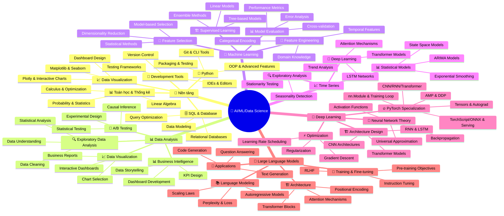
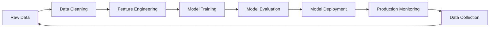
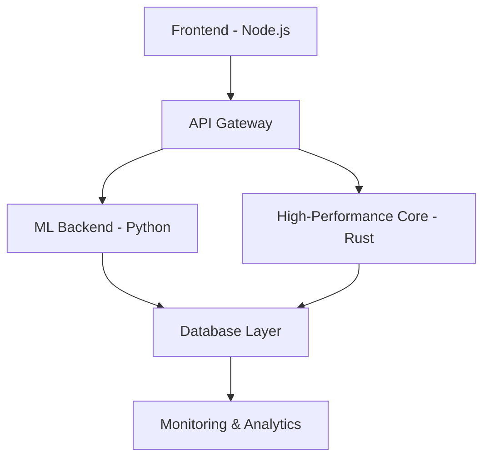
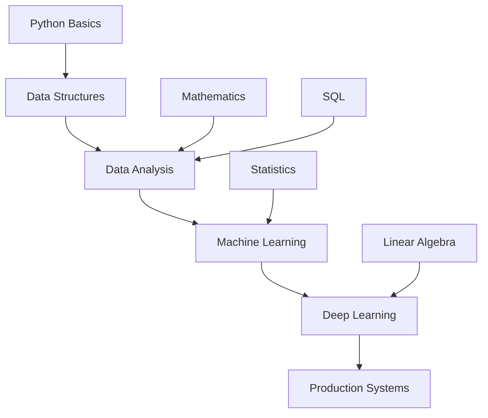

# 🗺️ Mind Map tổng quan - AI/ML Learning Path

> **Mục tiêu**: Cung cấp cái nhìn tổng quan về toàn bộ learning path AI/ML/Data Science, giúp người học hiểu rõ cấu trúc và mối quan hệ giữa các chủ đề

## 🎯 **Mind Map tổng quan**

---

### 🧩 Ghi chú 50/50
- Toàn bộ lộ trình tuân thủ tỷ lệ 50% lý thuyết : 50% thực hành
- Xem bảng 50/50 và rubric chi tiết trong từng tài liệu con

### 🔥 PyTorch chuyên đề
- File: `docs/15-pytorch.md`
- Nội dung: Lộ trình PyTorch đầy đủ từ cơ bản đến triển khai

## 🗺️ **Learning Path Structure**

### **🌱 Phase 1: Foundations (Weeks 1-3)**
**Mục tiêu**: Xây dựng nền tảng vững chắc về programming, mathematics và tools

**Chủ đề chính**:
- **Python Programming**: OOP, advanced features, testing
- **Mathematics**: Linear algebra, statistics, calculus
- **SQL & Databases**: Data modeling, query optimization
- **Development Tools**: Git, IDEs, testing frameworks

**Deliverables**:
- Portfolio website với Python backend
- Statistical analysis report
- Database design document
- Git repository với commit history

**Files liên quan**:
- `docs/01-foundations.md` - Nền tảng chi tiết
- `docs/11-tooling.md` - Setup môi trường
- `docs/10-competency.md` - Assessment skills

### **📊 Phase 2: Data Analysis (Weeks 4-6)**
**Mục tiêu**: Làm chủ data analysis và business intelligence

**Chủ đề chính**:
- **Exploratory Data Analysis**: Data understanding, cleaning, visualization
- **Business Intelligence**: Dashboard development, KPI design
- **A/B Testing**: Experimental design, statistical analysis
- **Data Storytelling**: Business insights, stakeholder communication

**Deliverables**:
- EDA project với real dataset
- Interactive dashboard với Plotly Dash
- A/B testing analysis report
- Business insights presentation

**Files liên quan**:
- `docs/02-data-analyst.md` - Data analysis chi tiết
- `docs/08-projects.md` - Project examples
- `docs/09-12-week.md` - Learning roadmap

### **🤖 Phase 3: Machine Learning (Weeks 7-9)**
**Mục tiêu**: Xây dựng và deploy ML models

**Chủ đề chính**:
- **Feature Engineering**: Temporal features, categorical encoding
- **Model Development**: Supervised learning, ensemble methods
- **Model Evaluation**: Cross-validation, performance metrics
- **Model Deployment**: API development, containerization

**Deliverables**:
- Feature engineering pipeline
- ML model với good performance
- Model interpretation report
- Deployment API

**Files liên quan**:
- `docs/03-ds-ml.md` - Machine learning chi tiết
- `docs/07-mlops.md` - MLOps practices
- `docs/14-benchmarks.md` - Model evaluation

### **🧠 Phase 4: Deep Learning (Weeks 10-12)**
**Mục tiêu**: Hiểu sâu về neural networks và advanced AI

**Chủ đề chính**:
- **Neural Network Theory**: Universal approximation, backpropagation
- **Architecture Design**: CNN, RNN, Transformer
- **Optimization**: Advanced optimizers, regularization
- **Production Deployment**: Scalable systems, monitoring

**Deliverables**:
- Deep learning project
- Production ML pipeline
- Performance optimization
- System architecture design

**Files liên quan**:
- `docs/05-deep-learning.md` - Deep learning theory
- `docs/06-llms.md` - Large language models
- `docs/deep-theory.md` - Advanced theory

## 🔗 **Interconnections & Dependencies**

### **📊 Data Flow**

### **🛠️ Technology Stack Integration**

### **📚 Learning Dependencies**

## 🎯 **Skill Development Matrix**

### **Technical Skills Progression**
| Skill Level | Python | Mathematics | ML | Deep Learning | Production |
|-------------|--------|-------------|----|---------------|------------|
| **Beginner** | Basic syntax | Basic algebra | Scikit-learn | PyTorch basics | Local deployment |
| **Intermediate** | OOP, testing | Statistics, calculus | Feature engineering | Custom architectures | Cloud deployment |
| **Advanced** | Advanced patterns | Research math | Algorithm development | Novel architectures | Distributed systems |
| **Expert** | Language design | Mathematical research | Research contributions | Research papers | Platform design |

### **Domain Knowledge Areas**
- **Computer Vision**: Image processing, object detection, segmentation
- **Natural Language Processing**: Text analysis, language models, translation
- **Time Series**: Forecasting, anomaly detection, pattern recognition
- **Reinforcement Learning**: Game playing, robotics, optimization
- **Generative AI**: Text generation, image synthesis, music composition

## 🚀 **Career Paths & Specializations**

### **Data Scientist**
**Focus Areas**:
- Statistical analysis và hypothesis testing
- Machine learning model development
- Business insights và stakeholder communication
- Data pipeline design và optimization

**Key Skills**:
- Python, R, SQL
- Scikit-learn, TensorFlow/PyTorch
- Statistical analysis và visualization
- Business domain knowledge

### **Machine Learning Engineer**
**Focus Areas**:
- Model development và optimization
- Production ML systems
- Scalable architecture design
- Performance optimization

**Key Skills**:
- Advanced Python, C++
- Deep learning frameworks
- System design và architecture
- MLOps và DevOps

### **AI Research Scientist**
**Focus Areas**:
- Novel algorithm development
- Theoretical contributions
- Research paper publication
- Academic collaboration

**Key Skills**:
- Advanced mathematics
- Research methodology
- Paper writing và presentation
- Experimental design

### **MLOps Engineer**
**Focus Areas**:
- Production ML pipelines
- Infrastructure automation
- Monitoring và alerting
- Deployment strategies

**Key Skills**:
- Kubernetes, Docker
- Cloud platforms (AWS, GCP, Azure)
- CI/CD pipelines
- Monitoring tools

## 📚 **Learning Resources & References**

### **Core Textbooks**
- **Mathematics**: "Linear Algebra Done Right" by Sheldon Axler
- **Statistics**: "Statistical Inference" by Casella & Berger
- **Machine Learning**: "Pattern Recognition and Machine Learning" by Bishop
- **Deep Learning**: "Deep Learning" by Goodfellow, Bengio, Courville

### **Online Courses**
- **Coursera**: Machine Learning by Andrew Ng
- **edX**: MIT Introduction to Deep Learning
- **Fast.ai**: Practical Deep Learning for Coders
- **Stanford CS229**: Machine Learning Course

### **Research Papers**
- **Transformers**: "Attention Is All You Need"
- **BERT**: "BERT: Pre-training of Deep Bidirectional Transformers"
- **GPT**: "Language Models are Unsupervised Multitask Learners"
- **Vision Transformers**: "An Image is Worth 16x16 Words"

### **Community & Forums**
- **Reddit**: r/MachineLearning, r/deeplearning
- **Stack Overflow**: ML/AI tags
- **Papers With Code**: Latest research implementations
- **Kaggle**: Competitions và datasets

## 🎯 **Success Metrics & Milestones**

### **Short-term Goals (1-3 months)**
- ✅ Complete foundation modules
- ✅ Build first data analysis project
- ✅ Deploy first ML model
- ✅ Contribute to open source

### **Medium-term Goals (3-6 months)**
- 🎯 Master core ML algorithms
- 🎯 Build production-ready systems
- 🎯 Complete deep learning projects
- 🎯 Establish online presence

### **Long-term Goals (6-12 months)**
- 🚀 Publish research or technical articles
- 🚀 Lead ML projects or teams
- 🚀 Contribute to cutting-edge research
- 🚀 Build ML platform or product

## 💡 **Learning Strategies & Tips**

### **Active Learning**
- **Code everything**: Implement every concept you learn
- **Build projects**: Apply knowledge to real problems
- **Teach others**: Explain concepts to reinforce understanding
- **Participate**: Join competitions, hackathons, open source

### **Time Management**
- **Consistent practice**: 2-3 hours daily
- **Focused sessions**: Deep work without distractions
- **Regular review**: Weekly assessment và planning
- **Balance**: Theory + practice + projects

### **Community Engagement**
- **Network**: Connect with other learners và professionals
- **Share**: Document your learning journey
- **Collaborate**: Work on projects with others
- **Mentor**: Help beginners once you're experienced

---

## 🌟 **Lời khuyên từ chuyên gia**

> **"Learning is a journey, not a destination"** - Học tập là hành trình, không phải đích đến

> **"Build in public"** - Chia sẻ quá trình học tập và xây dựng

> **"Consistency beats intensity"** - Kiên trì quan trọng hơn cường độ

> **"The best time to start was yesterday, the second best time is now"** - Thời điểm tốt nhất để bắt đầu là hôm qua, thời điểm tốt thứ hai là bây giờ

---

*Chúc bạn thành công trên hành trình chinh phục AI/ML/Data Science! 🚀*

