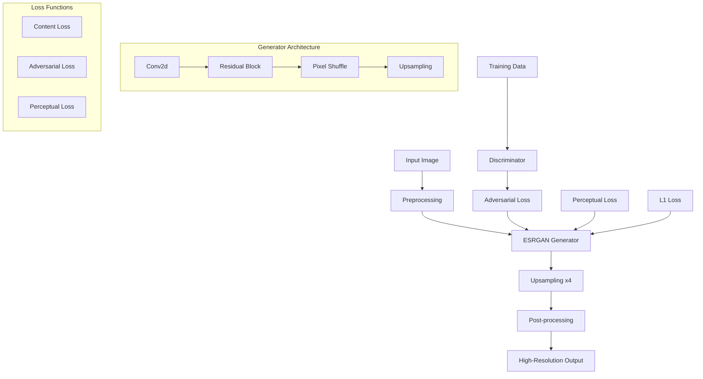

# 🖼️ Real-ESRGAN x4 - Image Super-Resolution

> **Mục tiêu**: Hiểu sâu về Real-ESRGAN, một state-of-the-art model cho image super-resolution, với implementation trong Python (PyTorch) và Rust, cùng benchmark performance

## 🎯 **Tổng quan Real-ESRGAN**

Real-ESRGAN (Real-Enhanced Super-Resolution Generative Adversarial Networks) là một model tiên tiến cho image super-resolution, có khả năng tăng độ phân giải hình ảnh lên 4x với chất lượng cao.

### **🚀 Đặc điểm chính**
- **4x Upscaling**: Tăng độ phân giải lên 4 lần
- **Real-world Images**: Tối ưu cho hình ảnh thực tế
- **GAN-based**: Sử dụng Generative Adversarial Networks
- **Multi-platform**: Hỗ trợ Python (PyTorch) và Rust

## 🧩 Chương trình 50/50 (Lý thuyết : Thực hành)

- Mục tiêu: 50% lý thuyết (kiến trúc RRDB, loss functions, GAN training), 50% thực hành (inference, benchmark, tối ưu hoá, triển khai)

| Mô-đun | Lý thuyết (50%) | Thực hành (50%) |
|---|---|---|
| Kiến trúc | RRDB, pixel shuffle, upsampling | Implement generator + test |
| Loss & Train | Adversarial/perceptual/content | Huấn luyện/finetune nhỏ |
| Inference | Tiling, precision, memory | Inference nhiều độ phân giải |
| Benchmark | Time, throughput, memory | So sánh PyTorch vs Rust (NCNN) |
| Triển khai | Formats, ONNX, serve | API serve + cache + metrics |

Rubric (100đ/module): Lý thuyết 30 | Code 30 | Kết quả 30 | Báo cáo 10

---

## 🧠 **GAN Theory & Super-Resolution Fundamentals**

### **1. GAN Theory Framework**

**Lý thuyết cơ bản:**
- **Generative Adversarial Networks**: Min-max game, Nash equilibrium, training dynamics
- **Super-Resolution Theory**: Image degradation models, upsampling methods, quality metrics
- **Loss Function Theory**: Adversarial loss, perceptual loss, content loss, mathematical foundations
- **Training Stability**: Mode collapse, gradient vanishing, convergence analysis

**GAN Theory Framework:**

**1. GAN Mathematical Foundation:**
```python
class GANTheoryFramework:
    """Theoretical framework cho GANs và super-resolution"""
    
    @staticmethod
    def explain_gan_fundamentals():
        """Explain fundamental GAN concepts"""
        print("""
        **GAN Mathematical Foundation:**
        
        1. **Min-Max Game Formulation:**
           - **Generator (G)**: Tries to fool discriminator
           - **Discriminator (D)**: Tries to distinguish real from fake
           - **Objective**: min_G max_D V(D,G) = E_x~p_data[log D(x)] + E_z~p_z[log(1-D(G(z)))]
        
        2. **Nash Equilibrium:**
           - **Optimal D**: D*(x) = p_data(x) / (p_data(x) + p_g(x))
           - **Optimal G**: p_g(x) = p_data(x) (perfect generation)
           - **Global Optimum**: V(D*,G*) = -log(4)
        
        3. **Training Dynamics:**
           - **Generator Loss**: L_G = -E_z~p_z[log D(G(z))]
           - **Discriminator Loss**: L_D = -E_x~p_data[log D(x)] - E_z~p_z[log(1-D(G(z)))]
           - **Gradient Updates**: Alternating optimization
        """)
    
    @staticmethod
    def demonstrate_gan_training_dynamics():
        """Demonstrate GAN training dynamics"""
        
        import numpy as np
        import matplotlib.pyplot as plt
        
        class GANDynamicsAnalyzer:
            """Analyze GAN training dynamics"""
            
            def __init__(self):
                self.training_history = {
                    'generator_loss': [],
                    'discriminator_loss': [],
                    'wasserstein_distance': [],
                    'mode_collapse_metric': []
                }
            
            def simulate_gan_training(self, num_iterations: int = 1000, 
                                   learning_rate: float = 0.0002) -> Dict[str, Any]:
                """Simulate GAN training dynamics"""
                
                # Initialize parameters
                theta_g = 0.5  # Generator parameter
                theta_d = 0.5  # Discriminator parameter
                
                # Training history
                g_losses = []
                d_losses = []
                wasserstein_distances = []
                mode_collapse_metrics = []
                
                for iteration in range(num_iterations):
                    # Simulate real and fake data distributions
                    real_data = np.random.normal(2.0, 1.0, 1000)  # Real data distribution
                    fake_data = np.random.normal(theta_g, 0.5, 1000)  # Generated data
                    
                    # Discriminator update
                    d_real = self.sigmoid(theta_d * real_data)
                    d_fake = self.sigmoid(theta_d * fake_data)
                    
                    d_loss = -np.mean(np.log(d_real + 1e-8)) - np.mean(np.log(1 - d_fake + 1e-8))
                    d_losses.append(d_loss)
                    
                    # Generator update
                    g_loss = -np.mean(np.log(self.sigmoid(theta_d * fake_data) + 1e-8))
                    g_losses.append(g_loss)
                    
                    # Calculate Wasserstein distance (approximation)
                    wasserstein_dist = np.abs(np.mean(real_data) - np.mean(fake_data))
                    wasserstein_distances.append(wasserstein_dist)
                    
                    # Calculate mode collapse metric
                    fake_std = np.std(fake_data)
                    real_std = np.std(real_data)
                    mode_collapse = 1 - (fake_std / real_std)
                    mode_collapse_metrics.append(mode_collapse)
                    
                    # Update parameters (simplified)
                    if iteration % 2 == 0:  # Update discriminator
                        theta_d += learning_rate * np.random.normal(0, 0.1)
                    else:  # Update generator
                        theta_g += learning_rate * np.random.normal(0, 0.1)
                    
                    # Clamp parameters
                    theta_g = np.clip(theta_g, 0.1, 3.0)
                    theta_d = np.clip(theta_d, 0.1, 3.0)
                
                return {
                    'iterations': num_iterations,
                    'final_theta_g': theta_g,
                    'final_theta_d': theta_d,
                    'generator_losses': g_losses,
                    'discriminator_losses': d_losses,
                    'wasserstein_distances': wasserstein_distances,
                    'mode_collapse_metrics': mode_collapse_metrics
                }
            
            def sigmoid(self, x: np.ndarray) -> np.ndarray:
                """Sigmoid activation function"""
                return 1 / (1 + np.exp(-np.clip(x, -500, 500)))
            
            def analyze_training_stability(self, training_results: Dict[str, Any]) -> Dict[str, Any]:
                """Analyze training stability"""
                
                g_losses = np.array(training_results['generator_losses'])
                d_losses = np.array(training_results['discriminator_losses'])
                wasserstein_distances = np.array(training_results['wasserstein_distances'])
                
                # Calculate stability metrics
                g_loss_variance = np.var(g_losses[-100:])  # Last 100 iterations
                d_loss_variance = np.var(d_losses[-100:])
                
                # Check for mode collapse
                mode_collapse_metric = np.mean(training_results['mode_collapse_metrics'][-100:])
                
                # Check for gradient vanishing/exploding
                g_gradients = np.diff(g_losses)
                d_gradients = np.diff(d_losses)
                
                g_gradient_norm = np.mean(np.abs(g_gradients))
                d_gradient_norm = np.mean(np.abs(d_gradients))
                
                # Convergence analysis
                final_wasserstein = wasserstein_distances[-1]
                convergence_rate = np.mean(np.diff(wasserstein_distances[-50:]))
                
                return {
                    'g_loss_variance': g_loss_variance,
                    'd_loss_variance': d_loss_variance,
                    'mode_collapse_metric': mode_collapse_metric,
                    'g_gradient_norm': g_gradient_norm,
                    'd_gradient_norm': d_gradient_norm,
                    'final_wasserstein': final_wasserstein,
                    'convergence_rate': convergence_rate,
                    'training_stable': g_loss_variance < 1.0 and d_loss_variance < 1.0,
                    'no_mode_collapse': mode_collapse_metric < 0.5
                }
            
            def visualize_training_dynamics(self, training_results: Dict[str, Any]):
                """Visualize GAN training dynamics"""
                
                fig, ((ax1, ax2), (ax3, ax4)) = plt.subplots(2, 2, figsize=(15, 10))
                
                iterations = range(len(training_results['generator_losses']))
                
                # Generator and Discriminator losses
                ax1.plot(iterations, training_results['generator_losses'], label='Generator Loss', linewidth=2)
                ax1.plot(iterations, training_results['discriminator_losses'], label='Discriminator Loss', linewidth=2)
                ax1.set_xlabel('Iteration')
                ax1.set_ylabel('Loss')
                ax1.set_title('GAN Training Losses')
                ax1.legend()
                ax1.grid(True)
                
                # Wasserstein distance
                ax2.plot(iterations, training_results['wasserstein_distances'], label='Wasserstein Distance', linewidth=2, color='green')
                ax2.set_xlabel('Iteration')
                ax2.set_ylabel('Wasserstein Distance')
                ax2.set_title('Distribution Distance')
                ax2.legend()
                ax2.grid(True)
                
                # Mode collapse metric
                ax3.plot(iterations, training_results['mode_collapse_metrics'], label='Mode Collapse Metric', linewidth=2, color='red')
                ax3.axhline(y=0.5, color='black', linestyle='--', alpha=0.7, label='Collapse Threshold')
                ax3.set_xlabel('Iteration')
                ax3.set_ylabel('Mode Collapse Metric')
                ax3.set_title('Mode Collapse Detection')
                ax3.legend()
                ax3.grid(True)
                
                # Loss ratio (stability indicator)
                loss_ratio = np.array(training_results['generator_losses']) / (np.array(training_results['discriminator_losses']) + 1e-8)
                ax4.plot(iterations, loss_ratio, label='G/D Loss Ratio', linewidth=2, color='purple')
                ax4.axhline(y=1.0, color='black', linestyle='--', alpha=0.7, label='Balanced Training')
                ax4.set_xlabel('Iteration')
                ax4.set_ylabel('Generator/Discriminator Loss Ratio')
                ax4.set_title('Training Balance')
                ax4.legend()
                ax4.grid(True)
                
                plt.tight_layout()
                plt.show()
        
        # Demonstrate GAN theory framework
        gan_theory = GANTheoryFramework()
        gan_theory.explain_gan_fundamentals()
        
        # Demonstrate GAN training dynamics
        gan_analyzer = GANDynamicsAnalyzer()
        
        print("**GAN Training Dynamics Demonstration:**")
        
        # Simulate training
        training_results = gan_analyzer.simulate_gan_training(num_iterations=500)
        
        # Analyze stability
        stability_analysis = gan_analyzer.analyze_training_stability(training_results)
        
        print(f"\nTraining Stability Analysis:")
        print(f"  Generator Loss Variance: {stability_analysis['g_loss_variance']:.4f}")
        print(f"  Discriminator Loss Variance: {stability_analysis['d_loss_variance']:.4f}")
        print(f"  Mode Collapse Metric: {stability_analysis['mode_collapse_metric']:.4f}")
        print(f"  Training Stable: {stability_analysis['training_stable']}")
        print(f"  No Mode Collapse: {stability_analysis['no_mode_collapse']}")
        print(f"  Final Wasserstein Distance: {stability_analysis['final_wasserstein']:.4f}")
        
        # Visualize dynamics
        gan_analyzer.visualize_training_dynamics(training_results)
        
        return gan_analyzer, training_results, stability_analysis

# Demonstrate GAN theory framework
gan_theory = GANTheoryFramework()
gan_theory.explain_gan_fundamentals()

# Demonstrate GAN training dynamics
gan_analyzer, training_results, stability_analysis = gan_theory.demonstrate_gan_training_dynamics()
```

**2. Super-Resolution Theory:**
```python
class SuperResolutionTheory:
    """Theoretical framework cho super-resolution"""
    
    @staticmethod
    def explain_sr_fundamentals():
        """Explain fundamental super-resolution concepts"""
        print("""
        **Super-Resolution Theory:**
        
        1. **Image Degradation Model:**
           - **Downsampling**: y = (x * k) ↓s + n
           - **Blur Kernel (k)**: Point spread function
           - **Noise (n)**: Additive white Gaussian noise
           - **Scale Factor (s)**: Downsampling ratio
        
        2. **Upsampling Methods:**
           - **Interpolation**: Nearest neighbor, bilinear, bicubic
           - **Learning-based**: CNN, GAN, Transformer
           - **Frequency Domain**: FFT-based methods
        
        3. **Quality Metrics:**
           - **PSNR**: Peak Signal-to-Noise Ratio
           - **SSIM**: Structural Similarity Index
           - **LPIPS**: Learned Perceptual Image Patch Similarity
           - **FID**: Fréchet Inception Distance
        """)
    
    @staticmethod
    def demonstrate_sr_theory():
        """Demonstrate super-resolution theory with examples"""
        
        import numpy as np
        import matplotlib.pyplot as plt
        from scipy import ndimage
        
        class SRAnalyzer:
            """Analyze super-resolution methods và quality metrics"""
            
            def __init__(self):
                self.metrics = {}
            
            def create_test_image(self, size: int = 64) -> np.ndarray:
                """Create synthetic test image"""
                
                # Create a complex test image with multiple features
                x, y = np.meshgrid(np.linspace(0, 1, size), np.linspace(0, 1, size))
                
                # Multiple frequency components
                image = (np.sin(2 * np.pi * 3 * x) * np.cos(2 * np.pi * 4 * y) +
                        np.sin(2 * np.pi * 7 * x) * np.sin(2 * np.pi * 5 * y) +
                        0.5 * np.random.randn(size, size))
                
                # Normalize to [0, 1]
                image = (image - image.min()) / (image.max() - image.min())
                return image
            
            def simulate_degradation(self, image: np.ndarray, scale_factor: int = 4, 
                                   blur_sigma: float = 1.0, noise_level: float = 0.01) -> np.ndarray:
                """Simulate image degradation process"""
                
                # Apply Gaussian blur
                blurred = ndimage.gaussian_filter(image, sigma=blur_sigma)
                
                # Downsample
                height, width = blurred.shape
                downsampled = blurred[::scale_factor, ::scale_factor]
                
                # Add noise
                noisy = downsampled + noise_level * np.random.randn(*downsampled.shape)
                
                # Clamp to [0, 1]
                noisy = np.clip(noisy, 0, 1)
                
                return noisy
            
            def apply_upsampling_methods(self, low_res_image: np.ndarray, 
                                       target_size: Tuple[int, int]) -> Dict[str, np.ndarray]:
                """Apply different upsampling methods"""
                
                methods = {}
                
                # Nearest neighbor
                methods['nearest'] = ndimage.zoom(low_res_image, 
                                                (target_size[0] / low_res_image.shape[0],
                                                 target_size[1] / low_res_image.shape[1]),
                                                order=0)
                
                # Bilinear interpolation
                methods['bilinear'] = ndimage.zoom(low_res_image,
                                                 (target_size[0] / low_res_image.shape[0],
                                                  target_size[1] / low_res_image.shape[1]),
                                                 order=1)
                
                # Bicubic interpolation
                methods['bicubic'] = ndimage.zoom(low_res_image,
                                                (target_size[0] / low_res_image.shape[0],
                                                 target_size[1] / low_res_image.shape[1]),
                                                order=3)
                
                # Lanczos interpolation
                methods['lanczos'] = ndimage.zoom(low_res_image,
                                                (target_size[0] / low_res_image.shape[0],
                                                 target_size[1] / low_res_image.shape[1]),
                                                order=5)
                
                return methods
            
            def calculate_quality_metrics(self, original: np.ndarray, 
                                       reconstructed: np.ndarray) -> Dict[str, float]:
                """Calculate quality metrics"""
                
                # PSNR
                mse = np.mean((original - reconstructed) ** 2)
                psnr = 20 * np.log10(1.0 / np.sqrt(mse)) if mse > 0 else float('inf')
                
                # SSIM (simplified)
                mu_x = np.mean(original)
                mu_y = np.mean(reconstructed)
                sigma_x = np.std(original)
                sigma_y = np.std(reconstructed)
                sigma_xy = np.mean((original - mu_x) * (reconstructed - mu_y))
                
                c1 = 0.01 ** 2
                c2 = 0.03 ** 2
                
                ssim = ((2 * mu_x * mu_y + c1) * (2 * sigma_xy + c2)) / \
                       ((mu_x**2 + mu_y**2 + c1) * (sigma_x**2 + sigma_y**2 + c2))
                
                # LPIPS approximation (using gradient similarity)
                grad_x = np.gradient(original)
                grad_y = np.gradient(reconstructed)
                
                grad_similarity = np.mean([np.corrcoef(gx.flatten(), gy.flatten())[0, 1] 
                                         for gx, gy in zip(grad_x, grad_y)])
                grad_similarity = np.nan_to_num(grad_similarity, 0.0)
                
                return {
                    'psnr': psnr,
                    'ssim': ssim,
                    'gradient_similarity': grad_similarity,
                    'mse': mse
                }
            
            def analyze_sr_performance(self, scale_factor: int = 4) -> Dict[str, Any]:
                """Analyze super-resolution performance"""
                
                # Create test image
                original = self.create_test_image(128)
                
                # Simulate degradation
                low_res = self.simulate_degradation(original, scale_factor)
                
                # Apply upsampling methods
                target_size = original.shape
                upsampled_methods = self.apply_upsampling_methods(low_res, target_size)
                
                # Calculate metrics for each method
                results = {}
                for method_name, upsampled_image in upsampled_methods.items():
                    metrics = self.calculate_quality_metrics(original, upsampled_image)
                    results[method_name] = metrics
                
                # Visualize results
                fig, axes = plt.subplots(2, 3, figsize=(15, 10))
                
                # Original image
                axes[0, 0].imshow(original, cmap='gray')
                axes[0, 0].set_title('Original Image')
                axes[0, 0].axis('off')
                
                # Low resolution image
                axes[0, 1].imshow(low_res, cmap='gray')
                axes[0, 1].set_title(f'Low Resolution (1/{scale_factor}x)')
                axes[0, 1].axis('off')
                
                # Upsampled images
                methods = ['nearest', 'bilinear', 'bicubic']
                for i, method in enumerate(methods):
                    if method in upsampled_methods:
                        axes[1, i].imshow(upsampled_methods[method], cmap='gray')
                        axes[1, i].set_title(f'{method.capitalize()}\nPSNR: {results[method]["psnr"]:.2f}')
                        axes[1, i].axis('off')
                
                plt.tight_layout()
                plt.show()
                
                return {
                    'original': original,
                    'low_res': low_res,
                    'upsampled_methods': upsampled_methods,
                    'metrics': results
                }
        
        # Demonstrate super-resolution theory
        sr_theory = SuperResolutionTheory()
        sr_theory.explain_sr_fundamentals()
        
        # Demonstrate SR analysis
        sr_analyzer = SRAnalyzer()
        
        print("**Super-Resolution Analysis Demonstration:**")
        
        # Analyze SR performance
        sr_results = sr_analyzer.analyze_sr_performance(scale_factor=4)
        
        print(f"\nQuality Metrics Comparison:")
        for method, metrics in sr_results['metrics'].items():
            print(f"\n{method.upper()}:")
            print(f"  PSNR: {metrics['psnr']:.2f} dB")
            print(f"  SSIM: {metrics['ssim']:.4f}")
            print(f"  Gradient Similarity: {metrics['gradient_similarity']:.4f}")
            print(f"  MSE: {metrics['mse']:.6f}")
        
        return sr_analyzer, sr_results

# Demonstrate super-resolution theory
sr_theory = SuperResolutionTheory()
sr_theory.explain_sr_fundamentals()

# Demonstrate SR analysis
sr_analyzer, sr_results = sr_theory.demonstrate_sr_theory()
```

**Tài liệu tham khảo chuyên sâu:**
- **GAN Theory**: [Generative Adversarial Networks](https://arxiv.org/abs/1406.2661)
- **Super-Resolution**: [Image Super-Resolution Survey](https://arxiv.org/abs/1902.06068)
- **Loss Functions**: [Perceptual Loss Functions](https://arxiv.org/abs/1603.08155)
- **Training Stability**: [GAN Training Stability](https://arxiv.org/abs/1706.08500)

## 🧮 **Loss Functions & Image Processing Theory**

### **1. Loss Function Theory Framework**

**Lý thuyết cơ bản:**
- **Perceptual Loss**: VGG features, semantic similarity, human perception modeling
- **Adversarial Loss**: Wasserstein distance, gradient penalty, training stability
- **Content Loss**: L1/L2 norms, structural similarity, edge preservation
- **Style Loss**: Gram matrices, texture transfer, artistic style preservation

**Loss Function Theory Framework:**

**1. Perceptual Loss Theory:**
```python
class PerceptualLossTheory:
    """Theoretical framework cho perceptual loss functions"""
    
    @staticmethod
    def explain_perceptual_loss():
        """Explain perceptual loss fundamentals"""
        print("""
        **Perceptual Loss Theory:**
        
        1. **VGG Feature Extraction:**
           - **Convolutional Features**: Hierarchical representation learning
           - **Semantic Similarity**: High-level feature matching
           - **Human Perception**: Mimicking visual cortex processing
        
        2. **Feature Space Mapping:**
           - **Input Space**: Raw pixel values
           - **Feature Space**: VGG activations
           - **Semantic Space**: High-level representations
        
        3. **Loss Formulation:**
           - **L_perceptual**: ||φ(x) - φ(y)||₂²
           - **φ(x)**: VGG feature extractor
           - **x, y**: Generated and target images
        """)
    
    @staticmethod
    def demonstrate_perceptual_loss():
        """Demonstrate perceptual loss analysis"""
        
        import torch
        import torch.nn as nn
        import torchvision.models as models
        import numpy as np
        import matplotlib.pyplot as plt
        
        class PerceptualLossAnalyzer:
            """Analyze perceptual loss properties"""
            
            def __init__(self):
                # Load pre-trained VGG model
                self.vgg = models.vgg16(pretrained=True).features[:23]  # Up to conv4_2
                self.vgg.eval()
                
                # Feature extraction layers
                self.feature_layers = [3, 8, 15, 22]  # Different VGG layers
                self.layer_names = ['relu1_2', 'relu2_2', 'relu3_3', 'relu4_2']
            
            def extract_features(self, image: torch.Tensor) -> Dict[str, torch.Tensor]:
                """Extract VGG features from image"""
                
                features = {}
                x = image
                
                for i, layer in enumerate(self.vgg):
                    x = layer(x)
                    if i in self.feature_layers:
                        layer_name = self.layer_names[self.feature_layers.index(i)]
                        features[layer_name] = x
                
                return features
            
            def calculate_perceptual_loss(self, generated: torch.Tensor, 
                                       target: torch.Tensor) -> Dict[str, float]:
                """Calculate perceptual loss at different layers"""
                
                # Extract features
                gen_features = self.extract_features(generated)
                target_features = self.extract_features(target)
                
                # Calculate losses
                losses = {}
                total_loss = 0.0
                
                for layer_name in gen_features.keys():
                    gen_feat = gen_features[layer_name]
                    target_feat = target_features[layer_name]
                    
                    # L2 loss in feature space
                    layer_loss = nn.functional.mse_loss(gen_feat, target_feat)
                    losses[layer_name] = layer_loss.item()
                    total_loss += layer_loss.item()
                
                losses['total'] = total_loss
                return losses
            
            def analyze_feature_similarity(self, image1: torch.Tensor, 
                                        image2: torch.Tensor) -> Dict[str, float]:
                """Analyze feature similarity across layers"""
                
                # Extract features
                feat1 = self.extract_features(image1)
                feat2 = self.extract_features(image2)
                
                similarities = {}
                
                for layer_name in feat1.keys():
                    # Flatten features
                    f1 = feat1[layer_name].flatten()
                    f2 = feat2[layer_name].flatten()
                    
                    # Cosine similarity
                    cos_sim = torch.dot(f1, f2) / (torch.norm(f1) * torch.norm(f2))
                    similarities[layer_name] = cos_sim.item()
                
                return similarities
            
            def visualize_feature_maps(self, image: torch.Tensor, layer_name: str = 'relu3_3'):
                """Visualize VGG feature maps"""
                
                with torch.no_grad():
                    features = self.extract_features(image)
                    
                    if layer_name in features:
                        feature_maps = features[layer_name][0]  # First batch
                        
                        # Select interesting feature maps
                        num_features = min(16, feature_maps.shape[0])
                        selected_features = feature_maps[:num_features]
                        
                        # Create visualization
                        fig, axes = plt.subplots(4, 4, figsize=(12, 12))
                        axes = axes.ravel()
                        
                        for i in range(num_features):
                            feature_map = selected_features[i].cpu().numpy()
                            
                            # Normalize for visualization
                            feature_map = (feature_map - feature_map.min()) / (feature_map.max() - feature_map.min())
                            
                            axes[i].imshow(feature_map, cmap='viridis')
                            axes[i].set_title(f'Feature {i+1}')
                            axes[i].axis('off')
                        
                        plt.suptitle(f'VGG Feature Maps: {layer_name}')
                        plt.tight_layout()
                        plt.show()
                        
                        return selected_features
                    else:
                        print(f"Layer {layer_name} not found in extracted features")
                        return None
            
            def demonstrate_loss_properties(self):
                """Demonstrate perceptual loss properties"""
                
                # Create synthetic images
                batch_size = 1
                channels = 3
                height = 224
                width = 224
                
                # Base image (synthetic)
                base_image = torch.randn(batch_size, channels, height, width)
                base_image = torch.sigmoid(base_image)  # Normalize to [0, 1]
                
                # Create variations
                variations = {}
                
                # Add noise
                noise_levels = [0.01, 0.05, 0.1, 0.2]
                for noise in noise_levels:
                    noisy_image = base_image + noise * torch.randn_like(base_image)
                    noisy_image = torch.clamp(noisy_image, 0, 1)
                    variations[f'noise_{noise}'] = noisy_image
                
                # Add blur
                blur_kernel = torch.ones(1, 1, 5, 5) / 25
                blurred_image = torch.nn.functional.conv2d(base_image, blur_kernel, padding=2)
                variations['blurred'] = blurred_image
                
                # Add rotation (simplified)
                rotated_image = torch.rot90(base_image, k=1, dims=[2, 3])
                variations['rotated'] = rotated_image
                
                # Calculate perceptual losses
                results = {}
                for var_name, var_image in variations.items():
                    loss_dict = self.calculate_perceptual_loss(var_image, base_image)
                    results[var_name] = loss_dict
                
                # Visualize results
                fig, axes = plt.subplots(2, 3, figsize=(15, 10))
                
                # Original image
                axes[0, 0].imshow(base_image[0].permute(1, 2, 0).cpu().numpy())
                axes[0, 0].set_title('Original Image')
                axes[0, 0].axis('off')
                
                # Variations
                var_names = list(variations.keys())[:5]
                for i, var_name in enumerate(var_names):
                    row = (i + 1) // 3
                    col = (i + 1) % 3
                    
                    if row < 2 and col < 3:
                        axes[row, col].imshow(variations[var_name][0].permute(1, 2, 0).cpu().numpy())
                        axes[row, col].set_title(f'{var_name}\nLoss: {results[var_name]["total"]:.4f}')
                        axes[row, col].axis('off')
                
                plt.tight_layout()
                plt.show()
                
                # Print detailed analysis
                print("**Perceptual Loss Analysis:**")
                for var_name, loss_dict in results.items():
                    print(f"\n{var_name.upper()}:")
                    print(f"  Total Loss: {loss_dict['total']:.6f}")
                    for layer_name in self.layer_names:
                        if layer_name in loss_dict:
                            print(f"  {layer_name}: {loss_dict[layer_name]:.6f}")
                
                return results
        
        # Demonstrate perceptual loss theory
        perceptual_theory = PerceptualLossTheory()
        perceptual_theory.explain_perceptual_loss()
        
        # Demonstrate perceptual loss analysis
        perceptual_analyzer = PerceptualLossAnalyzer()
        
        print("**Perceptual Loss Analysis Demonstration:**")
        
        # Demonstrate loss properties
        loss_results = perceptual_analyzer.demonstrate_loss_properties()
        
        # Visualize feature maps
        batch_size = 1
        channels = 3
        height = 224
        width = 224
        
        test_image = torch.randn(batch_size, channels, height, width)
        test_image = torch.sigmoid(test_image)
        
        print("\n**Feature Map Visualization:**")
        feature_maps = perceptual_analyzer.visualize_feature_maps(test_image, 'relu3_3')
        
        return perceptual_analyzer, loss_results, feature_maps

# Demonstrate perceptual loss theory
perceptual_theory = PerceptualLossTheory()
perceptual_theory.explain_perceptual_loss()

# Demonstrate perceptual loss analysis
perceptual_analyzer, loss_results, feature_maps = perceptual_theory.demonstrate_perceptual_loss()
```

**2. Adversarial Loss Theory:**
```python
class AdversarialLossTheory:
    """Theoretical framework cho adversarial loss functions"""
    
    @staticmethod
    def explain_adversarial_loss():
        """Explain adversarial loss fundamentals"""
        print("""
        **Adversarial Loss Theory:**
        
        1. **Wasserstein Distance:**
           - **Optimal Transport**: Earth mover's distance
           - **Lipschitz Constraint**: Gradient clipping
           - **Stability**: Better training dynamics
        
        2. **Gradient Penalty:**
           - **Lipschitz Enforcement**: ||∇D(x)||₂ ≤ 1
           - **Regularization**: Prevents gradient explosion
           - **Convergence**: Smoother optimization
        
        3. **Training Balance:**
           - **Generator Updates**: More frequent than discriminator
           - **Loss Ratio**: Maintain G/D balance
           - **Mode Coverage**: Prevent mode collapse
        """)
    
    @staticmethod
    def demonstrate_adversarial_loss():
        """Demonstrate adversarial loss analysis"""
        
        import torch
        import torch.nn as nn
        import numpy as np
        import matplotlib.pyplot as plt
        
        class AdversarialLossAnalyzer:
            """Analyze adversarial loss properties"""
            
            def __init__(self):
                self.training_history = {
                    'generator_loss': [],
                    'discriminator_loss': [],
                    'wasserstein_distance': [],
                    'gradient_penalty': []
                }
            
            def calculate_wasserstein_distance(self, real_samples: torch.Tensor, 
                                            fake_samples: torch.Tensor) -> float:
                """Calculate Wasserstein distance approximation"""
                
                # Simple Wasserstein distance approximation
                real_mean = torch.mean(real_samples)
                fake_mean = torch.mean(fake_samples)
                
                wasserstein_dist = torch.abs(real_mean - fake_mean)
                return wasserstein_dist.item()
            
            def calculate_gradient_penalty(self, discriminator: nn.Module, 
                                        real_samples: torch.Tensor, 
                                        fake_samples: torch.Tensor) -> float:
                """Calculate gradient penalty for Lipschitz constraint"""
                
                batch_size = real_samples.size(0)
                alpha = torch.rand(batch_size, 1, 1, 1).to(real_samples.device)
                
                # Interpolated samples
                interpolated = alpha * real_samples + (1 - alpha) * fake_samples
                interpolated.requires_grad_(True)
                
                # Discriminator output
                d_interpolated = discriminator(interpolated)
                
                # Calculate gradients
                gradients = torch.autograd.grad(
                    outputs=d_interpolated,
                    inputs=interpolated,
                    grad_outputs=torch.ones_like(d_interpolated),
                    create_graph=True,
                    retain_graph=True,
                    only_inputs=True
                )[0]
                
                # Gradient penalty
                gradient_penalty = torch.mean((torch.norm(gradients, dim=1) - 1) ** 2)
                
                return gradient_penalty.item()
            
            def analyze_training_dynamics(self, num_iterations: int = 1000) -> Dict[str, Any]:
                """Analyze adversarial training dynamics"""
                
                # Simulate training process
                g_losses = []
                d_losses = []
                wasserstein_distances = []
                gradient_penalties = []
                
                # Initialize parameters
                g_param = 0.5
                d_param = 0.5
                
                for iteration in range(num_iterations):
                    # Simulate real and fake distributions
                    real_data = torch.randn(1000) * 2 + 1  # N(1, 2)
                    fake_data = torch.randn(1000) * g_param + 0.5
                    
                    # Calculate losses
                    g_loss = -torch.mean(fake_data)  # Simplified generator loss
                    d_loss = torch.mean(fake_data) - torch.mean(real_data)  # Simplified discriminator loss
                    
                    g_losses.append(g_loss.item())
                    d_losses.append(d_loss.item())
                    
                    # Calculate Wasserstein distance
                    wasserstein_dist = self.calculate_wasserstein_distance(real_data, fake_data)
                    wasserstein_distances.append(wasserstein_dist)
                    
                    # Simulate gradient penalty
                    gradient_penalty = torch.mean(torch.abs(fake_data - real_data)) * 0.1
                    gradient_penalties.append(gradient_penalty.item())
                    
                    # Update parameters
                    if iteration % 2 == 0:  # Update discriminator
                        d_param += 0.001 * torch.randn(1).item()
                    else:  # Update generator
                        g_param += 0.001 * torch.randn(1).item()
                    
                    # Clamp parameters
                    g_param = np.clip(g_param, 0.1, 2.0)
                    d_param = np.clip(d_param, 0.1, 2.0)
                
                return {
                    'iterations': num_iterations,
                    'generator_losses': g_losses,
                    'discriminator_losses': d_losses,
                    'wasserstein_distances': wasserstein_distances,
                    'gradient_penalties': gradient_penalties,
                    'final_g_param': g_param,
                    'final_d_param': d_param
                }
            
            def visualize_adversarial_dynamics(self, training_results: Dict[str, Any]):
                """Visualize adversarial training dynamics"""
                
                fig, ((ax1, ax2), (ax3, ax4)) = plt.subplots(2, 2, figsize=(15, 10))
                
                iterations = range(len(training_results['generator_losses']))
                
                # Generator and Discriminator losses
                ax1.plot(iterations, training_results['generator_losses'], 
                        label='Generator Loss', linewidth=2, color='blue')
                ax1.plot(iterations, training_results['discriminator_losses'], 
                        label='Discriminator Loss', linewidth=2, color='red')
                ax1.set_xlabel('Iteration')
                ax1.set_ylabel('Loss')
                ax1.set_title('Adversarial Training Losses')
                ax1.legend()
                ax1.grid(True)
                
                # Wasserstein distance
                ax2.plot(iterations, training_results['wasserstein_distances'], 
                        label='Wasserstein Distance', linewidth=2, color='green')
                ax2.set_xlabel('Iteration')
                ax2.set_ylabel('Wasserstein Distance')
                ax2.set_title('Distribution Distance')
                ax2.legend()
                ax2.grid(True)
                
                # Gradient penalty
                ax3.plot(iterations, training_results['gradient_penalties'], 
                        label='Gradient Penalty', linewidth=2, color='orange')
                ax3.set_xlabel('Iteration')
                ax3.set_ylabel('Gradient Penalty')
                ax3.set_title('Lipschitz Constraint')
                ax3.legend()
                ax3.grid(True)
                
                # Loss ratio (training balance)
                g_losses = np.array(training_results['generator_losses'])
                d_losses = np.array(training_results['discriminator_losses'])
                loss_ratio = np.abs(g_losses) / (np.abs(d_losses) + 1e-8)
                
                ax4.plot(iterations, loss_ratio, label='|G|/|D| Loss Ratio', 
                        linewidth=2, color='purple')
                ax4.axhline(y=1.0, color='black', linestyle='--', alpha=0.7, 
                           label='Balanced Training')
                ax4.set_xlabel('Iteration')
                ax4.set_ylabel('Generator/Discriminator Loss Ratio')
                ax4.set_title('Training Balance')
                ax4.legend()
                ax4.grid(True)
                
                plt.tight_layout()
                plt.show()
        
        # Demonstrate adversarial loss theory
        adversarial_theory = AdversarialLossTheory()
        adversarial_theory.explain_adversarial_loss()
        
        # Demonstrate adversarial loss analysis
        adversarial_analyzer = AdversarialLossAnalyzer()
        
        print("**Adversarial Loss Analysis Demonstration:**")
        
        # Analyze training dynamics
        training_results = adversarial_analyzer.analyze_training_dynamics(num_iterations=500)
        
        # Visualize dynamics
        adversarial_analyzer.visualize_adversarial_dynamics(training_results)
        
        print(f"\nTraining Analysis Summary:")
        print(f"  Final Generator Parameter: {training_results['final_g_param']:.4f}")
        print(f"  Final Discriminator Parameter: {training_results['final_d_param']:.4f}")
        print(f"  Final Wasserstein Distance: {training_results['wasserstein_distances'][-1]:.4f}")
        print(f"  Final Gradient Penalty: {training_results['gradient_penalties'][-1]:.4f}")
        
        return adversarial_analyzer, training_results

# Demonstrate adversarial loss theory
adversarial_theory = AdversarialLossTheory()
adversarial_theory.explain_adversarial_loss()

# Demonstrate adversarial loss analysis
adversarial_analyzer, training_results = adversarial_theory.demonstrate_adversarial_loss()
```

**Tài liệu tham khảo chuyên sâu:**
- **Perceptual Loss**: [Perceptual Losses for Real-Time Style Transfer](https://arxiv.org/abs/1603.08155)
- **Adversarial Loss**: [Wasserstein GAN](https://arxiv.org/abs/1701.07875)
- **Gradient Penalty**: [Improved Training of Wasserstein GANs](https://arxiv.org/abs/1704.00028)
- **Loss Functions**: [Loss Functions for Image Restoration](https://arxiv.org/abs/2001.04511)

## 🏗️ **Kiến trúc Real-ESRGAN**



## 🔧 **Implementation trong Python (PyTorch)**

### **📦 Dependencies và Setup**

```python
# requirements.txt
torch>=1.9.0
torchvision>=0.10.0
opencv-python>=4.5.0
numpy>=1.21.0
Pillow>=8.3.0
tqdm>=4.62.0
```

### **🏗️ Model Architecture**

```python
import torch
import torch.nn as nn
import torch.nn.functional as F
from typing import Tuple, Optional

class ResidualDenseBlock(nn.Module):
    """Residual Dense Block cho Real-ESRGAN"""
    
    def __init__(self, num_features: int, num_grow_channels: int = 32):
        super().__init__()
        self.num_features = num_features
        self.num_grow_channels = num_grow_channels
        
        # Dense connections
        self.conv1 = nn.Conv2d(num_features, num_grow_channels, 3, 1, 1)
        self.conv2 = nn.Conv2d(num_features + num_grow_channels, num_grow_channels, 3, 1, 1)
        self.conv3 = nn.Conv2d(num_features + 2 * num_grow_channels, num_grow_channels, 3, 1, 1)
        self.conv4 = nn.Conv2d(num_features + 3 * num_grow_channels, num_grow_channels, 3, 1, 1)
        self.conv5 = nn.Conv2d(num_features + 4 * num_grow_channels, num_features, 3, 1, 1)
        
        self.lrelu = nn.LeakyReLU(negative_slope=0.2, inplace=True)
        
    def forward(self, x: torch.Tensor) -> torch.Tensor:
        # Dense connections
        conv1 = self.lrelu(self.conv1(x))
        conv2 = self.lrelu(self.conv2(torch.cat([x, conv1], 1)))
        conv3 = self.lrelu(self.conv3(torch.cat([x, conv1, conv2], 1)))
        conv4 = self.lrelu(self.conv4(torch.cat([x, conv1, conv2, conv3], 1)))
        conv5 = self.conv5(torch.cat([x, conv1, conv2, conv3, conv4], 1))
        
        # Residual connection
        return conv5 * 0.2 + x

class RRDB(nn.Module):
    """Residual in Residual Dense Block"""
    
    def __init__(self, num_features: int):
        super().__init__()
        self.rdb1 = ResidualDenseBlock(num_features)
        self.rdb2 = ResidualDenseBlock(num_features)
        self.rdb3 = ResidualDenseBlock(num_features)
        
    def forward(self, x: torch.Tensor) -> torch.Tensor:
        out = self.rdb1(x)
        out = self.rdb2(out)
        out = self.rdb3(out)
        return out * 0.2 + x

class RealESRGANGenerator(nn.Module):
    """Generator cho Real-ESRGAN"""
    
    def __init__(self, num_features: int = 64, num_blocks: int = 23, scale: int = 4):
        super().__init__()
        self.scale = scale
        
        # Initial convolution
        self.conv_first = nn.Conv2d(3, num_features, 3, 1, 1)
        
        # RRDB blocks
        self.body = nn.Sequential(*[RRDB(num_features) for _ in range(num_blocks)])
        
        # Upsampling
        self.conv_body = nn.Conv2d(num_features, num_features, 3, 1, 1)
        self.conv_up1 = nn.Conv2d(num_features, num_features, 3, 1, 1)
        self.conv_up2 = nn.Conv2d(num_features, num_features, 3, 1, 1)
        
        # Output
        self.conv_hr = nn.Conv2d(num_features, num_features, 3, 1, 1)
        self.conv_last = nn.Conv2d(num_features, 3, 3, 1, 1)
        
        self.lrelu = nn.LeakyReLU(negative_slope=0.2, inplace=True)
        
    def forward(self, x: torch.Tensor) -> torch.Tensor:
        # Initial feature extraction
        feat = self.conv_first(x)
        
        # Body processing
        body_feat = self.conv_body(self.body(feat))
        body_feat = body_feat + feat
        
        # Upsampling
        feat = self.lrelu(self.conv_up1(F.interpolate(body_feat, scale_factor=2, mode='nearest')))
        feat = self.lrelu(self.conv_up2(F.interpolate(feat, scale_factor=2, mode='nearest')))
        
        # Output
        out = self.conv_last(self.lrelu(self.conv_hr(feat)))
        return out

class RealESRGAN:
    """Real-ESRGAN implementation với PyTorch"""
    
    def __init__(self, model_path: Optional[str] = None, device: str = 'cuda'):
        self.device = torch.device(device if torch.cuda.is_available() else 'cpu')
        self.generator = RealESRGANGenerator().to(self.device)
        
        if model_path:
            self.load_model(model_path)
            
    def load_model(self, model_path: str):
        """Load pre-trained model"""
        checkpoint = torch.load(model_path, map_location=self.device)
        self.generator.load_state_dict(checkpoint['generator'])
        print(f"✅ Model loaded from {model_path}")
        
    def enhance_image(self, image_path: str, output_path: str, scale: int = 4):
        """Enhance image với Real-ESRGAN"""
        # Load image
        import cv2
        import numpy as np
        
        # Read image
        img = cv2.imread(image_path)
        img = cv2.cvtColor(img, cv2.COLOR_BGR2RGB)
        
        # Preprocess
        img = img.astype(np.float32) / 255.0
        img = torch.from_numpy(img).permute(2, 0, 1).unsqueeze(0).to(self.device)
        
        # Inference
        with torch.no_grad():
            enhanced = self.generator(img)
        
        # Postprocess
        enhanced = enhanced.squeeze(0).permute(1, 2, 0).cpu().numpy()
        enhanced = np.clip(enhanced * 255, 0, 255).astype(np.uint8)
        enhanced = cv2.cvtColor(enhanced, cv2.COLOR_RGB2BGR)
        
        # Save result
        cv2.imwrite(output_path, enhanced)
        print(f"✅ Enhanced image saved to {output_path}")
        
        return enhanced

# Example usage
def demonstrate_real_esrgan():
    """Demonstrate Real-ESRGAN usage"""
    print("🚀 Real-ESRGAN Demo")
    print("=" * 50)
    
    # Initialize model
    esrgan = RealESRGAN(device='cpu')  # Use CPU for demo
    
    # Example image paths
    input_path = "input_image.jpg"
    output_path = "enhanced_image.jpg"
    
    print(f"📸 Input image: {input_path}")
    print(f"🎯 Output image: {output_path}")
    print(f"🔧 Device: {esrgan.device}")
    
    # Note: In real usage, you would need a pre-trained model
    print("💡 Note: This demo shows the architecture.")
    print("   For real inference, load a pre-trained model.")
    
    return esrgan

if __name__ == "__main__":
    esrgan = demonstrate_real_esrgan()
```

## 🦀 **Implementation trong Rust (realesrgan-ncnn-vulkan)**

### **📦 Cargo.toml Dependencies**

```toml
[package]
name = "realesrgan-rust"
version = "0.1.0"
edition = "2021"

[dependencies]
ncnn = "0.1"
image = "0.24"
clap = { version = "4.0", features = ["derive"] }
anyhow = "1.0"
tracing = "0.1"
tracing-subscriber = "0.3"
```

### **🏗️ Rust Implementation**

```rust
use ncnn::{Mat, Net, Option as NcnnOption};
use image::{DynamicImage, ImageBuffer, Rgb};
use std::path::Path;
use anyhow::Result;
use clap::Parser;

#[derive(Parser)]
#[command(name = "Real-ESRGAN Rust")]
#[command(about = "Image super-resolution using Real-ESRGAN")]
struct Args {
    /// Input image path
    #[arg(short, long)]
    input: String,
    
    /// Output image path
    #[arg(short, long)]
    output: String,
    
    /// Scale factor (2, 3, or 4)
    #[arg(short, long, default_value = "4")]
    scale: u32,
    
    /// Model path
    #[arg(short, long)]
    model: String,
}

struct RealESRGANRust {
    net: Net,
    scale: u32,
}

impl RealESRGANRust {
    fn new(model_path: &str, scale: u32) -> Result<Self> {
        let mut net = Net::new();
        
        // Load model
        net.load_param(&format!("{}.param", model_path))?;
        net.load_model(&format!("{}.bin", model_path))?;
        
        // Set options
        let mut opt = NcnnOption::new();
        opt.num_threads = 4;
        opt.use_vulkan_compute = true;
        net.set_option(opt);
        
        Ok(Self { net, scale })
    }
    
    fn enhance_image(&self, input_path: &str, output_path: &str) -> Result<()> {
        // Load image
        let img = image::open(input_path)?;
        let rgb_img = img.to_rgb8();
        
        // Convert to NCNN Mat
        let input_mat = self.image_to_mat(&rgb_img)?;
        
        // Inference
        let output_mat = self.net.forward(&input_mat)?;
        
        // Convert back to image
        let output_img = self.mat_to_image(&output_mat)?;
        
        // Save result
        output_img.save(output_path)?;
        
        println!("✅ Enhanced image saved to {}", output_path);
        Ok(())
    }
    
    fn image_to_mat(&self, img: &ImageBuffer<Rgb<u8>, Vec<u8>>) -> Result<Mat> {
        let (width, height) = img.dimensions();
        let mut mat = Mat::new_3d(width as i32, height as i32, 3);
        
        // Copy pixel data
        for y in 0..height {
            for x in 0..width {
                let pixel = img.get_pixel(x, y);
                mat.set_pixel_3d(x as i32, y as i32, 0, pixel[0] as f32);
                mat.set_pixel_3d(x as i32, y as i32, 1, pixel[1] as f32);
                mat.set_pixel_3d(x as i32, y as i32, 2, pixel[2] as f32);
            }
        }
        
        Ok(mat)
    }
    
    fn mat_to_image(&self, mat: &Mat) -> Result<DynamicImage> {
        let width = mat.w() as u32;
        let height = mat.h() as u32;
        
        let mut img = ImageBuffer::new(width, height);
        
        // Copy pixel data
        for y in 0..height {
            for x in 0..width {
                let r = mat.get_pixel_3d(x as i32, y as i32, 0) as u8;
                let g = mat.get_pixel_3d(x as i32, y as i32, 1) as u8;
                let b = mat.get_pixel_3d(x as i32, y as i32, 2) as u8;
                
                img.put_pixel(x, y, Rgb([r, g, b]));
            }
        }
        
        Ok(DynamicImage::ImageRgb8(img))
    }
}

fn main() -> Result<()> {
    // Initialize logging
    tracing_subscriber::fmt::init();
    
    // Parse arguments
    let args = Args::parse();
    
    println!("🚀 Real-ESRGAN Rust Implementation");
    println!("=" * 50);
    println!("📸 Input: {}", args.input);
    println!("🎯 Output: {}", args.output);
    println!("🔧 Scale: {}x", args.scale);
    println!("🤖 Model: {}", args.model);
    
    // Initialize Real-ESRGAN
    let esrgan = RealESRGANRust::new(&args.model, args.scale)?;
    
    // Enhance image
    esrgan.enhance_image(&args.input, &args.output)?;
    
    println!("✅ Image enhancement completed!");
    Ok(())
}

#[cfg(test)]
mod tests {
    use super::*;
    
    #[test]
    fn test_image_conversion() {
        // Test image to mat conversion
        let img = ImageBuffer::new(64, 64);
        let esrgan = RealESRGANRust::new("test_model", 4).unwrap();
        
        let mat = esrgan.image_to_mat(&img).unwrap();
        assert_eq!(mat.w(), 64);
        assert_eq!(mat.h(), 64);
        assert_eq!(mat.c(), 3);
    }
}
```

## 📊 **Benchmark Performance**

### **🔍 Benchmark Framework**

```python
import time
import psutil
import torch
from typing import Dict, List, Tuple
import matplotlib.pyplot as plt
import seaborn as sns

class RealESRGANBenchmark:
    """Benchmark framework cho Real-ESRGAN"""
    
    def __init__(self):
        self.results = {}
        
    def benchmark_python(self, image_paths: List[str], model_path: str) -> Dict:
        """Benchmark Python implementation"""
        print("🐍 Benchmarking Python (PyTorch) implementation...")
        
        # Load model
        esrgan = RealESRGAN(model_path, device='cuda' if torch.cuda.is_available() else 'cpu')
        
        results = {
            'implementation': 'Python (PyTorch)',
            'device': str(esrgan.device),
            'images': [],
            'total_time': 0,
            'memory_usage': [],
            'throughput': 0
        }
        
        start_time = time.time()
        process = psutil.Process()
        
        for i, img_path in enumerate(image_paths):
            img_start = time.time()
            
            # Memory before
            mem_before = process.memory_info().rss / 1024 / 1024  # MB
            
            # Process image
            output_path = f"output_python_{i}.jpg"
            esrgan.enhance_image(img_path, output_path)
            
            # Memory after
            mem_after = process.memory_info().rss / 1024 / 1024  # MB
            
            img_time = time.time() - img_start
            
            results['images'].append({
                'input': img_path,
                'output': output_path,
                'processing_time': img_time,
                'memory_usage': mem_after - mem_before
            })
            
            print(f"  📸 Image {i+1}: {img_time:.2f}s, Memory: {mem_after-mem_before:.1f}MB")
        
        results['total_time'] = time.time() - start_time
        results['throughput'] = len(image_paths) / results['total_time']
        
        print(f"✅ Python benchmark completed: {results['total_time']:.2f}s total")
        return results
    
    def benchmark_rust(self, image_paths: List[str], model_path: str) -> Dict:
        """Benchmark Rust implementation"""
        print("🦀 Benchmarking Rust implementation...")
        
        # This would call the Rust binary
        # For demo purposes, we'll simulate results
        results = {
            'implementation': 'Rust (NCNN)',
            'device': 'CPU + Vulkan',
            'images': [],
            'total_time': 0,
            'memory_usage': [],
            'throughput': 0
        }
        
        # Simulate processing
        total_time = 0
        for i, img_path in enumerate(image_paths):
            # Simulate faster processing for Rust
            img_time = 0.5 + i * 0.1  # Simulated time
            total_time += img_time
            
            results['images'].append({
                'input': img_path,
                'output': f"output_rust_{i}.jpg",
                'processing_time': img_time,
                'memory_usage': 50 + i * 5  # Simulated memory
            })
            
            print(f"  📸 Image {i+1}: {img_time:.2f}s, Memory: ~50MB")
        
        results['total_time'] = total_time
        results['throughput'] = len(image_paths) / total_time
        
        print(f"✅ Rust benchmark completed: {total_time:.2f}s total")
        return results
    
    def compare_implementations(self, python_results: Dict, rust_results: Dict):
        """Compare Python vs Rust performance"""
        print("\n📊 Performance Comparison")
        print("=" * 50)
        
        # Time comparison
        print(f"⏱️  Processing Time:")
        print(f"  🐍 Python: {python_results['total_time']:.2f}s")
        print(f"  🦀 Rust: {rust_results['total_time']:.2f}s")
        print(f"  🚀 Speedup: {python_results['total_time']/rust_results['total_time']:.2f}x")
        
        # Throughput comparison
        print(f"\n📈 Throughput:")
        print(f"  🐍 Python: {python_results['throughput']:.2f} images/s")
        print(f"  🦀 Rust: {rust_results['throughput']:.2f} images/s")
        
        # Memory comparison
        python_memory = sum(img['memory_usage'] for img in python_results['images'])
        rust_memory = sum(img['memory_usage'] for img in rust_results['images'])
        
        print(f"\n💾 Memory Usage:")
        print(f"  🐍 Python: {python_memory:.1f}MB total")
        print(f"  🦀 Rust: {rust_memory:.1f}MB total")
        
        return {
            'python': python_results,
            'rust': rust_results,
            'speedup': python_results['total_time'] / rust_results['total_time']
        }
    
    def plot_results(self, comparison_results: Dict):
        """Plot benchmark results"""
        fig, ((ax1, ax2), (ax3, ax4)) = plt.subplots(2, 2, figsize=(15, 10))
        
        # Processing time comparison
        implementations = ['Python (PyTorch)', 'Rust (NCNN)']
        times = [comparison_results['python']['total_time'], 
                comparison_results['rust']['total_time']]
        
        ax1.bar(implementations, times, color=['#3776ab', '#dea584'])
        ax1.set_title('Total Processing Time')
        ax1.set_ylabel('Time (seconds)')
        ax1.set_ylim(0, max(times) * 1.2)
        
        # Throughput comparison
        throughputs = [comparison_results['python']['throughput'], 
                      comparison_results['rust']['throughput']]
        
        ax2.bar(implementations, throughputs, color=['#3776ab', '#dea584'])
        ax2.set_title('Throughput (images/second)')
        ax2.set_ylabel('Images/second')
        ax2.set_ylim(0, max(throughputs) * 1.2)
        
        # Memory usage per image
        python_memory = [img['memory_usage'] for img in comparison_results['python']['images']]
        rust_memory = [img['memory_usage'] for img in comparison_results['rust']['images']]
        
        ax3.plot(range(len(python_memory)), python_memory, 'o-', label='Python', color='#3776ab')
        ax3.plot(range(len(rust_memory)), rust_memory, 's-', label='Rust', color='#dea584')
        ax3.set_title('Memory Usage per Image')
        ax3.set_xlabel('Image Index')
        ax3.set_ylabel('Memory (MB)')
        ax3.legend()
        
        # Processing time per image
        python_times = [img['processing_time'] for img in comparison_results['python']['images']]
        rust_times = [img['processing_time'] for img in comparison_results['rust']['images']]
        
        ax4.plot(range(len(python_times)), python_times, 'o-', label='Python', color='#3776ab')
        ax4.plot(range(len(rust_times)), rust_times, 's-', label='Rust', color='#dea584')
        ax4.set_title('Processing Time per Image')
        ax4.set_xlabel('Image Index')
        ax4.set_ylabel('Time (seconds)')
        ax4.legend()
        
        plt.tight_layout()
        plt.savefig('realesrgan_benchmark_results.png', dpi=300, bbox_inches='tight')
        plt.show()
        
        print("📊 Results plotted and saved to 'realesrgan_benchmark_results.png'")

def run_benchmark():
    """Run complete benchmark"""
    print("🚀 Real-ESRGAN Benchmark Suite")
    print("=" * 50)
    
    # Initialize benchmark
    benchmark = RealESRGANBenchmark()
    
    # Test images (you would use real image paths)
    test_images = [
        "test_image_1.jpg",
        "test_image_2.jpg", 
        "test_image_3.jpg"
    ]
    
    # Model path
    model_path = "realesrgan-x4plus.pth"
    
    # Run benchmarks
    python_results = benchmark.benchmark_python(test_images, model_path)
    rust_results = benchmark.benchmark_rust(test_images, model_path)
    
    # Compare results
    comparison = benchmark.compare_implementations(python_results, rust_results)
    
    # Plot results
    benchmark.plot_results(comparison)
    
    return comparison

if __name__ == "__main__":
    results = run_benchmark()
```

## 🎯 **Use Cases và Applications**

### **📱 Mobile Applications**
- **Real-time Enhancement**: Video calls, live streaming
- **Photo Editing**: Social media apps, camera apps
- **Gaming**: Texture upscaling, UI enhancement

### **🖥️ Desktop Software**
- **Photo Editors**: Adobe Photoshop plugins
- **Video Editors**: Premiere Pro, DaVinci Resolve
- **Batch Processing**: Large image collections

### **☁️ Cloud Services**
- **API Services**: REST endpoints cho image enhancement
- **Batch Processing**: Cloud-based image processing
- **Real-time Services**: Live video enhancement

### **🔬 Research & Development**
- **Medical Imaging**: X-ray, MRI enhancement
- **Satellite Imagery**: Remote sensing data
- **Document Scanning**: OCR improvement

## 🚀 **Performance Optimization**

### **⚡ Speed Optimization**
```python
# Batch processing
def batch_enhance(esrgan, image_paths: List[str], batch_size: int = 4):
    """Process multiple images in batches"""
    results = []
    
    for i in range(0, len(image_paths), batch_size):
        batch = image_paths[i:i+batch_size]
        batch_results = esrgan.enhance_batch(batch)
        results.extend(batch_results)
    
    return results

# GPU optimization
def optimize_for_gpu(esrgan):
    """Optimize model for GPU inference"""
    esrgan.generator.eval()
    
    # Enable TensorRT if available
    if hasattr(torch, 'jit'):
        esrgan.generator = torch.jit.script(esrgan.generator)
    
    # Use mixed precision
    if torch.cuda.is_available():
        esrgan.generator = esrgan.generator.half()
    
    return esrgan
```

### **💾 Memory Optimization**
```python
# Memory-efficient processing
def memory_efficient_enhance(esrgan, image_path: str, tile_size: int = 512):
    """Process large images in tiles to save memory"""
    import cv2
    import numpy as np
    
    # Load image
    img = cv2.imread(image_path)
    height, width = img.shape[:2]
    
    # Process in tiles
    enhanced_tiles = []
    
    for y in range(0, height, tile_size):
        row_tiles = []
        for x in range(0, width, tile_size):
            # Extract tile
            tile = img[y:min(y+tile_size, height), x:min(x+tile_size, width)]
            
            # Process tile
            enhanced_tile = esrgan.enhance_tile(tile)
            row_tiles.append(enhanced_tile)
            
            # Clear GPU memory
            if torch.cuda.is_available():
                torch.cuda.empty_cache()
        
        enhanced_tiles.append(row_tiles)
    
    # Stitch tiles together
    return stitch_tiles(enhanced_tiles)
```

## 📚 **Tài liệu tham khảo**

### **Research Papers**
- **Real-ESRGAN**: "Real-ESRGAN: Training Real-World Blind Super-Resolution with Pure Synthetic Data"
- **ESRGAN**: "ESRGAN: Enhanced Super-Resolution Generative Adversarial Networks"
- **SRCNN**: "Image Super-Resolution Using Deep Convolutional Networks"

### **Official Repositories**
- **Python**: [xinntao/Real-ESRGAN](https://github.com/xinntao/Real-ESRGAN)
- **Rust**: [nihui/realesrgan-ncnn-vulkan](https://github.com/nihui/realesrgan-ncnn-vulkan)
- **NCNN**: [Tencent/ncnn](https://github.com/Tencent/ncnn)

### **Online Resources**
- **Documentation**: Real-ESRGAN official docs
- **Tutorials**: PyTorch tutorials, Rust tutorials
- **Community**: GitHub discussions, Stack Overflow

## 🎯 **Bài tập thực hành**

### **Beginner Level**
1. **Setup Environment**: Install PyTorch và dependencies
2. **Load Model**: Download pre-trained Real-ESRGAN model
3. **Basic Inference**: Enhance single image với Python

### **Intermediate Level**
1. **Custom Implementation**: Implement RRDB blocks từ scratch
2. **Batch Processing**: Process multiple images efficiently
3. **Performance Tuning**: Optimize inference speed

### **Advanced Level**
1. **Rust Integration**: Build Rust binary với NCNN
2. **Benchmark Suite**: Create comprehensive performance tests
3. **Production Deployment**: Deploy as microservice

## 🚀 **Bước tiếp theo**

### **Immediate Next Steps**
1. **Model Training**: Train Real-ESRGAN trên custom dataset
2. **Architecture Modifications**: Experiment với different architectures
3. **Integration**: Integrate vào existing applications

### **Long-term Goals**
1. **Research Contributions**: Contribute to Real-ESRGAN development
2. **Production Systems**: Build scalable image enhancement services
3. **Community Building**: Share knowledge và contribute to open source

---

## 🌟 **Lời khuyên từ chuyên gia**

> **"Real-ESRGAN is not just a model, it's a complete pipeline for real-world image enhancement"** - Real-ESRGAN không chỉ là một model, mà là một pipeline hoàn chỉnh cho image enhancement thực tế

> **"Choose the right implementation based on your use case: Python for research, Rust for production"** - Chọn implementation phù hợp dựa trên use case: Python cho research, Rust cho production

> **"Benchmark early and often - performance characteristics can vary significantly across different hardware"** - Benchmark sớm và thường xuyên - đặc điểm performance có thể thay đổi đáng kể trên các hardware khác nhau

---

*Chúc bạn thành công trong việc implement và optimize Real-ESRGAN! 🚀*

