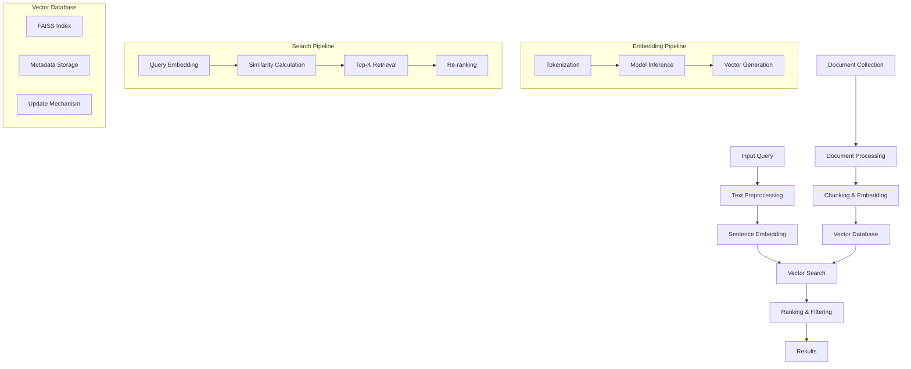

# 🔍 Semantic Search - Tìm kiếm ngữ nghĩa tài liệu

> **Mục tiêu**: Xây dựng hệ thống semantic search mạnh mẽ sử dụng SentenceTransformers và FAISS, với khả năng tìm kiếm dựa trên ý nghĩa thay vì từ khóa chính xác

## 🧠 **Information Retrieval Theory & Vector Search Fundamentals**

### **1. Information Retrieval Theory Framework**

**Lý thuyết cơ bản:**
- **Information Retrieval Models**: Boolean, Vector Space, Probabilistic, Language Models
- **Vector Search Theory**: Embedding spaces, similarity metrics, dimensionality reduction
- **Semantic Understanding**: Context representation, meaning extraction, query expansion
- **Evaluation Metrics**: Precision, Recall, F1, NDCG, MAP, MRR

**Information Retrieval Theory Framework:**

**1. IR Models Theory:**
```python
class InformationRetrievalTheory:
    """Theoretical framework cho Information Retrieval"""
    
    @staticmethod
    def explain_ir_models():
        """Explain fundamental IR models"""
        print("""
        **Information Retrieval Models Theory:**
        
        1. **Boolean Model:**
           - **Set Theory**: Documents as sets of terms
           - **Boolean Logic**: AND, OR, NOT operations
           - **Exact Match**: Binary relevance (relevant/not relevant)
           - **Limitations**: No ranking, no partial matching
        
        2. **Vector Space Model:**
           - **Vector Representation**: Documents as vectors in term space
           - **TF-IDF Weighting**: Term frequency × inverse document frequency
           - **Cosine Similarity**: Angle between document vectors
           - **Advantages**: Ranking, partial matching, continuous relevance
        
        3. **Probabilistic Model:**
           - **Probability Ranking**: P(relevance|document, query)
           - **Bayesian Framework**: Prior + likelihood
           - **Binary Independence**: Term independence assumption
           - **BM25**: Advanced probabilistic ranking function
        
        4. **Language Models:**
           - **Query Likelihood**: P(query|document)
           - **Dirichlet Smoothing**: Smoothing with collection statistics
           - **Jelinek-Mercer**: Interpolation smoothing
           - **Modern Approach**: Neural language models
        """)
    
    @staticmethod
    def demonstrate_ir_theory():
        """Demonstrate IR theory with examples"""
        
        import numpy as np
        import pandas as pd
        import matplotlib.pyplot as plt
        from sklearn.feature_extraction.text import TfidfVectorizer
        from sklearn.metrics.pairwise import cosine_similarity
        from sklearn.decomposition import PCA
        
        class IRTheoryAnalyzer:
            """Analyze Information Retrieval theory concepts"""
            
            def __init__(self):
                # Sample documents
                self.documents = [
                    "machine learning algorithms for data analysis",
                    "deep learning neural networks artificial intelligence",
                    "data science machine learning statistics",
                    "artificial intelligence machine learning applications",
                    "statistics probability data analysis methods",
                    "neural networks deep learning computer vision",
                    "data mining machine learning patterns",
                    "computer vision image processing deep learning"
                ]
                
                # Sample queries
                self.queries = [
                    "machine learning",
                    "deep learning",
                    "data analysis",
                    "artificial intelligence"
                ]
                
                # Initialize TF-IDF vectorizer
                self.vectorizer = TfidfVectorizer(
                    stop_words='english',
                    max_features=20,
                    ngram_range=(1, 2)
                )
            
            def demonstrate_boolean_model(self):
                """Demonstrate Boolean model concepts"""
                
                print("**Boolean Model Demonstration:**")
                
                # Create term-document matrix (binary)
                term_doc_matrix = []
                all_terms = set()
                
                for doc in self.documents:
                    terms = set(doc.lower().split())
                    all_terms.update(terms)
                    term_doc_matrix.append(terms)
                
                all_terms = sorted(list(all_terms))
                
                # Create binary matrix
                binary_matrix = []
                for doc_terms in term_doc_matrix:
                    row = [1 if term in doc_terms else 0 for term in all_terms]
                    binary_matrix.append(row)
                
                # Convert to DataFrame
                df = pd.DataFrame(binary_matrix, columns=all_terms, index=[f"Doc{i+1}" for i in range(len(self.documents))])
                
                print("\nBinary Term-Document Matrix:")
                print(df)
                
                # Boolean search examples
                print("\n**Boolean Search Examples:**")
                
                # AND search: "machine" AND "learning"
                machine_docs = [i for i, row in enumerate(binary_matrix) if row[all_terms.index('machine')] == 1]
                learning_docs = [i for i, row in enumerate(binary_matrix) if row[all_terms.index('learning')] == 1]
                machine_and_learning = set(machine_docs) & set(learning_docs)
                
                print(f"Query: 'machine' AND 'learning'")
                print(f"Results: Documents {[i+1 for i in machine_and_learning]}")
                
                # OR search: "deep" OR "neural"
                deep_docs = [i for i, row in enumerate(binary_matrix) if 'deep' in all_terms and row[all_terms.index('deep')] == 1]
                neural_docs = [i for i, row in enumerate(binary_matrix) if 'neural' in all_terms and row[all_terms.index('neural')] == 1]
                deep_or_neural = set(deep_docs) | set(neural_docs)
                
                print(f"Query: 'deep' OR 'neural'")
                print(f"Results: Documents {[i+1 for i in deep_or_neural]}")
                
                return df, binary_matrix, all_terms
            
            def demonstrate_vector_space_model(self):
                """Demonstrate Vector Space Model concepts"""
                
                print("\n**Vector Space Model Demonstration:**")
                
                # Create TF-IDF vectors
                tfidf_matrix = self.vectorizer.fit_transform(self.documents)
                feature_names = self.vectorizer.get_feature_names_out()
                
                print(f"TF-IDF Matrix Shape: {tfidf_matrix.shape}")
                print(f"Feature Names: {feature_names}")
                
                # Convert to dense array for analysis
                tfidf_dense = tfidf_matrix.toarray()
                
                # Create DataFrame
                df_tfidf = pd.DataFrame(tfidf_dense, columns=feature_names, 
                                       index=[f"Doc{i+1}" for i in range(len(self.documents))])
                
                print("\nTF-IDF Matrix (first 10 features):")
                print(df_tfidf.iloc[:, :10])
                
                # Calculate document similarities
                similarities = cosine_similarity(tfidf_dense)
                
                # Create similarity matrix
                sim_df = pd.DataFrame(similarities, 
                                    index=[f"Doc{i+1}" for i in range(len(self.documents))],
                                    columns=[f"Doc{i+1}" for i in range(len(self.documents))])
                
                print("\nDocument Similarity Matrix (Cosine):")
                print(sim_df.round(3))
                
                # Visualize document similarities
                plt.figure(figsize=(10, 8))
                plt.imshow(similarities, cmap='viridis', aspect='auto')
                plt.colorbar(label='Cosine Similarity')
                plt.title('Document Similarity Matrix')
                plt.xlabel('Document Index')
                plt.ylabel('Document Index')
                plt.xticks(range(len(self.documents)), [f"Doc{i+1}" for i in range(len(self.documents))])
                plt.yticks(range(len(self.documents)), [f"Doc{i+1}" for i in range(len(self.documents))])
                
                # Add similarity values
                for i in range(len(self.documents)):
                    for j in range(len(self.documents)):
                        plt.text(j, i, f'{similarities[i, j]:.2f}', 
                                ha='center', va='center', color='white', fontsize=8)
                
                plt.tight_layout()
                plt.show()
                
                return tfidf_matrix, similarities, df_tfidf
            
            def demonstrate_probabilistic_model(self):
                """Demonstrate Probabilistic Model concepts"""
                
                print("\n**Probabilistic Model Demonstration:**")
                
                # Calculate document frequencies
                doc_freq = {}
                total_docs = len(self.documents)
                
                for doc in self.documents:
                    terms = set(doc.lower().split())
                    for term in terms:
                        doc_freq[term] = doc_freq.get(term, 0) + 1
                
                # Calculate IDF values
                idf_values = {}
                for term, freq in doc_freq.items():
                    idf_values[term] = np.log(total_docs / freq)
                
                print("IDF Values (Inverse Document Frequency):")
                for term, idf in sorted(idf_values.items(), key=lambda x: x[1], reverse=True)[:15]:
                    print(f"  {term}: {idf:.3f}")
                
                # BM25 scoring (simplified)
                def calculate_bm25(query_terms, doc_terms, k1=1.2, b=0.75):
                    """Calculate BM25 score for a document"""
                    score = 0
                    doc_length = len(doc_terms)
                    avg_doc_length = np.mean([len(doc.split()) for doc in self.documents])
                    
                    for term in query_terms:
                        if term in doc_terms:
                            tf = doc_terms.count(term)
                            idf = idf_values.get(term, 0)
                            
                            # BM25 formula
                            numerator = tf * (k1 + 1)
                            denominator = tf + k1 * (1 - b + b * (doc_length / avg_doc_length))
                            
                            score += idf * (numerator / denominator)
                    
                    return score
                
                # Test BM25 scoring
                print("\n**BM25 Scoring Examples:**")
                
                for query in self.queries:
                    query_terms = query.lower().split()
                    print(f"\nQuery: '{query}'")
                    
                    scores = []
                    for i, doc in enumerate(self.documents):
                        doc_terms = doc.lower().split()
                        score = calculate_bm25(query_terms, doc_terms)
                        scores.append((i+1, score, doc))
                    
                    # Sort by score
                    scores.sort(key=lambda x: x[1], reverse=True)
                    
                    print("Ranked Results:")
                    for rank, (doc_id, score, doc_text) in enumerate(scores[:3], 1):
                        print(f"  {rank}. Doc{doc_id} (Score: {score:.3f}): {doc_text[:50]}...")
                
                return idf_values, doc_freq
            
            def demonstrate_language_models(self):
                """Demonstrate Language Model concepts"""
                
                print("\n**Language Model Demonstration:**")
                
                # Query likelihood model (simplified)
                def calculate_query_likelihood(query, doc, collection_stats):
                    """Calculate P(query|document) using unigram language model"""
                    
                    query_terms = query.lower().split()
                    doc_terms = doc.lower().split()
                    
                    # Document language model (with smoothing)
                    doc_length = len(doc_terms)
                    doc_term_freq = {}
                    
                    for term in doc_terms:
                        doc_term_freq[term] = doc_term_freq.get(term, 0) + 1
                    
                    # Dirichlet smoothing parameter
                    mu = 1000
                    
                    # Calculate likelihood
                    log_likelihood = 0
                    for term in query_terms:
                        # Document probability
                        doc_prob = (doc_term_freq.get(term, 0) + mu * collection_stats.get(term, 0)) / (doc_length + mu)
                        log_likelihood += np.log(doc_prob + 1e-10)
                    
                    return log_likelihood
                
                # Calculate collection statistics
                collection_stats = {}
                total_terms = 0
                
                for doc in self.documents:
                    terms = doc.lower().split()
                    total_terms += len(terms)
                    for term in terms:
                        collection_stats[term] = collection_stats.get(term, 0) + 1
                
                # Normalize collection probabilities
                for term in collection_stats:
                    collection_stats[term] /= total_terms
                
                print("Collection Term Probabilities (top 10):")
                sorted_stats = sorted(collection_stats.items(), key=lambda x: x[1], reverse=True)[:10]
                for term, prob in sorted_stats:
                    print(f"  {term}: {prob:.4f}")
                
                # Test query likelihood
                print("\n**Query Likelihood Scoring:**")
                
                for query in self.queries:
                    print(f"\nQuery: '{query}'")
                    
                    scores = []
                    for i, doc in enumerate(self.documents):
                        score = calculate_query_likelihood(query, doc, collection_stats)
                        scores.append((i+1, score, doc))
                    
                    # Sort by score
                    scores.sort(key=lambda x: x[1], reverse=True)
                    
                    print("Ranked Results:")
                    for rank, (doc_id, score, doc_text) in enumerate(scores[:3], 1):
                        print(f"  {rank}. Doc{doc_id} (Score: {score:.3f}): {doc_text[:50]}...")
                
                return collection_stats
            
            def visualize_ir_concepts(self):
                """Visualize IR concepts"""
                
                # Create TF-IDF vectors for visualization
                tfidf_matrix = self.vectorizer.fit_transform(self.documents)
                tfidf_dense = tfidf_matrix.toarray()
                
                # Apply PCA for 2D visualization
                pca = PCA(n_components=2)
                tfidf_2d = pca.fit_transform(tfidf_dense)
                
                # Create visualization
                fig, (ax1, ax2) = plt.subplots(1, 2, figsize=(15, 6))
                
                # Document space visualization
                ax1.scatter(tfidf_2d[:, 0], tfidf_2d[:, 1], s=100, alpha=0.7)
                for i, (x, y) in enumerate(tfidf_2d):
                    ax1.annotate(f'Doc{i+1}', (x, y), xytext=(5, 5), textcoords='offset points')
                
                ax1.set_xlabel('Principal Component 1')
                ax1.set_ylabel('Principal Component 2')
                ax1.set_title('Document Space (PCA)')
                ax1.grid(True, alpha=0.3)
                
                # Feature importance
                feature_importance = np.abs(pca.components_[0])
                top_features_idx = np.argsort(feature_importance)[-10:]
                top_features = [self.vectorizer.get_feature_names_out()[i] for i in top_features_idx]
                top_importance = feature_importance[top_features_idx]
                
                ax2.barh(range(len(top_features)), top_importance)
                ax2.set_yticks(range(len(top_features)))
                ax2.set_yticklabels(top_features)
                ax2.set_xlabel('Feature Importance (PC1)')
                ax2.set_title('Top Features by Principal Component 1')
                ax2.grid(True, alpha=0.3)
                
                plt.tight_layout()
                plt.show()
                
                return tfidf_2d, pca
        
        # Demonstrate IR theory
        ir_theory = InformationRetrievalTheory()
        ir_theory.explain_ir_models()
        
        # Demonstrate IR analysis
        ir_analyzer = IRTheoryAnalyzer()
        
        print("**Information Retrieval Theory Demonstration:**")
        
        # Demonstrate different IR models
        boolean_results = ir_analyzer.demonstrate_boolean_model()
        vector_results = ir_analyzer.demonstrate_vector_space_model()
        probabilistic_results = ir_analyzer.demonstrate_probabilistic_model()
        language_results = ir_analyzer.demonstrate_language_models()
        
        # Visualize concepts
        visualization_results = ir_analyzer.visualize_ir_concepts()
        
        return ir_analyzer, boolean_results, vector_results, probabilistic_results, language_results, visualization_results

# Demonstrate IR theory
ir_theory = InformationRetrievalTheory()
ir_theory.explain_ir_models()

# Demonstrate IR analysis
ir_analyzer, boolean_results, vector_results, probabilistic_results, language_results, visualization_results = ir_theory.demonstrate_ir_theory()
```

**2. Vector Search Theory:**
```python
class VectorSearchTheory:
    """Theoretical framework cho Vector Search"""
    
    @staticmethod
    def explain_vector_search():
        """Explain vector search fundamentals"""
        print("""
        **Vector Search Theory:**
        
        1. **Embedding Spaces:**
           - **Vector Representation**: High-dimensional continuous spaces
           - **Semantic Similarity**: Geometric distance = semantic similarity
           - **Dimensionality**: Trade-off between expressiveness and efficiency
        
        2. **Similarity Metrics:**
           - **Cosine Similarity**: Angle between vectors (direction)
           - **Euclidean Distance**: L2 norm (magnitude + direction)
           - **Manhattan Distance**: L1 norm (city block distance)
           - **Dot Product**: Raw similarity (magnitude sensitive)
        
        3. **Indexing Strategies:**
           - **Exact Search**: Linear scan, exhaustive search
           - **Approximate Search**: Hashing, tree structures, quantization
           - **Trade-offs**: Accuracy vs speed, memory vs performance
        """)
    
    @staticmethod
    def demonstrate_vector_search():
        """Demonstrate vector search concepts"""
        
        import numpy as np
        import matplotlib.pyplot as plt
        from sklearn.metrics.pairwise import cosine_similarity, euclidean_distances
        from sklearn.manifold import TSNE
        
        class VectorSearchAnalyzer:
            """Analyze vector search properties"""
            
            def __init__(self):
                # Create synthetic embeddings
                np.random.seed(42)
                self.num_docs = 100
                self.embedding_dim = 128
                
                # Generate embeddings with some structure
                self.embeddings = np.random.randn(self.num_docs, self.embedding_dim)
                
                # Add some clustering structure
                cluster_centers = np.array([
                    [1, 1, 1, 1] + [0] * (self.embedding_dim - 4),  # Cluster 1
                    [-1, -1, -1, -1] + [0] * (self.embedding_dim - 4),  # Cluster 2
                    [0, 0, 1, -1] + [0] * (self.embedding_dim - 4),  # Cluster 3
                ])
                
                # Assign documents to clusters
                cluster_assignments = np.random.choice(3, self.num_docs)
                for i, cluster in enumerate(cluster_assignments):
                    self.embeddings[i] += cluster_centers[cluster] * 0.5
                
                # Normalize embeddings
                self.embeddings = self.embeddings / np.linalg.norm(self.embeddings, axis=1, keepdims=True)
            
            def demonstrate_similarity_metrics(self):
                """Demonstrate different similarity metrics"""
                
                print("**Similarity Metrics Demonstration:**")
                
                # Select a query document
                query_idx = 0
                query_embedding = self.embeddings[query_idx]
                
                # Calculate similarities using different metrics
                similarities = {}
                
                # Cosine similarity
                cos_sim = cosine_similarity([query_embedding], self.embeddings)[0]
                similarities['cosine'] = cos_sim
                
                # Euclidean distance
                euclidean_dist = euclidean_distances([query_embedding], self.embeddings)[0]
                similarities['euclidean'] = euclidean_dist
                
                # Manhattan distance
                manhattan_dist = np.sum(np.abs(self.embeddings - query_embedding), axis=1)
                similarities['manhattan'] = manhattan_dist
                
                # Dot product
                dot_product = np.dot(self.embeddings, query_embedding)
                similarities['dot_product'] = dot_product
                
                # Find top similar documents for each metric
                print(f"\nQuery Document: {query_idx}")
                print("Top 5 Similar Documents:")
                
                for metric_name, metric_values in similarities.items():
                    if metric_name in ['euclidean', 'manhattan']:
                        # For distances, lower is better
                        top_indices = np.argsort(metric_values)[:5]
                        top_values = metric_values[top_indices]
                    else:
                        # For similarities, higher is better
                        top_indices = np.argsort(metric_values)[::-1][:5]
                        top_values = metric_values[top_indices]
                    
                    print(f"\n{metric_name.upper()}:")
                    for rank, (idx, val) in enumerate(zip(top_indices, top_values), 1):
                        print(f"  {rank}. Doc{idx}: {val:.4f}")
                
                return similarities
            
            def demonstrate_indexing_strategies(self):
                """Demonstrate different indexing strategies"""
                
                print("\n**Indexing Strategies Demonstration:**")
                
                # 1. Exact Search (Linear Scan)
                query_idx = 0
                query_embedding = self.embeddings[query_idx]
                
                print("1. Exact Search (Linear Scan):")
                start_time = time.time()
                
                # Calculate all similarities
                cos_sim = cosine_similarity([query_embedding], self.embeddings)[0]
                top_k_exact = np.argsort(cos_sim)[::-1][:10]
                
                exact_time = time.time() - start_time
                print(f"  Time: {exact_time:.6f}s")
                print(f"  Top 5 results: {top_k_exact[:5]}")
                
                # 2. Approximate Search (Random Sampling)
                print("\n2. Approximate Search (Random Sampling):")
                start_time = time.time()
                
                # Sample subset of documents
                sample_size = 20
                sample_indices = np.random.choice(self.num_docs, sample_size, replace=False)
                sample_embeddings = self.embeddings[sample_indices]
                
                # Search in sample
                cos_sim_sample = cosine_similarity([query_embedding], sample_embeddings)[0]
                top_k_sample = sample_indices[np.argsort(cos_sim_sample)[::-1][:5]]
                
                sample_time = time.time() - start_time
                print(f"  Time: {sample_time:.6f}s")
                print(f"  Sample size: {sample_size}")
                print(f"  Top 5 results: {top_k_sample}")
                
                # 3. Clustering-based Search
                print("\n3. Clustering-based Search:")
                start_time = time.time()
                
                # Simple k-means clustering
                from sklearn.cluster import KMeans
                kmeans = KMeans(n_clusters=5, random_state=42)
                cluster_labels = kmeans.fit_predict(self.embeddings)
                
                # Find query cluster
                query_cluster = cluster_labels[query_idx]
                cluster_docs = np.where(cluster_labels == query_cluster)[0]
                
                # Search within cluster
                cluster_embeddings = self.embeddings[cluster_docs]
                cos_sim_cluster = cosine_similarity([query_embedding], cluster_embeddings)[0]
                top_k_cluster = cluster_docs[np.argsort(cos_sim_cluster)[::-1][:5]]
                
                cluster_time = time.time() - start_time
                print(f"  Time: {cluster_time:.6f}s")
                print(f"  Cluster size: {len(cluster_docs)}")
                print(f"  Top 5 results: {top_k_cluster}")
                
                # Performance comparison
                print(f"\n**Performance Comparison:**")
                print(f"  Exact Search: {exact_time:.6f}s (100% accuracy)")
                print(f"  Random Sampling: {sample_time:.6f}s (~{sample_size/self.num_docs*100:.1f}% coverage)")
                print(f"  Clustering: {cluster_time:.6f}s (~{len(cluster_docs)/self.num_docs*100:.1f}% coverage)")
                
                return {
                    'exact': {'time': exact_time, 'results': top_k_exact},
                    'sampling': {'time': sample_time, 'results': top_k_sample, 'sample_size': sample_size},
                    'clustering': {'time': cluster_time, 'results': top_k_cluster, 'cluster_size': len(cluster_docs)}
                }
            
            def demonstrate_dimensionality_effects(self):
                """Demonstrate effects of dimensionality on search"""
                
                print("\n**Dimensionality Effects Demonstration:**")
                
                # Test different embedding dimensions
                dimensions = [16, 32, 64, 128, 256]
                search_times = []
                similarity_variances = []
                
                for dim in dimensions:
                    # Generate embeddings with specified dimension
                    embeddings_dim = np.random.randn(self.num_docs, dim)
                    embeddings_dim = embeddings_dim / np.linalg.norm(embeddings_dim, axis=1, keepdims=True)
                    
                    # Measure search time
                    query_embedding = embeddings_dim[0]
                    start_time = time.time()
                    
                    cos_sim = cosine_similarity([query_embedding], embeddings_dim)[0]
                    top_k = np.argsort(cos_sim)[::-1][:10]
                    
                    search_time = time.time() - start_time
                    search_times.append(search_time)
                    
                    # Calculate similarity variance (measure of discrimination)
                    similarity_variance = np.var(cos_sim)
                    similarity_variances.append(similarity_variance)
                    
                    print(f"  Dimension {dim}: Time={search_time:.6f}s, Variance={similarity_variance:.4f}")
                
                # Visualize results
                fig, (ax1, ax2) = plt.subplots(1, 2, figsize=(12, 5))
                
                # Search time vs dimension
                ax1.plot(dimensions, search_times, 'bo-', linewidth=2, markersize=8)
                ax1.set_xlabel('Embedding Dimension')
                ax1.set_ylabel('Search Time (seconds)')
                ax1.set_title('Search Time vs Dimension')
                ax1.grid(True, alpha=0.3)
                
                # Similarity variance vs dimension
                ax2.plot(dimensions, similarity_variances, 'ro-', linewidth=2, markersize=8)
                ax2.set_xlabel('Embedding Dimension')
                ax2.set_ylabel('Similarity Variance')
                ax2.set_title('Discrimination Power vs Dimension')
                ax2.grid(True, alpha=0.3)
                
                plt.tight_layout()
                plt.show()
                
                return dimensions, search_times, similarity_variances
            
            def visualize_embedding_space(self):
                """Visualize embedding space structure"""
                
                # Apply t-SNE for 2D visualization
                tsne = TSNE(n_components=2, random_state=42, perplexity=30)
                embeddings_2d = tsne.fit_transform(self.embeddings)
                
                # Create visualization
                fig, (ax1, ax2) = plt.subplots(1, 2, figsize=(15, 6))
                
                # 2D embedding space
                scatter = ax1.scatter(embeddings_2d[:, 0], embeddings_2d[:, 1], 
                                    c=range(self.num_docs), cmap='viridis', alpha=0.7)
                ax1.set_xlabel('t-SNE Component 1')
                ax1.set_ylabel('t-SNE Component 2')
                ax1.set_title('Document Embedding Space (t-SNE)')
                ax1.grid(True, alpha=0.3)
                
                # Add colorbar
                cbar = plt.colorbar(scatter, ax=ax1)
                cbar.set_label('Document Index')
                
                # Similarity distribution
                # Calculate pairwise similarities
                cos_sim_matrix = cosine_similarity(self.embeddings)
                similarities = cos_sim_matrix[np.triu_indices_from(cos_sim_matrix, k=1)]
                
                ax2.hist(similarities, bins=30, alpha=0.7, edgecolor='black')
                ax2.set_xlabel('Cosine Similarity')
                ax2.set_ylabel('Frequency')
                ax2.set_title('Distribution of Document Similarities')
                ax2.grid(True, alpha=0.3)
                
                # Add statistics
                mean_sim = np.mean(similarities)
                std_sim = np.std(similarities)
                ax2.axvline(mean_sim, color='red', linestyle='--', 
                           label=f'Mean: {mean_sim:.3f}')
                ax2.axvline(mean_sim + std_sim, color='orange', linestyle='--', 
                           label=f'+1σ: {mean_sim + std_sim:.3f}')
                ax2.axvline(mean_sim - std_sim, color='orange', linestyle='--', 
                           label=f'-1σ: {mean_sim - std_sim:.3f}')
                ax2.legend()
                
                plt.tight_layout()
                plt.show()
                
                return embeddings_2d, similarities
        
        # Demonstrate vector search theory
        vector_theory = VectorSearchTheory()
        vector_theory.explain_vector_search()
        
        # Demonstrate vector search analysis
        vector_analyzer = VectorSearchAnalyzer()
        
        print("**Vector Search Theory Demonstration:**")
        
        # Demonstrate different aspects
        similarity_results = vector_analyzer.demonstrate_similarity_metrics()
        indexing_results = vector_analyzer.demonstrate_indexing_strategies()
        dimensionality_results = vector_analyzer.demonstrate_dimensionality_effects()
        visualization_results = vector_analyzer.visualize_embedding_space()
        
        return vector_analyzer, similarity_results, indexing_results, dimensionality_results, visualization_results

# Demonstrate vector search theory
vector_theory = VectorSearchTheory()
vector_theory.explain_vector_search()

# Demonstrate vector search analysis
vector_analyzer, similarity_results, indexing_results, dimensionality_results, visualization_results = vector_theory.demonstrate_vector_search()
```

**Tài liệu tham khảo chuyên sâu:**
- **Information Retrieval**: [Introduction to Information Retrieval](https://nlp.stanford.edu/IR-book/)
- **Vector Search**: [Efficient Similarity Search in Vector Spaces](https://arxiv.org/abs/1804.01880)
- **BM25**: [The Probabilistic Relevance Framework](https://www.cl.cam.ac.uk/techreports/UCAM-CL-TR-356.pdf)
- **Language Models**: [A Study of Smoothing Methods for Language Models](https://aclanthology.org/P96-1041.pdf)

## 🎯 **Tổng quan Semantic Search**

Semantic Search (tìm kiếm ngữ nghĩa) là kỹ thuật tìm kiếm dựa trên ý nghĩa và ngữ cảnh của nội dung, thay vì chỉ dựa trên từ khóa chính xác. Điều này cho phép tìm kiếm chính xác hơn và trả về kết quả liên quan ngay cả khi không có từ khóa chính xác.

### **🚀 Đặc điểm chính**
- **Meaning-based**: Tìm kiếm dựa trên ý nghĩa
- **Context-aware**: Hiểu ngữ cảnh của truy vấn
- **Multilingual**: Hỗ trợ nhiều ngôn ngữ
- **Scalable**: Xử lý được lượng dữ liệu lớn

## 🏗️ **Kiến trúc Semantic Search System**



## 🔧 **Implementation với SentenceTransformers + FAISS**

### **📦 Dependencies và Setup**

```python
# requirements.txt
sentence-transformers>=2.2.0
faiss-cpu>=1.7.0  # or faiss-gpu for GPU support
numpy>=1.21.0
pandas>=1.3.0
scikit-learn>=1.0.0
tqdm>=4.62.0
matplotlib>=3.5.0
seaborn>=0.11.0
```

### **🏗️ Core Semantic Search System**

```python
import numpy as np
import pandas as pd
import faiss
from sentence_transformers import SentenceTransformer
from sklearn.metrics.pairwise import cosine_similarity
from typing import List, Dict, Tuple, Optional
import pickle
import json
from pathlib import Path
import logging

# Setup logging
logging.basicConfig(level=logging.INFO)
logger = logging.getLogger(__name__)

class DocumentChunker:
    """Chunk documents thành các đoạn nhỏ cho embedding"""
    
    def __init__(self, chunk_size: int = 512, chunk_overlap: int = 50):
        self.chunk_size = chunk_size
        self.chunk_overlap = chunk_overlap
    
    def chunk_text(self, text: str) -> List[str]:
        """Chunk text thành các đoạn nhỏ"""
        if len(text) <= self.chunk_size:
            return [text]
        
        chunks = []
        start = 0
        
        while start < len(text):
            end = start + self.chunk_size
            
            # Tìm vị trí kết thúc phù hợp (kết thúc câu)
            if end < len(text):
                # Tìm dấu câu gần nhất
                for i in range(end, max(start, end - 100), -1):
                    if text[i] in '.!?':
                        end = i + 1
                        break
            
            chunk = text[start:end].strip()
            if chunk:
                chunks.append(chunk)
            
            # Tính vị trí bắt đầu cho chunk tiếp theo
            start = end - self.chunk_overlap
            if start >= len(text):
                break
        
        return chunks
    
    def chunk_documents(self, documents: List[Dict]) -> List[Dict]:
        """Chunk nhiều documents"""
        chunked_docs = []
        
        for doc in documents:
            doc_id = doc.get('id', f"doc_{len(chunked_docs)}")
            text = doc.get('text', '')
            metadata = doc.get('metadata', {})
            
            chunks = self.chunk_text(text)
            
            for i, chunk in enumerate(chunks):
                chunked_docs.append({
                    'id': f"{doc_id}_chunk_{i}",
                    'text': chunk,
                    'metadata': {
                        **metadata,
                        'chunk_index': i,
                        'total_chunks': len(chunks),
                        'original_doc_id': doc_id
                    }
                })
        
        return chunked_docs

class SemanticSearchEngine:
    """Engine tìm kiếm ngữ nghĩa chính"""
    
    def __init__(self, model_name: str = 'all-MiniLM-L6-v2', device: str = 'cpu'):
        self.model_name = model_name
        self.device = device
        
        # Initialize sentence transformer
        logger.info(f"Loading model: {model_name}")
        self.model = SentenceTransformer(model_name, device=device)
        
        # Initialize FAISS index
        self.dimension = self.model.get_sentence_embedding_dimension()
        self.index = faiss.IndexFlatIP(self.dimension)  # Inner Product for cosine similarity
        
        # Document storage
        self.documents = []
        self.document_embeddings = None
        
        logger.info(f"Model loaded with dimension: {self.dimension}")
    
    def add_documents(self, documents: List[Dict], chunk: bool = True):
        """Thêm documents vào search engine"""
        logger.info(f"Adding {len(documents)} documents")
        
        if chunk:
            chunker = DocumentChunker()
            documents = chunker.chunk_documents(documents)
        
        # Extract texts
        texts = [doc['text'] for doc in documents]
        
        # Generate embeddings
        logger.info("Generating embeddings...")
        embeddings = self.model.encode(texts, show_progress_bar=True, convert_to_numpy=True)
        
        # Add to FAISS index
        self.index.add(embeddings.astype('float32'))
        
        # Store documents
        self.documents.extend(documents)
        self.document_embeddings = embeddings
        
        logger.info(f"Added {len(documents)} documents to index")
    
    def search(self, query: str, top_k: int = 10, threshold: float = 0.5) -> List[Dict]:
        """Tìm kiếm documents liên quan"""
        # Generate query embedding
        query_embedding = self.model.encode([query], convert_to_numpy=True)
        
        # Search in FAISS
        scores, indices = self.index.search(query_embedding.astype('float32'), top_k)
        
        # Format results
        results = []
        for score, idx in zip(scores[0], indices[0]):
            if score >= threshold:
                doc = self.documents[idx].copy()
                doc['similarity_score'] = float(score)
                doc['rank'] = len(results) + 1
                results.append(doc)
        
        return results
    
    def batch_search(self, queries: List[str], top_k: int = 10) -> List[List[Dict]]:
        """Tìm kiếm batch cho nhiều queries"""
        # Generate embeddings for all queries
        query_embeddings = self.model.encode(queries, show_progress_bar=True, convert_to_numpy=True)
        
        # Batch search
        scores, indices = self.index.search(query_embeddings.astype('float32'), top_k)
        
        # Format results
        all_results = []
        for query_idx, (query_scores, query_indices) in enumerate(zip(scores, indices)):
            query_results = []
            for score, idx in zip(query_scores, query_indices):
                doc = self.documents[idx].copy()
                doc['similarity_score'] = float(score)
                doc['rank'] = len(query_results) + 1
                query_results.append(doc)
            all_results.append(query_results)
        
        return all_results
    
    def semantic_similarity(self, text1: str, text2: str) -> float:
        """Tính similarity giữa hai texts"""
        embeddings = self.model.encode([text1, text2], convert_to_numpy=True)
        similarity = cosine_similarity(embeddings[0:1], embeddings[1:2])[0][0]
        return float(similarity)
    
    def find_similar_documents(self, document_id: str, top_k: int = 5) -> List[Dict]:
        """Tìm documents tương tự với document cho trước"""
        # Find document
        doc_idx = None
        for i, doc in enumerate(self.documents):
            if doc['id'] == document_id:
                doc_idx = i
                break
        
        if doc_idx is None:
            raise ValueError(f"Document {document_id} not found")
        
        # Get document embedding
        doc_embedding = self.document_embeddings[doc_idx:doc_idx+1]
        
        # Search similar documents
        scores, indices = self.index.search(doc_embedding.astype('float32'), top_k + 1)
        
        # Format results (exclude the document itself)
        results = []
        for score, idx in zip(scores[0][1:], indices[0][1:]):  # Skip first (self)
            doc = self.documents[idx].copy()
            doc['similarity_score'] = float(score)
            doc['rank'] = len(results) + 1
            results.append(doc)
        
        return results
    
    def save_index(self, filepath: str):
        """Lưu index và documents"""
        # Save FAISS index
        faiss.write_index(self.index, f"{filepath}.faiss")
        
        # Save documents
        with open(f"{filepath}.json", 'w', encoding='utf-8') as f:
            json.dump(self.documents, f, ensure_ascii=False, indent=2)
        
        logger.info(f"Index saved to {filepath}")
    
    def load_index(self, filepath: str):
        """Load index và documents"""
        # Load FAISS index
        self.index = faiss.read_index(f"{filepath}.faiss")
        
        # Load documents
        with open(f"{filepath}.json", 'r', encoding='utf-8') as f:
            self.documents = json.load(f)
        
        logger.info(f"Index loaded from {filepath}")

class AdvancedSemanticSearch(SemanticSearchEngine):
    """Advanced semantic search với additional features"""
    
    def __init__(self, model_name: str = 'all-MiniLM-L6-v2', device: str = 'cpu'):
        super().__init__(model_name, device)
        self.query_history = []
        self.search_analytics = {}
    
    def semantic_search_with_filters(self, query: str, filters: Dict, top_k: int = 10) -> List[Dict]:
        """Tìm kiếm với filters"""
        # Get basic search results
        results = self.search(query, top_k=top_k * 2)  # Get more results for filtering
        
        # Apply filters
        filtered_results = []
        for result in results:
            if self._apply_filters(result, filters):
                filtered_results.append(result)
                if len(filtered_results) >= top_k:
                    break
        
        return filtered_results
    
    def _apply_filters(self, document: Dict, filters: Dict) -> bool:
        """Apply filters cho document"""
        for key, value in filters.items():
            if key in document.get('metadata', {}):
                doc_value = document['metadata'][key]
                
                # Handle different filter types
                if isinstance(value, (list, tuple)):
                    if doc_value not in value:
                        return False
                elif isinstance(value, dict):
                    # Range filter
                    if 'min' in value and doc_value < value['min']:
                        return False
                    if 'max' in value and doc_value > value['max']:
                        return False
                else:
                    if doc_value != value:
                        return False
        
        return True
    
    def hybrid_search(self, query: str, keyword_boost: float = 0.3, top_k: int = 10) -> List[Dict]:
        """Hybrid search: semantic + keyword matching"""
        # Semantic search
        semantic_results = self.search(query, top_k=top_k)
        
        # Keyword search (simple implementation)
        keyword_results = self._keyword_search(query, top_k=top_k)
        
        # Combine and re-rank
        combined_results = self._combine_results(semantic_results, keyword_results, keyword_boost)
        
        return combined_results[:top_k]
    
    def _keyword_search(self, query: str, top_k: int = 10) -> List[Dict]:
        """Simple keyword search"""
        query_words = set(query.lower().split())
        keyword_results = []
        
        for doc in self.documents:
            doc_words = set(doc['text'].lower().split())
            overlap = len(query_words.intersection(doc_words))
            
            if overlap > 0:
                score = overlap / len(query_words)
                keyword_results.append({
                    **doc,
                    'keyword_score': score,
                    'similarity_score': score
                })
        
        # Sort by keyword score
        keyword_results.sort(key=lambda x: x['keyword_score'], reverse=True)
        return keyword_results[:top_k]
    
    def _combine_results(self, semantic_results: List[Dict], keyword_results: List[Dict], 
                        keyword_boost: float) -> List[Dict]:
        """Combine semantic và keyword results"""
        # Create document lookup
        doc_lookup = {}
        
        # Add semantic results
        for result in semantic_results:
            doc_id = result['id']
            doc_lookup[doc_id] = {
                'document': result,
                'semantic_score': result['similarity_score'],
                'keyword_score': 0.0
            }
        
        # Add keyword results
        for result in keyword_results:
            doc_id = result['id']
            if doc_id in doc_lookup:
                doc_lookup[doc_id]['keyword_score'] = result['keyword_score']
            else:
                doc_lookup[doc_id] = {
                    'document': result,
                    'semantic_score': 0.0,
                    'keyword_score': result['keyword_score']
                }
        
        # Calculate combined scores
        combined_results = []
        for doc_id, scores in doc_lookup.items():
            combined_score = (1 - keyword_boost) * scores['semantic_score'] + \
                           keyword_boost * scores['keyword_score']
            
            result = scores['document'].copy()
            result['combined_score'] = combined_score
            result['semantic_score'] = scores['semantic_score']
            result['keyword_score'] = scores['keyword_score']
            combined_results.append(result)
        
        # Sort by combined score
        combined_results.sort(key=lambda x: x['combined_score'], reverse=True)
        return combined_results
    
    def get_search_analytics(self) -> Dict:
        """Get search analytics"""
        return {
            'total_searches': len(self.query_history),
            'total_documents': len(self.documents),
            'index_dimension': self.dimension,
            'model_name': self.model_name,
            'recent_queries': self.query_history[-10:] if self.query_history else []
        }

# Example usage
def demonstrate_semantic_search():
    """Demonstrate semantic search functionality"""
    print("🔍 Semantic Search Demo")
    print("=" * 50)
    
    # Initialize search engine
    search_engine = AdvancedSemanticSearch(model_name='all-MiniLM-L6-v2')
    
    # Sample documents
    sample_documents = [
        {
            'id': 'doc_1',
            'text': 'Machine learning is a subset of artificial intelligence that focuses on algorithms and statistical models.',
            'metadata': {'category': 'AI', 'difficulty': 'intermediate'}
        },
        {
            'id': 'doc_2', 
            'text': 'Deep learning uses neural networks with multiple layers to process complex patterns in data.',
            'metadata': {'category': 'AI', 'difficulty': 'advanced'}
        },
        {
            'id': 'doc_3',
            'text': 'Natural language processing helps computers understand and generate human language.',
            'metadata': {'category': 'NLP', 'difficulty': 'intermediate'}
        },
        {
            'id': 'doc_4',
            'text': 'Computer vision enables machines to interpret and understand visual information from images.',
            'metadata': {'category': 'CV', 'difficulty': 'advanced'}
        }
    ]
    
    # Add documents
    search_engine.add_documents(sample_documents)
    
    # Test searches
    test_queries = [
        "How does AI learn from data?",
        "What is neural network processing?",
        "Computer understanding of images",
        "Language generation by machines"
    ]
    
    print("📚 Sample Documents Added:")
    for doc in sample_documents:
        print(f"  - {doc['id']}: {doc['text'][:60]}...")
    
    print("\n🔍 Search Results:")
    for query in test_queries:
        print(f"\nQuery: '{query}'")
        results = search_engine.search(query, top_k=3)
        
        for result in results:
            print(f"  {result['rank']}. {result['id']} (Score: {result['similarity_score']:.3f})")
            print(f"     {result['text'][:80]}...")
    
    # Test filters
    print("\n🔍 Search with Filters:")
    filters = {'category': 'AI', 'difficulty': 'intermediate'}
    filtered_results = search_engine.semantic_search_with_filters(
        "learning algorithms", filters, top_k=5
    )
    
    print(f"Results with filters {filters}:")
    for result in filtered_results:
        print(f"  - {result['id']}: {result['text'][:60]}...")
    
    # Test hybrid search
    print("\n🔍 Hybrid Search Results:")
    hybrid_results = search_engine.hybrid_search("neural networks", keyword_boost=0.4)
    
    for result in hybrid_results[:3]:
        print(f"  - {result['id']}: Combined Score: {result['combined_score']:.3f}")
    
    return search_engine

if __name__ == "__main__":
    search_engine = demonstrate_semantic_search()
```

## 🚀 **CLI Interface**

### **📱 Command Line Interface**

```python
import argparse
import json
from pathlib import Path
import sys

def create_cli():
    """Create CLI interface cho semantic search"""
    parser = argparse.ArgumentParser(description='Semantic Search CLI')
    subparsers = parser.add_subparsers(dest='command', help='Available commands')
    
    # Index documents command
    index_parser = subparsers.add_parser('index', help='Index documents')
    index_parser.add_argument('--input', '-i', required=True, help='Input documents file (JSON)')
    index_parser.add_argument('--output', '-o', required=True, help='Output index directory')
    index_parser.add_argument('--model', '-m', default='all-MiniLM-L6-v2', help='Model name')
    index_parser.add_argument('--chunk', action='store_true', help='Enable document chunking')
    
    # Search command
    search_parser = subparsers.add_parser('search', help='Search documents')
    search_parser.add_argument('--index', '-i', required=True, help='Index directory')
    search_parser.add_argument('--query', '-q', required=True, help='Search query')
    search_parser.add_argument('--top-k', '-k', type=int, default=10, help='Number of results')
    search_parser.add_argument('--threshold', '-t', type=float, default=0.5, help='Similarity threshold')
    
    # Batch search command
    batch_parser = subparsers.add_parser('batch-search', help='Batch search multiple queries')
    batch_parser.add_argument('--index', '-i', required=True, help='Index directory')
    batch_parser.add_argument('--queries', '-q', required=True, help='Queries file (one per line)')
    batch_parser.add_argument('--output', '-o', required=True, help='Output results file')
    batch_parser.add_argument('--top-k', '-k', type=int, default=10, help='Number of results per query')
    
    # Interactive search command
    interactive_parser = subparsers.add_parser('interactive', help='Interactive search mode')
    interactive_parser.add_argument('--index', '-i', required=True, help='Index directory')
    
    return parser

def index_documents(args):
    """Index documents command"""
    print(f"🔍 Indexing documents from {args.input}")
    
    # Load documents
    with open(args.input, 'r', encoding='utf-8') as f:
        documents = json.load(f)
    
    # Initialize search engine
    search_engine = AdvancedSemanticSearch(model_name=args.model)
    
    # Add documents
    search_engine.add_documents(documents, chunk=args.chunk)
    
    # Save index
    output_path = Path(args.output)
    output_path.mkdir(parents=True, exist_ok=True)
    
    search_engine.save_index(str(output_path / "semantic_index"))
    
    print(f"✅ Indexed {len(documents)} documents to {args.output}")
    print(f"📊 Index statistics: {search_engine.get_search_analytics()}")

def search_documents(args):
    """Search documents command"""
    print(f"🔍 Searching in index: {args.index}")
    
    # Load search engine
    search_engine = AdvancedSemanticSearch()
    search_engine.load_index(str(Path(args.index) / "semantic_index"))
    
    # Perform search
    results = search_engine.search(args.query, top_k=args.top_k, threshold=args.threshold)
    
    # Display results
    print(f"\n🔍 Search Results for: '{args.query}'")
    print(f"📊 Found {len(results)} results (threshold: {args.threshold})")
    print("-" * 80)
    
    for i, result in enumerate(results, 1):
        print(f"{i}. {result['id']} (Score: {result['similarity_score']:.3f})")
        print(f"   Text: {result['text'][:100]}...")
        if 'metadata' in result:
            print(f"   Metadata: {result['metadata']}")
        print()

def batch_search(args):
    """Batch search command"""
    print(f"🔍 Batch searching in index: {args.index}")
    
    # Load search engine
    search_engine = AdvancedSemanticSearch()
    search_engine.load_index(str(Path(args.index) / "semantic_index"))
    
    # Load queries
    with open(args.queries, 'r', encoding='utf-8') as f:
        queries = [line.strip() for line in f if line.strip()]
    
    print(f"📝 Processing {len(queries)} queries...")
    
    # Perform batch search
    all_results = search_engine.batch_search(queries, top_k=args.top_k)
    
    # Save results
    results_data = {
        'queries': queries,
        'results': all_results,
        'summary': {
            'total_queries': len(queries),
            'total_results': sum(len(r) for r in all_results),
            'average_results_per_query': sum(len(r) for r in all_results) / len(queries)
        }
    }
    
    with open(args.output, 'w', encoding='utf-8') as f:
        json.dump(results_data, f, ensure_ascii=False, indent=2)
    
    print(f"✅ Batch search completed. Results saved to {args.output}")
    print(f"📊 Summary: {results_data['summary']}")

def interactive_search(args):
    """Interactive search mode"""
    print(f"🔍 Interactive search mode - Index: {args.index}")
    print("💡 Type 'quit' to exit, 'help' for commands")
    
    # Load search engine
    search_engine = AdvancedSemanticSearch()
    search_engine.load_index(str(Path(args.index) / "semantic_index"))
    
    while True:
        try:
            query = input("\n🔍 Enter search query: ").strip()
            
            if query.lower() == 'quit':
                print("👋 Goodbye!")
                break
            elif query.lower() == 'help':
                print("Available commands:")
                print("  - Type any search query to search")
                print("  - 'quit' to exit")
                print("  - 'help' to show this help")
                continue
            elif not query:
                continue
            
            # Perform search
            results = search_engine.search(query, top_k=5)
            
            if results:
                print(f"\n📊 Found {len(results)} results:")
                for i, result in enumerate(results, 1):
                    print(f"{i}. {result['id']} (Score: {result['similarity_score']:.3f})")
                    print(f"   {result['text'][:80]}...")
            else:
                print("❌ No results found")
                
        except KeyboardInterrupt:
            print("\n👋 Goodbye!")
            break
        except Exception as e:
            print(f"❌ Error: {e}")

def main():
    """Main CLI function"""
    parser = create_cli()
    args = parser.parse_args()
    
    if not args.command:
        parser.print_help()
        return
    
    try:
        if args.command == 'index':
            index_documents(args)
        elif args.command == 'search':
            search_documents(args)
        elif args.command == 'batch-search':
            batch_search(args)
        elif args.command == 'interactive':
            interactive_search(args)
        else:
            print(f"❌ Unknown command: {args.command}")
            
    except Exception as e:
        print(f"❌ Error: {e}")
        sys.exit(1)

if __name__ == "__main__":
    main()
```

## 📊 **Performance Optimization**

### **⚡ Speed Optimization**

```python
class OptimizedSemanticSearch(SemanticSearchEngine):
    """Optimized version với performance improvements"""
    
    def __init__(self, model_name: str = 'all-MiniLM-L6-v2', device: str = 'cpu'):
        super().__init__(model_name, device)
        
        # Use more efficient FAISS index
        self.index = faiss.IndexIVFFlat(
            faiss.IndexFlatIP(self.dimension), 
            self.dimension, 
            100  # number of clusters
        )
        
        # Enable quantization
        self.quantizer = faiss.IndexFlatIP(self.dimension)
        self.index = faiss.IndexIVFPQ(
            self.quantizer, 
            self.dimension, 
            100,  # number of clusters
            8,    # number of sub-vectors
            8     # bits per sub-vector
        )
    
    def add_documents(self, documents: List[Dict], chunk: bool = True):
        """Optimized document addition"""
        if chunk:
            chunker = DocumentChunker()
            documents = chunker.chunk_documents(documents)
        
        # Batch processing
        batch_size = 1000
        all_embeddings = []
        
        for i in range(0, len(documents), batch_size):
            batch = documents[i:i+batch_size]
            texts = [doc['text'] for doc in batch]
            
            # Generate embeddings in batch
            embeddings = self.model.encode(
                texts, 
                show_progress_bar=False, 
                convert_to_numpy=True,
                batch_size=32
            )
            all_embeddings.append(embeddings)
        
        # Concatenate all embeddings
        all_embeddings = np.vstack(all_embeddings)
        
        # Train index if needed
        if not self.index.is_trained:
            self.index.train(all_embeddings.astype('float32'))
        
        # Add to index
        self.index.add(all_embeddings.astype('float32'))
        
        # Store documents
        self.documents.extend(documents)
        self.document_embeddings = all_embeddings
        
        logger.info(f"Added {len(documents)} documents to optimized index")
    
    def search(self, query: str, top_k: int = 10, threshold: float = 0.5) -> List[Dict]:
        """Optimized search với better performance"""
        # Generate query embedding
        query_embedding = self.model.encode([query], convert_to_numpy=True)
        
        # Search with more candidates for re-ranking
        search_k = min(top_k * 3, len(self.documents))
        scores, indices = self.index.search(
            query_embedding.astype('float32'), 
            search_k
        )
        
        # Re-rank top candidates
        if len(indices[0]) > 0:
            # Get embeddings for top candidates
            candidate_embeddings = self.document_embeddings[indices[0]]
            
            # Calculate exact similarities
            exact_scores = cosine_similarity(
                query_embedding, 
                candidate_embeddings
            )[0]
            
            # Combine with FAISS scores
            combined_scores = 0.7 * exact_scores + 0.3 * scores[0]
            
            # Sort by combined scores
            sorted_indices = np.argsort(combined_scores)[::-1]
            
            # Format results
            results = []
            for i, idx in enumerate(sorted_indices[:top_k]):
                if combined_scores[idx] >= threshold:
                    doc = self.documents[indices[0][idx]].copy()
                    doc['similarity_score'] = float(combined_scores[idx])
                    doc['rank'] = len(results) + 1
                    results.append(doc)
            
            return results
        
        return []
```

### **💾 Memory Optimization**

```python
class MemoryEfficientSemanticSearch(SemanticSearchEngine):
    """Memory-efficient version cho large datasets"""
    
    def __init__(self, model_name: str = 'all-MiniLM-L6-v2', device: str = 'cpu'):
        super().__init__(model_name, device)
        
        # Use memory-efficient FAISS index
        self.index = faiss.IndexFlatIP(self.dimension)
        
        # Store embeddings in chunks
        self.embedding_chunks = []
        self.chunk_size = 10000
        
        # Document metadata storage
        self.document_metadata = []
    
    def add_documents(self, documents: List[Dict], chunk: bool = True):
        """Memory-efficient document addition"""
        if chunk:
            chunker = DocumentChunker()
            documents = chunker.chunk_documents(documents)
        
        # Process in chunks to save memory
        for i in range(0, len(documents), self.chunk_size):
            chunk_docs = documents[i:i+self.chunk_size]
            texts = [doc['text'] for doc in chunk_docs]
            
            # Generate embeddings
            embeddings = self.model.encode(
                texts, 
                show_progress_bar=False, 
                convert_to_numpy=True
            )
            
            # Add to FAISS index
            self.index.add(embeddings.astype('float32'))
            
            # Store embeddings in chunks
            self.embedding_chunks.append(embeddings)
            
            # Store document metadata
            for doc in chunk_docs:
                self.document_metadata.append({
                    'id': doc['id'],
                    'text': doc['text'],
                    'metadata': doc.get('metadata', {})
                })
            
            # Clear some memory
            del embeddings
            if hasattr(torch, 'cuda') and torch.cuda.is_available():
                torch.cuda.empty_cache()
        
        logger.info(f"Added {len(documents)} documents with memory optimization")
    
    def search(self, query: str, top_k: int = 10, threshold: float = 0.5) -> List[Dict]:
        """Memory-efficient search"""
        # Generate query embedding
        query_embedding = self.model.encode([query], convert_to_numpy=True)
        
        # Search in FAISS
        scores, indices = self.index.search(
            query_embedding.astype('float32'), 
            top_k
        )
        
        # Format results
        results = []
        for score, idx in enumerate(indices[0]):
            if score >= threshold:
                doc = self.document_metadata[idx].copy()
                doc['similarity_score'] = float(score)
                doc['rank'] = len(results) + 1
                results.append(doc)
        
        return results
    
    def get_document_embedding(self, doc_index: int) -> np.ndarray:
        """Get document embedding by index"""
        # Calculate which chunk contains this document
        chunk_idx = doc_index // self.chunk_size
        local_idx = doc_index % self.chunk_size
        
        if chunk_idx < len(self.embedding_chunks):
            return self.embedding_chunks[chunk_idx][local_idx]
        else:
            raise IndexError(f"Document index {doc_index} out of range")
```

## 🎯 **Use Cases và Applications**

### **📚 Document Management Systems**
- **Knowledge Base Search**: Tìm kiếm trong technical documentation
- **Legal Document Search**: Tìm kiếm contracts, regulations
- **Academic Research**: Literature review và paper search

### **🔍 E-commerce Platforms**
- **Product Search**: Tìm kiếm sản phẩm dựa trên mô tả
- **Customer Support**: Tìm kiếm FAQ và help articles
- **Content Discovery**: Recommendation systems

### **💬 Chatbots và Virtual Assistants**
- **Question Answering**: Tìm kiếm câu trả lời từ knowledge base
- **Intent Recognition**: Hiểu ý định của user queries
- **Context Awareness**: Duy trì context trong conversations

### **📱 Mobile Applications**
- **Local Search**: Tìm kiếm trong offline content
- **Voice Search**: Speech-to-text + semantic search
- **Personal Assistant**: Tìm kiếm personal documents

## 📚 **Tài liệu tham khảo**

### **Research Papers**
- **Sentence-BERT**: "Sentence-BERT: Sentence Embeddings using Siamese BERT-Networks"
- **FAISS**: "Billion-scale similarity search with GPUs"
- **Dense Retrieval**: "Dense Passage Retrieval for Open-Domain Question Answering"

### **Official Repositories**
- **SentenceTransformers**: [UKPLab/sentence-transformers](https://github.com/UKPLab/sentence-transformers)
- **FAISS**: [facebookresearch/faiss](https://github.com/facebookresearch/faiss)
- **Hugging Face**: [huggingface/transformers](https://github.com/huggingface/transformers)

### **Online Resources**
- **Documentation**: SentenceTransformers docs, FAISS docs
- **Tutorials**: Hugging Face tutorials, FAISS tutorials
- **Community**: Hugging Face forums, Stack Overflow

## 🎯 **Bài tập thực hành**

### **Beginner Level**
1. **Setup Environment**: Install dependencies và setup basic search engine
2. **Basic Search**: Implement simple semantic search với sample documents
3. **CLI Interface**: Create basic command-line interface

### **Intermediate Level**
1. **Document Chunking**: Implement advanced document chunking strategies
2. **Filtering System**: Add metadata-based filtering capabilities
3. **Performance Tuning**: Optimize search speed và memory usage

### **Advanced Level**
1. **Hybrid Search**: Combine semantic và keyword search
2. **Advanced Indexing**: Implement different FAISS index types
3. **Production Deployment**: Deploy as microservice với API

## 🚀 **Bước tiếp theo**

### **Immediate Next Steps**
1. **Model Fine-tuning**: Fine-tune SentenceTransformers trên domain-specific data
2. **Advanced Indexing**: Experiment với different FAISS index configurations
3. **Evaluation Metrics**: Implement search quality evaluation metrics

### **Long-term Goals**
1. **Multi-modal Search**: Extend to image, audio, video search
2. **Real-time Updates**: Implement real-time index updates
3. **Distributed Search**: Scale to multiple machines và clusters

---

## 🌟 **Lời khuyên từ chuyên gia**

> **"Semantic search is not just about finding exact matches, it's about understanding user intent"** - Semantic search không chỉ là tìm kiếm chính xác, mà là hiểu ý định của user

> **"Choose the right embedding model for your domain - generic models may not capture domain-specific nuances"** - Chọn embedding model phù hợp cho domain của bạn - generic models có thể không capture được nuances đặc thù của domain

> **"Index optimization is crucial for production systems - balance between search quality and performance"** - Tối ưu hóa index rất quan trọng cho production systems - cân bằng giữa chất lượng tìm kiếm và performance

---

*Chúc bạn thành công trong việc xây dựng hệ thống semantic search mạnh mẽ! 🚀*

## 🧩 Chương trình 50/50 (Lý thuyết : Thực hành)

- Mục tiêu: 50% lý thuyết (mô hình nhúng câu, độ tương tự, chỉ mục gần đúng, đánh giá IR), 50% thực hành (xây dựng engine, CLI, tối ưu, đánh giá)

| Mô-đun | Lý thuyết (50%) | Thực hành (50%) |
|---|---|---|
| Embeddings | SBERT, cosine vs dot, norm | Sinh embedding + kiểm thử similarity |
| Indexing | FAISS Flat/IVF/PQ/HNSW | Tạo/chọn index + train + search |
| Retrieval | Recall@k, NDCG, MRR | Batch search + báo cáo metrics |
| Filters | Metadata, range, keyword hybrid | Semantic + keyword rerank |
| Serving | Latency/throughput, batching | CLI/API + benchmark |

Rubric (100đ/module): Lý thuyết 30 | Code 30 | Kết quả 30 | Báo cáo 10

---

