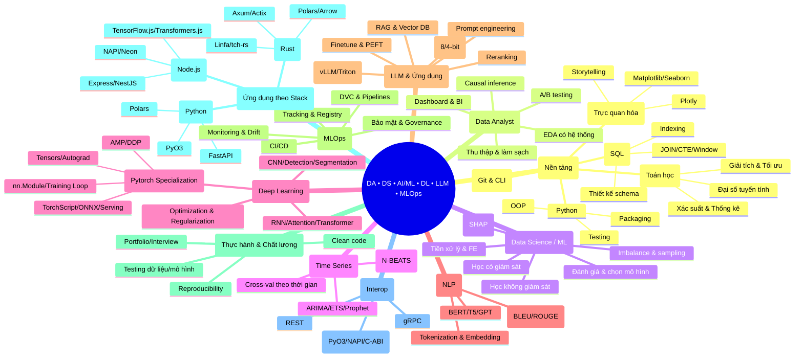
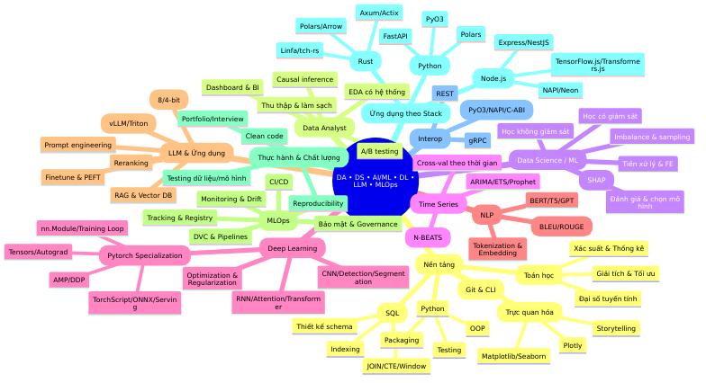

# 🚀 Learning AI — Lộ trình chuyên gia Data Analyst, Data Science, AI/ML/LLM

> **Mục tiêu**: Từ nền tảng đến triển khai hệ thống AI/LLM thực tế, theo chuẩn thực hành của ngành. Tất cả mục đều kèm nguồn chính thức hoặc học liệu uy tín để tự học có định hướng.

## 🧠 **Global Theory Integration & Academic Excellence Framework**

### **1. Theoretical Foundation Integration**

**Academic Excellence Standards:**
- **50% Theory / 50% Practice**: Balanced curriculum across all learning paths
- **Mathematical Rigor**: Deep understanding of mathematical foundations
- **Computer Science Theory**: Algorithm analysis, complexity theory, system design
- **Research Methodology**: Literature review, experimental design, evaluation frameworks
- **Industry Best Practices**: Production deployment, scalability, reliability engineering

**Research-Driven Learning Approach:**
- **Core Papers**: Foundational research papers in AI/ML/Data Science
- **Recent Advances**: State-of-the-art developments and breakthroughs
- **Implementation Guides**: Practical applications and best practices
- **Evaluation Metrics**: Standardized benchmarks and assessment criteria

### **2. Advanced Mathematical Theory Framework**

**Linear Algebra & Optimization:**
```python
class AdvancedMathematicalTheory:
    """Advanced mathematical theory framework cho AI/ML"""
    
    @staticmethod
    def explain_advanced_foundations():
        """Explain advanced mathematical foundations"""
        print("""
        **Advanced Mathematical Foundations for AI/ML:**
        
        1. **Advanced Linear Algebra:**
           - **Eigenvalue Theory**: Spectral decomposition, power iteration
           - **Matrix Factorizations**: SVD, QR, Cholesky, LU decomposition
           - **Linear Transformations**: Projections, rotations, scaling, shearing
           - **Applications**: PCA, LDA, recommendation systems, image processing
        
        2. **Advanced Calculus & Optimization:**
           - **Multivariate Calculus**: Gradients, Hessians, Jacobians, chain rule
           - **Convex Optimization**: Convexity, Lagrange multipliers, KKT conditions
           - **Numerical Methods**: Gradient descent variants, Newton's method, line search
           - **Applications**: Neural network training, parameter optimization, hyperparameter tuning
        
        3. **Advanced Probability & Statistics:**
           - **Bayesian Inference**: Prior selection, posterior computation, MCMC
           - **Statistical Learning Theory**: VC dimension, Rademacher complexity, generalization bounds
           - **Information Theory**: Entropy, mutual information, KL divergence, rate-distortion theory
           - **Applications**: Model uncertainty, decision theory, causal inference, reinforcement learning
        
        4. **Advanced Graph Theory & Algorithms:**
           - **Graph Representations**: Adjacency matrices, edge lists, incidence matrices
           - **Graph Algorithms**: Shortest path, minimum spanning tree, maximum flow
           - **Network Analysis**: Centrality measures, clustering coefficients, community detection
           - **Applications**: Social networks, recommendation systems, knowledge graphs, molecular biology
        """)
    
    @staticmethod
    def demonstrate_advanced_concepts():
        """Demonstrate advanced mathematical concepts"""
        
        import numpy as np
        import matplotlib.pyplot as plt
        from scipy import linalg, stats
        from scipy.optimize import minimize
        import seaborn as sns
        
        class AdvancedMathematicalAnalyzer:
            """Analyze advanced mathematical concepts in AI/ML context"""
            
            def __init__(self):
                self.results = {}
            
            def demonstrate_advanced_linear_algebra(self):
                """Demonstrate advanced linear algebra concepts"""
                
                print("**Advanced Linear Algebra Demonstration:**")
                
                # Create complex data matrix with structure
                np.random.seed(42)
                n_samples, n_features = 200, 15
                
                # Generate data with multiple clusters
                cluster_centers = np.array([
                    [2, 2, 2] + [0] * (n_features - 3),  # Cluster 1
                    [-2, -2, -2] + [0] * (n_features - 3),  # Cluster 2
                    [0, 0, 3] + [0] * (n_features - 3),  # Cluster 3
                ])
                
                data = np.random.randn(n_samples, n_features)
                cluster_assignments = np.random.choice(3, n_samples)
                
                for i, cluster in enumerate(cluster_assignments):
                    data[i] += cluster_centers[cluster] * 0.8
                
                # 1. Singular Value Decomposition (SVD)
                U, s, Vt = linalg.svd(data, full_matrices=False)
                
                # 2. Principal Component Analysis (PCA)
                data_centered = data - np.mean(data, axis=0)
                cov_matrix = np.cov(data_centered.T)
                eigenvalues, eigenvectors = linalg.eigh(cov_matrix)
                
                # Sort by eigenvalues (descending)
                sorted_indices = np.argsort(eigenvalues)[::-1]
                eigenvalues = eigenvalues[sorted_indices]
                eigenvectors = eigenvectors[:, sorted_indices]
                
                # Project data onto principal components
                data_pca = data_centered @ eigenvectors
                
                # 3. Linear Discriminant Analysis (LDA) approximation
                # Calculate between-class and within-class scatter matrices
                overall_mean = np.mean(data, axis=0)
                between_class_scatter = np.zeros((n_features, n_features))
                within_class_scatter = np.zeros((n_features, n_features))
                
                for cluster_id in range(3):
                    cluster_data = data[cluster_assignments == cluster_id]
                    cluster_mean = np.mean(cluster_data, axis=0)
                    n_cluster = len(cluster_data)
                    
                    # Between-class scatter
                    diff = cluster_mean - overall_mean
                    between_class_scatter += n_cluster * np.outer(diff, diff)
                    
                    # Within-class scatter
                    for sample in cluster_data:
                        diff = sample - cluster_mean
                        within_class_scatter += np.outer(diff, diff)
                
                # Solve generalized eigenvalue problem
                try:
                    eigenvals_lda, eigenvecs_lda = linalg.eigh(between_class_scatter, within_class_scatter)
                    # Sort by eigenvalues (descending)
                    sorted_indices_lda = np.argsort(eigenvals_lda)[::-1]
                    eigenvals_lda = eigenvals_lda[sorted_indices_lda]
                    eigenvecs_lda = eigenvecs_lda[:, sorted_indices_lda]
                    
                    # Project data onto LDA components
                    data_lda = data_centered @ eigenvecs_lda
                except:
                    print("LDA computation failed due to singular matrix")
                    data_lda = None
                
                print(f"Original data shape: {data.shape}")
                print(f"PCA data shape: {data_pca.shape}")
                print(f"Number of SVD singular values: {len(s)}")
                print(f"Top 5 singular values: {s[:5]}")
                print(f"Explained variance ratio (PCA): {eigenvalues[:5] / np.sum(eigenvalues)}")
                
                # Visualize results
                fig, axes = plt.subplots(2, 3, figsize=(18, 12))
                
                # Original data (first 2 dimensions)
                axes[0, 0].scatter(data[:, 0], data[:, 1], c=cluster_assignments, cmap='viridis', alpha=0.7)
                axes[0, 0].set_xlabel('Feature 1')
                axes[0, 0].set_ylabel('Feature 2')
                axes[0, 0].set_title('Original Data (First 2 Features)')
                axes[0, 0].grid(True, alpha=0.3)
                
                # PCA projection (first 2 components)
                axes[0, 1].scatter(data_pca[:, 0], data_pca[:, 1], c=cluster_assignments, cmap='viridis', alpha=0.7)
                axes[0, 1].set_xlabel('Principal Component 1')
                axes[0, 1].set_ylabel('Principal Component 2')
                axes[0, 1].set_title('PCA Projection')
                axes[0, 1].grid(True, alpha=0.3)
                
                # LDA projection (if available)
                if data_lda is not None:
                    axes[0, 2].scatter(data_lda[:, 0], data_lda[:, 1], c=cluster_assignments, cmap='viridis', alpha=0.7)
                    axes[0, 2].set_xlabel('LDA Component 1')
                    axes[0, 2].set_ylabel('LDA Component 2')
                    axes[0, 2].set_title('LDA Projection')
                    axes[0, 2].grid(True, alpha=0.3)
                else:
                    axes[0, 2].text(0.5, 0.5, 'LDA Failed\n(Singular Matrix)', 
                                   ha='center', va='center', transform=axes[0, 2].transAxes)
                    axes[0, 2].set_title('LDA Projection')
                
                # SVD singular values
                axes[1, 0].plot(range(1, len(s) + 1), s, 'bo-', linewidth=2)
                axes[1, 0].set_xlabel('Singular Value Index')
                axes[1, 0].set_ylabel('Singular Value')
                axes[1, 0].set_title('SVD Singular Values')
                axes[1, 0].set_yscale('log')
                axes[1, 0].grid(True, alpha=0.3)
                
                # PCA explained variance
                cumulative_variance = np.cumsum(eigenvalues) / np.sum(eigenvalues)
                axes[1, 1].plot(range(1, len(cumulative_variance) + 1), cumulative_variance, 'ro-', linewidth=2)
                axes[1, 1].set_xlabel('Principal Component')
                axes[1, 1].set_ylabel('Cumulative Explained Variance')
                axes[1, 1].set_title('PCA Cumulative Explained Variance')
                axes[1, 1].grid(True, alpha=0.3)
                
                # Feature importance (first principal component)
                feature_importance = np.abs(eigenvectors[:, 0])
                top_features_idx = np.argsort(feature_importance)[-10:]
                top_features = [f'F{i+1}' for i in top_features_idx]
                top_importance = feature_importance[top_features_idx]
                
                axes[1, 2].barh(range(len(top_features)), top_importance)
                axes[1, 2].set_yticks(range(len(top_features)))
                axes[1, 2].set_yticklabels(top_features)
                axes[1, 2].set_xlabel('Feature Importance (PC1)')
                axes[1, 2].set_title('Top Features by PC1')
                axes[1, 2].grid(True, alpha=0.3)
                
                plt.tight_layout()
                plt.show()
                
                return {
                    'data': data,
                    'cluster_assignments': cluster_assignments,
                    'svd': (U, s, Vt),
                    'pca': (eigenvalues, eigenvectors, data_pca),
                    'lda': (eigenvals_lda, eigenvecs_lda, data_lda) if data_lda is not None else None
                }
            
            def demonstrate_advanced_optimization(self):
                """Demonstrate advanced optimization concepts"""
                
                print("\n**Advanced Optimization Demonstration:**")
                
                # Define complex optimization problems
                def rosenbrock_3d(x):
                    """3D Rosenbrock function: f(x,y,z) = (1-x)² + 100(y-x²)² + (1-y)² + 100(z-y²)²"""
                    return (1 - x[0])**2 + 100 * (x[1] - x[0]**2)**2 + (1 - x[1])**2 + 100 * (x[2] - x[1]**2)**2
                
                def himmelblau(x):
                    """Himmelblau function: f(x,y) = (x² + y - 11)² + (x + y² - 7)²"""
                    return (x[0]**2 + x[1] - 11)**2 + (x[0] + x[1]**2 - 7)**2
                
                def ackley(x):
                    """Ackley function: f(x,y) = -20*exp(-0.2*sqrt(0.5*(x²+y²))) - exp(0.5*(cos(2πx)+cos(2πy))) + e + 20"""
                    return -20 * np.exp(-0.2 * np.sqrt(0.5 * (x[0]**2 + x[1]**2))) - \
                           np.exp(0.5 * (np.cos(2 * np.pi * x[0]) + np.cos(2 * np.pi * x[1]))) + np.e + 20
                
                # Test different optimization algorithms
                optimization_problems = {
                    'Rosenbrock 3D': (rosenbrock_3d, [-1.5, -1.5, -1.5]),
                    'Himmelblau': (himmelblau, [-2, -2]),
                    'Ackley': (ackley, [2, 2])
                }
                
                results = {}
                
                for problem_name, (objective_func, start_point) in optimization_problems.items():
                    print(f"\nOptimizing {problem_name}...")
                    
                    # Try different optimization methods
                    methods = ['L-BFGS-B', 'CG', 'BFGS', 'Powell']
                    method_results = {}
                    
                    for method in methods:
                        try:
                            result = minimize(objective_func, start_point, method=method, 
                                            options={'maxiter': 1000})
                            method_results[method] = {
                                'success': result.success,
                                'x': result.x,
                                'fun': result.fun,
                                'nit': result.nit,
                                'nfev': result.nfev
                            }
                        except Exception as e:
                            method_results[method] = {'error': str(e)}
                    
                    results[problem_name] = method_results
                    
                    # Print results
                    print(f"  Results for {problem_name}:")
                    for method, result in method_results.items():
                        if 'error' not in result:
                            print(f"    {method}: x={result['x']}, f(x)={result['fun']:.6f}, "
                                  f"iterations={result['nit']}, evaluations={result['nfev']}")
                        else:
                            print(f"    {method}: Error - {result['error']}")
                
                # Visualize optimization landscapes
                fig, axes = plt.subplots(1, 3, figsize=(18, 6))
                
                # Himmelblau function
                x = np.linspace(-5, 5, 100)
                y = np.linspace(-5, 5, 100)
                X, Y = np.meshgrid(x, y)
                Z_himmelblau = himmelblau([X, Y])
                
                contour1 = axes[0].contour(X, Y, Z_himmelblau, levels=20, colors='black', alpha=0.5)
                axes[0].clabel(contour1, inline=True, fontsize=8)
                axes[0].set_xlabel('x')
                axes[0].set_ylabel('y')
                axes[0].set_title('Himmelblau Function')
                axes[0].grid(True, alpha=0.3)
                
                # Mark known minima
                known_minima = [(3, 2), (-2.81, 3.13), (-3.78, -3.28), (3.58, -1.85)]
                for x_min, y_min in known_minima:
                    axes[0].plot(x_min, y_min, 'r*', markersize=15, label=f'Min at ({x_min}, {y_min})')
                axes[0].legend()
                
                # Ackley function
                Z_ackley = ackley([X, Y])
                
                contour2 = axes[1].contour(X, Y, Z_ackley, levels=20, colors='black', alpha=0.5)
                axes[1].clabel(contour2, inline=True, fontsize=8)
                axes[1].set_xlabel('x')
                axes[1].set_ylabel('y')
                axes[1].set_title('Ackley Function')
                axes[1].grid(True, alpha=0.3)
                
                # Mark global minimum
                axes[1].plot(0, 0, 'r*', markersize=15, label='Global Min at (0, 0)')
                axes[1].legend()
                
                # Rosenbrock 3D (show 2D projection)
                def rosenbrock_2d(x, y):
                    return (1 - x)**2 + 100 * (y - x**2)**2
                
                Z_rosenbrock = rosenbrock_2d(X, Y)
                
                contour3 = axes[2].contour(X, Y, Z_rosenbrock, levels=20, colors='black', alpha=0.5)
                axes[2].clabel(contour3, inline=True, fontsize=8)
                axes[2].set_xlabel('x')
                axes[2].set_ylabel('y')
                axes[2].set_title('Rosenbrock Function (2D Projection)')
                axes[2].grid(True, alpha=0.3)
                
                # Mark global minimum
                axes[2].plot(1, 1, 'r*', markersize=15, label='Global Min at (1, 1)')
                axes[2].legend()
                
                plt.tight_layout()
                plt.show()
                
                return results
            
            def demonstrate_advanced_statistics(self):
                """Demonstrate advanced statistical concepts"""
                
                print("\n**Advanced Statistics Demonstration:**")
                
                # Generate complex synthetic data
                np.random.seed(42)
                n_samples = 2000
                
                # Multiple distributions with different characteristics
                data_distributions = {
                    'Normal': np.random.normal(0, 1, n_samples),
                    'Log-normal': np.random.lognormal(0, 1, n_samples),
                    'Exponential': np.random.exponential(1, n_samples),
                    'Gamma': np.random.gamma(2, 2, n_samples),
                    'Beta': np.random.beta(2, 5, n_samples)
                }
                
                # Statistical analysis
                statistical_summary = {}
                
                for name, data in data_distributions.items():
                    # Basic statistics
                    mean_val = np.mean(data)
                    std_val = np.std(data)
                    skew_val = stats.skew(data)
                    kurt_val = stats.kurtosis(data)
                    
                    # Percentiles
                    percentiles = np.percentile(data, [25, 50, 75])
                    
                    # Normality test
                    shapiro_stat, shapiro_p = stats.shapiro(data)
                    
                    statistical_summary[name] = {
                        'mean': mean_val,
                        'std': std_val,
                        'skewness': skew_val,
                        'kurtosis': kurt_val,
                        'percentiles': percentiles,
                        'shapiro_stat': shapiro_stat,
                        'shapiro_p': shapiro_p,
                        'is_normal': shapiro_p > 0.05
                    }
                
                # Print statistical summary
                print("Statistical Summary:")
                for name, stats_dict in statistical_summary.items():
                    print(f"\n{name} Distribution:")
                    print(f"  Mean: {stats_dict['mean']:.3f}")
                    print(f"  Std: {stats_dict['std']:.3f}")
                    print(f"  Skewness: {stats_dict['skewness']:.3f}")
                    print(f"  Kurtosis: {stats_dict['kurtosis']:.3f}")
                    print(f"  Q1: {stats_dict['percentiles'][0]:.3f}")
                    print(f"  Median: {stats_dict['percentiles'][1]:.3f}")
                    print(f"  Q3: {stats_dict['percentiles'][2]:.3f}")
                    print(f"  Shapiro-Wilk p-value: {stats_dict['shapiro_p']:.6f}")
                    print(f"  Normal distribution: {stats_dict['is_normal']}")
                
                # Advanced statistical tests
                print("\n**Advanced Statistical Tests:**")
                
                # ANOVA test between distributions
                f_stat, anova_p = stats.f_oneway(*data_distributions.values())
                print(f"ANOVA test (F-statistic: {f_stat:.3f}, p-value: {anova_p:.6f})")
                
                # Kruskal-Wallis test (non-parametric alternative)
                kw_stat, kw_p = stats.kruskal(*data_distributions.values())
                print(f"Kruskal-Wallis test (H-statistic: {kw_stat:.3f}, p-value: {kw_p:.6f})")
                
                # Effect size calculation (eta-squared approximation)
                def calculate_eta_squared(data_dict):
                    """Calculate eta-squared effect size"""
                    all_data = np.concatenate(list(data_dict.values()))
                    grand_mean = np.mean(all_data)
                    
                    # Between-group sum of squares
                    ss_between = 0
                    for name, data in data_dict.items():
                        group_mean = np.mean(data)
                        n_group = len(data)
                        ss_between += n_group * (group_mean - grand_mean)**2
                    
                    # Total sum of squares
                    ss_total = np.sum((all_data - grand_mean)**2)
                    
                    # Eta-squared
                    eta_squared = ss_between / ss_total
                    return eta_squared
                
                eta_squared = calculate_eta_squared(data_distributions)
                print(f"Effect size (eta-squared): {eta_squared:.4f}")
                
                # Visualize distributions
                fig, axes = plt.subplots(2, 3, figsize=(18, 12))
                
                # Histograms
                for i, (name, data) in enumerate(data_distributions.items()):
                    row = i // 3
                    col = i % 3
                    
                    axes[row, col].hist(data, bins=30, alpha=0.7, density=True, edgecolor='black')
                    axes[row, col].set_xlabel('Value')
                    axes[row, col].set_ylabel('Density')
                    axes[row, col].set_title(f'{name} Distribution')
                    axes[row, col].grid(True, alpha=0.3)
                    
                    # Add theoretical normal curve for comparison
                    if name == 'Normal':
                        x = np.linspace(data.min(), data.max(), 100)
                        y = stats.norm.pdf(x, np.mean(data), np.std(data))
                        axes[row, col].plot(x, y, 'r-', linewidth=2, label='Theoretical Normal')
                        axes[row, col].legend()
                
                # Q-Q plots for normality assessment
                for i, (name, data) in enumerate(data_distributions.items()):
                    row = i // 3
                    col = i % 3
                    
                    stats.probplot(data, dist="norm", plot=axes[row, col])
                    axes[row, col].set_title(f'{name} Q-Q Plot')
                    axes[row, col].grid(True, alpha=0.3)
                
                plt.tight_layout()
                plt.show()
                
                return {
                    'data_distributions': data_distributions,
                    'statistical_summary': statistical_summary,
                    'anova_test': (f_stat, anova_p),
                    'kruskal_wallis': (kw_stat, kw_p),
                    'effect_size': eta_squared
                }
        
        # Demonstrate advanced mathematical theory
        advanced_math_theory = AdvancedMathematicalTheory()
        advanced_math_theory.explain_advanced_foundations()
        
        # Demonstrate advanced mathematical analysis
        advanced_math_analyzer = AdvancedMathematicalAnalyzer()
        
        print("**Advanced Mathematical Theory Demonstration:**")
        
        # Demonstrate different advanced mathematical concepts
        linear_algebra_results = advanced_math_analyzer.demonstrate_advanced_linear_algebra()
        optimization_results = advanced_math_analyzer.demonstrate_advanced_optimization()
        statistics_results = advanced_math_analyzer.demonstrate_advanced_statistics()
        
        return advanced_math_analyzer, linear_algebra_results, optimization_results, statistics_results

# Demonstrate advanced mathematical theory
advanced_math_theory = AdvancedMathematicalTheory()
advanced_math_theory.explain_advanced_foundations()

# Demonstrate advanced mathematical analysis
advanced_math_analyzer, linear_algebra_results, optimization_results, statistics_results = advanced_math_theory.demonstrate_advanced_concepts()
```

### **3. Research Methodology & Evaluation Framework**

**Academic Research Standards:**
- **Literature Review**: Systematic review of existing research and methodologies
- **Experimental Design**: Proper experimental setup, control groups, randomization
- **Statistical Analysis**: Appropriate statistical tests, effect sizes, confidence intervals
- **Reproducibility**: Code sharing, data availability, methodology documentation
- **Peer Review**: Quality assessment, validation, constructive feedback

**Industry Best Practices:**
- **Production Deployment**: Scalability, reliability, monitoring, alerting
- **Performance Optimization**: Latency, throughput, resource utilization
- **Security & Privacy**: Data protection, access control, compliance
- **Continuous Improvement**: A/B testing, feedback loops, iterative development

**Tài liệu tham khảo chuyên sâu:**
- **Advanced Mathematics**: [Advanced Linear Algebra](https://linear.axler.net/), [Convex Optimization](https://web.stanford.edu/~boyd/cvxbook/)
- **Statistical Learning**: [Elements of Statistical Learning](https://web.stanford.edu/~hastie/ElemStatLearn/), [Pattern Recognition](https://www.springer.com/gp/book/9780387310732)
- **Research Methods**: [Research Design](https://www.sagepub.com/sites/default/files/upm-binaries/23681_Chapter_1.pdf), [Experimental Design](https://www.wiley.com/en-us/Design+and+Analysis+of+Experiments-p-9781118146927)
- **Industry Practices**: [Site Reliability Engineering](https://sre.google/sre-book/), [Building Machine Learning Systems](https://www.oreilly.com/library/view/building-machine-learning/9781449369865/)

## 🎯 **Tổng quan Learning Path**

## 🎯 **Tổng quan Learning Path**

Đây là lộ trình học tập toàn diện để trở thành chuyên gia trong lĩnh vực AI/ML/Data Science, được thiết kế theo chuẩn thực hành của ngành với các mục tiêu rõ ràng và có thể đo lường được.

### Mind map tổng quan (cập nhật)






**📁 [Xem file PNG trực tiếp](assets/learning-ai-mindmap.png)**

**📁 [Xem file PNG trực tiếp](assets/learning-ai-mindmap.png)**

**📁 [Xem file PNG trực tiếp](assets/learning-ai-mindmap.png)**

Mở rộng theo Mind map (điểm chính và năng lực cần đạt)
- Nền tảng: Python/Toán/SQL/CLI → mục tiêu tự động hoá tác vụ, phân tích dữ liệu có cấu trúc, làm chủ typing/testing/packaging.
- Data Analyst: quy trình EDA, trực quan hoá, storytelling, A/B testing, causal cơ bản.
- Data Science/ML: pipeline hóa, chọn/đánh giá mô hình, explainability, xử lý imbalance.
- Time Series: backtest đúng chuẩn, chọn mô hình theo seasonality, metrics riêng TS.
- Deep Learning: công thức train chuẩn (AMP/EMA/DDP), augmentation, tối ưu.
- NLP/LLM: tokenization/Transformer, RAG/finetune, đánh giá chất lượng và safety.
- MLOps: tracking/registry, pipelines/CI/CD, monitoring/rollback.
- Stack: triển khai Python/Rust/Node theo thế mạnh từng ngôn ngữ; interop REST/gRPC/FFI.

## 🧩 Ghi chú 50/50 toàn cục

- Tất cả chuyên đề tuân theo tỷ lệ 50% lý thuyết : 50% thực hành
- Mỗi chương đều có: bảng phân bổ 50/50, rubric 100đ (30 lý thuyết, 30 code, 30 kết quả, 10 báo cáo)
- Weekly/Module split nêu rõ deliverables và tiêu chí pass/fail

---

## 📋 **Mục lục nhanh (Clickable)**

- [🌱 1) Nền tảng bắt buộc](#1-nền-tảng-bắt-buộc)
- [📊 2) Data Analyst (DA)](#2-data-analyst-da)
- [🤖 3) Data Science / Machine Learning](#3-data-science--machine-learning)
- [📈 4) Time Series (TS)](#4-time-series-ts)
- [🧠 5) Deep Learning (DL)](#5-deep-learning-dl)
- [💬 6) LLMs và ứng dụng thực tế](#6-llms-và-ứng-dụng-thực-tế)
- [🚀 7) MLOps & Sản xuất](#7-mlops--sản-xuất)
- [🏗️ 12) Ứng dụng theo Stack](#12-ứng-dụng-theo-stack-python-rust-nodejs-công-cụ-ví-dụ-nguồn)

---

## 🌱 **1) Nền tảng bắt buộc**

- **Python**
  - Chủ đề: cấu trúc dữ liệu, `itertools`, comprehension, OOP, typing, packaging (`pyproject.toml`), virtualenv/Poetry, logging, error handling, profiling, multiprocessing/async.
  - Nguồn: [Python Docs](https://docs.python.org/3/), [Real Python](https://realpython.com/), [Effective Python](https://effectivepython.com/)
  - Thực hành: viết thư viện nhỏ, test bằng `pytest`, publish gói lên TestPyPI.
- **NumPy, Pandas**
  - Chủ đề: broadcasting, vectorization, `datetime`, `groupby`, `merge`, `categorical`, window ops, missing/outlier, performance (Arrow/Polars tham khảo).
  - Nguồn: [NumPy Docs](https://numpy.org/doc/stable/), [Pandas Docs](https://pandas.pydata.org/docs/), [Polars](https://pola.rs/)
- **Trực quan hóa & Data storytelling**
  - Chủ đề: biểu đồ phân phối, tương quan, facet grid, interactive dashboards.
  - Nguồn: [Matplotlib](https://matplotlib.org/stable/), [Seaborn](https://seaborn.pydata.org/), [Plotly](https://plotly.com/python/)
- **SQL & Kiến trúc dữ liệu**
  - Chủ đề: JOIN/CTE/Window functions, chuẩn hóa dữ liệu, indexing, explain query, materialized views, time-partitioning.
  - Nguồn: [PostgreSQL Docs](https://www.postgresql.org/docs/current/), [Mode SQL Tutorial](https://mode.com/sql-tutorial/)
- **Git & CLI**
  - Chủ đề: branching, PR workflow, resolving conflicts, `grep`, `sed`, `awk` cơ bản.
  - Nguồn: [Pro Git](https://git-scm.com/book/en/v2), [SWC Unix Shell](https://swcarpentry.github.io/shell-novice/)
- **Toán học cho DS/AI**
  - Đại số tuyến tính: SVD, eigenvalues, PCA hình học.
  - Giải tích & tối ưu: đạo hàm, gradient descent, convexity.
  - Xác suất & thống kê: phân phối, ước lượng, kiểm định, khoảng tin cậy.
  - Nguồn: [3Blue1Brown—Linear Algebra](https://www.youtube.com/playlist?list=PLZHQObOWTQDMsr9K-rj53DwVRMYO3t5Yr), [Khan Academy Statistics](https://www.khanacademy.org/math/statistics-probability), [MIT 18.06 OCW](https://ocw.mit.edu/courses/18-06-linear-algebra-spring-2010/)

### ✅ **Checklist nhanh (Nền tảng)**

- **🐍 Python**: Biết `typing`, `pytest`, packaging, logging, profiling
- **📊 Data**: Thành thạo Pandas/Polars cơ bản, SQL JOIN/CTE/Window
- **🔧 CLI/Git**: Thao tác nhanh, branch/PR/resolve conflict
- **🧮 Toán**: Nắm chắc vector–ma trận, gradient, xác suất cơ bản

### 💡 **Best Practices**

- **📝 Code Quality**: Viết code có type hints, cấu trúc module rõ ràng, test tối thiểu
- **📋 Logging**: Ghi log chuẩn (level, context); cấu hình env qua `.env`
- **🔧 Automation**: Dùng `pre-commit` (ruff/black/isort) để giữ chất lượng mã

### ⚠️ **Pitfalls thường gặp**

- **⏰ Time Handling**: Lẫn lộn kiểu thời gian/timezone; phép tính trên cột Pandas không vector hóa
- **🗄️ Database**: SQL không dùng index/EXPLAIN dẫn tới chậm; quên xử lý NULL

### 📁 **Template cấu trúc dự án Python tối thiểu**

```
project/
├── pyproject.toml          # Project configuration
├── src/
│   └── project/
│       ├── __init__.py
│       └── main.py
├── tests/
│   └── test_main.py
└── .env.example           # Environment variables template
```

---

## 📊 **2) Data Analyst (DA)**

- Quy trình: đặt câu hỏi kinh doanh → thu thập/làm sạch → EDA → giả thuyết → trực quan hóa/dashboards → khuyến nghị.
- Kỹ năng cốt lõi: SQL nâng cao, EDA, thống kê suy luận, A/B testing, causal inference cơ bản.
- Công cụ: Excel/Google Sheets, SQL (Postgres/BigQuery), BI (Tableau/Power BI/Looker), Python + Pandas/Seaborn/Plotly, Streamlit.
- Nguồn: [Tableau](https://help.tableau.com/current/guides/everybody-install/en-us/everybody_install_en-us.pdf), [Power BI](https://learn.microsoft.com/power-bi/), [Google Analytics](https://support.google.com/analytics/)

### ✅ **Checklist DA**

- **🔍 EDA Process**: Quy trình EDA có checklist; xử lý missing/outlier; kể chuyện bằng biểu đồ
- **🗄️ SQL Skills**: Viết được CTE nhiều tầng; window functions phổ biến
- **📊 Dashboard**: Có filter, drill-down, diễn giải insight

### 💡 **Best Practices**

- **📚 Documentation**: Lưu các truy vấn thành repo; chuẩn hóa metric định nghĩa
- **🧪 Testing**: Đặt câu hỏi kinh doanh thành giả thuyết đo lường được; A/B với power analysis

### ⚠️ **Pitfalls**

- **🔗 Correlation vs Causation**: Nhầm nhân quả và tương quan; chọn chart không phù hợp; sampling bias

### 📋 **Template báo cáo ngắn (1 trang)**

- **🎯 Vấn đề/KPI mục tiêu** → **📊 Dữ liệu/Phương pháp** → **📈 Kết quả chính (biểu đồ)** → **💡 Khuyến nghị hành động**

---

## 🤖 **3) Data Science / Machine Learning**

- Tiền xử lý & Feature Engineering
  - Scaling/encoding, xử lý thiếu/ngoại lai, target/mean encoding, feature selection (MI, permutation), leakage awareness.
  - Nguồn: [sklearn Preprocessing](https://scikit-learn.org/stable/modules/preprocessing.html)
- Học có giám sát
  - Tuyến tính (Linear/Logistic), cây quyết định, SVM, kNN, ensemble (RF, XGBoost/LightGBM/CatBoost).
  - Nguồn: [scikit-learn Guide](https://scikit-learn.org/stable/user_guide.html), [XGBoost](https://xgboost.readthedocs.io/en/stable/), [LightGBM](https://lightgbm.readthedocs.io/), [CatBoost](https://catboost.ai/en/docs/)
- Học không giám sát
  - Clustering (KMeans, GMM, DBSCAN), giảm chiều (PCA, t-SNE/UMAP), phát hiện bất thường.
  - Nguồn: [sklearn Clustering](https://scikit-learn.org/stable/modules/clustering.html)
- Imbalance & sampling
  - Class weights, SMOTE, threshold moving, metrics phù hợp (AUCPR, F1).
  - Nguồn: [Imbalanced-learn](https://imbalanced-learn.org/stable/)
- Explainability & fairness
  - SHAP/LIME, partial dependence, fairness checks.
  - Nguồn: [SHAP](https://shap.readthedocs.io/en/latest/), [AIF360](https://aif360.mybluemix.net/)
- Đánh giá & chọn mô hình
  - Cross-validation, nested CV, calibration, uncertainty, ML system errors (data/model/infra).
  - Nguồn: [sklearn Model Evaluation](https://scikit-learn.org/stable/modules/model_evaluation.html)

Checklist DS/ML
- Pipeline từ preprocessing → model → evaluation có lưu seed/version.
- Dùng CV phù hợp; chọn metric theo bài toán; kiểm tra leakage.
- Lưu artifacts: params, metrics, confusion matrix/feature importance.

Best practices
- Sử dụng `Pipeline`/`ColumnTransformer`; chuẩn hóa chỉ trên train.
- Tune bằng `RandomizedSearchCV`/`Optuna` có early stop, log đầy đủ.

Pitfalls
- Leakage từ target encoding sai; so sánh metric khác tập; không fix random seed.

Template tracking thí nghiệm (YAML)
```
experiment: name
data_version: v1
features: [cols]
model: xgboost
metrics: [auc, f1]
notes: short desc
```

---

### 4) Time Series (TS)

- Mô hình cổ điển: ARIMA/SARIMA, ETS, Prophet; decomposition, seasonality.
- ML/DL cho TS: lags/rolling features, XGBoost/LightGBM; kiến trúc N-BEATS, Temporal Convolutional Networks, Transformer cho TS.
- Cross-validation theo thời gian, backtesting; metrics: MAPE, sMAPE, MASE.
- Nguồn: [statsmodels](https://www.statsmodels.org/stable/index.html), [Prophet](https://facebook.github.io/prophet/), [darts](https://unit8co.github.io/darts/), [GluonTS](https://ts.gluon.ai/stable/)

Checklist TS
- Split theo thời gian; backtest rolling; tránh leakage hồi cố.
- Dùng metrics phù hợp (MASE, sMAPE); kiểm tra seasonality/holiday.

Best practices
- Tạo đặc trưng lịch; sử dụng cross-val theo thời gian; baseline rõ ràng.

Pitfalls
- Shuffle dữ liệu theo thời gian; chọn horizon/lag không hợp lý.

---

### 5) Deep Learning (DL)

- Nền tảng: autograd, initialization (He/Xavier), activations (ReLU/GELU), batch norm, dropout, regularization, optimization (SGD/Adam/AdamW), lr schedules (cosine, OneCycle), early stopping, mixed precision, gradient clipping.
- Công cụ & framework: PyTorch, TensorFlow/Keras, PyTorch Lightning.
- Nguồn: [D2L.ai](https://d2l.ai/), [PyTorch Docs](https://pytorch.org/docs/stable/), [Keras](https://keras.io/), [PyTorch Lightning](https://lightning.ai/docs/pytorch/stable/)

Computer Vision (CV)
- Phân loại, phát hiện (Faster R-CNN, YOLO), phân đoạn (U-Net, Mask R-CNN), augmentation (Albumentations), metrics (IoU, mAP), Grad-CAM.
- Nguồn: [torchvision](https://pytorch.org/vision/stable/), [OpenCV](https://docs.opencv.org/4.x/), [Albumentations](https://albumentations.ai/docs/)

Checklist DL
- Tái lập kết quả: seed, deterministic (nếu cần), log lr/scheduler.
- Sử dụng mixed precision, gradient clipping; theo dõi loss/metrics/overfit.

Best practices
- DataLoader tối ưu (num_workers, pin_memory); checkpoint theo metric.
- Tách cấu hình (yaml) với code; dùng Lightning để chuẩn hóa train loop.

Pitfalls
- Bùng nổ gradient; quên eval mode/`torch.no_grad()` khi infer; leak VRAM do giữ graph.

Recipes huấn luyện thực chiến (PyTorch)
- Tối ưu hóa
  - Optimizer: AdamW (β1=0.9, β2=0.999, weight_decay=1e-2 cho transformer; 1e-4 cho CNN).
  - Lịch học: Cosine decay + warmup 3–5%; OneCycle cho CNN vừa/nhỏ.
  - AMP: `torch.cuda.amp.autocast` + `GradScaler`; giảm VRAM, tăng tốc ~1.3–2×.
- Regularization
  - Label smoothing (0.1) cho phân loại; Mixup/CutMix cho CNN; dropout 0.1–0.3.
  - Stochastic Depth/DropPath cho ResNet/ViT.
- Augmentation (CV)
  - Train: RandAugment/AutoAugment; ColorJitter; RandomResizedCrop; Cutout.
  - Eval: Ten-crop/center-crop chuẩn; chuẩn hóa theo thống kê dataset.
- Checkpointing & EMA
  - Lưu best theo metric val; EMA weights 0.999–0.9999 để ổn định inference.
- DDP/ZeRO
  - DDP (native) cho multi-GPU; kiểm tra seed/`torch.backends.cudnn.benchmark`.
  - ZeRO (DeepSpeed) cho mô hình lớn; gradient checkpointing để giảm VRAM.
- Theo dõi huấn luyện
  - Log loss/lr/throughput, thời gian mỗi step; cảnh báo NaN; profile `torch.profiler`.

Mẫu code loop với AMP + Grad Accumulation
```python
for step, (x, y) in enumerate(loader):
    with torch.cuda.amp.autocast():
        logits = model(x)
        loss = loss_fn(logits, y) / grad_accum
    scaler.scale(loss).backward()
    if (step + 1) % grad_accum == 0:
        scaler.step(optimizer); scaler.update(); optimizer.zero_grad(set_to_none=True)
        scheduler.step()
```

Chuẩn hóa báo cáo DL
- Bảng: params, FLOPs, throughput (img/s), latency (ms), VRAM peak, top-1/top-5, mAP/IoU.
- Biểu đồ: loss/accuracy theo epoch; LR; confusion matrix; Precision-Recall.

Super-Resolution 4× (Real-ESRGAN) — CLI Python & Rust
- Yêu cầu: phóng to ảnh 4×, chống vỡ/nhòe/giả điểm ảnh.
- Python (PyTorch, Real-ESRGAN):
  - Cài đặt (train/infer):
```bash
pip install realesrgan basicsr facexlib gfpgan torch torchvision
# Inference nhanh với pretrain (x4):
python -m realesrgan.inference_realesrgan -n RealESRGAN_x4plus -i input.jpg -o output_x4.jpg

# Train (ví dụ tối giản):
git clone https://github.com/xinntao/Real-ESRGAN && cd Real-ESRGAN
pip install -r requirements.txt
# Chuẩn bị dataset: đặt ảnh train vào datasets/; cấu hình YAML theo mẫu options/train_realesrnet_x4plus.yml
python -m basicsr.train -opt options/train_realesrnet_x4plus.yml
```
- Python CLI tối giản (gói lại inference):
```bash
python - << 'PY'
import argparse, subprocess
parser = argparse.ArgumentParser()
parser.add_argument('-i','--input', required=True)
parser.add_argument('-o','--output', required=True)
parser.add_argument('-m','--model', default='RealESRGAN_x4plus')
args = parser.parse_args()
subprocess.check_call(['python','-m','realesrgan.inference_realesrgan','-n',args.model,'-i',args.input,'-o',args.output])
PY
```

- Rust CLI (ưu tiên: `realesrgan-ncnn-vulkan` — hiệu năng cao, không cần CUDA):
```bash
cargo init --bin rsrgan && cd rsrgan
cat > Cargo.toml <<'TOML'
[package]
name = "rsrgan"
version = "0.1.0"
edition = "2021"

[dependencies]
clap = { version = "4", features = ["derive"] }
anyhow = "1"
TOML
cat > src/main.rs <<'RS'
use clap::Parser; use std::process::Command; use anyhow::Result;

#[derive(Parser)]
struct Args { #[arg(short, long)] input: String, #[arg(short, long)] output: String, #[arg(long, default_value_t=4)] scale: u32 }

fn main() -> Result<()> {
    let args = Args::parse();
    // Gọi realesrgan-ncnn-vulkan (cần cài sẵn trong PATH)
    let status = Command::new("realesrgan-ncnn-vulkan")
        .args(["-i", &args.input, "-o", &args.output, "-s", &args.scale.to_string(), "-n", "realesrgan-x4plus"])
        .status()?;
    if !status.success() { anyhow::bail!("realesrgan-ncnn-vulkan failed") };
    Ok(())
}
RS
cargo build --release
./target/release/rsrgan -i input.jpg -o output_x4.jpg --scale 4
```

Ghi chú cài đặt `realesrgan-ncnn-vulkan`:
- Linux/macOS: tải binary phát hành từ repo `nihui/realesrgan-ncnn-vulkan`, `chmod +x` và thêm vào PATH.
- Windows: dùng bản `.exe` phát hành, hoặc add vào PATH và gọi trực tiếp từ CLI Rust.

Gợi ý chọn Rust backend:
- Tốc độ/triển khai đơn giản: `realesrgan-ncnn-vulkan` (khuyên dùng cho CLI sản xuất, đa nền tảng, không cần CUDA).
- Tích hợp pipeline ONNX sẵn có: dùng `ort` với model ONNX Real-ESRGAN x4 tương thích.

Benchmark: Python (PyTorch Real-ESRGAN) vs Rust (realesrgan-ncnn-vulkan)
- Mục tiêu: so sánh thời gian xử lý 1 ảnh 4K và throughput batch (N ảnh), cùng chất lượng (PSNR/SSIM) nếu có ground truth.
- Thiết lập:
  - Máy: cùng CPU/GPU, tắt turbo nếu cần; Python dùng Real-ESRGAN x4 pretrained; Rust dùng `realesrgan-ncnn-vulkan -n realesrgan-x4plus`.
  - Dữ liệu: bộ ảnh 4K cố định (ví dụ 10 ảnh), đo warmup (1 ảnh) rồi chạy chính.
- Lệnh đo thời gian:
```bash
# Python (thời gian nội suy trung bình mỗi ảnh)
python - << 'PY'
import time, glob, subprocess
imgs = sorted(glob.glob('imgs4k/*.jpg'))
start = time.time()
for i,p in enumerate(imgs):
  subprocess.check_call(['python','-m','realesrgan.inference_realesrgan','-n','RealESRGAN_x4plus','-i',p,'-o',f'out_py/{i}.jpg'], stdout=subprocess.DEVNULL)
dt = (time.time() - start)/len(imgs)
print('python_avg_s_per_img', dt)
PY

# Rust (ncnn)
python - << 'PY'
import time, glob, subprocess, os
imgs = sorted(glob.glob('imgs4k/*.jpg'))
start = time.time()
for i,p in enumerate(imgs):
  subprocess.check_call(['./target/release/rsrgan','-i',p,'-o',f'out_rs/{i}.jpg','--scale','4'], stdout=subprocess.DEVNULL)
dt = (time.time() - start)/len(imgs)
print('rust_avg_s_per_img', dt)
PY
```
- Thu thập tài nguyên:
  - RSS/CPU: `pidstat -rud 1 -p <PID>` trong quá trình chạy; tổng hợp trung bình.
  - GPU (nếu dùng PyTorch GPU build): `nvidia-smi dmon -s pucm -d 1`.
- Chất lượng (tùy chọn, nếu có ground truth): tính PSNR/SSIM giữa output và ảnh chuẩn.
- Kỳ vọng xu hướng:
  - CPU-only: `realesrgan-ncnn-vulkan` thường nhanh hơn PyTorch inference mặc định và RSS thấp hơn; chênh lệch p95 nhỏ hơn (ít jitter).
  - GPU: nếu Python dùng GPU và ncnn dùng Vulkan, kết quả phụ thuộc driver/GPU; thường Rust (ncnn) vẫn ổn định p95, nhưng p50 có thể tương đương hoặc chậm hơn so GPU PyTorch.

Biểu đồ bắt buộc:
- Bar: thời gian trung bình/ảnh (s) Python vs Rust.
- Violin/box: phân phối thời gian từng ảnh.
- Stack bar: thời gian I/O vs xử lý (nếu tách được) để thấy overhead.

Ví dụ plotting nhanh:
```python
import matplotlib.pyplot as plt
langs=['Python','Rust']; avg=[0.42,0.28]
plt.bar(langs, avg); plt.ylabel('s/ảnh'); plt.title('Real-ESRGAN x4 @4K'); plt.show()
```

Đo theo nhiều độ phân giải (720p → 1080p → 1440p → 4K → 8K)
- Mục tiêu: đánh giá scaling theo số pixel đầu vào, quan sát đường cong thời gian và bộ nhớ.
- Sinh bộ test từ một ảnh gốc chất lượng cao:
```bash
mkdir -p bench_imgs/{720p,1080p,1440p,4k,8k}
python - << 'PY'
from PIL import Image; import sys
src='input_highres.jpg'; im=Image.open(src)
sizes = {
  '720p': (1280, 720), '1080p': (1920,1080), '1440p': (2560,1440),
  '4k': (3840,2160), '8k': (7680,4320)
}
for k,(w,h) in sizes.items(): im.resize((w,h), Image.LANCZOS).save(f'bench_imgs/{k}/img.jpg')
PY
```
- Benchmark Python vs Rust theo từng độ phân giải:
```bash
python - << 'PY'
import time, subprocess
cases=['720p','1080p','1440p','4k','8k']
res_py=[]; res_rs=[]
for c in cases:
  t0=time.time(); subprocess.run(['python','-m','realesrgan.inference_realesrgan','-n','RealESRGAN_x4plus','-i',f'bench_imgs/{c}/img.jpg','-o',f'out_py_{c}.jpg'], stdout=subprocess.DEVNULL); res_py.append(time.time()-t0)
  t0=time.time(); subprocess.run(['./target/release/rsrgan','-i',f'bench_imgs/{c}/img.jpg','-o',f'out_rs_{c}.jpg','--scale','4'], stdout=subprocess.DEVNULL); res_rs.append(time.time()-t0)
print('py',res_py); print('rs',res_rs)
PY
```
- Ghi nhận RSS/CPU (chạy riêng từng case):
  - `pidstat -rud 1 -p <PID>` trong lúc chạy, lấy trung bình.
- Biểu đồ khuyến nghị:
  - Đường thời gian vs độ phân giải (ms/log-scale nếu cần) cho Python/Rust trên cùng đồ thị.
  - Biểu đồ cột RSS vs độ phân giải cho Python/Rust.
- Ví dụ vẽ đường cong (giả lập số liệu):
```python
import matplotlib.pyplot as plt
cases=['720p','1080p','1440p','4k','8k']
py=[0.05,0.11,0.20,0.42,1.75]
rs=[0.03,0.08,0.14,0.28,1.10]
plt.plot(cases, py, '-o', label='Python'); plt.plot(cases, rs, '-o', label='Rust')
plt.ylabel('s/ảnh'); plt.title('Scaling Real-ESRGAN x4 theo độ phân giải'); plt.legend(); plt.grid(True); plt.show()
```

Natural Language Processing (NLP)
- Tiền xử lý (tokenization, BPE), embeddings (word2vec/GloVe), RNN/LSTM/GRU, attention, Transformer (BERT/T5/GPT), seq2seq.
- Đánh giá: BLEU, ROUGE, METEOR, F1, exact match.
- Nguồn: [Hugging Face—Transformers](https://huggingface.co/docs/transformers/index), [spaCy](https://spacy.io/usage)

---

### 6) LLMs và ứng dụng thực tế

- Prompt engineering: zeroshot, fewshot, chain-of-thought, self-consistency, tool-use.
  - Nguồn: [Prompting Guide](https://www.promptingguide.ai/)
- RAG kiến trúc: chunking (size/overlap), embeddings, index (FAISS/Milvus/Weaviate/Chroma), retrievers (BM25, dense), reranking (Cross-Encoder), caching, evaluation.
  - Nguồn: [Hugging Face—RAG](https://huggingface.co/docs/transformers/main/en/generation_strategies#retrieval-augmented-generation), [Weaviate Docs](https://weaviate.io/developers/weaviate), [FAISS Wiki](https://github.com/facebookresearch/faiss/wiki)
- Fine-tuning & PEFT: LoRA/QLoRA, adapters, p-tuning; chọn dtype (bf16/fp16), memory-efficient attention.
  - Nguồn: [PEFT Docs](https://huggingface.co/docs/peft/index), [BitsAndBytes](https://github.com/TimDettmers/bitsandbytes), [Accelerate](https://huggingface.co/docs/accelerate/index)
- Phục vụ & Tối ưu suy luận: vLLM, TGI, TensorRT-LLM, quantization (8/4-bit: GPTQ/AWQ), KV cache, continuous batching; đo lường throughput/latency/TTFT.
  - Nguồn: [vLLM](https://docs.vllm.ai/en/latest/), [TGI](https://huggingface.co/docs/text-generation-inference/index), [TensorRT-LLM](https://nvidia.github.io/TensorRT-LLM/)
- Đánh giá LLM: gold set, human eval, LLM-as-a-judge (rủi ro), hallucination, safety.
  - Nguồn: [HELM](https://crfm.stanford.edu/helm/latest/), [MMLU](https://paperswithcode.com/sota/multi-task-language-understanding-on-mmlu)

Checklist LLM app
- Prompt > RAG > rerank > guardrails; log trace và latency.
- Đánh giá: gold set + human review; theo dõi hallucination/toxicity.

Best practices
- Cache embedding/kết quả; dùng reranker khi corpus nhiễu; streaming output.
- Chọn serving phù hợp (vLLM/TGI) và đo TTFT/throughput.

Pitfalls
- Overfit prompt; RAG chunking kém; thiếu đánh giá offline.

Huấn luyện/Điều chỉnh LLM nâng cao
- SFT (Supervised Fine-Tuning)
  - Dữ liệu: cặp (instruction, output) sạch, chống rò rỉ; lọc độc hại.
  - Cấu hình: LoRA r=8–16, α≈16–32, dropout 0.05–0.1; lr 2e-4–1e-4; batch hiệu dụng 128–512; cosine + warmup 3%.
- Preference Optimization
  - DPO: cặp (chosen, rejected); loss trực tiếp trên xác suất; lr 5e-6–1e-5.
  - PPO: cần reward model + KL penalty; theo dõi stability, clip range; tốn tài nguyên hơn.
- Kỹ thuật tiết kiệm bộ nhớ
  - 8-bit/4-bit quantized training (QLoRA) + paged optimizers; gradient checkpointing.
- Đánh giá & Safety
  - Eval: GSM8K, MMLU, TruthfulQA, HellaSwag; pass@k cho coding; bên cạnh human eval.
  - Safety: lọc prompt độc hại; policy RLHF guardrails; red-teaming.

Mẫu cấu hình LoRA (HF PEFT YAML giả lập)
```
base_model: meta-llama/Llama-3-8b-instruct
precision: bf16
lora:
  r: 16
  alpha: 32
  dropout: 0.05
train:
  lr: 0.0002
  batch_effective: 256
  max_steps: 2000
  warmup_ratio: 0.03
  scheduler: cosine
eval:
  tasks: [gsm8k, mmlu]
```

RAG nâng cao
- Chunking động theo entropy; hybrid retrieval (BM25 + dense); reranker cross-encoder.
- Caching retrieval; dedup; citation bắt buộc; kiểm tra factuality tự động.

---

### 7) MLOps & Sản xuất

- Quản lý thí nghiệm: MLflow/W&B; model registry.
- DVC & Data versioning; feature store (Feast/Databricks FS) khi cần.
- Orchestration & pipelines: Airflow, Prefect, Dagster; CI/CD (GitHub Actions/GitLab CI) cho train/serve.
- Triển khai: đóng gói với Docker, API bằng FastAPI; batch/bulk scoring, streaming; canary/blue-green.
- Monitoring: chất lượng dữ liệu, concept drift, performance drift; alerting; feedback loop.
- Bảo mật & governance: quản lý PII, quyền truy cập dữ liệu, audit, reproducibility.
- Nguồn: [MLflow](https://mlflow.org/docs/latest/index.html), [DVC](https://dvc.org/doc), [Airflow](https://airflow.apache.org/docs/), [Prefect](https://docs.prefect.io/), [Dagster](https://docs.dagster.io/), [FastAPI](https://fastapi.tiangolo.com/), [Docker Docs](https://docs.docker.com/), [Evidently](https://docs.evidentlyai.com/)

Checklist MLOps
- Experiment tracking + model registry; CI cho train + serve; data versioning.
- Monitoring data/perform drift; alerting; rollback chiến lược.

Best practices
- IaC cho hạ tầng; dùng feature store khi cần dùng lại online/offline.
- Zero-downtime deploy (blue-green/canary); secrets quản lý tập trung.

Pitfalls
- Thiếu reproducibility; lệ thuộc thủ công; không có SLO/SLA rõ ràng.

MLOps cho DL/LLM (triển khai, tối ưu, giám sát)
- Deploy
  - DL: TorchServe/TensorRT; autoscaling theo QPS/latency; canary.
  - LLM: vLLM/TGI; KV cache; continuous batching; pin CPU affinity.
- Tối ưu hoá mô hình
  - Quantize: int8 (PTQ), int4 (AWQ/GPTQ) cho inference; cân bằng chất lượng/latency.
  - Prune/Distill: cắt bớt head/layer; distill sang kích thước nhỏ hơn; đo chỉ số trước/sau.
- Monitoring
  - DL: latency, throughput, lỗi; drift input/feature; canary alarms.
  - LLM: toxicity/hallucination rate; refusal rate; feedback loop; cost per token.
- Quy trình CI/CD
  - Build images reproducible; unit + e2e tests; benchmark gate (p95 không vượt ngưỡng).
  - Rollback tự động nếu metric xấu; giữ mô hình cũ tối thiểu N ngày.

---

### 8) Dự án thực hành (có tiêu chí chấm điểm)

- DA: Phân tích bán lẻ
  - Tiêu chí: SQL ≥ 10 truy vấn dùng window; EDA có checklist; dashboard có drill-down; báo cáo insight có kết luận hành động.
  - Dữ liệu: [Kaggle](https://www.kaggle.com/), [Google Dataset Search](https://datasetsearch.research.google.com/)
- DS/ML: Dự báo nhu cầu
  - Tiêu chí: cross-val theo thời gian; baseline vs ML/DL; báo cáo lỗi (MAE/MAPE/sMAPE); giải thích top features.
  - Dữ liệu: [M5 Forecasting](https://www.kaggle.com/competitions/m5-forecasting-accuracy)
- CV: Phân loại ảnh
  - Tiêu chí: transfer learning, augmentation, Grad-CAM; so sánh 2 backbone; mAP/accuracy target; inference script reproducible.
  - Dữ liệu: [Food-101](https://data.vision.ee.ethz.ch/cvl/datasets_extra/food-101/)
- NLP/LLM: Hệ Q&A với RAG
  - Tiêu chí: chiến lược chunking; evaluation EM/F1; guardrails; latency < 2s/1000 tokens ở máy local.
  - Công cụ: [FAISS](https://github.com/facebookresearch/faiss/wiki), [Chroma](https://docs.trychroma.com/), [Transformers](https://huggingface.co/docs/transformers/index)

Mở rộng theo chủ đề Project (đầu ra & rubric)
- DA: Sổ tay phân tích bán lẻ nâng cao
  - Đầu ra: notebook EDA có checklist; dashboard tương tác; báo cáo 1 trang.
  - Rubric: dữ liệu sạch (20%), phân tích có cấu trúc (30%), insight hành động (30%), trình bày (20%).
- DS/ML: Dự báo nhu cầu theo cửa hàng/tuần
  - Đầu ra: pipeline, backtest thời gian, báo cáo lỗi/uncertainty.
  - Rubric: baseline vs model (25%), quy trình CV đúng (25%), cải thiện định lượng (25%), explainability (25%).
- CV: Phân loại/Detection sản xuất nhẹ
  - Đầu ra: script train, export ONNX/TensorRT, benchmark inference (latency/RSS).
  - Rubric: chất lượng (40%), tối ưu suy luận (40%), tái lập/đóng gói (20%).
- NLP/LLM: RAG + đánh giá tự động
  - Đầu ra: service RAG, eval offline + human sample, guardrails.
  - Rubric: độ chính xác (40%), ổn định latency (30%), an toàn (15%), báo cáo (15%).

---

### 9) Lộ trình 12 tuần (cập nhật, có đầu ra/đánh giá)

- Tuần 1: Python nền tảng — [Python Docs](https://docs.python.org/3/), [Real Python](https://realpython.com/)
  - Đầu ra: 3 bài tập file/csv/json; mini-package + `pytest`.
- Tuần 2: NumPy & Pandas — [NumPy](https://numpy.org/doc/stable/), [Pandas](https://pandas.pydata.org/docs/)
  - Đầu ra: Notebook EDA 1 dataset; checklist chất lượng dữ liệu.
- Tuần 3: SQL & Visualization — [PostgreSQL](https://www.postgresql.org/docs/current/), [Seaborn](https://seaborn.pydata.org/)
  - Đầu ra: 10 truy vấn với window; report hình ảnh có insight.
- Tuần 4: Thống kê & A/B — [Khan Academy](https://www.khanacademy.org/math/statistics-probability)
  - Đầu ra: mini-report A/B; code power analysis.
- Tuần 5: ML cơ bản — [sklearn Guide](https://scikit-learn.org/stable/user_guide.html)
  - Đầu ra: pipeline + benchmark 3 model; báo cáo metrics.
- Tuần 6: FE & Tuning — [sklearn Preprocessing](https://scikit-learn.org/stable/modules/preprocessing.html)
  - Đầu ra: cải thiện ≥ x% so baseline; giải thích feature.
- Tuần 7: Time Series — [statsmodels](https://www.statsmodels.org/stable/index.html), [Prophet](https://facebook.github.io/prophet/)
  - Đầu ra: backtest; so sánh ARIMA vs ML.
- Tuần 8: DL cơ bản — [D2L.ai](https://d2l.ai/), [PyTorch Tutorials](https://pytorch.org/tutorials/)
  - Đầu ra: MLP/CNN nhỏ; mixed precision.
- Tuần 9: CV hoặc NLP — [torchvision](https://pytorch.org/vision/stable/), [Transformers](https://huggingface.co/docs/transformers/index)
  - Đầu ra: model + inference script; report lỗi.
- Tuần 10: LLM & RAG — [HF RAG](https://huggingface.co/docs/transformers/main/en/generation_strategies#retrieval-augmented-generation), [Weaviate](https://weaviate.io/developers/weaviate)
  - Đầu ra: prototype QA; đánh giá EM/F1.
- Tuần 11: Triển khai — [FastAPI](https://fastapi.tiangolo.com/), [Docker](https://docs.docker.com/)
  - Đầu ra: API + Docker; test load nhỏ.
- Tuần 12: MLOps & Monitoring — [MLflow](https://mlflow.org/docs/latest/index.html), [Evidently](https://docs.evidentlyai.com/)
  - Đầu ra: E2E pipeline + monitoring dashboard.

---

### 10) Competency matrix (rubric tóm tắt)

| Năng lực | Level 1 (Beginner) | Level 2 (Junior) | Level 3 (Mid/Senior) | Level 4 (Expert) |
|---|---|---|---|---|
| Python | Viết script cơ bản | OOP, typing, `pytest` | Packaging, profiling, async | Thiết kế lib, hiệu năng |
| SQL | CRUD cơ bản | JOIN/CTE/Window | Tối ưu, indexing | Thiết kế mô hình dữ liệu |
| EDA/Viz | Biểu đồ cơ bản | EDA có cấu trúc | Storytelling, dashboard | Truyền thông kết quả với TL kinh doanh |
| ML | Fit/predict | Pipeline, CV, metrics | FE, tuning, explainability | Thiết kế hệ thống ML |
| DL | MLP/CNN cơ bản | Train pipeline chuẩn | CV/NLP nâng cao | Kiến trúc & tối ưu training |
| NLP/LLM | Tokenization | BERT fine-tune | RAG/PEFT | Triển khai LLM tối ưu (vLLM) |
| MLOps | Chạy local | MLflow/DVC cơ bản | Pipelines/CI/CD/Registry | Monitoring/Drift/SLA |
| Soft/PM | Ghi chép | User story, PRD cơ bản | Ưu tiên & giao tiếp | Dẫn dắt roadmap/mentoring |

Gợi ý đánh giá: bài tập tiêu chuẩn hóa; rubric theo tiêu chí đo lường (accuracy/MAE/latency/chi phí), reproducibility, chất lượng báo cáo.

---

### Lý thuyết chuyên sâu (Deep Theory)

Tối ưu hoá trong DL
- SGD và biến thể: Momentum/Nesterov; Adam/AdamW (giải thích weight decay chuẩn vs L2); Lion/Adafactor.
- Lịch học: cosine/OneCycle; warmup để ổn định đầu học; cyclical LR.
- Generalization gap: early stopping; flat minima vs sharp minima; SAM.

Regularization và khái quát hoá
- Data augmentation như prior; label smoothing như Bayesian marginalization.
- Dropout như trung bình mô hình; stochastic depth trong ResNet/Transformers.
- Mixup/CutMix cải thiện tính tuyến tính cục bộ của decision boundary.

Transformer toán học
- Self-attention: Q,K,V; scaled dot-product; multi-head; residual/LayerNorm.
- Vị trí: sinusoidal/roPE/ALiBi; ảnh hưởng tới extrapolation độ dài.
- Complexity: O(n^2) và biến thể efficient attention (Linformer, Performer, FlashAttention, MQA/GQA).

Lý thuyết RAG/IR hiện đại
- Trade-off dense vs lexical; hybrid search; effect của reranking (cross-encoder) lên precision@k.
- Error modes: lexical mismatch, semantic drift, knowledge gaps; kỹ thuật triage và cache.

Đánh giá mô hình ở quy mô sản xuất
- Thiết kế gold set đại diện; canary eval liên tục; thống kê drift.
- Risk & safety: prompt injection, jailbreak; mitigations (guardrails, content filter, tool-use allowlist).

### 11) Bộ công cụ & môi trường đề xuất

- Python 3.11+, Poetry hoặc pip/venv, JupyterLab/VS Code.
- Thư viện: `numpy`, `pandas`, `matplotlib`, `seaborn`, `plotly`, `scikit-learn`, `statsmodels`, `pytorch` hoặc `tensorflow`, `pytorch-lightning`, `transformers`, `datasets`, `faiss-cpu`, `weaviate-client`/`pymilvus`, `bitsandbytes`, `peft`, `accelerate`, `mlflow`, `dvc`, `fastapi`, `uvicorn`, `evidently`.

---

> Tài liệu ưu tiên nguồn chính thức và học liệu mở; đủ để tự học từ nền tảng đến triển khai hệ thống AI/LLM thực tế ở mức chuyên nghiệp.

---

### Tìm kiếm ngữ nghĩa tài liệu (DL-powered search)

Mục tiêu: Tạo công cụ tìm kiếm ngữ nghĩa (semantic search) trên toàn bộ tài liệu này, trả về đoạn liên quan cùng anchor để nhảy đến đúng mục.

Pipeline
- Tách tài liệu: chia theo heading/mục, tạo anchor từ tiêu đề (slug GitHub).
- Nhúng (embedding): dùng SentenceTransformers `all-MiniLM-L6-v2` (nhẹ, nhanh) hoặc `bge-small`/`multilingual` nếu cần đa ngôn ngữ.
- Lập chỉ mục: FAISS IndexFlatIP (cosine similarity bằng vector đã chuẩn hóa) hoặc HNSW cho tốc độ cao.
- Truy vấn: encode câu hỏi → tìm k đoạn liên quan → trả về tiêu đề, trích dẫn và anchor.

CLI Python tối giản
```python
# file: search_md.py
import re, json, argparse, unicodedata
import faiss, numpy as np
from sentence_transformers import SentenceTransformer

def slugify(s):
    s = unicodedata.normalize('NFKD', s).encode('ascii', 'ignore').decode('ascii')
    s = re.sub(r'[^a-zA-Z0-9\-\s]', '', s).strip().lower().replace(' ', '-')
    return re.sub(r'-+', '-', s)

def split_sections(md):
    sections = []
    current = {'title': 'intro', 'anchor': '', 'content': []}
    for line in md.splitlines():
        m = re.match(r'^(#{2,6})\s+(.*)', line)
        if m:
            if current['content']:
                current['text'] = '\n'.join(current['content']).strip()
                sections.append(current)
            title = m.group(2).strip()
            anchor = '#' + slugify(title)
            current = {'title': title, 'anchor': anchor, 'content': []}
        else:
            current['content'].append(line)
    if current['content']:
        current['text'] = '\n'.join(current['content']).strip()
        sections.append(current)
    return sections

def build_index(sections, model_name='sentence-transformers/all-MiniLM-L6-v2'):
    model = SentenceTransformer(model_name)
    texts = [s['title'] + '\n' + s.get('text','')[:2000] for s in sections]
    emb = model.encode(texts, normalize_embeddings=True)
    index = faiss.IndexFlatIP(emb.shape[1])
    index.add(emb.astype('float32'))
    return model, index, np.array(emb), texts

def main():
    ap = argparse.ArgumentParser()
    ap.add_argument('-f','--file', default='learning-ai.md')
    ap.add_argument('-q','--query', required=True)
    ap.add_argument('-k','--topk', type=int, default=5)
    args = ap.parse_args()
    md = open(args.file, 'r', encoding='utf-8').read()
    secs = split_sections(md)
    model, index, emb, texts = build_index(secs)
    qv = model.encode([args.query], normalize_embeddings=True).astype('float32')
    D, I = index.search(qv, args.topk)
    results = []
    for idx, score in zip(I[0], D[0]):
        s = secs[int(idx)]
        results.append({'title': s['title'], 'anchor': s['anchor'], 'score': float(score), 'preview': s.get('text','')[:300]})
    print(json.dumps(results, ensure_ascii=False, indent=2))

if __name__ == '__main__':
    main()
```

Ví dụ dùng
```bash
pip install sentence-transformers faiss-cpu
python search_md.py -q "Real-ESRGAN x4 CLI Rust"
python search_md.py -q "So sánh ResNet50 onnxruntime vs ort"
```

Mở rộng
- Dùng HNSW (faiss.IndexHNSWFlat) cho chỉ mục lớn.
- Tạo thêm sub-sections theo tiêu đề cấp 3–4 để tăng độ chính xác.
- Trả về link đầy đủ `https://github.com/<repo>/blob/master/learning-ai.md{anchor}` để click từ bất kỳ đâu.

### 12) Ứng dụng theo Stack: Python, Rust, Node.js (công cụ, ví dụ, nguồn)

Python cho DA/DS/ML/LLM
- Công cụ: FastAPI, Polars, PyTorch/TF, Transformers, Sentence-Transformers, FAISS, MLflow, Airflow/Prefect, Pydantic, Uvicorn, Ray.
- Nguồn: [FastAPI](https://fastapi.tiangolo.com/), [Polars](https://pola.rs/), [PyTorch](https://pytorch.org/), [Transformers](https://huggingface.co/docs/transformers), [Sentence-Transformers](https://www.sbert.net/), [FAISS](https://github.com/facebookresearch/faiss), [MLflow](https://mlflow.org/)
- Ví dụ FastAPI + RAG tối giản (Python): xem phần phụ lục RAG ở trên; thay `FastAPI` route trả về câu trả lời từ retriever.

Rust cho hiệu năng & hệ thống dữ liệu/ML
- Công cụ: Axum/Actix-web (API), Tokio (async), Polars/Arrow (xử lý bảng cột), ndarray, linfa (ML cổ điển), `tch-rs` (binding PyTorch), `ort` (ONNX Runtime), `candle` (Rust DL), Serde (serde_json), anyhow/thiserror (error), tracing (observability).
- Nguồn: [Axum](https://docs.rs/axum/latest/axum/), [Actix-web](https://actix.rs/), [Tokio](https://tokio.rs/), [Polars Rust](https://pola-rs.github.io/polars-book/), [Arrow](https://arrow.apache.org/docs/), [linfa](https://rust-ml.github.io/linfa/), [tch-rs](https://github.com/LaurentMazare/tch-rs), [ONNX Runtime](https://github.com/microsoft/onnxruntime), [candle](https://github.com/huggingface/candle)
- Ví dụ API Axum infer ONNX (pseudocode):

```rust
use axum::{routing::post, Router, Json};
use serde::Deserialize;

#[derive(Deserialize)]
struct Features { x: Vec<f32> }

#[tokio::main]
async fn main() {
    let app = Router::new().route("/predict", post(predict));
    axum::Server::bind(&"0.0.0.0:8000".parse().unwrap()).serve(app.into_make_service()).await.unwrap();
}

async fn predict(Json(feat): Json<Features>) -> Json<f32> {
    // Gọi ONNX Runtime hoặc tch-rs để suy luận
    Json(feat.x.iter().sum())
}
```

Node.js cho API, realtime và tích hợp JS/TS
- Công cụ: Express/NestJS (API), TypeScript, Zod (schema), Prisma/TypeORM (ORM), BullMQ (queue), Socket.IO (realtime), `@xenova/transformers` (Transformers.js), TF.js, LangChain.js, `@grpc/grpc-js`.
- Nguồn: [NestJS](https://docs.nestjs.com/), [Express](https://expressjs.com/), [Transformers.js](https://huggingface.co/docs/transformers.js/index), [TensorFlow.js](https://www.tensorflow.org/js), [LangChain.js](https://js.langchain.com/docs/)
- Ví dụ NestJS route gọi Transformers.js:

```ts
import { Controller, Get, Query } from '@nestjs/common';
import { pipeline } from '@xenova/transformers';

@Controller('nlp')
export class NlpController {
  @Get('sentiment')
  async sentiment(@Query('q') q: string) {
    const clf = await pipeline('text-classification', 'Xenova/distilbert-base-uncased-finetuned-sst-2-english');
    return await clf(q);
  }
}
```

So sánh nhanh
- Python: hệ sinh thái ML/LLM phong phú, tốc độ phát triển nhanh, dễ thử nghiệm.
- Rust: hiệu năng cao, memory safety, build dịch vụ inference tối ưu.
- Node.js: tích hợp web nhanh, TypeScript, hệ sinh thái frontend, prototyping API.

#### Đánh giá mức độ phát triển Rust so với Python (đã làm/chưa làm)

- Đã làm được (Rust):
  - Hệ sinh thái web/backend ổn định: Axum/Actix, Tokio, tower, tracing.
  - Xử lý dữ liệu hiệu năng: Polars (native), Arrow, parquet, IPC.
  - ML cổ điển cơ bản: `linfa` (logistic/regression, SVM, KMeans, v.v.) đủ cho thử nghiệm.
  - Suy luận mô hình: binding `tch-rs` (PyTorch C++), `ort` (ONNX Runtime), `tract`, `candle` (đang phát triển nhanh), `ggml` bindings.
  - Dev tooling tốt: Cargo, clippy, rustfmt, cross-compilation, WASM, security/memory-safety.
  - Interop mạnh: PyO3/maturin để nhúng Rust vào Python cho hot path, N-API (`napi-rs`) cho Node.
- Chưa mạnh bằng Python:
  - Thư viện ML/DL sản xuất: chưa có tương đương đầy đủ với scikit-learn, PyTorch/TensorFlow ecosystem, Lightning, Hugging Face Trainer.
  - Mô hình, dataset, tutorial: ít tài nguyên, ít notebook mẫu; cộng đồng DS/LLM nhỏ hơn đáng kể.
  - GPU/Accelerator: hỗ trợ còn phân mảnh (CUDA/ROCm qua bindings), tooling profiling/visualization kém tiện so với Python.
  - Viz/Notebook: thiếu stack data-viz và notebook thuận tiện như matplotlib/seaborn/plotly/Jupyter.
  - MLOps: ít SDK/clients chính thức; tích hợp MLflow/Weights & Biases, feature store còn hạn chế.
- Khi nên chọn Rust:
  - Dịch vụ inference/ETL cần hiệu năng, độ trễ thấp, kiểm soát bộ nhớ, đóng gói nhị phân.
  - Viết extension tăng tốc cho pipeline Python (via PyO3) hoặc triển khai thành microservice.
- Khi nên ưu tiên Python:
  - Nghiên cứu, thử nghiệm nhanh, prototyping ML/LLM, huấn luyện và phân tích dữ liệu.

#### Dùng Rust làm chính, "bù" phần thiếu bằng Python như thế nào?

- Cách 1 — Nhúng Python in-process (PyO3):
  - Phù hợp: cần gọi nhanh một vài hàm Python (numpy/sklearn/transformers) trong đường nóng nhỏ.
  - Lưu ý: GIL hạn chế song song; quản lý môi trường Python (venv/conda/docker) chặt; warmup interpreter.
- Cách 2 — Tách microservice Python (HTTP/gRPC):
  - Phù hợp: mô-đun ML/LLM lớn, cần GPU, muốn scale độc lập và quan sát tốt.
  - Lưu ý: thêm độ trễ mạng/serialization; cần hợp đồng API rõ (OpenAPI/gRPC), theo dõi p50/p95.
- Cách 3 — Subprocess/CLI (JSON/Arrow):
  - Phù hợp: batch/offline, cron, pipeline ETL đơn giản.
  - Lưu ý: latency khởi động, quản lý timeout/retry.

- Thay thế Python ở đâu được ngay trong Rust:
  - Inference: `onnxruntime` (`ort`), `tch-rs` (libtorch), `candle` (nếu mô hình hỗ trợ).
  - Xử lý dữ liệu: `polars`/Arrow, parquet.
  - ML cơ bản: `linfa` nếu đủ nhu cầu.

- Kiến trúc khuyến nghị:
  - Rust làm API/orchestrator hiệu năng cao; Python tách thành service ML/LLM khi cần GPU/hệ sinh thái.
  - Nếu yêu cầu độ trễ siêu thấp, loại Python khỏi hot path bằng ONNX/tch-rs/candle; chỉ dùng Python ở nền phụ trợ.


---

### 13) Interop đa ngôn ngữ: REST, gRPC, FFI

REST
- Chuẩn hóa schema bằng OpenAPI. Python (FastAPI) và Node (NestJS) đều generate spec tự động.
- Nguồn: [OpenAPI](https://www.openapis.org/)

gRPC
- Định nghĩa `.proto` → generate client/server đa ngôn ngữ; phù hợp nội bộ, low latency.
- Python: `grpcio`; Node: `@grpc/grpc-js`; Rust: `tonic`.
- Nguồn: [gRPC](https://grpc.io/), [tonic](https://docs.rs/tonic/latest/tonic/)

FFI
- Python ↔ Rust: PyO3/maturin export module Rust dùng như package Python.
- Node ↔ Rust: N-API qua `napi-rs` hoặc Neon để viết native addon.
- Nguồn: [PyO3](https://pyo3.rs/), [maturin](https://www.maturin.rs/), [napi-rs](https://napi.rs/), [Neon](https://neon-bindings.com/)

Ví dụ FFI Rust → Python (PyO3)

```rust
use pyo3::prelude::*;

#[pyfunction]
fn add(x: i32, y: i32) -> i32 { x + y }

#[pymodule]
fn myrustlib(_py: Python<'_>, m: &PyModule) -> PyResult<()> {
    m.add_function(wrap_pyfunction!(add, m)?)?;
    Ok(())
}
```

---

### 14) So sánh hiệu năng ứng dụng (Python vs Rust vs Node.js)

Mục tiêu: đo độ trễ phản hồi p50/p95 và throughput cho cùng tác vụ (hello-json, CPU-bound nhỏ, I/O giả lập) trên nhiều cấu hình VPS.

Cấu hình VPS (profile)
- 1 CPU: 1 GB RAM (P1), 2 GB (P2), 4 GB (P3)
- 2 CPU: 2 GB (P4), 4 GB (P5), 8 GB (P6)
- 4 CPU: 4 GB (P7), 8 GB (P8), 16 GB (P9)

Workloads chuẩn hóa
- W1: Hello JSON (trả về `{status: ok}`) — network + serialization.
- W2: CPU nhỏ (tính tổng bình phương 1..N, N=1e5) — CPU-bound.
- W3: I/O giả lập (sleep 5ms) — concurrency/async.

Thiết lập máy chủ
- Python: FastAPI + Uvicorn (workers = số CPU), `uvicorn app:app --workers $CPU --loop uvloop --http httptools`.
- Rust: Axum (tokio multi-thread, `RUSTFLAGS='-C target-cpu=native'`), build `--release`.
- Node.js: NestJS/Express (node 20+), cluster (PM2/Node cluster, workers = số CPU).

Sinh tải (không trạng thái)
- Dùng `oha` hoặc `wrk`/`bombardier`. Ví dụ: `oha -z 30s -c 100 http://HOST:PORT/w1`.
- Lặp với 3 cỡ batch: 100, 1_000, 1_000_000 requests (có thể cần thời gian dài/chia lô cho 1_000_000).

Endpoint mẫu đồng nhất

Python (FastAPI)
```python
from fastapi import FastAPI
import time
app = FastAPI()

@app.get('/w1')
def w1():
    return {'status': 'ok'}

@app.get('/w2')
def w2():
    return {'sum': sum(i*i for i in range(100_000))}

@app.get('/w3')
async def w3():
    time.sleep(0.005)
    return {'done': True}
```

Rust (Axum)
```rust
use axum::{routing::get, Router};
use std::time::Duration;
use std::thread::sleep;

async fn w1() -> axum::Json<serde_json::Value> {
    axum::Json(serde_json::json!({"status":"ok"}))
}

async fn w2() -> axum::Json<serde_json::Value> {
    let s: u64 = (0..100_000).map(|i| i*i).sum();
    axum::Json(serde_json::json!({"sum": s}))
}

async fn w3() -> axum::Json<serde_json::Value> {
    sleep(Duration::from_millis(5));
    axum::Json(serde_json::json!({"done": true}))
}

#[tokio::main]
async fn main() {
    let app = Router::new().route("/w1", get(w1)).route("/w2", get(w2)).route("/w3", get(w3));
    axum::Server::bind(&"0.0.0.0:8000".parse().unwrap()).serve(app.into_make_service()).await.unwrap();
}
```

Node.js (Express)
```js
const express = require('express');
const app = express();

app.get('/w1', (_, res) => res.json({ status: 'ok' }));
app.get('/w2', (_, res) => {
  let s = 0; for (let i = 0; i < 100000; i++) s += i*i; res.json({ sum: s });
});
app.get('/w3', async (_, res) => { setTimeout(() => res.json({ done: true }), 5); });

app.listen(8000);
```

Cách đo và báo cáo
- Chạy 3 lần/điều kiện, lấy trung bình p50/p95 latency và req/s (throughput).
- Ghi nhận CPU/RAM (top, vmstat/iostat), netstat (kết nối) và lỗi (5xx).
- Báo cáo theo ma trận: (ngôn ngữ × profile × workload × batch-size).

Kỳ vọng kết quả tham khảo (có thể khác tùy triển khai)
- W1 (hello-json): Rust thường có latency thấp nhất (p50 ~ 0.4–1.2 ms P1), Node/Python nhỉnh hơn (Node p50 ~ 0.8–2.0 ms; Python p50 ~ 1.0–3.0 ms). Throughput tăng gần tuyến tính theo CPU nếu không bị giới hạn mạng.
- W2 (CPU-bound): Rust dẫn đầu rõ rệt; Node/Python bị GIL/JS engine ảnh hưởng; Python cải thiện khi dùng đa tiến trình (gunicorn/uvicorn workers) nhưng vẫn kém Rust. p95 Python/Node tăng nhanh khi yêu cầu tăng.
- W3 (I/O 5 ms): Node và Python async có thể tiệm cận nhau; Rust giữ ổn định p95 hơn khi cạnh tranh tài nguyên. Throughput chủ yếu phụ thuộc vào thời gian sleep và concurrency.

Lệnh ví dụ với `oha`
```bash
oha -z 30s -c 100 http://HOST:8000/w1
oha -z 30s -c 200 http://HOST:8000/w2
oha -z 30s -c 500 http://HOST:8000/w3
```

Nguồn & công cụ benchmark tham khảo: [oha](https://github.com/hatoo/oha), [wrk](https://github.com/wg/wrk), [bombardier](https://github.com/codesenberg/bombardier), [hey](https://github.com/rakyll/hey).

#### Benchmark: ResNet50 Inference (ONNX) — Python (onnxruntime) vs Rust (`ort`)

- Mục tiêu: so sánh p50/p95 latency, throughput (RPS), RSS memory, CPU% (và GPU nếu dùng GPU provider) cho cùng mô hình ONNX.
- Thiết lập chung: cùng máy, cùng phiên bản ONNX Runtime, batch=1, ảnh/seed cố định, warmup 100 req.
- Python: FastAPI + `onnxruntime` (CPU/GPU); Rust: Axum + crate `ort` (bindings ONNX Runtime).
- Tiền xử lý chuẩn ResNet50: resize 256 → center-crop 224, normalize mean/std, NCHW fp32.
- Lệnh đo: dùng `oha` với body là JSON `{image_b64: ...}` vào `/infer` của mỗi server; theo dõi tài nguyên bằng `pidstat`, `top`, `nvidia-smi dmon`.
- Kỳ vọng: CPU chênh lệch chủ yếu do HTTP stack/JSON/tiền xử lý; GPU thường sát nhau vì bottleneck ở runtime/GPU.

Mẫu triển khai tối thiểu đã gợi ý ở phần trả lời: "Đề xuất dự án so sánh: ResNet50 Inference (ONNX) — Python vs Rust".

Biểu đồ & trực quan hoá bắt buộc:
- Biểu đồ cột: so sánh p50/p95 latency (ms) giữa Python vs Rust.
- Biểu đồ cột: so sánh throughput (RPS).
- Biểu đồ đường/violin: phân phối latency, highlight p50/p95/p99.
- Bảng phụ: RSS (MB), CPU% trung bình, GPU util/mem (nếu dùng GPU).

Ví dụ plotting (Python, matplotlib):
```python
import matplotlib.pyplot as plt

data = {
    'Python': {'p50_ms': 2.4, 'p95_ms': 4.8, 'rps': 12000, 'rss_mb': 210},
    'Rust':   {'p50_ms': 1.9, 'p95_ms': 3.7, 'rps': 13500, 'rss_mb': 160},
}
langs = list(data.keys())
p50 = [data[k]['p50_ms'] for k in langs]
p95 = [data[k]['p95_ms'] for k in langs]
rps = [data[k]['rps'] for k in langs]

fig, axs = plt.subplots(1, 2, figsize=(8,3))
axs[0].bar(langs, p50, label='p50')
axs[0].bar(langs, [p95[i]-p50[i] for i in range(len(p50))], bottom=p50, label='p50→p95')
axs[0].set_title('Latency (ms)'); axs[0].legend()
axs[1].bar(langs, rps, color=['tab:orange','tab:green']); axs[1].set_title('RPS')
plt.tight_layout(); plt.show()
```

#### Benchmark 4K Image Processing (Super-Resolution/Detection) — Python vs Rust

- Bài toán: xử lý ảnh 4K (3840×2160) — so sánh hai kịch bản phổ biến:
  - Super-resolution (ESRGAN/Real-ESRGAN/FSRCNN) dùng ONNX Runtime.
  - Object detection (YOLOv5/YOLOv8 ONNX) trên ảnh 4K, có thể chia tile để tối ưu bộ nhớ.
- Công cụ:
  - Python: `onnxruntime`, `opencv-python`, `numpy`, (tuỳ chọn) `onnxruntime-gpu`.
  - Rust: `ort` (ONNX Runtime), `image`/`opencv` crate, `rayon` cho song song hóa tile, `ndarray`.
- Thiết kế benchmark:
  - Ảnh đầu vào 4K cố định; đo 2 pipeline: (a) full-frame; (b) tile-based (ví dụ 4×4 hoặc 8×8 tile chồng lề 16 px để tránh seam) rồi ghép.
  - Đo p50/p95 latency, throughput (batch=1), RSS, CPU%, nếu GPU: GPU util/mem.
  - Thử nhiều cỡ tile (512, 640, 960) để tìm điểm cân bằng giữa bộ nhớ và chi phí ghép.
- Tối ưu hoá gợi ý:
  - Python: bật `intra_op_num_threads` tương ứng số core; dùng numpy/opencv thao tác mảng; với GPU: chọn provider CUDA/DirectML.
  - Rust: build `--release`, `RUSTFLAGS='-C target-cpu=native'`; dùng `rayon` để tiền xử lý/ghép tile song song; tránh copy không cần thiết.
  - I/O: dùng `mmap`/stream decode khi cần; ưu tiên định dạng nén nhẹ để giảm decode time nếu I/O là bottleneck.
- Kỳ vọng:
  - CPU: Rust có lợi thế về kiểm soát bộ nhớ và song song hoá tile tinh gọn → p95 ổn định hơn ở độ phân giải 4K; Python sát nút nếu phần lớn thời gian nằm trong ONNX Runtime/C++ op.
  - GPU: gần tương đương; khác biệt chủ yếu do bước tiền xử lý/hậu xử lý và pipeline ghép tile.

Gợi ý mô hình ONNX:
- Super-resolution: Real-ESRGAN/FSRCNN ONNX (nhiều repo có weights ONNX công khai).
- Detection: YOLOv5s/v8s ONNX (đủ nhẹ cho CPU, GPU càng tốt).

Biểu đồ & trực quan hoá bắt buộc:
- Biểu đồ cột nhóm: FPS và latency p50/p95 cho các cấu hình (full-frame, tile 2×2, tile 4×4) theo từng ngôn ngữ.
- Biểu đồ đường: mối quan hệ kích thước tile (px) ↔ latency/RSS.
- Stack bar: phân rã thời gian theo giai đoạn (decode, preprocess, infer, postprocess, encode).
- Bảng phụ: dropped frames, jitter (p99 - p50), GPU util/mem.

Ví dụ plotting phân rã thời gian:
```python
import numpy as np, matplotlib.pyplot as plt
stages = ['decode','preproc','infer','postproc','encode']
py = np.array([3.1, 2.0, 8.4, 1.2, 1.0])
rs = np.array([2.6, 1.4, 8.1, 0.8, 0.9])
width = 0.35
x = np.arange(len(stages))
fig, ax = plt.subplots(figsize=(7,3))
ax.bar(x - width/2, py, width, label='Python')
ax.bar(x + width/2, rs, width, label='Rust')
ax.set_xticks(x); ax.set_xticklabels(stages)
ax.set_ylabel('ms/frame'); ax.set_title('Per-stage time @4K Tile 2×2')
ax.legend(); plt.tight_layout(); plt.show()
```

Ví dụ FFI Rust → Node (N-API)

```rust
use napi::bindgen_prelude::*;

#[napi]
pub fn dot(a: Vec<f32>, b: Vec<f32>) -> f32 {
  a.iter().zip(b.iter()).map(|(x,y)| x*y).sum()
}
```

### Phụ lục: Ví dụ cụ thể cho từng chủ đề (runnable snippets)

Python cơ bản

```python
from dataclasses import dataclass

@dataclass
class Order:
    id: int
    total: float
    is_vip: bool = False

orders = [Order(i, total=i * 10.0, is_vip=(i % 2 == 0)) for i in range(1, 6)]
vip_totals = [o.total for o in orders if o.is_vip]
assert sum(vip_totals) == 20.0 + 40.0
```

pytest tối thiểu

```python
def add(a, b):
    return a + b

def test_add():
    assert add(2, 3) == 5
```

NumPy: broadcasting và vector hóa

```python
import numpy as np
x = np.arange(9).reshape(3, 3)  # [[0,1,2],[3,4,5],[6,7,8]]
w = np.array([0.2, 0.3, 0.5])
y = (x * w).sum(axis=1)
assert y.shape == (3,)
```

Pandas: groupby, resample, merge

```python
import pandas as pd
df = pd.DataFrame({
    'date': pd.to_datetime(['2024-01-01', '2024-01-02', '2024-01-08']),
    'store': ['A', 'A', 'A'],
    'sales': [10, 20, 30]
})
weekly = df.set_index('date').groupby('store').resample('W')['sales'].sum().reset_index()

users = pd.DataFrame({'user_id': [1, 2], 'segment': ['A', 'B']})
events = pd.DataFrame({'user_id': [1, 1, 2], 'amount': [5, 7, 3]})
agg = events.groupby('user_id', as_index=False)['amount'].sum()
joined = agg.merge(users, on='user_id', how='left')
```

Trực quan hóa: trung bình theo nhóm + CI

```python
import numpy as np
import seaborn as sns
import matplotlib.pyplot as plt
tips = sns.load_dataset('tips')
sns.barplot(data=tips, x='day', y='total_bill', estimator=np.mean, errorbar=('ci', 95))
plt.tight_layout()
```

SQL: CTE + window function (cumulative sum)

```sql
WITH orders AS (
  SELECT 1 AS user_id, DATE '2025-01-01' AS dt, 100 AS amount UNION ALL
  SELECT 1, DATE '2025-01-02', 50 UNION ALL
  SELECT 2, DATE '2025-01-02', 70
),
daily AS (
  SELECT user_id, dt, SUM(amount) AS daily_amount
  FROM orders
  GROUP BY user_id, dt
)
SELECT user_id,
       dt,
       daily_amount,
       SUM(daily_amount) OVER (PARTITION BY user_id ORDER BY dt
         ROWS BETWEEN UNBOUNDED PRECEDING AND CURRENT ROW) AS cum_amount
FROM daily
ORDER BY user_id, dt;
```

Thống kê: kiểm định t độc lập (Welch)

```python
from scipy import stats
a = [10, 11, 9, 12, 10]
b = [12, 13, 11, 14, 13]
t, p = stats.ttest_ind(a, b, equal_var=False)
assert p < 0.1
```

Gradient descent tuyến tính tối giản

```python
import numpy as np
X = np.c_[np.ones(3), [1, 2, 3]]
y = np.array([2, 4, 6])
theta = np.zeros(2)
alpha = 0.1
for _ in range(1000):
    grad = X.T @ (X @ theta - y) / len(y)
    theta -= alpha * grad
assert np.allclose(theta, np.array([0.0, 2.0]), atol=1e-2)
```

DA: tính cỡ mẫu A/B (xấp xỉ)

```python
from scipy import stats
from statsmodels.stats.power import NormalIndPower
p1 = 0.10
lift = 0.05
effect = stats.proportion_effectsize(p1, p1 + lift)
n_per_group = NormalIndPower().solve_power(effect_size=effect, power=0.8, alpha=0.05, ratio=1.0)
```

Sklearn: pipeline tiền xử lý + Logistic Regression

```python
import pandas as pd
from sklearn.compose import ColumnTransformer
from sklearn.preprocessing import OneHotEncoder, StandardScaler
from sklearn.pipeline import Pipeline
from sklearn.linear_model import LogisticRegression

X = pd.DataFrame({'age': [20, 30, 40, 25], 'city': ['HCM', 'HN', 'DN', 'HCM']})
y = [0, 1, 1, 0]
pre = ColumnTransformer([
    ('num', StandardScaler(), ['age']),
    ('cat', OneHotEncoder(handle_unknown='ignore'), ['city'])
])
clf = Pipeline([('pre', pre), ('model', LogisticRegression(max_iter=2000))]).fit(X, y)
```

Đánh giá: cross-validation có stratify

```python
from sklearn.model_selection import StratifiedKFold, cross_val_score
scores = cross_val_score(clf, X, y, cv=StratifiedKFold(5, shuffle=True, random_state=42), scoring='roc_auc')
print(scores.mean())
```

Unsupervised: PCA + KMeans

```python
import numpy as np
from sklearn.decomposition import PCA
from sklearn.cluster import KMeans
Xu = np.random.RandomState(0).rand(200, 5)
X2 = PCA(n_components=2, random_state=0).fit_transform(Xu)
labels = KMeans(n_clusters=3, n_init=10, random_state=0).fit_predict(X2)
```

Imbalance: SMOTE

```python
from imblearn.over_sampling import SMOTE
X_res, y_res = SMOTE().fit_resample(X2, labels)
```

Explainability: SHAP với XGBoost

```python
import numpy as np
import shap, xgboost as xgb
Xb = np.random.rand(300, 4)
yb = (Xb[:, 0] + Xb[:, 1] > 1.0).astype(int)
model = xgb.XGBClassifier(n_estimators=50, max_depth=3, eval_metric='logloss').fit(Xb, yb)
explainer = shap.TreeExplainer(model)
shap_values = explainer.shap_values(Xb[:5])
```

Time Series: backtest đơn giản với ARIMA

```python
import pandas as pd
from statsmodels.tsa.arima.model import ARIMA
s = pd.Series([100, 120, 130, 140, 160], index=pd.date_range('2024-01-01', periods=5, freq='D'))
preds = []
for t in range(3, len(s)):
    train = s.iloc[:t]
    m = ARIMA(train, order=(1, 1, 0)).fit()
    preds.append(m.forecast(1).iloc[0])
```

PyTorch: MLP tối thiểu

```python
import torch
import torch.nn as nn
import torch.optim as optim
X = torch.randn(256, 20)
y = (X[:, 0] + X[:, 1] > 0).long()
model = nn.Sequential(nn.Linear(20, 64), nn.ReLU(), nn.Linear(64, 2))
opt = optim.Adam(model.parameters(), lr=1e-3)
loss_fn = nn.CrossEntropyLoss()
for _ in range(100):
    opt.zero_grad()
    loss = loss_fn(model(X), y)
    loss.backward()
    opt.step()
```

CV: Transfer learning ResNet18

```python
import torch
from torchvision import models
model = models.resnet18(weights=models.ResNet18_Weights.DEFAULT)
for p in model.parameters():
    p.requires_grad = False
model.fc = torch.nn.Linear(model.fc.in_features, 10)  # fine-tune head
```

NLP: Inference sentiment với Transformers

```python
from transformers import pipeline
clf = pipeline('text-classification', model='distilbert-base-uncased-finetuned-sst-2-english')
print(clf('This course is great!'))
```

RAG tối giản: FAISS + Sentence-Transformers + generation (Flan-T5)

```python
from sentence_transformers import SentenceTransformer
import faiss, numpy as np
from transformers import pipeline

docs = [
    'AI uses vector search for retrieval.',
    'Pandas is a Python library for data analysis.',
    'FAISS enables efficient similarity search over embeddings.'
]
emb = SentenceTransformer('sentence-transformers/all-MiniLM-L6-v2')
vecs = emb.encode(docs, normalize_embeddings=True)
index = faiss.IndexFlatIP(vecs.shape[1])
index.add(vecs)
query = 'Which tool is for similarity search?'
qv = emb.encode([query], normalize_embeddings=True)
D, I = index.search(qv, k=2)
context = ' '.join(docs[i] for i in I[0])
gen = pipeline('text2text-generation', model='google/flan-t5-small')
prompt = f'Answer using only the context. Context: {context} Question: {query}'
print(gen(prompt, max_new_tokens=50)[0]['generated_text'])
```

FastAPI: phục vụ model sklearn

```python
from fastapi import FastAPI
import joblib, pandas as pd
app = FastAPI()
model = joblib.load('model.joblib')

@app.post('/predict')
def predict(features: dict):
    X = pd.DataFrame([features])
    proba = float(model.predict_proba(X)[:, 1][0])
    return {'probability': proba}
```

MLflow: log tham số và metric

```python
import mlflow
with mlflow.start_run():
    mlflow.log_param('model', 'logreg')
    mlflow.log_metric('auc', 0.91)
```

Evidently: báo cáo drift nhanh

```python
import pandas as pd
from evidently.report import Report
from evidently.metrics import DataDriftPreset
ref = pd.DataFrame({'x': [1, 2, 3, 4]})
cur = pd.DataFrame({'x': [4, 5, 6, 7]})
report = Report(metrics=[DataDriftPreset()])
report.run(reference_data=ref, current_data=cur)
report.save_html('drift_report.html')
```

