# 🛣️ - Dự án thực hành AI/ML/Data Science

> **Mục tiêu**: Tạo các dự án thực tế, có thể triển khai và sử dụng trong môi trường production

## 📋 Tổng quan Road Projects

```mermaid
graph TD
    A[🛣️ Road Projects] --> B[📊 Data Analysis Projects]
    A --> C[🤖 Machine Learning Projects]
    A --> D[🧠 Deep Learning Projects]
    A --> E[📈 Time Series Projects]
    A --> F[🤖 LLM Applications]
    A --> G[🚀 MLOps Projects]
    A --> H[🔧 Infrastructure Projects]
    
    B --> B1[Customer Analytics Dashboard]
    B --> B2[Sales Performance Analysis]
    B --> B3[Market Research Platform]
    
    C --> C1[Recommendation Engine]
    C --> C2[Fraud Detection System]
    C --> C3[Customer Churn Prediction]
    
    D --> D1[Computer Vision API]
    D --> D2[NLP Text Analysis]
    D --> D3[Audio Processing System]
    
    E --> E1[Sales Forecasting Engine]
    E --> E2[Stock Price Prediction]
    E --> E3[Energy Consumption Forecast]
    
    F --> F1[Document Q&A System]
    F --> F2[Code Generation Assistant]
    F --> F3[Content Summarization API]
    
    G --> G1[ML Pipeline Automation]
    G --> G2[Model Monitoring System]
    G --> G3[Feature Store Platform]
    
    H --> H1[Container Orchestration]
    H --> H2[CI/CD Pipeline]
    H --> H3[Monitoring & Alerting]
```



## 🎯 **Cấu trúc dự án**

### **Mỗi dự án bao gồm:**
- **📚 Theory Guide**: Lý thuyết và kiến thức cần thiết
- **🔧 Setup Instructions**: Hướng dẫn cài đặt môi trường
- **💻 Implementation**: Code thực tế có thể chạy
- **📊 Evaluation**: Đánh giá hiệu suất và metrics
- **🚀 Deployment**: Triển khai production-ready
- **📈 Monitoring**: Giám sát và bảo trì

### **Tech Stack sử dụng:**
- **Backend**: Python (FastAPI/Flask), Rust (Axum), Node.js (Express)
- **ML/DL**: PyTorch, TensorFlow, Scikit-learn, Transformers
- **Data**: PostgreSQL, Redis, MongoDB, Elasticsearch
- **Infrastructure**: Docker, Kubernetes, AWS/GCP/Azure
- **Monitoring**: Prometheus, Grafana, MLflow, Evidently

## 🚀 **Dự án theo cấp độ**

### **🌱 Level 1: Data Analysis Projects**
1. **Customer Analytics Dashboard** - Phân tích hành vi khách hàng
2. **Sales Performance Analysis** - Phân tích hiệu suất bán hàng
3. **Market Research Platform** - Nền tảng nghiên cứu thị trường

### **🌿 Level 2: Machine Learning Projects**
1. **Recommendation Engine** - Hệ thống gợi ý sản phẩm
2. **Fraud Detection System** - Hệ thống phát hiện gian lận
3. **Customer Churn Prediction** - Dự đoán khách hàng rời đi

### **🌳 Level 3: Deep Learning Projects**
1. **Computer Vision API** - API xử lý hình ảnh
2. **NLP Text Analysis** - Phân tích văn bản thông minh
3. **Audio Processing System** - Hệ thống xử lý âm thanh

### **🏔️ Level 4: Advanced Projects**
1. **Document Q&A System** - Hệ thống hỏi đáp tài liệu
2. **Code Generation Assistant** - Trợ lý sinh mã
3. **MLOps Platform** - Nền tảng MLOps hoàn chỉnh

## 📁 **Cấu trúc thư mục**

```
road_projects/
├── README.md
├── customer_analytics/
│   ├── theory.md
│   ├── setup.md
│   ├── implementation/
│   ├── evaluation/
│   └── deployment/
├── recommendation_engine/
├── fraud_detection/
├── computer_vision_api/
├── nlp_text_analysis/
├── document_qa_system/
├── mlops_platform/
└── shared/
    ├── docker/
    ├── kubernetes/
    ├── monitoring/
    └── utils/
```

## 🎯 **Tiêu chí đánh giá**

### **Mỗi dự án phải đạt:**
- ✅ **Code Quality**: Clean code, tests, documentation
- ✅ **Performance**: Tối ưu hiệu suất và tài nguyên
- ✅ **Scalability**: Có thể mở rộng theo tải
- ✅ **Reliability**: Ổn định và có thể tin cậy
- ✅ **Security**: Bảo mật và tuân thủ quy định
- ✅ **Monitoring**: Giám sát và alerting đầy đủ

## 🚀 **Bắt đầu**

Chọn một dự án từ danh sách trên và bắt đầu với:
1. Đọc `theory.md` để hiểu lý thuyết
2. Làm theo `setup.md` để cài đặt môi trường
3. Implement theo hướng dẫn trong `implementation/`
4. Đánh giá kết quả với `evaluation/`
5. Triển khai production với `deployment/`

---

**🎯 Mục tiêu cuối cùng**: Tạo ra các dự án thực tế có thể sử dụng trong production, không chỉ là demo hay tutorial.