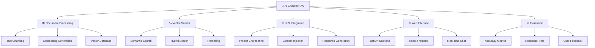

# 🤖 AI Chatbot với RAG

> **Mục tiêu**: Xây dựng chatbot AI thông minh sử dụng RAG (Retrieval-Augmented Generation) để trả lời câu hỏi dựa trên tài liệu

## 📋 Tổng quan dự án



## 📚 **1. Bảng ký hiệu (Notation)**

### **Documents & Text:**
- **Document**: $d_i \in \mathcal{D}$ (document trong collection)
- **Text chunk**: $c_j \in \mathcal{C}$ (chunk từ document)
- **Query**: $q$ (câu hỏi của user)
- **Vocabulary**: $\mathcal{V}$ (tập từ vựng)

### **Embeddings & Vectors:**
- **Document embedding**: $\mathbf{e}_d \in \mathbb{R}^d$ (embedding của document)
- **Query embedding**: $\mathbf{e}_q \in \mathbb{R}^d$ (embedding của query)
- **Chunk embedding**: $\mathbf{e}_c \in \mathbb{R}^d$ (embedding của chunk)
- **Embedding dimension**: $d$ (thường 384, 768, 1536)

### **Similarity & Search:**
- **Cosine similarity**: $\text{sim}(\mathbf{a}, \mathbf{b}) = \frac{\mathbf{a} \cdot \mathbf{b}}{\|\mathbf{a}\| \|\mathbf{b}\|}$
- **Euclidean distance**: $\text{dist}(\mathbf{a}, \mathbf{b}) = \|\mathbf{a} - \mathbf{b}\|_2$
- **Dot product**: $\mathbf{a} \cdot \mathbf{b} = \sum_i a_i b_i$

### **Retrieval & Ranking:**
- **Retrieved chunks**: $\mathcal{R} = \{c_1, c_2, \ldots, c_k\}$
- **Relevance score**: $s_i = \text{sim}(\mathbf{e}_q, \mathbf{e}_{c_i})$
- **Ranked list**: $\mathcal{R}_{\text{ranked}} = [(c_1, s_1), (c_2, s_2), \ldots]$

### **LLM & Generation:**
- **Context**: $\text{ctx} = \text{concat}(c_1, c_2, \ldots, c_k)$
- **Prompt**: $\text{prompt} = f(q, \text{ctx})$
- **Response**: $r = \text{LLM}(\text{prompt})$
- **Token**: $t_i \in \mathcal{T}$ (token trong sequence)

## 📖 **2. Glossary (Định nghĩa cốt lõi)**

### **RAG Components:**
- **Retrieval**: Quá trình tìm kiếm thông tin liên quan từ knowledge base
- **Generation**: Quá trình tạo câu trả lời dựa trên thông tin được tìm thấy
- **Augmentation**: Bổ sung thông tin từ external sources

### **Document Processing:**
- **Chunking**: Chia document thành các đoạn nhỏ hơn
- **Embedding**: Chuyển đổi text thành vector số
- **Vector database**: Cơ sở dữ liệu lưu trữ embeddings

### **Search & Retrieval:**
- **Semantic search**: Tìm kiếm dựa trên ý nghĩa ngữ nghĩa
- **Keyword search**: Tìm kiếm dựa trên từ khóa chính xác
- **Hybrid search**: Kết hợp semantic và keyword search
- **Reranking**: Sắp xếp lại kết quả tìm kiếm

### **LLM Integration:**
- **Prompt engineering**: Thiết kế prompt để LLM hiểu task
- **Context injection**: Đưa thông tin context vào prompt
- **Response generation**: Tạo câu trả lời từ LLM

### **Evaluation Metrics:**
- **Accuracy**: Độ chính xác của câu trả lời
- **Relevance**: Mức độ liên quan của retrieved documents
- **Response time**: Thời gian phản hồi của system
- **User satisfaction**: Mức độ hài lòng của user

## 🧠 **Lý thuyết cốt lõi**

### **1. RAG Architecture**

**Retrieval-Augmented Generation (RAG)** là kỹ thuật kết hợp:
- **Retrieval**: Tìm kiếm thông tin liên quan từ knowledge base
- **Generation**: Tạo câu trả lời dựa trên thông tin được tìm thấy

**Ưu điểm của RAG:**
- Giảm hallucination (tạo thông tin sai)
- Cập nhật knowledge dễ dàng
- Có thể cite nguồn thông tin
- Kiểm soát được nội dung trả lời

### **2. Technical Components**

**Document Processing Pipeline:**
```
Raw Documents → Chunking → Embedding → Vector Store → Index
```

**Query Processing Pipeline:**
```
User Query → Embedding → Vector Search → Context Retrieval → LLM → Response
```

## 🔧 **Technical Architecture**

### **1. System Architecture**

```python
class RAGSystem:
    """RAG System Architecture"""
    
    def __init__(self):
        self.components = {
            'document_processor': 'Text chunking and embedding',
            'vector_store': 'FAISS/Chroma vector database',
            'retriever': 'Semantic search engine',
            'llm': 'GPT/Claude/Llama model',
            'prompt_engine': 'Context-aware prompting',
            'response_generator': 'Answer generation'
        }
    
    def explain_architecture(self):
        """Explain RAG system architecture"""
        print("""
        **RAG System Architecture:**
        
        1. **Document Processing Layer:**
           - Text chunking (sliding window, semantic)
           - Embedding generation (SentenceTransformers, OpenAI)
           - Metadata extraction (source, timestamp, category)
        
        2. **Vector Storage Layer:**
           - FAISS/Chroma/Pinecone vector database
           - Index optimization (HNSW, IVF)
           - Metadata filtering capabilities
        
        3. **Retrieval Layer:**
           - Semantic search (cosine similarity)
           - Hybrid search (BM25 + semantic)
           - Reranking (cross-encoder models)
        
        4. **Generation Layer:**
           - Context injection into prompts
           - LLM integration (OpenAI, Anthropic, local)
           - Response formatting and citation
        
        5. **Interface Layer:**
           - REST API (FastAPI)
           - Web interface (React/Streamlit)
           - Real-time chat capabilities
        """)
```

## 📐 **3. Thẻ thuật toán - Document Chunking**

### **1. Bài toán & dữ liệu:**
- **Bài toán**: Chia document dài thành các chunk nhỏ hơn để xử lý
- **Dữ liệu**: Raw text documents $\mathcal{D} = \{d_1, d_2, \ldots, d_n\}$
- **Ứng dụng**: RAG, Document processing, Information retrieval

### **2. Mô hình & công thức:**
**Sliding Window Chunking:**
$$c_i = \text{text}[i \times \text{chunk\_size}:(i+1) \times \text{chunk\_size}]$$

**Semantic Chunking:**
$$c_i = \text{semantic\_split}(d, \text{max\_length}, \text{overlap})$$

Trong đó:
- $\text{chunk\_size}$: Kích thước chunk (thường 512, 1024 tokens)
- $\text{overlap}$: Số token overlap giữa chunks
- $\text{max\_length}$: Độ dài tối đa của chunk

### **3. Loss & mục tiêu:**
- **Mục tiêu**: Tạo chunks có ý nghĩa semantic và không quá dài
- **Loss**: Không có loss riêng, là preprocessing step

### **4. Tối ưu hoá & cập nhật:**
- **Algorithm**: Sliding window hoặc semantic splitting
- **Cập nhật**: Không có parameter learning

### **5. Hyperparams:**
- **Chunk size**: 256, 512, 1024 tokens
- **Overlap**: 50, 100, 200 tokens
- **Max length**: Giới hạn độ dài chunk

### **6. Độ phức tạp:**
- **Time**: $O(n)$ với $n$ là số tokens trong document
- **Space**: $O(n)$ cho storing chunks

### **7. Metrics đánh giá:**
- **Chunk quality**: Subjective evaluation
- **Information preservation**: Không mất thông tin quan trọng
- **Semantic coherence**: Chunk có ý nghĩa hoàn chỉnh

### **8. Ưu / Nhược:**
**Ưu điểm:**
- Đơn giản, dễ implement
- Preserves document structure
- Controllable chunk size

**Nhược điểm:**
- Có thể cắt giữa câu
- Không hiểu semantic boundaries
- Fixed size có thể không phù hợp

### **9. Bẫy & mẹo:**
- **Bẫy**: Chunk size quá nhỏ → mất context
- **Bẫy**: Chunk size quá lớn → không fit vào model
- **Mẹo**: Dùng sentence boundaries khi có thể
- **Mẹo**: Add overlap để preserve context

### **10. Pseudocode:**
```python
def sliding_window_chunking(text, chunk_size, overlap):
    chunks = []
    start = 0
    
    while start < len(text):
        end = start + chunk_size
        chunk = text[start:end]
        chunks.append(chunk)
        start = end - overlap
    
    return chunks

def semantic_chunking(text, max_length):
    # Split by sentences first
    sentences = split_sentences(text)
    chunks = []
    current_chunk = ""
    
    for sentence in sentences:
        if len(current_chunk + sentence) > max_length:
            if current_chunk:
                chunks.append(current_chunk.strip())
                current_chunk = sentence
            else:
                current_chunk = sentence
        else:
            current_chunk += sentence + " "
    
    if current_chunk:
        chunks.append(current_chunk.strip())
    
    return chunks
```

### **11. Code mẫu:**
```python
import re
from typing import List, Dict
from sentence_transformers import SentenceTransformer

class DocumentProcessor:
    """Advanced document processing for RAG"""
    
    def __init__(self, chunk_size=512, chunk_overlap=50):
        self.chunk_size = chunk_size
        self.chunk_overlap = chunk_overlap
        self.embedding_model = SentenceTransformer('all-MiniLM-L6-v2')
    
    def semantic_chunking(self, text: str) -> List[str]:
        """Semantic-aware text chunking"""
        # Split by sentences first
        sentences = re.split(r'[.!?]+', text)
        sentences = [s.strip() for s in sentences if s.strip()]
        
        chunks = []
        current_chunk = ""
        
        for sentence in sentences:
            # Check if adding sentence exceeds chunk size
            if len(current_chunk + sentence) > self.chunk_size:
                if current_chunk:
                    chunks.append(current_chunk.strip())
                    # Start new chunk with overlap
                    overlap_sentences = current_chunk.split('.')[-2:]
                    current_chunk = '. '.join(overlap_sentences) + '. ' + sentence
                else:
                    current_chunk = sentence
            else:
                current_chunk += sentence + ". "
        
        if current_chunk:
            chunks.append(current_chunk.strip())
        
        return chunks
    
    def generate_embeddings(self, chunks: List[str]) -> List[List[float]]:
        """Generate embeddings for text chunks"""
        embeddings = self.embedding_model.encode(chunks, normalize_embeddings=True)
        return embeddings.tolist()
    
    def process_documents(self, documents: List[Dict]) -> List[Dict]:
        """Process documents into chunks with embeddings"""
        processed_chunks = []
        
        for doc in documents:
            chunks = self.semantic_chunking(doc['content'])
            embeddings = self.generate_embeddings(chunks)
            
            for i, (chunk, embedding) in enumerate(zip(chunks, embeddings)):
                processed_chunks.append({
                    'id': f"{doc['id']}_chunk_{i}",
                    'content': chunk,
                    'embedding': embedding,
                    'metadata': {
                        'source': doc.get('source', 'unknown'),
                        'title': doc.get('title', ''),
                        'chunk_index': i,
                        'total_chunks': len(chunks)
                    }
                })
        
        return processed_chunks
```

### **12. Checklist kiểm tra nhanh:**
- [ ] Chunk size có phù hợp?
- [ ] Overlap có được tính đúng?
- [ ] Chunks có semantic coherence?
- [ ] Không mất thông tin quan trọng?
- [ ] Performance có acceptable?

---

## 🔍 **4. Thẻ thuật toán - Vector Search**

### **1. Bài toán & dữ liệu:**
- **Bài toán**: Tìm kiếm documents/chunks tương tự với query
- **Dữ liệu**: Query embedding $\mathbf{e}_q$, Chunk embeddings $\{\mathbf{e}_{c_i}\}$
- **Ứng dụng**: Information retrieval, Recommendation systems

### **2. Mô hình & công thức:**
**Cosine Similarity:**
$$\text{sim}(\mathbf{e}_q, \mathbf{e}_{c_i}) = \frac{\mathbf{e}_q \cdot \mathbf{e}_{c_i}}{\|\mathbf{e}_q\| \|\mathbf{e}_{c_i}\|}$$

**Euclidean Distance:**
$$\text{dist}(\mathbf{e}_q, \mathbf{e}_{c_i}) = \|\mathbf{e}_q - \mathbf{e}_{c_i}\|_2$$

**Hybrid Search:**
$$\text{score}_i = \alpha \cdot \text{sim}_{\text{semantic}}(\mathbf{e}_q, \mathbf{e}_{c_i}) + (1-\alpha) \cdot \text{sim}_{\text{keyword}}(q, c_i)$$

### **3. Loss & mục tiêu:**
- **Mục tiêu**: Tìm top-k chunks có similarity cao nhất
- **Loss**: Không có loss riêng, là retrieval step

### **4. Tối ưu hoá & cập nhật:**
- **Algorithm**: Exact search hoặc approximate search (FAISS)
- **Cập nhật**: Không có parameter learning

### **5. Hyperparams:**
- **Top-k**: Số kết quả trả về (thường 5-20)
- **Similarity threshold**: Ngưỡng similarity tối thiểu
- **Alpha**: Weight cho hybrid search (0.5)

### **6. Độ phức tạp:**
- **Time**: $O(n \times d)$ cho exact search, $O(\log n \times d)$ cho approximate
- **Space**: $O(n \times d)$ cho storing embeddings

### **7. Metrics đánh giá:**
- **Precision@k**: $\frac{\text{Relevant in top-k}}{\text{top-k}}$
- **Recall@k**: $\frac{\text{Relevant in top-k}}{\text{Total relevant}}$
- **MRR**: Mean Reciprocal Rank
- **NDCG**: Normalized Discounted Cumulative Gain

### **8. Ưu / Nhược:**
**Ưu điểm:**
- Fast retrieval với approximate search
- Semantic understanding
- Scalable với large datasets

**Nhược điểm:**
- Quality phụ thuộc vào embedding model
- Không hiểu complex queries
- Expensive với exact search

### **9. Bẫy & mẹo:**
- **Bẫy**: Embedding model không phù hợp → poor retrieval
- **Bẫy**: Chỉ dùng semantic search → miss exact matches
- **Mẹo**: Dùng hybrid search
- **Mẹo**: Rerank với cross-encoder

### **10. Pseudocode:**
```python
def vector_search(query_embedding, chunk_embeddings, top_k=5):
    similarities = []
    
    for i, chunk_embedding in enumerate(chunk_embeddings):
        # Calculate cosine similarity
        similarity = cosine_similarity(query_embedding, chunk_embedding)
        similarities.append((similarity, i))
    
    # Sort by similarity (descending)
    similarities.sort(reverse=True)
    
    # Return top-k results
    return similarities[:top_k]

def hybrid_search(query, query_embedding, chunks, alpha=0.5):
    results = []
    
    for i, chunk in enumerate(chunks):
        # Semantic similarity
        semantic_score = cosine_similarity(query_embedding, chunk['embedding'])
        
        # Keyword similarity
        keyword_score = keyword_similarity(query, chunk['content'])
        
        # Combined score
        combined_score = alpha * semantic_score + (1 - alpha) * keyword_score
        results.append((combined_score, i))
    
    # Sort and return top-k
    results.sort(reverse=True)
    return results[:top_k]
```

### **11. Code mẫu:**
```python
import faiss
import numpy as np
from typing import List, Dict, Tuple

class VectorSearchEngine:
    """Advanced vector search engine"""
    
    def __init__(self, dimension=384):
        self.dimension = dimension
        self.index = faiss.IndexFlatIP(dimension)  # Inner product for normalized vectors
        self.chunks = []
        self.metadata = []
    
    def add_chunks(self, chunks: List[Dict]):
        """Add chunks to the vector index"""
        embeddings = np.array([chunk['embedding'] for chunk in chunks])
        self.index.add(embeddings.astype('float32'))
        
        self.chunks.extend([chunk['content'] for chunk in chunks])
        self.metadata.extend([chunk['metadata'] for chunk in chunks])
    
    def semantic_search(self, query: str, k: int = 5) -> List[Dict]:
        """Semantic search for similar chunks"""
        # Generate query embedding
        embedding_model = SentenceTransformer('all-MiniLM-L6-v2')
        query_embedding = embedding_model.encode([query], normalize_embeddings=True)
        
        # Search in index
        scores, indices = self.index.search(query_embedding.astype('float32'), k)
        
        # Return results
        results = []
        for score, idx in zip(scores[0], indices[0]):
            results.append({
                'content': self.chunks[idx],
                'score': float(score),
                'metadata': self.metadata[idx]
            })
        
        return results
    
    def hybrid_search(self, query: str, k: int = 5, alpha: float = 0.5) -> List[Dict]:
        """Hybrid search combining semantic and keyword search"""
        # Semantic search
        semantic_results = self.semantic_search(query, k)
        
        # Keyword search (BM25-like)
        keyword_results = self.keyword_search(query, k)
        
        # Combine scores
        combined_results = {}
        
        for result in semantic_results:
            combined_results[result['content']] = {
                'content': result['content'],
                'semantic_score': result['score'],
                'keyword_score': 0,
                'metadata': result['metadata']
            }
        
        for result in keyword_results:
            if result['content'] in combined_results:
                combined_results[result['content']]['keyword_score'] = result['score']
            else:
                combined_results[result['content']] = {
                    'content': result['content'],
                    'semantic_score': 0,
                    'keyword_score': result['score'],
                    'metadata': result['metadata']
                }
        
        # Calculate combined score
        for content, data in combined_results.items():
            data['combined_score'] = (alpha * data['semantic_score'] + 
                                    (1 - alpha) * data['keyword_score'])
        
        # Sort by combined score
        sorted_results = sorted(combined_results.values(), 
                               key=lambda x: x['combined_score'], reverse=True)
        
        return sorted_results[:k]
    
    def keyword_search(self, query: str, k: int = 5) -> List[Dict]:
        """Simple keyword-based search"""
        query_words = set(query.lower().split())
        
        scores = []
        for i, chunk in enumerate(self.chunks):
            chunk_words = set(chunk.lower().split())
            intersection = len(query_words & chunk_words)
            union = len(query_words | chunk_words)
            
            if union > 0:
                jaccard_similarity = intersection / union
                scores.append((jaccard_similarity, i))
        
        # Sort by score and return top k
        scores.sort(reverse=True)
        results = []
        for score, idx in scores[:k]:
            results.append({
                'content': self.chunks[idx],
                'score': score,
                'metadata': self.metadata[idx]
            })
        
        return results
```

### **12. Checklist kiểm tra nhanh:**
- [ ] Embeddings có được normalize?
- [ ] Similarity metric có phù hợp?
- [ ] Top-k có reasonable?
- [ ] Search có fast enough?
- [ ] Results có relevant?

---

## 🧠 **5. Thẻ thuật toán - LLM Integration**

### **1. Bài toán & dữ liệu:**
- **Bài toán**: Tạo câu trả lời dựa trên retrieved context
- **Dữ liệu**: Query $q$, Retrieved chunks $\mathcal{R} = \{c_1, c_2, \ldots, c_k\}$
- **Ứng dụng**: Question answering, Chatbots, Information retrieval

### **2. Mô hình & công thức:**
**Context Injection:**
$$\text{prompt} = f(q, \text{ctx}) = \text{template}(q, c_1, c_2, \ldots, c_k)$$

**Response Generation:**
$$r = \text{LLM}(\text{prompt}) = \arg\max_{r} P(r|\text{prompt})$$

**Citation Extraction:**
$$\text{citations} = \text{extract\_sources}(\text{ctx}, r)$$

### **3. Loss & mục tiêu:**
- **Mục tiêu**: Tạo câu trả lời chính xác và có cite nguồn
- **Loss**: Cross-entropy loss cho text generation

### **4. Tối ưu hoá & cập nhật:**
- **Algorithm**: Autoregressive generation
- **Cập nhật**: Không có parameter learning (black-box LLM)

### **5. Hyperparams:**
- **Temperature**: 0.7 (creativity vs consistency)
- **Max tokens**: 500 (response length)
- **Top-p**: 0.9 (nucleus sampling)
- **Context length**: 4096 (max input length)

### **6. Độ phức tạp:**
- **Time**: $O(\text{context\_length} \times \text{response\_length})$
- **Space**: $O(\text{context\_length})$ cho storing context

### **7. Metrics đánh giá:**
- **Answer accuracy**: Subjective evaluation
- **Citation accuracy**: Precision/recall của citations
- **Response time**: Latency của generation
- **User satisfaction**: Feedback từ users

### **8. Ưu / Nhược:**
**Ưu điểm:**
- High-quality responses
- Natural language generation
- Context-aware answers

**Nhược điểm:**
- Expensive API calls
- Black-box behavior
- Potential hallucinations

### **9. Bẫy & mẹo:**
- **Bẫy**: Context quá dài → truncation
- **Bẫy**: Temperature quá cao → inconsistent
- **Mẹo**: Dùng few-shot prompting
- **Mẹo**: Implement citation tracking

### **10. Pseudocode:**
```python
def generate_response(query, context_chunks, llm_model):
    # Build context string
    context_text = "\n\n".join([
        f"Source: {chunk['metadata']['source']}\nContent: {chunk['content']}"
        for chunk in context_chunks
    ])
    
    # Create prompt
    prompt = f"""
    Based on the following context, please answer the user's question.
    If the context doesn't contain enough information, say "I don't have enough information."
    
    Context:
    {context_text}
    
    Question: {query}
    
    Answer:"""
    
    # Generate response
    response = llm_model.generate(prompt)
    
    # Extract citations
    citations = extract_citations(context_chunks)
    
    return {
        'answer': response,
        'citations': citations,
        'context_used': len(context_chunks)
    }
```

### **11. Code mẫu:**
```python
import openai
from typing import List, Dict

class LLMIntegration:
    """LLM integration for RAG system"""
    
    def __init__(self, model_name="gpt-3.5-turbo", api_key=None):
        self.model_name = model_name
        if api_key:
            openai.api_key = api_key
    
    def generate_response(self, query: str, context_chunks: List[Dict]) -> Dict:
        """Generate response using retrieved context"""
        
        # Build context string
        context_text = "\n\n".join([
            f"Source: {chunk['metadata']['source']}\nContent: {chunk['content']}"
            for chunk in context_chunks
        ])
        
        # Create prompt
        prompt = f"""
        Based on the following context, please answer the user's question.
        If the context doesn't contain enough information to answer the question,
        say "I don't have enough information to answer this question."
        
        Context:
        {context_text}
        
        Question: {query}
        
        Answer:"""
        
        try:
            response = openai.ChatCompletion.create(
                model=self.model_name,
                messages=[
                    {"role": "system", "content": "You are a helpful AI assistant that answers questions based on provided context."},
                    {"role": "user", "content": prompt}
                ],
                max_tokens=500,
                temperature=0.7
            )
            
            answer = response.choices[0].message.content
            
            # Extract citations
            citations = self.extract_citations(context_chunks)
            
            return {
                'answer': answer,
                'citations': citations,
                'context_used': len(context_chunks),
                'model_used': self.model_name
            }
            
        except Exception as e:
            return {
                'answer': f"Error generating response: {str(e)}",
                'citations': [],
                'context_used': 0,
                'model_used': self.model_name
            }
    
    def extract_citations(self, context_chunks: List[Dict]) -> List[Dict]:
        """Extract citation information from context chunks"""
        citations = []
        for i, chunk in enumerate(context_chunks):
            citations.append({
                'id': i + 1,
                'source': chunk['metadata']['source'],
                'title': chunk['metadata'].get('title', ''),
                'relevance_score': chunk['score']
            })
        return citations
```

### **12. Checklist kiểm tra nhanh:**
- [ ] Prompt có clear và specific?
- [ ] Context có được format đúng?
- [ ] Temperature có phù hợp?
- [ ] Response có cite sources?
- [ ] Error handling có đầy đủ?

---

## 🚀 **Implementation**

### **1. FastAPI Backend**

```python
from fastapi import FastAPI, HTTPException
from pydantic import BaseModel
from typing import List, Optional
import uvicorn

app = FastAPI(title="RAG Chatbot API")

class QueryRequest(BaseModel):
    query: str
    search_type: str = "semantic"  # semantic, keyword, hybrid
    num_results: int = 5

class QueryResponse(BaseModel):
    answer: str
    citations: List[Dict]
    context_used: int
    model_used: str
    search_results: List[Dict]

# Initialize components
document_processor = DocumentProcessor()
search_engine = VectorSearchEngine()
llm_integration = LLMIntegration()

@app.post("/query", response_model=QueryResponse)
async def process_query(request: QueryRequest):
    """Process user query and return response"""
    
    try:
        # Search for relevant context
        if request.search_type == "semantic":
            search_results = search_engine.semantic_search(request.query, request.num_results)
        elif request.search_type == "keyword":
            search_results = search_engine.keyword_search(request.query, request.num_results)
        elif request.search_type == "hybrid":
            search_results = search_engine.hybrid_search(request.query, request.num_results)
        else:
            raise HTTPException(status_code=400, detail="Invalid search type")
        
        # Generate response
        response = llm_integration.generate_response(request.query, search_results)
        response['search_results'] = search_results
        
        return QueryResponse(**response)
        
    except Exception as e:
        raise HTTPException(status_code=500, detail=str(e))

@app.post("/add_documents")
async def add_documents(documents: List[Dict]):
    """Add documents to the knowledge base"""
    try:
        processed_chunks = document_processor.process_documents(documents)
        search_engine.add_chunks(processed_chunks)
        return {"message": f"Added {len(processed_chunks)} chunks to knowledge base"}
    except Exception as e:
        raise HTTPException(status_code=500, detail=str(e))

if __name__ == "__main__":
    uvicorn.run(app, host="0.0.0.0", port=8000)
```

### **2. React Frontend**

```jsx
// ChatInterface.jsx
import React, { useState, useRef, useEffect } from 'react';
import axios from 'axios';

const ChatInterface = () => {
    const [messages, setMessages] = useState([]);
    const [input, setInput] = useState('');
    const [loading, setLoading] = useState(false);
    const messagesEndRef = useRef(null);

    const scrollToBottom = () => {
        messagesEndRef.current?.scrollIntoView({ behavior: "smooth" });
    };

    useEffect(scrollToBottom, [messages]);

    const sendMessage = async () => {
        if (!input.trim()) return;

        const userMessage = {
            type: 'user',
            content: input,
            timestamp: new Date().toISOString()
        };

        setMessages(prev => [...prev, userMessage]);
        setInput('');
        setLoading(true);

        try {
            const response = await axios.post('/api/query', {
                query: input,
                search_type: 'hybrid',
                num_results: 5
            });

            const botMessage = {
                type: 'bot',
                content: response.data.answer,
                citations: response.data.citations,
                timestamp: new Date().toISOString()
            };

            setMessages(prev => [...prev, botMessage]);
        } catch (error) {
            const errorMessage = {
                type: 'error',
                content: 'Sorry, I encountered an error. Please try again.',
                timestamp: new Date().toISOString()
            };
            setMessages(prev => [...prev, errorMessage]);
        } finally {
            setLoading(false);
        }
    };

    return (
        <div className="chat-container">
            <div className="messages">
                {messages.map((message, index) => (
                    <div key={index} className={`message ${message.type}`}>
                        <div className="message-content">{message.content}</div>
                        {message.citations && (
                            <div className="citations">
                                <h4>Sources:</h4>
                                {message.citations.map((citation, i) => (
                                    <div key={i} className="citation">
                                        [{citation.id}] {citation.source}
                                    </div>
                                ))}
                            </div>
                        )}
                        <div className="timestamp">
                            {new Date(message.timestamp).toLocaleTimeString()}
                        </div>
                    </div>
                ))}
                {loading && (
                    <div className="message bot">
                        <div className="loading">Thinking...</div>
                    </div>
                )}
                <div ref={messagesEndRef} />
            </div>
            
            <div className="input-container">
                <input
                    type="text"
                    value={input}
                    onChange={(e) => setInput(e.target.value)}
                    onKeyPress={(e) => e.key === 'Enter' && sendMessage()}
                    placeholder="Ask me anything..."
                    disabled={loading}
                />
                <button onClick={sendMessage} disabled={loading}>
                    Send
                </button>
            </div>
        </div>
    );
};

export default ChatInterface;
```

## 📊 **Evaluation & Metrics**

### **1. Performance Metrics**

```python
class RAGEvaluator:
    """Evaluation system for RAG chatbot"""
    
    def __init__(self):
        self.metrics = {
            'response_time': [],
            'answer_quality': [],
            'citation_accuracy': [],
            'user_satisfaction': []
        }
    
    def evaluate_response_time(self, query: str, response_time: float):
        """Evaluate response time"""
        self.metrics['response_time'].append({
            'query': query,
            'time': response_time,
            'timestamp': datetime.now()
        })
    
    def evaluate_answer_quality(self, query: str, answer: str, ground_truth: str):
        """Evaluate answer quality using BLEU/ROUGE"""
        from nltk.translate.bleu_score import sentence_bleu
        from rouge import Rouge
        
        # BLEU score
        bleu_score = sentence_bleu([ground_truth.split()], answer.split())
        
        # ROUGE score
        rouge = Rouge()
        rouge_scores = rouge.get_scores(answer, ground_truth)
        
        self.metrics['answer_quality'].append({
            'query': query,
            'bleu_score': bleu_score,
            'rouge_scores': rouge_scores,
            'timestamp': datetime.now()
        })
    
    def evaluate_citation_accuracy(self, query: str, citations: List[Dict], 
                                 relevant_sources: List[str]):
        """Evaluate citation accuracy"""
        cited_sources = [citation['source'] for citation in citations]
        
        # Precision: relevant citations / total citations
        precision = len(set(cited_sources) & set(relevant_sources)) / len(cited_sources) if cited_sources else 0
        
        # Recall: relevant citations / total relevant sources
        recall = len(set(cited_sources) & set(relevant_sources)) / len(relevant_sources) if relevant_sources else 0
        
        # F1 score
        f1 = 2 * (precision * recall) / (precision + recall) if (precision + recall) > 0 else 0
        
        self.metrics['citation_accuracy'].append({
            'query': query,
            'precision': precision,
            'recall': recall,
            'f1_score': f1,
            'timestamp': datetime.now()
        })
    
    def generate_report(self) -> Dict:
        """Generate evaluation report"""
        report = {}
        
        # Response time analysis
        response_times = [m['time'] for m in self.metrics['response_time']]
        report['avg_response_time'] = np.mean(response_times)
        report['p95_response_time'] = np.percentile(response_times, 95)
        
        # Answer quality analysis
        bleu_scores = [m['bleu_score'] for m in self.metrics['answer_quality']]
        report['avg_bleu_score'] = np.mean(bleu_scores)
        
        # Citation accuracy analysis
        f1_scores = [m['f1_score'] for m in self.metrics['citation_accuracy']]
        report['avg_citation_f1'] = np.mean(f1_scores)
        
        return report
```

## 🎯 **Deployment & Production**

### **1. Docker Configuration**

```dockerfile
# Dockerfile
FROM python:3.9-slim

WORKDIR /app

# Install system dependencies
RUN apt-get update && apt-get install -y \
    build-essential \
    && rm -rf /var/lib/apt/lists/*

# Install Python dependencies
COPY requirements.txt .
RUN pip install --no-cache-dir -r requirements.txt

# Copy application code
COPY . .

# Expose port
EXPOSE 8000

# Run application
CMD ["uvicorn", "main:app", "--host", "0.0.0.0", "--port", "8000"]
```

### **2. Kubernetes Deployment**

```yaml
# k8s-deployment.yaml
apiVersion: apps/v1
kind: Deployment
metadata:
  name: rag-chatbot
spec:
  replicas: 3
  selector:
    matchLabels:
      app: rag-chatbot
  template:
    metadata:
      labels:
        app: rag-chatbot
    spec:
      containers:
      - name: rag-chatbot
        image: rag-chatbot:latest
        ports:
        - containerPort: 8000
        env:
        - name: OPENAI_API_KEY
          valueFrom:
            secretKeyRef:
              name: openai-secret
              key: api-key
        resources:
          requests:
            memory: "512Mi"
            cpu: "250m"
          limits:
            memory: "1Gi"
            cpu: "500m"
---
apiVersion: v1
kind: Service
metadata:
  name: rag-chatbot-service
spec:
  selector:
    app: rag-chatbot
  ports:
  - port: 80
    targetPort: 8000
  type: LoadBalancer
```

## 📚 **Tài liệu tham khảo**

### **Papers quan trọng:**
- [RAG: Retrieval-Augmented Generation](https://arxiv.org/abs/2005.11401) - Lewis et al.
- [Dense Passage Retrieval](https://arxiv.org/abs/2004.04906) - Karpukhin et al.
- [REPLUG: Retrieval-Augmented Black-Box Language Models](https://arxiv.org/abs/2301.12652) - Shi et al.

### **Tools & Libraries:**
- [LangChain](https://langchain.readthedocs.io/) - RAG framework
- [Chroma](https://docs.trychroma.com/) - Vector database
- [FAISS](https://github.com/facebookresearch/faiss) - Vector similarity search
- [Sentence Transformers](https://www.sbert.net/) - Embedding models

---

## 🎯 **Bài tập thực hành**

### **Bài tập 1: Basic RAG Implementation**
1. Implement document processing pipeline
2. Set up vector database with FAISS
3. Create simple retrieval system
4. Integrate with OpenAI API

### **Bài tập 2: Advanced Retrieval**
1. Implement hybrid search (semantic + keyword)
2. Add reranking with cross-encoder
3. Optimize search parameters
4. Evaluate retrieval quality

### **Bài tập 3: Web Interface**
1. Build FastAPI backend
2. Create React frontend
3. Implement real-time chat
4. Add citation display

### **Bài tập 4: Evaluation & Optimization**
1. Implement evaluation metrics
2. Optimize response time
3. Add caching layer
4. Monitor system performance

---

## 🎓 **Cách học hiệu quả**

### **Bước 1: Đọc công thức → tra ký hiệu → hiểu trực giác**
- Đọc công thức toán học (similarity, embeddings)
- Tra cứu bảng ký hiệu để hiểu từng thành phần
- Tìm hiểu ý nghĩa trực giác của RAG pipeline

### **Bước 2: Điền "Thẻ thuật toán" cho từng mô hình**
- Hoàn thành 12 mục trong thẻ thuật toán cho mỗi component
- Viết pseudocode và code mẫu
- Kiểm tra checklist

### **Bước 3: Làm Lab nhỏ → Mini-project → Case study**
- Bắt đầu với lab đơn giản (document processing)
- Tiến tới mini-project phức tạp hơn (hybrid search)
- Áp dụng vào case study thực tế (customer support chatbot)

### **Bước 4: Đánh giá bằng metric phù hợp**
- Chọn metric đánh giá phù hợp với bài toán (accuracy, response time)
- So sánh với baseline
- Phân tích kết quả và optimize

---

*Chúc bạn xây dựng thành công chatbot AI thông minh! 🚀*

## 🔧 **Technical Architecture**

### **1. System Architecture**

```python
class RAGSystem:
    """RAG System Architecture"""
    
    def __init__(self):
        self.components = {
            'document_processor': 'Text chunking and embedding',
            'vector_store': 'FAISS/Chroma vector database',
            'retriever': 'Semantic search engine',
            'llm': 'GPT/Claude/Llama model',
            'prompt_engine': 'Context-aware prompting',
            'response_generator': 'Answer generation'
        }
    
    def explain_architecture(self):
        """Explain RAG system architecture"""
        print("""
        **RAG System Architecture:**
        
        1. **Document Processing Layer:**
           - Text chunking (sliding window, semantic)
           - Embedding generation (SentenceTransformers, OpenAI)
           - Metadata extraction (source, timestamp, category)
        
        2. **Vector Storage Layer:**
           - FAISS/Chroma/Pinecone vector database
           - Index optimization (HNSW, IVF)
           - Metadata filtering capabilities
        
        3. **Retrieval Layer:**
           - Semantic search (cosine similarity)
           - Hybrid search (BM25 + semantic)
           - Reranking (cross-encoder models)
        
        4. **Generation Layer:**
           - Context injection into prompts
           - LLM integration (OpenAI, Anthropic, local)
           - Response formatting and citation
        
        5. **Interface Layer:**
           - REST API (FastAPI)
           - Web interface (React/Streamlit)
           - Real-time chat capabilities
        """)
```

### **2. Document Processing**

**Advanced chunking strategies:**
```python
import re
from typing import List, Dict
from sentence_transformers import SentenceTransformer

class DocumentProcessor:
    """Advanced document processing for RAG"""
    
    def __init__(self, chunk_size=512, chunk_overlap=50):
        self.chunk_size = chunk_size
        self.chunk_overlap = chunk_overlap
        self.embedding_model = SentenceTransformer('all-MiniLM-L6-v2')
    
    def semantic_chunking(self, text: str) -> List[str]:
        """Semantic-aware text chunking"""
        # Split by sentences first
        sentences = re.split(r'[.!?]+', text)
        sentences = [s.strip() for s in sentences if s.strip()]
        
        chunks = []
        current_chunk = ""
        
        for sentence in sentences:
            # Check if adding sentence exceeds chunk size
            if len(current_chunk + sentence) > self.chunk_size:
                if current_chunk:
                    chunks.append(current_chunk.strip())
                    # Start new chunk with overlap
                    overlap_sentences = current_chunk.split('.')[-2:]
                    current_chunk = '. '.join(overlap_sentences) + '. ' + sentence
                else:
                    current_chunk = sentence
            else:
                current_chunk += sentence + ". "
        
        if current_chunk:
            chunks.append(current_chunk.strip())
        
        return chunks
    
    def generate_embeddings(self, chunks: List[str]) -> List[List[float]]:
        """Generate embeddings for text chunks"""
        embeddings = self.embedding_model.encode(chunks, normalize_embeddings=True)
        return embeddings.tolist()
    
    def process_documents(self, documents: List[Dict]) -> List[Dict]:
        """Process documents into chunks with embeddings"""
        processed_chunks = []
        
        for doc in documents:
            chunks = self.semantic_chunking(doc['content'])
            embeddings = self.generate_embeddings(chunks)
            
            for i, (chunk, embedding) in enumerate(zip(chunks, embeddings)):
                processed_chunks.append({
                    'id': f"{doc['id']}_chunk_{i}",
                    'content': chunk,
                    'embedding': embedding,
                    'metadata': {
                        'source': doc.get('source', 'unknown'),
                        'title': doc.get('title', ''),
                        'chunk_index': i,
                        'total_chunks': len(chunks)
                    }
                })
        
        return processed_chunks
```

### **3. Vector Search Engine**

**Advanced retrieval system:**
```python
import faiss
import numpy as np
from typing import List, Dict, Tuple

class VectorSearchEngine:
    """Advanced vector search engine"""
    
    def __init__(self, dimension=384):
        self.dimension = dimension
        self.index = faiss.IndexFlatIP(dimension)  # Inner product for normalized vectors
        self.chunks = []
        self.metadata = []
    
    def add_chunks(self, chunks: List[Dict]):
        """Add chunks to the vector index"""
        embeddings = np.array([chunk['embedding'] for chunk in chunks])
        self.index.add(embeddings.astype('float32'))
        
        self.chunks.extend([chunk['content'] for chunk in chunks])
        self.metadata.extend([chunk['metadata'] for chunk in chunks])
    
    def semantic_search(self, query: str, k: int = 5) -> List[Dict]:
        """Semantic search for similar chunks"""
        # Generate query embedding
        embedding_model = SentenceTransformer('all-MiniLM-L6-v2')
        query_embedding = embedding_model.encode([query], normalize_embeddings=True)
        
        # Search in index
        scores, indices = self.index.search(query_embedding.astype('float32'), k)
        
        # Return results
        results = []
        for score, idx in zip(scores[0], indices[0]):
            results.append({
                'content': self.chunks[idx],
                'score': float(score),
                'metadata': self.metadata[idx]
            })
        
        return results
    
    def hybrid_search(self, query: str, k: int = 5, alpha: float = 0.5) -> List[Dict]:
        """Hybrid search combining semantic and keyword search"""
        # Semantic search
        semantic_results = self.semantic_search(query, k)
        
        # Keyword search (BM25-like)
        keyword_results = self.keyword_search(query, k)
        
        # Combine scores
        combined_results = {}
        
        for result in semantic_results:
            combined_results[result['content']] = {
                'content': result['content'],
                'semantic_score': result['score'],
                'keyword_score': 0,
                'metadata': result['metadata']
            }
        
        for result in keyword_results:
            if result['content'] in combined_results:
                combined_results[result['content']]['keyword_score'] = result['score']
            else:
                combined_results[result['content']] = {
                    'content': result['content'],
                    'semantic_score': 0,
                    'keyword_score': result['score'],
                    'metadata': result['metadata']
                }
        
        # Calculate combined score
        for content, data in combined_results.items():
            data['combined_score'] = (alpha * data['semantic_score'] + 
                                    (1 - alpha) * data['keyword_score'])
        
        # Sort by combined score
        sorted_results = sorted(combined_results.values(), 
                               key=lambda x: x['combined_score'], reverse=True)
        
        return sorted_results[:k]
    
    def keyword_search(self, query: str, k: int = 5) -> List[Dict]:
        """Simple keyword-based search"""
        query_words = set(query.lower().split())
        
        scores = []
        for i, chunk in enumerate(self.chunks):
            chunk_words = set(chunk.lower().split())
            intersection = len(query_words & chunk_words)
            union = len(query_words | chunk_words)
            
            if union > 0:
                jaccard_similarity = intersection / union
                scores.append((jaccard_similarity, i))
        
        # Sort by score and return top k
        scores.sort(reverse=True)
        results = []
        for score, idx in scores[:k]:
            results.append({
                'content': self.chunks[idx],
                'score': score,
                'metadata': self.metadata[idx]
            })
        
        return results
```

### **4. LLM Integration**

**Advanced LLM integration with context:**
```python
import openai
from typing import List, Dict

class LLMIntegration:
    """LLM integration for RAG system"""
    
    def __init__(self, model_name="gpt-3.5-turbo", api_key=None):
        self.model_name = model_name
        if api_key:
            openai.api_key = api_key
    
    def generate_response(self, query: str, context_chunks: List[Dict]) -> Dict:
        """Generate response using retrieved context"""
        
        # Build context string
        context_text = "\n\n".join([
            f"Source: {chunk['metadata']['source']}\nContent: {chunk['content']}"
            for chunk in context_chunks
        ])
        
        # Create prompt
        prompt = f"""
        Based on the following context, please answer the user's question.
        If the context doesn't contain enough information to answer the question,
        say "I don't have enough information to answer this question."
        
        Context:
        {context_text}
        
        Question: {query}
        
        Answer:"""
        
        try:
            response = openai.ChatCompletion.create(
                model=self.model_name,
                messages=[
                    {"role": "system", "content": "You are a helpful AI assistant that answers questions based on provided context."},
                    {"role": "user", "content": prompt}
                ],
                max_tokens=500,
                temperature=0.7
            )
            
            answer = response.choices[0].message.content
            
            # Extract citations
            citations = self.extract_citations(context_chunks)
            
            return {
                'answer': answer,
                'citations': citations,
                'context_used': len(context_chunks),
                'model_used': self.model_name
            }
            
        except Exception as e:
            return {
                'answer': f"Error generating response: {str(e)}",
                'citations': [],
                'context_used': 0,
                'model_used': self.model_name
            }
    
    def extract_citations(self, context_chunks: List[Dict]) -> List[Dict]:
        """Extract citation information from context chunks"""
        citations = []
        for i, chunk in enumerate(context_chunks):
            citations.append({
                'id': i + 1,
                'source': chunk['metadata']['source'],
                'title': chunk['metadata'].get('title', ''),
                'relevance_score': chunk['score']
            })
        return citations
```

## 🚀 **Implementation**

### **1. FastAPI Backend**

```python
from fastapi import FastAPI, HTTPException
from pydantic import BaseModel
from typing import List, Optional
import uvicorn

app = FastAPI(title="RAG Chatbot API")

class QueryRequest(BaseModel):
    query: str
    search_type: str = "semantic"  # semantic, keyword, hybrid
    num_results: int = 5

class QueryResponse(BaseModel):
    answer: str
    citations: List[Dict]
    context_used: int
    model_used: str
    search_results: List[Dict]

# Initialize components
document_processor = DocumentProcessor()
search_engine = VectorSearchEngine()
llm_integration = LLMIntegration()

@app.post("/query", response_model=QueryResponse)
async def process_query(request: QueryRequest):
    """Process user query and return response"""
    
    try:
        # Search for relevant context
        if request.search_type == "semantic":
            search_results = search_engine.semantic_search(request.query, request.num_results)
        elif request.search_type == "keyword":
            search_results = search_engine.keyword_search(request.query, request.num_results)
        elif request.search_type == "hybrid":
            search_results = search_engine.hybrid_search(request.query, request.num_results)
        else:
            raise HTTPException(status_code=400, detail="Invalid search type")
        
        # Generate response
        response = llm_integration.generate_response(request.query, search_results)
        response['search_results'] = search_results
        
        return QueryResponse(**response)
        
    except Exception as e:
        raise HTTPException(status_code=500, detail=str(e))

@app.post("/add_documents")
async def add_documents(documents: List[Dict]):
    """Add documents to the knowledge base"""
    try:
        processed_chunks = document_processor.process_documents(documents)
        search_engine.add_chunks(processed_chunks)
        return {"message": f"Added {len(processed_chunks)} chunks to knowledge base"}
    except Exception as e:
        raise HTTPException(status_code=500, detail=str(e))

if __name__ == "__main__":
    uvicorn.run(app, host="0.0.0.0", port=8000)
```

### **2. React Frontend**

```jsx
// ChatInterface.jsx
import React, { useState, useRef, useEffect } from 'react';
import axios from 'axios';

const ChatInterface = () => {
    const [messages, setMessages] = useState([]);
    const [input, setInput] = useState('');
    const [loading, setLoading] = useState(false);
    const messagesEndRef = useRef(null);

    const scrollToBottom = () => {
        messagesEndRef.current?.scrollIntoView({ behavior: "smooth" });
    };

    useEffect(scrollToBottom, [messages]);

    const sendMessage = async () => {
        if (!input.trim()) return;

        const userMessage = {
            type: 'user',
            content: input,
            timestamp: new Date().toISOString()
        };

        setMessages(prev => [...prev, userMessage]);
        setInput('');
        setLoading(true);

        try {
            const response = await axios.post('/api/query', {
                query: input,
                search_type: 'hybrid',
                num_results: 5
            });

            const botMessage = {
                type: 'bot',
                content: response.data.answer,
                citations: response.data.citations,
                timestamp: new Date().toISOString()
            };

            setMessages(prev => [...prev, botMessage]);
        } catch (error) {
            const errorMessage = {
                type: 'error',
                content: 'Sorry, I encountered an error. Please try again.',
                timestamp: new Date().toISOString()
            };
            setMessages(prev => [...prev, errorMessage]);
        } finally {
            setLoading(false);
        }
    };

    return (
        <div className="chat-container">
            <div className="messages">
                {messages.map((message, index) => (
                    <div key={index} className={`message ${message.type}`}>
                        <div className="message-content">{message.content}</div>
                        {message.citations && (
                            <div className="citations">
                                <h4>Sources:</h4>
                                {message.citations.map((citation, i) => (
                                    <div key={i} className="citation">
                                        [{citation.id}] {citation.source}
                                    </div>
                                ))}
                            </div>
                        )}
                        <div className="timestamp">
                            {new Date(message.timestamp).toLocaleTimeString()}
                        </div>
                    </div>
                ))}
                {loading && (
                    <div className="message bot">
                        <div className="loading">Thinking...</div>
                    </div>
                )}
                <div ref={messagesEndRef} />
            </div>
            
            <div className="input-container">
                <input
                    type="text"
                    value={input}
                    onChange={(e) => setInput(e.target.value)}
                    onKeyPress={(e) => e.key === 'Enter' && sendMessage()}
                    placeholder="Ask me anything..."
                    disabled={loading}
                />
                <button onClick={sendMessage} disabled={loading}>
                    Send
                </button>
            </div>
        </div>
    );
};

export default ChatInterface;
```

## 📊 **Evaluation & Metrics**

### **1. Performance Metrics**

```python
class RAGEvaluator:
    """Evaluation system for RAG chatbot"""
    
    def __init__(self):
        self.metrics = {
            'response_time': [],
            'answer_quality': [],
            'citation_accuracy': [],
            'user_satisfaction': []
        }
    
    def evaluate_response_time(self, query: str, response_time: float):
        """Evaluate response time"""
        self.metrics['response_time'].append({
            'query': query,
            'time': response_time,
            'timestamp': datetime.now()
        })
    
    def evaluate_answer_quality(self, query: str, answer: str, ground_truth: str):
        """Evaluate answer quality using BLEU/ROUGE"""
        from nltk.translate.bleu_score import sentence_bleu
        from rouge import Rouge
        
        # BLEU score
        bleu_score = sentence_bleu([ground_truth.split()], answer.split())
        
        # ROUGE score
        rouge = Rouge()
        rouge_scores = rouge.get_scores(answer, ground_truth)
        
        self.metrics['answer_quality'].append({
            'query': query,
            'bleu_score': bleu_score,
            'rouge_scores': rouge_scores,
            'timestamp': datetime.now()
        })
    
    def evaluate_citation_accuracy(self, query: str, citations: List[Dict], 
                                 relevant_sources: List[str]):
        """Evaluate citation accuracy"""
        cited_sources = [citation['source'] for citation in citations]
        
        # Precision: relevant citations / total citations
        precision = len(set(cited_sources) & set(relevant_sources)) / len(cited_sources) if cited_sources else 0
        
        # Recall: relevant citations / total relevant sources
        recall = len(set(cited_sources) & set(relevant_sources)) / len(relevant_sources) if relevant_sources else 0
        
        # F1 score
        f1 = 2 * (precision * recall) / (precision + recall) if (precision + recall) > 0 else 0
        
        self.metrics['citation_accuracy'].append({
            'query': query,
            'precision': precision,
            'recall': recall,
            'f1_score': f1,
            'timestamp': datetime.now()
        })
    
    def generate_report(self) -> Dict:
        """Generate evaluation report"""
        report = {}
        
        # Response time analysis
        response_times = [m['time'] for m in self.metrics['response_time']]
        report['avg_response_time'] = np.mean(response_times)
        report['p95_response_time'] = np.percentile(response_times, 95)
        
        # Answer quality analysis
        bleu_scores = [m['bleu_score'] for m in self.metrics['answer_quality']]
        report['avg_bleu_score'] = np.mean(bleu_scores)
        
        # Citation accuracy analysis
        f1_scores = [m['f1_score'] for m in self.metrics['citation_accuracy']]
        report['avg_citation_f1'] = np.mean(f1_scores)
        
        return report
```

## 🎯 **Deployment & Production**

### **1. Docker Configuration**

```dockerfile
# Dockerfile
FROM python:3.9-slim

WORKDIR /app

# Install system dependencies
RUN apt-get update && apt-get install -y \
    build-essential \
    && rm -rf /var/lib/apt/lists/*

# Install Python dependencies
COPY requirements.txt .
RUN pip install --no-cache-dir -r requirements.txt

# Copy application code
COPY . .

# Expose port
EXPOSE 8000

# Run application
CMD ["uvicorn", "main:app", "--host", "0.0.0.0", "--port", "8000"]
```

### **2. Kubernetes Deployment**

```yaml
# k8s-deployment.yaml
apiVersion: apps/v1
kind: Deployment
metadata:
  name: rag-chatbot
spec:
  replicas: 3
  selector:
    matchLabels:
      app: rag-chatbot
  template:
    metadata:
      labels:
        app: rag-chatbot
    spec:
      containers:
      - name: rag-chatbot
        image: rag-chatbot:latest
        ports:
        - containerPort: 8000
        env:
        - name: OPENAI_API_KEY
          valueFrom:
            secretKeyRef:
              name: openai-secret
              key: api-key
        resources:
          requests:
            memory: "512Mi"
            cpu: "250m"
          limits:
            memory: "1Gi"
            cpu: "500m"
---
apiVersion: v1
kind: Service
metadata:
  name: rag-chatbot-service
spec:
  selector:
    app: rag-chatbot
  ports:
  - port: 80
    targetPort: 8000
  type: LoadBalancer
```

## 📚 **Tài liệu tham khảo**

### **Papers quan trọng:**
- [RAG: Retrieval-Augmented Generation](https://arxiv.org/abs/2005.11401) - Lewis et al.
- [Dense Passage Retrieval](https://arxiv.org/abs/2004.04906) - Karpukhin et al.
- [REPLUG: Retrieval-Augmented Black-Box Language Models](https://arxiv.org/abs/2301.12652) - Shi et al.

### **Tools & Libraries:**
- [LangChain](https://langchain.readthedocs.io/) - RAG framework
- [Chroma](https://docs.trychroma.com/) - Vector database
- [FAISS](https://github.com/facebookresearch/faiss) - Vector similarity search
- [Sentence Transformers](https://www.sbert.net/) - Embedding models

---

## 🎯 **Bài tập thực hành**

### **Bài tập 1: Basic RAG Implementation**
1. Implement document processing pipeline
2. Set up vector database with FAISS
3. Create simple retrieval system
4. Integrate with OpenAI API

### **Bài tập 2: Advanced Retrieval**
1. Implement hybrid search (semantic + keyword)
2. Add reranking with cross-encoder
3. Optimize search parameters
4. Evaluate retrieval quality

### **Bài tập 3: Web Interface**
1. Build FastAPI backend
2. Create React frontend
3. Implement real-time chat
4. Add citation display

### **Bài tập 4: Evaluation & Optimization**
1. Implement evaluation metrics
2. Optimize response time
3. Add caching layer
4. Monitor system performance

---

*Chúc bạn xây dựng thành công chatbot AI thông minh! 🚀*
